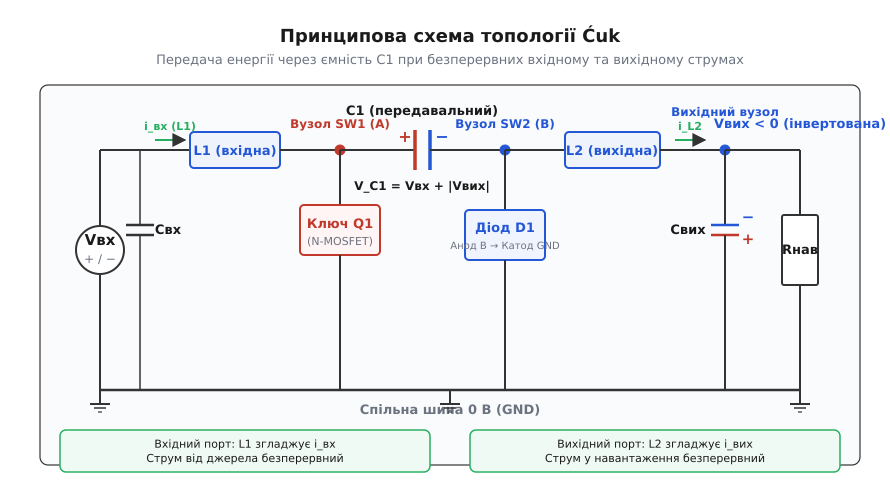
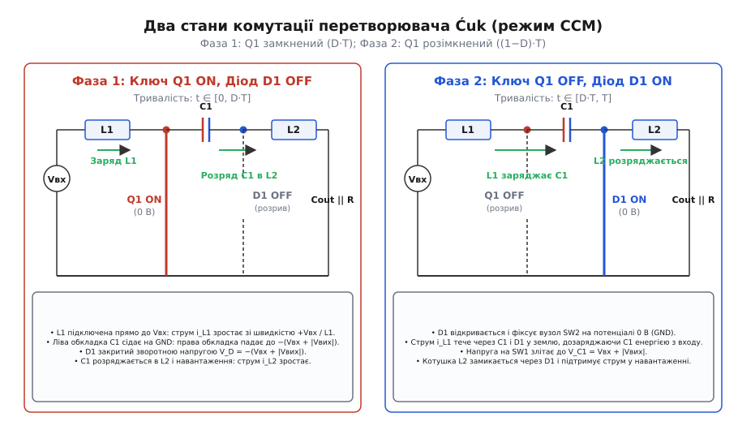
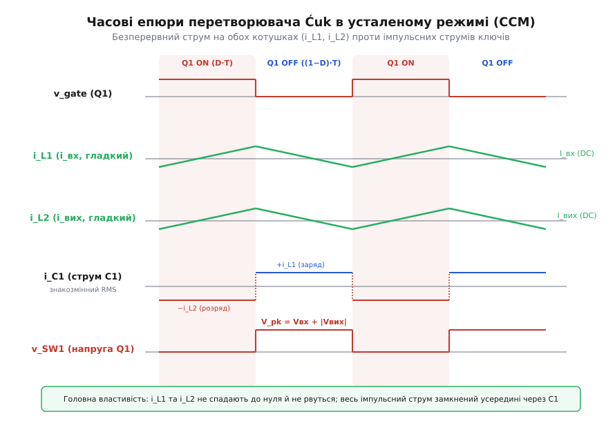
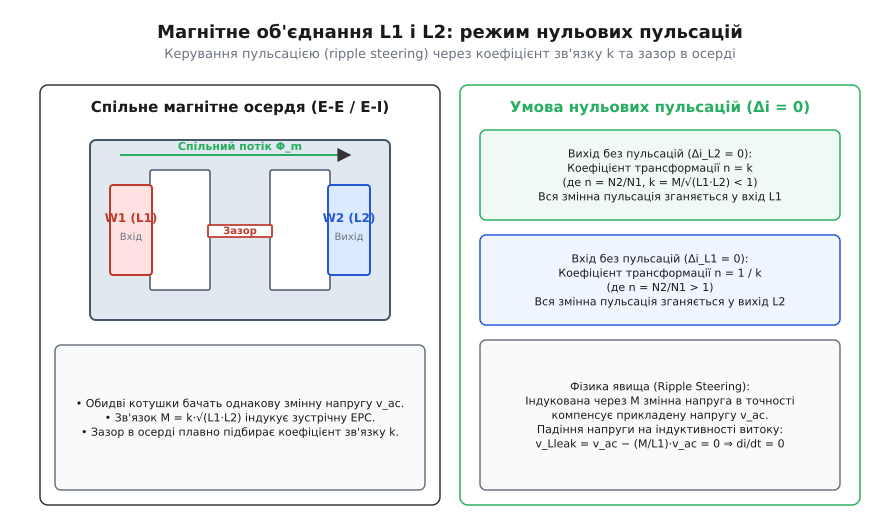
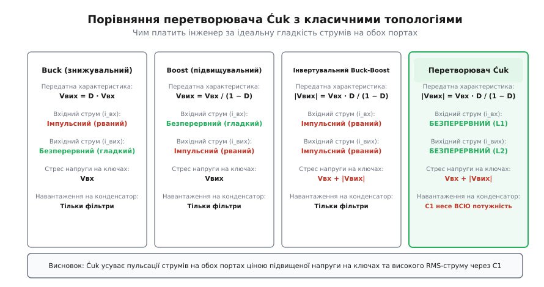

# Перетворювач Ćuk: безперервний струм на обох портах та ємнісна передача енергії

<preknowlist>
- [Знижувальний перетворювач Buck: широтно-імпульсне регулювання напруги](topic:electronics/buck)
- [Підвищувальний перетворювач Boost: вольт-секундний баланс індуктивності](topic:electronics/boost)
- [Інвертувальний перетворювач Buck-Boost: комбіноване регулювання](topic:electronics/buck-boost)
- [Зв'язані індуктивності та магнітний зв'язок на спільному осерді](topic:electronics/coupled-inductor)
- [Нуль у правій півплощині RHPZ: обмеження смуги пропускання зворотного зв'язку](topic:electronics/rhp-zero)
- [Динамічні та статичні втрати перемикання силових транзисторів](topic:electronics/switching-losses)
</preknowlist>

Кожен імпульсний перетворювач першого покоління — класичні топології buck, boost та інвертувальний buck-boost — змушує інженера миритися з розривом струму на одному або обох своїх портах. У знижувальному перетворювачі вхідний ключ щотакту рубає струм від джерела на різкі прямокутні імпульси, створюючи потужні електромагнітні завади на вхідній лінії живлення. У підвищувальному перетворювачі струм котушки перемикається діодом, вкидаючи у вихідний конденсатор такі ж рвані імпульси, що спричиняють високі високочастотні пульсації напруги на навантаженні. В інвертувальному buck-boost розривними є і вхідний, і вихідний струми: обидва порти бачать колосальні стрибки швидкості наростання струму `di/dt`.

Щоб згладити ці імпульси, розробники змушені нарощувати ємності вхідних і вихідних фільтрів або городити додаткові багаторівневі зовнішні LC-ланки. Але пасивні фільтри другого порядку додають власні паразитні резонанси, збільшують габарити друкованої плати та підвищують теплове навантаження на еквівалентному послідовному опорі (англ. *Equivalent Series Resistance*, ESR) конденсаторів.

У 1975 році Слободан Ћук (серб. *Slobodan Ćuk*, англ. *Slobodan Cuk*) у Каліфорнійському технологічному інституті (Caltech) під керівництвом професора Роберта Д. Мідлбрука запропонував фундаментальну зміну парадигми. Замість того щоб передавати порції енергії через магнітне поле котушки, перериваючи зв'язок з одним із портів, він переніс функцію накопичення та транспортування енергії на проміжний конденсатор, а дві котушки розмістив послідовно на вході та на виході перетворювача. Отримана топологія не лише забезпечила можливість як знижувати, так і підвищувати напругу з інверсією знака, а й зробила струми на обох портах абсолютно безперервними.


*Принципова схема топології Ćuk: вхідна індуктивність L1 і вихідна L2 забезпечують неперервність струмів, а проміжний конденсатор C1 здійснює передачу енергії з інверсією полярності напруги.*

### Перевертання ролей: як конденсатор став головним силовим мостом

У класичному інвертувальному перетворювачі buck-boost єдина індуктивність увімкнена паралельно між комутаційним вузлом і землею. Під час відкритого стану транзистора котушка накопичує енергію прямо від вхідного джерела, а вихідне коло в цей час повністю відрізане закритим діодом. Під час закритого стану транзистора індуктивність скидає накопичену енергію у вихідний конденсатор і навантаження, але тепер уже розірваним виявляється зв'язок із вхідним джерелом. Передача потужності відбувається у два розділені кроки через магнітне поле дроселя: вхід і вихід ніколи не обмінюються енергією одночасно.

Перетворювач Ćuk будується на принципі дуальності електричних кіл: індуктивності та ємності міняються місцями у своїх системних ролях.

Замість однієї котушки, що працює комутованим накопичувачем, у схемі встановлено дві постійно увімкнені індуктивності — вхідну `L1` та вихідну `L2`. Вони діють як джерела струму, що безперервно підтримують потік зарядів на вхідному та вихідному виводах. Силовим резервуаром, який переносить всю перетворювану потужність від входу до виходу, стає проміжний передавальний конденсатор `C1` (часто званий ємнісним мостом, літаючим конденсатором або зв'язувальною ємністю).

Вхідне джерело `Vвх` підімкнене до індуктивності `L1`. Другий вивід `L1` з'єднаний із вузлом комутації `SW1` (вузол A), до якого підключені силовий ключ `Q1` (зазвичай N-канальний польовий транзистор MOSFET, що замикає вузол на спільну шину 0 В) та ліва додатна обкладка конденсатора `C1`.

Права від'ємна обкладка конденсатора `C1` підімкнена до другого комутаційного вузла `SW2` (вузол B). До цього ж вузла під'єднані анод діода `D1` (чи синхронного ключа `Q2`), чий катод сидить на спільній шині 0 В, та вихідна індуктивність `L2`. Другий кінець котушки `L2` підімкнений до вихідного фільтруючого конденсатора `Свих` і навантаження `Rнав`.

Оскільки обидві індуктивності розташовані безпосередньо в лініях входу та виходу, струми `i_L1` та `i_L2` не зазнають миттєвих розривів. Їхня форма є гладкою постійною складовою з накладеними невеликими трикутними пульсаціями.

### Механізм двох фаз: шлях енергії крізь ємнісний бар'єр

Робота перетворювача у неперервному режимі провідності (англ. *Continuous Conduction Mode*, CCM) розпадається на дві послідовні фази протягом кожного періоду перемикання `T = 1 / f_sw`.


*Два комутаційні стани: у Фазі 1 ключ Q1 відкритий, діод D1 замкнений зворотним зміщенням, C1 розряджається в L2; у Фазі 2 ключ Q1 закритий, D1 відкривається, L1 дозаряджає C1.*

#### Фаза 1: Ключ Q1 замкнений, діод D1 закритий (інтервал `0 ≤ t < D · T`)

За сигналом драйвера транзистор `Q1` відкривається, притягуючи комутаційний вузол `SW1` майже впритул до потенціалу спільної шини (0 В).

1. До вхідної індуктивності `L1` виявляється прикладеною повна додатна напруга джерела `Vвх`:
```
v_L1 = Vвх − v_SW1
     = Vвх − 0        [потенціал відкритого ключа v_SW1 = 0 В]
     = Vвх            [результат віднімання]
```
Струм через котушку `i_L1` лінійно зростає від свого мінімального значення з похідною `di_L1 / dt = Vвх / L1`. Енергія від вхідного джерела закачується в магнітне поле котушки `L1`.

2. Ліва обкладка конденсатора `C1` через відкритий транзистор сідає на землю (0 В). Оскільки в усталеному режимі конденсатор `C1` постійно заряджений до середньої напруги `V_C1 = Vвх + |Vвих|` із плюсом ліворуч і мінусом праворуч, потенціал правого комутаційного вузла `SW2` миттєво падає до від'ємного значення:
```
v_SW2 = v_SW1 − V_C1
      = 0 − (Vвх + |Vвих|)    [підстановка середньої напруги C1]
      = −(Vвх + |Vвих|)       [від'ємний потенціал вузла]
```

3. Діод `D1`, увімкнений катодом до землі (0 В) та анодом до вузла `SW2`, потрапляє під дію глибокої запірної зворотної напруги `V_D1 = −(Vвх + |Vвих|)`. Діод надійно блокується і розриває зв'язок вузла `SW2` із землею.

4. Конденсатор `C1` виявляється увімкненим послідовно з вихідною котушкою `L2` та навантаженням. Енергія, накопичена в `C1` під час попереднього такту, починає перетікати у вихідний контур. Напруга на котушці `L2` дорівнює різниці потенціалів між вузлом `SW2` та вихідним вузлом `Vвих` (де діє від'ємна напруга `−|Vвих|`):
```
v_L2 = v_SW2 − Vвих
     = −(Vвх + |Vвих|) − (−|Vвих|)    [підстановка потенціалів вузлів]
     = −Vвх                           [скорочення модуля вихідної напруги]
```
Через те що струм індуктивності `i_L2` витікає з вихідного вузла до від'ємнішого вузла `SW2`, його абсолютна величина зростає зі швидкістю `d|i_L2| / dt = Vвх / L2`. Енергія з конденсатора `C1` одночасно живить навантаження та поповнює магнітне поле вихідного дроселя `L2`.

#### Фаза 2: Ключ Q1 розімкнений, діод D1 відкритий (інтервал `D · T ≤ t < T`)

Транзистор `Q1` вимикається, розриваючи шлях струму на землю через вузол `SW1`.

1. Неперервний струм індуктивності `i_L1` не може зупинитися миттєво. Він починає перетікати через конденсатор `C1` у вузол `SW2`. Наростаючий потенціал вузла `SW2` зміщує діод `D1` у прямому напрямку.

2. Діод `D1` відмикається, замикаючи анод на спільну шину і жорстко фіксуючи потенціал вузла `SW2` на рівні нуля вольтів (нехтуючи прямим падінням напруги на діоді `V_F ≈ 0.3–0.5 В` для діода Шотткі):
```
v_SW2 = 0
```

3. Оскільки права обкладка `C1` зафіксована на нулі, а напруга на конденсаторі дорівнює `V_C1`, потенціал лівого вузла `SW1` підстрибує вище вхідної напруги до значення `Vвх + |Vвих|`. Напруга на першій індуктивності змінює знак:
```
v_L1 = Vвх − v_SW1
     = Vвх − (Vвх + |Vвих|)    [потенціал вузла SW1 у Фазі 2]
     = −|Vвих|                 [скорочення вхідної напруги Vвх]
```
Струм `i_L1` лінійно спадає з похідною `di_L1 / dt = −|Vвих| / L1`. Енергія вхідного джерела та енергія, вивільнена з індуктивності `L1`, сумарно заряджають конденсатор `C1`, відновлюючи його заряд до початкового рівня.

4. Вихідна котушка `L2` через відкритий діод `D1` одним кінцем виявляється з'єднаною із землею (0 В). До неї прикладена напруга:
```
v_L2 = v_SW2 − Vвих
     = 0 − (−|Vвих|)    [потенціал відкритого діода v_SW2 = 0 В]
     = +|Vвих|          [додатна напруга на індуктивності]
```
Струм вихідної котушки плавно зменшується, повертаючи накопичену в магнітному полі енергію у вихідний конденсатор `Свих` і навантаження `Rнав`.


*Часові епюри усталеного стану: струми котушок i_L1 та i_L2 неперервні, а струм проміжного конденсатора i_C1 змінює напрямок щотакту, транспортуючи повну потужність.*

### Вольт-секундний баланс та виведення передатної характеристики

В усталеному періодичному стані середнє значення напруги на будь-якій ідеальній індуктивності за повний період перемикання `T` дорівнює строго нулю. Якщо б інтеграл напруги за період відрізнявся від нуля, струм через котушку монотонно зростав би або падав до нуля з кожним новим тактом.

Запишемо умову вольт-секундного балансу для вхідної індуктивності `L1`:

```
∫ v_L1 dt = 0
v_L1(Фаза 1) · D · T + v_L1(Фаза 2) · (1 − D) · T = 0
Vвх · D + (Vвх − V_C1) · (1 − D) = 0        [підстановка напруг фаз]
Vвх · D + Vвх · (1 − D) − V_C1 · (1 − D) = 0 [розкриття дужок]
Vвх − V_C1 · (1 − D) = 0                     [спрощення: D + 1 − D = 1]
V_C1 = Vвх / (1 − D)                         [середня напруга на C1]
```

Тепер складемо рівняння вольт-секундного балансу для вихідної індуктивності `L2`, враховуючи, що у Фазі 1 напруга на ній дорівнює `−V_C1 − Vвих`, а у Фазі 2 дорівнює `0 − Vвих`:

```
∫ v_L2 dt = 0
(−V_C1 − Vвих) · D · T + (0 − Vвих) · (1 − D) · T = 0
−V_C1 · D − Vвих · D − Vвих · (1 − D) = 0    [підстановка напруг фаз]
−V_C1 · D − Vвих · (D + 1 − D) = 0           [групування за Vвих]
−V_C1 · D − Vвих = 0                         [спрощення: D + 1 − D = 1]
Vвих = −D · V_C1                             [зв'язок виходу з напругою C1]
```

Підставимо вираз для середньої напруги конденсатора `V_C1 = Vвх / (1 − D)` у формулу вихідної напруги:

```
Vвих = −D · [Vвх / (1 − D)]
Vвих = −Vвх · [D / (1 − D)]
```

Або у формі відношення абсолютних величин:

```
|Vвих| = Vвх · D / (1 − D)
```

Перевіримо середню напругу на передавальному конденсаторі `C1`:

```
V_C1 = Vвх / (1 − D)
     = Vвх · (1 − D + D) / (1 − D)             [тотожне перетворення 1 = 1 - D + D]
     = Vвх · (1 − D)/(1 − D) + Vвх · D/(1 − D) [почленне ділення]
     = Vвх + |Vвих|                            [підстановка виразу для |Vвих|]
```

Середня напруга на проміжному конденсаторі `C1` завжди дорівнює алгебраїчній сумі вхідної напруги та модуля вихідної напруги.

Передатна характеристика перетворювача Ćuk за модулем повністю ідентична характеристикам неізольованого buck-boost та SEPIC:
- При коефіцієнті заповнення `D < 0.5` перетворювач працює як **знижувальний** (`|Vвих| < Vвх`). Наприклад, при `D = 0.25` отримуємо `|Vвих| = Vвх · 0.25 / 0.75 = Vвх / 3`.
- При `D = 0.5` напруга на виході за модулем точно дорівнює вхідній (`|Vвих| = Vвх`).
- При `D > 0.5` перетворювач працює як **підвищувальний** (`|Vвих| > Vвх`). Наприклад, при `D = 0.75` маємо `|Vвих| = Vвх · 0.75 / 0.25 = 3 · Vвх`.

Детальний математичний апарат з усередненням у просторі станів (state-space averaging), матрицями стану та аналізом малих сигналів викладено у вставці [математичне виведення передатної характеристики та умови нульових пульсацій](topic:electronics/cuk-converter/math-cuk-transfer.md).

### Баланс заряду конденсатора та співвідношення струмів

Застосуємо закон збереження заряду (ампер-секундний баланс) для передавального конденсатора `C1`. В усталеному періодичному стані середній струм через ємність за період дорівнює строго нулю:

- У Фазі 1 (тривалість `D · T`) через конденсатор `C1` протікає струм вихідної індуктивності `i_L2` (у напрямку розряду ємності).
- У Фазі 2 (тривалість `(1 − D) · T`) конденсатор заряджається струмом вхідної індуктивності `i_L1`.

```
∫ i_C1 dt = 0
−I_L2 · D · T + I_L1 · (1 − D) · T = 0       [ампер-секундний інтеграл]
I_L1 · (1 − D) = I_L2 · D
I_L1 / I_L2 = D / (1 − D)                    [співвідношення середніх струмів]
```

Оскільки середній струм вхідної котушки `I_L1` дорівнює постійному струму споживання від джерела `Iвх`, а середній струм вихідної котушки `I_L2` дорівнює струму навантаження `Iвих`, отримуємо:

```
Iвх / Iвих = D / (1 − D)
Iвх = Iвих · D / (1 − D)
```

Перемноживши вирази для напруги та струму, переконуємося у виконанні закону збереження енергії для ідеального перетворювача:

```
Pвх = Vвх · Iвх
    = Vвх · [Iвих · D / (1 − D)]    [підстановка виразу для Iвх]
    = [Vвх · D / (1 − D)] · Iвих    [перегрупування співмножників]
    = |Vвих| · Iвих                 [підстановка виразу для |Vвих|]
    = Pвих                          [вихідна потужність]
```

Вхідна потужність джерела живлення без втрат перетворюється у вихідну потужність навантаження.

### Вбудована двостороння фільтрація та зниження завад

Найбільша практична перевага топології Ćuk перед класичними імпульсними перетворювачами полягає у формі струмів, що перетинають вхідний і вихідний порти.

У звичайному підвищувальному перетворювачі boost вихідний діод проводить струм лише протягом частини періоду `(1 − D) · T`. Коли вхідний транзистор відкритий, струм із випрямляча раптово падає до нуля. Вихідний фільтруючий конденсатор змушений приймати на себе повний розмах імпульсного струму навантаження з крутими фронтами комутації. Це викликає три серйозні проблеми:
1. Високочастотний шум комутації легко долає паразитну індуктивність виводів конденсатора (ESL) і виходить на шину живлення навантаження у вигляді гострих голок.
2. Протікання великого середньоквадратичного струму (RMS ripple current) через паразитний опір ESR викликає інтенсивний саморозігрів вихідних конденсаторів, скорочуючи термін служби електролітичних ємностей у рази.
3. Амплітуда пульсацій вихідної напруги пропорційна повному вихідному струму: `ΔVвих ≈ Iвих · D / (Свих · f_sw)`.

У перетворювачі Ćuk вихідна індуктивність `L2` включена послідовно безпосередньо перед вихідним вузлом. Струм у навантаження та вихідний конденсатор подається не розірваними прямокутними імпульсами, а гладким постійним струмом із невеликими трикутними коливаннями `Δi_L2`.

Амплітуда пульсації напруги на виході визначається лише інтегралом цієї маленької трикутної ділянки:

```
ΔVвих = Δi_L2 / (8 · Свих · f_sw)
```

При типовому значенні пульсацій струму дроселя `Δi_L2 = 0.2 · Iвих` амплітуда пульсацій вихідної напруги в топології Ćuk виявляється у десятки разів меншою, ніж у звичайному boost чи buck-boost при однакових значеннях ємності `Свих` і робочої частоти `f_sw`.

Аналогічна картина спостерігається і на вхідному порту. Вхідна котушка `L1` згладжує споживання струму від джерела живлення, ліквідуючи паразитні радіозавади та захищаючи чутливі акумуляторні батареї чи вхідні мережеві фільтри від високочастотного струмового удару.

### Зв'язані індуктивності та феномен нульових пульсацій (Ripple Steering)

Особлива властивість перетворювача Ćuk, яка виділяє його серед усіх імпульсних схем, відкривається при аналізі форми змінної напруги на котушках.

Порівняємо миттєві напруги на `L1` та `L2` у кожній із фаз комутації:
- У Фазі 1: на котушці `L1` діє напруга `+Vвх`, а на котушці `L2` — напруга `−Vвх` (з урахуванням напрямку витків).
- У Фазі 2: на котушці `L1` діє напруга `−|Vвих|`, а на котушці `L2` — напруга `+|Vвих|`.

Форми змінної складової напруги на обох індуктивностях виявляються абсолютно ідентичними за формою та синхронними за часом протягом усього періоду перемикання.

Це означає, що дві окремі котушки `L1` та `L2` можна намотати на **одному спільному магнітному осерді**.


*Зв'язані індуктивності: завдяки спільній змінній напрузі v_ac магнітний зв'язок M скеровує всю пульсацію струму в одну з обмоток, зводячи пульсацію струму на протилежному порту до точного нуля.*

Об'єднання двох дроселів на одному осерді дає не просто економію габаритів і маси на друкованій платі. Завдяки явищу взаємоіндукції з'являється можливість повністю обнулити пульсації струму на одному з портів — ефект, відомий в інженерії як **керування пульсаціями** (англ. *ripple steering*).

#### Фізичний механізм компенсації витоків

Розглянемо систему двох магнітно зв'язаних обмоток із коефіцієнтом зв'язку `k = M / √(L1 · L2)` та коефіцієнтом трансформації витків `n = N2 / N1 = √(L2 / L1)`.

Рівняння напруг для пари зв'язаних обмоток записуються через власні індуктивності та взаємну індуктивність `M`:

```
v_1 = L1 · (di_1 / dt) + M · (di_2 / dt)
v_2 = M · (di_1 / dt) + L2 · (di_2 / dt)
```

Розв'яжемо цю систему відносно швидкості зміни струму у вторинній (вихідній) обмотці `di_2 / dt`:

```
di_2 / dt = (L1 · v_2 − M · v_1) / (L1 · L2 − M²)
```

Оскільки форми змінної напруги на обмотках синхронізовані перемиканням ключів, маємо `v_1 = v_ac` та `v_2 = n · v_ac`. Підставимо ці вирази у формулу:

```
di_2 / dt = (L1 · n · v_ac − M · v_ac) / [L1 · L2 · (1 − k²)]     [вираз для зв'язаних котушок]
          = v_ac · (n · L1 − k · √(L1 · L2)) / [L1 · L2 · (1 − k²)] [підстановка взаємоіндукції M]
          = v_ac · (n · L1 − k · n · L1) / [L1 · L2 · (1 − k²)]     [підстановка L2 = n²·L1]
          = [v_ac · L1 / (L1 · L2 · (1 − k²))] · (n − k · n)        [винесення спільного множника]
```

Звідси чітко видно: якщо підібрати співвідношення витків так, щоб виконувалася умова:

```
n = k     (де n = N2 / N1, а k = M / √(L1 · L2) < 1)
```

Тоді чисельник виразу перетворюється на нуль:

```
di_2 / dt = 0
```

Пульсація вихідного струму `Δi_L2` стає **рівною строго нулю**.

Змінна ЕРС взаємоіндукції, наведена з первинної обмотки через спільний магнітний потік осердя, у кожну мить періоду комутації точно врівноважує прикладену зовнішню змінну напругу. У результаті спад змінної напруги на паразитній індуктивності витоку вторинної обмотки виявляється рівним нулю, і струм у вихідній лінії перетворюється на ідеально рівну горизонтальну лінію постійного струму.

Куди дівається змінна складова струму? Вся енергія пульсацій «перекачується» у первинну обмотку `L1`. Пульсації струму на вході дещо зростають, проте вихідний струм стає абсолютно гладким без потреби у додаткових LC-фільтрах.

Якщо ж завдання полягає в отриманні ідеально чистого споживання струму від вхідного джерела (наприклад, у сонячних панелях для безперервного утримання точки MPP чи в чутливих вимірювальних давачах), обмотки розраховують за симетричною умовою:

```
n = 1 / k     (де n = N2 / N1 > 1)
```

У цьому режимі до нуля зводиться пульсація вхідного струму (`Δi_L1 = 0`), а вся пульсація струму скидається у вихідний дросель.

На практиці коефіцієнт зв'язку `k` має технологічний розкид через геометрію намотки. Щоб точно виставити умову нуля без перемотування витків, застосовують регулювання положення **повітряного зазору** в осерді: зміщення зазору ближче до однієї з обмоток перерозподіляє магнітний потік витоку і точно підганяє ефективне значення `k`.

### Переривчастий режим провідності (DCM) та граничні режими

При зменшенні струму навантаження або збільшенні періоду перемикання перетворювач може виходити з режиму CCM у переривчастий режим провідності (англ. *Discontinuous Conduction Mode*, DCM).

Оскільки перетворювач Ćuk має дві окремі індуктивності та один передавальний конденсатор, у ньому можливі три різні типи переривчастого режиму:
1. **DCM по струму вхідної котушки L1**: струм `i_L1` спадає до нуля до закінчення фази вимкненого стану ключа `Q1`.
2. **DCM по струму вихідної котушки L2**: струм `i_L2` спадає до нуля раніше закінчення такту.
3. **Переривчастий режим по напрузі конденсатора C1** (DVM): напруга на `C1` спадає до нуля протягом частини періоду (спостерігається при дуже малих ємностях `C1`).

У класичному виконанні зазвичай проектують індуктивності так, щоб при зниженні навантаження першим до нуля спадав струм випрямного діода `D1`. Коли сумарний струм `i_L1 + i_L2`, що протікає через діод `D1` у Фазі 2, падає до нуля, діод закривається раніше, ніж відкриється транзистор `Q1`.

Утворюється третя фаза такту (інтервал розриву провідності тривалістю `D3 · T`), під час якої і `Q1`, і `D1` одночасно закриті. У цій фазі комутаційні вузли переходять у високоімпедансний стан, а напруга на виході починає залежати не лише від шпаруватості `D`, а й від опору навантаження `Rнав`:

```
|Vвих| = Vвх · D / √(K)
де параметр безрозмірної провідності K = 2 · L_eq / (Rнав · T), а L_eq = (L1 · L2) / (L1 + L2).
```

При переході в DCM коефіцієнт підсилення схеми на холостому ході різко зростає, що вимагає від системи керування зменшення коефіцієнта заповнення `D` майже до нуля для утримання стабільної напруги.

### Синхронне випрямлення та двонапрямлена передача енергії

У класичній схемі пряме падіння напруги на діоді `D1` (`V_F ≈ 0.4–0.7 В`) створює постійні статичні втрати потужності:

```
P_D1 = V_F · I_D1,avg = V_F · (Iвх + Iвих) · (1 − D)
```

При низьких вихідних напругах (наприклад, −3.3 В чи −5 В) втрати на діоді можуть забирати від 10% до 18% загальної потужності, знижуючи ККД перетворювача до 80–84%.

Для подолання цієї проблеми діод `D1` замінюють синхронним польовим транзистором `Q2` (N-MOSFET або P-MOSFET).

#### Особливості синхронного керування

Керування синхронним ключем у перетворювачі Ćuk вимагає врахування потенціалів вузла `SW2`:
- Коли головний ключ `Q1` відкритий, потенціал вузла `SW2` падає до від'ємного рівня `−(Vвх + |Vвих|)`.
- Коли `Q1` закритий, вузол `SW2` з'єднується через `Q2` з землею (0 В).

Якщо для `Q2` використовується N-канальний MOSFET (витік підімкнений до вузла `SW2`, стік — до землі 0 В), його затвор потрібно живити відносно плаваючого потенціалу витоку `SW2`. Для цього застосовують ізольований або спеціальний рівнезсувний драйвер затвора з негативним живленням.

#### Двонапрямлений режим

Застосування синхронного транзистора `Q2` замість діода не дозволяє струму перериватися: струм через `Q2` може вільно протікати в обох напрямках. Перетворювач принципово позбавляється переривчастого режиму DCM і залишається в режимі неперервної провідності (CCM) аж до нульового навантаження.

Більше того, повністю синхронний перетворювач Ćuk стає **двонапрямленим**: він може автоматично передавати енергію як від входу `Vвх` до від'ємного виходу `Vвих`, так і у зворотному напрямку — від від'ємного джерела `Vвих` у додатну шину `Vвх`.

### Ціна переваг: стрес компонентів та динамічна складність

Топологія Ćuk не витіснила всі інші схеми, оскільки за усунення пульсацій струму доводиться платити високою напругою на силових ключах, значним навантаженням на конденсатор `C1` та складною динамікою регулювання.


*Порівняння навантаження: перетворювач Ćuk забезпечує гладкі струми на обох портах, проте піддає ключ Q1, діод D1 та конденсатор C1 стресу сумарної напруги Vвх + |Vвих|.*

#### 1. Напруга на ключі Q1 та діоді D1

У фазі закритого стану напруга на розімкненому ключі `Q1` сягає потенціалу зарядженого конденсатора `C1`:
```
V_Q1,max = Vвх + |Vвих| = Vвх / (1 − D)
```

Точно таку ж запірну напругу відчуває закритий діод `D1` (чи синхронний ключ `Q2`) у протилежній фазі:
```
V_D1,max = Vвх + |Vвих| = Vвх / (1 − D)
```

Для порівняння: у звичайному знижувальному перетворювачі buck ключ витримує лише `Vвх`, а в boost — лише `Vвих`. У перетворювачі Ćuk напівпровідники повинні обиратися з запасом на суму обох напруг. При перетворенні 24 В у −24 В (`D = 0.5`) напруга на ключі та діоді становитиме щонайменше 48 В плюс комутаційні викиди від індуктивностей витоку. Це вимагає використання MOSFET з більшим опором відкритого каналу `R_DS(on)` або високовольтних діодів Шотткі з більшим прямим падінням напруги.

#### 2. Струмове навантаження конденсатора C1

Увесь потік активної потужності від джерела до навантаження протікає через проміжний конденсатор `C1`. Середньоквадратичне (RMS) значення змінного струму через `C1` виражається формулою:

```
I_C1,rms = √(D · (1 − D)) · (Iвх + Iвих)
```

При перетворенні 12 В у −12 В (`D = 0.5`) та струмі навантаження `Iвих = 2 А` (`Iвх = 2 А`):
```
I_C1,rms = √(0.5 · 0.5) · (2 + 2) = 0.5 · 4 = 2 А
```

Через конденсатор безперервно протікає діючий високочастотний струм силою 2 А. Звичайні алюмінієві електролітичні конденсатори в цьому вузлі непридатні: їхній високий опір ESR призведе до перегріву та закипання електроліту за лічені хвилини.

У перетворювачах Ćuk як `C1` застосовують лише багатошарові керамічні конденсатори класу X7R/X5R (MLCC), полімерні твердотільні конденсатори або високоякісну металізовану поліпропіленову плівку.

#### 3. Динаміка 4-го порядку та нуль у правій півплощині (RHPZ)

Математична модель перетворювача Ćuk містить чотири реактивні накопичувачі енергії: дві індуктивності (`L1`, `L2`) та дві ємності (`C1`, `Свих`). Це динамічна система **четвертого порядку**.

Передатна функція від шпаруватості до вихідної напруги `G_vd(s) = v_вих(s) / d(s)` містить:
- Два резонансні полюси від вихідного контуру `L2 − Свих`.
- Додаткову пару резонансних полюсів від контуру перенесення енергії `L1 − C1 − L2`.
- **Нуль у правій півплощині комплексної площини** (англ. *Right-Half-Plane Zero*, RHPZ).

Наявність RHP-нуля викликає специфічну реакцію перетворювача на стрибок навантаження: при різкому збільшенні коефіцієнта заповнення `D` (спроба швидко підняти вихідну напругу) вихідна напруга в перший момент часу просідає ще глибше, тому що більшу частину періоду енергія починає йти на заряджання `L1`, тимчасово відбираючи потужність від виходу.

RHP-нуль додає додатковий фазовий зсув на −90°, не зменшуючи при цьому коефіцієнт підсилення в петлі регулювання. Через це частоту зрізу петлі зворотного зв'язку доводиться обмежувати рівнем, що не перевищує 1/3–1/5 від частоти RHP-нуля, а в контурі стабілізації обов'язково застосовувати компенсатор 3-го типу (Type-III) на базі операційного підсилювача або точне цифрове PID-керування.

### Практичний розрахунок компонентів на числовому прикладі

Для закріплення інженерної методики розрахуємо силовий каскад перетворювача Ćuk для живлення прецизійного аналогового тракту з такими параметрами:
- Вхідна напруга: `Vвх = 12 В` (номінальна).
- Вихідна напруга: `Vвих = −12 В` (інвертована від'ємна шина).
- Струм навантаження: `Iвих = 2 А` (вихідна потужність `Pвих = 24 Вт`).
- Частота перемикання: `f_sw = 100 кГц` (період `T = 10 мкс`).
- Допустима пульсація струму в котушках: `Δi = 30%` від середнього струму.
- Допустима пульсація напруги на `C1`: `ΔV_C1 ≤ 5%` від `V_C1`.
- Допустима пульсація вихідної напруги: `ΔVвих ≤ 10 мВ`.

#### Крок 1: Розрахунок коефіцієнта заповнення D

```
|Vвих| = Vвх · D / (1 − D)
12 = 12 · D / (1 − D)  ⇒  D / (1 − D) = 1  ⇒  D = 0.5
```

#### Крок 2: Розрахунок струмів схеми

Середній вхідний струм:
```
Iвх = Iвих · D / (1 − D) = 2 · 0.5 / 0.5 = 2 А
```

Амплітуда пульсацій струму вхідної котушки `L1`:
```
Δi_L1 = 0.3 · Iвх = 0.3 · 2 А = 0.6 А
```

Амплітуда пульсацій струму вихідної котушки `L2`:
```
Δi_L2 = 0.3 · Iвих = 0.3 · 2 А = 0.6 А
```

#### Крок 3: Розрахунок індуктивностей L1 та L2

У Фазі 1 до індуктивності `L1` прикладена напруга `Vвх` протягом часу `D · T`:
```
L1 = Vвх · D · T / Δi_L1
   = 12 В · 0.5 · 10 мкс / 0.6 А    [підстановка параметрів режиму]
   = 60 мкВ·с / 0.6 А               [перемноження чисельника]
   = 100 мкГн                       [розрахункова індуктивність L1]
```

Для вихідної індуктивності `L2`:
```
L2 = Vвх · D · T / Δi_L2
   = 12 В · 0.5 · 10 мкс / 0.6 А    [підстановка параметрів режиму]
   = 60 мкВ·с / 0.6 А               [перемноження чисельника]
   = 100 мкГн                       [розрахункова індуктивність L2]
```

Обидві індуктивності обираються номіналом по 100 мкГн.

#### Крок 4: Розрахунок проміжного конденсатора C1

Середня напруга на конденсаторі:
```
V_C1 = Vвх + |Vвих| = 12 + 12 = 24 В
```

Допустима амплітуда пульсації напруги на `C1`:
```
ΔV_C1 = 0.05 · 24 В = 1.2 В
```

Під час Фази 1 конденсатор `C1` розряджається струмом `Iвих` протягом часу `D · T`:
```
C1 = Iвих · D · T / ΔV_C1
   = 2 А · 0.5 · 10 мкс / 1.2 В    [підстановка струму розряду і часу]
   = 10 мкКл / 1.2 В               [інтеграл заряду]
   ≈ 8.33 мкФ                      [розрахункова ємність C1]
```

Обираємо стандартний номінал керамічного конденсатора **10 мкФ** на робочу напругу не менше **50 В** (з урахуванням ефекту падіння ємності кераміки під постійною напругою DC-bias).

Середньоквадратичний струм через `C1`:
```
I_C1,rms = √(0.5 · 0.5) · (2 + 2) = 2.0 А
```

Обраний конденсатор повинен мати допустимий струм пульсацій (ripple current rating) не менше 2.5 А RMS на частоті 100 кГц.

#### Крок 5: Розрахунок вихідного фільтруючого конденсатора Свих

Вихідний конденсатор згладжує лише трикутну пульсацію струму `Δi_L2 = 0.6 А`:
```
Свих = Δi_L2 / (8 · ΔVвих · f_sw)
     = 0.6 А / (8 · 0.01 В · 100 000 Гц)    [підстановка амплітуди пульсацій]
     = 0.6 / 8000                           [перемноження знаменника]
     = 75 мкФ                               [розрахункова вихідна ємність]
```

Обираємо паралельне з'єднання двох керамічних конденсаторів по **47 мкФ** (сумарно 94 мкФ) з ультранизьким ESR.

#### Крок 6: Вибір силового транзистора Q1 та діода D1

Максимальна запірна напруга:
```
V_Q1,max = V_D1,max = Vвх + |Vвих| = 24 В
```

З урахуванням 50% інженерного запасу на викиди обираємо компоненти з робочою напругою **не менше 40–60 В**.

Піковий струм через транзистор і діод у момент комутації:
```
I_pk = Iвх + Iвих + (Δi_L1 + Δi_L2) / 2
     = 2 + 2 + (0.6 + 0.6) / 2    [підстановка середніх і пульсуючих струмів]
     = 4.6 А                      [піковий струм ключів]
```

Транзистор обирається на струм не менше 10 А (наприклад, N-MOSFET з `R_DS(on) ≤ 15 мОм`), а діод — діод Шотткі на 5–10 А з низьким прямим падінням напруги (або синхронний польовий транзистор).

Повний програмний код числової симуляції перехідних процесів та розрахунку теплових втрат наведено у вставці [інженерний розрахунок та числову модель симуляції перетворювача Ćuk](topic:electronics/cuk-converter/proj-cuk-sim.md).

### Трасування друкованої плати та мінімізація високочастотних контурів

Хоча струми на зовнішніх портах перетворювача Ćuk є гладкими й неперервними, усередині самої схеми існує внутрішній контур швидкої комутації струму (англ. *hot loop*).

Цей контур утворений транзистором `Q1`, проміжним конденсатором `C1` та діодом `D1`. 
- У Фазі 1 струм протікає по контуру `Q1 → C1 → вузол SW2`.
- У Фазі 2 струм миттєво перемикається у контур `вузол SW1 → C1 → D1`.

Швидкість зміни струму в цьому внутрішньому контурі сягає сотень амперів за мікросекунду (`di/dt > 100 А/мкс`). Будь-яка паразитна індуктивність доріжок між виводами `Q1`, `C1` та `D1` викличе потужний високочастотний дзвін напруги та паразитне випромінювання завад.

Основні правила проектування топології плати для схеми Ćuk:
1. Конденсатор `C1` повинен бути встановлений фізично якомога ближче між стоком `Q1` та катодом `D1`. Площа контуру `Q1 − C1 − D1` має бути зведена до мінімально можливого геометричного п'ятачка.
2. Під комутаційним контуром на сусідньому шарі друкованої плати повинен розміщуватися суцільний полігон землі (GND plane) без розрізів, який екранує електромагнітні поля методом зворотного струму.
3. Комутаційні вузли `SW1` та `SW2` мають високу швидкість зміни напруги `dv/dt`. Їхні полігони слід робити мінімальної площі, достатньої для тепловідведення, щоб уникнути паразитної ємнісної наводки на сусідні аналогові доріжки.

### Сфери застосування та практичний вибір топології

Попри підвищену складність динаміки та вимоги до компонентів, перетворювач Ćuk залишається стандартом у низці спеціалізованих областей силової електроніки:

1. **Двополярне живлення прецизійної аналогової апаратури**: Формування стабільної від'ємної шини живлення (−5 В, −12 В, −15 В) для операційних підсилювачів, високошвидкісних АЦП і ЦАП. Безперервний струм на виході гарантує мінімальний рівень шуму без громіздких лінійних стабілізаторів після перетворювача.
2. **Радіочастотні тракти (RF) та системи бездротового зв'язку**: Живлення чутливих підсилювачів потужності та малошумливих приймачів (LNA), де будь-які імпульсні викиди струму відбиваються у вигляді інтермодуляційних спотворень у радіоефірі.
3. **Вимірювальна техніка та сонячна енергетика**: Робота в режимі нульових вхідних пульсацій дозволяє відбирати струм від фотоелектричних панелей чи вимірювальних мостів без зашумлення сигналів і без зриву алгоритмів пошуку точки максимальної потужності.

---
