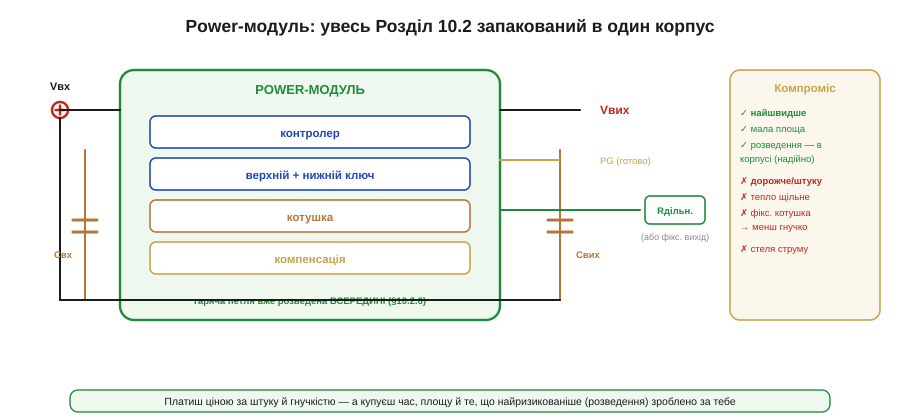

# 🔌 Power-модулі «все в одному»: за що платимо

Найвищий рівень інтеграції силового перетворювача — коли цілий пристрій уже зібрано в один корпус.

### Клас пристрою

**Power-модуль** (power module, часто *μModule*, *POL-модуль*) — це готовий перетворювач у єдиному корпусі: усередині вже є **все**, з чого складають імпульсний перетворювач — [контролер](topic:electronics/controller-fsw), обидва силові ключі, **котушка** (inductor) й навіть компенсація (compensation). Зовні лишається додати кілька конденсаторів і (якщо вихід регульований) пару резисторів. По суті, виробник продав вам не мікросхему, а **готову шину живлення**.

Чому взагалі виникає окремий «клас», а не просто ще одна мікросхема? Бо в дискретному перетворювачі найбільше клопоту дає не сам контролер, а **фізичне розведення** навколо нього: [гаряча петля](topic:electronics/converter-layout), узгодження котушки за насиченням і опором, теплові містки. Усе це треба зробити правильно з першого разу, інакше схема або шумить, або не запускається, або деградує під навантаженням. Модуль розв'язує проблему радикально — він **прибирає саму задачу розведення** з вашої плати, переносячи її всередину корпусу, де виробник уже зробив її один раз і перевірив на мільйонах штук. Ви купуєте не транзистори й котушку, а **гарантію, що силова частина працює**.

> 🔧 **Навіщо це.** Коли в embedded-проєкті треба «просто дати 3.3 В на ESP32 і периферію» і часу на доведення силової схеми немає, модуль економить тижні. Ви ставите його так само просто, як LDO, але отримуєте ККД імпульсника. За це й платять — грошима та гнучкістю.

### Блок-схема плати


*Усередині корпусу — контролер, верхній і нижній ключі, котушка й компенсація; гаряча петля розведена прямо в модулі. Зовні — лише вхідний і вихідний конденсатори, опційний дільник зворотного зв'язку та сигнали EN/PG. Праворуч — компроміс: швидко й надійно, але дорожче й менш гнучко.*

Уся складна частина — силова петля, драйвери, узгодження котушки з контролером — уже всередині й перевірена виробником. Ваша плата зводиться до «причепити живлення й конденсатори».

#### Де живе гаряча петля

Найважливіше на цій блок-схемі — те, чого на вашій платі **не буде**. [Гаряча петля](topic:electronics/converter-layout) (hot loop) — це контур, яким тече **переривчастий** струм — від вхідного конденсатора через верхній ключ, через котушку до виходу і назад через нижній ключ. Двічі за період комутації цей струм різко вмикається й вимикається, тому в петлі тече di/dt у десятки ампер за мікросекунду. На будь-якій паразитній індуктивності L доріжки це народжує викид напруги:

```
V_spike = L_loop · (di/dt)
```

Саме тому в дискретній схемі гарячу петлю роблять фізично крихітною — кожен зайвий міліметр доріжки додає ~1 нГн, а на 20 А/мкс навіть 5 нГн дають 0.1 В дзвону, який множиться частотою комутації в кондуктивний і випромінюваний шум (EMI).

У модулі ця петля **замкнена всередині корпусу** — між інтегрованими ключами й інтегрованою котушкою лежать міліметри внутрішньої металізації, а не сантиметри ваших доріжок. Ось чому виробник кладе вхідний конденсатор прямо в корпус (або вимагає поставити його впритул до VIN): петля має лишитися короткою. Для вас наслідок прямий: **ви не можете зіпсувати те, що недоступне**. Гаряча петля — головне джерело провалів дискретного дизайну — у модулі вже зведена до мінімуму й не залежить від якості вашого трасування. Це і є та «найризикованіша частина, зроблена за вас».

> 🔧 **Навіщо це.** Якщо ваш виріб має проходити сертифікацію на EMI, модуль різко піднімає шанси пройти з першого разу: основне джерело випромінювання — гаряча петля — уже оптимізоване й екрановане корпусом. На дискретній схемі та сама петля — найчастіша причина провалу передсертифікаційних замірів.

### Типова розпіновка

```
VIN    вхідне живлення
GND    спільний нуль
VOUT   стабілізований вихід
EN     дозвіл (enable): підтягнути високим, щоб увімкнути
FB     зворотний зв'язок (дільник задає Vвих) — або VSEL/фіксований
PG     power good: «вихід у нормі» (сигнал готовності)
```

### Підключення

VIN — до входу з вхідним конденсатором поруч; VOUT — до навантаження з вихідним конденсатором; GND — на полігон землі. EN підтягують високим (або керують ним від МК для ввімкнення на вимогу). FB — через дільник або, у версії з фіксованим виходом, прямо до VOUT чи до виводу вибору напруги. PG зручно завести в МК — він скаже, коли шина піднялася.

#### Як FB задає вихідну напругу

Чому взагалі є вивід FB і навіщо дільник? Бо контролер усередині модуля вміє утримувати лише одну річ — **щоб напруга на виводі FB дорівнювала його внутрішньому опорному джерелу** V_оп (зазвичай 0.6–0.8 В). Усе. Він підкручує шпаруватість ключів доти, доки FB не зрівняється з V_оп. Якби ми завели весь VOUT прямо на FB, контролер тримав би вихід рівним 0.6 В — і це все, що він уміє «з коробки».

Дільник (Rверх між VOUT і FB, Rниз між FB і землею) — це спосіб **обдурити** контролер у потрібний бік. Він бачить не весь VOUT, а лише його частку:

```
V_FB = VOUT · Rниз / (Rверх + Rниз)
```

Контролер заганяє цю частку до V_оп. Прирівнюємо й виражаємо вихід:

```
V_оп = VOUT · Rниз / (Rверх + Rниз)
VOUT = V_оп · (Rверх + Rниз) / Rниз
VOUT = V_оп · (1 + Rверх / Rниз)
```

Це та сама формула [дільника зворотного зв'язку](topic:electronics/feedback-stability). Чим більший Rверх відносно Rниз, тим сильніше «приховано» вихід і тим вищу напругу контролер мусить підняти, щоб частка на FB дотягнулася до опорної. У фіксованій версії цей дільник зашитий усередину — тому там FB немає взагалі, лише вивід вибору або прямий VOUT.

**Воркд-приклад: дільник для 3.3 В.** Модуль із V_оп = 0.8 В, треба вихід 3.3 В для шини ESP32. Виберемо Rниз і знайдемо Rверх.

```
крок 1 — беремо Rниз зі здорового діапазону (десятки кОм,
         щоб струм дільника був малий, але завадостійкий):
         Rниз = 10.0 кОм

крок 2 — з VOUT = V_оп·(1 + Rверх/Rниз) виражаємо Rверх:
         Rверх = Rниз · (VOUT/V_оп − 1)
         Rверх = 10.0 кОм · (3.3/0.8 − 1)
         Rверх = 10.0 кОм · (4.125 − 1)
         Rверх = 10.0 кОм · 3.125
         Rверх = 31.25 кОм

крок 3 — найближчий E96-номінал: 31.6 кОм. Перевіримо реальний вихід:
         VOUT = 0.8 · (1 + 31.6/10.0)
         VOUT = 0.8 · 4.16
         VOUT = 3.328 В   → відхил +0.8 %, у межах допуску ESP32

крок 4 — струм дільника (втрати на «підглядання»):
         I_дільн = VOUT / (Rверх + Rниз)
         I_дільн = 3.328 / (31.6 + 10.0) кОм
         I_дільн = 3.328 / 41.6 кОм ≈ 80 мкА
```

Висновок: два резистори E96-ряду задають 3.328 В замість бажаних 3.3 В — похибка нижча за власну точність опорного джерела модуля, а дільник «з'їдає» лише ~80 мкА. Якби нам треба було 5.0 В з того ж модуля, Rверх вийшов би 52.5 кОм (найближчий 52.3 кОм) — той самий рецепт, лише інша частка.

> 🔧 **Навіщо це.** Один модуль із FB-дільником закриває будь-яку напругу шини — 3.3 В для логіки, 5 В для USB/сенсорів, 1.8 В для пам'яті — без зміни самого модуля. Тому в інженерному наборі тримають кілька регульованих модулів і «програмують» їх парою резисторів під конкретну плату.

### «Перший байт»

Коду немає — модуль аналоговий. «Заговорити» з ним просто: подати VIN, підтягнути EN високим — і на VOUT з'явиться стабілізована напруга, а PG підскочить, коли вона ввійде в норму. Усе налаштування виходу — це один-два резистори дільника (чи взагалі нічого у фіксованій версії).

Якщо живлення вмикає мікроконтролер, корисно зчитати PG як вхід GPIO перед тим, як покладатися на шину:

```c
// EN веде GPIO МК, PG читаємо як цифровий вхід зі стану модуля
gpio_set_level(MODULE_EN, 1);           // дозволяємо запуск

// чекаємо power-good, а не «наосліп» через delay:
// PG — відкритий стік, тому потрібен підтяг до 3.3 В
int waited_us = 0;
while (gpio_get_level(MODULE_PG) == 0) {
    esp_rom_delay_us(100);
    waited_us += 100;
    if (waited_us > 5000) {             // 5 мс — модуль не піднявся
        // коротке замикання чи перевантаження на шині — у захист
        fault_handler(FAULT_RAIL_DOWN);
        break;
    }
}
// сюди потрапляємо лише коли шина реально в нормі
```

Чому через PG, а не через фіксовану паузу? Бо час виходу на режим (soft-start) у модуля залежить від ємності навантаження й струму: що більший вихідний конденсатор, то довше заряджається шина. PG ловить **реальний** момент готовності, тоді як «наосліп» обраний delay або зайвий (марно тримаємо систему), або замалий (вмикаємо периферію на ще не піднятій шині). PG — відкритий стік (open-drain), тому потребує підтяжки до тієї логічної напруги, яку читає МК.

### Типові граблі — «за що платимо»

- **Ціна за штуку.** Модуль помітно дорожчий за контролер із зовнішніми деталями: ви платите за інтеграцію й за вбудовану котушку — найдорожчий і найбільший пасивний компонент перетворювача, який тут уже куплено й розміщено за вас. У великій серії ця надбавка множиться на тираж, тому на десятках тисяч штук дискретна схема окупає інженерний час.
- **Щільне тепло.** Усе в одному малому корпусі — отже, втрати концентровані на крихітній площі; модуль гріється сильніше «на грам», бо та сама розсіяна потужність виходить через меншу поверхню, а отже, дає вищий перепад температури (P = ΔT/R_th: менший корпус — більший R_th). Тож тепловий запас і [відведення тепла](topic:electronics/converter-measure) критичні, а струм часто доводиться **знижувати** (derating) проти паспортного в гарячому середовищі.
- **Менша гнучкість.** Котушка й частота **зашиті** — ви не можете підправити пульсацію (ripple) чи частоту під свій випадок, як із дискретною схемою. Виробник обрав їх під «середній» сценарій; якщо ваш край діапазону (дуже малий струм спокою чи дуже низька пульсація) — модуль може не дотягнути, бо змінити внутрішню L або f_sw неможливо.
- **Стеля струму.** Як і в інтегрованого [switcher із вбудованими ключами](topic:electronics/controller-fsw), велику потужність модуль не тягне — нічим відвести тепло від концентрованих втрат у малому корпусі. Тому модулі живуть переважно в зоні одиниць-десятків ампер; вище переходять на дискретні рішення з власними радіаторами.

Натомість виграш великий: **найшвидша розробка**, мінімальна площа й — головне — те, що найризикованіше ([розведення гарячої петлі](topic:electronics/converter-layout)), зроблено **за вас** і перевірено. Для прототипу, малої серії чи там, де дорогий час інженера, це часто найрозумніший вибір.

### Варіації класу

Є кілька рівнів «готовості», і кожен — це інша межа «що інтегровано». Повний **μModule** містить навіть котушку (як на рисунку) — максимум інтеграції, мінімум вашої роботи. **Power-stage / DrMOS-клас** інтегрує лише обидва ключі з драйвером, а котушку й контролер лишає зовні; це компроміс для більших струмів, бо найгарячіший вузол (ключі з драйвером) уже узгоджено й розведено всередині, а котушку — найоб'ємніший елемент — ви ставите назовні й можете вибрати під свій струм і пульсацію. **POL-модулі** (point-of-load) ставлять прямо біля споживача, щоб коротка вихідна доріжка не просідала під імпульсним струмом навантаження — напругу стабілізують там, де її споживають, а не на іншому кінці плати. А кожен з цих варіантів буває з **фіксованим** виходом (зовсім без дільника, напруга зашита) або **регульованим** (дільником під будь-яку напругу — за тим самим рецептом, що й у розібраному прикладі з дільником на 3.3 В).
