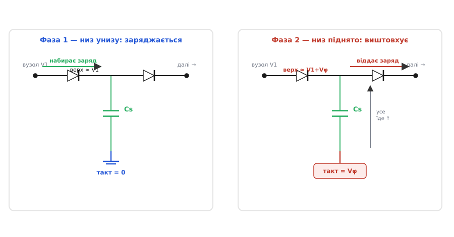

# Діксон-ланцюжок

Уяви мікросхему флеш-памʼяті. Живиться вона від 1.8 чи 3.3 В — і більшого на платі немає. Але щоб **записати** біт у комірку з плаваючим затвором, треба продавити крізь тонкий оксид напругу зо 15–20 В: інакше електрони не протунелюють, і біт не запишеться. Звідки взяти 20 В усередині чипа, який зовні бачить лише 3.3 В?

Класична відповідь із силової електроніки — котушка: імпульсний перетворювач накачує енергію в магнітне поле й піднімає напругу. Але котушку на кристал не поставиш. Вона велика, вимагає осердя, випромінює завади й узагалі не «друкується» тими самими шарами кремнію, що й транзистори. Потрібне щось, зроблене **з того ж, що й уся мікросхема**: транзистори та конденсатори. Саме таку схему й дає **Діксон-ланцюжок** (англ. *Dickson charge pump*, за прізвищем Джона Діксона, який опублікував її 1976 року) — сходинкова помпа заряду, що піднімає напругу самими конденсаторами й тактовими імпульсами, без жодного витка дроту.

Це один конкретний, дуже вдалий спосіб побудувати [зарядну помпу](book:electronics/charge-pump-conv) — родину перетворювачів, які замість магнітного поля просто **перекладають заряд** з конденсатора в конденсатор угору по напрузі. Родина широка; Діксон-ланцюжок — та її гілка, що виявилася найзручнішою для інтеграції на кристал і тому живе сьогодні майже в кожному чипі флеш- та EEPROM-памʼяті.

## Одна сходинка: як конденсатор «підкидає» заряд угору

Почнімо з найменшої цеглинки — однієї сходинки. Візьмемо конденсатор Cₛ. Його верхню обкладку зʼєднаємо з попереднім вузлом через діод, нижню — з тактовою лінією, що стрибає між 0 і Vφ (амплітуда такту, звичайно рівна напрузі живлення).

Простеж за напругою на верхній обкладці крок за кроком.

**Такт унизу (0 В).** Нижня обкладка на нулі. Через діод конденсатор заряджається від попереднього вузла: якщо там була напруга V₁, то верхня обкладка теж підтягується приблизно до V₁ (мінус падіння на діоді, про це — далі). Конденсатор набрав заряд.

**Такт угорі (Vφ).** Нижню обкладку рвучко піднімають на Vφ. А заряд на конденсаторі за мить змінитися не встигає — тож **обидві обкладки їдуть угору разом**. Верхня, що була на V₁, стрибає на V₁ + Vφ. Тепер вона вища за наступний вузол, діод у той бік відкривається, і надлишок заряду переливається далі — на наступний конденсатор.

Ось і вся ідея сходинки: **конденсатор набирає заряд, коли його «низ» унизу, і віддає, коли його «низ» піднято тактом**. Діоди — це клапани, що пускають заряд лише вперед, від входу до виходу, і не дають йому стекти назад. Кожна сходинка додає до напруги приблизно один розмах такту Vφ.

> 🔧 **Навіщо це.** Тут криється причина, чому помпа взагалі можлива без котушки. Індуктивний перетворювач тримає енергію в магнітному полі й потребує заліза. Помпа тримає її в **електричному полі** конденсатора — а конденсатор чудово робиться просто двома шарами металу з оксидом між ними, тими самими, з яких зроблений увесь чип. Тому 20 В для запису флеш беруться прямо на кристалі, без жодної зовнішньої деталі.

## Сходинка на сходинку: ланцюжок

Одна сходинка додає Vφ. Треба більше — ставимо їх **каскадом**: вихід однієї стає входом наступної, конденсатори чергуються нижніми обкладками на два протифазні такти. Поки непарні сходинки заряджаються (їхній «низ» унизу), парні віддають (їхній «низ» піднято) — і навпаки. Заряд крокує вгору по сходах, вузол за вузлом, ніби відро в естафеті з рук у руки.



*Одна сходинка у двох тактах: заряд набирається зліва в нижній фазі й виштовхується направо, коли такт піднімає нижню обкладку.*

Скільки віддасть ланцюжок з N сходинок в ідеалі? Кожна додає розмах такту Vφ понад вхід, тож на виході — вхід плюс N розмахів:

```
Vвих(ідеал) = Vвх + N · Vφ
```

Приклад: вхід 3.3 В, розмах такту теж 3.3 В (такт гойдається на повну шину живлення), шість сходинок:

```
Vвих = 3.3 + 6 · 3.3 = 3.3 + 19.8 = 23.1 В
```

Ось звідки беруться ті самі 20 В для флеш — із шести-семи конденсаторів і генератора тактів. Жодного дроселя.

## Чому саме такий каскад, а не давніший?

Тут — головна думка, заради якої Діксон-ланцюжок узагалі виокремлюють. Сходинкові множники напруги існували задовго до 1976 року. Найвідоміший — [каскад Кокрофта-Волтона](book:electronics/dickson-charge-pump/hist-dickson-lineage.md), яким 1932 року живили перший прискорювач для розщеплення ядра. Він теж складає конденсатори через діоди — але живиться змінним струмом і **звʼязує сходинки послідовно**: конденсатор однієї сходинки передає гойдання напруги на конденсатор наступної, і так по ланцюгу вгору.

На макеті з дискретних деталей це працює чудово. А на кристалі — розсипається. Причина одна: **паразитна ємність**. Кожен вузол на кремнії має власну, непрохану ємність на підкладку (кристал під ним — це наче обкладка ще одного конденсатора). У каскаді Кокрофта-Волтона гойдання мусить пройти крізь усі нижні сходинки, щоб дістатися верхніх; на кожному вузлі паразитна ємність краде частину розмаху, як діляник. Що вища сходинка — то менше до неї доходить. Кілька сходинок — і накачка глухне.

Діксон зробив прийом, який усе змінив: він **не пускає гойдання по ланцюгу**, а підводить такт **до кожного конденсатора окремо**, паралельно, прямо від тактової лінії. Нижні обкладки всіх конденсаторів висять просто на двох тактових шинах, а ті — джерела з дуже малим опором, їх паразитна ємність не лякає. Гойдання не мусить дертися крізь усі сходинки — воно приходить до кожної **безпосередньо**.


*Ключова відмінність Діксона: такт заходить у кожну сходинку паралельно, а не пробивається крізь ланцюг, тож паразитна ємність на підкладку вже не гасить накачку.*

Через це паразитна ємність у Діксон-ланцюжку не **вбиває** накачку, а лише трохи її **послаблює** — краде частину корисного розмаху. Реальний розмах, що доходить до вузла, менший за Vφ у міру ділення між робочою й паразитною ємністю:

```
Vефект = Vφ · Cₛ / (Cₛ + Cпар)
```

де Cₛ — робочий конденсатор сходинки, Cпар — паразитна ємність вузла на підкладку. Робимо Cₛ помітно більшим за Cпар — і майже весь розмах іде в діло. Саме ця геометрія — паралельне під­ведення такту — і зробила сходинкову помпу придатною для кремнію. До Діксона множник напруги на кристалі був майже нездійсненний; після — став буденною цеглинкою.

## Реальний вихід: втрати, що зʼїдають напругу

Ідеальна формула Vвх + N·Vφ — стеля, якої не досягти. Три речі відбирають напругу.

**Падіння на клапані.** Кожен діод (а на кристалі його роль грає MOS-транзистор, увімкнений діодом) має падіння Vd — приблизно 0.6–0.7 В для звичайного діода, а для MOS-«діода» це його **порогова напруга** Vth, і буває навіть більшою. Заряд крокує крізь N+1 клапан (сходинки плюс вихідний), і на кожному лишає своє падіння.

**Неповний розмах через паразитику.** Замість Vφ у діло йде лише Vефект = Vφ · Cₛ/(Cₛ+Cпар), як щойно бачили.

**Провисання під навантаженням.** Це найважливіше на практиці. Помпа віддає порцію заряду за кожен такт. Якщо навантаження тягне струм Iвих, то за один період такту 1/f воно висмоктує заряд Iвих/f. Цей заряд знімається з конденсатора сходинки, і напруга на ньому просідає на ΔV = Iвих/(f·Cₛ). Помпа — це джерело з **вихідним опором**, і цей опір тим більший, чим повільніший такт і чим менші конденсатори.

Склавши все, дістаємо робочу оцінку виходу під навантаженням:

```
Vвих ≈ Vвх + N · (Vφ · Cₛ/(Cₛ+Cпар) − Vd) − N · Iвих/(f·Cₛ)
```

Останній доданок — то і є падіння на власному вихідному опорі помпи Rвих ≈ N/(f·Cₛ): струм провисає на кожній із N сходинок, тож повне провисання пропорційне числу сходинок. Що більший струм, то нижча напруга. Помпа любить **малий струм**; тягнути з неї десятки міліампер означає ганебно провалити напругу.

> 🔧 **Навіщо це.** Це пояснює, чому помпу ставлять саме на флеш і затвори, а не на живлення процесора. Записати флеш-сторінку — це коротко подати високу напругу на малесенький струм заряду затворів. Помпа тут ідеальна. А годувати ядро, що жере ампери, вона не годна в принципі: її вихідний опір завеликий, напруга просяде до нуля. Правило просте — **висока напруга, крихітний струм**.

## MOS замість діода: пастка порога

На кристалі справжніх діодів уникають — натомість беруть MOS-транзистор, у якого затвор зʼєднано зі стоком, тож він поводиться як діод. Зручно: транзистор і так є в кожному процесі. Але з ним приходить прикра пастка.

MOS-транзистор відкривається лише тоді, коли напруга затвор-витік перевищує поріг Vth. Тому «діод» із нього губить на собі повний Vth — і, що гірше, у сходинковій помпі витік транзистора сидить на вже піднятій напрузі, а через **ефект підкладки** (body effect) поріг з висотою ще й **зростає**. Виходить, що верхні сходинки віддають дедалі менше: клапан на них жадібніший. Ланцюжок з наївних MOS-«діодів» насичується — понад якусь висоту додавати сходинки марно, бо кожна нова майже цілком іде на власний поріг.

Саме це обмеження й породило десятки [покращень схеми Діксона](book:electronics/dickson-charge-pump/comp-charge-transfer-switch.md): замість пасивного «діода» ставлять керований ключ, який відкривають повністю окремим сигналом, тож падіння на ньому падає майже до нуля. Так вихід перестає впиратися в стелю порогів і масштабується з числом сходинок майже ідеально. Для базового розуміння досить памʼятати саму пастку: **наївний MOS-«діод» краде поріг на кожній сходинці, і вгорі це стає нестерпним**.

## Скільки сходинок і як швидко: приклад на C

Порахуймо помпу під конкретну потребу. Хай мікроконтролер живиться від 3.3 В, а нам треба **18 В** щоб керувати невеликим MEMS-дзеркальцем, струм навантаження — до 50 мкА. Такт беремо 500 кГц, конденсатори сходинок — 100 пФ (типово для інтегрованих), падіння на клапані приймемо 0.3 В (уже з покращеними ключами), паразитику для простоти вкладемо в те саме падіння.

Спершу прикинемо, скільки сходинок треба, потім перевіримо провисання:

:::tabs
```c
#include <stdio.h>
#include <math.h>

int main(void) {
    const double Vin   = 3.3;      // напруга живлення, В
    const double Vphi  = 3.3;      // розмах такту (гойдається на всю шину), В
    const double Vd    = 0.3;      // падіння на одному клапані, В
    const double Vgoal = 18.0;     // цільова напруга, В
    const double Iout  = 50e-6;    // струм навантаження, А
    const double f     = 500e3;    // частота такту, Гц
    const double Cs    = 100e-12;  // конденсатор сходинки, Ф

    // Скільки сходинок треба (без урахування провисання):
    // Vgoal = Vin + N*(Vphi - Vd)  →  N = (Vgoal - Vin)/(Vphi - Vd)
    double N_real = (Vgoal - Vin) / (Vphi - Vd);
    int N = (int)ceil(N_real);     // округлюємо вгору — сходинок ціле число
    printf("Треба сходинок: %.2f -> беремо %d\n", N_real, N);

    // Провисання під навантаженням: Rвих ~ N/(f*Cs)
    double Rout = N / (f * Cs);
    double droop = Iout * Rout;
    printf("Вихідний опір: %.0f Ом, провисання: %.2f В\n", Rout, droop);

    // Напруга без навантаження і під навантаженням:
    double Voc = Vin + N * (Vphi - Vd);
    double Vload = Voc - droop;
    printf("Холостий хід: %.2f В, під навантаженням: %.2f В\n", Voc, Vload);
    return 0;
}
```
```python
import math

def main() -> None:
    Vin   = 3.3      # напруга живлення, В
    Vphi  = 3.3      # розмах такту (гойдається на всю шину), В
    Vd    = 0.3      # падіння на одному клапані, В
    Vgoal = 18.0     # цільова напруга, В
    Iout  = 50e-6    # струм навантаження, А
    f     = 500e3    # частота такту, Гц
    Cs    = 100e-12  # конденсатор сходинки, Ф

    # Скільки сходинок треба (без урахування провисання):
    # Vgoal = Vin + N*(Vphi - Vd)  →  N = (Vgoal - Vin)/(Vphi - Vd)
    N_real = (Vgoal - Vin) / (Vphi - Vd)
    N = math.ceil(N_real)  # округлюємо вгору — сходинок ціле число
    print(f"Треба сходинок: {N_real:.2f} -> беремо {N}")

    # Провисання під навантаженням: Rвих ~ N/(f*Cs)
    Rout = N / (f * Cs)
    droop = Iout * Rout
    print(f"Вихідний опір: {Rout:.0f} Ом, провисання: {droop:.2f} В")

    # Напруга без навантаження і під навантаженням:
    Voc = Vin + N * (Vphi - Vd)
    Vload = Voc - droop
    print(f"Холостий хід: {Voc:.2f} В, під навантаженням: {Vload:.2f} В")

if __name__ == "__main__":
    main()
```
```js
function main() {
  const Vin   = 3.3;      // напруга живлення, В
  const Vphi  = 3.3;      // розмах такту (гойдається на всю шину), В
  const Vd    = 0.3;      // падіння на одному клапані, В
  const Vgoal = 18.0;     // цільова напруга, В
  const Iout  = 50e-6;    // струм навантаження, А
  const f     = 500e3;    // частота такту, Гц
  const Cs    = 100e-12;  // конденсатор сходинки, Ф

  // Скільки сходинок треба (без урахування провисання):
  // Vgoal = Vin + N*(Vphi - Vd)  →  N = (Vgoal - Vin)/(Vphi - Vd)
  const N_real = (Vgoal - Vin) / (Vphi - Vd);
  const N = Math.ceil(N_real);  // округлюємо вгору — сходинок ціле число
  console.log(`Треба сходинок: ${N_real.toFixed(2)} -> беремо ${N}`);

  // Провисання під навантаженням: Rвих ~ N/(f*Cs)
  const Rout = N / (f * Cs);
  const droop = Iout * Rout;
  console.log(`Вихідний опір: ${Rout.toFixed(0)} Ом, провисання: ${droop.toFixed(2)} В`);

  // Напруга без навантаження і під навантаженням:
  const Voc = Vin + N * (Vphi - Vd);
  const Vload = Voc - droop;
  console.log(`Холостий хід: ${Voc.toFixed(2)} В, під навантаженням: ${Vload.toFixed(2)} В`);
}

main();
```
:::

Проженемо в голові. Розмах корисний — 3.3 − 0.3 = 3.0 В на сходинку. Щоб додати 18 − 3.3 = 14.7 В, треба 14.7/3.0 = 4.9 сходинки — округлюємо до **5**. Пʼять сходинок дають на холостому ходу 3.3 + 5·3.0 = 18.3 В. Вихідний опір: 5/(500000 · 100·10⁻¹²) = 5/(5·10⁻⁵) = **100 кОм**. Провисання під 50 мкА: 50·10⁻⁶ · 100000 = **5 В**. Отже під навантаженням лишається 18.3 − 5 = 13.3 В — **мало!**

Висновок сам випливає з чисел: пʼяти сходинок вистачає лише на папері, на холостому ходу. Провисання 5 В зʼїдає запас. Виходів два — або **швидший такт** (удвічі вища частота вдвічі зменшить вихідний опір і провисання), або **більші конденсатори**, або **більше сходинок із запасом**. Це і є щоденна робота з помпою: балансувати число сходинок, частоту й ємність під конкретний струм. Формула провисання Iвих/(f·Cₛ) — головний важіль у цьому торзі.

## Що лишається памʼятати

Діксон-ланцюжок бере низьку напругу живлення й самими конденсаторами та тактами піднімає її в кілька разів — рівно стільки, скільки сходинок. Його сила в тому, що він **зроблений із того ж, що й чип**: ніякого заліза, лише транзистори-клапани й конденсатори, тож двадцять вольт для запису флеш беруться прямо на кристалі. Його межа — **малий струм**: помпа має чималий вихідний опір N/(f·Cₛ), і під навантаженням напруга просідає тим більше, чим більший струм і чим повільніший такт. А головний винахід Діксона — підводити такт до кожної сходинки **паралельно**, а не крізь ланцюг, — це те, що зробило давню ідею сходинкового множника придатною для кремнію й досі тримає її в кожній флеш-памʼяті світу.
