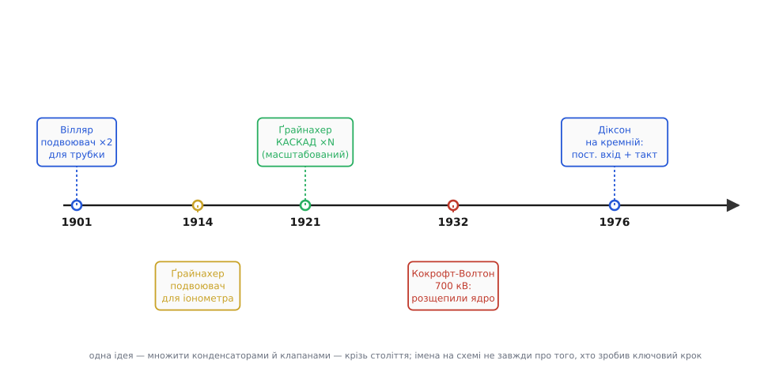

# 📜 Родовід сходинкового множника: від рентгенівської трубки до кремнію

За схемою, що піднімає напругу конденсаторами й діодами, стоїть довгий ланцюг рук — і майже кожна ланка цього ланцюга носить у підручниках чуже ім'я. Схему, яку швейцарець надрукував у Цюриху, звуть іменем француза. Множник, яким британці розщепили ядро, теж придумав не той, чиє прізвище на ньому. А той, чиє прізвище стоїть на **інтегральній** версії — Джон Діксон, — нічого нового в саму ідею множення не додав; його заслуга зовсім в іншому місці. Розплутати цей клубок цікаво не заради історичної справедливості (хоч і заради неї теж), а тому, що на ньому видно, як узагалі влаштований винахід: одна ідея, кілька незалежних відкриттів, десятиліття між «придумали» і «стало деталлю в кожному чипі».

Розберімо ланцюг по ланках — від першої трубки, якій знадобилася подвоєна напруга, до кремнієвої помпи 1976 року. І щоразу питаймо про кожну людину те саме розрізнення, без якого історія техніки перетворюється на список імен: що саме він зробив — **побачив ідею**, **дав теорію**, **побудував робочу річ** чи **зробив із неї систему**? Це різні досягнення, і плутанина між ними й породжує всі суперечки «хто перший».

## Villard і подвоювач для рентгенівської трубки (1901)

Почнімо з найпершої потреби. Кінець 1890-х: щойно відкрито рентгенівські промені, і фізики жадібно будують трубки, щоб їх вивчати. Трубка Крукса (*Crookes tube*) — скляна колба з розрідженим газом і двома електродами — світить і дає промені лише тоді, коли між електродами прикладено високу напругу, тисячі вольт. А під рукою — індукційна котушка чи трансформатор, що дає змінну напругу вдвічі меншу, ніж хотілося б. Треба якось із наявного змінного добути вищий постійний.

Саме цю задачу розв'язав **Поль Ульріх Вілляр** (фр. *Paul Ulrich Villard*, 1860–1934) — французький хімік і фізик, той самий, що 1900 року відкрив **гамма-промені** (щоправда, назви їм не дав — так їх 1903-го назве Резерфорд). Вілляр 1901 року склав схему з двох конденсаторів і двох діодів, яка бере розмах змінної напруги й видає на виході **подвоєний пік** — постійну напругу, вдвічі вищу за амплітуду входу. Простий, дешевий спосіб нагодувати трубку з наявного джерела. Ця схема й досі зветься **схемою Вілляра** (*Villard circuit*).

> 🔧 **Навіщо це.** Ось звідки родовід множника взагалі бере початок — із суто прикладної нужди підняти напругу для газорозрядної трубки. Уже тут видно головний мотив усього ланцюга: **зробити високу напругу з низької, маючи лише конденсатори й клапани**, без важкого високовольтного трансформатора. Той самий мотив через сімдесят п'ять років приведе інженерів до кремнієвої помпи — тільки трубку замінить комірка флеш-пам'яті, а «мало напруги» стане «на чипі є лише 3 вольти».

Статус: авторство Вілляра щодо подвоювача 1901 року та його відкриття гамма-променів 1900 року — **усталені факти**, задокументовані в історії фізики. Але тут криється перша пастка атрибуції, до якої ми зараз і підійдемо.

## Greinacher: подвоювач для іонометра (1914) і каскад (1921)

Подвоювач Вілляра множив рівно **вдвічі**. А що, коли треба в п'ять, у десять разів? Тут на сцену виходить людина, чий внесок історія зафіксувала точно, але ім'я в назві схеми примудрилася не втримати.

**Генріх Ґрайнахер** (нім. *Heinrich Greinacher*, 1880–1974) — фізик, народжений у Санкт-Ґаллені; за походженням німець, натуралізований швейцарський громадянин ще змалку (1894). Докторат здобув 1904 року в Берліні під керівництвом Еміля Варбурґа; згодом — багаторічний професор експериментальної фізики в Берні. Людина широких рук: йому належать і рання праця з магнетроном (1912), і лічильники заряджених частинок. Але в наш ланцюг він входить через прилад, який сам будував для власних вимірювань, — **іонометр**.

Іонометр (від гр. *íon* — «те, що йде», і *métron* — «міра») міряв іонізацію, яку створює радій чи рентгенівське проміння. Щоб він працював точно, електродам приладу треба було 200–300 вольт — а живлення під рукою давало менше. Класична потреба: підняти напругу з наявного. І 1913 року Ґрайнахер складає для свого іонометра **однопівперіодний подвоювач** — по суті, ту саму ідею, що й у Вілляра, але прикладену до вимірювального інструмента. Публікує її 1914 року в *Physikalische Zeitschrift*, у статті про іонометр і його застосування до вимірювання радію й рентгенівських променів.

Головний хід приходить пізніше. Ґрайнахер бачить, що подвоювачі можна **скласти каскадом**: вихід одного стає входом наступного, і кожен ступінь додає ще один розмах напруги. Так із багатьох однакових комірок виростає **множник** на будь-яку кратність — не вдвічі, а в стільки разів, скільки ступенів. Цю каскадну схему він публікує 1921 року в *Zeitschrift für Physik* (том 4, с. 195–205) під назвою, що описує саму суть: як перетворити змінний струм за допомогою електричних клапанів і конденсаторів на високовольтний постійний. Ось воно — **народження сходинкового множника** як загального прийому, а не одноразового подвоювача.

```
Вілляр (1901):   ×2        — один ступінь, подвоєння
Ґрайнахер (1921): ×N        — каскад: кожен ступінь додає ще один розмах
```

> 🔧 **Навіщо це.** Різниця між подвоювачем і каскадом — це різниця між «маю фокус на один раз» і «маю **масштабований прийом**». Подвоювач дає фіксовані ×2. Каскад дає важіль: постав більше ступенів — дістанеш вищу напругу, скільки завгодно, тими самими дешевими деталями. Саме ця масштабованість і зробила ідею придатною і для 700 кіловольт прискорювача, і, через півстоліття, для 20 вольт усередині чипа. Один і той самий принцип, лише число ступенів інше.

І тут — обіцяна пастка з іменами. Каскадний множник **дуже часто хибно звуть «каскадом Вілляра»** (*Villard cascade*) — хоча Вілляр склав лише **подвоювач**, а каскад із цих подвоювачів придумав **Ґрайнахер**. Плутанина зрозуміла: базова комірка справді Віллярова, тож ім'я «прилипло» й до її каскаду, дарма що каскадувати придумав інший. Чесніша назва, яку теж уживають, — **множник Ґрайнахера** (*Greinacher multiplier*). Це показовий випадок, як у техніці ім'я закріплюється не за тим, хто зробив ключовий крок, а за тим, чия рання деталь трапилася першою на очі.

Статуси: дати й авторство Ґрайнахера **усталені** — подвоювач 1913–1914 (винахід і публікація), каскад 1921 у *Zeitschrift für Physik*. Одна дрібна розбіжність, яку варто позначити чесно: частина джерел відносить «узагальнення до каскаду» до **1919–1920 років**, тоді як **формальна публікація каскадної схеми — 1921**. Найімовірніше, ідея визріла наприкінці 1910-х, а надрукована була 1921-го; тож дата винаходу «плаває» на рік-два залежно від того, що рахувати — задум чи публікацію. Сам факт першості Ґрайнахера щодо **каскаду** розбіжним не є.

## Cockcroft і Walton: множник, що розщепив ядро (1932)

Тепер найгучніша ланка — та, чиє ім'я схема носить донині, хоча її автори схему не винаходили, а **перевідкрили й застосували**.

На початку 1930-х у Кавендішській лабораторії в Кембриджі стояла зухвала мета: **розігнати протони достатньо, щоб пробити ядро атома**. Для цього треба була величезна напруга — сотні кіловольт — на прискорювальній трубці. Двоє молодих фізиків у групі Резерфорда взялися її здобути:

- **Джон Дуглас Кокрофт** (*John Douglas Cockcroft*, 1897–1967) — англійський фізик, народжений у Тодмордені (Йоркшир);
- **Ернест Томас Сінтон Волтон** (*Ernest Thomas Sinton Walton*, 1903–1995) — **ірландський** фізик, народжений у Дунґарвані (графство Вотерфорд).

Тут важлива точність, яку загальні джерела часто змазують, звучи пару просто «британцями». Волтон був **ірландцем** — і згодом став першим ірландським науковцем — нобелівським лауреатом; називати його «британським фізиком» без застереження стирає його ідентичність. Тож правильно: **англієць Кокрофт і ірландець Волтон**, що працювали разом у британській лабораторії.

Їм потрібне було високовольтне джерело — і вони, за свідченнями, **незалежно** прийшли до тієї самої каскадної схеми, що й Ґрайнахер (згадки про Ґрайнахерів множник до них не дійшли, тож вони фактично перевідкрили його). Їхній генератор — стос конденсаторів і газорозрядних випрямлячів — живився **змінним струмом** від високовольтного трансформатора й накачував на виході постійну напругу порядку **700 кіловольт**.

І 14 квітня 1932 року цей множник зробив історію. Волтон і Кокрофт розігнали протони цією напругою й ударили ними по мішені з **літію** — і ядра літію розкололися на дві альфа-частинки (ядра гелію). Це було **перше в історії штучне розщеплення атомного ядра прискореними частинками** — і водночас перше пряме підтвердження Ейнштейнового E = mc²: маса продуктів була трохи менша за масу вихідних частинок, а різниця вивільнилася енергією альфа-частинок. За цю роботу пара 1951 року здобула Нобелівську премію з фізики.

> 🔧 **Навіщо це.** Зверни увагу, що тут множник живив **прискорювач**, а не мікросхему — і живився **змінним струмом**. Це два родові знаки старої, «доінтегральної» гілки. Схема брала гойдання мережевої частоти й перекладала його ступенями вгору. Саме цю рису — **вхід змінний, зв'язок ступенів послідовний** — і доведеться переробити, щоб схема перебралася на кремній, де ні змінного входу немає, ні місця під високовольтні деталі.

Через цю знаменитість схему й досі найчастіше звуть **генератором Кокрофта-Волтона** — хоча її, повторимо чесно, придумав не вони. Вони зробили інше, теж велике: **побудували робочу високовольтну систему** й **застосували** її до фундаментального відкриття. Це знову те саме розрізнення: ідею дав Ґрайнахер (а базову комірку — Вілляр), а систему, що змінила фізику, — Кокрофт із Волтоном. Ім'я закріпилося за системою, бо саме вона гриміла в газетах 1932 року.

Статуси: дата (14 квітня 1932), місце (Кавендіш), реакція (літій + протон → дві альфа-частинки), Нобель 1951 — **усталені факти**. Порядок напруги (близько 700 кВ) різні джерела подають трохи по-різному (від ~600 до ~800 кВ на різних етапах установки), тож розумно казати «порядку 700 кіловольт», а не фіксувати одне точне число. Незалежність їхнього перевідкриття від Ґрайнахера — **усталена в історії техніки**: вони не спиралися на його публікацію, а прийшли до схеми самі.

## Три ланки — і чому жодна не «винайшла помпу»

Зупинімося й складімо докупи цю доінтегральну частину родоводу, бо на ній видно головний урок про природу винаходу.



*Той самий принцип — множити напругу конденсаторами й клапанами — проходить крізь ціле століття, щоразу під нову потребу. Схему звуть іменами Вілляра й Кокрофта-Волтона, хоча ключовий крок (каскад) зробив Ґрайнахер, а перенесення на кремній — Діксон.*

**Вілляр (1901)** дав **базову комірку** — подвоювач для трубки. Ідея множення напруги конденсаторами народилася тут.

**Ґрайнахер (1921)** дав **загальний прийом** — каскад, що множить на будь-яку кратність. Це вже не фокус на ×2, а масштабований інструмент.

**Кокрофт і Волтон (1932)** дали **робочу систему й гучне застосування** — 700-кіловольтний прискорювач, що розщепив ядро. Вони не винаходили схему; вони перевідкрили її й побудували з неї річ, що змінила фізику.

Ось чому чесна відповідь на «хто винайшов множник напруги» — **«ніхто окремо»**. Комірку дав француз, каскад — швейцарець (родом німець), гучну систему — англієць з ірландцем. Кожен зробив **інше** досягнення, і всі вони потрібні, щоб з'явився прилад. Ім'я на схемі («каскад Вілляра», «генератор Кокрофта-Волтона») відсилає не до того, хто зробив ключовий крок, а до випадковостей історії — чия деталь трапилася першою, чиє відкриття гриміло. Це рядова, майже неминуча доля техніки: **винаходи колективні, а імена на них — часто чужі**.

Але вся ця гілка мала одну спільну межу, яка не пускала її в майбутнє мікроелектроніки. Вона працювала на **змінному вході** — на гойданні мережі чи трансформатора — і зв'язувала ступені **послідовно**, конденсатор до конденсатора вгору по ланцюгу. На макеті з великих деталей це чудово. А всередині кремнієвого чипа — ні змінного джерела, ні місця. Щоб множник переселився на кристал, його треба було переробити з основи. Це й зробив останній герой родоводу.

## Dickson: перенесення на кремній під постійний вхід (1976)

1976 рік, зовсім інший світ. Не прискорювачі й трубки, а **інтегральні мікросхеми пам'яті**. Тут з'явилася потреба, якої попередні епохи не знали: мікросхема живиться від низької напруги (кілька вольт), а щоб **записати** енергонезалежну комірку — тоді це була пам'ять типу MNOS (метал-нітрид-оксид-напівпровідник) — треба вкинути на неї помітно вищу напругу, ніж є на живленні. Взяти її ззовні не можна: уся принада такого чипа в тому, що він працює від звичайних шин живлення, без окремого високовольтного джерела.

І тут постала стіна. Уся спадщина Вілляра-Ґрайнахера-Кокрофта була заточена під **змінний вхід**. А на чипі змінного немає — є **постійні** шини живлення й, щонайбільше, **тактовий генератор**, що дає прямокутні імпульси. Стара каскадна схема з її послідовним зв'язком ступенів на кремнії ще й розсипалася б: кожен вузол на кристалі має власну паразитну ємність на підкладку, і гойдання, пробиваючись послідовно крізь усі ступені, глухло б дедалі сильніше. (Механіку цього — паразитику й чому вона гасить послідовний каскад — докладно розбирає сама тема, тож тут лише називаємо межу.)

**Джон Ф. Діксон** (*John F. Dickson*) переробив ідею під нові умови й описав це 1976 року в *IEEE Journal of Solid-State Circuits* (том 11, № 3, с. 374–378), у статті «On-chip high-voltage generation in MNOS integrated circuits using an improved voltage multiplier technique» («Генерація високої напруги на кристалі в інтегральних схемах MNOS удосконаленим прийомом множення напруги»). Два ключові зрушення, обидва диктовані кремнієм:

**Постійний вхід замість змінного.** Джерелом накачки в Діксона стає не мережеве гойдання, а **тактовий генератор** — те, що на цифровому чипі й так є. Множник тепер живиться постійною напругою живлення, а «гойдання» дає такт.

**Два протифазні такти, підведені до кожного ступеня паралельно.** Замість послідовного зв'язку конденсаторів Діксон вішає **нижню обкладку кожного конденсатора** прямо на одну з двох тактових шин — сусідні ступені на протифазні такти φ1 і φ2. Поки одні ступені набирають заряд, інші його віддають; за наступний півтакт — навпаки. Такт приходить до кожного ступеня **безпосередньо** від низькоомної шини, а не пробивається крізь ланцюг. Саме тому паразитна ємність уже не вбиває накачку — і **кратність множення й струмова здатність перестають залежати від того, скільки ступенів у ланцюзі**. Це і є головна теза статті Діксона, винесена в її анотацію.

```
Стара гілка (Вілляр…Кокрофт):  вхід ЗМІННИЙ, ступені зв'язані ПОСЛІДОВНО
Діксон (1976):                 вхід ПОСТІЙНИЙ + такт, ступені живлять
                               ДВА ПРОТИФАЗНІ такти ПАРАЛЕЛЬНО
```

Що Діксон зробив своєю схемою на практиці, видно з цифр його ж статті. Мікросхема живилася від стандартних шин **+5 В і −12 В**, а множник накачував усередині **+40 В** — саме те, чого бракувало для запису MNOS-комірок. Такт — **1 МГц**, максимальний струм навантаження — близько **10 мкА**. Множник умонтували в TTL-сумісний енергонезалежний чотирирозрядний засув, що займав усього 600 × 240 мкм кристала. Крихітний струм — і дуже висока (як на чип) напруга: **точно той режим**, у якому помпа заряду сильна, а індуктивний перетворювач непридатний.

> 🔧 **Навіщо це.** Ось чому саме Діксонове ім'я закріпилося за **інтегральною** помпою, хоча множення напруги він не винаходив. Його заслуга — не «придумати множник» (це зробили за півстоліття до нього), а **перекласти давню ідею на мову кремнію**: постійний вхід, тактова накачка, паралельне підведення такту, характеристики без залежності від числа ступенів. Це й є те розрізнення, заради якого варто знати всю історію: Вілляр і Ґрайнахер дали **ідею**, Кокрофт із Волтоном — **велику зовнішню систему**, а Діксон — **інтегровну реалізацію**. Кожен наступний не «повторив», а зробив **інший** тип роботи над тією самою серцевиною.

Статуси: бібліографія й технічні числа Діксона (**+40 В**, шини **+5**/**−12 В**, MNOS, **1 МГц**, **~10 мкА**, розмір кристала, теза про незалежність від числа ступенів) — **усталені**, узяті з самої публікації 1976 року та її анотації. Те, що Діксон **не винаходив множення**, а адаптував наявний прийом до інтегральної технології, — **усталений** факт: він і сам у назві статті пише «improved voltage multiplier technique», тобто **удосконалений**, визнаючи попередників.

## Що з цього родоводу лишається

Одна ідея — множити напругу самими конденсаторами й клапанами — прожила понад століття, щоразу перевдягаючись під нову потребу. Вілляр 1901 року склав подвоювач, щоб нагодувати рентгенівську трубку. Ґрайнахер 1921 року зробив із подвоювача **каскад** — масштабований множник на будь-яку кратність — для власного іонометра. Кокрофт і Волтон 1932 року незалежно перевідкрили цей каскад, збудували з нього 700-кіловольтний прискорювач і **розщепили ядро**. А Джон Діксон 1976 року переробив усе під кремній: постійний вхід замість змінного, тактова накачка, два протифазні такти, підведені до кожного ступеня паралельно, — і тим переселив давню схему з лабораторного столу всередину мікросхеми пам'яті.

Ім'я, під яким схему знають, майже ніколи не вказує на того, хто зробив ключовий крок: «каскад Вілляра» насправді Ґрайнахерів, «генератор Кокрофта-Волтона» ті двоє не винаходили, а «Діксон-помпа» не про винахід множення, а про його перенесення на кристал. У цьому — не історична несправедливість, яку треба виправити, а звичайна природа техніки: винаходи **колективні**, роль кожного — **своя** (ідея, теорія, система, реалізація), а прізвище на схемі чіпляється за випадковості слави. Знати цей родовід варто саме тому, що він привчає розрізняти ці ролі — і не питати про прилад наївного «хто перший», а бачити ланцюг рук, кожна з яких додала свою, окрему ланку.
