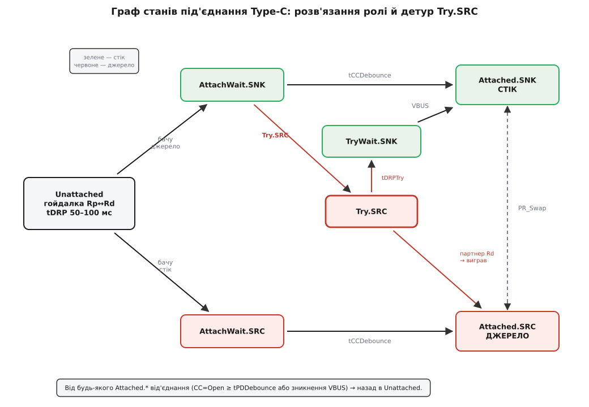
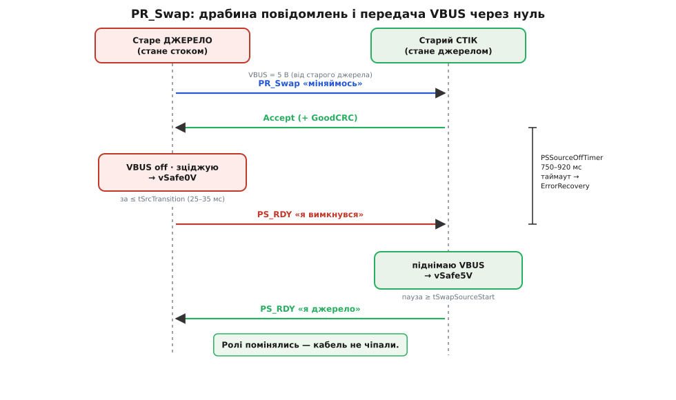

# ⚙️ Машина станів DRP і зміни ролі

<preknowlist>
- [Type-C без PD: резистори CC](book:electronics/type-c-cc) — підтяжки Rp/Rd на лінії CC, як пасивний резистор оголошує роль джерела/стоку.
- [USB Power Delivery](book:electronics/usb-pd) — цифрові переговори по CC, повідомлення Request/Accept/PS_RDY, контракт «напруга + струм».
- [MOSFET спина-до-спини](book:electronics/mosfet-back-to-back) — двосторонній ключ, чиї body-діоди дивляться назустріч і блокують струм в обидва боки.
- [Мертвий час](book:electronics/dead-time) — гарантована пауза «розірви перед тим, як з'єднати», що не дає двом ключам відкритися разом.
- [Автомат станів у прошивці](book:programming/state-machine-embedded) — подієвий скінченний автомат: явні стани, переходи за подіями, дії на вході в стан.
</preknowlist>

Зовні контролер дворольового порту — це обіцянка: розв'яжи роль, увімкни VBUS у правильний бік, умій розвернути потік наживо. Усередині ця обіцянка — **машина станів**. І будувати її словами «якщо-то-інакше» просто по колу — прямий шлях до біди, бо в цій задачі помилка коштує зустрічі двох джерел на одній шині: пряме коротке з чужим блоком живлення, десятки ампер крізь ваші ключі. Тож зберемо машину як належить — явними станами, у справжньому embedded C, — і зробимо так, щоб небезпечний стан був **фізично недосяжним**, а не «малоймовірним».

Домовимось про ролі коду. Аналогову частину — виставити Rp чи Rd, зміряти CC і VBUS, кинути силові ключі, відправити чи прийняти пакет PD — робить залізо: або окрема мікросхема-порт-контролер (TCPC), або інтегрований аналоговий front-end. Наш код — це **керівник** (політика й машина станів, у стандарті — TCPM): він лише вирішує, що робити, і смикає залізо через тонкий шар функцій. Тримати ці дві половини нарізно — не естетика, а спосіб мати одне місце, де живе вся безпека переходів.

## Задача: три обов'язки, один інваріант

Машина мусить робити три речі й ніколи не порушити одну заборону.

1. **Розв'язати роль.** Порожній порт не знає, ким стане. Він гойдає CC між Rp («буду джерелом») і Rd («буду стоком»), ловить відповідь партнера, за потреби наполягає на бажаній ролі ([Try.SRC/Try.SNK](book:electronics/type-c-cc)) — і застигає в одній ролі.
2. **Керувати двонапрямним ключем VBUS.** Один вузол, два боки: ключ-джерело жене нашу напругу назовні, ключ-стік впускає чужу до нас. Перемикати їх — тільки через [мертвий час](book:electronics/dead-time), «розірви перед тим, як з'єднати».
3. **Провести зміну ролі живлення (PR_Swap)** поверх [PD](book:electronics/usb-pd): узгодити по протоколу, зцідити VBUS до безпечного нуля, доповісти PS_RDY, підняти протилежне джерело — з таймаутами й безпечними виходами на кожному кроці.

Інваріант, спільний для всіх трьох: **ключ-джерело і ключ-стік ніколи не відкриті одночасно, і на VBUS ніколи не збігаються два джерела.** Уся конструкція нижче служить тому, щоб цей рядок був правдою завжди — на будь-якому переході, за будь-якого збою партнера, у будь-який момент часу.

## Ідея: чому саме машина станів

Спокуса писати керування портом набором прапорців (`is_source`, `vbus_on`, `swapping`…) і купою `if` розбивається об одну обставину: **та сама подія означає різне залежно від того, де ми зараз.** Прийшов PD-пакет `PR_Swap` — коли ми стабільне джерело, це «почни віддавати роль»; коли ми посеред власного обміну — це колізія запитів; коли ми взагалі не під'єднані — це сміття, яке треба відкинути. Зникла VBUS — коли ми стік, це «джерело від'єдналось»; коли ми джерело, це, можливо, коротке на виході. Прапорці не тримають цього контексту; **стан — тримає.** Стан і є пам'ять, що робить кожну подію однозначною.

Тому кістяк — скінченний автомат: скінченна множина **станів**, і в кожному стані визначено, які **події** його рухають і куди. Небезпечні комбінації просто не існують як стани, тож потрапити в них нема куди. А ще важливіше — інваріант стає **властивістю, яку видно очима**: щоб довести «джерело й стік не бувають разом», не треба тримати в голові всі шляхи виконання, досить перечитати вхідні дії кожного стану й переконатися, що жоден не вмикає обидва ключі. Безпека, яку можна прочитати, а не лише сподіватися на неї.

Ось повна карта станів під'єднання Type-C для дворольового порту з вподобанням Try.SRC — те, що ми зараз оживимо кодом:


*Кружляння гойдалки в Unattached; кожне під'єднання спершу відлежується в AttachWait (дебаунс), тоді фіксується в Attached. Детур Try.SRC вклинюється там, де ми мали б стати стоком, і дає шанс наполягти на ролі джерела; не вигоріло — TryWait.SNK повертає нас у стік. Між двома Attached живе PR_Swap — зміна ролі без розриву.*

## Кістяк: стани, контекст, залізо

Почнемо зі словника машини. Стани — рівно ті, що на карті, плюс `ERROR_RECOVERY` (аварійний скид з'єднання). Підтяжки CC, те, що ми бачимо на CC, і під-стани обміну — окремими переліками, щоб компілятор ловив безглузді значення. Увесь мінливий стан порту — в одній структурі: так його легко скинути й неможливо «забути» глобальну змінну.

```c
#include <stdint.h>
#include <stdbool.h>

// ── Стани під'єднання (карта вище) ───────────────────────────────
typedef enum {
    TC_UNATTACHED,        // гойдалка Rp<->Rd, чекаємо партнера
    TC_ATTACHWAIT_SNK,    // бачимо джерело — відлежуємо (дебаунс)
    TC_ATTACHWAIT_SRC,    // бачимо стік — відлежуємо
    TC_ATTACHED_SNK,      // ми СТІК: споживаємо VBUS
    TC_ATTACHED_SRC,      // ми ДЖЕРЕЛО: жену VBUS
    TC_TRY_SRC,           // вподобання: наполягаємо стати джерелом
    TC_TRYWAIT_SNK,       // Try не вигорів — поступаємось у стік
    TC_ERROR_RECOVERY,    // аварійний скид: усе off, CC=Open
} tc_state_t;

// Що МИ виставляємо на CC
typedef enum { CC_PULL_OPEN, CC_PULL_RP, CC_PULL_RD } cc_pull_t;

// Що ми БАЧИМО на CC (залізо тлумачить відносно нашої підтяжки):
//  RD_PARTNER — ми на Rp і бачимо чужий Rd => партнер СТІК
//  RP_PARTNER — ми на Rd і бачимо чужий Rp => партнер ДЖЕРЕЛО
typedef enum { CC_OPEN, CC_RD_PARTNER, CC_RP_PARTNER } cc_seen_t;

// Під-стани обміну ролі (PR_Swap)
typedef enum {
    SWAP_IDLE,
    SWAP_WAIT_ACCEPT,     // надіслали PR_Swap, чекаємо Accept
    SWAP_SRC_OFF,         // були джерелом: гасимо VBUS до vSafe0V
    SWAP_WAIT_PSRDY,      // були стоком: чекаємо PS_RDY від джерела
    SWAP_SRC_ON,          // ми новий: піднімаємо VBUS до vSafe5V
} swap_state_t;

typedef struct {
    tc_state_t  state;
    uint32_t    t_enter;      // мітка часу входу в стан, мс
    // гойдалка DRP
    uint32_t    t_toggle;     // коли востаннє перемкнули підтяжку
    bool        show_rp;      // фаза гойдалки: зараз показуємо Rp?
    // дебаунс краю CC
    cc_seen_t   cc_last;
    uint32_t    t_cc_edge;    // відколи CC тримає поточне значення
    // конфіг
    bool        try_src;      // вподобання Try.SRC увімкнене?
    // обмін ролі
    swap_state_t swap;
    uint32_t    t_swap;       // таймер поточного кроку обміну
} port_t;
```

Тепер тонкий шар до заліза — рівно ті дії, які машина вміє замовити. Реалізація за ним залежить від конкретного TCPC (реєстри по I²C) чи від дискретної обв'язки, але машині байдуже: вона знає лише ці підписи. Час — платформні `now_ms()` (лічильник мілісекунд) і `delay_us()` (коротка зайнята пауза).

```c
// ── HAL: що вміє залізо; машина лише замовляє ────────────────────
extern void      tcpc_set_cc(cc_pull_t pull);   // виставити Rp / Rd / Open
extern cc_seen_t tcpc_cc_seen(void);            // що бачимо на CC (відн. нашої підтяжки)
extern bool      tcpc_vbus_present(void);       // VBUS вище порога під'єднання?
extern uint16_t  tcpc_vbus_mv(void);            // виміряна VBUS, мВ (уже відфільтрована)
extern void      tcpc_src_switch(bool on);      // ключ-джерело (пара back-to-back)
extern void      tcpc_snk_switch(bool on);      // ключ-стік (пара back-to-back)
extern void      tcpc_discharge(bool on);       // розрядний ключ на VBUS
extern void      tcpc_vconn(bool on);           // VCONN на другий пін CC
extern bool      tcpc_fault_oc(void);           // спрацював струмовий захист виходу?
extern void      pd_send(int msg);              // відправити PD-повідомлення
extern uint32_t  now_ms(void);
extern void      delay_us(uint32_t us);

enum { PD_PR_SWAP, PD_ACCEPT, PD_REJECT, PD_PS_RDY };

// Попередні оголошення (тіла — далі за текстом)
static void enter(port_t *p, tc_state_t s);
static void begin_swap(port_t *p);
static void prswap_tick(port_t *p);
```

І числа. Усі пороги часу — з іменами зі стандарту Type-C та PD; поруч у коментарі допустимий діапазон, а в константі — розумна середина. Тримати їх в одному місці, а не «магічними» по коду, — щоб при перевірці на відповідність специфікації правити одну таблицю.

```c
// ── Часові пороги (Type-C / PD; у дужках — діапазон стандарту) ────
enum {
    tDRP_MS         = 75,   // 50–100:  період гойдалки Rp<->Rd
    dcSRC_DRP_PCT   = 30,   // 30–70 %: частка періоду, коли показуємо Rp
    tCCDebounce_MS  = 150,  // 100–200: відлежати CC перед фіксацією ролі
    tPDDebounce_MS  = 15,   // 10–20:   відлежати зникнення/зміну CC
    tDRPTry_MS      = 100,  // 75–150:  тримаємо Try.SRC, чекаючи чужий Rd
    tTryCCDeb_MS    = 15,   // стабільний Rd, щоб зафіксувати перемогу SRC
    tErrRecovery_MS = 30,   // >= 25:   тримати CC=Open, щоб і партнер скинувся
    DEADTIME_US     = 40,   // > часу вимикання силового ключа
};
```

## Дії на вході в стан: тут живе безпека

Перш ніж писати переходи, змусимо машину чинити безпечно **в момент входу** в кожен стан. Дві дії критичні: як перемкнути напрям VBUS і що робить кожен стан, коли ми в нього потрапляємо.

Напрям VBUS — це і є той інваріант у коді. Порядок дій непорушний: **спершу безумовно закрити обидва боки, витримати [мертвий час](book:electronics/dead-time), і лише тоді відкрити рівно один.** Немає жодної гілки, де два ввімкнення стоять поруч, тож хоч би як швидко сипались виклики, стан «джерело і стік разом» не існує. Додаткова тонкість, якої не видно з наскоку: **розрядний ключ несумісний із джерелом.** Забути зняти розряд, вмикаючи джерело, — це власноруч навісити на свій щойно ввімкнений вихід кількасот ом до землі: перетворювач гріє розрядний резистор, VBUS не хоче підійматися. Тож `vbus_apply` завжди спершу гасить розряд.

```c
typedef enum { DIR_OFF, DIR_SOURCE, DIR_SINK } vbus_dir_t;

static void vbus_apply(vbus_dir_t dir) {
    // 1) БЕЗУМОВНО зняти обидва силові ключі
    tcpc_src_switch(false);
    tcpc_snk_switch(false);
    // 2) мертвий час: дочекатись реального закриття каналів
    delay_us(DEADTIME_US);      // > часу вимикання ключа
    // 3) рівно один бік (розряд — геть, він несумісний із подачею)
    switch (dir) {
        case DIR_SOURCE:
            tcpc_discharge(false);
            tcpc_src_switch(true);   // м'який пуск — усередині драйвера ключа
            break;
        case DIR_SINK:
            tcpc_discharge(false);
            tcpc_snk_switch(true);
            break;
        case DIR_OFF:
            break;                    // лишаємось знеструмленими
    }
}
```

> 🔧 **Навіщо це.** Кожен бік — [пара транзисторів спина-до-спини](book:electronics/mosfet-back-to-back), і саме тому `tcpc_src_switch(false)` справді глушить струм: якби там був один MOSFET, його body-діод пропустив би чужі 20 вольтів назад у вашу шину навіть «закритим». Мертвий час у кроці (2) закриває вікно, у якому команди зверху могли б відкрити другий бік раніше, ніж фізично зачинився перший. `soft_start` усередині драйвера ключа-джерела плавно піднімає напругу — це [м'який верхній ключ](book:electronics/load-switch) проти кидка струму в холодну ємність партнера.

Тепер вхідні дії. `enter()` — єдині двері в будь-який стан: він проставляє мітку часу (для таймерів «скільки ми вже тут») і виконує дію стану. Помітьте, як роль **читається просто з коду**: тільки `TC_ATTACHED_SRC` кличе `DIR_SOURCE`, тільки `TC_ATTACHED_SNK` — `DIR_SINK`, решта тримають VBUS знеструмленою. І чому машина стартує з `CC_PULL_RD`: порожній пристрій, який лише під'єднали, має показати джерелу свій Rd, щоб дістати перші 5 вольтів. Це узгоджується з мертвою батареєю — про неї в пастках нижче.

```c
static void enter(port_t *p, tc_state_t s) {
    p->state = s;
    p->t_enter = now_ms();
    switch (s) {
    case TC_UNATTACHED:
        vbus_apply(DIR_OFF);
        tcpc_vconn(false);
        p->show_rp = false;
        tcpc_set_cc(CC_PULL_RD);       // стартуємо як стік — безпечно
        p->t_toggle = now_ms();
        break;
    case TC_ATTACHWAIT_SNK:
        tcpc_set_cc(CC_PULL_RD);
        break;
    case TC_ATTACHWAIT_SRC:
        tcpc_set_cc(CC_PULL_RP);
        break;
    case TC_ATTACHED_SNK:
        tcpc_set_cc(CC_PULL_RD);
        vbus_apply(DIR_SINK);          // споживаємо чужу напругу
        break;
    case TC_ATTACHED_SRC:
        tcpc_set_cc(CC_PULL_RP);
        vbus_apply(DIR_SOURCE);        // жену свої 5 В
        tcpc_vconn(true);              // живимо e-marker кабелю
        break;
    case TC_TRY_SRC:
        vbus_apply(DIR_OFF);
        tcpc_set_cc(CC_PULL_RP);       // наполягаємо: я джерело
        break;
    case TC_TRYWAIT_SNK:
        tcpc_set_cc(CC_PULL_RD);       // поступились: пробуємо стоком
        break;
    case TC_ERROR_RECOVERY:
        vbus_apply(DIR_OFF);
        tcpc_vconn(false);
        tcpc_set_cc(CC_PULL_OPEN);     // повний скид на tErrRecovery
        break;
    }
}
```

## Розв'язання ролі: гойдалка, дебаунс, детур Try.SRC

Тепер оживимо переходи. Дві дрібні помічні функції спершу.

**Гойдалка DRP.** У `TC_UNATTACHED` ми поперемінно показуємо Rp і Rd, але не порівну: коефіцієнт заповнення `dcSRC.DRP` каже, яку частку періоду висіти джерелом. Це не косметика — саме асиметрія фаз двох незалежних гойдалок дає їм зійтися, а не тупцювати синхронно, коли зустрічаються два дворольові порти.

**Дебаунс краю CC.** Механічне встромляння роз'єму — не миттєве: контакти труться, рівень CC кілька мілісекунд брязкає. Зафіксуєш роль по першому ж читанню — і впіймаєш фальшивий стан. Тому кожен край CC відлежують; ідея та сама, що в [усуненні брязкоту контактів](book:electronics/contact-debounce), лише поріг тут — сотні мілісекунд стандарту, а не десятки. `cc_stable_ms` повертає, скільки CC тримає незмінне значення.

```c
static void toggle_drp(port_t *p) {
    uint32_t dt  = now_ms() - p->t_toggle;
    uint32_t rp_win = (uint32_t)tDRP_MS * dcSRC_DRP_PCT / 100;   // фаза Rp
    uint32_t win = p->show_rp ? rp_win : (tDRP_MS - rp_win);     // фаза Rd
    if (dt >= win) {
        p->show_rp = !p->show_rp;
        tcpc_set_cc(p->show_rp ? CC_PULL_RP : CC_PULL_RD);
        p->t_toggle = now_ms();
    }
}

// Скільки мілісекунд CC тримає поточне значення (для дебаунсу країв)
static uint32_t cc_stable_ms(port_t *p, cc_seen_t cc) {
    if (cc != p->cc_last) { p->cc_last = cc; p->t_cc_edge = now_ms(); }
    return now_ms() - p->t_cc_edge;
}
```

І серце — `tc_tick`, який кличуть періодично (скажімо, кожну мілісекунду або на кожну подію-переривання від TCPC). Він читає CC один раз і в кожному стані питає рівно ті умови, що його рухають. Простежте по карті станів: `TC_UNATTACHED` гойдається й ловить обидва боки; `AttachWait` відлежує й **вилітає назад в Unattached при першому ж брязкоті** (умова зникла — це не під'єднання); а розвилка Try.SRC живе рівно в одному місці — на виході з `TC_ATTACHWAIT_SNK`.

```c
static void tc_tick(port_t *p) {
    cc_seen_t cc = tcpc_cc_seen();
    uint32_t  held = now_ms() - p->t_enter;

    switch (p->state) {
    case TC_UNATTACHED:
        toggle_drp(p);
        // побачили ДЖЕРЕЛО (чужий Rp + жива VBUS) -> у бік стоку
        if (cc == CC_RP_PARTNER && tcpc_vbus_present())
            enter(p, TC_ATTACHWAIT_SNK);
        // побачили СТІК (чужий Rd) -> у бік джерела
        else if (cc == CC_RD_PARTNER)
            enter(p, TC_ATTACHWAIT_SRC);
        break;

    case TC_ATTACHWAIT_SNK:
        if (cc != CC_RP_PARTNER || !tcpc_vbus_present()) {
            enter(p, TC_UNATTACHED);            // брязкіт -> назад
        } else if (cc_stable_ms(p, cc) >= tCCDebounce_MS) {
            enter(p, p->try_src ? TC_TRY_SRC     // вподобання: спробувати джерелом
                                : TC_ATTACHED_SNK);
        }
        break;

    case TC_ATTACHWAIT_SRC:
        if (cc != CC_RD_PARTNER)
            enter(p, TC_UNATTACHED);
        else if (cc_stable_ms(p, cc) >= tCCDebounce_MS)
            enter(p, TC_ATTACHED_SRC);
        break;

    case TC_TRY_SRC:
        // партнер став стоком (стабільний Rd) -> ми виграли джерело
        if (cc == CC_RD_PARTNER && cc_stable_ms(p, cc) >= tTryCCDeb_MS)
            enter(p, TC_ATTACHED_SRC);
        // час вийшов, а Rd не з'явився -> поступаємось
        else if (held >= tDRPTry_MS)
            enter(p, TC_TRYWAIT_SNK);
        break;

    case TC_TRYWAIT_SNK:
        if (cc == CC_OPEN && cc_stable_ms(p, cc) >= tPDDebounce_MS)
            enter(p, TC_UNATTACHED);
        else if (tcpc_vbus_present() && held >= tCCDebounce_MS)
            enter(p, TC_ATTACHED_SNK);
        break;

    case TC_ATTACHED_SNK:
        if (!tcpc_vbus_present() && cc_stable_ms(p, cc) >= tPDDebounce_MS)
            enter(p, TC_UNATTACHED);            // джерело зникло
        else
            prswap_tick(p);                     // може йти обмін ролі
        break;

    case TC_ATTACHED_SRC:
        if (tcpc_fault_oc())
            enter(p, TC_ERROR_RECOVERY);        // коротке/перевантаження виходу
        else if (cc == CC_OPEN && cc_stable_ms(p, cc) >= tPDDebounce_MS)
            enter(p, TC_UNATTACHED);            // партнер від'єднався
        else
            prswap_tick(p);
        break;

    case TC_ERROR_RECOVERY:
        if (held >= tErrRecovery_MS)
            enter(p, TC_UNATTACHED);
        break;
    }
}
```

Прочитаймо детур Try.SRC як історію. Ноутбук налаштований `try_src = true` — він радше живитиме периферію. Гойдаючись, він упіймав чужий Rp (партнер — джерело) і рушив у `TC_ATTACHWAIT_SNK`, тобто «я стаю стоком». Але на виході, замість зафіксувати стік, вподобання кидає його в `TC_TRY_SRC`: він перестає гойдатися, твердо виставляє Rp і чекає — а раптом партнер теж дворольовий і погодиться стати стоком? Якщо партнер справді показав Rd (`CC_RD_PARTNER`) і потримав `tTryCCDeb` — ноутбук виграв роль джерела, `TC_ATTACHED_SRC`. Якщо ж за `tDRPTry` чужого Rd не видно (партнер — тверде джерело, поступатися не буде) — ноутбук чемно здається: `TC_TRYWAIT_SNK`, знову Rd, і за появи VBUS фіксується стоком. Так двоє «розумних» розходяться по ролях без зіткнення, і напрям визначений ще до першого вольта на VBUS.

## Зміна ролі живлення: PR_Swap як під-машина

Найтонше — розвернути потік, **не перетикаючи кабель**. Тут не можна просто «увімкнути протилежний бік»: поки старе джерело ще жене 5 вольтів, увімкнути нове — це зіштовхнути два джерела. Тому обмін — ретельний танець із **передачею через нуль**, і можливий він лише поверх [PD](book:electronics/usb-pd), бо потребує явних цифрових переговорів. Хто ким стає, визначає **поточна** роль: діюче джерело гасне й стає стоком, діючий стік підіймається й стає джерелом.


*Дві сторони, послідовність згори вниз. Ключ безпеки — брекет PSSourceOffTimer: новий бік не має права подати VBUS, поки старе джерело не доповіло PS_RDY «я в нулі». Не дочекався вчасно — це не «трохи запізнились», а «партнер завис», тож вихід один — ErrorRecovery.*

Числа обміну — окремою таблицею, знову з іменами стандарту. `vSafe0V` — нижче 0.8 В (практично нуль), `vSafe5V` — безпечні ~5 В (від 4.75 В).

```c
enum {
    tSenderResponse_MS = 27,    // 24–30:   чекання Accept на наш запит
    tSrcTransition_MS  = 30,    // 25–35:   за цей час опустити VBUS до vSafe0V
    tPSSourceOff_MS    = 800,   // 750–920: стік чекає PS_RDY від джерела
    tSwapSourceStart_MS= 20,    // >= 20:   пауза перед подачею нового VBUS
    tPSSourceOn_MS     = 450,   // 390–480: новий стік чекає фінальний PS_RDY
    VSAFE0V_MV         = 800,
    VSAFE5V_MV         = 4750,
};
```

Обмін заводиться або нашим запитом, або чужим. Наш бік ініціює одним викликом; він дозволений лише зі стабільного Attached і не поверх іншого обміну.

```c
bool prswap_request(port_t *p) {
    if (p->swap != SWAP_IDLE) return false;              // уже в обміні
    if (p->state != TC_ATTACHED_SRC &&
        p->state != TC_ATTACHED_SNK) return false;       // лише зі стабільного
    pd_send(PD_PR_SWAP);
    p->swap   = SWAP_WAIT_ACCEPT;
    p->t_swap = now_ms();
    return true;
}
```

Прийняті PD-повідомлення тлумачимо в контексті обміну. Щойно обидві сторони узгодились (наш запит дістав `Accept`, або ми прийняли й підтвердили чужий), `begin_swap` розводить нас по ролях: **діюче джерело** негайно знімає ключ-джерело й вмикає активне зціджування; **діючий стік** переходить у терпляче чекання PS_RDY.

```c
static bool accept_swap(port_t *p);   // політика: чи згодні мінятись зараз

// Прийшло PD-повідомлення (кличеться з приймача PD)
void prswap_on_msg(port_t *p, int msg) {
    switch (msg) {
    case PD_PR_SWAP:                              // партнер просить обмін
        if (accept_swap(p)) { pd_send(PD_ACCEPT); begin_swap(p); }
        else                  pd_send(PD_REJECT);
        break;
    case PD_ACCEPT:                               // наш запит прийнято
        if (p->swap == SWAP_WAIT_ACCEPT) begin_swap(p);
        break;
    case PD_REJECT:                               // партнер відмовив
        if (p->swap == SWAP_WAIT_ACCEPT) p->swap = SWAP_IDLE;  // лишаємось як є
        break;
    case PD_PS_RDY:                               // старе джерело: «я вимкнувся»
        if (p->swap == SWAP_WAIT_PSRDY) {         // ми новий -> час давати VBUS
            p->swap   = SWAP_SRC_ON;
            p->t_swap = now_ms();
        }
        break;
    }
}

static void begin_swap(port_t *p) {
    if (p->state == TC_ATTACHED_SRC) {            // ми джерело -> станемо стоком
        p->swap = SWAP_SRC_OFF;
        tcpc_src_switch(false);                   // геть ключ-джерело
        tcpc_discharge(true);                     // активно зціджуємо VBUS
    } else {                                      // ми стік -> станемо джерелом
        p->swap = SWAP_WAIT_PSRDY;                // чекаємо, поки той вимкнеться
    }
    p->t_swap = now_ms();
}
```

І хід обміну в часі — `prswap_tick`, який ми вже кличемо з обох `TC_ATTACHED_*`. Кожен під-стан має **свій таймаут і свій безпечний вихід**. Ось де інваріант «два джерела не зустрінуться» стає механізмом: новий бік доходить до `vbus_apply(DIR_SOURCE)` **тільки** через прийом PS_RDY (`SWAP_SRC_ON`), а PS_RDY старий бік шле **тільки** досягнувши vSafe0V. Ланцюг замкнено: немає шляху подати нове джерело, поки старі вольти не зійшли в нуль.

```c
static void prswap_tick(port_t *p) {
    uint32_t dt = now_ms() - p->t_swap;
    switch (p->swap) {
    case SWAP_IDLE:
        break;

    case SWAP_WAIT_ACCEPT:
        if (dt >= tSenderResponse_MS)
            p->swap = SWAP_IDLE;             // Accept не прийшов -> лишаємось як є
        break;

    case SWAP_SRC_OFF:                       // ми гасимо своє джерело
        if (tcpc_vbus_mv() <= VSAFE0V_MV) {
            tcpc_discharge(false);
            pd_send(PD_PS_RDY);              // «я вимкнувся, шина в нулі»
            p->swap = SWAP_IDLE;
            enter(p, TC_ATTACHED_SNK);        // тепер ми стік
        } else if (dt >= tSrcTransition_MS + 20) {
            enter(p, TC_ERROR_RECOVERY);      // не впали в нуль -> жорсткий скид
        }
        break;

    case SWAP_WAIT_PSRDY:                     // ми чекаємо, поки той вимкнеться
        if (dt >= tPSSourceOff_MS)
            enter(p, TC_ERROR_RECOVERY);      // PS_RDY не прийшов -> партнер завис
        break;

    case SWAP_SRC_ON:                         // ми піднімаємо нове джерело
        if (dt < tSwapSourceStart_MS)
            break;                            // коротка пауза перед подачею
        vbus_apply(DIR_SOURCE);
        if (tcpc_vbus_mv() >= VSAFE5V_MV) {
            pd_send(PD_PS_RDY);              // «я джерело, тримаю vSafe5V»
            p->swap = SWAP_IDLE;
            enter(p, TC_ATTACHED_SRC);        // тепер ми джерело
        } else if (dt >= tPSSourceOn_MS) {
            enter(p, TC_ERROR_RECOVERY);      // не піднялись вчасно -> скид
        }
        break;
    }
}
```

Порахуймо, чому таймери саме такі — і чому широкий `PSSourceOffTimer` каже не «поквапся», а «терпи».

**Бюджет часу одного PR_Swap (найгірший практичний випадок).**
```
tSenderResponse    = 27 мс    чекання Accept
зціджування        ≈ 7 мс     20 мкФ через ≈200 Ом до 0.8 В (фізика розряду)
запас у SRC_OFF    ≤ 50 мс    стеля tSrcTransition + поле на вимір
tSwapSourceStart   = 20 мс     пауза перед подачею нового 5 В
підйом до vSafe5V   ≈ 5 мс     м'який пуск у холодну ємність
                    ───────
на шину загалом    ≈ 60 мс    ⟶ проти PSSourceOffTimer 750–920 мс
```
Стік, який чекає PS_RDY, має майже секунду терпіння, тоді як увесь обмін реально вкладається в десятки мілісекунд. Отже вузьке місце — не швидкість розряду (навіть скромний розрядний ключ справляється з запасом), а **дисципліна послідовності**. `PSSourceOffTimer` навмисне широкий, щоб пережити повільного, але справного партнера; і рівно тому його спрацювання означає не «трохи запізнились», а «партнер завис назавжди» — стан, з якого єдиний безпечний хід — розірвати з'єднання начисто через `ERROR_RECOVERY`, а не тихо повторювати запит на шині, де вже, можливо, ніхто не тримає нуля.

## Складність і пастки

**Мертвий час — не «на всяк випадок», а обов'язок.** Приберіть `delay_us` із `vbus_apply` — і на швидкій зміні напряму обидва канали на мить перекриються, бо реальний MOSFET вимикається не миттєво. Це наскрізний струм у чистому вигляді. Тримайте паузу > часу вимикання ключа з даташита; десятки мікросекунд тут дешевші за згорілий ключ.

**Один транзистор замість пари — прихована діра.** Спокуса заощадити й поставити на бік один MOSFET карається тихо: «закритий» ключ через [body-діод](book:electronics/mosfet-back-to-back) пропустить чужу напругу в бік, який мав би бути глухим. У ролі стоку це означає, що ваш «вимкнений» ключ-джерело потайки живить чужу шину з вашої. Кожен бік — тільки пара спина-до-спини.

**Блокувальна пауза в машині станів.** `delay_us(40)` — прийнятно, бо це десятки мікросекунд раз на зміну напряму. Але не піддавайтеся спокусі так само «дочекатися» vSafe0V чи tCCDebounce зайнятим циклом: сотні мілісекунд блокування зупинять усе інше, а на багатопортовому контролері — заморозять сусідні порти. Довгі очікування — тільки через таймери в контексті (`t_enter`, `t_swap`), як зроблено вище.

**Шум VBUS біля порога.** `tcpc_vbus_mv()` мусить повертати **відфільтроване** значення. Якщо АЦП шумить і читання танцює навколо `VSAFE0V_MV`, ви ризикуєте вистрелити PS_RDY на випадковому провалі, коли шина ще не в нулі, — і запросити нове джерело на живі вольти. Дайте гістерезис або вимагайте кількох стабільних вимірів поспіль.

**PSSourceOffTimer -> обов'язково ErrorRecovery, не повтор.** Це не суворість заради суворості: якщо старе джерело не доповіло про вимкнення, ви не знаєте стану VBUS. Тихо повторити PR_Swap означало б, можливо, увімкнути своє джерело назустріч чужому. Єдиний безпечний вихід — розірвати з'єднання (`CC=Open` на `tErrRecovery`), щоб **обидві** сторони скинулись і почали з чистого Unattached. Тому й `tErrRecovery >= 25 мс` — коротший імпульс партнер може не помітити.

**Забутий розряд топить нове джерело.** Дзеркальна до попередньої пастка: вийшли з `SWAP_SRC_OFF`, але лишили `tcpc_discharge(true)` — і коли станете джерелом, самі ж тягнете свій вихід до землі. `vbus_apply` знімає розряд першою дією саме тому; тримайте це інваріантом, а не випадковістю.

**Два Try.SRC назустріч — уповільнення, не смерть.** Якщо обидва кінці налаштувати на Try.SRC, обидва наполягатимуть на джерелі; розв'язку рятує асиметрія фаз гойдалки та `TryWait`-станів, але сходження може відчутно затягнутися. У закритій системі, де ви володієте обома кінцями, робіть один бік Try.SRC, а другий — стоком за замовчуванням: не змушуйте машину виграватися з дзеркала.

**Мертва батарея: машина ще не працює, а Rd вже потрібен.** Уся ця логіка виконується процесором, який на порожньому пристрої **знеструмлений**. Тому первинний Rd для стоку мусить бути **пасивним** — резистором на CC або TCPC у режимі мертвої батареї, що тримає Rd **без живлення**. Джерело побачить Rd, дасть 5 вольтів, процесор оживе — і аж тоді наш `enter(TC_UNATTACHED)` перебере кермо. Розраховувати, що код виставить Rd на мертвому МК, — класична причина «новий пристрій не заряджається з нуля».

**Черга подій, а не гонитва з перериваннями.** `prswap_on_msg` кличеться з приймача PD (часто з переривання), а `tc_tick` — з головного циклу. Якщо вони правлять `port_t` одночасно, ви впіймаєте гонитву за станом. Складайте прийняті повідомлення в невелику чергу й розбирайте їх з `tc_tick` в одному контексті — так машина лишається однопотоковою, а її інваріанти — доказовими.

**Струмовий захист — частина машини, не додаток.** Ставши джерелом, ви віддали свій VBUS у чужі руки, які можуть його закоротити. `tcpc_fault_oc()` у `TC_ATTACHED_SRC` веде прямо в `ERROR_RECOVERY` — це, по суті, [електронний запобіжник](book:electronics/efuse), вбудований у логіку: перевищив струм — зняли напругу, не чекаючи, поки щось спалахне. Не виносьте цю перевірку «на потім»; на виході джерела вона першочергова.

Зберемо в одне речення те, заради чого вся ця конструкція. Небезпечні комбінації в цій машині не «малоймовірні» — їх **немає як досяжних станів**: рівно один стан вмикає джерело, рівно один — стік, а єдиний місток між ними, PR_Swap, проходить через доказовий нуль на VBUS. Безпеку тут не стережуть під час виконання — її видно, коли читаєш перелік станів.
