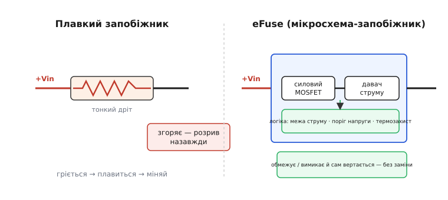
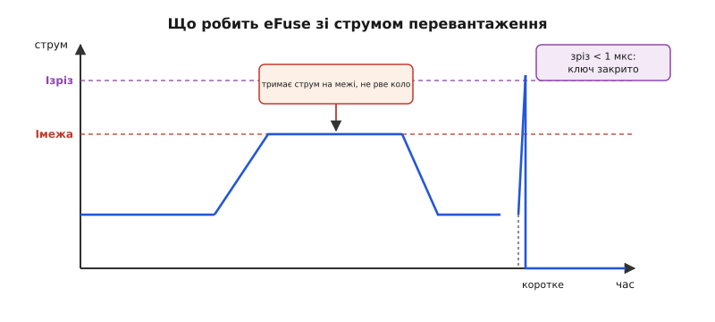
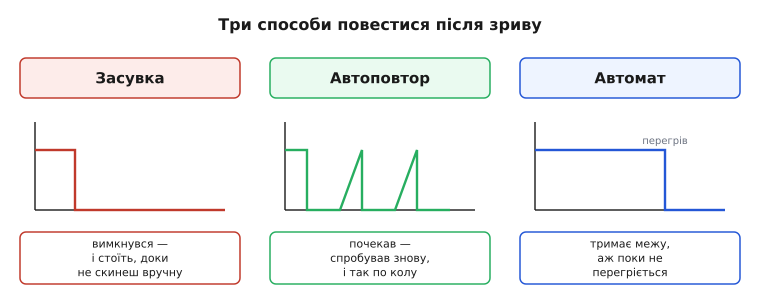

# Електронний запобіжник (eFuse)

<preknowlist>
- [MOSFET як ключ](book:electronics/mosfet-switch) — польовий транзистор у ролі вимикача: відкритий має малий опір Rds(on), закритий не пропускає струм.
- [Закон Ома](book:electronics/ohms-law) — напруга = струм · опір; звідси і падіння напруги V = I·R, і тепло P = I²·R.
- [Ключ живлення](book:electronics/load-switch) — силовий MOSFET у розрив плюсового проводу, що подає й знімає живлення навантаження; eFuse — його «розумна» версія.
</preknowlist>

Звичайний плавкий запобіжник — це шматок тонкого дроту, який згоряє, коли струм завеликий. Дешево, надійно, зрозуміло. Але в нього три вади, які в сучасній електроніці болять дедалі дужче: він **повільний** (поки дротик розжариться й розплавиться, минають мілісекунди — а то й секунди), **неточний** (розкид спрацювання ±25 % — норма, і той самий запобіжник рветься то на 3 А, то на 5) і **одноразовий** (спрацював — лізь усередину пристрою й міняй). **eFuse** (від англ. *electronic fuse* — «електронний запобіжник») — це мікросхема, що робить роботу запобіжника, але керовано: вона **вимірює** струм і напругу електронікою, вирішує за долі мікросекунди, і замість згоряти просто **зачиняє транзисторний ключ** — а коли аварія минула, знову його відчиняє. Заміняти нічого не треба.

Розберімо, з чого вона зроблена, чому реагує на порядки швидше за дротик, які саме біди ловить і як її увімкнути в реальну прошивку — включно з підступним питанням, яке вирішує сам розробник: після аварії **зачинитися назавжди чи спробувати знову**.

## Чому дротика вже мало

Щоб побачити, навіщо взагалі городити мікросхему замість копійчаного дроту, треба чесно подивитися, від чого захищаємо. Уяви типову плату: від шини 12 В живиться купа вузлів, серед них — SSD, радіомодуль, камера. Кожен має на вході електролітичний конденсатор на сотні мікрофарад. І ось два різні лиха.

Перше — **коротке замикання** (див. [коротке замикання](book:electronics/short-circuit) — раптове падіння опору навантаження майже до нуля, від чого струм злітає до сотень ампер за мікросекунди, обмежений лише опором проводів). Тут дротяний запобіжник надто повільний: поки він гріється, крізь плату вже пройшла руйнівна доза енергії, доріжки випарувалися, а сусідні мікросхеми просіли по живленню й перезавантажилися. Хочеться обірвати струм **до** того, як він устигне нашкодити, — за частку мікросекунди, а не за мілісекунди.

Друге — **кидок струму при вмиканні** (див. [inrush](book:electronics/inrush-current) — короткий сплеск струму в мить подачі живлення, коли розряджені вхідні конденсатори тягнуть майже коротке замикання, поки не зарядяться). Плавкий запобіжник тут не поможе взагалі — навпаки, від чесного кидка він може згоріти на пустому місці, бо не вміє відрізнити «нормальний старт» від «аварії». А в системах, де плату вставляють у працюючий кошик під напругою ([гаряче підключення](book:electronics/hot-swap)), кидок ще й просаджує спільну шину так, що падають сусідні плати.

Дротик не вміє нічого, крім «згоріти від тепла». eFuse же вимірює струм безперервно і **розрізняє ситуації**: старт — плавно наростити, перевантаження — притримати струм на межі, коротке — рубанути миттєво. Одна деталь замість запобіжника, [обмежувача пуску](book:electronics/inrush-ntc), діода зворотного струму й наглядача напруги разом.

## Що в неї всередині

eFuse — це, по суті, розумний [ключ живлення](book:electronics/load-switch) (силовий MOSFET у розрив плюсового проводу), навколо якого добудували давач струму й логіку рішень. Три частини:

- **Силовий MOSFET** — той самий ключ, крізь який тече весь струм навантаження. Його опір у відкритому стані Rds(on) — одиниці-десятки міліом, тож у нормі він майже не гріється й майже не з'їдає напруги.
- **Давач струму** — маленький опір (шунт) або дзеркальна копія силового транзистора, з якого логіка читає, скільки саме ампер зараз тече.
- **Логіка** — компаратори й таймери, що порівнюють виміряний струм із порогами, стежать за напругою й температурою кристала і вирішують, коли й як чіпати затвор силового ключа.


*Ліворуч — плавкий запобіжник: тонкий дріт гріється, плавиться, розрив назавжди, треба міняти. Праворуч — eFuse: силовий MOSFET у розрив, поряд давач струму, знизу логіка (межа струму, поріг напруги, термозахист). Замість згоряти, вона керує ключем — обмежує чи вимикає, а після аварії вертається сама.*

Головна практична перевага складається саме з цього: усе, що на дискретній платі було б окремими деталями — запобіжник, ключ, обмежувач пуску, діод зворотного струму, наглядач напруги, — спаковано в один корпус завбільшки з рисове зерно, і працює воно **керовано**, а не «на удачу тепла». Це прибирає з плати п'ять компонентів і додає точність, якої дротик не дасть у принципі.

## Дві швидкості: притримати чи рубанути

Найважливіша ідея в тому, як eFuse реагує на завеликий струм: **не одним порогом, а двома**, бо перевантаження й коротке замикання — різні звірі й вимагають різних реакцій.

**Помірне перевантаження** (струм повільно виліз за норму — навантаження запросило забагато, але не коротке). Тут eFuse не рве коло, а переходить у **режим обмеження струму** (англ. *current limiting*): вона починає **притримувати** струм на заданій межі Iмежа, підзакриваючи власний MOSFET рівно настільки, щоб крізь нього текло не більше Iмежа. Живлення навантаження при цьому просідає (весь надлишок напруги падає тепер на самій eFuse), але коло не обривається — короткий сплеск попиту переживається без вимкнення. Це набагато розумніше за дротик: багато перевантажень минущі (мотор рвонув, конденсатор дозарядився), і рвати через них усе живлення було б грубо.

**Коротке замикання** (струм стрибнув різко й високо). Чекати й м'яко регулювати тут не можна — за ті мікросекунди, поки логіка «думала» б, крізь ключ пройшла б руйнівна доза. Тому в eFuse є **другий, вищий поріг — швидкий зріз** (англ. *fast-trip*): окремий швидкий компаратор, що при перевищенні Iзріз **миттєво зачиняє** силовий MOSFET, не питаючи нікого. Час реакції — сотні наносекунд (у типових приладів швидкий компаратор рубає ключ приблизно за 250 нс). Це на **чотири-п'ять порядків** швидше за плавкий запобіжник, і саме тут головна перевага: коротке гаситься перш ніж воно встигне нашкодити.


*Помірне перевантаження (ліворуч): струм наростає, упирається в межу Iмежа й тримається на ній — коло не рветься, надлишок напруги падає на eFuse; знялося навантаження — струм вернувся в норму. Коротке замикання (праворуч): струм стрибає вище порога зрізу Iзріз, і швидкий компаратор зачиняє ключ менш ніж за мікросекунду.*

Різниця з дротяним запобіжником тут глибша, ніж просто «швидше». Дротик згортає всю аварію в одну величину — теплову дозу [I²t](book:electronics/i2t-protection) (інтеграл ∫i²dt: скільки тепла накопичилося в металі, поки тече струм — саме вона визначає, коли дротик розплавиться). eFuse же розділяє час і струм на **два незалежні рішення**: «наскільки високо» (поріг зрізу — миттєво) і «як довго терпіти помірний надлишок» (таймер режиму обмеження). Тому вона й точніша, і гнучкіша: коротке рубає за амплітудою за наносекунди, а затяжне перевантаження терпить рівно заданий час, а не «поки дротик нагріється».

## Не тільки струм: напруга, полярність, зворотний струм

Раз уже в розрив живлення поставили керований транзистор із мізками, гріх не доручити йому й інші напасті — і eFuse це роблять.

**Кидок струму на старті гасить сама eFuse.** Замість відчиняти ключ ривком (від чого розряджені конденсатори навантаження рвонули б короткозамкнений струм), логіка **повільно** піднімає напругу на затворі, і вихід наростає плавним фронтом. Крутість цього фронту (англ. *slew rate*, dVout/dt) задають одним зовнішнім конденсатором. Струм заряду вихідних конденсаторів дорівнює I = Cнав·dVout/dt — розтягнув фронт удесятеро, і пік-струм пуску впав удесятеро. Той самий фізичний прийом плавного пуску, що й у звичайному [ключі живлення](book:electronics/load-switch), лише вбудований і керований точним таймером, а не RC на затворі.

**Сплеск напруги обрізає внутрішній обмежувач.** Якщо на вході стрибне напруга (кинули навантаження на шину, спрацював індуктивний викид), eFuse не пустить цей стрибок на навантаження: внутрішній обмежувач (англ. *clamp*) **тримає вихід на безпечному стелі**, скидаючи надлишок на собі, поки триває сплеск (у типових приладів обмежувач реагує за одиниці мікросекунд). Так дороге навантаження за eFuse не бачить перенапруги, навіть якщо на вході коротка буря.

**Зворотну полярність і зворотний струм ловлять теж.** Багато eFuse блокують струм, що намагається текти **назад** — з виходу на вхід (коли вихідна напруга з якоїсь причини піднялася вище вхідної). Один MOSFET цього не вміє: його [вбудований body-діод](book:electronics/mosfet-back-to-back) пропустив би зворотний струм крізь начебто закритий ключ. Тому eFuse зі зворотним блокуванням усередині мають **два транзистори спина-до-спини** — рівно той самий двосторонній ключ, що стереже літієві акумулятори. А деякі приладу вміють і [захист від переполюсування](book:electronics/reverse-polarity-protection) — не пустити струм, якщо живлення підключили не тим боком.

**І нарешті — сама себе.** Якщо в режимі обмеження вся зайва потужність падає на MOSFET еFuse, кристал гріється. Тому в ній є **термозахист**: щойно температура кристала сягне межі (типово ~150 °C), eFuse зачиняється сама, рятуючи себе від згоряння. Це остання лінія, коли навантаження вперто тягне забагато, а обмеження струму не встигає розсіювати тепло.

## Головне рішення розробника: засувка, автоповтор чи автомат

Коли eFuse обірвала аварійний струм — що робити далі? Це не дрібниця з даташита, а **архітектурне рішення**, яке ти закладаєш під конкретну систему. Приладу дають вибір із трьох реакцій (зазвичай перемикається одною ніжкою MODE чи вибором моделі), і кожна має свій сенс.

**Засувка** (англ. *latch-off* — «зачинитися на защіпку»). eFuse вимикається й **лишається вимкненою**, доки її явно не перезапустять — імпульсом на ніжку EN або перезавантаженням живлення. Це найбезпечніший вибір там, де повторна спроба сама по собі небезпечна: якщо аварія — це справжнє коротке (пробитий конденсатор, замкнутий роз'єм), автоматичні спроби знову подати струм лише знову й знову били б по колу. Засувка каже: «сталося погане — стій, доки людина чи головний контролер не розбереться».

**Автоповтор** (англ. *auto-retry*). eFuse вимикається, **чекає** задану паузу — і сама пробує ввімкнутися знову; якщо аварія не минула, знову вимикається й знову чекає, і так по колу. Це доречно, коли аварія найімовірніше **минуща**: перевантаження від пускового моменту мотора, тимчасова просадка. Пауза між спробами дає силовому ключу охолонути, а середній струм крізь аварію лишається малим (короткі спроби, довгі паузи), тож нічого не перегрівається. Кількість спроб і паузу теж задають зовні.

**Автомат** (англ. *circuit-breaker* — як побутовий автоматичний вимикач). eFuse тримає струм на межі Iмежа скільки може, а вимикається лише коли **сама перегріється** від цього тримання. Проміжний варіант: живлення не рветься миттєво від будь-якого чиху, але й не буває безкінечним — фізика тепла ставить край.


*Засувка: один імпульс — і вимкнено назавжди, доки не скинеш вручну. Автоповтор: серія коротких спроб із паузами, поки аварія не мине. Автомат: тримає струм на межі довго, аж поки термозахист не рубане від перегріву.*

Вибір режиму — це рішення про **надійність системи**, і помилка тут дорого коштує. Поставив автоповтор туди, де аварія стійка (пробитий вихід), — і eFuse вічно клацає ввімк-вимк, гріється й зношується, а система «моргає» без кінця. Поставив засувку туди, де аварія минуща (пусковий кидок мотора), — і пристрій намертво вимкнув справний вузол через секундне перевантаження, доки хтось не прийде й не перезавантажить. Правило просте: **минуща аварія → автоповтор; стійка чи небезпечна → засувка; проміжне навантаження, де важлива безперервність, → автомат**.

## Прошивка: увімкнути, стежити, обробити зрив

З боку мікроконтролера eFuse — це дві-три лінії: **EN** (увімкнути/вимкнути ключ), **FLT** (вихід «сталася аварія», зазвичай [з відкритим стоком](book:electronics/open-collector-output) — активний нуль) і часто аналоговий вихід струму (напруга, пропорційна струму навантаження, — можна читати АЦП). Найпростіше керування:

**Умова.** ESP32 керує eFuse на вході SSD (12 В). Треба ввімкнути живлення на старті, а якщо eFuse зловила аварію (лінія FLT впала в нуль) — прочитати це й погасити зовнішній індикатор.

:::tabs
```cpp
#define EFUSE_EN   GPIO_NUM_25   // керує ніжкою EN мікросхеми eFuse
#define EFUSE_FLT  GPIO_NUM_26   // вхід аварії, активний нуль (open-drain)

void efuse_init(void) {
    gpio_set_direction(EFUSE_EN,  GPIO_MODE_OUTPUT);
    gpio_set_direction(EFUSE_FLT, GPIO_MODE_INPUT);   // назовні підтягнуто до +
    gpio_set_level(EFUSE_EN, 1);                      // відчинити ключ — подати живлення
}

// true, якщо eFuse ЗАРАЗ сигналить про аварію (FLT == 0)
bool efuse_fault(void) {
    return gpio_get_level(EFUSE_FLT) == 0;
}
```
```python
from machine import Pin

EFUSE_EN  = 25   # керує ніжкою EN мікросхеми eFuse
EFUSE_FLT = 26   # вхід аварії, активний нуль (open-drain)

en  = Pin(EFUSE_EN,  Pin.OUT)
flt = Pin(EFUSE_FLT, Pin.IN, Pin.PULL_UP)   # підтягнуто до +

def efuse_init():
    en.value(1)                             # відчинити ключ — подати живлення

# True, якщо eFuse ЗАРАЗ сигналить про аварію (FLT == 0)
def efuse_fault():
    return flt.value() == 0
```
:::

Тонкість, через яку часто спотикаються: у режимі **автоповтору** лінія FLT сіпається — то нуль (під час зриву), то знову «висока» (у паузі між спробами). Тому одноразове читання «зараз аварія» оманливе — під час паузи FLT ще «висока», хоч система вже клацає по колу. Правильно рахувати **зриви за вікно часу**: якщо їх забагато за кілька секунд — аварія стійка, і час гасити навантаження самим і кричати нагору, а не покладатися на автоповтор.

:::tabs
```cpp
// Лічимо зриви FLT у ковзному вікні; якщо їх забагато — аварія стійка.
static int  fault_hits    = 0;
static bool prev_fault    = false;

// Кличемо, приміром, кожні 10 мс із таймера.
bool efuse_persistent_fault(void) {
    bool now = efuse_fault();
    if (now && !prev_fault) fault_hits++;   // рахуємо ФРОНТ у зрив, не рівень
    prev_fault = now;

    // за 3 с (300 викликів по 10 мс) більш ніж 5 зривів — стійка аварія
    static int window = 0;
    if (++window >= 300) {
        bool persistent = (fault_hits > 5);
        window = 0; fault_hits = 0;         // почати нове вікно
        return persistent;
    }
    return false;
}
```
```python
# Лічимо зриви FLT у ковзному вікні; якщо їх забагато — аварія стійка.
_fault_hits = 0
_prev_fault = False
_window     = 0

# Кличемо, приміром, кожні 10 мс із таймера.
def efuse_persistent_fault():
    global _fault_hits, _prev_fault, _window
    now = efuse_fault()
    if now and not _prev_fault:
        _fault_hits += 1                    # рахуємо ФРОНТ у зрив, не рівень
    _prev_fault = now

    # за 3 с (300 викликів по 10 мс) більш ніж 5 зривів — стійка аварія
    _window += 1
    if _window >= 300:
        persistent = _fault_hits > 5
        _window = 0                         # почати нове вікно
        _fault_hits = 0
        return persistent
    return False
```
:::

**Висновок.** Рахуємо саме **фронти** входу в аварію (перехід 0→1 змінної `now`), а не поточний рівень, — тому короткі паузи автоповтору не збивають лік. Понад п'ять зривів за три секунди означають, що аварія не минає сама; тоді прошивка сама зачиняє eFuse через EN (переводить у «засувку» програмно) і повідомляє про несправність, замість дозволяти вічне клацання.

## Скільки тепла й скільки напруги вона з'їдає

Дві числові перевірки роблять завжди, бо саме на них eFuse або підходить, або ні.

**Перша — падіння напруги й нагрів у нормі.** Крізь eFuse тече весь струм навантаження, і на її Rds(on) падає напруга, а падіння × струм = тепло в кристалі.

**Умова.** eFuse із Rds(on) = 34 мОм живить навантаження 3 А при 12 В. Скільки напруги втратимо й скільки грітиме сама eFuse?

```
Падіння на відкритому ключі:
  Vdrop = I · Rds(on) = 3 · 0.034 = 0.102 В        ← ~0.1 В, навантаження бачить 11.9 В

Тепло, що розсіює сам кристал eFuse у нормі:
  P = I² · Rds(on) = 3² · 0.034 = 9 · 0.034 = 0.306 Вт   ← треба відвести з корпусу
```

Третина вата на маленькому корпусі — уже відчутно: без нормального тепловідводу (полігон міді під корпусом) кристал підповзе до порога термозахисту раніше, ніж хотілося б. Тому Rds(on) — не косметика: він прямо задає і скільки напруги дійде до навантаження, і як гаряче буде самій мікросхемі.

**Друга — найгірший момент, режим обмеження в коротке.** Ось де eFuse страждає найдужче. Поки вона тримає струм на Iмежа, а вихід закорочений у нуль, **вся вхідна напруга падає на самій eFuse**, і множиться вона на повний струм межі.

**Умова.** Та сама eFuse тримає Iмежа = 4.5 А, а вихід замкнутий на землю (Vout ≈ 0), Vin = 12 В. Скільки тепла в ній за цей час?

```
Потужність у режимі обмеження (найгірший випадок):
  P = (Vin − Vout) · Iмежа = (12 − 0) · 4.5 = 54 Вт (!)
```

54 вати — це в **176 разів** більше за нормальні 0.3 Вт. Жоден маленький корпус такого не витримає скільки-небудь довго — і саме тому eFuse **не тримає** цей режим вічно: тут у гру вступає термозахист (зачиниться за мілісекунди) або швидкий зріз (якщо струм перескочив і поріг Iзріз — рубане за наносекунди). Ця цифра пояснює, чому «просто тримати струм на межі» не може бути стратегією надовго: фізика тепла ставить жорсткий край, і вся конструкція eFuse крутиться навколо того, щоб **встигнути** зачинитися, поки кристал ще живий.

## Де межа і чого стерегтися

eFuse — не панацея, і чесно знати її межі.

**Вона не гальванічна ізоляція.** eFuse рве струм, але вхід і вихід лишаються електрично одним колом (спільна земля, кремнієвий ключ між ними). Де треба справжній бар'єр між боками — потрібні оптрони чи трансформатори, не eFuse.

**Її MOSFET має свою [зону безпечної роботи](book:electronics/mosfet-power-switch)** (SOA — де струм і напруга обмежені **одночасно**). У режимі обмеження в коротке на ключі стоїть повна напруга при повному струмі — саме той кут SOA, де транзистори гинуть від вторинного пробою. Тому в eFuse для високих напруг межу струму навмисно **знижують** зі зростанням напруги на ключі (англ. *foldback*), щоб не вийти за SOA, — інакше сама eFuse згоріла б швидше за навантаження.

**Вона дорожча й складніша за дротик.** Там, де досить тупого одноразового захисту (мережевий ввід, груба силова лінія), плавкий запобіжник дешевший і не має власного струму спокою. eFuse виправдана там, де цінують швидкість, точність, самовідновлення й пакування функцій в один корпус, — тобто на низьковольтних платах із дорогим і чутливим навантаженням.

І окрема плутанина з назвою, яку варто знати: слово «eFuse» несе **два зовсім різні значення**. Тут ідеться про **захисну мікросхему в проводі живлення**. Але тим самим словом «eFuse» називають ще й **одноразовий кремнієвий запобіжник усередині чипів** — крихітну доріжку, яку процесор випалює струмом раз і назавжди, щоб зашити серійний номер, ключ чи обійти дефектний блок. Спільного між ними — лише корінь «fuse» і те, що обидва електронні; принцип, призначення й застосування різні. Коротка [історія обох назв](book:electronics/efuse/hist-efuse-naming.md) розводить їх остаточно.
