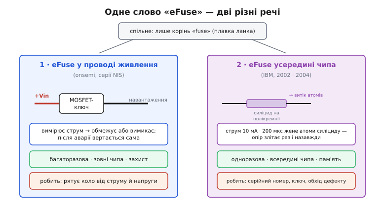

# 📜 Дві історії одного слова: як «eFuse» стало значити дві різні речі

Мало яке слово в електроніці так підступно двозначне, як «eFuse». Гуглиш його — і половина сторінок веде до захисної мікросхеми, яку ставлять у провід живлення замість плавкого запобіжника; друга половина веде до чогось геть іншого — крихітної кремнієвої доріжки **всередині** процесора, яку той сам випалює струмом раз і назавжди. Це не два різновиди одного пристрою. Це два різні винаходи з різних кутків електроніки, які випадково зійшлися на одному короткому імені, бо обидва спираються на давню ідею запобіжника (англ. *fuse*, від лат. *fusus* — «розплавлений»). Далі — родовід кожного значення й пояснення, чому вони не заважають одне одному попри однакову назву.


*Ліворуч — захисний eFuse у проводі живлення: MOSFET-ключ, що вимірює струм, обмежує чи вимикає й вертається сам; багаторазовий, зовні чипа, його робота — берегти коло. Праворуч — eFuse усередині чипа: доріжка силіциду на полікремнії, яку струм 10 мА за 200 мкс «випалює» електроміграцією раз і назавжди; одноразовий, усередині кристала, його робота — пам'ять (серійний номер, ключ, обхід дефекту). Спільне — тільки корінь «fuse».*

## Спершу — що взагалі спільного

Щоб розвести два значення, треба спочатку чесно назвати те єдине, що їх ріднить, — інакше плутанина здаватиметься випадковою, а вона не зовсім випадкова. Обидва пристрої успадкували головну ідею плавкого запобіжника: **навмисно ослаблена ланка, яку струм руйнує, розриваючи коло**. У класичному запобіжнику це шматочок тонкого дроту, що плавиться від тепла. І захисний eFuse, і чиповий eFuse — обидва «електронні запобіжники» в тому сенсі, що роль колишньої дротинки в них грає керована електроніка, а не сліпе тепло. Звідси й спільна літера «e» попереду: *electronic*.

На цьому спільне вичерпується. Далі дороги розходяться так круто, що плутати ці дві речі — все одно що плутати автоматичний вимикач у щитку з перегорілим дротом усередині лампочки лише тому, що обидва «щось про перегоряння». Спільний корінь є, а пристрій, принцип і призначення різні. Розберімо кожну лінію окремо — і стане видно, чому одна назва тут не створює справжньої плутанини для того, хто розуміє суть.

## Лінія перша: захисна мікросхема в проводі живлення

Це те значення, у якому «eFuse» вживають, коли говорять про [коротке замикання](book:electronics/short-circuit) на платі й про те, чим його гасити. Тут eFuse — це закінчена мікросхема: силовий MOSFET у розрив плюсового проводу плюс давач струму й логіка, що вимірює струм і напругу та керує ключем. Замість згоряти, вона обмежує струм на заданій межі або вимикається, а коли аварія минула — вертається сама. Багаторазова, зовні будь-якого чипа, і вся її робота — **берегти коло** від струму, напруги, зворотної полярності.

Питання для історії тут вузьке, але цікаве: **звідки взялося саме слово «eFuse» для цього класу мікросхем** — адже сам собою «розумний захисний ключ» існував і раніше, просто називався описово (обмежувач струму, гарячозмінний контролер, електронний вимикач).

Тут доводиться бути обережним із доказами. У численних технічних оглядах, довідкових статтях виробників і навчальних матеріалах повторюється теза: термін «eFuse» для захисної мікросхеми **ввела на ринок компанія onsemi** (до 2011 року — ON Semiconductor, виокремлена 1999 року з Motorola), випустивши перші такі прилади — серії **NIS5xxx** (наприклад, NIS5020 / NIS5021 / NIS5820 «+12 Volt Electronic Fuse») і згодом **NIS61xx** (наприклад, NIS6150 «+5 Volt Electronic eFuse»). Ці партномери й самі назви даташитів «Electronic Fuse» справді існують і легко перевіряються в каталозі onsemi.

**Статус доказовості: правдоподібно, але строго не документоване (вендорне твердження).** Ось у чому тонкість. Що onsemi випускала серії NIS5xxx/NIS61xx під назвою «Electronic Fuse» — це факт із першоджерела (даташити). А от що саме onsemi **першою у світі** вжила слово «eFuse» для цього класу приладів і тим «увела» термін — це твердження живе в **вторинних** джерелах (оглядах, блогах, переказах) і не підкріплене жодним первинним документом, який фіксував би пріоритет назви. Тут корисно згадати правило про винаходи: одна річ — мати ідею, зовсім інша — першим її **назвати** так, щоб назва прижилася, і ще інша — це задокументувати. Термінам взагалі рідко ставлять дату народження; вони просвердлюються в мову з даташитів і розмов інженерів. Тож чесне формулювання таке: **onsemi популяризувала назву «eFuse» для захисної мікросхеми й була серед перших, хто виніс її в каталог, — але «ввела термін» тут статус радше правдоподібного вендорного переказу, а не строго встановленого факту.** Хто вимовив це слово першим і коли саме — не встановлено.

Чому це не дрібниця. Атрибуційні міфи в техніці народжуються саме так: хтось у популярній статті пише «X винайшов термін Y», наступний переказує без перевірки, і за десяток повторів це стає «загальновідомим». Якщо ж дивитися на первинні джерела, часто виявляється, що термін дифузно з'явився в кількох місцях. Тому тут краще сказати менше й точніше: назва «Electronic Fuse / eFuse» для захисного ключа стала загальновживаною значною мірою завдяки каталогу onsemi, а далі її підхопили всі — Texas Instruments, Toshiba й решта роблять ті самі прилади під тим самим словом.

## Лінія друга: одноразовий кремнієвий запобіжник усередині чипа

А тепер — те саме слово в геть іншому світі. Усередині сучасного процесора, мікроконтролера чи будь-якого складного чипа є десятки, а то й мільйони крихітних елементів, кожен з яких можна одноразово «перепалити» електрично — і кожен з них теж називають **eFuse**. Але це вже не мікросхема-захисник, а **комірка одноразової пам'яті**, вбудована прямо в кремній. Її роль — не рятувати коло, а **запам'ятати один біт назавжди**: зашити серійний номер, криптографічний ключ, калібрувальне число чи команду «оминай ось цей дефектний блок».

Народилося це значення в лабораторії IBM, і тут, на щастя, є тверді первинні джерела й конкретні імена — тому історію можна розповісти чесно, без легенд.

**Технологію й саму назву «eFUSE» опублікували 2002 року** у рецензованому листі: C. Kothandaraman, S. K. Iyer та S. S. Iyer, «Electrically programmable fuse (eFUSE) using electromigration in silicides», *IEEE Electron Device Letters*, том 23, № 9, с. 523–525. Тобто спершу — наукова публікація з робочим фізичним принципом, а не рекламна заява. Автори — інженери IBM; двоє з них однофамільці Iyer (Субраманіан С. Iyer згодом стане найвідомішим публічним обличчям цієї технології).

**Публічний галас навколо неї здійнявся 2004 року**, коли IBM оголосила, що вбудовує ці запобіжники у процесори Power5 та інші кристали 90-нм техпроцесу, і назвала це «технологією морфінгу чипа» (англ. *chip morphing*). 2 серпня 2004 року про це написав The Register, а 1 жовтня 2004 року вийшла стаття в IEEE Spectrum під назвою «Electrical Fuse Lets Chips Heal Themselves» («Електричний запобіжник дозволяє чипам лікувати себе»), де технологію пояснив Субраманіан Iyer, названий distinguished engineer і керівником розробки 90-нм технології в дослідницькому центрі IBM в Іст-Фішкілі, штат Нью-Йорк.

Тут важлива різниця в статусі трьох тверджень, бо їх раз у раз змішують:

- **Ідея й робочий принцип** — опубліковані 2002 року (наукова стаття). Це первинне джерело.
- **Продукт і публічна назва «chip morphing»** — 2004 рік (Power5, 90 нм; прес-матеріали).
- «IBM винайшла eFuse **2004 року**» — поширене спрощення, і воно **зсунуте на два роки**: сама технологія й термін eFUSE існували в літературі вже 2002-го; 2004-й — це рік продукту й розголосу, а не винаходу.

**Статус доказовості: усталено (первинні джерела).** І наукова публікація 2002 року, і обидві статті 2004 року (The Register, IEEE Spectrum) з іменем Субраманіана Iyer — доступні й перевіряються. Тож «IBM eFuse» коректно датувати **2002 (принцип) / 2004 (продукт)**, а не просто «2004».

### Як він фізично працює — і чому це «запобіжник навпаки»

Найгарніше в цьому винаході те, що він обертає на користь явище, яке зазвичай **вбиває** чипи. Це [електроміграція](book:physics/electromigration) — дрейф атомів металу під ударами електронів у дуже щільному струмі; за десятиліття вона поволі роз'їдає провідники всередині мікросхем і вважається ворогом надійності. IBM зробила з ворога інструмент.

Комірка eFuse — це коротка доріжка полікристалічного кремнію (полікремнію), укрита тонким шаром **силіциду кобальту** (сполуки металу з кремнієм, що добре проводить). У статті IEEE Spectrum наводять розміри: смужка близько 1.2 мкм завдовжки й 0.12 мкм завширшки. У спокої вона добре проводить — це «цілий» запобіжник, логічний нуль. Щоб «перепалити» його в одиницю, крізь доріжку пропускають короткий сильний імпульс: за даними IEEE Spectrum, приблизно **10 мА протягом 200 мкс** при звичайній робочій напрузі чипа (близько 2.5 В). Ось що при цьому діється:

```
Спокій:      силіцид суцільний   → низький опір → «0»
Імпульс:     10 мА · 200 мкс      → атоми силіциду дрейфують електроміграцією
Після:       у доріжці — розрив   → високий опір → «1»  (назавжди)
```

Ключова тонкість, через яку цей запобіжник надійніший за старі лазерні: **полікремнієва основа не рветься механічно**. Мігрує (розповзається) лише шар силіциду, лишаючи в доріжці ділянку з різко вищим опором. Немає вибуху, немає уламків, немає ризику пошкодити сусідів — просто в одному місці силіцид «поїхав», і опір підскочив у багато разів. Саме цю різницю опору «до/після» потім легко зчитати простим компаратором: високий опір читається як записана одиниця.

> 🔧 **Навіщо це.** Раніше такі одноразові біти «пропалювали» лазером на етапі виробництва — дорого, повільно й лише на заводі. eFuse від IBM «палиться» звичайним струмом від внутрішньої логіки, тому чип може прошити себе сам — і на заводі, і вже в готовому виробі. Це відчинило кілька застосувань відразу: **самолагодження** (вбудований самотест знаходить дефектний блок пам'яті чи ядра й пропалює запобіжники, щоб обійти його справним резервним — так рятують кристали, які інакше пішли б у брак), **індивідуалізація** (у кожен чип зашивають унікальний серійний номер чи ключ), **підстроювання** (записом кількох бітів коригують внутрішні напруги під конкретний кристал). Усе це — не «захист від струму», а **енергонезалежна пам'ять на одноразових запобіжниках**.

Через цю функцію чиповий eFuse — родич не захисного ключа, а таких речей, як OTP-пам'ять і «fuse bits» у мікроконтролерах: усе це способи записати щось у кремній **раз і назавжди**. І саме тому в світі [інтегральних схем](book:electronics/integrated-circuit) слово «eFuse» майже завжди означає **цю** комірку пам'яті, а не мікросхему-запобіжник із сусіднього розділу каталогу.

## Чому обидві назви прижилися й не заважають одна одній

Лишається питання, від якого й почалася ця плутанина: чому інженери не розвели ці дві речі різними словами? Адже двозначність у техніці зазвичай довго не живе — її витісняють точніші назви.

Причина в тому, що **обидва значення чесно заслужили корінь «fuse», і кожне живе у своєму світі, майже не перетинаючись із іншим**. Спробуймо простежити, чому так вийшло.

Захисний eFuse потрапляє в поле зору **схемотехніка плати**: людини, що вибирає, чим боронити 12-вольтову шину від короткого. Для неї «eFuse» — це компонент у корпусі, який ставиш у провід, поряд із запобіжниками й ключами живлення. Чиповий eFuse потрапляє в поле зору **проєктувальника кристалів** і **прошивача**: людини, що читає серійний номер чипа чи думає, як обійти дефектний блок. Для неї «eFuse» — це рядок у карті пам'яті мікроконтролера. Ці двоє рідко читають ті самі даташити, і в кожному контексті слово однозначне: на платі — захисник, у кремнії — пам'ять. Двозначність існує лише для того, хто дивиться на обидва світи згори — як ми зараз.

До того ж кожне значення **по-своєму правдиве до кореня**. Захисний eFuse справді робить роботу запобіжника (рве аварійний струм), лише керовано й багаторазово. Чиповий eFuse справді є запобіжником у буквальному фізичному сенсі — ланкою, яку струм необоротно перепалює, — просто його «перегоряння» тут не аварія, а корисний запис біта. Жодна назва не є натяжкою; обидві точні, кожна у свій бік. Тому мова й не стала їх розводити: у своєму контексті плутанини немає, а спільний корінь навіть доречний.

Практична мораль коротка. Зустрівши «eFuse», не питай «що це таке взагалі» — питай «**де** воно»: у проводі живлення чи всередині чипа. Відповідь на це «де» одразу каже, про яке з двох значень мова, бо принцип і призначення в них різні, а спільний у них лише корінь — стара добра плавка ланка, яку струм руйнує, щоб щось сталося: там — щоб урятувати коло, тут — щоб назавжди запам'ятати біт.
