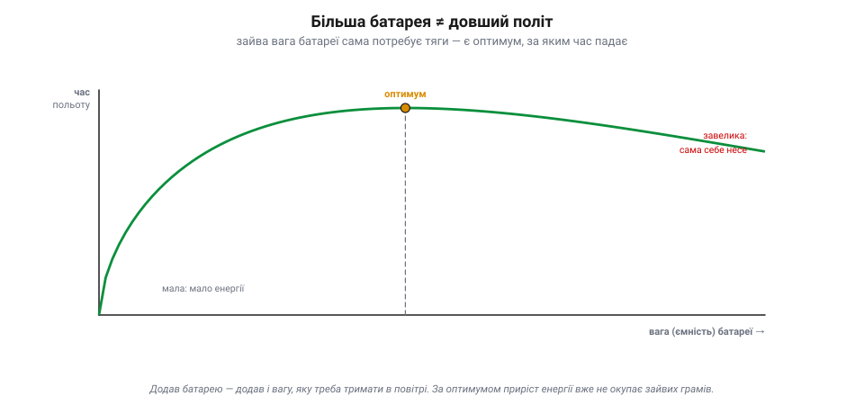
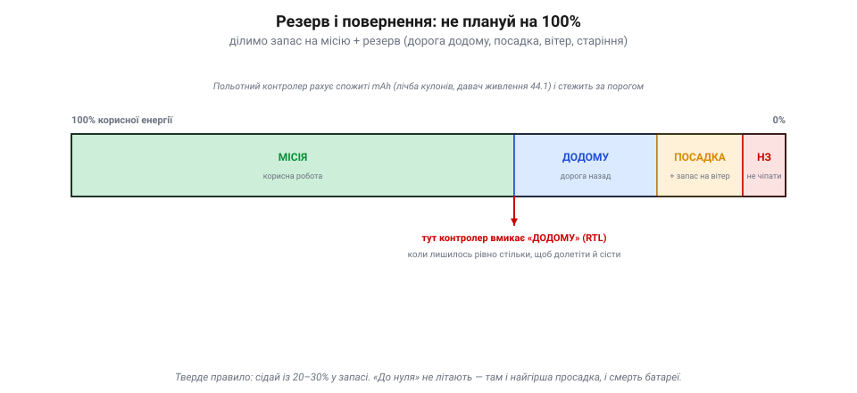

# Бюджет енергії: надовго вистачить

<preknowlist>
- [Акумулятор](book:electronics/batteries) — що таке ємність і заряд комірки та чому нижче певної напруги її не можна саджати.
- [C-rate й просадка](book:electronics/c-rate) — як батарея віддає струм під навантаженням і чому напруга під ним просідає.
</preknowlist>

Уміти [читати заряд батареї](book:electronics/batteries), розуміти, як вона [віддає енергію під навантаженням](book:electronics/c-rate) і як її [безпечно заряджати](book:electronics/cc-cv-bms), — це ще не відповідь на найпрактичніше питання, заради якого все й рахують: **чи вистачить заряду на політ?** Відповідь дає **бюджет енергії** (від англ. *budget* — кошторис, розпис прибутків і витрат): простий розрахунок, що з'єднує запас у батареї з витратою апарата й каже, скільки хвилин ти протримаєшся в повітрі. Без нього політ — лотерея «сяде — не сяде».

### Головна формула: запас ділимо на витрату

Серце бюджету — одне ділення:

```
час польоту = корисна енергія (Вт·год) ÷ середня потужність (Вт)
```


*Бюджет енергії в чотири кроки. Повна енергія пакета — ємність × напруга (5 А·год × 14.8 В = 74 Вт·год). Із неї беруть лише ~80% **корисних** (нижче ~3.3 В/комірку не сходять) — близько 59 Вт·год. Це ділять на **середню потужність** витрати (скажімо, 300 Вт) — і дістають час: ≈ 0.20 год ≈ 12 хвилин. Рахунок ведуть у ват-годинах, бо лише вони стикуються з ватами витрати.*

Чому саме ват-години, а не звичні на наклейці міліампер-години? Бо mAh — це лише **заряд**; енергію дає заряд, помножений на напругу, і тільки енергія міряється в тих самих одиницях, що й витрата у ватах. Тому перший крок бюджету — перевести ємність із А·год у Вт·год, і аж тоді ділити.

**Порахуймо на пакеті 4S 5000 mAh.**

```
повна енергія = 5.0 А·год × 14.8 В    = 74.0 Вт·год
корисних 80%  = 74.0 Вт·год × 0.80    = 59.2 Вт·год
час польоту   = 59.2 Вт·год ÷ 300 Вт  ≈ 0.20 год ≈ 12 хв
```

Повна енергія — ємність на напругу: 5 А·год × 14.8 В = 74 Вт·год. Але всю її взяти не можна: нижче ~3.3–3.5 В на комірку [сходити не варто](book:electronics/batteries), тож **корисних** лишається десь **80%** — близько 59 Вт·год. Поділивши це на середню витрату (~300 Вт для апарата в польоті), дістаємо ≈ 12 хвилин. Ось і весь бюджет.

Але у цих цифрах ховаються два «але». Перше — **корисні 80%, а не 100%**: планувати на повне висаджування означає вбивати батарею й ризикувати [просадкою напруги](book:electronics/c-rate) на кінці, тож у формулу завжди йде корисна частка, а не повна ємність із наклейки. Друге — потужність тут **середня**, а політ нерівний: зависання, ривки, боротьба з вітром. Тому 12 хвилин — це стеля за ідеальних умов; реально закладай менше. Із того самого ділення видно й дві швидкі прикидки для голови: подвоїш середню потужність — удвічі коротший політ; візьмеш удвічі більше корисних Вт·год — удвічі довший, але лише поки зайва вага не з'їсть виграш.

### Куди йдуть вати: бюджет потужності

Звідки береться та «середня потужність»? Її складають усі споживачі апарата — але вони геть нерівні. Левову частку з'їдають **мотори**, щоб просто втримати апарат у повітрі; решта — крихти на їхньому тлі, та в бюджет їх теж вписують.


*Бюджет потужності типового квадрокоптера. Зависання моторів — близько 90% усієї витрати; саме тому час польоту найперше визначають вага й ефективність тяги. Решту складають відеопередавач, бортовий комп'ютер машинного бачення, серво й підвіс, а також дрібнота — польотний контролер, давачі, приймач. Поодинці крихти, але разом — кілька відсотків, і течуть вони постійно, навіть коли апарат просто висить.*

Для типового квадрокоптера зависання моторів — це десь **90%** усієї витрати; саме тому час польоту найперше визначають **вага** апарата й **ефективність** його тяги (більший гвинт на менших обертах — ощадніший). Решту складають **відеопередавач** (одиниці-десяток ватів), **бортовий комп'ютер** для машинного бачення (теж одиниці-десяток), **серво й підвіс**, а також дрібнота — польотний контролер, давачі, приймач (разом одиниці ватів). Поодинці це крихти, але разом вони з'їдають кілька відсотків бюджету, а головне — течуть **постійно**, навіть коли апарат просто висить.

Тому повний бюджет — це сума: потужність зависання плюс уся «електроніка на борту». Для апарата з важким корисним навантаженням (камера, обчислювач, підвіс) ця «дрібнота» вже не така дрібна. Звідси й перше правило довшого польоту: бий не по крихтах, а по найбільшій статті — **знижуй вагу** й бери ефективнішу тягу (більші гвинти, правильні мотори), бо саме мотори з'їдають ті 90%. А ненажерливий вантаж на кшталт потужного обчислювача чи прожектора вписуй у бюджет окремо: він точить запас від зльоту до посадки, а не лише на маневрах.

### Чому більша батарея не рятує

Здавалося б, рецепт довшого польоту очевидний: постав батарею більшу. Але тут чигає пастка: більша батарея **важча**, а важчий апарат мусить **дужче тягти**, щоб її ж і нести, — і та зайва тяга з'їдає додаткову енергію.


*Час польоту проти ваги батареї. Спершу більша батарея додає хвилин, але приріст дедалі менший, аж поки в оптимумі не спиняється, а далі час навіть падає: батарея стає така важка, що левова частка її енергії йде на те, щоб тримати в повітрі саму себе. Тому в кожного апарата є оптимальна вага батареї, і «найбільша» — не значить «найдовша».*

Виходить крива з **горбом**: попервах більша батарея таки додає хвилин, але приріст дедалі менший, аж поки в **оптимумі** не спиняється, а далі час навіть **падає** — батарея стає така важка, що левова частка її енергії йде на те, щоб тримати в повітрі саму себе. Тому в кожного апарата є **оптимальна вага батареї**, і просто «взяти найбільшу» не лише не подовжить політ, а й може скоротити. За цим стоїть фундаментальна межа **щільності енергії**, лише з практичного боку: важить не скільки всього енергії, а скільки її на грам.

> 📜 Що тривалість польоту залежить від енергії, ваги й ефективності, зрозуміли ще на світанку авіації. Французький піонер **Луї Бреге** (*Louis Breguet*) — авіаконструктор та інженер — близько 1919 року вивів знамениті **рівняння дальності й тривалості Бреге** (до тих самих формул незалежно дійшли й інші інженери тих років, як-от Коффін, — річ для інженерної думки звична): вони зв'язали, як далеко й як довго протримається літак, із запасом палива, вагою та аеродинамічною досконалістю. Для електричного апарата змінилося лише «паливо» — замість бензину Вт·год у батареї, — але логіка та сама: дальність і час ростуть із запасом енергії на одиницю ваги й падають із вагою конструкції. Сторічна формула досі керує і реактивним лайнером, і твоїм дроном.

Практичний висновок із горба простий: не женися за «найбільшою банкою». Для свого апарата шукай **оптимум ваги**, а не максимум ємності. А якщо хочеш суттєво довший політ, чесний шлях — не товща батарея, а **легший апарат**, ефективніша тяга або якісніші комірки (більше Вт·год на грам): додати грамів на борт часто означає відняти хвилин.

### Резерв і повернення: не плануй на нуль

І останнє, найважливіше для безпеки: **ніколи не плануй використати весь бюджет**. Реальний політ повен несподіванок — зустрічний вітер назад, незапланований маневр, постаріла батарея, що віддає менше. Тому корисну енергію ділять не на «всю місію», а на **місію плюс резерв**.


*Як ділять корисний запас. Не вся енергія йде на місію: за нею — резерв на дорогу додому, посадку із запасом на вітер і недоторканний залишок. Польотний контролер рахує спожиті mAh (лічба кулонів давачем живлення) і вмикає **повернення (RTL)** рівно тоді, коли лишилось стільки, щоб долетіти й сісти. Тверде правило — садити з 20–30% у запасі.*

Працює це так. Польотний контролер увесь час **рахує спожите** — лічить витрачені mAh [давачем живлення](root:embedded/onboard-sensors) (лічба кулонів) і/або стежить за напругою під навантаженням. Щойно лишається рівно стільки, скільки треба, **щоб долетіти додому й сісти**, він сам умикає **повернення** (*RTL — return to launch*) чи інший [failsafe](book:programming/flight-controller). Тобто межу не «прикидають на око» — її стереже автоматика, бо ціна помилки — апарат, що впав, не дотягнувши.

Тверде практичне правило: **сідай із 20–30% у запасі**. «До нуля» не літають з трьох причин одразу: за низького заряду найгірша [просадка](book:electronics/c-rate), [глибокий розряд убиває батарею](book:electronics/batteries), а будь-яка несподіванка — вітер, промах із курсом — уже не лишає права на помилку. Тому поріг failsafe став **із запасом на дорогу назад**, а не «поки зовсім не сяде»: апарат має вертатися, коли ще має чим долетіти. І зважай на старіння: торішня батарея віддає менше, ніж каже наклейка, тож резерв для неї закладай більший.

Резерв — це не марнотратство, а страховка, яка одного дня поверне апарат додому. Бо найкращий бюджет енергії — той, що завжди трохи песимістичний.
