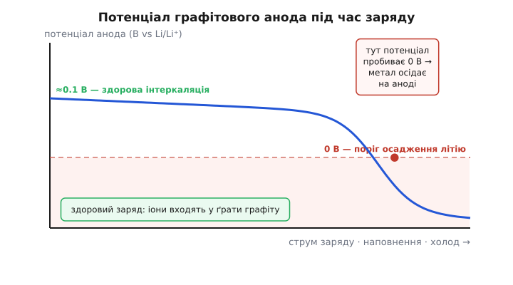
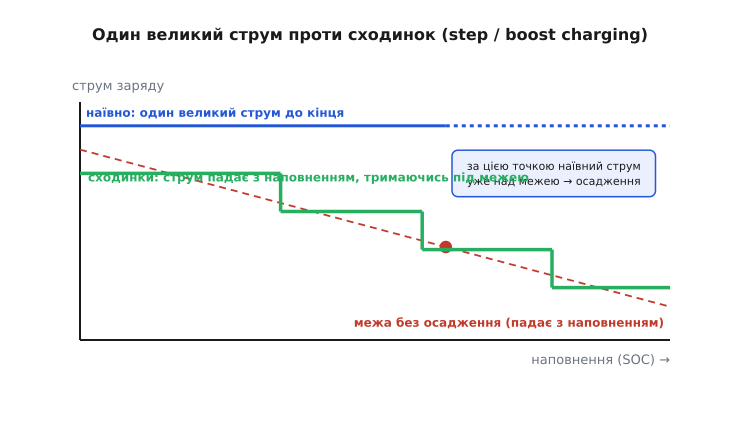
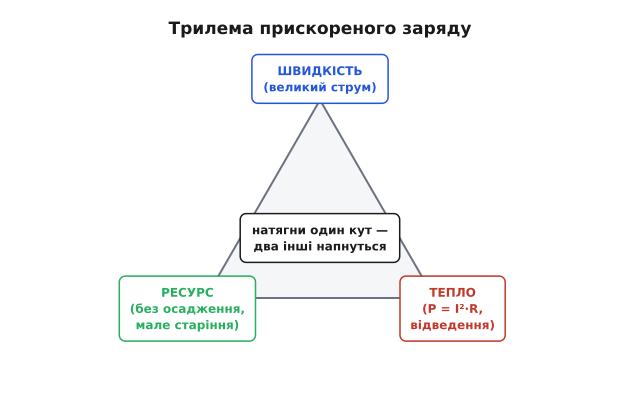

# Прискорений заряд літію

Зарядити літієву комірку за годину вміє будь-який дешевий чип. Зарядити її за двадцять хвилин — і при цьому не вбити за півсотні циклів і не влаштувати пожежу — це вже інженерія на межі хімії. Уся складність прискореного заряду (англ. *fast charging*) в одному: батарея не проти взяти більший струм, проти нього **графітовий анод**. Перевищиш поріг — і замість того, щоб чемно зайти в кристалічні ґрати графіту, літій почне **осідати металом** на його поверхні. Це і псує ємність, і готує коротке замикання. Тому «швидко» — це не «дати більше струму», а точно знати, **скільки саме струму комірка стерпить у цю секунду**, і триматися трохи нижче цієї межі, яка сама повзе під час заряду.

Базовий алгоритм [CC/CV](book:electronics/li-ion-charger) відповідає на питання «як безпечно наповнити комірку», але робить це консервативно — з фіксованим, свідомо помірним струмом. Прискорений заряд бере той самий алгоритм і питає інакше: **де насправді лежить стеля струму і як підійти до неї впритул, не переступивши**. Щоб це зрозуміти, доведеться спуститися до анода й побачити, що там ламається першим.

### Чому не можна просто дати більший струм

Розряд літію проходить легко: іони йдуть з анода до катода, ніщо їм не заважає. На **заряді** їх женуть назад — заганяють іони літію (Li⁺) у графіт, де вони мають розміститися між шарами вуглецю (це зветься **інтеркаляція**, від лат. *intercalare* — вставляти). І ось тут криється вся драма.

Потенціал графітового анода, коли в нього заходить літій, дуже **низький** — близько 0.1 В відносно металевого літію (точніше, від 50 до 200 мВ vs Li/Li⁺, залежно від наповнення). А осадження чистого металевого літію відбувається рівно при **0 В** vs Li/Li⁺. Тобто робочий потенціал анода лежить лише на десяту частку вольта вище від небезпечної межі. Це підтверджена електрохімія, не оцінка «на око»: графіт заряджається буквально на волосину від точки, де починає рости метал.

> 🔧 **Навіщо це.** Цей вузький зазор — фізична причина, чому заряд літію не прощає поспіху, а розряд прощає. Проєктуючи швидкий заряд, ви весь час балансуєте на цих 0.1 вольта потенціалу анода — і жодна зовнішня схема не «домовиться» з хімією обійти цей поріг. Усе, що можна, — не дати аноду до нього доповзти.

Що ж штовхає потенціал анода вниз, до нуля? Струм. Точніше — **перенапруга** (англ. *overpotential*): щоб проштовхнути іони швидше, доводиться прикласти до анода надлишок напруги понад рівноважний, і цей надлишок росте з струмом. Додайте сюди омічне падіння на внутрішньому опорі (те саме `I × R`, що дає [просадку під навантаженням](book:electronics/c-rate)) і повільну дифузію іонів усередині частинок графіту — і потенціал анода під великим струмом **провалюється нижче 0 В**. У цю мить літію енергетично **вигідніше осісти металом** на поверхні, ніж пропхатися в ґрати.


*Робочий потенціал анода ≈0.1 В vs Li/Li⁺ — здорова інтеркаляція (іони входять у графіт). Великий струм, високе наповнення й холод додають перенапругу й тягнуть потенціал донизу. Пробивши поріг 0 В, він потрапляє в зону, де замість інтеркаляції росте металевий літій — це і є осадження (plating).*

Три речі тягнуть потенціал до обриву, і їх треба знати наперед. **Струм** — прямо: більший струм — більша перенапруга. **Наповнення** (SOC, англ. *state of charge*): що повніший анод, то важче втиснути наступний іон, то більша перенапруга при тому самому струмі — тому найнебезпечніша не порожня, а вже майже повна комірка. І **холод**: на морозі дифузія іонів млява, опір великий, перенапруга підскакує — саме тому нижче 0 °C літій не заряджають узагалі, там осадження гарантоване навіть на малому струмі.

### Що насправді ламає осадження

Варто чітко побачити, чому осадження літію (англ. *lithium plating*) — це не «трохи неоптимально», а справжня шкода, і одразу по двох фронтах.

Перше — **втрата ємності, і незворотна**. Металевий літій, що осів на аноді, здебільшого не повертається в роботу: він реагує з електролітом і перетворюється на **«мертвий літій»** — електрично відрізаний метал, який назавжди вибув із гри. Кожен цикл швидкого заряду з осадженням з'їдає трохи активного літію, і ємність падає помітно швидше за нормальне [старіння комірки](book:electronics/battery-aging). Батарея, яку ганяли швидким зарядом, деградує не поступово, а стрибками.

Друге, страшніше — **дендрити** (грец. *déndron* — дерево). Осілий літій росте не рівним шаром, а гострими голчастими наростами. Ці голки з циклами витягуються й можуть **проколоти сепаратор** — тонку плівку, що розділяє анод і катод. Прокол сепаратора — це внутрішнє коротке замикання, а внутрішнє коротке в зарядженій літієвій комірці означає лавинний нагрів і [тепловий розгін](book:electronics/battery-mechanics) з полум'ям. Так «швидка зарядка абияк» перетворює батарею на бомбу сповільненої дії — не одразу, а через десятки циклів, коли дендрит нарешті дотягнеться.

Найпідступніше те, що осадження **невидиме зовні**. Напруга й струм на клемах виглядають нормально; комірка ніби заряджається як слід. А метал тим часом росте всередині. Саме тому не можна визначати безпечний струм «на око по нагріву» — на момент, коли щось відчутно, шкоду вже завдано. Стелю струму треба знати **наперед**, з фізики, а не ловити постфактум.

### Стеля струму, що повзе: обмеження за SOC

Головний висновок з усього цього такий: **безпечний струм заряду не постійний**. Він високий, поки комірка порожня, і **падає в міру наповнення**, бо перенапруга анода з наповненням росте. Ось чому наївна ідея «взяти великий струм і тримати його до кінця» приречена: на старті цей струм безпечний, а десь на середині SOC він уже переступає межу, під якою немає осадження.


*Червона межа — найбільший струм без осадження; вона спадає з наповненням. Синя лінія — наївний один великий струм: спершу під межею, але після точки перетину вже над нею (осадження). Зелені сходинки — step/boost charging: струм починають великим на порожній комірці й ступінчасто зменшують, щоб щоразу лишатися під межею.*

Звідси народжується головний прийом прискореного заряду — **сходинковий заряд** (англ. *step charging*, багатоступеневий сталий струм, *multistage constant current*, MCC; агресивний варіант на самому початку часто звуть *boost charging*). Ідея пряма: не тримати один струм, а вести кілька фаз сталого струму, **зменшуючи струм сходинками** в міру наповнення. На порожній комірці ллємо великий струм — там межа висока й запас є. Наповнилася до якогось порога — **скидаємо струм на нижчу сходинку**, бо межа опустилася. І так кілька разів, аж поки на високому SOC струм не стане помірним — і далі вже класичний хвіст CV. Кожна сходинка тримається **під** межею осадження у своєму вікні наповнення, тож метал не росте ніде.

Виграш реальний і виміряний. Оптимізовані MCC-протоколи в дослідженнях дають десятки відсотків: одні скорочують час заряду на ~12–27% проти звичайного CC/CV, інші при тому самому часі **втричі зменшують втрату ємності** або суттєво подовжують ресурс. Різні роботи розходяться в цифрах, але напрям однаковий: **розумно розподілений по SOC струм заряджає швидше й м'якше, ніж один сталий**. Це усталений інженерний факт, а не маркетинг.

**Приклад (сходинковий заряд у прошивці).** Скінченний автомат: струм задаємо сходинками за виміряним SOC, кожна сходинка — своя стеля. SOC береться з [лічильника заряду / fuel gauge](book:electronics/state-of-charge).

:::tabs
```cpp
// Сходинки прискореного заряду: поки SOC нижчий за поріг — тримаємо струм цієї сходинки.
// Струми в мА для комірки 3000 мА·год: 1.5C → 1.0C → 0.6C → 0.3C.
struct Step { uint8_t soc_hi; uint16_t i_ma; };
static constexpr Step STEPS[] = {
    { 30, 4500 },   // 0..30%  — порожньо, межа висока: 1.5C
    { 60, 3000 },   // 30..60% — 1.0C
    { 80, 1800 },   // 60..80% — 0.6C
    {100,  900 },   // 80..100% — хвіст: 0.3C, далі перехід у CV
};

uint16_t boost_charge_setpoint(uint8_t soc, float cell_temp_c) {
    // Поза температурним вікном швидкий заряд заборонено — тут жодних сходинок.
    if (cell_temp_c < 10.0f || cell_temp_c > 45.0f) return 0;
    for (const Step& s : STEPS)
        if (soc < s.soc_hi)
            return s.i_ma;             // струм поточної сходинки
    return 0;                          // повна — заряд зупинено
}
```
```python
# Сходинки прискореного заряду: поки SOC нижчий за поріг — тримаємо струм цієї сходинки.
# Струми в мА для комірки 3000 мА·год: 1.5C → 1.0C → 0.6C → 0.3C.
STEPS = [
    (30, 4500),   # 0..30%  — порожньо, межа висока: 1.5C
    (60, 3000),   # 30..60% — 1.0C
    (80, 1800),   # 60..80% — 0.6C
    (100, 900),   # 80..100% — хвіст: 0.3C, далі перехід у CV
]

def boost_charge_setpoint(soc: int, cell_temp_c: float) -> int:
    # Поза температурним вікном швидкий заряд заборонено — тут жодних сходинок.
    if cell_temp_c < 10.0 or cell_temp_c > 45.0:
        return 0
    for soc_hi, i_ma in STEPS:
        if soc < soc_hi:
            return i_ma                # струм поточної сходинки
    return 0                           # повна — заряд зупинено
```
:::

Висновок: замість одного струму задаємо струм **як функцію наповнення** — і цим тримаємося під межею весь заряд, а не лише на старті. Пороги й струми сходинок беруть з даташита комірки або з характеризації, а не зі стелі, і на холоді швидкий заряд просто вимикають.

> 🔧 **Навіщо це.** Сходинки — це те, чим сучасний зарядний чип відрізняється від копійчаного. Обираючи мікросхему під швидкий заряд, шукайте підтримку кількох фаз струму (кероване значення `ICHG`, яке можна міняти на льоту по I²C) і давач температури — без них «швидко» неминуче перетвориться на осадження. Точні пороги сходинок для конкретної комірки — це вже інженерна робота: [як їх виводять з перенапруги анода](book:electronics/fast-charging/math-plating-limit.md), а не вгадують.

### Тепло: чому «швидко» впирається в градуси

Навіть якщо ідеально втримати струм під межею осадження, прискорений заряд б'ється об другу стіну — **тепло**. І ця стіна часто нижча за першу.

Причина — той самий внутрішній опір комірки. Струм заряду тече крізь нього, і на ньому виділяється потужність за квадратичним законом:

```
P = I² × Rвн
```

Квадрат — ось де вся біда. Подвоївши струм заради вдвічі швидшого заряду, ви отримуєте **вчетверо** більше тепла. Комірка гріється зсередини, і це замикає порочне коло: тепло саме собою старить літій, а на межі — штовхає до теплового розгону. Тому будь-яка чесна система швидкого заряду вимірює температуру **самої комірки** й ріже струм, щойно вона підходить до небезпечної зони.

**Приклад (нагрів на швидкому заряді).** Комірка 3000 мА·год, внутрішній опір 30 мОм. Порівняймо помірний заряд 0.5C і швидкий 1.5C:

```
0.5C:  I = 1.5 А  →  P = 1.5²  × 0.030 = 0.068 Вт
1.5C:  I = 4.5 А  →  P = 4.5²  × 0.030 = 0.61 Вт
```

Струм зріс утричі — а тепловий потік у комірку **вдев'ятеро** (0.61 проти 0.068 Вт). Ось чому швидкий заряд без відведення тепла швидко впирається у стелю температури, а не струму.

Звідси випливає межа, про яку легко забути: **швидкість заряду обмежена не лише хімією анода, а й здатністю відвести тепло**. Мала комірка з поганим тепловим контактом фізично не може заряджатися так швидко, як велика з активним охолодженням, — не тому, що анод інший, а тому, що перша просто звариться. Це прямо задає, наскільки агресивні сходинки можна собі дозволити, і моделюється [тепловою моделлю пакета](book:electronics/battery-thermal-model).

### Трилема: швидкість, ресурс, тепло

Тепер видно повну картину, і вона зводиться до **трьох величин, які тягнуть у різні боки**. Хочеш **швидше** — дай більший струм. Але більший струм наближає потенціал анода до осадження (б'є по **ресурсу**) і росте квадратом у **тепло**. Прибрати всі три одночасно неможливо — можна лише знайти компроміс під конкретну задачу.


*Три вимоги прискореного заряду в конфлікті. Більший струм = швидше, але ближче до осадження (ресурс) і вчетверо більше тепла. Виграти всі три разом не можна; проєктування швидкого заряду — це вибір точки всередині трикутника під конкретний пристрій.*

Ця трилема пояснює всі рішення реальних систем. Телефон бере агресивні сходинки на низькому SOC (де запас великий) і різко м'якшає ближче до повного — тому «до 80% швидко, а останні 20% ліниво»: на високому SOC межа осадження низька, а тепло вже накопичене. Електромобіль на швидкій станції робить те саме на більшому масштабі: повну потужність тримає приблизно до 60–70% заряду, а тоді **свідомо зменшує** (це зветься *taper*), тож останні відсотки тягнуться довго. Скрізь однаково: **швидко — тільки поки є запас за всіма трьома осями**, а щойно один упирається, заряд пригальмовує.

> 🔧 **Навіщо це.** Коли пристрій обіцяє «повний заряд за 20 хвилин» — це майже завжди означає «до ~80% за 20 хвилин», і це чесно, бо саме нижня частина SOC заряджається дешево. Проєктуючи свій пристрій, ставте ту саму мету: вкладіть швидкий заряд у нижні 70–80%, а верх лишіть повільним. Гнатися за швидким «100%» — це палити ресурс і тепло заради відсотків, які користувач рідко чекає до кінця.

### Звідки беруть потужність: живлення швидкого заряду

Лишається практичне питання: щоб залити у комірку великий струм, треба звідкись узяти велику **потужність**, а тягти її через тонкий кабель низькою напругою — значить палити її на опорі дротів (знову `I² × R`, тепер уже в шнурі). Галузь вирішила це елегантно: **піднімати напругу живлення**, а не струм у кабелі.

Старий USB давав 5 В, і залити пару десятків ватів означало гнати по кабелю чотири-п'ять ампер — кабель грівся, падіння напруги з'їдало запас. Сучасні протоколи — [USB Power Delivery](book:electronics/usb-pd) і його гнучке розширення [PPS](book:electronics/pps-charging) (англ. *Programmable Power Supply*) — домовляються про **вищу напругу** (9, 15, 20 В і більше) при помірному струмі в кабелі. Ту саму потужність доносять «тонше»: висока напруга × малий струм у шнурі = мало втрат на дротах. А вже [перетворювач у пристрої](book:electronics/buck) знижує цю напругу до потрібної комірці, точно задаючи струм заряду.

PPS іде ще далі й змикається з сходинковим зарядом напряму: зарядник може попросити джерело видати **саме ту напругу**, яка потрібна комірці зараз, з кроком у десятки мілівольтів. Тоді зовнішній адаптер, по суті, і стає джерелом сталого струму для комірки — без окремого понижувача всередині, з меншими втратами й меншим нагрівом усередині пристрою. Це і є технічна основа того, чому найшвидші телефони заряджаються від PPS-адаптерів, а не від старих «зарядок на 5 В».

Ще один прийом обходу тепла — **поділ комірки на дві паралельні** (dual-cell). Той самий сумарний струм заряду розкладають на дві комірки, тож крізь кожну тече вдвічі менший струм — а тепло в кожній падає вчетверо (квадрат!). Дві комірки по половині струму гріються разом удвічі менше, ніж одна на повний струм. Ціна — складніша схема й потреба [балансувати](book:electronics/bms) дві комірки, але для дуже швидкого заряду виграш по теплу вирішальний.

### Обережно з «магічними» методами

Навколо швидкого заряду багато сумнівних обіцянок, і одну варто назвати прямо. **Імпульсний заряд** (англ. *pulse charging*) — коли струм подають короткими поштовхами з паузами, іноді навіть з коротким зворотним імпульсом — часто рекламують як спосіб зарядити швидше й без шкоди, мовляв, у паузах іони «встигають розійтися». Тут треба бути чесним: **докази суперечливі**. Частина досліджень справді бачить користь (менше осадження, менший нагрів), інша частина **не знаходить жодної переваги** над звичайним сталим струмом, а треті — навіть шкоду. Додайте вартість і втрати складнішої схеми — і картина стає непереконливою. Тож імпульсний заряд — це відкрите питання, а не готовий рецепт; будувати на ньому продукт, як на чомусь доведеному, передчасно.

Надійне натомість просте й перевірене: **знати межу осадження за SOC і температурою, вести струм сходинками під цією межею, стерегти тепло й підводити потужність високою напругою**. Це працює, це виміряно, і саме це роблять серйозні зарядні системи.

### Підсумок теми

Прискорений заряд літію впирається у **графітовий анод**: його робочий потенціал (≈0.1 В vs Li/Li⁺) лежить на волосину від точки осадження металу (0 В), і великий струм, високе наповнення чи холод додають **перенапругу**, що штовхає потенціал за поріг. За порогом літій **осідає металом** — це незворотна втрата ємності («мертвий літій») і **дендрити**, що проколюють сепаратор і ведуть до короткого й пожежі, до того ж невидимо зовні. Тому безпечний струм **не постійний**: він високий на порожній комірці й **падає з наповненням**, звідки й головний прийом — **сходинковий (MCC/boost) заряд**, що ступінчасто зменшує струм, тримаючись під межею; це виміряно швидше й м'якше за один сталий струм. Друга стіна — **тепло**: `P = I²·R` росте квадратом, тож удвічі швидше означає вчетверо гарячіше, і температура комірки часто обмежує швидкість раніше за хімію. Разом виходить **трилема швидкість–ресурс–тепло**: виграти все не можна, тому швидко заряджають лише нижні ~80% SOC, а верх лишають повільним. Потужність підводять **високою напругою** (USB PD, PPS) проти втрат у кабелі, а іноді ділять струм на паралельні комірки. І чесна засторога: **імпульсний заряд** не має твердих доказів переваги. А сам алгоритм безпечного наповнення, від якого все відштовхується, — це [CC/CV](book:electronics/li-ion-charger); прискорений заряд лише додає до нього знання, де саме лежить стеля струму.
