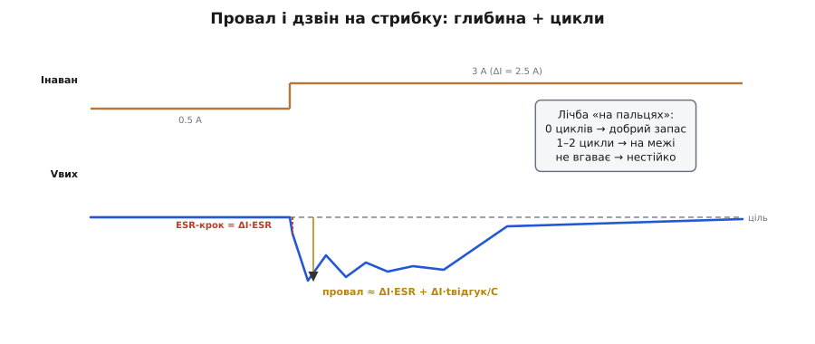

# 🧮 Load step «на пальцях»: провал і дзвін як міра стійкості

> Математична вставка до теми про зворотний зв'язок. Оцінюємо реакцію на стрибок навантаження простими прикидками — **без** діаграм Боде й запасу фази.

### Означення

Реакцію перетворювача на різкий стрибок навантаження описують **двома** числами, що їх знімають прямо з осцилографа: **глибина провалу** (наскільки впала напруга) і **кількість циклів дзвону** (наскільки коливається відновлення). Перше зіставляють із ТЗ, друге — це заміна «запасу фази»: чим менше дзвону, тим більший запас стійкості.

Чому саме ці два, а не одне? Бо вони міряють різні хвороби. Глибокий провал означає, що енергії бракує **в моменті** — вихідний конденсатор замалий або контур надто повільний. Дзвін означає, що контур, навпаки, реагує **надміру** й розгойдує сам себе. Можна мати малий провал і поганий дзвін (зашвидкий контур), а можна — чистий вихід із глибоким провалом (заповільний контур). Тому й дивляться на обидва.

### Інтуїція: звідки провал

У перші миті стрибка контур ще не встиг зреагувати (через запізнення зворотного зв'язку), тож увесь додатковий струм віддає **вихідний конденсатор**. Провал складають дві частини. **Миттєвий ESR-крок**: новий струм одразу падає на ESR (англ. *equivalent series resistance* — еквівалентний послідовний опір) конденсатора, даючи стрибок ΔI·ESR. **Просадка ємності**: далі конденсатор розряджається струмом ΔI, поки контур не наздожене, і за час відгуку tвідгук просідає на ΔI·tвідгук/C. Разом:

```
ΔVпровал ≈ ΔI · ESR  +  ΔI · tвідгук / C
            └ миттєвий ┘   └ просадка за час реакції ┘
```

Ці дві частини діють у різні миті: ESR-крок — у першу наносекунду (опір реагує миттєво), просадка ємності — упродовж наступних мікросекунд, поки контур не додасть енергії. На осцилографі це видно як різкий вертикальний уступ (ESR), а далі плавніше сповзання вниз (ємність) — до моменту, коли контур наздожене й поверне напругу.

### Формальний апарат: прикидка


*Стрибок струму дає миттєвий ESR-крок, тоді просадку ємності — разом це глибина провалу (число для ТЗ). А дзвін, що йде далі, лічать у циклах: 0 циклів — добрий запас, 1–2 — на межі, не вгаває — нестійко. Це й замінює діаграму Боде.*

Візьмемо стрибок 0.5 → 3 А (ΔI = 2.5 А), вихідний конденсатор C = 167 мкФ (із [розрахунку специфікації перетворювача](topic:electronics/converter-spec)), час відгуку контуру ≈ 10 мкс.

```
з керамікою (ESR = 3 мОм):
   ESR-крок:  2.5 · 0.003          = 7.5 мВ
   просадка:  2.5 · 10·10⁻⁶ / 167·10⁻⁶ = 150 мВ
   провал ≈ 7.5 + 150 ≈ 158 мВ   (домінує просадка ємності)

з електролітом (ESR = 200 мОм):
   ESR-крок:  2.5 · 0.2            = 500 мВ   ← сам ESR-крок завалює ТЗ!
```

Видно одразу два уроки. Перший: з керамікою провал визначає **просадка ємності**, тож щоб зменшити його — додають C або прискорюють контур (менший tвідгук). Другий: з електролітом миттєвий **ESR-крок** сам по собі може перевищити ТЗ (500 мВ!), хоч би яка велика була ємність, — ще одна причина брати на вихід [низько-ESR кераміку](topic:electronics/converter-caps).

### Скільки ставити ємності

Формулу легко обернути: якщо ТЗ дозволяє провал ΔVдоп, а ESR-крок уже відомий, то на просадку ємності лишається ΔVдоп − ΔI·ESR, звідки потрібна ємність

```
C ≥ ΔI · tвідгук / (ΔVдоп − ΔI · ESR)

ТЗ: ΔVдоп = 100 мВ, ΔI = 2.5 А, tвідгук = 10 мкс, кераміка ESR = 3 мОм
   ESR-крок = 7.5 мВ  →  на ємність лишається 92.5 мВ
   C ≥ 2.5 · 10·10⁻⁶ / 0.0925 ≈ 270 мкФ
```

Звідси видно зворотний бік швидкості: удвічі **швидший** контур (tвідгук 5 мкс замість 10) вимагає **удвічі менше** ємності на той самий провал. Швидкість і ємність взаємозамінні — обома купуєш малий провал. Але за швидкість платять дзвоном, і тут вступає друге число.

> 🔧 **Навіщо це.** Ця обернена формула — перша прикидка ємності на етапі ескізу: підставив ΔI, час відгуку з даташита й допуск із ТЗ — і одразу бачиш, чи вистачить наявного конденсатора, чи треба більший або швидший контролер. Точне значення однаково підтвердить тест load-step.

Зручно порахувати цей мінімум ще на етапі коду — компілятор перевірить бюджет одразу:

```c
// Прикидка мінімальної вихідної ємності під заданий провал (етап ескізу).
// Усе в одиницях СІ: А, с, Ом, Ф, В. Повертає мкФ для людини.
float min_output_cap_uF(float dI, float t_resp, float esr, float dV_allow) {
    float dV_cap = dV_allow - dI * esr;   // що лишається на просадку ємності
    if (dV_cap <= 0.0f) return -1.0f;     // сам ESR-крок завалює ТЗ — кераміку!
    return (dI * t_resp / dV_cap) * 1e6f; // мкФ
}
// min_output_cap_uF(2.5f, 10e-6f, 0.003f, 0.1f) ≈ 270 мкФ
```

### Що ховається в часі відгуку

Звідки взяти tвідгук — той єдиний параметр, що не з даташита конденсатора? Це час, поки контур «отямиться» й почне додавати енергію, і складають його ті самі запізнення, що породжують дзвін: один-два такти комутації, поки перетворювач устигне виправити шпаруватість, плюс власна інертність котушки. Груба, але робоча прикидка — кілька періодів частоти перемикання:

```
tвідгук ≈ (2…3) / fперем

при fперем = 500 кГц:
   tвідгук ≈ 2.5 / 500000 = 5 мкс
```

Звідси видно, чому **вища частота перемикання** покращує перехідну реакцію: коротший такт → менший tвідгук → менша просадка ємності за той самий стрибок. Це ще один доказ того самого правила, що й у виборі контролера: швидший контур реагує на стрибок гостріше — за умови, що компенсація не дасть йому за це задзвеніти.

### Чому ESR іноді рятує — у числах

ESR конденсатора дає миттєвий уступ ΔI·ESR — здавалося б, чистий ворог. Але цей самий уступ контур **бачить одразу**, без запізнення: напруга стрибнула — підсилювач похибки тут-таки штовхає корекцію. Виходить, ESR підмішує у зворотний зв'язок миттєвий, не загаяний сигнал, а саме брак миттєвості й породжує перекорекцію та дзвін. Тому конденсатор із помірним ESR часто дає **спокійніший** контур, ніж ідеальна кераміка з ESR ≈ 0.

Прикинемо обидва внески для того самого стрибка ΔI = 2.5 А і C = 167 мкФ:

```
кераміка (ESR = 3 мОм):    ESR-крок 7.5 мВ ≪ просадка 150 мВ  → миттєвого сигналу майже нема
електроліт (ESR = 200 мОм): ESR-крок 500 мВ ≫ просадка 150 мВ  → контур «чує» стрибок миттєво
```

З керамікою миттєвий сигнал мізерний — контур дізнається про стрибок лише з повільнішої просадки ємності, і саме тут легко перестаратися. З електролітом миттєвий уступ величезний (хоч і завалює ТЗ на провал) — зате контур реагує без запізнення, і дзвону менше. Звідси й парадокс: те, що псує **число провалу**, часто покращує **число дзвону**. Інженер шукає золоту середину — кераміку для малого провалу плюс рівно стільки ESR (або керамічну збірку з керованим ESR), щоб контур не розгойдувався.

### Дзвін замість запасу фази

Глибина провалу — це число для звірки з ТЗ. А **дзвін** після провалу — практичний вимір запасу стійкості, що замінює діаграму Боде. Лічба «на пальцях» проста: **нуль** циклів дзвону (провал і чисте повернення) — добрий запас; **один-два** загасаючі цикли — запас малий, система на межі (за зміни температури чи деталей може зірватися); **дзвін, що не вгаває**, — нестійко, треба правити (компенсація, інший Cвих/ESR).

Чому кількість циклів узагалі щось каже про запас? Бо дзвін — це загасаючі коливання, а швидкість їх загасання прямо пов'язана з тим, наскільки система далека від межі стійкості. Контур із добрим запасом гасить збурення майже за один рух (аперіодично), тож циклів не видно. Що ближче до межі, то повільніше гасне коливання — і то більше повних періодів встигає прозвучати, перш ніж згаснути. На самій межі коливання вже не гасне зовсім. Тож **число видимих циклів** — це груба, але чесна шкала запасу: більше циклів — менший запас. Інженеру не треба знати точний кут у градусах; йому треба знати, скільки «дзенькань» він бачить, і чи це безпечно.

Тут і криється головний компроміс стійкості в числах: **прискорити** контур (зменшити tвідгук) — провал меншає; але **задто** швидкий контур починає дзвеніти. Тому дивляться на **обидва** числа разом: малий провал **і** без дзвону — ось здоровий вузол. Маленький провал ціною дзвону — оманливе благополуччя; глибокий провал без дзвону — просто повільно, додай ємності чи прискор контур. Усе це видно оком на осцилографі — без жодної передатної функції.

### Той самий тест — для стрибка входу

Стрибок навантаження перевіряє реакцію з боку виходу, але контур мусить тримати вихід і коли смикається **вхід**. Прикидка тут дзеркальна: різка зміна Vвх на ΔVвх просочується на вихід ослабленою — тим сильніше, чим повільніший контур, бо доки той не виправить шпаруватість, частина зміни входу йде далі. Грубо сплеск на виході ≈ ΔVвх·D, поки контур не наздожене; той самий tвідгук визначає, як довго триває це просочування.

```
вхід стрибнув на 1 В, D ≈ 0.4, контур ще не зреагував:
   миттєвий сплеск на виході ≈ 1 · 0.4 = 0.4 В   ← поки контур не виправить D
```

Сам сплеск меншає так само, як і провал від навантаження, — швидшим контуром і більшою ємністю; а зайвий дзвін на ньому читається тими самими циклами. Тому обидва тести — load step і line transient — дивляться разом: однакові два числа (сплеск і цикли) міряють той самий запас стійкості з двох боків.
