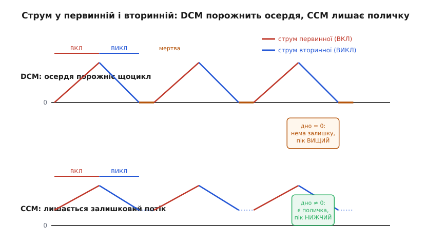
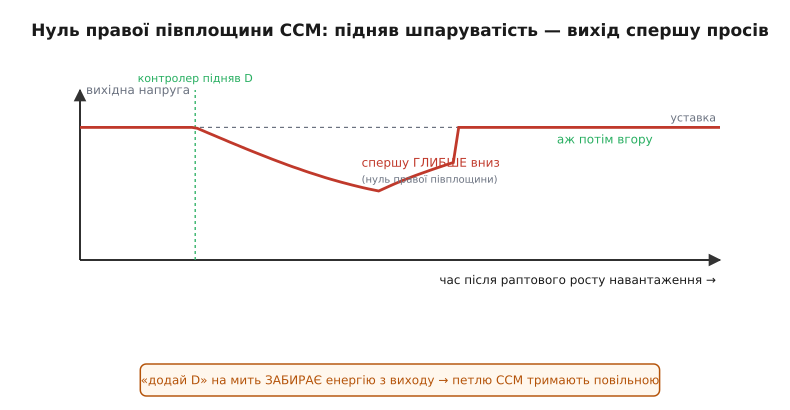
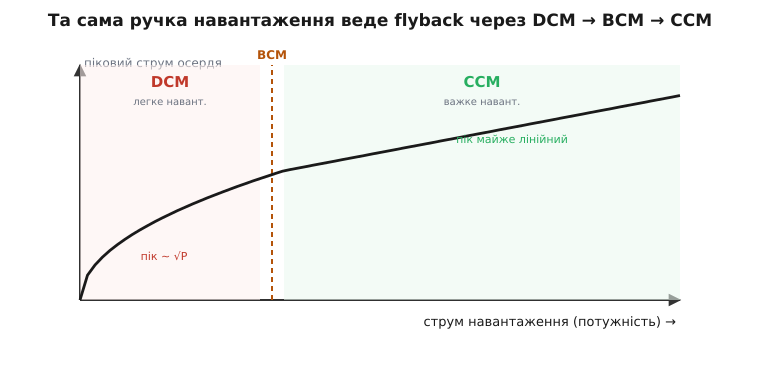

# Режими DCM і CCM у flyback-перетворювачі

<preknowlist>
- [Зворотноходовий (flyback) перетворювач](book:electronics/flyback-isolated) — трансформатор запасає енергію у фазі ВКЛ і віддає її у вторинну у фазі ВИКЛ; коефіцієнт витків Ns/Np; вихід Vвих = Vвх·(Ns/Np)·D/(1−D).
- [Спарені котушки](book:electronics/coupled-inductor) — flyback-трансформатор насправді накопичувальна котушка з двома обмотками й повітряним зазором, а не миттєвий трансформатор.
- [Межа CCM/DCM у DC-DC перетворювачах](book:electronics/ccm-dcm-boundary) — сам механізм переходу: трикутник струму сповзає до нуля, межа за умови I = ΔI/2; спільний для всіх топологій з котушкою.
- [Котушка перетворювача](book:electronics/converter-inductor) — індуктивність задає розмах пульсації струму: більший L — вужчий трикутник.
</preknowlist>

Flyback-трансформатор — це не трансформатор у звичному сенсі, а **відро для енергії**. За фазу ВКЛ ключ первинної набирає в осердя порцію магнітної енергії, за фазу ВИКЛ ця порція «відлітає» у вторинну обмотку й виливається в навантаження. І тут виникає одне-єдине питання, яке розколює всю поведінку flyback надвоє: **чи встигає осердя спорожніти до наступного циклу?**

Уявіть, що ви ложкою переливаєте воду з одного відра в інше. Є два способи. Перший: щоразу вихлюпуєте ложку **до останньої краплі**, потім набираєте нову. Другий: не спорожнюєте до дна, а лишаєте на дні трохи води й доливаєте зверху. Обидва переганяють однакову воду за секунду, якщо махати з тією самою частотою, — але це два різні режими роботи руки. Перший — коли осердя flyback повністю віддає енергію й на частину циклу лежить порожнім; це **переривчастий режим провідності** (discontinuous conduction mode, **DCM**, від лат. *discontinuus* — перерваний). Другий — коли в осерді завжди лишається залишковий струм, «поличка», на яку сідає наступна порція; це **безперервний режим провідності** (continuous conduction mode, **CCM**, від лат. *continuus* — суцільний).

Різниця здається дрібною — «спорожнив до нуля чи ні». Насправді від неї залежить майже все: наскільки гострі струми ганяє трансформатор, як важко стабілізувати вихід, яку потужність узагалі можна витягти, і навіть чи стоятиме на платі оптопара з хитрим компенсатором, чи один дешевий чип. Той самий flyback у DCM і в CCM — практично два різні прилади.

> 🔧 **Навіщо це.** Коли ви бачите datasheet flyback-контролера, перше, що там оголошують, — режим: «DCM/QR» чи «CCM peak-current». Це не деталь, а фундаментальний вибір, що тягне за собою вибір трансформатора, ключа, діода, конденсаторів і всієї петлі зворотного зв'язку. Не розібравшись, у якому режимі живе ваш вузол, ви не порахуєте ні його ККД, ні його стійкість.

## Два режими у двох обмотках

У звичайного [знижувального перетворювача](book:electronics/buck) струм тече через **одну** котушку, і трикутник живе на ній цілий цикл. У flyback накопичувач один — осердя, — але струм у ньому бачать **дві різні обмотки по черзі**: у фазі ВКЛ струм наростає в **первинній**, у фазі ВИКЛ спадає у **вторинній**. Магнітний потік в осерді при цьому неперервний (він і є мірою запасеної енергії), але **електричний струм перестрибує з обмотки на обмотку**. Саме тому в flyback не побачиш суцільного трикутника на жодному дроті — на первинній видно тільки half-трикутник наростання, на вторинній тільки half-трикутник спаду.


*Струм осердя перестрибує між обмотками: у ВКЛ наростає в первинній (червоне), у ВИКЛ спадає у вторинній (синє). У DCM (згори) вторинна встигає віддати все до нуля, і настає «мертва» фаза — осердя порожнє. У CCM (знизу) вторинна не доходить нуля: лишається поличка залишкового струму, з якої наступний цикл починає наростати. Через цю поличку піки в CCM за тієї самої потужності НИЖЧІ.*

Оце «перестрибування» задає ключову відмінність від однокотушкових топологій. У DCM послідовність фаз така: первинна наростає від нуля до піка → ключ вимикається → вторинна спадає від піка (переведеного через коефіцієнт витків) до нуля → **осердя порожнє, обидві обмотки мовчать** → наступний цикл. З'являється третя, «мертва» фаза, коли в осерді немає ні струму, ні запасеної енергії. У CCM цієї паузи немає: вторинна не встигає віддати все, ключ вмикається знову, поки в осерді ще є струм, і первинна підхоплює наростання **з полички**, а не з нуля.

Ця поличка — не дрібниця, а причина, чому CCM тягне більшу потужність. Порахуймо чому. Потужність, яку flyback передає за цикл, — це енергія осердя ½·L·(Iпік² − Iзалиш²), помножена на частоту. У DCM залишок нульовий, тож уся передана енергія «сидить» у піку: щоб передати більше, треба гнати вищий Iпік. У CCM же працює лише **різниця** квадратів — поличка Iзалиш дозволяє передати ту саму енергію за куди **нижчого** піка. А пікові струми — це і нагрів обмоток (втрати ростуть як квадрат струму), і насичення осердя, і напруга на елементах. Тому на великій потужності — зарядка ноутбука, телевізор — flyback майже завжди женуть у CCM: інакше піки стали б непідйомними. А на малій — зарядка телефона, чергове живлення — його лишають у DCM, бо там прості піки не заважають, зате все інше стає легшим.

## DCM: осердя порожніє — простий, але гострий

DCM — це «вихлюпнути ложку до дна». Осердя щоцикл повністю віддає енергію, тож наступна порція завжди починається з чистого нуля. З цього випливає ланцюжок дуже приємних наслідків — і одна ціна.

**Перше і головне: вихід перестає залежати від коефіцієнта заповнення так, як у CCM.** У безперервному режимі flyback тримає своє відношення напруг лише на D і витках (Vвих = Vвх·(Ns/Np)·D/(1−D)), і навантаження на нього не впливає. У DCM ця опора зникає — коефіцієнт передачі **починає залежати від навантаження**, індуктивності й частоти. Виводиться це з простої умови: за цикл в осердя входить рівно стільки енергії, скільки з нього виходить у навантаження. Результат для flyback:

```
              R
M = D · √ ──────────  · (Ns/Np)
           2 · Lм · f
```

де M = Vвих/Vвх, R — опір навантаження (Vвих/Iвих), Lм — намагнічувальна індуктивність первинної, f — частота. Читається так: чим легше навантаження (більший R), тим вищим лізе відношення за тим самим D. Тому нерегульований вихід у DCM на холостому ходу **спливає вгору** — і без зворотного зв'язку flyback у DCM не залишиш. Виведення цієї формули з енергетичного балансу «вхід = вихід за цикл», разом із формою для BCM-межі, винесено в [🧮 математичну вставку про режими flyback](book:electronics/flyback-dcm-ccm/math-flyback-modes.md).

На щастя, за виходом стежить [контур зворотного зв'язку](book:electronics/feedback-stability): він бачить, що вихід підріс, і зменшує D. Ззовні flyback і в DCM тримає свої 5 вольт. Але **всередині** DCM дарує три великі спрощення, за які його й люблять у дешевій масовій техніці.

**Немає нуля правої півплощини — петлю легко зробити стійкою.** Це найважливіше й найменш очевидне. У CCM-flyback стабілізувати вихід складно через одну підступну властивість, яку ми розберемо нижче, — **нуль правої півплощини**. У DCM його **немає взагалі**: осердя щоцикл починає з нуля, тож пам'яті про попередній цикл, яка й породжує ту підступність, просто не існує. Об'єкт керування у DCM поводиться майже як проста одно-полюсна ланка, і компенсатор для нього — тривіальний. Саме тому найдешевші зарядки, де на компенсацію немає ні місця, ні грошей, женуть DCM: петля стабільна майже сама собою. (Що таке [нуль правої півплощини](book:electronics/rhp-zero) і чому він так ускладнює керування — окрема тема; тут досить знати, що DCM його прибирає.)

**Немає зворотного відновлення вихідного діода.** У фазі ВИКЛ струм вторинної спадає до нуля **сам**, перш ніж ключ увімкнеться знову. Тож коли первинна знову бере струм, вихідний діод уже давно закритий і струму в ньому нема — вимикати нема чого. Це прибирає [зворотне відновлення діода](book:electronics/schottky-diode) — один із головних джерел втрат і завад на комутації. У CCM навпаки: діод вимикають **під струмом**, і він встигає провести зворотний сплеск.

**Менший, легший трансформатор.** Осердю DCM не треба тримати залишковий потік між циклами; воно працює «від нуля до піка», тож для тієї самої потужності індуктивність первинної менша. Менша Lм — менше витків, менше осердя.

Ціна за все це — **гострі струми**. Раз уся передана енергія «сидить» у піку (полички ж немає), Iпік у DCM за тієї самої потужності виходить помітно вищим, ніж був би в CCM. А вищий пік — це вищий діючий струм (RMS) в обмотках і ключі, більший нагрів, і потреба у вихідному конденсаторі, здатному проковтнути гостріші імпульси. Тому DCM гарний, поки потужність невелика: доти піки терпимі, а вигоди від простоти переважають.

**Приклад (піковий струм у DCM).** Зарядка 5 В · 2 А (10 Вт) з мережі: Vвх ≈ 325 В після випрямляча, частота f = 65 кГц, намагнічувальна індуктивність первинної Lм = 1.2 мГ, ККД приблизно 0.85. Який піковий струм первинної в DCM?

```
Вхідна потужність:  Pвх = Pвих / η = 10 / 0.85 ≈ 11.8 Вт
Енергія за цикл:    E = Pвх / f = 11.8 / 65000 ≈ 181 мкДж
У DCM уся вона в піку:  E = ½ · Lм · Iпік²
Iпік = √(2·E / Lм) = √(2 · 181·10⁻⁶ / 1.2·10⁻³)
     = √(0.302) ≈ 0.55 А
```

Півампера піка при середньому вхідному струмі лише 11.8/325 ≈ 36 мА — ось вона, «гострість» DCM: миттєвий пік у п'ятнадцять разів вищий за середнє споживання. Обмотку й ключ рахують саме на ці 0.55 А, а не на 36 мА.

## CCM: осердя не порожніє — потужний, але норовливий

CCM — це «лишити воду на дні». Поличка залишкового струму зменшує піки, і на великій потужності це рятівно. Але за неї flyback платить складністю керування, і плата ця має два конкретні обличчя.

**Обличчя перше: нуль правої півплощини.** Ось де ложка з водою вже не аналогія, а точний механізм. У CCM вихід живиться **тільки** у фазі ВИКЛ — лише тоді, коли вторинна віддає. Уявіть, що навантаження раптом зросло й вихід почав просідати. Контролер робить очевидне: **піднімає D**, щоб набрати в осердя більше енергії. Але піднявши D, він **подовжив фазу ВКЛ** — а отже, **вкоротив фазу ВИКЛ**, ту саму, коли вихід узагалі отримує струм! На кілька циклів, поки осердя ще не встигло набрати більше, вихід дістає енергію **коротший час** — і замість піднятися, спершу просідає **ще глибше**. Лише згодом, коли підвищений струм осердя накопичиться, вихід піде вгору.


*Контролер підняв D, щоб підняти просілий вихід. Але в CCM-flyback більший D коротшає фазу віддачі — і вихід спершу провалюється ГЛИБШЕ, і лише потім іде вгору. Ця «реакція навпаки» і є нуль правої півплощини: система на мить рухається протилежно до команди. Тому петлю CCM-flyback мусять робити повільною.*

Оце «спершу вниз, потім вгору» — коли система на короткий час рухається **протилежно** до команди — і є нуль правої півплощини (right-half-plane zero). Він отруйний для зворотного зв'язку: якщо петля реагуватиме швидко, вона побачить початковий провал, вирішить, що D замало, ще піддасть газу — і розгойдає систему до автоколивань. Єдиний надійний вихід — зробити петлю **навмисне повільною**: смугу пропускання беруть у кілька разів нижчою за частоту цього нуля (на практиці — менше однієї п'ятої від найгіршого, найнижчого його значення). Тому CCM-flyback повільно реагує на кидки навантаження — не тому, що інженер полінувався, а тому, що швидше не можна. У DCM цього нуля немає, і петля може бути жвавою; це одна з головних причин, чому вибір режиму — це насамперед вибір **керованості**.

**Обличчя друге: субгармонічна нестійкість при D > 0.5.** Майже всі flyback-контролери керують не напругою, а **піковим струмом**: щоцикла ключ вмикається за тактом і вимикається, щойно струм первинної досягне заданої контуром межі. Це зручно — струм обмежено автоматично. Але в CCM, де цикл починається з полички, є пастка. Уявіть, що з якоїсь причини цикл почався з трохи вищої полички. Струм швидше дійде межі, ключ вимкнеться раніше, фаза ВКЛ вкоротшає — але фаза ВИКЛ подовшає, і за неї струм спаде **нижче**, ніж мав би. Наступний цикл почнеться з нижчої полички, вимкнеться пізніше, спаде вище… Збурення не гасне, а **гойдається туди-сюди** з подвоєним періодом — це субгармонічна нестійкість. Математика показує чіткий поріг: **при D > 0.5** збурення полички з циклу в цикл **росте**, а не згасає.

Рятунок класичний — **компенсація нахилом** (slope compensation): до сигналу пікового струму додають штучний спадний пилкоподібний нахил, який «перебиває» самопідсилення полички й повертає збіжність за будь-якого D. Тому в datasheet CCM-flyback-контролера завжди є slope compensation, а в DCM-контролері її може й не бути — там полички немає, гойдатися нічому.

> 🔧 **Навіщо це.** Дві речі з datasheet миттєво кажуть про режим. Якщо є «slope compensation» і згадка про «RHP zero» в розділі про компенсацію — це CCM-контролер, і ваш вузол проєктовано на високу потужність із повільною петлею. Якщо цього немає, зате є «valley detection» чи «quasi-resonant» — це DCM/межовий контролер для малої потужності зі швидкою простою петлею. Переплутати режим при виборі компенсатора — гарантовані або мляве регулювання, або автоколивання.

## Той самий вузол їде між режимами сам

Найпідступніше: flyback **не сидить** в одному режимі. Межу задає навантаження, і той самий вузол переходить із CCM у DCM просто тому, що споживач узяв менше струму. Повне навантаження — CCM з поличкою; зменшуємо струм — поличка тоншає; на певному струмі вона зникає, і вузол опиняється в DCM.


*Зменшуючи навантаження, ми ведемо той самий flyback справа наліво: важке навантаження — CCM (поличка є, пік майже лінійний з потужністю), тонка межа BCM, тоді DCM (полички нема, пік росте як √потужності). Один чип працює в обох світах, і межу перетинає сам — тому проєктувати треба на весь діапазон, а не на одну точку.*

Практичний висновок жорсткий: **flyback треба перевіряти в обох режимах**. Компенсатор, вилизаний під CCM на повному навантаженні, у глибокому DCM на холостому ходу може виявитися надто млявим — бо об'єкт керування там уже інший (одно-полюсний замість дво-полюсного з RHP-нулем). І навпаки: ККД, чудовий у CCM під навантаженням, на легкому ходу в DCM може завалитися, бо там головною втратою стає вже не провідність, а [саме перемикання](book:electronics/switching-losses) — заряджати затвор і гойдати вузол коштує однаково щоцикла, скільки б корисної потужності ви не віддавали. Тому «чесний» flyback зі сталою частотою на холостому ходу має жалюгідний ККД: він однаково часто клацає, майже нічого не передаючи.

Саме тому багато сучасних flyback-контролерів на легкому навантаженні **зменшують частоту** або взагалі **пропускають імпульси** (burst mode): видали пачку, підзарядили конденсатор, заснули, доки вихід просяде. Так вони прибирають марні перемикання там, де струму й так немає, і рятують ККД холостого ходу — недарма зарядка, увіткнена без телефона, ледь-ледь тепла, а не гаряча.

Щоб керувати цим розумно — коли перемкнути параметри петлі, коли ввімкнути пропуск імпульсів, — цифровий контролер часто мусить сам визначати поточний режим: він порівнює виміряний струм навантаження з межовим і так знає, DCM зараз, CCM чи на межі. Як цей класифікатор режиму лягає в цілочисловий код МК, показано в [⚙️ класифікаторі режиму flyback у прошивці](book:electronics/flyback-dcm-ccm/proj-mode-classifier.md).

## Межа як третій режим: BCM і квазірезонанс

Між CCM і DCM лежить тонка лінія, на якій вигідно сидіти навмисне. Якщо вмикати ключ **рівно тоді**, коли струм вторинної щойно впав до нуля, — ні миті раніше (це був би CCM із поличкою), ні пізніше (це був би DCM із мертвою паузою), — перетворювач працює **на самій межі**. Цей режим зветься **межовим** (boundary conduction mode, **BCM**), а також критичним (critical conduction mode) чи перехідним (transition mode) — усе про одне.

Навіщо цілитися саме в межу? Бо вона поєднує головні вигоди обох сусідів. Струм вторинної в момент увімкнення вже нульовий — тож немає зворотного відновлення діода, як у DCM. Але полички теж немає, тож RHP-нуль слабший, ніж у глибокому CCM, а осердя використовується повніше, ніж у DCM. Ціна — **частота гуляє**: раз схема щоразу чекає саме на нульовий струм вторинної, період сам «плаває» залежно від навантаження й входу. Тому фільтр завад для BCM-flyback рахують на весь діапазон частот, а не на одну точку.

Найпоширеніше втілення цієї ідеї у flyback — **квазірезонансний** (quasi-resonant, QR) режим. Тут схема не просто чекає нуля струму вторинної, а ще й дивиться на паразитний резонанс, що виникає між намагнічувальною індуктивністю й ємністю ключа після спорожнення осердя: напруга на стоку ключа починає гойдатися синусоїдою — «дзвенить». Контролер ловить **дно** цього дзвону (valley) і вмикає ключ саме там, за найнижчої напруги на стоку. Тоді ключ вмикається за мінімальної напруги — м'яко, з найменшими втратами перемикання. Так побудовано величезну частку сучасних зарядних адаптерів: QR-flyback, що ловить дно й тому працює тихо, холодно й ефективно.

> 🔧 **Навіщо це.** Побачили в datasheet «QR», «quasi-resonant», «valley switching», «boundary/transition mode» — знайте: flyback навмисне сидить на межі CCM/DCM і вмикається на дні дзвону задля м'якого перемикання. Плюс — низькі втрати й тихе вимикання діода; мінус — плавуча частота, яку треба врахувати у фільтрі завад. Це стандарт для зарядок середньої потужності.

## Як обрати режим

Вибір режиму — це вибір компромісу, і він майже завжди диктується **потужністю**.

**Мала потужність (одиниці ват, чергове живлення, дешеві зарядки) — DCM.** Піки терпимі, зате петля проста (немає RHP-нуля), діод не має зворотного відновлення, трансформатор менший. Простота й ціна перемагають.

**Велика потужність (десятки-сотні ват, зарядка ноутбука, живлення телевізора) — CCM.** Тут гострі піки DCM стали б непідйомними для обмоток і ключа, тож поличку лишають навмисне заради нижчих RMS-струмів і нагріву — миряться з повільною петлею й обов'язковою компенсацією нахилом.

**Середня потужність, де важливий ККД і тиша, — BCM/QR.** Межовий режим бере краще з обох боків: помірні піки, м'яке перемикання, непоганий ККД — ціною плавучої частоти.

І пам'ятайте наскрізне: хоч який режим ви оберете за розрахункову точку, реальний flyback усе одно **побуває в DCM** щоразу, коли навантаження впаде, — тож перевіряти й компенсувати треба весь діапазон, від повного струму до холостого ходу.