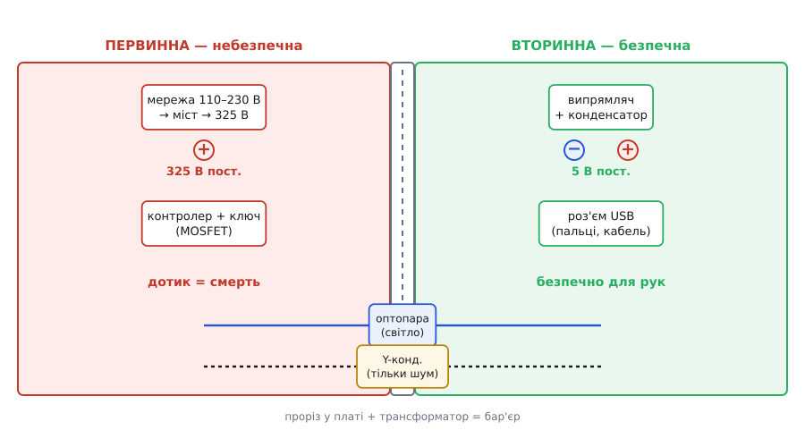

# 🔌 Мережевий адаптер зсередини

> Цей «кубик» у розетці — найпоширеніший [flyback](topic:electronics/flyback-isolated) на світі: кожен зарядний пристрій, блок живлення ноутбука, адаптер роутера збудовано саме за цією топологією. Тут розбираємо його як **готовий виріб**: які вузли впізнати на платі, чому flyback переміг саме в малій потужності, де проходить смертельна межа й що означають дрібні написи на корпусі.

## Що це за клас пристроїв

**Мережевий адаптер** (англ. *AC-DC adapter*, у побуті «зарядка», «блок живлення») — це автономне джерело, що бере змінну напругу розетки (110–230 В) і віддає низьку постійну (5, 9, 12, 20 В) з **гальванічною розв'язкою** між ними. Слово «зарядка» тут не зовсім точне: сам адаптер найчастіше лише джерело живлення, а не зарядний пристрій — самою банкою керує контролер заряду вже всередині телефона, адаптер же тільки подає стабільні вольти.

Клас охоплює весь діапазон від крихітного USB-кубика на 5 Вт до блока ноутбука на 100–240 Вт. Зовні вони різні, всередині — той самий кістяк: випрямити мережу, рубати її ключем у трансформатор, випрямити вторинну сторону, утримати вихід зворотним зв'язком. І майже завжди цей кістяк — **flyback**, бо саме він поєднує дві несумісні на перший погляд вимоги: велике зниження напруги й безпечний бар'єр в **одному** компоненті.

Окремо стоять «зарядки» без розетки на корпусі — лише з гніздом-кабелем; принцип той самий, змінюється тільки механіка. А ось павербанк — це вже не адаптер: він живиться від низьковольтного USB і розв'язки не має.

## Що впізнати на платі

Розкривши будь-який адаптер, бачимо незмінний ряд вузлів уздовж шляху енергії. Знати їх в обличчя корисно: за ними одразу читається, ізольований це блок чи ні, і де його слабкі місця.

- **Вхідний випрямляч і згладжувальний конденсатор.** Чотири діоди (або готовий міст у одному корпусі) перетворюють змінні 230 В на пульсуючі, а великий електролітичний конденсатор згладжує їх у приблизно **325 В** постійних (це амплітуда мережі: 230 · √2 ≈ 325). Це найвища напруга в усьому пристрої — і найнебезпечніша.
- **Трансформатор** — найпомітніша деталь, жовтуватий брусок, обмотаний стрічкою. Це серце розв'язки: [спарена котушка](topic:electronics/mutual-inductance), що запасає енергію в первинній обмотці й віддає у вторинну, не маючи між ними жодного дроту. Стрічка по краях — не прикраса, а частина ізоляції.
- **Первинний ключ** — високовольтний MOSFET (часто схований у тому ж чипі, що й контролер). Він рубає 325 В у трансформатор десятки-сотні тисяч разів на секунду.
- **Контролер** — мікросхема на первинній стороні, що крутить [шпаруватість](topic:electronics/buck) ключа, тримаючи вихід сталим. У сучасних адаптерах контролер і ключ — **один корпус** на 6–8 ніжок.
- **Оптопара** — маленький чотириногий корпус (часто білий), що містком стоїть через бар'єр. Це канал [зворотного зв'язку](topic:electronics/flyback-isolated): світлодіод вторинної світить на фототранзистор первинної, переносячи через бар'єр **світло, а не струм**.
- **Вторинний випрямляч і вихідний конденсатор.** Швидкий діод (у дешевих блоках) або синхронний MOSFET (у сучасних) випрямляє вторинну обмотку, а конденсатор згладжує — звідси й виходять чисті 5 В.
- **Y-конденсатор** — невеликий синій або жовтий «крапля»-конденсатор, що теж стоїть **через бар'єр** між первинною та вторинною землями. Про нього окрема розмова нижче: він єдиний компонент, якому дозволено перетинати бар'єр, і саме він тримає шум у вузді.


*Найважливіше, що варто бачити в адаптері, — це не схема, а межа. Ліворуч від прорізу — «гаряча» первинна сторона під мережею (325 В, дотик смертельний); праворуч — «холодна» вторинна (5 В, безпечна для рук). Між ними фізична щілина в платі та трансформатор; бар'єр перетинають лише два компоненти, яким це дозволено за конструкцією, — оптопара (несе світло) і Y-конденсатор (несе тільки змінний шум через малу ємність).*

## Чому саме flyback панує в малій потужності

Здавалося б, способів понизити напругу багато — чому в кожному кубику саме flyback? Причина в тому, що для малопотужного мережевого живлення три вимоги збігаються в одній топології, і конкуренти кожен раз програють хоча б по одному пункту.

**Перше — ізоляція й зниження разом, одним компонентом.** Трансформатор flyback робить водночас і безпечний бар'єр, і відношення напруг ×60 (325 В → 5 В): досить намотати потрібне число витків. Знижувач без трансформатора ([buck](topic:electronics/buck)) дав би 5 В, але **ділив би землю з мережею** — а отже, лишав би на виході 325 В відносно справжньої землі: смертельно. Тому в адаптері трансформатор обов'язковий, а flyback використовує його ще й як накопичувач.

**Друге — мінімум деталей.** Прямоходовий, напівмостовий і мостовий перетворювачі теж ізолюють, але вимагають окремої вихідної котушки, двох або чотирьох ключів, складнішого керування. Flyback запасає енергію **прямо в трансформаторі** й обходиться одним ключем — а на 5–65 Вт це означає менше деталей, менший корпус і нижчу ціну. Для виробу, якого випускають мільярдами, кожен зекономлений цент і кожен прибраний компонент вирішують.

**Третє — дешевизна доведена до краю.** Інтегровані контролери (контролер + ключ в одному корпусі) звели обв'язку flyback до жменьки деталей. Тому собівартість простого USB-кубика — копійки, і ніяка складніша топологія сюди не пролізе.

А обмеження у flyback теж є, і саме воно окреслює його «малу потужність»: осердя мусить вмістити **всю** передану за цикл енергію, тож зі зростанням потужності трансформатор швидко важчає. Десь за сотню ват вигіднішими стають топології, що передають енергію прямо. Тому межа flyback — приблизно до 100–150 Вт; усе, що масове й слабке (зарядки, роутери, світлодіодні драйвери), — його вотчина.

> 🔧 **Навіщо це.** Коли в проєкті треба зробити живлення прямо від розетки до сотні ват — за замовчуванням беруть flyback на інтегрованому контролері. Це найдешевший шлях дістати ізольовані низькі вольти з мережі; складніші топології виправдані лише вище за потужністю або там, де критична ефективність.

## Безпека: де проходить смертельна межа

Це найважливіша частина, бо тут ідеться не про роботу пристрою, а про життя того, хто його тримає. Усередині адаптера співіснують дві зони: **первинна** під мережею (325 В, дотик до неї вбиває) і **вторинна** з безпечними 5 В, до яких людина торкається роз'ємом і пальцями. Уся конструкція адаптера підпорядкована одному: щоб несправність первинної **ніколи** не дісталася вторинної.

**Бар'єр будує не лише трансформатор.** Між первинною та вторинною мідними доріжками лишають фізичну відстань — і двох видів. **Зазор у повітрі** (англ. *clearance*) — найкоротший шлях по прямій між доріжками; **шлях витоку** (англ. *creepage*) — найкоротший шлях уздовж поверхні плати. Шлях витоку завжди роблять довшим за повітряний зазор, бо по брудній, вологій поверхні струм «тече» при набагато нижчій напрузі, ніж пробиває чисте повітря. Для мережевого адаптера типові вимоги — приблизно **6–8 мм** між сторонами; саме тому в платах адаптерів під трансформатором часто **прорізають наскрізну щілину** — вона розриває поверхню й примусово подовжує шлях витоку.

**Усередині трансформатора** ізоляцію між первинною та вторинною обмотками роблять **підсиленою** (англ. *reinforced insulation*) — кількома шарами стрічки або потрійно-ізольованим проводом вторинної, розрахованими на пробивну напругу в кілька кіловольт. Стандартне випробування для пристроїв із подвійною ізоляцією — витримати близько **4000 В** між сторонами без пробою. Це не запас «про всякий випадок», а вимога: при кидку мережі чи розряді бар'єр не повинен здатися.

**Y-конденсатор** — єдиний компонент, якому дозволено стояти **через** бар'єр, і він заслуговує окремого пояснення, бо його роль контрінтуїтивна. Швидке перемикання ключа наводить **синфазний шум** (англ. *common-mode noise*): обидві сторони разом «гойдаються» відносно землі, і цей шум випромінюється, псуючи радіоефір. Y-конденсатор дає цьому шуму коротке коло назад, **не пропускаючи** при цьому небезпечного струму мережевої частоти. Хитрість у його малій ємності: для змінного шуму в сотні кілогерц він майже провідник, а для 50 Гц мережі — майже розрив. Але повністю безпечним зробити його не можна: через нього все одно тече крихітний **струм витоку**, і саме він — причина легкого «пощипування», коли проводиш пальцем по корпусу металевого ноутбука від адаптера без заземлення.

Тому ємність Y-конденсатора жорстко обмежена згори: норми безпеки тримають струм витоку на дотик у портативних пристроях нижче за **0.25 мА** — межа, яку людина відчуває, але яка ще безпечна. Це прямий компроміс: більша ємність краще давить шум, але піднімає струм витоку до небезпечного. І ще одне, що випливає з його ролі: Y-конденсатор мусить бути **сертифікованого класу безпеки** (Y1/Y2) — такого, що при пробої гарантовано виходить з ладу **розривом**, а не замиканням. Бо коротке замикання тут означало б пряме з'єднання мережі з тим, до чого торкаються руки.

> 🔧 **Навіщо це.** Якщо ви ремонтуєте чи проєктуєте щось із живленням від мережі — три речі несхитні: ніколи не зменшуйте зазори між сторонами, ніколи не ставте «звичайний» конденсатор замість Y-класового через бар'єр і ніколи не з'єднуйте первинну землю з вторинною. Кожне з цих порушень тихо знімає захист, і пристрій працюватиме — рівно до першої несправності, що дістанеться до рук користувача.

## ККД, чергова потужність і чому це регулюють

Адаптер живить пристрій, але платить за це власними втратами — і два числа вирішують, добрий він чи поганий. **ККД під навантаженням** — яку частку взятої з розетки потужності він віддає в навантаження, а яку розсіює теплом (звідси й нагрів кубика). **Чергова потужність** (англ. *no-load / standby power*) — скільки він тягне з розетки, **коли нічого не заряджає**, але лишається ввімкнутим. Друге число роками лишалося непомітним, та помножене на мільярди адаптерів, що цілодобово висять у розетках, воно перетворилося на гігавати спаленої дарма енергії.

Тому держави обмежили обидва числа нормами. Найвідоміші — американський **DoE Level VI** і європейський **CoC Tier 2**: для адаптерів від 1 до 49 Вт чергова потужність не повинна перевищувати **0.1 Вт**, а середній ККД під навантаженням мусить дотягувати приблизно до 80–88 % залежно від потужності. Саме ці норми вбили старі трансформаторні «бородавки» на 50 Гц, що грілися й тягнули струм навіть порожніми, і зробили flyback із розумним контролером безальтернативним.

Як адаптер виконує норму черги, варто розуміти, бо це частина того, чому сучасні контролери влаштовані так, а не інакше. На холостому ходу інтегрований контролер переходить у **режим пропуску імпульсів** (англ. *burst mode*): замість того щоб перемикати ключ безперервно, він дає короткі пачки імпульсів зрідка, а між ними майже спить. Чим рідші пачки, тим менша чергова потужність — звідси й здатність триматися нижче за 0.1 Вт.

```
── Звідки береться чергова потужність ──────────────────────
Старий 50-Гц трансформатор:  ~1–3 Вт порожнім  (магнітні втрати завжди)
Простий flyback без burst:   ~0.3–0.5 Вт
Сучасний flyback з burst:    < 0.1 Вт          (норма DoE Level VI)
```

> 🔧 **Навіщо це.** Якщо старий адаптер відчутно теплий, хоча нічого не заряджає, — він із докризового покоління й тягне з розетки ват-другий цілодобово. Заміна на сучасний сертифікований блок окупається не лише прохолодою, а й рахунком: один-два вати, помножені на 8760 годин року, — це помітні кіловат-години.

## Сучасний адаптер: synchronous rectification і GaN

Принцип flyback не змінився, та начинка кубика за останні роки зробила два кроки, і за ними легко відрізнити свіжий блок від старого. Обидва кроки б'ють у головне джерело втрат — те, що гріє пристрій.

**Синхронний випрямляч** (англ. *synchronous rectification*) замінює вторинний діод на MOSFET, яким керують у такт. Звичайний діод втрачає на собі близько 0.5 В падіння — а при струмі в кілька ампер це відчутне тепло; MOSFET у відкритому стані поводиться як крихітний опір і втрачає в рази менше. Тому в сучасних адаптерах на вторинній стороні стоїть не діод, а маленька мікросхема-«синхронник» зі своїм MOSFET.

**Нітрид-галієві ключі** (англ. *gallium nitride, GaN*) на первинній стороні перемикаються швидше й чистіше за кремнієві MOSFET, із меншими втратами на перемикання. Це дозволяє підняти частоту, а вища частота означає **менший трансформатор** — звідси й диво «маленький кубик на 65 Вт», що зарядить ноутбук: він GaN-овий, працює на високій частоті й тому вмістився туди, де кремнієвий блок був би вдвічі більшим. Сучасні GaN-адаптери дотягують ККД до 93–95 % під повним навантаженням — на старому кремнієвому діодному flyback такого не буває.

Часто разом із цим у топологію додають варіації, що ще трохи піднімають ефективність: **квазірезонансний** (англ. *quasi-resonant*) flyback вмикає ключ у момент, коли напруга на ньому в найнижчій точці («у долині»), зрізаючи втрати ввімкнення; **активний клемп** (англ. *active clamp flyback*) замість того щоб спалювати енергію [індуктивності витоку](topic:electronics/flyback-isolated) у снабері, повертає її назад у схему. Ці схеми складніші, тож живуть переважно в адаптерах вищої потужності та в USB-C блоках швидкого заряджання, де за кожен відсоток ККД і кожен зекономлений міліметр борються всерйоз.

## Типові граблі

- **Замінили Y-конденсатор «звичайним» тієї ж ємності** — і зняли захист. Звичайний конденсатор при пробої замикається, з'єднавши мережу з корпусом, до якого торкаються руки. Через бар'єр ставлять **тільки** сертифікований Y1/Y2 — він гине розривом.
- **«Полагодили» пощипування корпусу, прибравши Y-конденсатор** — шум полетів в ефір, блок перестав проходити норми EMI, а в комплекті з іншою технікою почав їй заважати. Пощипування — нормальний наслідок струму витоку незаземленого адаптера, а не дефект; лікується заземленням, а не видаленням деталі.
- **Зменшили зазори між сторонами заради компактності** — плата стала меншою, але шлях витоку впав нижче безпечного, і перший же розряд чи волога пробивають бар'єр. Зазори первинна–вторинна — недоторканні.
- **З'єднали первинну й вторинну землі «щоб не шуміло»** — і знищили всю ізоляцію разом. Вторинна негайно опинилася під мережевим потенціалом. Сторони з'єднує лише Y-конденсатор, і тільки він.
- **Дешевий адаптер гріється навіть на холостому ходу** — у ньому простий контролер без режиму пропуску імпульсів; він тягне з розетки пів вата дарма. Не несправність, а економія виробника на контролері — але цілодобово це помітні втрати.
- **Поставили адаптер «на 5 В 2 А» туди, де пристрій бере 2 А, і він перегрівся** — заявлений струм у дешевих блоках буває пікового, а не тривалого; під сталим навантаженням ближче до межі ефективність падає, тепло росте. Берете блок із запасом по струму, а не точно під номінал.

## Варіації класу

Адаптери різняться за кількома осями, і назви корисно знати. За **виходом**: фіксована напруга (5 В USB-A старого зразка) проти **домовленої** (USB-C Power Delivery, де пристрій і адаптер узгоджують вольти — 5/9/15/20 В — цифровим протоколом по тому ж кабелю). За **топологією начинки**: простий flyback із діодом (дешеві кубики) проти flyback із синхронним випрямлячем і GaN-ключем (сучасні швидкі блоки) проти активного клемпу й резонансних схем (потужні USB-C і блоки ноутбуків). За **потужністю**: від 5 Вт (телефон) до 240 Вт (USB-C PD 3.1 для ноутбуків). За **класом захисту**: подвійна/підсилена ізоляція без заземлення (двоштиркова вилка, переважна більшість зарядок) проти адаптерів із захисним заземленням (триштиркова вилка, частина блоків ноутбуків). Конкретні мікросхеми-контролери, готові референс-дизайни й партномери — це вже предмет каталогу живлення, а не загального класу: тут важливо впізнати **вузли та межі**, спільні для всіх реалізацій.
