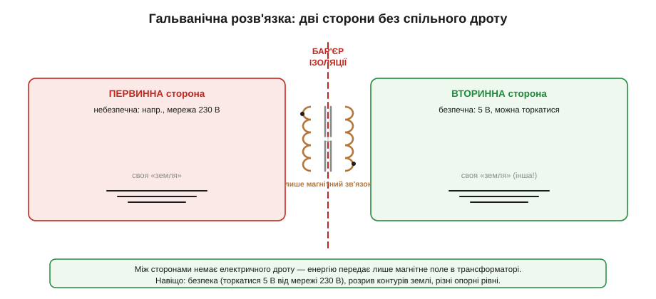
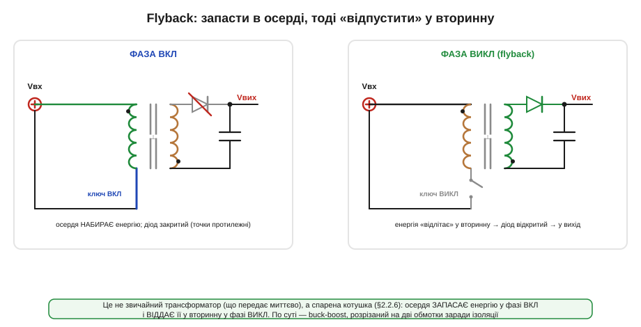
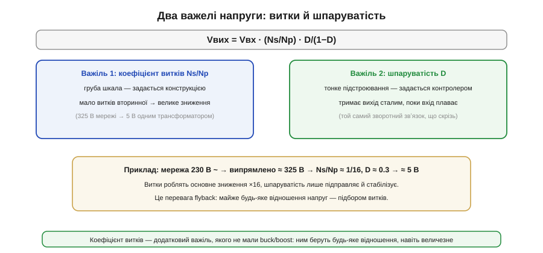
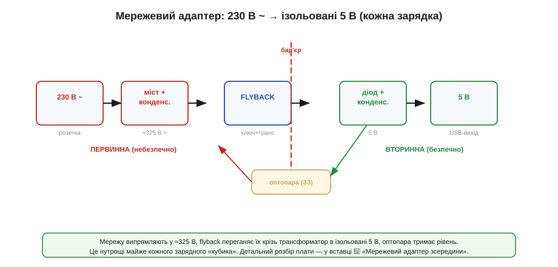
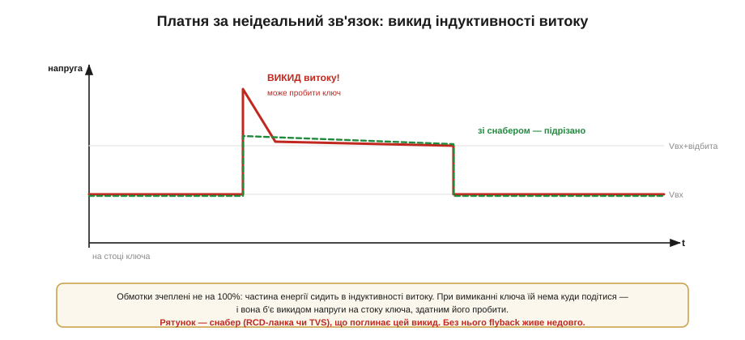

# Ізольовані топології: flyback

Базові імпульсні перетворювачі — [buck](book:electronics/buck), [boost](book:electronics/boost), [buck-boost](book:electronics/buck-boost) — мають одну спільну рису: вхід і вихід ділять **спільну землю**. Струм заходить з одного дроту, виходить іншим, а опорний «нуль» той самий по обидва боки. Для більшості вбудованих задач цього досить. Але часом цей спільний дріт треба **розірвати повністю** — і саме тут починаються ізольовані топології, а їхній головний представник — **flyback**.

Найгостріша причина розірвати землю — **мережа**. Уявіть зарядку телефона: з одного боку 230 вольт із розетки, з іншого — 5 вольт, до яких людина торкається пальцями й увіткненим роз'ємом. Якби ці 5 В ділили землю з мережею, будь-яка несправність могла б штовхнути смертельний струм у руки користувача. Між «брудними» 230 В і «чистими» 5 В має стояти стіна, крізь яку не пройде жоден електрон, — а енергія все одно мусить перетекти. Цю стіну й будує трансформатор: він зчіплює дві сторони **лише магнітним полем**, не маючи між ними жодного дроту.

### Навіщо розривати землю: гальванічна розв'язка

**Гальванічна розв'язка** (*galvanic isolation*) — це відсутність будь-якого електричного (струмопровідного) з'єднання між входом і виходом; зв'язок лишається тільки магнітний чи оптичний.


*Рис. Дві сторони перетворювача мають **різні**, не з'єднані «землі», а між ними — бар'єр ізоляції. Енергію крізь нього передає лише магнітне поле трансформатора. Жоден дріт сторони не перетинає: фаза на первинній не може штовхнути струм у людину, що торкається вторинної.*

Розв'язка потрібна з трьох головних причин. **Перша — безпека:** зробити доступні 5 В із небезпечної мережі так, щоб несправність на первинному боці не дісталася користувача (саме тому в кожного адаптера всередині стоїть трансформатор, а не самий лише знижувач). **Друга — розрив контурів землі:** коли два пристрої з'єднані й сигнальними, і силовими дротами, по «землі» можуть текти паразитні струми та шуми; ізоляція рве це коло. **Третя — різні опорні рівні:** іноді вторинна сторона працює відносно зовсім іншого «нуля», ніж первинна, і з'єднати їхні землі просто не можна.

### Трансформатор як спарена котушка

Тут криється поширене непорозуміння. Трансформатор flyback — це **не** звичайний трансформатор, що передає енергію миттєво (як у мережевому трансформаторі на 50 Гц). Це [спарена котушка](book:electronics/mutual-inductance) (*coupled inductor*): дві обмотки на спільному осерді, яке **запасає** енергію в одній фазі й **віддає** в іншій. По суті, це той самий [buck-boost](book:electronics/buck-boost), у якого єдину котушку розрізали на дві обмотки — і цим розрізом дістали ізоляцію.

Щоб осердя могло запасати помітну енергію, у нього навмисно роблять **повітряний зазор** (звичайний трансформатор зазору не має). А обмотки намотують у певному взаємному напрямку — за **конвенцією точок**, — так, щоб у фазі накопичення діод вторинної був замкнений і не випускав енергію передчасно.

Зазор тут — не дефект, а суть приладу, і варто зрозуміти чому. Звичайний трансформатор енергію передає миттєво й сам її майже **не запасає** — а якби запасав, його осердя швидко **насититься** (та сама межа, що нищить котушку при дисбалансі [вольт-секунд](book:electronics/linear-regulator)), індуктивність обвалиться, і струм піде врозніс. Flyback же мусить робити прямо протилежне — **накопичувати** енергію щоцикл. А щоб магнітне осердя могло запасти багато енергії, не насичуючись, у нього вставляють зазор: парадоксально, але більшість енергії «спареної котушки» живе саме в **повітряному проміжку**, а не в залізі. Тому без зазору flyback-трансформатор насправді не працював би як накопичувач — він би просто насичувався. Зазор перетворює трансформатор на котушку з двома обмотками.

### Дві фази: запасти, тоді відпустити


*Рис. Фаза ВКЛ: ключ первинної замкнено, до первинної обмотки прикладено Vвх, струм наростає — осердя НАБИРАЄ енергію; діод вторинної закритий (точки обмоток протилежні), вихід живиться конденсатором. Фаза ВИКЛ: ключ розмикається — і запасена в осерді енергія «відлітає» у вторинну обмотку, відкриває її діод і вливається у вихід. Звідси й назва: flyback — «відліт».*

Робота — знову у дві фази, але тепер енергія тече між обмотками:

- **Фаза ВКЛ** (ключ первинної замкнено): до первинної обмотки прикладено Vвх, струм у ній лінійно наростає, а осердя **запасає** [енергію магнітного поля](book:electronics/inductor-energy). Завдяки конвенції точок діод вторинної в цей час **закритий** — енергія накопичується, не виходячи; навантаження живить вихідний конденсатор.
- **Фаза ВИКЛ** (ключ розімкнено): струм первинної урвано, але запасена в осерді енергія мусить кудись подітися — і вона **«відлітає»** у вторинну обмотку. Там вона відкриває діод і вливається у вихідний конденсатор та навантаження. Це і є «flyback» — енергія вилітає у вторинну, коли первинну вимикають.

Це той самий принцип «запасти → віддати», що й у [buck-boost](book:electronics/buck-boost), тільки накопичувач — спарена котушка, а вхід і вихід розведені по різні боки бар'єра. І керує всім [вольт-секундний баланс](book:electronics/linear-regulator): середня напруга на намагнічувальній індуктивності за цикл нульова.

### Важіль витків: майже будь-яке відношення

Розрізавши котушку на дві обмотки, ми задарма дістали **новий важіль**, якого нема в [buck](book:electronics/buck) і [boost](book:electronics/boost), — **коефіцієнт витків** Ns/Np. Вихідна напруга flyback:

```
Vвих = Vвх · (Ns/Np) · D/(1−D)
```


*Рис. У flyback напругою керують ДВА важелі. Коефіцієнт витків Ns/Np — груба шкала, задана конструкцією трансформатора: мало витків вторинної дає велике зниження (325 В мережі → 5 В одним трансформатором). Шпаруватість D — тонке підстроювання від контролера, що тримає вихід сталим. Разом вони дають майже будь-яке відношення напруг.*

Це величезна перевага. У buck коефіцієнт визначався самою лише шпаруватістю й не міг вийти за «вниз»; у boost — за «вгору». А тут **витки** беруть на себе основне відношення — хоч ×16 униз від мережі, хоч багатократне підвищення, — а шпаруватість лиш підправляє й стабілізує вихід. Тому flyback робить майже будь-яке перетворення: 325 В → 5 В, 12 В → 400 В, що завгодно — досить намотати потрібне число витків.

> 🔧 **Навіщо це.** Саме поєднання «велике відношення напруг + ізоляція в одному трансформаторі» зробило flyback королем мережевих адаптерів. Один компонент дає і зниження з сотень вольт до одиниць, і безпечний бар'єр. Конкуренти без трансформатора так не вміють.

### Зворотний зв'язок крізь бар'єр

Ізоляція створює тонку проблему, про яку легко забути. Контролер, що крутить шпаруватість, сидить на **первинній** стороні (там, де ключ і висока напруга). А напругу, яку треба стабілізувати, видно на **вторинній** стороні. З'єднати їх дротом — означало б **зруйнувати** ізоляцію, заради якої все й затівалося.


*Рис. Контролер на первинній стороні мусить знати напругу з вторинної — але не дротом. Сигнал переносить ОПТОПАРА: світлодіод на вторинній світить на фототранзистор на первинній, і крізь бар'єр летить світло, а не струм. Так регулювання перетинає ізоляцію, не порушуючи її.*

Тому зворотний зв'язок переносять **без дроту** — найчастіше **оптопарою** (*optocoupler*): на вторинній стороні світлодіод світить тим яскравіше, чим вищий вихід, а на первинній фототранзистор ловить це світло. Крізь бар'єр летить **світло, а не струм** — електричної з'єднаності не виникає, ізоляція ціла. Інший спосіб — окрема **допоміжна обмотка** того ж трансформатора, що дає контролеру приблизну копію вихідної напруги.

> 🔧 **Навіщо це.** Оптопара поряд із трансформатором — вірна прикмета **ізольованого** перетворювача. Якщо бачите її на платі адаптера, знаєте: це канал зворотного зв'язку, яким вторинна сторона «доповідає» контролеру про напругу, не порушуючи бар'єра.

### Головний приклад: мережевий адаптер

Зберімо все в найвідоміший пристрій — зарядний «кубик».


*Рис. Шлях у кожному адаптері: мережу 230 В випрямляють мостом і згладжують у ≈325 В постійних; flyback переганяє їх крізь трансформатор в ізольовані 5 В; вихідний діод і конденсатор згладжують; оптопара тримає рівень. Бар'єр ізоляції проходить крізь трансформатор і оптопару, розділяючи небезпечну й безпечну сторони.*

Ланцюг такий: змінні 230 В випрямляються мостовим випрямлячем і згладжуються великим конденсатором у приблизно 325 В постійних; flyback рубає їх ключем, переганяє крізь трансформатор і на вторинній стороні дістає ізольовані 5 В; вихідний діод і конденсатор згладжують; оптопара повертає сигнал контролеру. Уся ця схема вміщається на нігтик і важить десятки грамів — пряма спадкоємиця тих ранніх електромеханічних перетворювачів із дзижчливим вібратором, тільки ключ тепер транзистор, а частота — десятки-сотні кілогерц.

> 🔌 **Готова плата у вставці.** Як виглядає мережевий адаптер зсередини — flyback на одному чипі, оптопара зворотного зв'язку, міжобмоткова ізоляція й типові граблі — розібрано у компонентній вставці [🔌 Мережевий адаптер зсередини](book:electronics/flyback-isolated/comp-wall-adapter.md).

### Платня: індуктивність витоку й снабер

За ізоляцію та універсальність flyback бере свою ціну, і про неї мусить знати кожен, хто його будує. Реальні обмотки зчеплені **не на 100 %**: частина магнітного потоку первинної не доходить до вторинної. Ця «незчеплена» частина поводиться як окрема маленька котушка — **індуктивність витоку** (*leakage inductance*).


*Рис. При вимиканні ключа основна енергія йде у вторинну, але енергії індуктивності витоку дітися нема куди (вторинна її не приймає) — і вона б'є гострим викидом напруги на стоку ключа, здатним його пробити. Снабер (RCD-ланка чи TVS) поглинає цей викид і підрізає пік до безпечного рівня.*

Проблема в тому, що при вимиканні ключа енергія витоку **не може** перейти у вторинну (вона ж незчеплена) — і, як будь-яка котушка, [чий струм рвуть](book:electronics/inductor-kickback), вона викидає різкий **сплеск напруги** на стоку ключа. Цей сплеск легко перевищує допустиму напругу транзистора й пробиває його. Рятунок — **снабер** (*snubber*): невелика RCD-ланка (резистор-конденсатор-діод) або захисний діод TVS, увімкнені так, щоб поглинути енергію викиду й підрізати пік. Снабер у flyback не розкіш, а **обов'язкова** деталь: без нього ключ живе лічені цикли.

Тут варто згадати ще одну напругу, що визначає вибір ключа. У фазі ВИКЛ, поки вторинна віддає енергію, її напруга **відбивається** назад на первинну через коефіцієнт витків — як Vвих·(Np/Ns). Тому ключ первинної бачить на стоку **не лише** Vвх, а Vвх плюс цю відбиту напругу (а ще зверху сідає сплеск витоку). У мережевому flyback, де Vвх ≈ 325 В, це означає, що транзистор має витримувати 600–700 В — недарма там стоять саме високовольтні MOSFET. Тобто, обираючи ключ для flyback, рахують не вхідну напругу, а суму «вхід + відбита + викид».

### Інші ізольовані топології — коротко

Flyback — король **малої** потужності (приблизно до сотні ват): він простий, дешевий і запасає енергію прямо в трансформаторі. Саме це й обмежує його потужність: осердя мусить вмістити **всю** передану за цикл енергію, а отже, на великій потужності трансформатор швидко стає громіздким і важким. Для більших потужностей беруть інші ізольовані топології, де трансформатор передає енергію **прямо** (а не запасає, тож осердя менше): **прямоходовий** (*forward*) перетворювач із власною вихідною котушкою — на сотні ват; **двотактний** (*push-pull*), **напівмостовий** і **мостовий** — на кіловати. Усі вони складніші за flyback, зате тягнуть більшу потужність. Принцип ізоляції в них той самий: бар'єр-трансформатор плюс зворотний зв'язок крізь оптопару; різниться лише те, як саме обмотки передають енергію. Нам досить знати, що flyback — це **низьковольтний масовий** випадок цієї родини, а для серйозної потужності існують його старші, складніші родичі.

### Підсумок теми

Коли вхід і вихід треба **електрично розв'язати** — насамперед заради безпеки в мережевих пристроях — беруть ізольовану топологію, а на малій потужності це **flyback**. Його трансформатор насправді є [спареною котушкою](book:electronics/mutual-inductance): осердя **запасає** енергію у фазі ВКЛ і **віддає** її у вторинну обмотку у фазі ВИКЛ — по суті, [buck-boost](book:electronics/buck-boost), розрізаний навпіл заради ізоляції. Коефіцієнт витків Ns/Np дає потужний додатковий важіль напруги (Vвих = Vвх·(Ns/Np)·D/(1−D)), яким беруть майже будь-яке відношення. Зворотний зв'язок мусить перетнути бар'єр **без дроту** — оптопарою чи допоміжною обмоткою. А неминуча індуктивність витоку змушує ставити снабер. Усе разом — це нутрощі кожного зарядного адаптера. А щоб серед усіх топологій — від лінійного стабілізатора до flyback — обрати потрібну за входом, виходом, струмом, потребою в ізоляції та ціною, є окрема [карта вибору топологій](book:electronics/topology-map).

---
