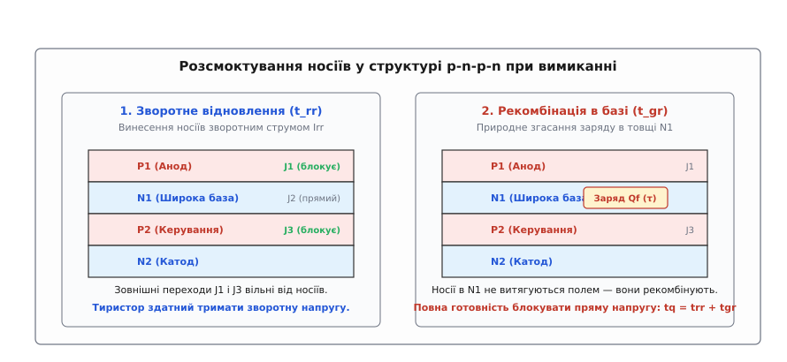
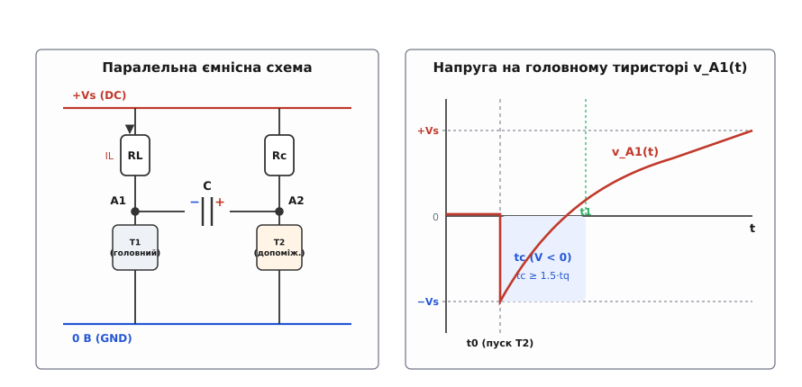
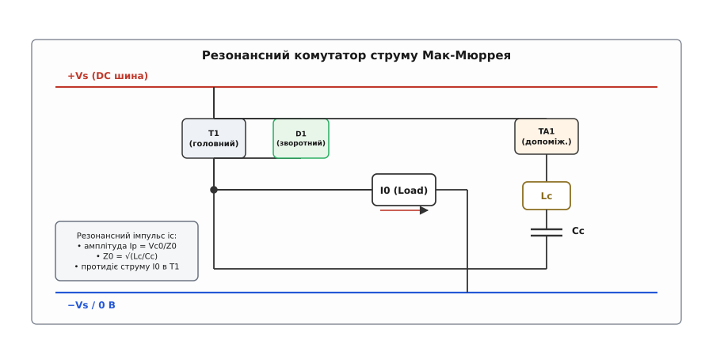
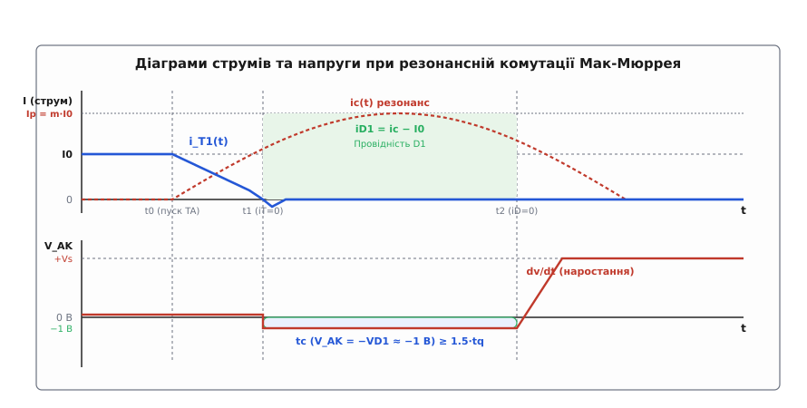

# Примусова комутація тиристора

<preknowlist>
- [Тиристор (SCR)](book:electronics/thyristor-scr) — чотиришарова структура p-n-p-n, внутрішній додатний зворотний зв'язок і струм утримання.
- [LC-резонанс](book:electronics/lc-resonance) — коливальний контур, характеристичний опір та обмін енергією між котушкою й конденсатором.
- [Снабери](book:electronics/snubbers-dvdt) — захисні RC-кола від неприпустимої швидкості наростання напруги dv/dt.
- [Втрати перемикання](book:electronics/switching-losses) — динамічні процеси комутації та розсіювання потужності в напівпровідникових ключах.
</preknowlist>

У колі постійного струму напругою 600 В тяговий електродвигун живиться крізь тиристор. Короткий імпульс струму тривалістю 15 мікросекунд у керівний електрод відкриває прилад, і крізь навантаження рушає струм силою 300 ампер. Спад напруги на відкритому тиристорі становить усього півтора вольта. Коли контролер прибирає сигнал із затвора — або навіть прикладає до нього від'ємну напругу зміщення, — тиристор продовжує безперешкодно проводити повний струм. Звичайний сигнал керування не здатен розімкнути внутрішню защіпку. Без спеціального зовнішнього впливу вимкнути струм неможливо аж до повного вичерпання джерела живлення або виникнення руйнівної аварії.

### Пастка постійного струму: чому защіпка не відпускає сама

Фізична причина некерованості тиристора криється в механізмі внутрішнього додатного зворотного зв'язку чотиришарової структури p-n-p-n. Якщо розглядати прилад як пару транзисторів PNP та NPN, з'єднаних навхрест, то колекторний струм кожного з них безпосередньо живить базу сусіднього. Щойно сума коефіцієнтів передачі струму досягає одиниці `α1 + α2 ≥ 1`, обидва внутрішні транзистори входять у стан глибокого насичення.

У режимі насичення широка слаболегована n-база тиристора затоплюється електронно-дірковою плазмою з концентрацією носіїв понад `10¹⁷ см⁻³`. Цей заряд носіїв підтримує наднизький опір кристала самостійно. Зняття потенціалу з тонкого керівного електрода p-бази нічого не змінює: локальний струм виводу керування не може витягнути гігантський об'ємний заряд носіїв, розподілений по всій площі силового кристала.

У колах змінного струму промислової частоти 50 Гц ця особливість не створює проблем. Мережева напруга змінює полярність щопівперіоду (кожні 10 мілісекунд), природно зводячи струм до нуля. Щойно струм опускається нижче порогу струму утримання `I_H` *(англ. holding current)*, защіпка розривається, і тиристор вимикається сам по собі задарма. Це явище називають **природною або мережевою комутацією** *(natural / line commutation)*.

У колах постійного струму — імпульсних регуляторах напруги (чоперах), автономних інверторах напруги та струму, перетворювачах для електротранспорту — струм односпрямований і ніколи самостійно не перетинає нульову позначку. Єдиний спосіб розімкнути силовий ключ полягає у застосуванні **примусової комутації** *(forced commutation, від латинського commutare — змінювати, перемикати)*. Зовнішнє допоміжне коло має примусово збити анодний струм до нуля, створити на приладі зворотну напругу та утримувати її протягом часу, достатнього для повного зникнення надлишкових носіїв із бази.

### Анатомія вимикання: внутрішні заряди, `tq` та час схеми `tc`

Зниження анодного струму до нуля — лише перший крок вимикання. Якщо одразу після переходу струму через нуль прикласти до тиристора пряму напругу, він миттєво відімкнеться знову, навіть без будь-якого сигналу в затворі. Приладу потрібен час на фізичне розсмоктування накопиченого заряду.

Структура тиристора містить три послідовні p-n переходи: анодний `J1` (p-n), середній колекторний `J2` (n-p) та катодний `J3` (p-n). Процес відновлення запірних властивостей складається з двох послідовних фізичних етапів:


*Фаза 1 (t_rr): винесення носіїв зовнішнім зворотним струмом I_rr звільняє переходи J1 та J3, дозволяючи тиристору блокувати зворотну напругу. Фаза 2 (t_gr): природна рекомбінація носіїв у широкій n-базі повертає переходу J2 здатність блокувати пряму напругу. Повний час вимикання становить t_q = t_rr + t_gr.*

1. **Фаза зворотного відновлення (`t_rr`):**
Під дією прикладеної зворотної напруги через тиристор короткочасно протікає зворотний струм відновлення `I_rr` амплітудою в десятки чи сотні ампер. Цей струм виносить вільні дірки та електрони з прилеглих до зовнішніх переходів `J1` та `J3` областей. Переходи `J1` і `J3` переходять у стан зворотного зміщення, утворюють збіднені шари й набувають здатності витримувати зворотну напругу. Тривалість цієї фази становить від кількох десятих до кількох мікросекунд.

2. **Фаза рекомбінації в базі (`t_gr` або `t_rec`):**
Після закривання зовнішніх переходів `J1` і `J3` зворотний струм припиняється. Проте всередині слаболегованої широкої n-бази (біля середнього переходу `J2`) залишається замкненим високий залишковий заряд дірок і електронів `Q_f`. Оскільки зовнішні переходи закриті, витягнути цей заряд зовнішнім електричним полем неможливо. Єдиний механізм його зникнення — спонтанна внутрішня рекомбінація електронів і дірок, швидкість якої визначається часом життя неосновних носіїв `τ_p`.

Повний час, необхідний напівпровідниковому приладу для відновлення здатності блокувати пряму напругу після протікання прямого струму, називають **паспортним часом вимикання тиристора** `t_q` *(turn-off time)*:

```
t_q = t_rr + t_gr                                   [структура часу вимикання приладу]
```

Для стандартних мережевих тиристорів (фазових регуляторів на 50 Гц) `t_q` становить `100 … 400 мкс`. Для спеціальних швидкодіючих (інверторних) тиристорів кристал спеціально легують золотом або опромінюють електронами для створення центрів рекомбінації, знижуючи `t_q` до `10 … 50 мкс`. Зменшення часу життя `τ_p` має свою компромісну ціну: опір тиристора у відкритому стані дещо зростає, збільшуючи прямий спад напруги від `1.2 В` до `1.8 … 2.2 В`.

Тривалість `t_q` не є сталою величиною і суттєво залежить від умов експлуатації:
- **Температура кристала:** при нагріванні від `25 °C` до `125 °C` час життя носіїв зростає, і `t_q` збільшується в 1.8–2.5 рази;
- **Прямий струм `I_T`:** більший струм створює більшу початкову концентрацію носіїв у базі;
- **Швидкість спаду струму `di/dt`:** крутіший фронт комутації збільшує амплітуду зворотного струму `I_rr`;
- **Прикладена зворотна напруга `V_R`:** більше зворотне зміщення прискорює фазу `t_rr`.

Параметром зовнішньої електричної схеми є **наданий час вимикання** `t_c` *(circuit available turn-off time)* — інтервал часу від моменту проходження анодного струму через нуль до моменту, коли напруга між анодом і катодом знову стає додатною (`V_AK > 0`).

Головне правило надійності примусової комутації формулюється так:

```
t_c ≥ k_s · t_q                                     [критерій безаварійної комутації]
```

де `k_s = 1.5 … 2.0` — коефіцієнт запасу надійності. Він враховує максимальну робочу температуру переходу, зношування компонентів та можливі просадки напруги живлення.

Якщо умова порушується і пряма напруга повертається на анод раніше, ніж завершиться рекомбінація (`t_c < t_q`), залишковий заряд миттєво вмикає внутрішню петлю підсилення. Тиристор самовільно відмикається під повною напругою шини. Це явище називають **зривом комутації** *(commutation failure)* або **перекиданням інвертора**. У мостових схемах зрив комутації призводить до наскрізного короткого замикання шин живлення через обидва відкриті тиристори стійки з катастрофічним вибухом напівпровідникових модулів.

### Класифікація методів комутації (класи A, B, C, D, E, F)

В інженерній практиці силової електроніки широко закріпилася класифікація Бедфорда-Хофта (Bedford & Hoft), що розділяє всі схеми вимикання на шість стандартизованих класів:

1. **Клас A (Самокомутація навантаженням / Load Commutation):**
Комутуючий LC-контур увімкнений послідовно з навантаженням. Коло має недодемпфований коливальний характер. Коли струм наростає за синусоїдою, конденсатор заряджається до подвоєної напруги живлення `2 · V_s`, струм природно спадає до нуля і намагається змінити напрямок. Односпрямований тиристор закривається в момент переходу струму через нуль. Застосовується в індукційному нагріванні та послідовних резонансних інверторах.

2. **Клас B (Резонансна комутація струмом / Resonant Pulse Commutation):**
LC-контур увімкнений паралельно до тиристора. Допоміжний тиристор запускає коливальний розряд, який створює зустрічний імпульс струму. Коли струм імпульсу перевищує струм навантаження, тиристор вимикається, а надлишок струму замикається крізь зустрічно-паралельний діод (базовий принцип схеми Мак-Мюррея).

3. **Клас C (Паралельна взаємна комутація / Complementary Commutation):**
Конденсатор увімкнений між анодами двох робочих тиристорів. Відмикання другого тиристора прикладає заряджену ємність у зворотній полярності до першого, гасячи його.

4. **Клас D (Допоміжна імпульсна комутація / Auxiliary Impulse Commutation):**
Конденсатор заряджається через окреме допоміжне коло, а його підключення для гасіння головного тиристора здійснюється спеціальним допоміжним ключем невеликої потужності. Прикладом є класичний чопер Джонса (Jones Chopper).

5. **Клас E (Зовнішня імпульсна комутація / External Pulse Commutation):**
Зворотна напруга або зустрічний струм вводяться в коло тиристора від окремого зовнішнього джерела (наприклад, через імпульсний трансформатор від незалежного генератора).

6. **Клас F (Мережева комутація / Line Commutation):**
Природне вимикання за рахунок зміни знака напруги джерела змінного струму (класичні випрямлячі та керовані мости на 50/60 Гц).

### Паралельна ємнісна комутація: простота, математика та пастки

Найпростішим втіленням комутації напругою є паралельна ємнісна комутація класу C.

Схема містить головний тиристор `T1` з навантаженням `R_L`, допоміжний тиристор `T2` із зарядним резистором `R_c` та комутуючий конденсатор `C`, увімкнений між їхніми анодами.


*Ліворуч: відкритий тиристор T1 живить навантаження RL, а конденсатор C заряджений до напруги +Vs через резистор Rc. Відмикання T2 прикладає напругу конденсатора у зворотній полярності до анода T1. Праворуч: напруга на аноді T1 стрибає до -Vs і експоненційно наростає до +Vs; інтервал, поки напруга від'ємна, утворює час схеми tc.*

Розглянемо повний комутаційний цикл по кроках:

1. **Стаціонарний стан (провідність `T1`):**
Тиристор `T1` відкритий і живить навантаження `R_L` струмом `I_L ≈ V_s / R_L`. Потенціал його анода близький до нуля (`v_A1 ≈ 0 В`). Допоміжний тиристор `T2` закритий. Комутуючий конденсатор `C` через резистор `R_c` заряджений до повної напруги живлення `+V_s`. Ліва обкладка конденсатора має потенціал `0 В`, права — `+V_s`.

2. **Момент комутації `t0` (відмикання `T2`):**
Для вимкнення `T1` на затвор `T2` подається імпульс керування. Тиристор `T2` миттєво відмикається, і потенціал його анода падає від `+V_s` до `0 В`.
Оскільки напруга на конденсаторі не може змінитися стрибком, його ліва обкладка (вузол `A1`) просідає вниз на величину заряду: від `0 В` до `-V_s`.

3. **Фаза зворотного зміщення `T1`:**
До головного тиристора `T1` прикладається зворотна напруга `v_A1 = -V_s`. Анодний струм `T1` миттєво спадає до нуля, і тиристор вимикається. Струм навантаження `I_L` тепер тече через резистор `R_L`, конденсатор `C` та відкритий тиристор `T2`, поступово перезаряджаючи ємність `C` у зворотному напрямку.

4. **Математичний розрахунок часу `t_c`:**
Напруга у вузлі `A1` наростає від `-V_s` до `+V_s` за експоненційним законом із постійною часу `τ = R_L · C`:

```
v_A1(t) = V_s - 2 · V_s · exp(-t / (R_L · C))       [експоненційний перезаряд ємності]
```

Тиристор `T1` перебуває під зворотним зміщенням доти, доки напруга `v_A1(t)` залишається від'ємною. Знайдемо момент переходу напруги через нуль `v_A1(t_c) = 0`:

```
V_s · [1 - 2 · exp(-t_c / (R_L · C))] = 0           [умова перетину нульової осі]
1 - 2 · exp(-t_c / (R_L · C)) = 0                   [поділили обидві частини на V_s]
exp(-t_c / (R_L · C)) = 1 / 2                       [перенесли одиницю]
-t_c / (R_L · C) = ln(1 / 2) = -ln(2)               [логарифмування]
t_c = ln(2) · R_L · C ≈ 0.693 · R_L · C             [наданий схемою час зворотного зміщення]
```

Звідси мінімальна необхідна ємність комутуючого конденсатора для безпечного вимикання становить:

```
C ≥ (k_s · t_q) / (0.693 · R_L) = (k_s · t_q · I_L) / (0.693 · V_s) [розрахункова ємність]
```

#### Головні інженерні пастки паралельної схеми:

1. **Фатальна залежність від струму навантаження:**
Час `t_c` прямо залежить від опору навантаження `R_L`. Якщо струм навантаження `I_L` зросте вдвічі (опір `R_L` зменшиться вдвічі), конденсатор перезарядиться вдвічі швидше, і час зворотного зміщення скоротиться до `t_c / 2`. Будь-яке раптове перевантаження чи пусковий струм мотора викликає миттєвий зрив комутації.

2. **Низький коефіцієнт корисної дії:**
У кожному циклі комутації конденсатор заряджається через резистор `R_c` і розряджається через `R_L`. Енергія, що розсіюється в тепло у вигляді активних втрат, за кожен комутаційний період становить `W_loss = C · V_s²`. При напрузі `600 В`, ємності `20 мкФ` та частоті комутації `1 кГц` потужність втрат лише в комутаційному колі сягає:

```
P_loss = C · V_s² · f_sw
= 20 · 10⁻⁶ · 600² · 1000                           [підстановка номіналів]
= 20 · 10⁻⁶ · 360000 · 1000
= 7200 Вт = 7.2 кВт                                 [потужність нагріву резисторів]
```

Розсіювати понад 7 кіловатів тепла на баластних резисторах неприпустимо, тому паралельну резистивну комутацію застосовували лише у відносно малопотужних пристроях.

### Допоміжна імпульсна комутація: чопер Джонса

Для усунення втрат на баластному резисторі в тяговому приводі постійного струму часто застосовували комутатор класу D — чопер Джонса (Jones Chopper).

У схемі Джонса послідовно з навантаженням увімкнено первинну секцію імпульсного автотрансформатора `L1`, а вторинна секція `L2` увімкнена в коло комутуючого конденсатора `C` через діод. Коли головний тиристор `T1` відкривається і струм навантаження починає наростати, ЕРС взаємоіндукції в обмотці `L2` автоматично дозаряджає конденсатор `C` до напруги, пропорційної струму навантаження:

```
V_c_charge ≈ V_s + (N2 / N1) · √(L_load / C) · I_0  [автоматичний дозаряд від струму навантаження]
```

Завдяки цьому при збільшенні струму двигуна `I_0` початкова напруга на конденсаторі автоматично зростає, компенсуючи зменшення постійної часу розряду. Це забезпечувало стабільний час вимикання `t_c` навіть при важких пускових перевантаженнях електротранспорту.

### Резонансна комутація струмом: схема Мак-Мюррея

Справжнім проривом у силовій електроніці став винахід Вільяма Мак-Мюррея (William McMurray, інженер компанії General Electric, 1964 рік). Мак-Мюррей запропонував замінити активний баластний опір коливальним LC-контуром і підключити зустрічно-паралельно до кожного головного тиристора зворотний діод.


*Головний тиристор T1 проводить струм навантаження I0. Для вимикання відкривається допоміжний тиристор TA1, запускаючи резонансний коливальний струм у контурі Lc-Cc. Коли цей струм перевищує I0, надлишок замикається крізь зустрічний діод D1, затискаючи зворотну напругу на T1 на рівні -1.0 В.*

Схема містить головний тиристор `T1`, зустрічно-паралельний діод `D1`, допоміжний тиристор `TA1`, комутуючу індуктивність `L_c` та конденсатор `C_c`.

Розглянемо часові інтервали процесу вимикання:


*У момент t0 запускається резонансний струм ic(t). У момент t1 струм тиристора спадає до нуля, і відмикається діод D1. Поки струм ic перевищує струм навантаження I0 (інтервал tc від t1 до t2), напруга на тиристорі V_AK утримується на рівні спаду відкритого діода -1.0 В, забезпечуючи розсмоктування носіїв.*

1. **Початковий стан (провідність `T1`):**
Головний тиристор `T1` проводить незмінний струм індуктивного навантаження `I_0`. Конденсатор `C_c` попередньо заряджений до напруги `V_c0` (плюс на верхній обкладці).

2. **Інтервал 1: наростання резонансного імпульсу (від `t0` до `t1`):**
У момент `t0` відмикається допоміжний тиристор `TA1`. Утворюється замкнений коливальний контур `C_c - L_c - TA1 - T1`. Струм конденсатора наростає за синусоїдним законом із власною частотою `ω_0 = 1 / √(L_c · C_c)`:

```
i_c(t) = I_p · sin(ω_0 · t)                          [резонансний струм розряду конденсатора]
I_p = V_c0 / Z_0 = V_c0 · √(C_c / L_c)              [амплітуда коливального струму]
```

Оскільки струм `i_c(t)` спрямований назустріч прямому струму `T1`, струм через головний тиристор спадає:

```
i_T1(t) = I_0 - i_c(t) = I_0 - I_p · sin(ω_0 · t)   [струм головного тиристора]
```

Швидкість спаду струму `di/dt` обмежена індуктивністю котушки `L_c`: `di/dt = -V_c0 / L_c`, що захищає кристал від руйнування.

3. **Інтервал 2: провідність зворотного діода та зворотне зміщення `t_c` (від `t1` до `t2`):**
У момент `t1`, коли `i_c(t1) = I_0`, струм головного тиристора падає до нуля. Щойно `i_c(t)` перевищує `I_0`, надлишковий струм `i_c(t) - I_0` перехоплює зустрічно-паралельний діод `D1`.
Струм крізь діод `i_D1(t) = i_c(t) - I_0` створює на ньому прямий спад напруги `V_D1 ≈ 1.0 В`. Відповідно, напруга на аноді закритого тиристора `T1` дорівнює:

```
V_AK = -V_D1 ≈ -1.0 … -1.5 В                        [безпечне зворотне зміщення тиристора]
```

Це невелике від'ємне зміщення виключає пробій кристала високою зворотною напругою, але водночас гарантує винесення носіїв із переходів `J1` та `J3`. Тривалість інтервалу провідності діода `t_c = t2 - t1` визначається точками перетину синусоїди `i_c(t)` з лінією навантаження `I_0`:

```
t_c = 2 · √(L_c · C_c) · arccos(I_0 / I_p) = (2 / ω_0) · arccos(1 / m) [час схеми]
```

де `m = I_p / I_0` — кратність пікового резонансного струму над струмом навантаження.

4. **Інтервал 3: лінійний перезаряд ємності (після `t2`):**
У момент `t2` струм `i_c(t)` знову стає меншим за `I_0`, і діод `D1` закривається. Допоміжний тиристор `TA1` утримується відкритим, тому струм навантаження `I_0` змушений текти через гілку `TA1 - L_c - C_c`, лінійно дозаряджаючи конденсатор `C_c` до зворотної полярності для підготовки до наступного такту. Щойно конденсатор заряджається до повної напруги шини `V_s`, відкривається нульовий діод навантаження, і допоміжний тиристор `TA1` знеструмлюється й вимикається.

5. **Обмеження мінімального та максимального коефіцієнта заповнення (Duty Cycle):**
Тривалість повного процесу комутації `t_comm = (t2 - t0) + (V_s · C_c / I_0)` накладає апаратні обмеження на діапазон регулювання вихідної напруги ШІМ-перетворювача. Схема неспроможна сформувати як надкороткі імпульси увімкненого стану (менше `t_on_min ≈ 2 · t_c`), так і надкороткі паузи вимкненого стану (менше часу повного відновлення готовності комутатора `t_off_min ≈ 3 · t_c`). У разі спроби перевищити цей діапазон конденсатор не встигає повністю відновити початковий заряд `V_c0`, що веде до зниження пікового струму `I_p` і зриву комутації в наступному такті.

> 🧮 Повне математичне виведення умов оптимального вибору коефіцієнта кратності `m ≈ 1.5` для мінімізації маси комутуючого конденсатора, розрахунок паразитного затухання в контурі та перенапруг при обриві струму діода наведено у вставці [«Аналітичний розрахунок та оптимізація комутатора Мак-Мюррея»](book:electronics/forced-commutation/math-mcmurray-calc.md).

### Динамічні загрози: `di/dt`, `dv/dt` та захисні снабери

Під час швидких перехідних процесів примусової комутації напівпровідникові прилади зазнають критичних динамічних перевантажень:

```
i_j = C_j2 · (dv/dt)                                [струм зміщення колекторного переходу]
```

1. **Критична швидкість наростання струму `di/dt`:**
У момент подачі керівного імпульсу на допоміжний тиристор `TA1` провідний стан виникає не по всьому кристалу, а у вузькій смузі завширшки кілька десятків мікрометрів біля керівного електрода. Швидкість розповсюдження увімкненого стану вглиб кристала становить близько `0.1 мм/мкс`. Якщо струм у контурі зростає швидше за швидкість розширення провідної зони, локальна густина струму досягає `10⁵ А/см²`, викликаючи миттєвий тепловий пропал кристала *(gate burn-out)*. Резонансна котушка `L_c` зобов'язана мати індуктивність, достатню для обмеження швидкості наростання: `di/dt = V_c0 / L_c < (di/dt)_crit`.

2. **Критична швидкість наростання прямої напруги `dv/dt`:**
Після закінчення інтервалу `t_c` напруга на головному тиристорі починає швидко зростати від нуля до `+V_s`. Центральний перехід `J2` тиристора володіє бар'єрною ємністю `C_j2`. Стрімкий фронт напруги генерує ємнісний струм зміщення, який потрапляє безпосередньо в базу NPN-транзистора структури. Якщо швидкість `dv/dt` перевищує паспортну межу `(dv/dt)_crit` (типово `200 … 1000 В/мкс`), струм зміщення перевищує поріг відмикання, і тиристор самовільно відкривається.

Для обмеження швидкості наростання напруги паралельно до тиристора підключають демпфувальне коло (снабер) із послідовно з'єднаних резистора `R_s` та високочастотного конденсатора `C_s`:

```
C_s ≥ I_0 / (dv/dt)_crit                            [вибір ємності снабера]
R_s = 2 · √(L_stray / C_s)                          [умова критичного демпфування контуру]
```

3. **Комутаційні перенапруги від паразитної індуктивності шин:**
Провідники силових шин живлення мають власну паразитну індуктивність `L_stray`. При швидкому розриванні зворотного струму діода `D1` або завершенні заряду конденсатора енергія магнітного поля `(1/2) · L_stray · I_0²` викликає високовольтний сплеск напруги з амплітудою до `1.5 … 2.0 · V_s`. Для захисту напівпровідників від пробою застосовують варистори, обмежувальні діоди та безіндуктивне виконання шин живлення (ламіновані шинні збірки).

### Послідовне з'єднання тиристорів: поділ напруг при комутації

У високовольтних приводах на напругу 3–10 кВ (електровози змінного та постійного струму) один тиристор не здатен витримати повну напругу лінії, тому кілька приладів вмикають послідовно в ланцюг.

При примусовій комутації виникає проблема динамічної нерівномірності: час відновлення `t_q` та заряд розсмоктування `Q_rr` різних приладів відрізняються через технологічний розкид кристалів. Тиристор, який відновлює свої запірні властивості найшвидше, раптово бере на себе майже всю напругу шини `V_s`, тоді як його сусіди ще залишаються у провідному стані. Це викликає лавинний пробій найшвидшого приладу та ланцюгове руйнування всього високовольтного стовпа.

Для вирівнювання напруг кожен тиристор високовольтного ланцюга шунтують:
- паралельним високоомним резистором `R_div ≈ 20 … 100 кОм` для статичного вирівнювання струмів витоку в закритому стані;
- паралельним конденсатором динамічного вирівнювання `C_div`, ємність якого розраховується з умови поглинання різниці зарядів відновлення найгірших екземплярів `ΔQ_rr`:

```
C_div ≥ ΔQ_rr / ΔV_allowable                        [ємність динамічного ділителя напруги]
```

де `ΔV_allowable` — допустимий перекіс напруги між послідовними приладами (типово не більше 10% від номінальної напруги).

### Особливості роботи в режимі рекуперативного гальмування

У тягових електроприводах при переході двигуна в генераторний режим (гальмування поїзда на ухилі) проти-ЕРС якоря `E_bemf` змінює знак і сумується з напругою контактної мережі. Струм якірного кола змінює свій напрямок, переходячи у зворотні діоди вільного ходу інвертора.

У цей момент комутатор працює в умовах підвищеної сумарної напруги шини `V_dc = V_s + E_bemf`. Початковий заряд комутуючого конденсатора `V_c0` зростає, що збільшує амплітуду коливального струму `I_p`, проте водночас збільшує швидкість відновлення прямої напруги `dv/dt`. Якщо система керування не коригує моменти відмикання допоміжних тиристорів з урахуванням зростання напруги, динамічне перевантаження снаберних кіл призводить до перегріву демпфувальних резисторів і пробою тиристорів за швидкістю `dv/dt`.

### Електромагнітна сумісність (EMC) та акустичний шум

Імпульси примусової комутації створюють потужні електромагнітні завади. Струми амплітудою в сотні ампер із фронтами наростання `10 … 50 А/мкс` генерують випромінюване електромагнітне поле в діапазоні частот від 100 кГц до 30 МГц, яке наводиться на слабкострумові цифрові кола мікроконтролерів і датчиків Холла.

Для захисту цифрової апаратури керування драйвери затворів обов'язково розв'язують високопотенційними імпульсними трансформаторами з додатковим заземленим електростатичним екраном між обмотками. Силові дроселі `L_c` розміщують у тороїдальних або броньових екранованих корпусах для мінімізації потоків розсіювання.

Крім того, магнітострикція в безсердечникових та феритових дроселях `L_c` під дією потужних імпульсів викликає гучний високочастотний акустичний писк на комутаційній частоті (зазвичай 400–1200 Гц), що вимагало спеціального компаундування та віброізоляції реактивних блоків у тягових відсіках локомотивів.

### Еволюційний вихід: від громіздких LC-контурів до GTO, IGBT та м'якої комутації

Протягом 1960–1980-х років примусова комутація тиристорів була єдиним технічним способом побудови потужних перетворювачів постійного струму: тягових приводів електровозів і вагонів метрополітену, регуляторів електрокарів, промислових інверторів частоти та джерел безперебійного живлення на сотні кіловатів.

Проте за можливість вимикати тиристор доводилося платити важку ціну:
- **Громіздкість та маса:** маса імпульсних поліпропіленових конденсаторів і безсердечникових котушок індуктивності комутатора часто перевищувала масу самих силових тиристорів і охолоджувачів у 3–5 разів;
- **Обмеження частоти комутації:** через необхідність витримувати час перезаряду `C_c` та високі комутаційні втрати робоча частота таких перетворювачів рідко перевищувала `400 … 1000 Гц`. Це викликало гучний неприємний акустичний писк у тягових приводах і вимагало важких вихідних фільтрів;
- **Ризик зриву комутації:** найменша просадка напруги контактної мережі або сплеск струму навантаження призводили до аварійного перекидання інвертора.

Наприкінці 1980-х років розвиток технологій напівпровідників створив прилади нового покоління, що усунули потребу в примусовій комутації:

1. **GTO-тиристори *(Gate Turn-Off Thyristor)*:**
Спеціальна мікроструктура кристала з тисячами паралельних емітерних смужок дозволила вимикати тиристор безпосередньо потужним від'ємним імпульсом струму затвора (`I_G ≈ I_A / 4`), повністю викинувши зі схеми важкі комутуючі LC-контури.

2. **IGBT-транзистори та MOSFET:**
Поява біполярних транзисторів з ізольованим затвором (IGBT) на напруги до 6.5 кВ та струми в тисячі ампер остаточно витіснила тиристори з перетворювачів низької та середньої потужності. Транзистори є повністю керованими ключами: вони вмикаються і вимикаються потенціалом затвора без тривалого розсмоктування зарядів і дозволяють підняти частоту перемикання до десятків і сотень кілогерців.

Проте принципи, закладені творцями примусової комутації, не зникли. Вони відродилися в сучасній силовій електроніці у вигляді **м'якої комутації *(Soft-Switching)*, резонансних конвертерів (LLC, LCC)** та топологій із допоміжним резонансним полюсом **(ARCP — Auxiliary Resonant Commutated Pole)**. Допоміжні LC-ланцюги більше не гасять некеровану защіпку силою — вони формують нульову напругу (ZVS) або нульовий струм (ZCS) у момент перемикання сучасних IGBT та карбід-кремнієвих (SiC) MOSFET-транзисторів, практично до нуля знижуючи динамічні втрати перетворення енергії.

> ⚙️ Практичний алгоритм чисельного моделювання фазових траєкторій, перевірки часу відновлення `t_c` та аналізу реакції схеми на температурний нагрів мовами C та C++ наведено у вставці [«Моделювання динаміки примусової комутації в колах постійного струму»](book:electronics/forced-commutation/proj-commutation-sim.md).

### Інженерний розрахунок комутатора тягового перетворювача

Для закріплення методології розрахуємо параметри резонансного комутаційного вузла Мак-Мюррея для силового DC-чопера керування тяговим двигуном постійного струму тролейбуса.

**Вихідні технічні вимоги:**
- напруга контактної мережі: `V_s = 550 В`;
- максимальний струм навантаження двигуна: `I_0 = 200 А`;
- паспортний час вимикання швидкодіючого тиристора: `t_q = 25 мкс` при максимальній робочій температурі кристала `125 °C`;
- коефіцієнт запасу надійності: `k_s = 1.6`.

#### Крок 1: Розрахунок необхідного часу зворотного зміщення `t_c`

```
t_c = k_s · t_q
= 1.6 · 25 · 10⁻⁶                                   [підстановка запасу та t_q]
= 40.0 · 10⁻⁶ с = 40 мкс                            [час провідності зворотного діода]
```

#### Крок 2: Вибір кратності струму та розрахунок ємності `C_c`

Обираємо оптимальне співвідношення `m = I_p / I_0 = 1.5`, за якого безрозмірний коефіцієнт ємності мінімальний: `g(1.5) = 0.892`.

```
C_c = (I_0 · t_c / V_s) · g(m)
= (200 · 40.0 · 10⁻⁶ / 550) · 0.892                 [підстановка робочих параметрів]
= (8.0 · 10⁻³ / 550) · 0.892
= (14.54 · 10⁻⁶) · 0.892
= 12.97 · 10⁻⁶ Ф ≈ 13.0 мкФ                         [розрахункова ємність комутатора]
```

Обираємо стандартний силовий імпульсний металізований поліпропіленовий конденсатор номіналом `C_c = 13.0 мкФ` на робочу напругу `1200 В`.

#### Крок 3: Розрахунок комутуючої індуктивності `L_c`

```
L_c = (V_s · t_c / I_0) · [1 / (2 · m · arccos(1 / m))]
= (550 · 40.0 · 10⁻⁶ / 200) · [1 / (2 · 1.5 · 0.841)] [підстановка параметрів]
= (22.0 · 10⁻³ / 200) · [1 / 2.523]
= (110 · 10⁻⁶) · 0.396
= 43.56 · 10⁻⁶ Гн ≈ 44.0 мкГн                       [індуктивність котушки]
```

#### Крок 4: Перевірка характеристичного опору та пікового струму

```
Z_0 = √(L_c / C_c)
= √(44.0 · 10⁻⁶ / 13.0 · 10⁻⁶)                      [хвильовий опір контуру]
= √3.385 = 1.84 Ом

I_p = V_s / Z_0
= 550 / 1.84 = 298.9 А ≈ 300 А                      [піковий струм допоміжної гілки]

m_real = 300 / 200 = 1.50                           [кратність строго відповідає оптимуму]

ω_0 = 1 / √(L_c · C_c)
= 1 / √(44.0 · 10⁻⁶ · 13.0 · 10⁻⁶)
= 1 / √(572 · 10⁻¹²) = 1 / (23.92 · 10⁻⁶)
= 41800 рад/с (f_0 = 6.65 кГц)                      [власна частота коливань]
```

#### Крок 5: Перевірка швидкості наростання струму `di/dt`

```
(di/dt)_max = V_s / L_c
= 550 / (44.0 · 10⁻⁶)                               [початкова швидкість наростання]
= 12.5 · 10⁶ А/с = 12.5 А/мкс                       [безпечно нижче межі 200 А/мкс]
```

Розрахований комутаційний блок гарантує безвідмовне вимикання тягового тиристора в усьому діапазоні струмів навантаження від холостого ходу до номінальних 200 ампер за максимальної робочої температури переходу `125 °C`.
