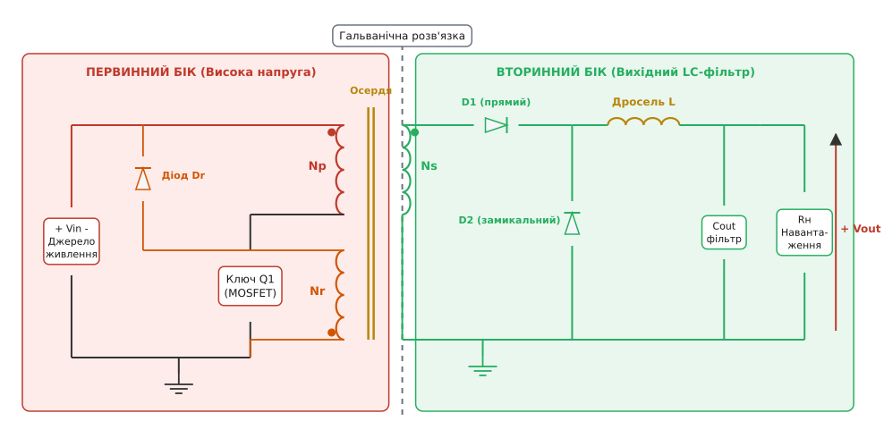
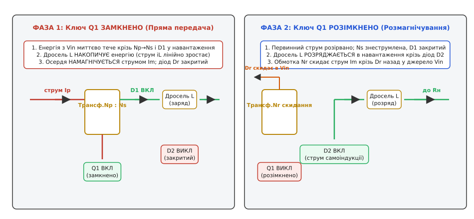
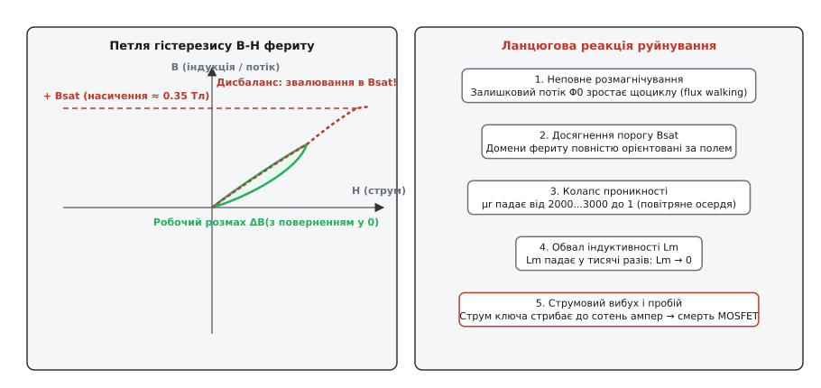
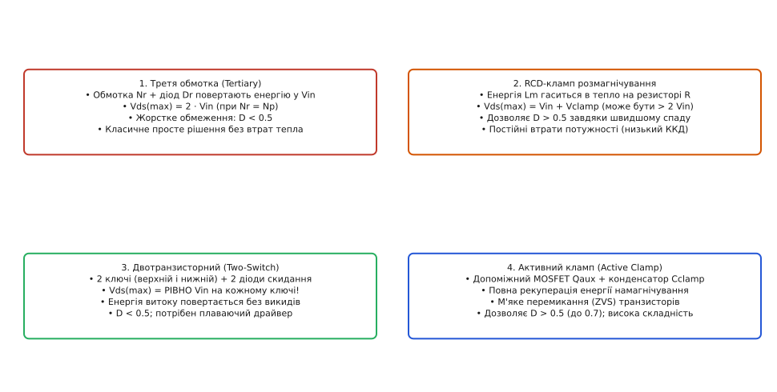
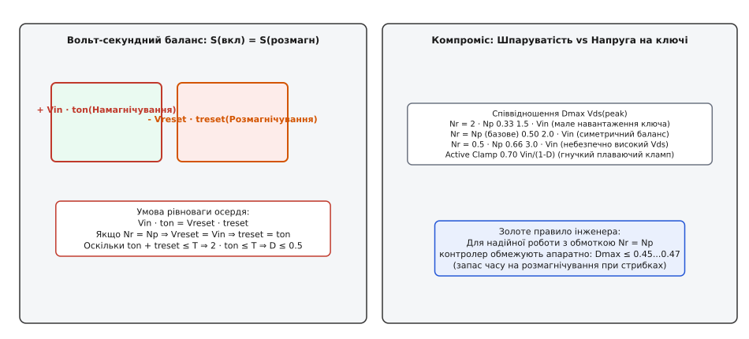
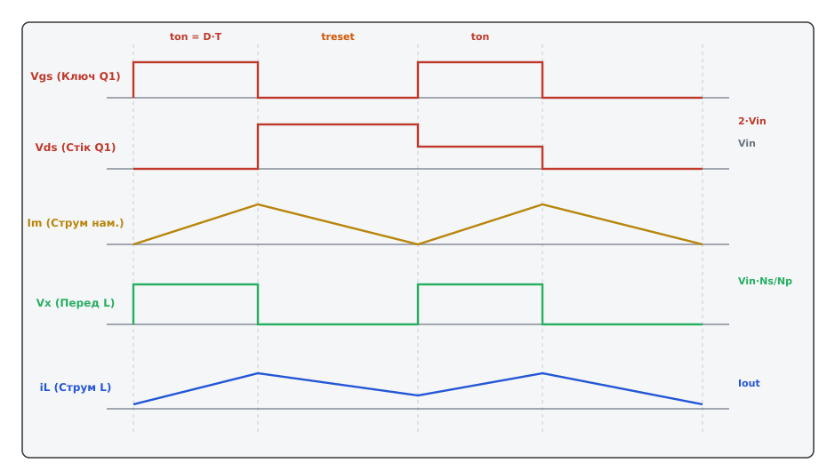

# Forward-перетворювач

<preknowlist>
- [Buck-перетворювач](book:electronics/buck) — робота вихідного LC-фільтра та замикального діода в неізольованому понижувачі.
- [Flyback-перетворювач](book:electronics/flyback-isolated) — гальванічна розв'язка та різниця між накопичувальною спареною котушкою й чистим трансформатором.
- [Вольт-секундний баланс](book:electronics/switching-converter) — збереження нульової середньої напруги на індуктивності за період комутації.
- [Силовий MOSFET](book:electronics/mosfet-power-switch) — робота транзистора в ключовому режимі, комутаційні втрати й паразитна ємність стоку.
- [Діод Шотткі](book:electronics/schottky-diode) — пряме падіння напруги та час відновлення у високочастотному випрямлячі.
</preknowlist>

Коли потужність ізольованого джерела живлення перетинає межу у 100–150 ватів, [зворотноходовий перетворювач (flyback)](book:electronics/flyback-isolated) стає тепловим і габаритним глухим кутом. Його магнітний елемент — це не справжній трансформатор, а спарена котушка індуктивності з повітряним зазором, яка змушена фізично накопичувати всю порцію передаваної енергії у магнітному полі зазору під час прямого ходу й лише потім віддавати її у навантаження на зворотному такті. Для джерела потужністю 200 Вт за частоти 100 кГц осердя мусить щоциклу закачувати та викачувати два міліджоулі енергії. Це змушує збільшувати габарити осердя, роздуває амплітуду пікових струмів первинного ключа до десятків ампер, а вихідний конденсатор змушений приймати жорсткі імпульси струму з величезним середньоквадратичним значенням, що призводить до його перегріву та швидкої деградації.

Вихід із цього глухого кута полягає у зміні базового фізичного принципу: передавати енергію з первинного кола у вторинне **безпосередньо під час провідного стану силового ключа**. Справжній високочастотний трансформатор передає потужність миттєво через змінний магнітний потік, не консервуючи робочу енергію навантаження у своєму осерді. Топологія, побудована на такому принципі прямої передачі, називається **прямоходовим перетворювачем** (англ. *forward converter*).

## Принцип прямої передачі та необхідність вихідного LC-фільтра

У класичному прямоходовому перетворювачі трансформатор виконує лише дві функції: створює гальванічну розв'язку між входом і виходом та масштабує амплітуду імпульсів напруги відповідно до коефіцієнта трансформації витків `Ns / Np`. Оскільки первинна і вторинна обмотки намотані узгоджено (мають однакову полярність, позначену крапками біля одного з виводів), поява позитивної напруги на первинній обмотці миттєво створює позитивну напругу на вторинній.


*Базова схема однотактного Forward-перетворювача з розмагнічувальною обмоткою Nr: первинне коло містить ключ Q1, вторинне коло складається з прямого діода D1, замикального діода D2 і згладжувального LC-фільтра.*

На вторинному боці не можна обмежитися простим випрямним діодом і паралельним конденсатором, як це робиться у flyback. У зворотноходовій схемі вторинна обмотка у фазі розряду сама поводиться як джерело струму з спадною пилкоподібною характеристикою. У forward-перетворювачі вторинна обмотка у фазі провідності ключа є жорстким джерелом напруги. Якби цю напругу було прикладено безпосередньо до вихідного конденсатора через діод, виник би струм короткого замикання, обмежений лише мікроскопічними паразитними опорами провідників і діода, що миттєво спалило б напівпровідники.

Тому вторинна частина forward-перетворювача обов'язково будується за структурою вихідного ступеня [buck-перетворювача](book:electronics/buck): послідовно з навантаженням встановлюється згладжувальний дросель `L`, а паралельно — замикальний діод `D2` (англ. *freewheeling diode*).


*Дві фази комутації: у фазі 1 енергія безпосередньо вливається у вихідний LC-фільтр і навантаження; у фазі 2 струм дроселя замикається крізь діод D2, а обмотка Nr повертає струм намагнічування назад у джерело.*

Робочий цикл розбивається на дві послідовні фази:

1. **Фаза провідності ключа (`ton = D · T`, де `Q1` замкнено):** До первинної обмотки `Np` прикладається постійна вхідна напруга `Vin`. На вторинній обмотці `Ns` виникає напруга `Vin · (Ns / Np)`. Прямий діод `D1` зміщується у прямому напрямку і відкривається. Замикальний діод `D2` опиняється під зворотною напругою і закривається. Струм вторинного кола тече від обмотки крізь діод `D1` та вихідний дросель `L`, живлячи навантаження і заряджаючи вихідний конденсатор `Cout`. Струм у дроселі наростає лінійно зі швидкістю, визначеною різницею між трансформованою напругою та поточною вихідною напругою:

```
diL/dt = (Vin · (Ns/Np) − Vout) / L      [наростання струму дроселя у фазі ton]
```

2. **Фаза розімкненого ключа (`toff = (1 − D) · T`, де `Q1` розімкнено):** Первинний транзистор закривається, перериваючи струм у первинному колі. Напруга на вторинній обмотці падає до нуля, і діод `D1` вимикається. Проте вихідний дросель `L` не здатний миттєво обірвати струм, накопичений у його магнітному полі. ЕРС самоіндукції дроселя відкриває замикальний діод `D2`. Струм навантаження плавно спадає, замикаючись у контурі «дросель `L` — навантаження `Rн` / конденсатор `Cout` — діод `D2`»:

```
diL/dt = −Vout / L                       [спадання струму дроселя у фазі toff]
```

Прямоходовий перетворювач — це ізольований понижувальний перетворювач (buck), у якому первинний ключ і вхідне джерело відокремлені від силового дроселя та навантаження імпульсним трансформатором. Трансформатор лише переносить прямокутні імпульси напруги крізь бар'єр ізоляції та пропорційно змінює їхню висоту, а всю роботу з неперервного живлення навантаження виконує вторинний LC-ланцюг.

> 🔧 **Навіщо це.** Завдяки неперервному протіканню струму крізь дросель `L` вихідні конденсатори forward-перетворювача не відчувають ударних струмових перевантажень. Рівень пульсацій струму на виході у 3–5 разів менший, ніж у flyback-схемах однакової потужності, що дозволяє отримувати вихідні струми у десятки ампер (наприклад, 12 В / 20 А або 5 В / 40 А) без роздування батареї електролітичних конденсаторів.

## Намагнічувальна індуктивність і прихована загроза насичення

Хоча forward-трансформатор не призначений для накопичення робочої енергії навантаження, він залишається реальним магнітним компонентом. Будь-який фізичний трансформатор має скінченну індуктивність первинної обмотки, яку в еквівалентних схемах позначають як паралельно підключену **намагнічувальну індуктивність** (англ. *magnetizing inductance*) `Lm`.

Коли транзистор `Q1` відкривається і до первинної обмотки прикладається напруга `Vin`, повний первинний струм `Ip(t)` складається з двох незалежних частин:

```
Ip(t) = Iload(t) · (Ns/Np) + Im(t)       [сума струму навантаження та струму намагнічування]
```

Перша частина — це трансформований струм навантаження, який віддається у вторинне коло через взаємну індукцію. Друга частина — це струм намагнічування `Im(t)`, який витрачається на створення магнітного потоку в феритовому осерді. Цей струм лінійно наростає від нуля до пікового значення:

```
Im(t) = (Vin / Lm) · t                   [струм намагнічування індуктивності Lm]
Im_pk = (Vin · ton) / Lm                 [піковий струм наприкінці фази провідності]
```

Зі струмом `Im` нерозривно пов'язане накопичення енергії магнітного поля в об'ємі осердя: `Em = 0.5 · Lm · Im_pk²`.


*Фізика намагнічування: без примусового скидання струму Im магнітний потік накопичується з кожним тактом (flux walking), виводячи осердя на поріг насичення Bsat, де падіння індуктивності спричиняє вибухове зростання струму ключа.*

Головний конфлікт виникає в момент розмикання ключа `Q1`. Вторинний струм навантаження миттєво припиняється, бо закривається діод `D1`. Проте магнітне поле, створене струмом `Im_pk`, не може зникнути безслідно. За законом Фарадея спроба миттєво обірвати струм в індуктивності `Lm` викликає нескінченний сплеск напруги зворотної полярності на стоці транзистора: `V = −Lm · (di/dt)`.

Якщо у схемі не передбачити спеціального шляху для скидання цієї енергії та повернення магнітного стану осердя у вихідну точку, перетворювач зазнає катастрофічної відмови через **насичення осердя** (англ. *core saturation*).

Без повного розмагнічування залишковий магнітний потік на початку кожного наступного циклу комутації буде вищим за попередній. Це явище називають «сходинковим накопиченням потоку» (англ. *flux walking* або *staircasing*). За 3–5 періодів комутації магнітна індукція в осерді досягає порогу насичення фериту `Bsat` (зазвичай 0.35–0.40 Тл за температури 100 °C).

У точці насичення всі магнітні домени фериту вже вишикувані вздовж ліній поля. Відносна магнітна проникність матеріалу `μr` лавиноподібно обвалюється від робочих значень 2000–3000 до одиниці (проникності вакууму). Як наслідок, індуктивність `Lm` падає у тисячі разів. Опір первинної обмотки зводиться до міліомів активного опору мідного дроту. При наступному вмиканні транзистора струм через нього стрибає до сотень ампер за частки мікросекунди, що закінчується миттєвим тепловим руйнуванням кристала MOSFET.

## Чотири методи розмагнічування осердя

Щоб запобігти насиченню, осердя прямоходового перетворювача необхідно примусово розмагнічувати протягом кожного періоду комутації у фазі `toff`. Для цього на первинній обмотці має формуватися напруга протилежної полярності `Vreset`, яка знижує струм `Im` назад до нуля.

В інженерній практиці силової електроніки застосовують чотири основні топології розмагнічування, кожна з яких має свою ціну та сферу використання.


*Чотири інженерні топології розмагнічування осердя прямоходового перетворювача: третя обмотка, RCD-кламп, двотранзисторний косий міст та активний кламп.*

### 1. Третя обмотка розмагнічування (Tertiary / Demagnetizing Winding)

Це класичний метод, запатентований на ранніх етапах розвитку імпульсних джерел. На осердя трансформатора намотують додаткову третю обмотку `Nr`, початок якої з'єднаний із землею первинного боку, а кінець через швидкий діод `Dr` підключений до позитивної шини живлення `Vin`. Обмотка `Nr` намотується зустрічно відносно `Np` (крапка біля виводу землі).

Коли ключ `Q1` відкритий, діод `Dr` закритий зворотною напругою `Vin · (1 + Nr/Np)`. У момент розмикання `Q1` полярність напруг на всіх обмотках змінюється на протилежну через ЕРС самоіндукції. Діод `Dr` відкривається, фіксуючи напругу на обмотці `Nr` на рівні `−Vin`.

Завдяки магнітному зв'язку між обмотками вся енергія, накопичена в індуктивності намагнічування, трансформується в обмотку `Nr` і через діод `Dr` повертається назад у вхідний фільтровий конденсатор джерела живлення. Струм намагнічування спадає до нуля з постійною швидкістю. Щойно потік падає до нуля, діод `Dr` закривається, і коливальні процеси на трансформаторі згасають до наступного такту.

Головна перевага методу — високий ККД, оскільки енергія намагнічування не розсіюється у тепло, а рекуперується у первинне джерело. Недолік — необхідність намотування додаткової обмотки та підвищена напруга на закритому транзисторі:

```
Vds_max = Vin + Vin · (Np / Nr)          [пікова напруга на стоці транзистора Q1]
```

Для стандартного симетричного випадку, коли `Nr = Np`, пікова напруга на ключі сягає подвоєного значення вхідної напруги: `Vds_max = 2 · Vin`.

### 2. RCD-кламп розмагнічування (RCD Clamp Reset)

Якщо конструкція трансформатора не дозволяє розмістити третю обмотку, паралельно первинній обмотці підключають демпфувальний RCD-ланцюг: швидкий діод, накопичувальний конденсатор `Cclamp` та розрядний резистор `Rclamp`.

Під час закривання транзистора струм намагнічування відкриває діод клампу і заряджає конденсатор `Cclamp` до напруги розмагнічування `Vclamp`. Накопичена енергія безперервно розсіюється на резисторі `Rclamp` у вигляді тепла.

Перевага RCD-клампу полягає у можливості створити напругу розмагнічування `Vclamp`, значно вищу за `Vin` (наприклад, `1.5 · Vin` або `2 · Vin`). Це скорочує необхідний час розмагнічування `treset` і дозволяє перетворювачу працювати з високим коефіцієнтом заповнення (`D > 0.5`).

Головний недолік — прямі втрати потужності. Потужність, що перетворюється на тепло на резисторі клампу, становить:

```
P_loss = 0.5 · Lm · Im_pk² · fsw         [втрати потужності на розмагнічування в RCD-клампі]
```

За потужностей понад 100 Вт ці втрати сягають кількох ватів, вимагають масивних розсіювальних резисторів і суттєво знижують загальний коефіцієнт корисної дії перетворювача.

### 3. Двотранзисторний прямоходовий перетворювач (Two-Switch Forward / Косий міст)

У силових пристроях потужністю від 200 до 1000 Вт промисловим стандартом є двотранзисторний forward-перетворювач. У цій топології первинна обмотка `Np` вмикається між двома силовими ключами: верхнім `Qhigh` (підключеним до `+Vin`) та нижнім `Qlow` (підключеним до `GND`). Діагонально до обмотки підключаються два рекупераційні діоди `Dr1` та `Dr2`.

Обидва ключі відкриваються і закриваються синхронно одним сигналом керування:

- **При відкритих ключах:** До обмотки `Np` прикладається повна напруга `Vin`. Діоди `Dr1` та `Dr2` замкнені зворотною напругою. Енергія передається у вторинне коло.
- **При закриванні ключів:** Струм намагнічування `Im` та струм енергії розсіювання шукають вихід і відкривають обидва діоди `Dr1` і `Dr2`. Первинна обмотка виявляється жорстко затиснутою між шинами живлення у зворотній полярності: до неї прикладається напруга точно `−Vin`. Енергія повертається у вхідний конденсатор.

Двотранзисторний forward має дві фундаментальні переваги:

1. **Ідеальне обмеження напруги:** Напруга на кожному з транзисторів у вимкненому стані ні за яких умов не може перевищити напругу живлення `Vin` плюс пряме падіння на діоді (`Vds_max = Vin + Vf`). Це дозволяє використовувати транзистори на 400–500 В у пристроях, що живляться від випрямленої мережі 230 В (де на шині діє 325–380 В), тоді як в однотактній схемі знадобилися б дорогі та повільні транзистори на 800–1000 В з високим опором відкритого каналу `Rds(on)`.
2. **Безпечне скидання індуктивності розсіювання:** Паразитна енергія розсіювання трансформатора автоматично повертається у джерело тими ж діодами без утворення небезпечних перенапруг на ключах і без потреби у розсіювальних RCD-ланцюгах.

Ціною цих переваг є необхідність встановлення двох транзисторів і плаваючого (ізольованого або бутстрепного) драйвера для керування верхнім ключем.

### 4. Активний кламп (Active Clamp Forward)

Активний кламп є вершиною еволюції прямоходової топології. Замість пасивних діодів паралельно первинній обмотці (або паралельно основному транзистору) встановлюється допоміжний MOSFET-ключ `Qaux` послідовно з відносно великим конденсатором `Cclamp`.

Ключ `Qaux` вмикається комплементарно до основного ключа `Qmain` із невеликим мертвим часом (англ. *dead time*). Коли `Qmain` розмикається, струм намагнічування через паразитний діод `Qaux` заряджає конденсатор `Cclamp`. Потім `Qaux` вмикається при нульовій напрузі на стоці, забезпечуючи двонаправлене протікання струму.

Виникає плавний резонанс між індуктивністю намагнічування `Lm` та конденсатором `Cclamp`. Струм намагнічування змінює напрямок на протилежний, що призводить до перезаряджання вихідної ємності основного транзистора `Coss`. У момент чергового відкривання `Qmain` напруга на його стоці вже знижена до нуля — реалізується режим **м'якого перемикання при нульовій напрузі** (англ. *Zero Voltage Switching, ZVS*).

Активний кламп усуває комутаційні втрати при вмиканні транзистора, дозволяє підняти частоту перетворення до 500 кГц — 1 МГц і підтримує автоматичне відстеження напруги розмагнічування відповідно до зміни шпаруватості:

```
Vreset = Vin · D / (1 − D)               [напруга розмагнічування в активному клампі]
Vds_max = Vin / (1 − D)                  [напруга на ключі при активному клампі]
```

Це єдина однотактна прямоходова схема, яка може стабільно та ефективно працювати з шпаруватістю `D > 0.5` (аж до `D ≈ 0.7`), що значно розширює робочий діапазон вхідних напруг.

## Вольт-секундний баланс і межа коефіцієнта заповнення D < 0.5

Фундаментальним законом, що обмежує режими роботи будь-якого магнітного осердя в усталеному стані, є [закон вольт-секундного балансу](book:electronics/switching-converter). Інтеграл напруги, прикладеної до індуктивності намагнічування `Lm` за повний період комутації `T`, повинен дорівнювати нулю:

```
∫[0..T] V_Lm(t) dt = 0                   [закон вольт-секундної рівноваги]
```

Для класичної схеми з третьою обмоткою розмагнічування цей закон записується як рівність двох прямокутних площ на графіку напруги: площі намагнічування під час фази `ton` та площі розмагнічування під час фази `treset`:

```
Vin · ton = Vreset · treset              [баланс площ вольт-секунд]
```

Напруга розмагнічування `Vreset`, приведена до первинної обмотки `Np`, визначається коефіцієнтом витків розмагнічувальної обмотки: `Vreset = Vin · (Np / Nr)`.


*Вольт-секундний баланс: площа імпульсу прямого ходу мусить строго дорівнювати площі імпульсу зворотного ходу; для симетричної обмотки Nr = Np це встановлює жорстку межу D < 0.5.*

Підставимо `Vreset` у рівняння балансу та знайдемо необхідний час розмагнічування:

```
Vin · ton = Vin · (Np / Nr) · treset         [підстановка виразу Vreset = Vin·(Np/Nr)]
ton = (Np / Nr) · treset                     [скорочення на спільний множник Vin]
treset = ton · (Nr / Np)                     [вираження часу розмагнічування treset]
```

Осердя повністю відновить свій початковий стан лише за умови, що процес розмагнічування завершиться до початку наступного періоду комутації. Тобто час `treset` не може перевищувати тривалості закритого стану транзистора `toff`:

```
treset ≤ toff                                [умова повного розмагнічування до кінця періоду]
ton · (Nr / Np) ≤ T − ton                    [підстановка виразу для treset та toff = T − ton]
ton · (1 + Nr / Np) ≤ T                      [перенесення ton у ліву частину та винесення за дужки]
ton / T ≤ 1 / (1 + Nr / Np)                  [ділення обох частин на T · (1 + Nr/Np)]
D ≤ 1 / (1 + Nr / Np)                        [визначення коефіцієнта заповнення D = ton / T]
```

У переважній більшості практичних конструкцій розмагнічувальну обмотку роблять симетричною до первинної: `Nr = Np`. Тоді формула дає суворе обмеження:

```
Dmax = 1 / (1 + 1) = 0.50                    [теоретична межа для Nr = Np]
```

Якщо контролер спробує встановити коефіцієнт заповнення `D > 0.5`, час `toff` виявиться коротшим за час, необхідний для повного скидання струму намагнічування. З кожним тактом у трансформаторі почне накопичуватися нерозмагнічений потік, що призведе до миттєвого насичення фериту.

| Співвідношення витків `Nr / Np` | Гранична шпаруватість `Dmax` | Напруга розмагнічування `Vreset` | Пікова напруга на ключі `Vds_peak` |
| :--- | :--- | :--- | :--- |
| `Nr = 2.0 · Np` | `0.33` (33%) | `0.5 · Vin` | `1.5 · Vin` (щадний режим ключа) |
| **`Nr = 1.0 · Np` (стандарт)** | **`0.50` (50%)** | **`1.0 · Vin`** | **`2.0 · Vin` (симетричний баланс)** |
| `Nr = 0.5 · Np` | `0.66` (66%) | `2.0 · Vin` | `3.0 · Vin` (високовольтний стрес) |

Збільшення кількості витків `Nr` знижує напругу на ключі, але ще більше стискає допустиму шпаруватість `Dmax`, погіршуючи використання трансформатора. Зменшення витків `Nr` розширює `Dmax`, але викликає небезпечне зростання напруги на ключі `Vds`.

> ⚠️ **Інженерний запас по шпаруватості.** У реальних схемах контролери ШІМ мають апаратне обмеження максимальної шпаруватості на рівні `Dmax_clamp ≈ 0.45...0.47`. Цей захисний проміжок у 3–5% необхідний для того, щоб під час різкого накидання навантаження (коли петля зворотного зв'язку короткочасно розширює імпульси ШІМ) випадкова затримка розмагнічування не призвела до насичення осердя.

## Розрахунок елементів і режимів: неперервний (CCM) та перервний (DCM) струм

Усталена передавальна характеристика прямоходового перетворювача у режимі неперервного струму дроселя (англ. *Continuous Conduction Mode, CCM*) виводиться з вольт-секундного балансу на вихідному дроселі `L`.


*Часові діаграми в усталеному режимі CCM: керувальний імпульс Vgs, напруга на стоці Vds, струм намагнічування Im, імпульсна напруга перед дроселем Vx та пилкоподібний вихідний струм iL.*

У фазі провідності ключа `ton` напруга на вході дроселя становить `Vin · (Ns / Np) − Vf1`. У фазі розімкненого ключа `toff` струм замикається через діод `D2`, і напруга на вході дроселя становить `−Vf2` (де `Vf1, Vf2` — прямі падіння напруги на діодах). Прирівнюючи середню напругу на дроселі до нуля (нехтуючи спадами на діодах для ідеального випадку):

```
(Vin · (Ns/Np) − Vout) · ton = Vout · toff   [початкова рівновага вольт-секунд на дроселі L]
Vin · (Ns/Np) · ton − Vout · ton = Vout · toff [розкриття дужок у лівій частині]
Vin · (Ns/Np) · ton = Vout · (ton + toff)     [перенесення члена Vout·ton у праву частину]
Vin · (Ns/Np) · D · T = Vout · T             [заміна ton = D·T та ton + toff = T]
Vout = Vin · (Ns/Np) · D                     [ділення обох частин на період T]
```

Вихідна напруга forward-перетворювача прямо пропорційна вхідній напрузі `Vin`, шпаруватості `D` та коефіцієнту трансформації `Ns / Np`.

### Розрахунок індуктивності вихідного дроселя

Вихідний дросель обирають так, щоб розмах пульсацій струму `ΔIL` становив задану частку `r` від максимального номінального вихідного струму `Iout_max` (стандартно `r = 0.2...0.4`, тобто 20–40%):

```
ΔIL = r · Iout_max                       [розмах пульсацій струму дроселя]
```

Розмах струму у дроселі за час `toff` становить:

```
ΔIL = (Vout · (1 − D)) / (L · fsw)       [зв'язок пульсацій з параметрами дроселя]
```

Звідси необхідна індуктивність дроселя для найгіршого випадку (максимальна вхідна напруга `Vin_max`, за якої шпаруватість мінімальна `D_min`):

```
L = (Vout · (1 − D_min)) / (ΔIL · fsw)   [формула розрахунку індуктивності вихідного дроселя]
```

### Межа між режимами CCM і DCM

Якщо струм навантаження знижується, постійна складова струму дроселя спадає, доки мінімальне значення пилкоподібного струму не торкнеться нуля. Цей стан є межею між неперервним (CCM) та перервним (DCM) режимами. Критичний струм навантаження, нижче якого перетворювач переходить у режим DCM, дорівнює рівно половині розмаху пульсацій:

```
Iout_crit = ΔIL / 2 = (Vout · (1 − D)) / (2 · L · fsw)   [критичний струм переходу в DCM]
```

У режимі перервного струму (DCM) дросель повністю розряджається до завершення періоду комутації, замикальний діод `D2` закривається, і вихідна напруга починає різко залежати від величини навантаження, зростаючи при малій тязі аж до пікової напруги вторинної обмотки `Vin · (Ns / Np)`.

### Розрахунок вихідного конденсатора

Вихідний конденсатор `Cout` згладжує залишковий пилкоподібний струм дроселя. Повна амплітуда пульсацій вихідної напруги `ΔVout` складається з двох складових: ємнісної зарядки `ΔVc` та падіння напруги на еквівалентному послідовному опорі конденсатора `ESR`:

```
ΔVout = ΔVc + ΔV_esr = (ΔIL / (8 · fsw · Cout)) + (ΔIL · ESR)   [пульсації вихідної напруги]
```

Для високочастотних перетворювачів на частотах 100–300 кГц частка `ΔIL · ESR` становить 80–90% від загальних пульсацій. Тому головним критерієм вибору конденсаторів є не стільки номінальна ємність, скільки гранично низький опір `ESR`.

## Практичні підводні камені: індуктивність розсіювання, синхронне випрямлення та розведення

У реальних конструкціях прямоходових перетворювачів інженери стикаються з трьома паразитними ефектами, які визначають надійність та електромагнітну сумісність.

### 1. Індуктивність розсіювання та демпфування

Жоден трансформатор не забезпечує 100% магнітного зчеплення між обмотками. Частина магнітного потоку замикається через повітря і формує **індуктивність розсіювання** (англ. *leakage inductance*) `Lleak`.

У момент закривання транзистора `Q1` енергія, накопичена в `Lleak`, не може перетекти у розмагнічувальну обмотку `Nr`, оскільки між `Np` і `Nr` магнітний зв'язок також не є абсолютно ідеальним. Ця енергія вступає у резонанс із вихідною паразитною ємністю транзистора `Coss`, генеруючи високочастотний коливальний дзвін із піками напруги, що легко можуть пробити транзистор.

Для придушення цих сплесків паралельно ключу або первинній обмотці встановлюють невеликий RC- або RCD-снабер, або використовують технологію секціонованого намотування «сендвіч» (чергування шарів первинної та вторинної обмоток), що зменшує `Lleak` у 3–5 разів.

### 2. Синхронне випрямлення

При низьких вихідних напругах (12 В, 5 В, 3.3 В) та великих струмах (10–30 А) пряме падіння напруги на діодах Шотткі `D1` та `D2` (`Vf ≈ 0.4...0.6 В`) стає головним джерелом втрат:

```
P_diode_loss ≈ Vf · Iout = 0.5 В · 20 А = 10 Вт   [втрати на нагрів діодів випрямляча]
```

Для усунення цих втрат діоди замінюють силовими N-канальними MOSFET із малим опором відкритого каналу (2–5 мОм). Отримують **синхронний прямоходовий перетворювач** (англ. *synchronous forward*). Напруга на відкритому каналі MOSFET падає до `15 А · 0.003 Ом = 0.045 В`, що знижує втрати з 10 Вт до менш ніж 1 Вт і піднімає загальний ККД модуля до 94–96%.

При керуванні синхронними ключами критично важливо точно контролювати затримки вмикання і вимикання: якщо прямий транзистор `Q_sync1` і замикальний транзистор `Q_sync2` виявляться відкритими одночасно навіть на 20 наносекунд, виникне наскрізний струм короткого замикання вторинної обмотки, який випалить транзистори.

### 3. Струмове керування проти перекосу осердя

При використанні простого керування за напругою (англ. *Voltage Mode Control*) будь-яка асиметрія тривалості імпульсів ШІМ під час динамічних змін навантаження призводить до накопичення постійного струму в осерді та його повільного звалювання в насичення.

Тому всі сучасні forward-перетворювачі проектують виключно на основі **потактового струмового керування** (англ. *Peak Current Mode Control*). Спеціальний резистивний шунт або трансформатор струму в колі стоку `Q1` вимірює миттєвий первинний струм. Щойно струм досягає порогу, заданого сигналом похибки напруги, ключ негайно вимикається. Це гарантує:

- Автоматичний потактовий захист ключа від перевантаження за струмом;
- Миттєву компенсацію коливань вхідної напруги `Vin` без запізнення в петлі зворотного зв'язку;
- Абсолютну симетрію вольт-секундного балансу і повний імунітет осердя до явища *flux walking*.

## Повний розрахунковий приклад: промисловий модуль 48 В → 12 В 15 А (180 Вт)

Розглянемо повний інженерний розрахунок прямоходового перетворювача з розмагнічувальною обмоткою для живлення телекомунікаційної апаратури.

### 1. Вихідне технічне завдання

- Вхідна напруга: телеком-шина `Vin = 36...72 В` (номінальна `48 В`);
- Вихідна напруга: `Vout = 12.0 В`;
- Номінальний вихідний струм: `Iout = 15.0 А` (вихідна потужність `Pout = 180 Вт`);
- Частота перемикання: `fsw = 200 кГц` (період `T = 5.0 мкс`);
- Припустимий розмах пульсацій струму дроселя: `r = 0.25` (25% від `Iout`);
- Допустимі пульсації вихідної напруги: `ΔVout ≤ 50 мВ` (від піка до піка).

### 2. Визначення діапазону шпаруватості та коефіцієнта трансформації

Обираємо симетричну розмагнічувальну обмотку `Nr = Np`. Максимальна шпаруватість для найнижчої вхідної напруги `Vin_min = 36 В` приймається з запасом надійності `Dmax = 0.44`.

Враховуючи падіння напруги на прямому діоді випрямляча `Vf1 ≈ 0.5 В`, необхідна вторинна напруга імпульсу становить: `Vs = Vout + Vf1 = 12.5 В`.

Розрахуємо коефіцієнт трансформації `Np / Ns`:

```
Ns / Np = Vs / (Vin_min · Dmax)
        = 12.5 / (36 · 0.44)                 [підстановка мінімальної напруги та Dmax]
        = 12.5 / 15.84 ≈ 0.789               [коефіцієнт передачі напруги]
Np / Ns = 1 / 0.789 ≈ 1.267                  [необхідне співвідношення витків]
```

Округлюємо співвідношення витків до цілих чисел: `Np = 14`, `Ns = 11` (дійсне відношення `Np / Ns = 1.272`). Обмотка розмагнічування `Nr = Np = 14 витків`.

Перевіримо шпаруватість за максимальної напруги `Vin_max = 72 В`:

```
Dmin = (Vout + Vf1) / (Vin_max · (Ns/Np))
     = 12.5 / (72 · (11/14))                 [підстановка максимальної напруги Vin_max]
     = 12.5 / 56.57 ≈ 0.221                  [мінімальна робоча шпаруватість 22.1%]
```

### 3. Розрахунок вихідного дроселя

Амплітуда пульсацій струму дроселя:

```
ΔIL = r · Iout = 0.25 · 15 А = 3.75 А    [допустимий розмах пульсацій струму]
```

Розрахуємо мінімально необхідну індуктивність дроселя для режиму `Vin_max` (`Dmin = 0.221`):

```
L = (Vout · (1 − Dmin)) / (ΔIL · fsw)
  = (12.0 · (1 − 0.221)) / (3.75 · 200000)   [підстановка параметрів режиму Vin_max]
  = (12.0 · 0.779) / 750000                  [розрахунок добутку знаменника]
  = 9.348 / 750000 ≈ 12.46 · 10⁻⁶ Гн         [кінцеве значення: 12.5 мкГн]
```

Обираємо стандартний силовий дросель номіналом `L = 15 мкГн`, розрахований на струм насичення не менше `Isat ≥ 18 А`. Дійсний розмах пульсацій струму складе:

```
ΔIL_real = (12.0 · 0.779) / (15 · 10⁻⁶ · 200000)
         = 9.348 / 3.0 = 3.116 А             [дійсний розмах пульсацій струму для L = 15 мкГн]
```

Критичний струм переходу в перервний режим (DCM):

```
Iout_crit = ΔIL_real / 2
          = 3.116 / 2 ≈ 1.56 А               [поріг переходу в DCM: 10.4% від номіналу]
```

### 4. Розрахунок вихідного конденсатора

Задані пульсації напруги `ΔVout ≤ 50 мВ`. Припускаючи, що 80% пульсацій визначається опором `ESR`:

```
ESR_max ≤ (0.8 · ΔVout) / ΔIL_real
        = (0.8 · 0.050 В) / 3.116 А          [підстановка значень ТЗ і дійсних пульсацій]
        = 0.040 / 3.116 ≈ 0.0128 Ом          [обчислення допустимого ESR: 12.8 мОм]
```

Для забезпечення такого опору обираємо три паралельно з'єднані твердотільні полімерні конденсатори ємністю `150 мкФ / 25 В` з `ESR = 25 мОм` кожен. Сумарна ємність становитиме `Cout = 450 мкФ`, а еквівалентний `ESR_total = 25 / 3 ≈ 8.3 мОм`, що із запасом вкладається у вимоги ТЗ.

### 5. Вибір напівпровідникових приладів

1. **Первинний транзистор `Q1`:**
   - Максимальна напруга на стоці за максимального входу:
     ```
     Vds_max = Vin_max · (1 + Np/Nr) = 72 · (1 + 1) = 144 В
     ```
   - З урахуванням індуктивних викидів розсіювання обираємо MOSFET із робочою напругою не менше 200 В (наприклад, із допустимою напругою 200 В і малим `Rds(on) ≤ 25 мОм`).
   - Середньоквадратичний струм через первинний ключ:
     ```
     Ip_rms ≈ (Ns/Np) · Iout · √Dmax = (11/14) · 15 · √0.44 = 11.78 · 0.663 ≈ 7.8 А
     ```

2. **Прямий діод `D1`:**
   - Зворотна напруга під час фази розмагнічування:
     ```
     Vd1_rev = Vin_max · (Ns/Np) + Vin_max · (Ns/Nr) = 72 · (11/14) · 2 ≈ 113 В
     ```
   - Обираємо діод Шотткі або діод із надшвидким відновленням на 150–200 В / 20 А.

3. **Замикальний діод `D2`:**
   - Зворотна напруга під час фази провідності:
     ```
     Vd2_rev = Vin_max · (Ns/Np) = 72 · (11/14) ≈ 56.6 В
     ```
   - Обираємо діод Шотткі на 100 В / 20 А.

### Алгоритм розрахунку та програмного моніторингу

Нижче наведено приклад коду для розрахунку параметрів і цифрового захисту forward-перетворювача від перекосу осердя.

:::tabs
```c
#include <stdint.h>
#include <stdbool.h>

// Розрахунок максимальної шпаруватості та перевірка безпеки розмагнічування
typedef struct {
    float vin;
    float vout;
    float np_ns_ratio;
    float np_nr_ratio;
    float duty_limit;
} ForwardParams;

// Обчислення безпечної шпаруватості ШІМ
float forward_calculate_duty(const ForwardParams* p) {
    // Теоретична межа за вольт-секундним балансом
    float d_max_theoretical = 1.0f / (1.0f + p->np_nr_ratio);
    
    // Захисний інженерний бар'єр (віднімаємо 5% для гарантованого скидання)
    float d_safe_ceiling = d_max_theoretical - 0.05f;
    if (d_safe_ceiling > p->duty_limit) {
        d_safe_ceiling = p->duty_limit;
    }
    
    // Розрахунок необхідної шпаруватості для підтримки Vout
    float d_target = (p->vout / p->vin) * p->np_ns_ratio;
    
    // Захисне насичення
    if (d_target > d_safe_ceiling) {
        return d_safe_ceiling;
    }
    if (d_target < 0.05f) {
        return 0.05f;
    }
    return d_target;
}
```
```cpp
#include <algorithm>
#include <cstdint>

// Обчислення безпечної шпаруватості ШІМ для Forward-перетворювача
class ForwardController {
public:
    struct Config {
        float np_ns_ratio{1.272f};
        float np_nr_ratio{1.000f};
        float hard_duty_limit{0.450f};
    };

    explicit ForwardController(Config cfg) : cfg_(cfg) {}

    [[nodiscard]] float compute_safe_duty(float vin, float vout) const noexcept {
        if (vin <= 1.0f) return 0.0f;

        // Теоретична межа вольт-секундного балансу: D < 1 / (1 + Nr/Np)
        const float d_max_theoretical = 1.0f / (1.0f + cfg_.np_nr_ratio);
        const float d_safe_ceiling = std::min(d_max_theoretical - 0.05f, cfg_.hard_duty_limit);

        const float d_target = (vout / vin) * cfg_.np_ns_ratio;
        return std::clamp(d_target, 0.05f, d_safe_ceiling);
    }

private:
    Config cfg_;
};
```
:::

Прямоходовий перетворювач поєднує ізоляційні властивості трансформатора з низьким рівнем пульсацій та високою струмовою віддачею понижувального LC-фільтра. Усвідомлене керування вольт-секундним балансом індуктивності намагнічування та вибір належного методу розмагнічування осердя перетворюють його на високоефективну та надійну основу сучасних промислових джерел живлення середньої потужності.
