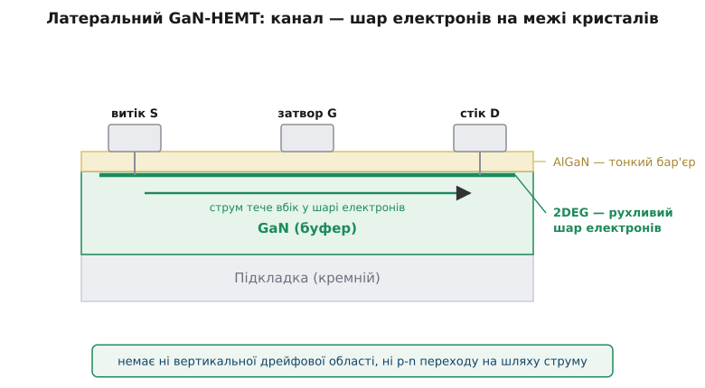
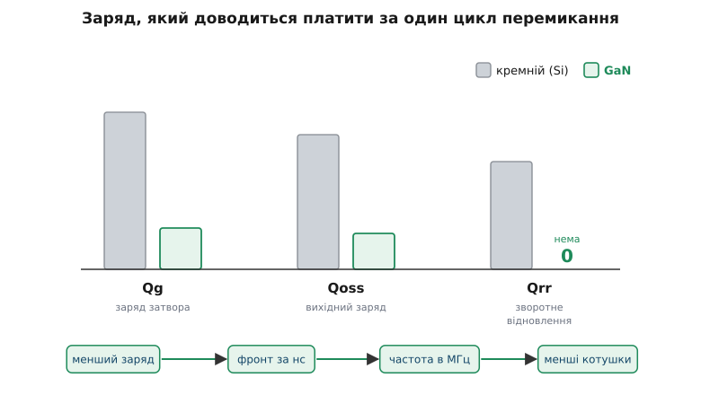
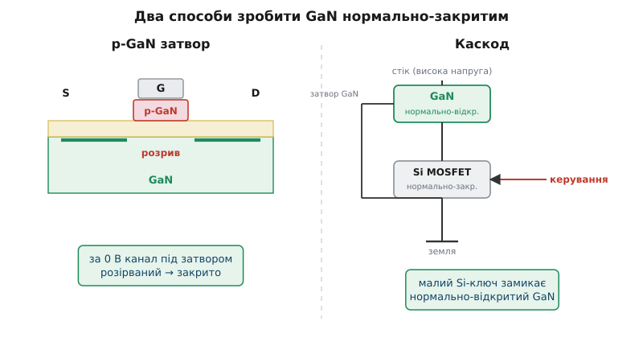

# GaN-транзистор у силовій електроніці

<preknowlist>
- [MOSFET як силовий ключ](topic:electronics/mosfet-power-switch) — як польовий транзистор вмикає й вимикає навантаження і що робить напруга на затворі.
- [Опір відкритого каналу Rds(on)](topic:electronics/rds-on) — чому опір відкритого ключа перетворюється на тепло.
- [Заборонена зона](topic:physics/energy-bands) — енергетична щілина між валентною зоною й зоною провідності; саме від її ширини все починається.
- [Втрати перемикання](topic:electronics/switching-losses) — чому сам перехід «відкрито ⇄ закрито» гріє ключ і чому його скорочують.
- [Зворотне відновлення діода](topic:electronics/reverse-recovery) — паразитний сплеск струму щоразу, коли діод різко замикають.
</preknowlist>

Сучасна зарядка для телефона вдвічі менша за стару й ледь тепла, хоча віддає ту саму потужність. Усередині — той самий імпульсний перетворювач, що й десять років тому; змінився лише один елемент: ключ. Як один транзистор здатен стиснути цілу коробку?

Відповідь починається з того, що в імпульсному перетворювачі місце й вагу з'їдають не ключі, а **магнітні елементи** — котушки й трансформатор. Що вища частота перемикання, то менше енергії треба запасати за один цикл, і то дрібнішими стають ці котушки. Тож, аби зменшити всю коробку, треба підняти частоту. Але задарма це не дається: кожне перемикання коштує енергії, і цей кошт росте з частотою. Уся боротьба зводиться до одного питання: наскільки дешевим можна зробити один цикл «увімкнув–вимкнув»? А кошт цей визначає **заряд**.

Ось де кремній упирається в стелю. Щоб у закритому стані тримати сотні вольт, кремнієвому MOSFET потрібна товста слабо легована [дрейфова область](topic:electronics/specific-on-resistance) — шар, що несе на собі всю напругу. Товстий шар — це великий кристал, а великий кристал має великі паразитні ємності. Звідси й великий заряд затвора Qg, який драйвер мусить улити й вилити щоразу, і вихідний заряд Qoss, що скидається за кожен цикл. А в мостовій схемі до них додається ще й [зворотне відновлення](topic:electronics/reverse-recovery) вбудованого діода — злий сплеск струму при кожному замиканні. Увесь цей заряд і є ціною циклу. Кремній не вміє водночас і швидко перемикатися, і тримати високу напругу.

Нітрид галію (GaN — сполука галію й азоту) б'є по цій ціні зовсім іншою будовою.

Почнімо з того, що ріднить його з карбідом кремнію: GaN — **широкозонний** напівпровідник. Його заборонена зона ≈ 3.4 еВ проти 1.1 еВ у кремнію, а тому критичне поле, яке кристал витримує до пробою, майже вдесятеро вище (≈ 3.3 проти 0.3 МВ/см). Уже саме це означає, що блокуючий шар можна зробити на ту саму напругу тоншим, а тонший прилад несе менший заряд.

Та головне не в цьому. Силовий GaN-транзистор — це не вертикальний MOSFET із дрейфовою областю під затвором. Це **латеральний HEMT** (High-Electron-Mobility Transistor — транзистор із високою рухливістю електронів). Струм тут не пірнає вглиб крізь леговану товщу, а тече вбік тонесеньким шаром — [двовимірним електронним газом](topic:electronics/hemt-2deg) (2DEG, two-dimensional electron gas). Цей шар електронів виникає сам собою на межі двох кристалів — GaN і тонкої плівки AlGaN згори: власна поляризація кристала стягує до цієї межі густий пласт електронів, і жодного легування для цього не треба. А що домішкових атомів у чистому шарі немає, електрони ковзають у ньому з дуже високою рухливістю — їм немає об що розсіюватися.

Отже, GaN проводить крізь тонкий, швидкий, нелегований канал — без вертикальної дрейфової області і, найважливіше, **без жодного p-n переходу** на шляху струму. З цих двох рис випливає майже все.

**Наслідок перший: мізерний заряд — і шалена швидкість.** Маленький латеральний прилад має крихітні ємності: його Qg і Qoss — частка від кремнієвих на ту саму роботу. Драйверу треба перемістити менше заряду, тож фронт напруги злітає й падає за одиниці наносекунд. Швидкий фронт — це малі [втрати перемикання](topic:electronics/switching-losses): поки ключ переходить з «відкрито» в «закрито», на ньому одночасно є й напруга, й струм, і він гріється; що коротший перехід, то менше цього тепла. Малі втрати дозволяють головне — підняти частоту в область мегагерців, а там магнітні елементи стискаються в рази. Це і є та сама маленька зарядка.

**Наслідок другий: немає p-n переходу — немає зворотного відновлення.** У кремнієвому MOSFET між витоком і стоком завжди сидить [вбудований діод](topic:electronics/body-diode), і при жорсткому перемиканні мосту його зворотне відновлення щоцикла скидає марний сплеск струму. У GaN такого діода немає взагалі: зворотний струм просто тече назад тим самим каналом 2DEG. Qrr = 0. Мости перемикаються чисто, гарячі сплески зникають — і це друга причина, чому GaN так любить високу частоту.

*Струм тече вбік тонким шаром електронів (2DEG), що сам виникає на межі GaN і AlGaN. Немає ні товстої дрейфової області, ні p-n переходу — звідси і мізерний заряд, і відсутність зворотного відновлення.*

*Кожен стовпчик — заряд, який доводиться платити за цикл. У GaN усі три менші, а зворотне відновлення взагалі відсутнє. Менший заряд розкручує ланцюжок: коротші фронти → вища частота → дрібніші котушки й трансформатор.*

Але за цей самий вільний 2DEG доводиться платити незручністю. Шар електронів на межі є вже за нульової напруги на затворі — а отже, «голий» GaN-HEMT **проводить із вимкненим затвором**. Такий прилад звуть нормально-відкритим (depletion-mode). Силовий ключ мусить бути прямо протилежним: за замовчуванням **закритим**, щоб мертвий контролер лишав навантаження безпечно від'єднаним. Нормально-закритим GaN роблять двома способами.

- **p-GaN затвор:** під затвором вирощують шматочок GaN p-типу, який піднімає енергетичні зони й локально спустошує 2DEG саме під затвором. За 0 В канал під затвором зникнув — прилад закритий, доки не піднімеш напругу затвора. Так улаштована більшість сучасних нормально-закритих (enhancement-mode) GaN-приладів.
- **Каскод (cascode — «увімкнення каскадом»):** GaN лишають нормально-відкритим, але вмикають послідовно з ним маленький низьковольтний кремнієвий MOSFET і керують уже ним. Кремнієвий закритий — він тримає GaN закритим. Бонус: такою парою керуєш звично, як кремнієвим затвором.

*Ліворуч: p-GaN затвор прибирає електрони під собою, тож за 0 В канал розірваний. Праворуч: каскод — низьковольтний кремнієвий ключ у ланцюзі витоку тримає нормально-відкритий GaN закритим і дає звичне керування.*

Обидва способи вимагають прицільного керування: p-GaN затвор відкривається вже за ~1.5 В і терпить лише близько 6 В — вузьке вікно без права на помилку. Як водити такий затвор безпечно й приборкувати скажений dV/dt — окрема серйозна тема: [керування затвором SiC і GaN](topic:electronics/sic-gan-gate-drive).

> 🔧 **Навіщо це.** Беручи GaN уперше, спокуса — тішитися мізерним Rds(on) і забути, що це не кремній. А він карає за кремнієві звички: вікно затвора вузьке (перевищив — убив прилад), [лавинного запасу](topic:electronics/mosfet-avalanche) немає взагалі (сплеск напруги понад номінал не переживається, а вбиває), а шалений dV/dt випромінює завади й не прощає недбалого розведення плати. GaN винагороджує щільну петлю затвора й чисту плату — і мститься за легковажність.

GaN і [карбід кремнію](topic:electronics/sic-mosfet-power) обидва переграють кремній, але в різних кутках. Латеральний 2DEG GaN незрівнянний на низьких і середніх напругах із дуже високою частотою (приблизно 100–650 В) — зарядки, перетворювачі на 48 В. Вертикальний SiC панує на високій напрузі й великій потужності (1200 В і вище) — тягові приводи, сонячні інвертори. Вони радше ділять карту, ніж воюють за неї.

Де GaN уже живе: швидкі зарядки й адаптери (його щоденне обличчя), перетворювачі на 48 В у дата-центрах, лідари (їм потрібні наносекундні імпульси струму), підсилювачі класу D, бездротове живлення. Спільне всюди одне — помірна напруга, жага до частоти й ціна за розмір та ККД.

А народився цей силовий прилад із зовсім іншого ремесла: кристал GaN довели до ладу заради синього світла, не заради потужності, і стрибок від світлодіода до силового ключа — то [окрема історія](topic:electronics/gallium-nitride-switch/hist-gan-power-birth.md).

Уся перевага GaN згортається в одну думку: коли канал — це тонкий пласт електронів, а не легована товща, у ньому майже немає ні заряду, ні переходу, тож він перемикається швидше й чистіше, ніж кремній будь-коли зможе — саме на тих напругах, де живе наше щоденне живлення.
