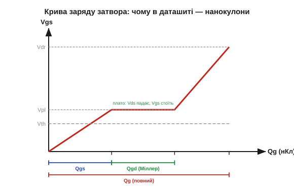
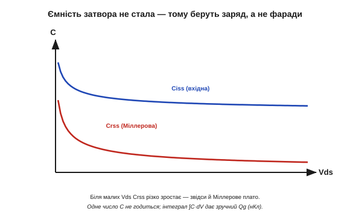

# 🧮 Заряд затвора Qg: чому рахують кулони, а не фаради

> Образ простий: [затвор MOSFET — це «відерце»](book:electronics/gate-capacitance) місткістю Qg, а час перемикання ≈ Qg / струм. Тут — чому в паспорті дають саме **заряд** у нанокулонах, а не ємність у пікофарадах, що означає крива заряду затвора й як із Qg порахувати струм драйвера та втрати на перемикання в реальних числах.

### Чому не просто «ємність × напруга»

Здавалося б, затвор — конденсатор, тож Q = C·V, і все. Але є халепа: ємність затвора **не стала**. Вона залежить від напруги, а під час перемикання — ще й різко стрибає. Винна **Міллерова** ємність між затвором і стоком: коли ключ перемикається, напруга на стоку Vds валиться з повної до нуля, і ця падаюча напруга «прокачує» крізь місток затвір-стік величезний додатковий заряд. Тому одне число C завжди бреше — то замало, то забагато.

### Крива заряду затвора

Чесна величина — це повний **заряд** Qg, що його треба влити в затвор, щоб довести Vgs до робочого рівня. Саме його (і його частини) друкують у даташиті у вигляді кривої «Vgs від Qg»:


*Рис. Крива заряду має три ділянки. **Qgs** — заряд, щоб підняти Vgs до плато (зарядити ємність затвір-витік, дійти до порога й відкрити струм). **Qgd** — пласке **Міллерове плато**: Vgs стоїть на місці, а напруга на стоку Vds у цей час валиться вся; саме сюди йде «дорогий» заряд. Далі Vgs доростає до напруги керування Vdr, добиваючи канал до повного відкриття. Сума всього — повний Qg при вашій Vdr.*

### Чому крива, а не одне число

Тепер видно, чому ємністю не обійтися: на кожній ділянці «працює» інша ємність, та ще й змінна. Сам заряд — це [**інтеграл**](book:math/integral) ємності по напрузі:

```
Q = ∫ C·dV        (а не Q = C·V, бо C не стала)
```

Інтеграл акуратно підсумовує всі ці змінні ємності в одне зручне число — кулони. А головна причина горбатого плато видно на залежності ємностей від напруги стоку:


*Рис. Вхідна ємність Ciss і особливо Міллерова Crss різко зростають при малих Vds. Поки під час перемикання стік проходить цю зону низьких напруг, Crss величезна — звідси й довге плато, на якому весь заряд іде на «перекидання» напруги стоку. Одним числом C цього не передати — тому й Qg.*

### Скільки струму й часу

Усе решта рахується з простого `заряд = струм × час`. Щоб перемкнути ключ за час t, у затвор треба загнати струм:

```
I(затвора) = Qg / t
```

Хочете перекинути 100 нКл за 100 нс — потрібен **1 А** у затвор. Ніжка мікроконтролера (міліампери) цього не дасть — звідси й окремий драйвер затвора. А середній струм, що його затвор «споживає» на частоті перемикання f:

```
I(середній) = Qg · f
```

Ось і розгадка уявного парадоксу: у статиці затвор струму не тягне ([полем керує напруга, не струм](book:electronics/field-control)), та на високій частоті кожен цикл вливає й виливає Qg — і це вже відчутний струм від драйвера.

### Втрати на перемикання

Найважливіше: головні втрати — **не** в затворі (там лише ≈ Qg·Vdr за цикл, дрібниця), а в **каналі**, поки триває перехід і на ключі одночасно є й напруга, і струм:

```
E(перех) ≈ ½ · Vds · Id · t(перех)     (на одне перемикання)
P(перех) ≈ (E_вмик + E_вимк) · f
```

Оскільки t(перех) тим менший, чим більший струм драйвера, **швидше** перемикання вкорочує цей небезпечний перехід і зменшує втрати (платня за це — електромагнітні завади). А ще втрати ростуть **прямо з частотою**. І саме Міллерів заряд Qgd задає довжину плато, тож для швидких ключів цінують MOSFET із **малим Qgd**.

### Де це працює

Заряд затвора — місток між «статикою» й «динамікою» MOSFET. Він пояснює, навіщо взагалі потрібен [драйвер затвора](book:electronics/gate-capacitance): доставити Qg достатньо швидко (I = Qg / t). Він керує вибором транзистора для ключових перетворювачів і ШІМ: малий Qg — швидкий ключ із малими втратами на перемикання, але він тягне за собою компроміс із [опором Rds(on)](book:electronics/rds-on) — великі низькоомні прилади мають і великий затвор. І нарешті, він примирює образ «[у затвор струм не тече](book:electronics/field-control)» із реальністю: у спокої — справді нуль, а на кожному перемиканні — порція Qg, помножена на частоту.
