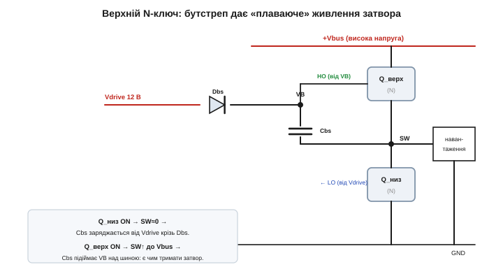

# 🔌 Драйвер затвора: навіщо окрема мікросхема між логікою і силовим ключем

> Каталог «Компоненти» · сектор `active`.

### Навіщо він узагалі

Із математики заряду затвора ([вставка про Qg](book:electronics/gate-capacitance/math-gate-charge.md)) пам'ятаємо: щоб перемкнути ключ швидко, у затвор треба загнати струм I = Qg / t — часто **ампери**. Ніжка мікроконтролера дає міліампери. Драйвер — це міст через цю прірву: спеціальний підсилювач струму (gate driver), приставлений до затвора.

Звідки береться ця прірва, варто відчути конкретно. Затвор силового MOSFET — це не «вхід логіки», а **конденсатор** на десятки нанофарад еквівалентного заряду: повний заряд Qg типового ключа середньої потужності — 30–100 нКл. Щоб перекинути 50 нКл за 50 нс (звичайна вимога для м'якого перемикання на десятках кГц), потрібен струм I = Qg / t = 50·10⁻⁹ / 50·10⁻⁹ = **1 А**. А вихід GPIO мікроконтролера обмежений десь 20–40 мА, та ще й має послідовний опір у сотні ом. Підключи затвор напряму — і він заряджатиметься мікросекунди замість наносекунд, тобто ключ повзтиме крізь лінійну зону, де на ньому одночасно є й висока напруга, і повний струм. Саме там розсіюється тепло (математика втрат — у [вставці про Qg](book:electronics/gate-capacitance/math-gate-charge.md)), тому повільне перемикання = гарячий, а часто й мертвий ключ. Драйвер існує, щоб цей перехід тривав наносекунди, а не мікросекунди.

> 🔧 **Навіщо це.** Перше правило вибору: якщо ваш силовий MOSFET керується частотою вище ~1 кГц або має Qg більше ~10–15 нКл, не вішайте затвор просто на ніжку контролера. Порахуйте потрібний струм I = Qg / t для бажаного фронту — і якщо вийде понад ~50–100 мА, потрібен драйвер. Це не «для надійності», а фізична умова, щоб ключ не згорів від власних втрат.

### Що всередину: тотемний вихід


*Рис. Серце драйвера — два потужні ключі «стовпчиком» між живленням затвора Vdrive і землею, а їхня середина — вихід. Вхідна логіка вмикає або **верхній** ключ (ллє ампери з Vdrive у затвор — наповнює Qg), або **нижній** (зливає заряд у землю — спорожняє). Те саме, що робить вихід КМОН-інвертора, лише в силовому масштабі.*

Чому саме два ключі «стовпчиком» (push-pull, тотемний вихід), а не один резистор підтяжки? Бо заряд треба й **влити**, і **відсмоктати**, і обидві операції мусять бути сильними. Резистор підтяжки на Vdrive зарядив би затвор повільно (через свій опір), а головне — не зміг би активно його розряджати: на вимиканні він лише пасивно стікав би заряд, лишаючи ключ напіввідкритим у небезпечній зоні. Два активні ключі дають низький опір в **обидва** боки: верхній відкривається — і ампери течуть із Vdrive у затвор; нижній відкривається — і затвор замкнено майже накоротко на землю, заряд злітає за наносекунди. Саме низький опір нижнього ключа рятує від хибного відмикання за Міллером, до якого ще дійдемо.

Окрім самого виходу, у драйвері є й корисна обв'язка: окреме живлення затвора Vdrive (часто 10–12 В — рівно стільки, щоб **повністю** відкрити силовий ключ, бо при типовій Vgs(th) у 2–4 В повна провідність каналу настає аж при 8–10 В), захист від просідання живлення (UVLO, undervoltage lockout — не жене напіввідкритий затвор, що грівся б, поки Vdrive не доросла до робочого рівня), вхід дозволу (enable). UVLO тут не дрібниця: напіввідкритий ключ має високий Rds(on), тож на старті, поки живлення наростає, він міг би розсіяти величезну потужність — UVLO просто тримає затвор закритим, доки годувати його нема чим.

### Велика проблема: верхній N-ключ

Справжня причина, чому без драйвера часто не обійтися, — **верхнє плече на N-каналі**. Щоб відкрити верхній [N-MOSFET](book:electronics/nmos-pmos), на затвор треба напругу **вищу за +V** — а якщо +V це і є висока силова шина, такої напруги в схемі просто нема. Чому саме вищу? Бо N-канал відкривається напругою затвір-**витік** Vgs, а у верхнього ключа витік сидить не на землі, а на виході півмоста (вузол SW), що в увімкненому стані підстрибує майже до +Vbus. Отже, щоб мати Vgs ≈ 10 В, затвор треба підняти до +Vbus + 10 В — вище за найвищу шину в схемі. Класичний вихід — **бутстреп** (bootstrap):


*Рис. Конденсатор Cbs і діод Dbs. Поки відкритий **нижній** ключ, вузол SW ≈ 0, і Cbs заряджається від Vdrive крізь Dbs. Коли треба відкрити **верхній** ключ, SW підстрибує до +Vbus, а заряджений Cbs «їде» зверху, піднімаючи живлення верхнього боку VB над шиною — і драйверу є чим підтягнути верхній затвор. Вихід HO «плаває», слідуючи за SW.*

Це елегантний трюк: одне дешеве живлення Vdrive обслуговує і нижній ключ напряму, і верхній — через бутстрепний конденсатор, що сам підлаштовується під рівень шини. Розмір Cbs не довільний: за кожне ввімкнення верхнього ключа конденсатор віддає в затвор порцію Qg, і його напруга при цьому **просідає** на ΔV = Qg / Cbs. Щоб це просідання було малим (скажімо, менше 0.5 В при Qg = 50 нКл), потрібно Cbs ≥ Qg / ΔV = 50·10⁻⁹ / 0.5 = 100 нФ — а на практиці беруть із запасом у 10–20 разів більше, бо Cbs живить ще й струм спокою верхнього драйвера, та ще й сам діод Dbs має зворотний витік.

### Як підключити

Логіка (ШІМ) на вхід, живлення Vdrive, а вихід — у затвор через **малий резистор затвора Rg** (він задає компроміс швидкість↔дзвін і завади). Для півмоста: бутстрепний конденсатор із діодом на верхній бік, спільне Vdrive і **мертвий час** між HO та LO.

**Як вибрати Rg.** Резистор затвора — це не «про всяк випадок», а навмисне сповільнення, і його номінал має фізичний сенс. Пік струму драйвера в момент перемикання задає сам Rg разом із внутрішнім опором виходу драйвера Rdrv:

```
I(пік) = Vdrive / (Rdrv + Rg)
```

Звідси видно компроміс. Малий Rg → великий струм → стрімкий фронт → малі втрати на перемикання, **але** різкий dV/dt на стоку, дзвін на паразитних індуктивностях розведення й сильніше хибне відмикання за Міллером. Великий Rg → м'якший фронт, тихіші завади, **але** довший перехід і більший нагрів. Спершу прикидають Rg «згори»: який пік струму витримує драйвер і скільки треба, щоб укластися в бажаний час фронту t. Заряд активної ділянки (Міллерове плато) Qgd треба перекинути за t при середній напрузі привода десь (Vdrive − Vplateau):

```
Rg(max) ≈ t · (Vdrive − Vplateau) / Qgd  −  Rdrv
```

Далі цю верхню оцінку зменшують, доки завади й дзвін не вкладуться в допуск. Типові значення — одиниці-десятки ом. І окремий нюанс: часто ставлять **різні** Rg на ввімкнення й вимкнення (через два діоди), бо вимикати хочеться **швидше**, ніж вмикати, — саме швидке стягання затвора донизу гасить Міллерове хибне відмикання.

### Типові граблі

**Бутстреп треба підживлювати.** Cbs заряджається лише поки відкритий нижній ключ. Тож тримати верхній ключ відкритим **вічно** (100 % шпаруватості) не можна — заряд стече (через витік діода Dbs, струм спокою верхнього драйвера й невеликий зворотний струм затвора), напруга VB просяде нижче UVLO, і верхній ключ почне відкриватися не повністю — грітися. Потрібні періодичні «ковтки» нижнім ключем (звідси типове обмеження шпаруватості ~95–99 %), окреме ізольоване живлення чи зарядова помпа, якщо потрібен справжній постійний відкритий стан.

**Хибне відмикання за Міллером.** Це найпідступніша пастка, тож розберемо її з числами. Коли **парний** ключ півмоста різко вмикається, напруга на стоку нашого «закритого» ключа стрибає зі швидкістю dV/dt у кілька — десятки В/нс. Цей стрибок крізь ємність затвір-стік Cgd (вона ж Crss у даташиті) **впорскує** струм у вузол затвора:

```
I(Міллер) = Cgd · dV/dt
```

Цей струм тече крізь усе, що з'єднує затвор із землею: внутрішній нижній ключ драйвера (його опір Rdrv,off) і зовнішній Rg. На цьому опорі він наводить хибну напругу на затворі:

```
Vgs(хибна) = I(Міллер) · (Rdrv,off + Rg) = Cgd · dV/dt · (Rdrv,off + Rg)
```

Якщо Vgs(хибна) перевищить поріг Vgs(th), «закритий» ключ привідкриється — а оскільки парний у цей момент уже відкритий, через обидва плеча пройде **наскрізний струм** (shoot-through), що гріє й може вбити обидва ключі.

**Числовий приклад: чи спрацює паразитне відмикання.**
Розглянемо півмостовий привід мотора з ESP32-ШІМ. Силова шина 48 В, ключ із Cgd (Crss) = 150 пФ і Vgs(th) = 3 В. Парне плече вмикається за 8 нс, тобто dV/dt = 48 В / 8 нс = 6 В/нс. Сумарний опір стягання затвора донизу: внутрішній Rdrv,off = 2 Ω, зовнішній Rg = 10 Ω.

```
dV/dt        = 48 / 8e-9      = 6.0e9  В/с   = 6 В/нс
I(Міллер)    = Cgd · dV/dt
             = 150e-12 · 6.0e9 = 0.9 А
Vgs(хибна)   = I · (Rdrv,off + Rg)
             = 0.9 · (2 + 10)  = 10.8 В
```

10.8 В проти порога 3 В — ключ **гарантовано** хибно відкриється, наскрізний струм забезпечено. Висновок прямий: при таких dV/dt не можна тримати велике Rg на вимиканні. Поставимо окремий швидкий шлях розряду — Rg,off = 0 Ω (затвор стягається лише внутрішнім опором драйвера):

```
Vgs(хибна)   = 0.9 · (2 + 0)   = 1.8 В   < 3 В  → не відкриється
```

Тепер 1.8 В нижче за поріг 3 В — запас є. Якщо й цього мало (швидші ключі, вищі шини), додають **від'ємну напругу вимкнення** (−2…−5 В на затвор), щоб навіть кілька вольт хибного підйому не дотяглися до порога. Ось чому «розумні» драйвери дають окремий вивід під сильне стягання й опцію від'ємного живлення.

**Мертвий час.** Драйвер (чи ваш ШІМ) мусить вставляти паузу, щоб [обидва плечі](book:electronics/h-bridge) ніколи не були відкриті разом. Причина та сама, що й у Міллера, лише ще прямолінійніша: один ключ вимикається не миттєво (треба злити Qg), і якщо парний увімкнути раніше, ніж перший добре закрився, шина на коротку мить замкнеться накоротко крізь обидва ключі. Мертвий час — це навмисна пауза, довша за час вимкнення ключа з його Rg; типово десятки-сотні наносекунд, і її задають із запасом на розкид параметрів.

**Розведення.** Петлю затвора тримають **короткою**: довгі доріжки мають паразитну індуктивність, яка з ємністю затвора утворює коливальний контур — він **дзвенить** (перерегулювання Vgs, що може пробити тонкий підзатворний оксид) і гальмує перемикання. Те саме стосується петлі повернення струму драйвера: вихід драйвера й «земляну» ніжку силового ключа ведуть поруч і коротко, інакше індуктивність цієї петлі сама наведе хибну Vgs.

### Варіації

Низькобічний драйвер (low-side) — найпростіший, без бутстрепа: витік ключа на землі, тож живлення затвора нерухоме й нічого «плавати» не мусить. Півмостовий (half-bridge, верх+низ із бутстрепом) — для плечей мотора й перетворювачів. **Ізольовані** драйвери дають гальванічну розв'язку (через трансформатор чи оптику) для високої напруги, де земля силової частини й земля контролера різняться на сотні вольт (привід, мережа, електромобіль) — там бутстреп уже не рятує, бо немає спільної опори. А бувають і повністю інтегровані «силові каскади» (драйвер разом із ключами в одному корпусі — менша паразитна індуктивність петлі затвора, бо все поруч у кристалі) та «розумні» драйвери із захистом (детект наскрізного струму, контроль dV/dt, програмований мертвий час) для потужних IGBT/SiC, де ціна помилки особливо висока.

> 🔧 **Навіщо це.** Драйвер затвора — не примха, а необхідність, щойно перемикаєте **швидко** (десятки кГц і вище) або керуєте **верхнім N-ключем**. Запам'ятайте дві його ролі: доставити Qg за ампери (швидко = холодно) і дати верхньому затвору живлення над шиною через бутстреп. А зі собою тягне дисципліну: вибрати Rg за компромісом швидкість↔завади, окремо й сильно стягати затвор на вимиканні проти Міллера (порахуйте Cgd·dV/dt·R проти Vgs(th)!), витримати мертвий час, тримати петлю затвора короткою й не забути про 100 % шпаруватості, де бутстреп уже не встигає зарядитися.
