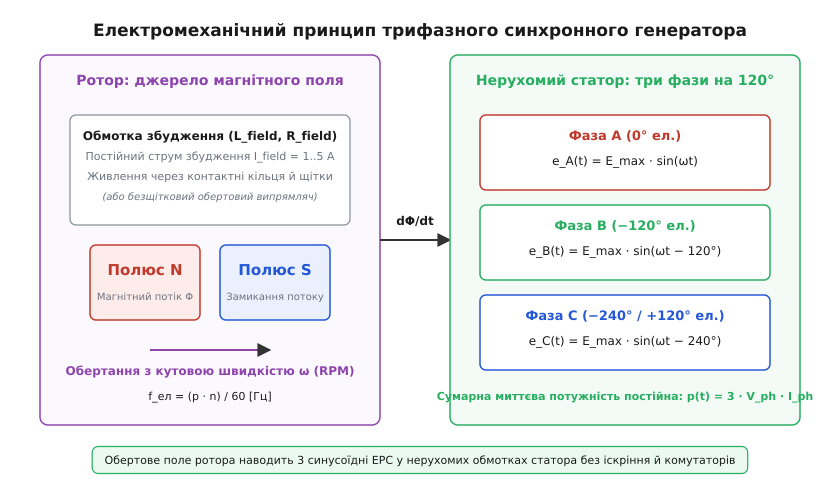
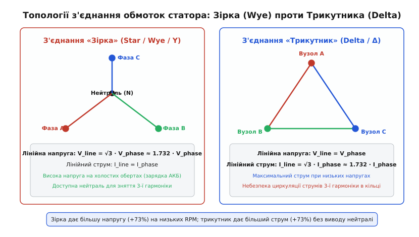
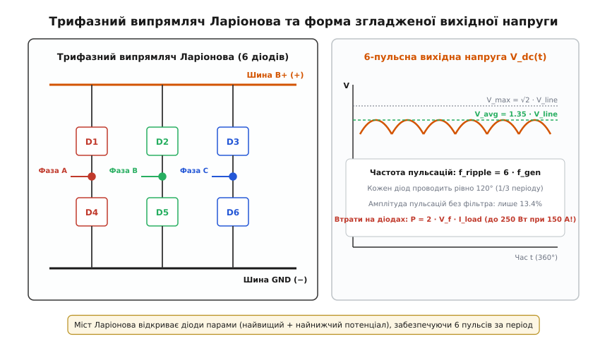
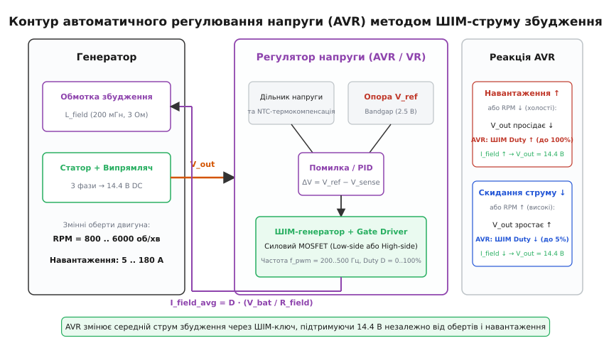
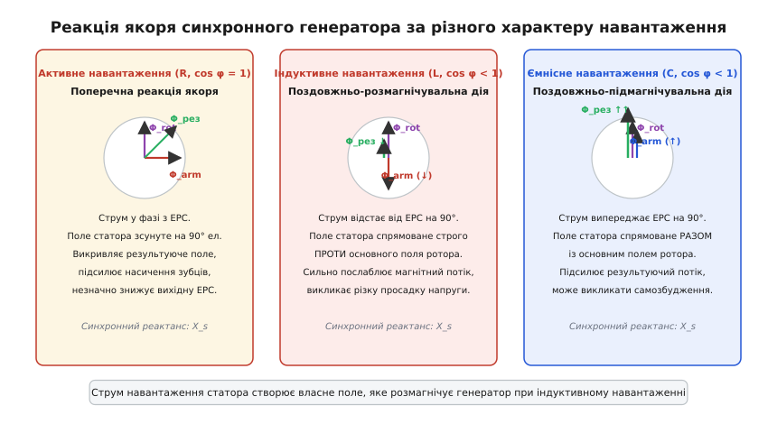
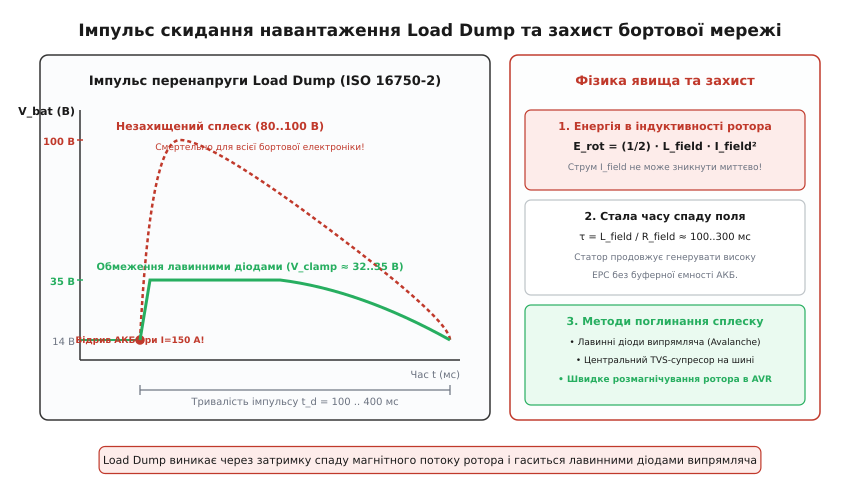

# Генератор змінного струму

<preknowlist>
- [Закон електромагнітної індукції Фарадея](topic:electronics/faraday-law) — виникнення ЕРС у провіднику при зміні магнітного потоку через контур.
- [Діодний міст](topic:electronics/bridge-rectifier) — двохнапівперіодне випрямлення змінного струму в постійний.
- [Синхронний випрямляч](topic:electronics/sync-rectifier) — заміна діодів на польові транзистори для кардинального зменшення падіння напруги.
- [TVS-діод](topic:electronics/tvs-diode) — напівпровідниковий захист кіл від високовольтних імпульсів перенапруги.
- [Транзистор як ключ](topic:electronics/transistor-switch) — комутація постійного струму через індуктивне навантаження.
- [Закон Ома](topic:electronics/ohms-law) — фундаментальний зв'язок напруги, струму та опору в електричному колі.
</preknowlist>

Коли струмове навантаження бортової мережі автомобіля чи автономного об'єкта сягає 150 А при 6000 об/хв колінчастого вала, класичний генератор постійного струму з механічним колектором зазнає фізичного колапсу. Пропускання повного струму 150 А крізь графітові щітки по мідних пластинах обертового колектора породжує неперервну електричну дугу, розплавляє мідь ламелей, стирає щітки на графітовий пил за сотні кілометрів пробігу, а важкі обмотки якоря під дією відцентрової сили виривають пазові клини. 

Виходом із цієї кризи є інверсія конструкції машини: перенесення важких силових обмоток на нерухомий зовнішній статор (лат. *stator* — нерухомий), де вони не зазнають дії відцентрових сил і легко охолоджуються, а на роторі (лат. *rotor* — той, що обертається) залишається лише легкий обертовий електромагніт постійного струму збудження величиною всього 2–5 А. Саме так побудований трифазний синхронний генератор змінного струму — альтернатор (лат. *generator* — породжувач, від лат. *alternare* — чергуватися).

### 1. Фізика трифазної електромагнітної індукції

Фундаментом генерації енергії є [закон електромагнітної індукції Фарадея](topic:electronics/faraday-law): зміна магнітного потоку `Φ(t)`, що пронизує замкнений контур, наводить у ньому електрорушійну силу (ЕРС) `e(t) = −dΦ/dt`.

```
          ┌────────────────────────────────────────────────────────┐
          │                    РОТОР (ЗБУДЖЕННЯ)                   │
          │     Постійний струм I_field ──> Потік ротора Φ(t)      │
          └──────────────────────────┬─────────────────────────────┘
                                     │  Обертання з кутовою
                                     │  швидкістю ω (n об/хв)
                                     ▼
          ┌────────────────────────────────────────────────────────┐
          │                    СТАТОР (ЯКІР)                       │
          │ 3 обмотки зі зсувом 120° ──> 3 фазні ЕРС: e_A, e_B, e_C│
          └──────────────────────────┬─────────────────────────────┘
                                     │
                                     ▼
          ┌────────────────────────────────────────────────────────┐
          │                    СИЛОВИЙ ВИПРЯМЛЯЧ                   │
          │   6 діодів Ларіонова / Активний міст на MOSFET         │
          └──────────────────────────┬─────────────────────────────┘
                                     │
                                     ▼
                         Постійна напруга B+ (14.4 В)
```

У синхронному генераторі магнітний потік створюється котушкою збудження ротора, крізь яку протікає постійний струм `I_field`. Коли ротор обертається приводним двигуном із механічною частотою `n` (об/хв), його магнітні полюси `N` і `S` послідовно проходять повз нерухомі котушки статора, створюючи в їхніх осердях змінний магнітний потік. Потокозчеплення кожної фази `ψ(t) = N_ph · Φ(t)` змінюється за гармонійним законом внаслідок геометричного профілювання повітряного зазору.

Нерухомий статор містить три незалежні фазні обмотки (`A`, `B`, `C`), просторово зсунуті по колу магнітопроводу на кут `120°` електричних градусів (`2π/3` радіана). Внаслідок просторового зсуву магнітний потік ротора досягає максимуму в кожній наступній фазі з запізненням на третину періоду. На кінцях обмоток наводяться три гармонійні ЕРС однакової амплітуди `E_max`:

```
e_A(t) = E_max · sin(ωt)
e_B(t) = E_max · sin(ωt − 2π/3)
e_C(t) = E_max · sin(ωt − 4π/3) = E_max · sin(ωt + 2π/3)
```

Сума миттєвих значень трьох фазних ЕРС у будь-який момент часу строго дорівнює нулю: `e_A(t) + e_B(t) + e_C(t) = 0`. Це означає, що за симетричного навантаження сумарний миттєвий струм нейтрального проводу дорівнює нулю, а сумарна миттєва електрична потужність, яка передається від ротора до статора, є строго постійною величиною:

```
p(t) = e_A · i_A + e_B · i_B + e_C · i_C = 3 · V_phase · I_phase · cos(φ) = const
```

Постійність миттєвої потужності є ключовою фундаментальною перевагою трифазної системи над однофазною: на валу трифазного генератора діє абсолютно плавний механічний гальмівний момент без пульсацій із подвоєною частотою мережі, що виключає вібрацію вала, втому підшипників і шум приводу.

Частота наведеного змінного струму `f` прямо пропорційна механічній частоті обертання вала `n` та кількості пар магнітних полюсів ротора `p`:

```
f = (p · n) / 60
```

В автомобільних альтернаторах ротор виготовляють багатополюсним — зазвичай із 6 або 8 парами полюсів (`p = 6..8`, тобто 12–16 полюсних дзьобів). Завдяки передавальному відношенню ремінного приводу 2.5:1, коли колінчастий вал двигуна працює на холостому ходу (800 об/хв), вал генератора обертається зі швидкістю 2000 об/хв. При `p = 6` електрична частота становить `f = (6 · 2000) / 60 = 200 Гц`. 

Підвищена частота дозволяє зменшити масу сталевого осердя генератора в 3–4 рази порівняно з промисловими 50-герцовими машинами та забезпечує повний заряд акумулятора навіть під час стоянки автомобіля.


*Електромеханічна топологія трифазного синхронного генератора: обертове магнітне поле двополюсного або багатополюсного ротора перетинає нерухомі фазні обмотки статора, наводячи трифазну систему ЕРС.*

Історичний шлях відмови від іскристих колекторних динамо-машин та переходу до трифазних альтернаторів описано в історичній вставці [Від іскристого колектора до кремнієвих діодів](topic:electronics/generator-alternator/hist-alternator-evolution.md).

### 2. Електромагнітна конструкція ротора та системи збудження

Головна вимога до ротора генератора — створення високої магнітної індукції в повітряному зазорі (`B_max = 0.8..1.2 Тл`) при мінімальній масі міді та максимальній стійкості до руйнівних відцентрових навантажень при швидкостях обертання до 18 000–20 000 об/хв.

```
                    ┌───────────────────────────────┐
                    │      ДЗЬОБОПОДІБНИЙ РОТОР     │
                    │           (ЛУНДЕЛЛА)          │
                    └───────────────┬───────────────┘
                                    │
           ┌────────────────────────┴────────────────────────┐
           ▼                                                 ▼
┌───────────────────────┐                         ┌───────────────────────┐
│ ПОЛОВИНКА N (ДЗЬОБИ)  │ <── Котушка ротора ───> │ ПОЛОВИНКА S (ДЗЬОБИ)  │
│ 6..8 сталевих пальців │     (постійний струм    │ 6..8 сталевих пальців │
│ формують північ       │      I_field = 2..5 А)  │ формують південь      │
└───────────────────────┘                         └───────────────────────┘
```

Найдосконалішим рішенням для транспорту став **дзьобоподібний ротор Лунделла** (англ. *claw-pole / Lundell rotor*). Замість намотування 12–16 окремих важких котушок на кожен полюс, ротор Лунделла містить лише **одну спільну циліндричну котушку збудження**, розташовану на сталевій втулці вала. 

З обох торців котушку охоплюють дві штамповані сталеві корончасті половинки. Кожна половинка має вигнуті дзьобоподібні пальці (по 6–8 на кожній частині), які входять у проміжки між пальцями протилежної частини.

Коли струм збудження `I_field` протікає крізь центральну котушку, сталевий сердечник намагнічується в поздовжньому напрямку. Ліва коронка стає суцільним північним полюсом `N`, а права — південним `S`. Дзьоби виносять магнітний потік назовні до повітряного зазору, утворюючи по колу чергування полюсів `N-S-N-S-N-S`. 

Для підведення струму збудження на валу ротора змонтовані два гладких мідних або бронзових контактних кільця, по яких ковзають дві невеликі мідно-графітові щітки. Оскільки крізь щітки тече струм збудження всього 2–5 А (на відміну від 150 А вихідного струму статора), щітки майже не нагріваються, не утворюють іскор і служать понад 250 000 км пробігу.

В авіаційних генераторах, суднових установках і вибухозахищених промислових дизель-генераторах застосовують **безщіткову систему збудження** (англ. *brushless exciter*). На спільному валу монтують допоміжний трифазний генератор зворотної конструкції (обмотка керування на статорі, а трифазна обмотка — на роторі) та обертовий шестидіодний випрямний міст. Змінний струм збудника випрямляється безпосередньо на валу й подається в обмотку головного ротора без жодного механічного контакту чи щіток.

Детальний аналіз конструктивних вузлів, сегментних шпилькових обмоток статора (Hairpin) та обгінних шківів наведено в матеріалознавчій вставці [Анатомія синхронного генератора](topic:electronics/generator-alternator/comp-alternator-anatomy.md).

### 3. Топології з'єднання обмоток статора: Зірка проти Трикутника

Три фазні обмотки статора можуть бути скоммутовані за двома класичними схемами: «Зірка» (Wye / Y) або «Трикутник» (Delta / Δ).

```
         СХЕМА «ЗІРКА» (WYE)                    СХЕМА «ТРИКУТНИК» (DELTA)
             Фаза A                                      Фаза A
               │                                         ▲    ▲
               │                                        /      \
               │                                       /        \
               N (Нейтраль)                           /          \
              / \                                    ▼            ▼
             /   \                               Фаза B ────────> Фаза C
        Фаза B   Фаза C

   V_line = √3 · V_phase ≈ 1.73 · V_ph              V_line = V_phase
   I_line = I_phase                                 I_line = √3 · I_phase ≈ 1.73 · I_ph
```

#### З'єднання «Зірка» (Star / Wye)

У схемі «зірка» кінці всіх трьох обмоток з'єднуються в одну спільну точку — нейтраль `N`, а початки обмоток підключаються до силового випрямляча. 

Лінійна напруга між будь-якими двома фазними виводами `V_line` є векторною різницею відповідних фазних напруг `V_phase`. Завдяки геометричному зсуву на 120° діюче значення лінійної напруги перевищує фазну в `√3` раза:

```
V_line = √3 · V_phase ≈ 1.732 · V_phase
I_line = I_phase
```

Головна перевага «зірки» в автономних системах — **висока вихідна напруга при низькій частоті обертання**. Підвищення напруги на 73.2% дозволяє генератору почати заряджати 12-вольтовий акумулятор уже при 600–700 об/хв колінчастого вала. 

Крім того, точка нейтралі є доступною для підключення додаткових вентилів (8-діодна схема), які випрямляють синфазну ЕРС третьої просторової гармоніки, що додає до 10–15% вихідної потужності на високих обертах.

У стаціонарних промислових генераторах точка нейтралі утворює нульовий захисний або робочий провідник (системи TN-S, TN-C-S), забезпечуючи одночасне живлення трифазних навантажень на 400 В (лінійна напруга) та однофазних споживачів на 230 В (фазна напруга відносно нейтралі).

#### З'єднання «Трикутник» (Delta / Δ)

У схемі «трикутник» обмотки з'єднуються послідовно в замкнене кільце (`початок A → кінець B → початок B → кінець C → початок C → кінець A`), а вузли з'єднань служать виводами фаз. 

У трикутнику лінійна напруга дорівнює фазній, а лінійний струм зростає в `√3` раза:

```
V_line = V_phase
I_line = √3 · I_phase ≈ 1.732 · I_phase
```

«Трикутник» застосовують у низьковольтних генераторах екстремально високої потужності (наприклад, 24 В / 300 А для бронетехніки чи важких кар'єрних самоскидів), де великий струм ділиться між двома паралельними фазними гілками, зменшуючи необхідний діаметр мідного проводу. 

Проте в трикутнику будь-яка несиметрія магнітного поля або наявність 3-ї гармоніки викликає внутрішній циркулюючий струм `I_circ = E_3 / Z_phase`, який безперервно гріє обмотки статора, не віддаючи потужності в корисне навантаження.


*Порівняння схем з'єднання фазних обмоток статора: «зірка» забезпечує підвищену лінійну напругу (+73.2%) для раннього заряду акумулятора на холостому ходу, а «трикутник» — підвищений струм за рахунок паралельного розподілу фазних гілок.*

Повний математичний вивід коефіцієнтів `√3`, векторних діаграм і розрахунку потужності наведено у вставці [Математичний аналіз трифазної генерації](topic:electronics/generator-alternator/math-three-phase-rectification.md).

### 4. Випрямлення трифазного струму: міст Ларіонова та активна синхронна комутація

Оскільки бортова мережа транспортних засобів та акумуляторні накопичувачі живляться постійним струмом, трифазна змінна ЕРС статора повинна бути перетворена на постійну напругу безпосередньо всередині корпусу генератора.

```
       Шина Фази A ────────┬───────────────┐
       Шина Фази B ────────┼───────┬───────┼───────────────┐
       Шина Фази C ────────┼───────┼───────┼───────┬───────┼───────┐
                           │       │       │       │       │       │
                        ┌──┴──┐ ┌──┴──┐ ┌──┴──┐ ┌──┴──┐ ┌──┴──┐ ┌──┴──┐
   Верхня група (B+):   │ D1  │ │ D2  │ │ D3  │ │ Q1  │ │ Q2  │ │ Q3  │
   (Катодний блок)      └──┬──┘ └──┬──┘ └──┬──┘ └──┬──┘ └──┬──┘ └──┬──┘
                           └───────┴───────┴───────┴───────┴───────┴───> Шина B+
                                                                         (+14.4 В)
   Нижня група (GND):   ┌──┴──┐ ┌──┴──┐ ┌──┴──┐ ┌──┴──┐ ┌──┴──┐ ┌──┴──┐
   (Анодний блок)       │ D4  │ │ D5  │ │ D6  │ │ Q4  │ │ Q5  │ │ Q6  │
                        └──┬──┘ └──┬──┘ └──┬──┘ └──┬──┘ └──┬──┘ └──┬──┘
                           └───────┴───────┴───────┴───────┴───────┴───> Шина GND
                                ДІОДНИЙ МІСТ        СИНХРОННИЙ MOSFET
```

#### Трифазний двохнапівперіодний міст Ларіонова

Класичний трифазний випрямляч містить шість силових кремнієвих діодів: три діоди верхнього плеча (підключені катодами до шини `B+`) та три діоди нижнього плеча (підключені анодами до маси `GND`).

Принцип роботи базується на автокомутації за різницею потенціалів: у кожен момент часу струм у навантаження пропускає той верхній діод, фаза якого має найвищий додатний потенціал, а струм повернення з навантаження в статор пропускає той нижній діод, фаза якого має найнижчий (найбільш від'ємний) потенціал. 

Кожен діод проводить струм рівно одну третину електричного періоду (`120°`). Зміна провідної пари відбувається кожні `60°`, створюючи 6 робочих тактів за один період напруги (6-пульсне випрямлення).

Середнє значення постійної випрямленої напруги `V_dc` на виході моста Ларіонова становить:

```
V_dc = ((3 · √2) / π) · V_line_rms ≈ 1.35 · V_line_rms = ((3 · √6) / π) · V_phase_rms ≈ 2.34 · V_phase_rms
```

Пульсація напруги на виході шестидіодного моста має базову частоту `6f` (наприклад, 1200 Гц при частоті струму 200 Гц). Амплітуда пульсації становить лише `1 − cos(30°) = 13.4%` від пікової напруги (або близько 4.2% за діючим значенням RMS). 

Така мізерна пульсація згладжується хімічною ємністю самого акумулятора без необхідності встановлення громіздких електролітичних конденсаторів.


*Принципова електрична схема трифазного мостового випрямляча Ларіонова (6 діодів) та форма випрямленої напруги з характерною 6-пульсною кривою та розмахом пульсацій 13.4%.*

#### Термічна криза діодів та активний синхронний випрямляч

Прямий спад напруги на кремнієвому p-n переході під великим струмом становить `V_f ≈ 0.85..1.0 В`. Оскільки струм навантаження завжди протікає крізь два послідовно відкритих діоди (один у верхньому плечі, один у нижньому), сумарне падіння напруги у випрямлячі досягає `2 · V_f ≈ 1.7..2.0 В`.

При віддачі генератором струму `I_out = 150 А` потужність, що безперервно перетворюється на тепло всередині випрямного моста, становить:

```
P_loss_diode = 2 · V_f · I_out = 1.7 В · 150 А = 255 Вт
```

Розсіювання понад 250 Вт тепла в обмеженому об'ємі задньої кришки генератора викликає нагрівання діодів до +140 °C, вимагаючи масивних алюмінієвих радіаторів та знижуючи ККД генератора до 70–75%.

Сучасні високоефективні альтернатори та 48-вольтові стартер-генератори замінюють пасивні кремнієві діоди на силові N-канальні польові транзистори [MOSFET](topic:electronics/sync-rectifier) з наднизьким опором відкритого каналу `R_ds_on = 1.0..1.5 мОм`. 

Інтегровані схеми керування затворами (Smart Gate Drivers) відстежують полярність напруги на кожному транзисторі й відкривають його канал у момент проходження прямого струму. Втрати напруги на відкритому транзисторі падають з 0.85 В до `V_drop = I_phase · R_ds_on = 86 А · 0.0012 Ом ≈ 0.10 В`. 

Сумарні тепловтрати випрямляча падають із 255 Вт до всього **18–25 Вт** (зменшення більш ніж у 10 разів), що підвищує загальний ККД генератора до 88–92% і ліквідує загрозу термічного перегріву.

### 5. Електронний регулятор напруги (VR / AVR) та ШІМ-стабілізація

Синхронний генератор має дві незалежні нестабільні вхідні змінні:
1. **Частота обертання ротора:** змінюється в діапазоні 1:10 (від 600 об/хв холостого ходу двигуна до 6500 об/хв максимальних обертів, що відповідає швидкості генератора від 1500 до 16 000 об/хв).
2. **Струм навантаження:** змінюється стрибкоподібно від 2 А (режим спокою) до 150–200 А (увімкнення фар, обігріву скла, кліматичної установки та електропідсилювача керма).

Якби генератор мав постійні магніти замість електромагнітного збудження, його вихідна ЕРС змінювалася б прямо пропорційно швидкості від 8 В на холостому ходу до понад 120 В на максимальних обертах, що миттєво спалило б усю бортову електроніку.

```
       Шина живлення B+ (14.4 В) ──────┐
                                       │
                                       ▼
                             ┌───────────────────┐
                             │ Дільник напруги   │
                             │ та сенсор напруги │
                             └─────────┬─────────┘
                                       │
                                       ▼
   Опорна напруга V_ref ──────> [ Компаратор / ПІД ] <── NTC-термодатчик
   (Bandgap 2.5 В)                     │
                                       ▼
                             ┌───────────────────┐
                             │ ШІМ-модулятор     │
                             │ (Duty D = 0..100%)│
                             └─────────┬─────────┘
                                       │
                                       ▼
                             ┌───────────────────┐
                             │ Силовий ключ      │ ──> Регулювання струму
                             │ MOSFET ротора     │     обмотки I_field
                             └───────────────────┘
```

Для підтримки стабільної вихідної напруги на рівні 14.4 В (для 12 В систем) або 28.8 В (для 24 В систем) застосовують електронний автоматичний регулятор напруги — **AVR** (англ. *Automatic Voltage Regulator*).

#### Фізичний принцип широтно-імпульсного регулювання струму збудження

Наведена ЕРС статора `E` пропорційна добутку частоти обертання `ω` на магнітний потік ротора `Φ`:

```
E = k_e · Φ · ω
```

Оскільки швидкість `ω` задається двигуном автомобіля і не може контролюватися генератором, єдиним керованим параметром є магнітний потік `Φ`, який однозначно визначається струмом обмотки збудження ротора `I_field`.

Регулятор напруги підключає обмотку ротора до напруги бортової мережі через швидкодіючий силовий ключ [MOSFET](topic:electronics/transistor-switch), модулюючи шпаруватість (коефіцієнт заповнення) імпульсів ШІМ `D = t_on / T_pwm` на частоті `f_pwm = 200..400 Гц`:

```
I_field_avg = D · (V_bat / R_field)
```

- **Коли оберти падають (холостий хід) або навантаження зростає:** напруга на шині `B+` намагається просісти нижче 14.4 В. Контролер AVR фіксує похибку й збільшує коефіцієнт заповнення ШІМ аж до `D = 100%` (постійно відкритий ключ). Струм збудження зростає до максимуму `I_field ≈ 4.5 А`, посилюючи магнітний потік і підтягуючи напругу генератора вгору.
- **Коли оберти зростають (траса, 4000 об/хв двигуна):** напруга намагається підскочити вище 14.4 В. AVR миттєво зменшує шпаруватість ШІМ до `D = 5..15%`. Середній струм збудження падає до 0.3–0.5 А, магнітний потік послаблюється, і напруга на виході утримується на рівні строго 14.4 В.


*Структурна схема замкненого контуру автоматичного регулятора напруги: відстеження напруги шини B+, порівняння з термокомпенсованим опорним рівнем та ШІМ-модуляція струму котушки збудження ротора.*

#### Схеми підключення та виводи регулятора: B+, D+, S, L

У класичній та сучасній схемотехніці генераторів застосовують такі функціональні виводи:
- **Шина `B+` (Battery Positive):** головний силовий вихід випрямляча, з'єднаний товстим мідним кабелем безпосередньо з плюсовою клемою акумулятора.
- **Вивід `S` (Remote Battery Sense):** окремий тонкий сигнальний провід, підключений безпосередньо до клеми акумулятора. Він дозволяє вимірювати реальну напругу на батареї в обхід падіння напруги `ΔV = I_out · R_cable` на довгому силовому кабелі, що виключає недозаряд АКБ при великих струмах.
- **Вивід `L` або `D+` (Lamp / Diode Trio):** вивід контрольної лампи розряду на панелі приладів. Через лампу розжарювання на нерухомий ротор подається початковий струм збудження (0.2–0.3 А) при включенні запалювання. Коли генератор починає обертатися й генерувати напругу, потенціали з обох боків лампи вирівнюються, і вона гасне.

#### Температурна компенсація заряду

Олив'яно-кислотні та літієві акумулятори мають від'ємний температурний коефіцієнт напруги заряду. Замерзлий акумулятор при −20 °C вимагає для повноцінного прийому заряду напругу 14.8–15.0 В, тоді як у літню спеку при +50 °C під капотом напруга вище 13.8 В викликає закипання й деградацію електроліту. 

Регулятор напруги містить терморезистор NTC і автоматично змінює цільову уставку напруги з градієнтом приблизно **−15 мВ/°C**, забезпечуючи оптимальний термін служби акумуляторної батареї.

Алгоритми цифрового регулятора dAVR, захист від насичення інтегратора Anti-Windup та взаємодію з шиною LIN наведено у практичній вставці [Програмна реалізація цифрового регулятора напруги](topic:electronics/generator-alternator/proj-avr-pid-controller.md).

### 6. Реакція якоря: вплив характеру навантаження на магнітне поле

Коли генератор працює без навантаження (струм статора `I_stator = 0`), єдиним магнітним полем у машині є потік ротора `Φ_rotor`. Проте коли до виходу підключаються споживачі, струм, що протікає по витках статора (якоря), створює власне потужне обертове магнітне поле — потік реакції якоря `Φ_armature`.

Накладання магнітного поля статора на основне магнітне поле ротора називається **реакцією якоря** (англ. *armature reaction*). Характер і наслідки цієї взаємодії кардинально залежать від фазового зсуву між струмом і ЕРС (коефіцієнта потужності `cos φ` навантаження).

```
   АКТИВНЕ НАВАНТАЖЕННЯ            ІНДУКТИВНЕ НАВАНТАЖЕННЯ          ЄМНІСНЕ НАВАНТАЖЕННЯ
       (cos φ = 1)                     (cos φ < 1, L)                  (cos φ < 1, C)
  Поперечна реакція якоря        Поздовжньо-розмагнічувальна      Поздовжньо-підмагнічувальна

        ▲ Φ_rotor                       ▲ Φ_rotor                       ▲ Φ_rotor
        │                               │                               │
        │                               │                               │
        ┼─────> Φ_armature              ▼ Φ_armature                    ▲ Φ_armature
        │                               │ (строго проти)                │ (разом з полем)
  Викривлення поля,               Різке ослаблення поля,          Підсилення результуючого
  локальне насичення сталі        глибоке просідання напруги      потоку, ріст напруги
```

#### Активне навантаження (`cos φ = 1`, резистори, лампи розжарювання, нагрівачі)

Струм фази збігається за фазою з наведеною ЕРС. Поле реакції якоря спрямоване перпендикулярно (під кутом 90° ел.) до осі полюсів ротора — виникає **поперечна реакція якоря**. Вона зміщує результуюче магнітне поле, підсилюючи індукцію під одним краєм дзьоба ротора та послаблюючи під іншим. 

Це викликає локальне магнітне насичення зубців статора, дещо спотворює синусоїдальність напруги та спричиняє невелике зниження вихідної ЕРС.

#### Індуктивне навантаження (`cos φ < 1`, електродвигуни, трансформатори, дроселі)

Струм статора відстає від наведеної ЕРС на кут до 90°. Вектор поля статора спрямований прямо **назустріч** магнітному потоку ротора — виникає **поздовжньо-розмагнічувальна реакція якоря**. 

Поле статора витісняє та компенсує магнітний потік ротора, що призводить до глибокого просідання вихідної напруги на затискачах генератора. Регулятор напруги AVR змушений різко збільшувати струм збудження `I_field` для компенсації розмагнічування.

#### Ємнісне навантаження (довгі кабельні лінії, батареї конденсаторів)

Струм статора випереджає наведену ЕРС за фазою на 90°. Поле реакції якоря спрямоване в той самий бік, що й потік ротора — виникає **поздовжньо-підмагнічувальна дія**. Поле статора підсилює магнітний потік у зазорі. 

Це викликає самозбудження генератора та небезпечне некероване зростання вихідної напруги навіть при мінімальному струмі збудження `I_field = 0`.


*Векторна взаємодія магнітного поля ротора та магнітного поля статора при активному (поперечне викривлення), індуктивному (розмагнічування) та ємнісному (підмагнічування) навантаженні.*

Вплив реакції якоря моделюється введенням еквівалентного внутрішнього індуктивного опору статора — **синхронного реактансу** `X_s = X_l + X_a` (де `X_l` — індуктивність розсіювання пазів, а `X_a` — реактанс реакції якоря). Рівняння вихідної напруги навантаженого генератора має вигляд:

```
V_terminal = E_0 − I_a · R_a − j · I_a · X_s
```

### 7. Аварійний режим скидання навантаження (Load Dump) та захист напівпровідників

Найнебезпечнішим перехідним процесом в автономній енергетиці є явище **скидання навантаження** — **Load Dump** (регламентоване міжнародними стандартами ISO 7637-2 / ISO 16750-2, Test Pulse 5a).

```
  Нормальна робота:     Генератор видає 150 А  ──>  АКБ поглинає струм (14.4 В)
                                                     │
  Аварійний обрив:                                   ▼ Відрив клеми АКБ!
                                                     │
  Перехідний процес:    Енергія ротора E = 1/2·L·I² ──> Струм ротора не зникає (τ = 200 мс)
                                                     │
  Результат без захисту:                             ▼ Напруга статора підстрибує до 80..100 В!
                                                     │
  Захист Avalanche/TVS:                              ▼ Безпечне зрізання на рівні 32..35 В
```

#### Фізичний механізм виникнення перенапруги

Уявімо типову дорожню ситуацію: автомобіль рухається вночі на високій швидкості. Генератор працює при 5000 об/хв ротора і віддає струм 140 А на заряд розрядженого акумулятора, увімкнені фари, склоочисники та обігрівачі. Регулятор AVR утримує шпаруватість ШІМ на рівні `D = 90%`, накачуючи в індуктивну обмотку ротора струм `I_field ≈ 4.5 А`.

Раптово через вібрацію, корозію або розкручування гайки зі свинцевої клеми акумулятора зіскакує силовий провід. 

1. Струм навантаження статора миттєво обривається від 140 А до 0 А за частки мікросекунди.
2. Величезний буфер хімічної ємності акумулятора миттєво відключається від шини `B+`.
3. Регулятор AVR виявляє стрибок напруги й закриває силовий транзистор ротора за лічені мікросекунди (`Duty = 0%`).
4. **Проте струм у роторі не може зникнути миттєво!** Обмотка ротора має велику власну індуктивність `L_f ≈ 250 мГн`, у магнітному полі якої накопичена енергія `E_mag = (1/2) · L_f · I_f² ≈ 2.5..4.0 Дж`.
5. Струм ротора продовжує циркулювати крізь зворотний демпферний діод, спадаючи за повільною експонентою з електромагнітною сталою часу `τ = L_f / R_f ≈ 100..300 мс`.
6. Оскільки ротор продовжує обертатися зі швидкістю 5000 об/хв у стані повного намагнічування без протидіючої розмагнічувальної реакції якоря статора, напруга на виході випрямляча підстрибує до катастрофічних **+80 В .. +100 В** із тривалістю імпульсу від 100 до 400 мілісекунд.

Якщо цей імпульс не зрізати, він миттєво пробиває p-n переходи мікросхем блоку керування двигуном (ECU), мультимедійних систем, датчиків та блоків подушок безпеки (Airbag), які розраховані на максимальну напругу не вище 24–40 В.


*Характеристика перехідного процесу скидання навантаження (Load Dump Pulse 5a): катастрофічний незахищений викид напруги до 100 В тривалістю 400 мс та його безпечне обмеження на рівні 32–35 В лавинними діодами випрямляча.*

#### Методи придушення та захисту

Для гарантованого виживання електроніки застосовують три рівні захисту:

1. **Лавинні діоди випрямляча (Avalanche Rectification):** 
   Замість стандартних діодів у випрямному мості альтернатора встановлюють спеціалізовані прецизійні лавинні діоди з напругою зворотного пробою `V_z = 24..32 В` для 12-вольтових систем. При досягненні 28–32 В діоди переходять у стан безпечного лавинного пробою по всій площі кремнієвого кристала, закорочуючи залишковий струм статора на корпус і поглинаючи до 800–1200 Дж теплової енергії. Напруга на шині `B+` фізично не може піднятися вище 34–36 В.
2. **Центральні TVS-супресори (Transient Voltage Suppressors):**
   На вході кожного електронного блоку керування паралельно шині живлення встановлюють потужний кремнієвий [TVS-діод](topic:electronics/tvs-diode) у корпусі поверхневого монтажу (SMBJ/SMCJ) з напругою відкриття 24 В та піковою імпульсною потужністю 1500–3000 Вт.
3. **Алгоритм швидкого активного розмагнічування в dAVR:**
   Цифровий регулятор при фіксації `dV/dt > 50 В/мс` не просто вимикає транзистор, а за допомогою мостового драйвера перемикає виводи котушки ротора на зустрічну полярність (Active De-excitation), примусово скидаючи струм збудження до нуля за 10–15 мс замість пасивного затухання протягом 300 мс.

> 🔧 **Навіщо це.**
> У реальній практиці проектування автомобільних перетворювачів DC-DC (Buck/Boost для живлення процесорів, сенсорів та радіомодулів) вхідні силові ключі MOSFET та електролітичні конденсатори **завжди** обирають із запасом за напругою не менше 40–50 В (для 12 В мережі) або 60–100 В (для 24 В вантажної мережі). Спроба встановити 20-вольтовий MOSFET у 12-вольтовий автомобільний пристрій неминуче завершується вибухом транзистора під час першого ж тесту скидання навантаження або запуску двигуна від зовнішнього бустера.

### 8. Підсумковий баланс та еволюція до 48-вольтових стартер-генераторів

Сучасний трифазний синхронний генератор змінного струму являє собою бездоганно збалансовану електромеханічну систему:
- Нерухомий статор із сегментною шпильковою обмоткою (Hairpin) гарантує високу струмовіддачу та надійний кондуктивний тепловідвід на силуміновий корпус.
- Багатополюсний ротор Лунделла створює потужне обертове поле за допомогою єдиної центральної котушки з малим струмом збудження 2–5 А.
- Активний синхронний міст на польових транзисторах MOSFET ліквідує теплові втрати класичних кремнієвих діодів.
- Цифровий регулятор dAVR із шиною зв'язку LIN динамічно стабілізує напругу, термокомпенсує хімію батареї та захищає систему від імпульсів Load Dump.

У новітніх гібридних автомобілях (Mild Hybrid) альтернатор трансформувався у високоефективний 48-вольтовий стартер-генератор (BSG / ISG) потужністю 10–16 кВт. Завдяки двонаправленому інвертору з векторним керуванням (FOC — Field-Oriented Control) та просторово-векторною ШІМ (SVPWM) машина працює в двох дзеркальних режимах: як потужний тяговий електродвигун для миттєвого безшумного пуску ДВЗ та допомоги при розгоні, і як генератор змінного струму з активною рекуперацією кінетичної енергії гальмування безпосередньо у 48-вольтовий літій-іонний акумулятор.
