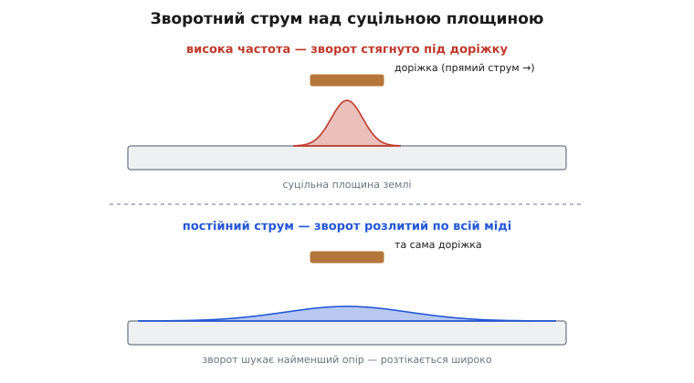
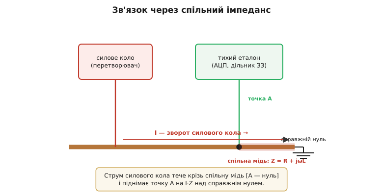
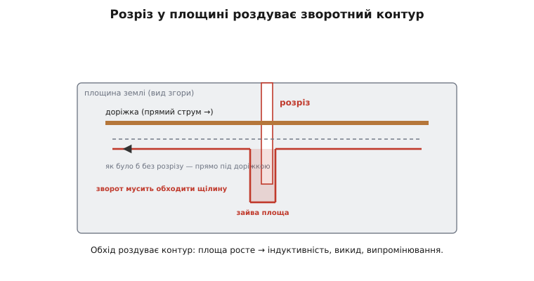
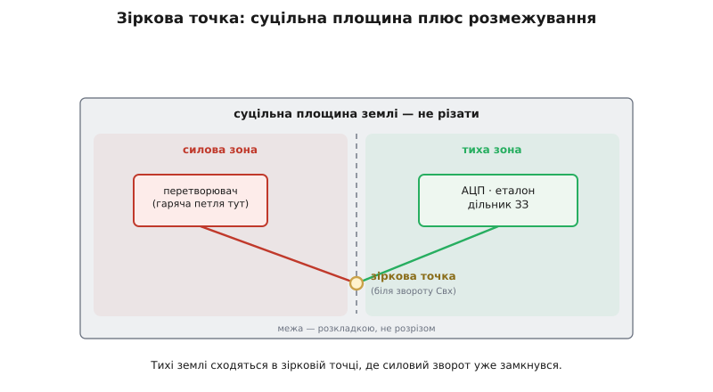

# Проєктування площини землі

<preknowlist>
- [Шар землі](book:electronics/ground-plane) — суцільна мідна заливка, що служить спільним зворотом, еталоном напруги й екраном.
- [Шлях зворотного струму](book:electronics/current-return-path) — струм завжди повертається до джерела й сам обирає собі дорогу.
- [Індуктивність](book:electronics/inductance) — площа контуру дає паразитну котушку, а різкий струм на ній — викид V = L·di/dt.
</preknowlist>

На принциповій схемі «земля» — один вузол із написом 0 В: скільки не чіпляй до нього проводів, усюди рівно нуль. На платі такого вузла немає. Земля — це шматок міді зі своїм опором і своєю індуктивністю, і крізь нього тече **кожен** зворотний струм плати: від силового ключа, від логіки, від давача. А струм на міді, як велить закон Ома, лишає падіння напруги. Тому дві точки «землі», між якими протік чийсь струм, — уже **не** одна напруга. Проєктування землі — це мистецтво вирішувати, **де саме** потечуть зворотні струми, щоб їхні падіння не отруїли ті тихі точки, які інші вузли вважають своїм нулем.

У силовій електроніці ця задача загострена до краю. Перетворювач жене крізь землю зворотні струми на **ампери**, та ще й **різані** — з величезним di/dt. Поряд на тій самій платі сидить контролер, який по мілівольтах звіряє вихідну напругу з еталоном. Якщо гучний силовий зворот протече бодай через клаптик міді, спільний із цим еталоном, контролер «побачить» хибний нуль — і перетворювач задзвенить, попливе або зірветься в нестійкість. Уся наука про площину землі — про те, як цього не сталося.

### Земля — не нуль, а мідь зі струмом

Почнімо з простого досліду думки. Візьмімо відтинок доріжки-землі завдовжки сантиметр і пустимо крізь нього 4 А. Мідна доріжка має опір — нехай кілька мілліomів; помножмо на струм — дістанемо кілька мілівольт падіння між її кінцями. Здавалося б, дрібниця. Але для 12-бітного АЦП із опорними 3 В один молодший розряд — це менш ніж мілівольт. Кілька мілівольт «блукаючого нуля» — і два молодші біти виміру брешуть. Тихий бік плати платить за неохайність гучного.

А тепер найважливіше: у перетворювачі струм не просто тече — він **рветься**. Ключ обриває його за наносекунди, і на будь-якій індуктивності зворотного шляху це дає викид напруги V = L·di/dt — той самий механізм, що робить [гарячу петлю](book:electronics/converter-layout) небезпечною. Тільки тепер петля — це не силове коло, а **земля під тихим вузлом**. Кілька наногенрі спільної індуктивності, помножені на di/dt у сотні мільйонів ампер за секунду, дають уже не мілівольти, а вольти стрибка «нуля».

> 🔧 **Навіщо це.** Найглибша хиба початківця — вважати землю безкоштовною й однаковою всюди, малювати її на схемі одним символом і не думати про неї на платі. Насправді земля — найзавантаженіший провідник пристрою: крізь неї повертається **все**. Погана земля не має власного симптома — вона проступає як чужі біди: шум у вимірі, дзвін, зрив контуру, провал тесту на сумісність. Тому земляну мідь проєктують так само уважно, як силові кола, а не «розливають рештками».

### Зворотний струм сам обирає шлях

Ключ до всього — зрозуміти, як зворотний струм [обирає собі дорогу](book:electronics/current-return-path). Він не тече «куди попало» і не розмазується рівномірно — він шукає шлях **найменшого спротиву**, і на різних частотах спротив означає різне.

На постійному струмі й низьких частотах головне — **опір**. Зворотний струм по площині розтікається якнайширше, всім доступним перерізом міді, бо широкий розлив має менший опір. А от на високій частоті головним стає вже не опір, а **індуктивність** — тобто площа контуру, який окреслюють прямий і зворотний струми разом. Найменша площа виходить тоді, коли зворотний струм біжить **точно під** своєю доріжкою: тоді прямий шлях зверху й зворотний знизу майже накладаються, контур стискається до щілини між шаром доріжки й шаром землі, і його індуктивність — найменша можлива. Тому вище кількох кілогерц зворотний струм сам, без жодного припросу, **тулиться під доріжку** — там, де контур найтісніший.


*Той самий шлейф над суцільною площиною. Угорі — висока частота: зворот стягується вузькою смугою точно під доріжку, площа контуру мала, індуктивність мала. Унизу — постійний струм: зворот розтікається всією міддю, бо там найменший опір. Суцільна площина сама дає кожному струмові найтихіший зворот — нічого не треба вигадувати.*

Це відкриття — подарунок проєктувальнику. Суцільна площина землі під усіма доріжками дає кожному струмові — і швидкому, і повільному — саме той зворот, якого він потребує, **автоматично**. Швидкий стягнеться під свою доріжку в найтісніший контур, повільний розіллється по всій міді. Не треба ні прокладати спеціальних зворотних доріжок, ні вгадувати, куди піде струм: фізика сама зведе контур до мінімуму, аби лишень мідь була суцільна. (На дуже високих частотах додається [скін-ефект](book:electronics/skin-effect): струм ще й тисне до поверхні площини, зверненої до доріжки, роблячи зворот ще тіснішим.) Чому саме він і як порахувати смугу, у якій зворот тримається під доріжкою, розкладено окремо — [чому зворот тулиться під доріжку](book:electronics/ground-plane-design/math-return-current.md).

### Спільний імпеданс — головний лиходій

Тепер назвімо ворога на ім'я. Уся біда починається, коли **два різні кола женуть свій зворотний струм крізь один і той самий шматок міді**. Гучне силове коло проганяє через цей спільний відтинок свій струм I, той робить на його імпедансі падіння I·Z — а тихе коло, під'єднане до того самого шматка, приймає це падіння за зсув **власного** нуля. Явище зветься **зв'язком через спільний імпеданс** (англ. *common-impedance coupling*): біда не в тому, що земля має опір, а в тому, що дві схеми **ділять** один відтинок цієї міді. Це той самий корінь, з якого ростуть і [земляні петлі](book:electronics/ground-loop), і [стрибок землі](book:electronics/ground-bounce) у логіці.


*Силове коло (ліворуч) і тихий еталон (праворуч) під'єднані до спільного відтинка землі з опором R та індуктивністю L. Різаний струм I силового кола робить на цьому відтинку падіння V = I·Z; тихий бік бачить його як «поїхавший» нуль. Лікування двобічне: зменшити Z спільної міді (суцільна площина замість доріжки) — і взагалі не ділити її (розвести зворотні струми).*

Порахуймо, наскільки це серйозно, і водночас побачимо, що дає суцільна площина.

**Умова.** Різаний струм перетворювача I = 4 А обривається за фронт tᵣ = 8 нс. Тихий еталон під'єднано до того самого відтинка землі завдовжки ~10 мм. Скільки шуму він упіймає, якщо цей відтинок — тонка спільна доріжка (L ≈ 8 нГн) і якщо це ділянка суцільної площини, де зворот тулиться під доріжку (L ≈ 0.8 нГн)?

```c
// di/dt на фронті обриву: весь струм спадає за час фронту
//   di/dt = I / t_r = 4 А / 8e-9 с = 5.0e8 А/с  (0.5 А/нс)
const double I   = 4.0;        // А
const double t_r = 8e-9;       // с
double didt = I / t_r;         // = 5.0e8 А/с

// Той самий відтинок ~10 мм, але різна геометрія звороту:
double L_trace = 8.0e-9;       // тонка СПІЛЬНА доріжка  ~8 нГн
double L_plane = 0.8e-9;       // зворот під доріжкою по СУЦІЛЬНІЙ площині ~0.8 нГн

double V_trace = L_trace * didt;   // = 4.0 В  стрибок «нуля»
double V_plane = L_plane * didt;   // = 0.4 В
```

```text
спільна доріжка:  V = 8.0 нГн × 5·10⁸ А/с = 4.0 В
суцільна площина: V = 0.8 нГн × 5·10⁸ А/с = 0.4 В
```

Чотири вольти стрибка нуля на спільній тонкій доріжці — це катастрофа: для АЦП, що ловить мілівольти, тихий бік просто осліп. Суцільна площина стискає контур і збиває цифру вдесятеро — до 0.4 В. Але **0.4 В — це теж не нуль**. Звідси другий висновок, важливіший за перший: мало зробити спільну мідь малоімпедансною — треба взагалі **не пускати** силовий зворот крізь ту мідь, до якої дослухається тихий еталон. Площина знижує ціну спільного шляху; правильна топологія **прибирає сам спільний шлях**.

### Розріз у площині вбиває її

З того, що зворот тулиться під доріжку, випливає найпідступніша пастка проєктування землі. Уявіть, що ви розрізали площину — прорізали в міді щілину. Причини бувають наче поважні: звільнити місце під рознім, «відокремити» аналогову частину від цифрової, обвести виріз. Але швидкому зворотному струмові, що біг точнісінько під доріжкою, ви щойно перегородили дорогу. Прямо він уже не пройде — доведеться **обходити** щілину з краю.


*Доріжка йде прямо, а зворотний струм у площині впирається в розріз і мусить обходити його з краю. Тісний контур, що тримався під доріжкою, роздувається на всю довжину обходу — а з площею росте індуктивність, викид напруги й випромінювання. Один необдуманий проріз перетворює тиху площину на антену.*

І ось тісний контур, який фізика дбайливо тримала під доріжкою, роздувається на всю довжину обходу. Площа контуру підскакує — а разом із площею росте й паразитна індуктивність. Той самий різаний струм тепер дає більший викид V = L·di/dt; контур перетворюється на рамкову антену, що світить завадами в ефір і наводить їх на сусідні доріжки. Розріз, зроблений «щоб було чистіше», дає рівно протилежне — і саме перетин доріжкою розрізу в землі є класичною причиною провалу тестів на [електромагнітну сумісність](book:electronics/electromagnetic-compatibility). Звідси **головне правило площини землі: її не ріжуть**. Суцільна мідь — то суцільний зворот; кожна щілина під швидкою доріжкою — це роздута петля.

### Стратегія: суцільна площина плюс розмежування

Якщо площину не можна різати, як тоді тримати гучне подалі від тихого? Відповідь — **не розрізом, а географією**. Плату ділять на зони не прорізаючи мідь, а **розкладаючи** деталі: силовий вузол — в одному кутку, аналогові еталони й давачі — в іншому, цифра — у третьому. Кожен вузол розводять **над своєю ділянкою** суцільної площини, і його зворотний струм тулиться під його ж доріжки, не забредаючи в чужу зону. Мідь лишається суцільною — а струми розведено самим розташуванням.

Довкола розмежування землі точилася довга суперечка, і сьогодні вона по суті вирішена. Десятиліттями панувала порада «розділяй площини»: окрема аналогова земля, окрема цифрова, щоб цифровий шум не ліз в аналог. Практика показала протилежне — розрізана площина частіше **створює** проблеми з сумісністю, ніж лікує, бо кожен розріз змушує зворотний струм роздувати контур. Сучасний консенсус (його твердо обстоює Генрі Отт, а виробники перетворювачів АЦП закріпили в довідниках) — **одна суцільна площина плюс розмежування розкладкою**; розділяти її варто лише в окремих випадках, як-от справжній бар'єр гальванічної розв'язки. Як народилася й перевернулася ця порада — [історія розділеної землі](book:electronics/ground-plane-design/hist-split-ground.md).

### Зіркова точка для силового звороту

Лишається звести докупи дві на позір суперечні поради: «одна суцільна площина» — і «не пускай силовий зворот крізь тиху мідь». Як не ділити площину й водночас не ділити спільний струм? Відповідь у тому, **де** гучний і тихий зворот сходяться.


*Одна суцільна площина, поділена на зони не розрізом, а розташуванням. Силовий зворот (гаряча петля) замикається у своїй зоні й ніде не заходить у тиху. Тихий еталон і земля дільника зворотного зв'язку сходяться з силовою землею в **одній зірковій точці** — біля звороту вхідного конденсатора, де силовий струм уже замкнувся. Так гучний зворот не тече крізь тиху мідь, а площина лишається суцільною.*

Ідея така. Гарячу петлю перетворювача замикають щільно, у її власній зоні: різаний струм пробігає від вхідного конденсатора крізь ключі й **вертається просто в цей самий конденсатор**, ніде не забредаючи в тиху частину плати. А тиху землю — землю опорного джерела, дільника [зворотного зв'язку](book:electronics/feedback-stability), давачів — зводять із силовою в **одній-єдиній точці**, там, де силовий струм уже замкнувся сам на себе: біля звороту вхідного конденсатора. Ця спільна точка зветься **зірковою** (англ. *star point*): усі тихі землі сходяться в ній, мов промені зірки, і жодна не лежить на дорозі силового звороту. Так суцільна площина лишається суцільною для швидких зворотів, а тихий еталон під'єднано туди, де гучний струм його вже не займає.

Той самий принцип працює і для того, як контролер **зчитує** вихідну напругу. Тиху доріжку відбору ведуть окремо й беруть напругу просто з виводів вихідного конденсатора — [чотиридротовим (кельвіновим) прийомом](book:electronics/kelvin-connection), яким струм не тече, тож на ньому й немає падіння. Земля цього відбору сходиться в тій самій зірковій точці. Дрібна тиха доріжка — а вирішує, чи побачить контролер справжній вихід, чи присмачений силовими падіннями.

### Площина працює не лише на землю

Варто пам'ятати, що суцільна мідна площина під платою заробляє одразу на кількох роботах, і всі вони чому суцільна мідь така цінна. По-перше, вона — **спільний зворот** з мінімальним імпедансом, про що вся ця стаття. По-друге, вона — **еталон напруги**: рівна, тиха мідь дає кожному вузлу однаковий нуль, від якого він відлічує свій сигнал. По-третє, вона — **екран**: суцільний мідний шар між гучним верхнім боком і рештою плати перехоплює поля. По-четверте, разом із сусідньою шиною живлення площина утворює [хребет цілісності живлення](book:electronics/power-integrity) — плаский конденсатор із дуже малою індуктивністю, що годує [розв'язувальні конденсатори](book:electronics/decoupling) швидкими імпульсами струму. І, по-п'яте, суцільна мідь — це ще й **тепловідвід**: під гарячі деталі кладуть мідні полігони й «зашивають» їх [перехідними отворами](book:electronics/via-inductance) на площину землі, розмазуючи тепло по більшій площі (ті ж таки [теплові via](book:electronics/thermal-vias)). Розрізаючи площину, ви псуєте не одну роль, а всі п'ять одразу — тому й ставлення до неї таке дбайливе.

Коли площин землі кілька (на різних шарах багатошарової плати), їх щедро «зшивають» перехідними отворами — часто рядком via вздовж швидких доріжок і по краях плати. Так рознесені шматки міді стають одним низькоімпедансним зворотом, а зворотний струм має куди перескочити з шару на шар, не роздуваючи контур. Кожен via сам має індуктивність, тож їх ставлять не поодинці, а густо там, де струм міняє шар.

### Як упізнати погану землю

Погану землю, як і погане розведення, видно ще до лабораторії — за симптомами. **Шум, синхронний із перемиканням**, у тихому вимірі (АЦП, еталон, давач) — майже певна ознака, що силовий зворот тече крізь спільну мідь. **Дзвін і викиди, яких не пояснює сама гаряча петля**, — часто наслідок роздутого зворотного контуру через розріз у площині. **Провал тесту на випромінювання** на частотах, кратних частоті перемикання, — знову шукайте перерізану площину чи доріжку, що перетинає щілину. **Плавуча або хибна вихідна напруга** — земля дільника зворотного зв'язку взята не з тихої зіркової точки. Усі ці біди лікуються не заміною деталей, а **переробкою землі**: зробити площину суцільною, розвести зони розкладкою, звести тихі землі в одну зіркову точку. І саме тому землю варто спроєктувати правильно з першого разу — переробляти її найдорожче.

### Підсумок

«Земля» на схемі — нуль, а на платі — мідь зі своїм імпедансом, крізь яку тече кожен зворотний струм і лишає на ній падіння. Проєктування землі — це керування тим, **де** течуть ці струми. Ключ — у тому, що зворот сам обирає шлях: на високій частоті він тулиться **під доріжку**, у найтісніший контур, тож **суцільна площина** дає кожному струмові найтихіший зворот сама собою. Головний ворог — **зв'язок через спільний імпеданс**: коли гучне й тихе кола ділять один шматок міді, струм першого робить на ньому падіння I·Z, а другий приймає його за зсув нуля. Звідси дві заповіді. Перша: **площину не ріжуть** — кожна щілина під швидкою доріжкою роздуває зворотний контур, а з ним індуктивність, викид і випромінювання; зони розмежовують **розкладкою**, а не розрізом (сучасний консенсус — одна суцільна площина плюс розмежування). Друга: гучний і тихий зворот зводять в **одній зірковій точці** біля звороту вхідного конденсатора, щоб силовий струм не тік крізь тиху мідь, а тиху вихідну напругу відбирають **кельвіновою** доріжкою. Ця сама суцільна мідь заодно служить еталоном, екраном, хребтом цілісності живлення й тепловідводом — тож дбати про неї варто з першого ескізу плати.
