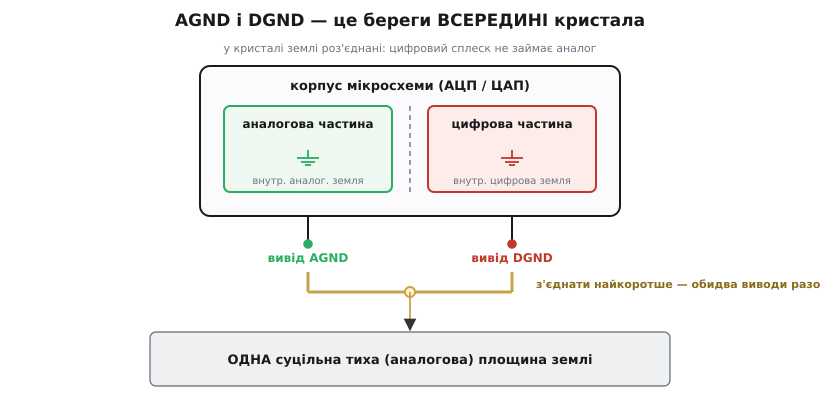

# 📜 Історія розділеної землі

Уявіть інженера кінця 1980-х із новеньким монолітним АЦП у руках. У довіднику на мікросхему — два виводи землі, підписані **AGND** і **DGND**, і чорним по білому порада: розділи мідну площину плати на аналогову половину й цифрову, а з'єднай їх лише в одній точці — під самим перетворювачем. Він робить точно так. Плата не проходить тест на випромінювання. Він перевіряє все ще раз, знаходить ту саму пораду в довіднику на сусідню мікросхему, у методичці з семінару, у статті поважного застосувального інженера — і робить ще ретельніше. Результат не кращає.

Ця порада панувала десятиліттями, її друкували в кожному другому даташиті, і десятиліттями вона тихо псувала плати. Історія розділеної землі — це історія про те, як **напис на ніжці мікросхеми перетворився на міф**, і як цей міф зрештою перевернули, повернувшись до звичайної фізики зворотного струму.

## Два береги в одному кристалі

Щоб зрозуміти пастку, почнімо не з плати, а з кристала. У 1980-х з'явилися перші **монолітні** перетворювачі — АЦП і ЦАП, де аналогова й цифрова частини сидять на одному шматочку кремнію. А це сусідство напружене до краю. З одного боку кристала — аналогові острівці: компаратори, вибірка-зберігання, опорне джерело, які розрізняють мікровольти. За кілька десятків мікрометрів від них — цифрова логіка: регістри, лічильники, вихідні буфери, які за наносекунди кидають цілий логічний перепад і смикають десятки міліампер струму.

Якби обидві частини ділили одну внутрішню земляну металізацію, цифрові сплески струму розгойдували б цю землю — і аналоговий еталон їхав би на цьому брудному нулі. Порахуймо, наскільки це серйозно, бо саме цей розрахунок — корінь усієї подальшої історії.

**Умова.** Дротик-перемичка (bond wire) від кристала до ніжки має індуктивність порядку 2 нГн. Цифрова частина за фронт tᵣ ≈ 4 нс кидає струм ΔI ≈ 20 мА. Скільки напруги впаде на цій перемичці — і скільки це коштує для 16-бітного перетворювача з опорними 4 В?

```c
// стрибок цифрового струму на перемичці кристал→ніжка
const double L_bond = 2e-9;      // нГн, типова перемичка
const double dI      = 20e-3;    // А, сплеск цифрового струму
const double t_r     = 4e-9;     // с, фронт

double didt = dI / t_r;          // = 5.0e6 А/с
double V_bond = L_bond * didt;   // = 1.0e-2 В = 10 мВ стрибка «землі»

// ціна для 16-бітного АЦП з опорними 4 В:
double LSB = 4.0 / 65536.0;      // = 6.1e-5 В ≈ 61 мкВ — один молодший розряд
double lost = V_bond / LSB;      // ≈ 164 LSB
```

```text
падіння на перемичці:  V = 2 нГн × 5·10⁶ А/с = 10 мВ
один молодший розряд:  LSB = 4 В / 65536 ≈ 61 мкВ
10 мВ / 61 мкВ ≈ 164 LSB  →  близько восьми бітів виміру — сміття
```

Десять мілівольт стрибка, якби вони потрапили на аналоговий еталон, з'їли б вісім із шістнадцяти бітів. Ось чому конструктор кристала **не** з'єднує дві землі всередині корпусу: перемичка, що несе цифровий струм, впустила б цей стрибок просто в аналогову частину. Замість цього він тримає в кристалі дві окремі земляні мережі — одну під аналогові острівці, другу під цифрову логіку — і виводить їх **двома окремими ніжками**: AGND і DGND.

І тут — ключ до всієї плутанини. **Ці назви описують кристал, а не систему.** Ніжка з написом DGND веде до цифрової землі *цієї мікросхеми*. Вона нічого не каже про те, до якої землі *вашої плати* її чіпляти. Напис — це підпис берега всередині кремнію, а не інструкція для розкладки.


*AGND і DGND — це два береги землі всередині кристала, розділені там, щоб цифровий сплеск не займав аналог. Назви кажуть, до чого ніжка веде в мікросхемі, а не куди її саджати в системі. Правильний хід — з'єднати обидві ніжки найкоротшою перемичкою й посадити на одну тиху (аналогову) площину.*

## Напис, що збивав з пантелику

Інженер читає «DGND» — і мозок сам доказує речення: це цифрова земля, отже, її треба на цифрову землю. Даташит цю думку підказував, семінар підтверджував. І він веде ніжку DGND на найгучнішу мідь плати — на цифрову площину, де стрибає вся логіка. Тепер тиха внутрішня цифрова земля перетворювача прив'язана до найбруднішого нуля на платі, і цей бруд крізь кристал, крізь паразитні ємності між частинами, наводиться просто на мікровольтовий аналог за сусідніми мікрометрами.

Напис обіцяв допомогти *розділити* — а насправді запросив шум увійти парадними дверима. Уся суть, яку згодом сформулювали інженери Analog Devices, вкладається в одну фразу: напис DGND каже, що ніжка веде до цифрової землі *мікросхеми*, — і зовсім не означає, що її треба вести до цифрової землі *системи*. Ця одна хибна доказка речення, помножена на ціле покоління даташитів, і є та сама «загадка AGND та DGND», навколо якої обертається вся історія.

## Євангеліє розділеної землі

Звідки ж узялася сама порада різати площину? Її коріння глибше за перші АЦП — воно сягає традиції **одноточкового (зіркового) заземлення** з аналогової й звукової техніки 1960–70-х. Логіка там була бездоганна: щоб гуд і шум не переповзали з вузла у вузол, кожній підсистемі дають власний земляний провід, що тягнеться додому до єдиної зіркової точки, — і жодні двоє не ділять один зворот. На низькій частоті, де імпеданс — це просто опір, ця логіка працює чудово: не ділиш мідь — не ділиш падіння.

Даташити на перетворювачі 1980-х успадкували цю думку й намалювали її для змішаного сигналу так: розділи площину плати на аналогову й цифрову, з'єднай AGND і DGND разом на перетворювачі, а самі площини зведи в одну точку — теж на перетворювачі. Мікросхема ставала системною зірковою точкою. Для однієї плати, з одним перетворювачем, на повільному тактуванні це справді трималося купи. Тому порада закам'яніла в догму — її передруковували з даташита в даташит, викладали на семінарах, повторювали в нотатках застосування два десятиліття поспіль.

## Де тріщина пішла врозріз

Догму зламали дві сили. Перша — **такти пришвидшилися**. Коли цифрові фронти вилізли в десятки й сотні мегагерц, зворотному струмові стало байдуже до опору — він почав дбати про площу контуру й [тулитися точно під свою доріжку](topic:electronics/current-return-path), бо там прямий і зворотний струми майже накладаються й контур найтісніший. А тепер проведіть швидку доріжку через щілину між розділеними площинами. Зворотному струмові, якому заборонено бігти прямо під доріжкою, доводиться **обходити** щілину з краю — величезною петлею, що світить у ефір і роздуває індуктивність, а з нею й викид V = L·di/dt. Розріз, зроблений «щоб чистіше», перетворювався на щілинну антену.

Друга сила — **системи виросли**. Кілька перетворювачів, кілька плат, об'єднавча панель: одну зіркову точку вже не влаштуєш, коли аналогова й цифрова площини сходяться на десятку рознімів по всьому кросі. Єдиний стик стає багатьма, замикаються земляні петлі, і чистенька зірка розсипається. А для перетворювачів є ще й окрема біда: будь-яка різниця напруги між двома площинами лягає просто на тактовий сигнал — а тремтіння такту ([апертурний джитер](topic:electronics/aperture-jitter): непевність моменту вибірки, від якої «пливе» відношення сигнал/шум) убиває роздільність виміру. Порада, що обіцяла чисті виміри, у швидких змішаних системах сама виробляла той джитер і ті провали на сумісності, від яких мала боронити.

## Генрі Отт розвертає консенсус

Гучніше за всіх проти різання виступив **Генрі Отт** (англ. *Henry W. Ott*) — американський інженер з електромагнітної сумісності, тридцять років у AT&T Bell Labs (де мав звання Distinguished Member of Technical Staff), а потім власна консалтингова практика в Лівінгстоні, штат Нью-Джерсі. Його книга «Noise Reduction Techniques in Electronic Systems» (перше видання — 1976, друге, класичне — 1988) була біблією EMC для цілого покоління; згодом він переписав її наново як «Electromagnetic Compatibility Engineering» (Wiley, 2009).

У червні 2001-го Отт виніс справу на обкладинку журналу *Printed Circuit Design* статтею «Partitioning and Layout of a Mixed Signal PCB». Його теза була різка: майже завжди краще мати **«a single reference plane for a system»** — одну-єдину опорну площину на всю систему. Доказ — чиста фізика звороту: високочастотний цифровий зворот і так тулиться під свою доріжку й **не має жодного бажання** блукати в аналогову область і псувати її. Отже, різати площину, щоб завадити переселенню, якому фізика вже завадила, — не просто марно, а шкідливо: тепер кожна доріжка, змушена перетнути щілину, платить роздутою петлею.

Ліки, за Оттом, — не ніж, а **географія**. Лишаєш ОДНУ суцільну площину, а зони розводиш **розкладкою й дисципліною траси**: цифрові деталі та їхні доріжки — у цифровій зоні, аналогові — в аналоговій, і жодна доріжка не забрідає з зони в зону. Площина лишається цілою, а струми розділено тим, **де** що лежить, а не розрізом у міді.

## Analog Devices закриває справу

Останнє слово мали ті, хто ту небезпечну пораду й друкував, — виробники перетворювачів. І вони прилюдно розвернулися у власних довідниках. Серія колонок «Ask the Applications Engineer» в *Analog Dialogue* (започаткована 1988-го) поверталася до заземлення не раз — зокрема випуск №12 «Grounding (Again)», — а канонічним підсумком став навчальний листок **MT-031** з промовистою назвою «Grounding Data Converters and Solving the Mystery of "AGND" and "DGND"» («Заземлення перетворювачів і розв'язання загадки AGND та DGND»).

Автори — троє застосувальних інженерів Analog Devices: **Волт Кестер** (англ. *Walt Kester*), корпоративний застосувальний інженер і редактор семінарських книг фірми (американець); **Джеймс Браянт** (англ. *James Bryant*), європейський менеджер із застосувань ADI з 1982-го до виходу на пенсію 2009-го (британець); і **Майк Берн** (англ. *Mike Byrne*), застосувальний інженер ADI в ірландському Лімерику. Редакція A датована жовтнем 2008-го.

Їхня розв'язка загадки на позір суперечить здоровому глузду, а насправді очевидна: з'єднати AGND і DGND **найкоротшою** перемичкою й посадити **обидві** ніжки — навіть ту, що з написом «цифрова», — на **аналогову** (тиху) площину. Парадоксально це лише для того, хто повірив напису; щойно знаєш, що напис іменує берег у кристалі, парадокс зникає. Цифровий струм, який мікросхема впорскує у свою ніжку DGND, малий і місцевий — хай повертається крізь тиху площину коротким шляхом, а вся плата тримається на одному еталоні. Той самий листок додає й винятки, до яких ми зараз перейдемо.

## Коли розріз усе-таки правильний

Сучасний консенсус каже «не ріж», а не «ніколи не ріж». Законна причина розітнути площину одна — **справжній бар'єр гальванічної розв'язки**. Там, де [гальванічна розв'язка](topic:electronics/galvanic-isolation) — навмисне розділення двох кіл, між якими не має текти спільний струм, заради безпеки або щоб розірвати земляну петлю між далекими вузлами, — свідомо роз'єднує два домени, які **не мусять** ділити постійний зворот, розрив у міді і є та ізоляція. Жодна сигнальна доріжка не перетинає його зі своїм зворотом у міді: сигнал перестрибує бар'єр не доріжкою, а крізь сам ізолятор — [цифровий ізолятор](topic:electronics/digital-isolator), що передає логічний сигнал через ємнісний, магнітний чи оптичний місток без спільної землі, чи оптрон. Тут щілина не помилка, а призначення.

М'якший інструмент — **[феритова бусина](topic:electronics/ferrite-bead)**: мала індуктивність, майже прозора на постійному струмі й дуже опірна на високій частоті, справжній глушник для швидких перешкод. Бусина на ніжці цифрового *живлення* перетворювача замикає його комутаційний сплеск у крихітну місцеву петлю, не випускаючи на площину. А бусина чи перемичка **між** двома площинами дає їм постійний зв'язок, але високий імпеданс вище кількох мегагерц — так обмежують постійну різницю напруги між доменами; щоправда, MT-031 попереджає, що для найроздільніших систем і цього забагато. Правило, у яке історія зрештою вклалася, коротке: **тримай площину цілою й розділяй розкладкою; ріж лише там, де цього вимагає справжній бар'єр, і тоді ріж свідомо, точно знаючи, який зворот розриваєш.**

## Що показала ця історія

У всієї плутанини був один корінь: **напис, що описував нутро мікросхеми, прочитали як наказ для плати**. Десятиліттями галузь довіряла підпису на ніжці більше, ніж фізиці, — і розрізані площини тихо робили плати гучнішими саме там, де обіцяли тишу. Виправлення — статті й книги Генрі Отта, публічний розворот Analog Devices у MT-031 — не відкрило нової фізики. Воно лише наполягло: слухай **зворотний струм**, а не легенду на ніжці.

Статус цієї історії подвійний. Сучасний висновок — одна суцільна площина плюс розмежування розкладкою, обидві землі перетворювача на тиху мідь — це **усталений консенсус**, який поділяють і незалежні авторитети з EMC, і самі виробники перетворювачів. Але він був **щиро спірним** не одне десятиліття, і стара порада різати площину досі трапляється в застарілих даташитах і звичках — тому «загадку AGND та DGND» доводиться розв'язувати наново на кожному новому робочому столі.
