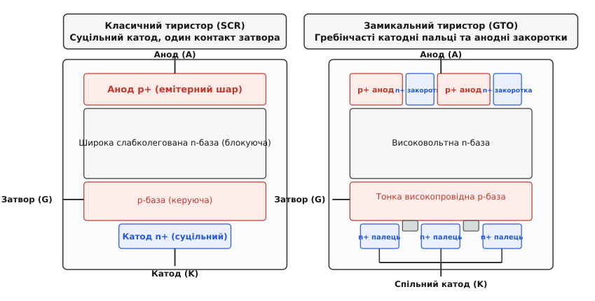
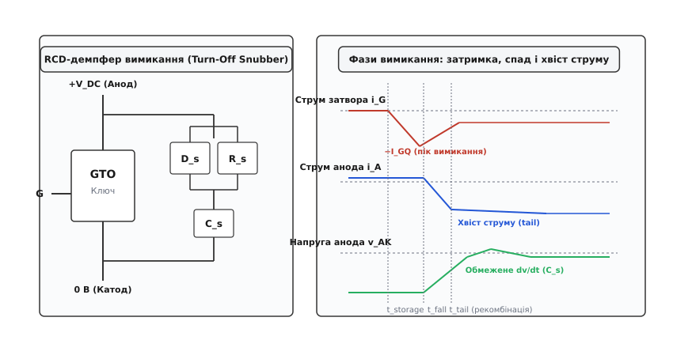
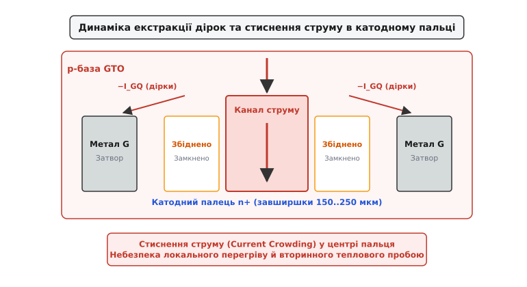
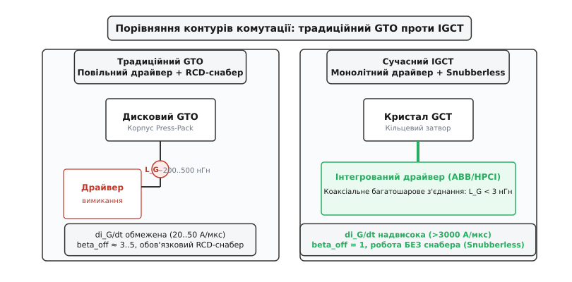

# GTO: тиристор із керованим вимиканням

<preknowlist>
- [Тиристор (SCR)](topic:electronics/thyristor-scr) — чотиришарова p-n-p-n структура, петля додатного зворотного зв'язку, защіпка та природна комутація.
- [Робота BJT-транзистора](topic:electronics/bjt-operation) — інжекція носіїв заряду, коефіцієнт передачі струму бази і насичення переходів.
- [Снабери та обмеження dv/dt](topic:electronics/snubbers-dvdt) — захисні RCD-демпфери для обмеження швидкості наростання напруги при комутації.
- [Безпечна робоча область (SOA)](topic:electronics/soa-power-devices) — межі напруг, струмів і механізм вторинного теплового пробою.
- [Втрати перемикання](topic:electronics/switching-losses) — динамічне виділення тепла на фронтах струму й напруги силового ключа.
</preknowlist>

У тяговому приводі магістрального електровоза чи інверторі прокатного стана силова шина тримає постійну напругу 3000 В, а через двигун протікає струм понад 1500 А. Для комутації такої потужності класичний [тиристор (SCR)](topic:electronics/thyristor-scr) здається ідеальним: цільний кремнієвий диск діаметром 100 мм проводить гігантський струм із мінімальним спадом напруги всього 1.5–2 В завдяки двосторонній модуляції провідності слабколегованої бази. Але в колі постійного струму криється фундаментальна пастка: тиристор є защіпкою. Короткий імпульс на затворі відмикає прилад, після чого внутрішній позитивний зворотний зв'язок підтримує провідність самостійно. Оскільки струм живлення не проходить через нуль природно, як у мережі змінного струму, вимкнути відкритий тиристор звичайним сигналом затвора неможливо.

Десятиліттями інженерам доводилося застосовувати громіздкі схеми [примусової комутації](topic:electronics/forced-commutation). Щоб загасити тиристор, поруч монтували допоміжний комутуючий контур із LC-дроселів, масивних високовольтних конденсаторів і додаткових тиристорів. Цей контур на кілька десятків мікросекунд спрямовував зустрічний струм у головний вентиль, штучно обнуляючи сумарний струм нижче рівня утримання, поки збіднений шар відновлював блокувальні властивості. Комутаційні шафи важили сотні кілограмів, гули на низьких частотах, займали значну частину моторного вагона й генерували додаткові втрати енергії. Прагнення позбутися важкого комутаційного баласту й керувати вимиканням безпосередньо через затвор привело до створення **GTO** (*Gate Turn-Off Thyristor* — замикального тиристора, або тиристора з керованим вимиканням).

## Двотранзисторна модель і фізичний критерій вимикання

Щоб зрозуміти, чому звичайний тиристор чинить опір вимиканню через затвор і які зміни знадобилися для GTO, звернемося до класичної двотранзисторної моделі чотиришарової структури `p1-n1-p2-n2`. Структуру умовно розділяють на два взаємозв'язані біполярні транзистори: верхній `p1-n1-p2` (PNP) та нижній `n1-p2-n2` (NPN). Анод під'єднано до емітера PNP, катод — до емітера NPN, а вивід керуючого електрода (затвора) контактує з базою NPN-транзистора (шар `p2`).

Колекторний струм кожного транзистора впадає безпосередньо в базу свого сусіда:

```
I_c_pnp = alpha_pnp · I_A + I_cbo1       [струм колектора PNP-транзистора]
I_c_npn = alpha_npn · I_K + I_cbo2       [струм колектора NPN-транзистора]
```

Тут `I_A` — струм анода, `I_K` — струм катода, `alpha_pnp` та `alpha_npn` — статичні коефіцієнти передачі струму емітера відповідних транзисторів, а `I_cbo` — власні струми витоку закритих переходів. Оскільки струм бази NPN складається з колекторного струму PNP та зовнішнього струму затвора `I_G`, баланс струмів на центральному колекторному переході `J2` набуває вигляду:

```
I_A = I_c_pnp + I_c_npn                  [баланс струмів центрального переходу J2]
= alpha_pnp · I_A + alpha_npn · I_K + I_leak [підстановка виразів колекторних струмів]
= alpha_pnp · I_A + alpha_npn · (I_A + I_G) + I_leak [зв'язок струмів катода й анода: I_K = I_A + I_G]
```

Звідси отримуємо фундаментальне рівняння анодного струму:

```
I_A = (alpha_npn · I_G + I_leak) / (1 - (alpha_pnp + alpha_npn))
```

У закритому стані коефіцієнти передачі малі, знаменник додатний і близький до одиниці, а через прилад тече мізерний струм витоку. Позитивний імпульс струму в затвор (`I_G > 0`) збільшує струм через переходи. Зі зростанням струму коефіцієнти передачі `alpha` зростають. Щойно сума коефіцієнтів досягає критичної межі:

```
alpha_pnp + alpha_npn ≥ 1
```

знаменник прямує до нуля, позитивний зворотний зв'язок стає самопідтримуваним, і обидва транзистори лавиноподібно переходять у глибоке [насичення](topic:electronics/bjt-regions). Усі три p-n переходи виявляються під прямою напругою, а внутрішні шари затоплює електронно-діркова плазма.

Щоб вимкнути структуру, необхідно **примусово розірвати позитивний зворотний зв'язок**, виконавши зворотну умову:

```
alpha_pnp + alpha_npn < 1
```

Для цього через вивід затвора подають потужний **від'ємний струм** `I_GQ` (струм витікає з `p2`-бази). Цей від'ємний струм повинен перехопити дірковий струм, який інжектується колектором PNP-транзистора в базу NPN. Якщо від'ємний струм затвора відкачує більше дірок, ніж їх постачає верхній PNP-транзистор, сумарний струм бази NPN стає від'ємним. Емітерний перехід NPN (`J3`) виходить із насичення і зворотно зміщується. Інжекція електронів із катода припиняється, NPN-транзистор закривається, розриваючи петлю підживлення бази PNP, і анодний струм спадає.

```
+─────────────────────────────────────────────────────────────+
│                       Анод (A, p+)                          │
+─────────────────────────────────────────────────────────────+
│                p1-шар (Емітер верхнього PNP)                │
├─────────────────────────────────────────────────────────────┤
│         n1-шар (База PNP / Колектор NPN, n-база)            │
│         Перехід J2 (Центральний колекторний перехід)        │
├──────────────────────────────┬──────────────────────────────┤
│  p2-шар (База NPN)           │  Затвор (G, екстракція -I_G) │
├──────────────────────────────┴──────────────────────────────┤
│  n2-шар (Емітер NPN, перехід J3)                            │
+─────────────────────────────────────────────────────────────+
│                       Катод (K, n+)                         │
+─────────────────────────────────────────────────────────────+
```

## Коефіцієнт підсилення вимикання

На відміну від увімкнення, де для запуску лавини вистачає короткого імпульсу амплітудою в кілька ампер, процес вимикання вимагає нейтралізації величезного накопиченого заряду плазми. Здатність затвора вимикати анодний струм кількісно характеризується **коефіцієнтом підсилення вимикання** (*turn-off gain*, позначається як `beta_off` або `G_off`):

```
beta_off = I_A / I_GQ_max
```

де `I_A` — комутований прямий струм анода перед вимиканням, а `I_GQ_max` — пікове значення від'ємного струму затвора, необхідне для гарантованого розриву защіпки.

Зв'яжемо `beta_off` із внутрішніми фізичними коефіцієнтами передачі. У граничний момент зриву провідності струм, що втікає в базу NPN від колектора PNP, повинен повністю компенсуватися витікаючим струмом затвора `I_GQ`:

```
I_c_pnp ≤ I_GQ
alpha_pnp · I_A ≤ I_GQ
```

Оскільки струм анода пов'язаний зі струмом катода співвідношенням `I_K = I_A - I_GQ`, а умова підтримки активного режиму NPN вимагає `I_c_npn = alpha_npn · I_K = alpha_npn · (I_A - I_GQ)`, підставимо це у вираз загального струму:

```
I_A = alpha_pnp · I_A + alpha_npn · (I_A - I_GQ) [баланс струмів при екстракції носіїв]
= I_A · (alpha_pnp + alpha_npn) - alpha_npn · I_GQ [розкриття дужок у виразі]
```

Звідси після групування членів випливає точна теоретична формула коефіцієнта підсилення вимикання:

```
beta_off = alpha_npn / (alpha_pnp + alpha_npn - 1)
```

Ця формула розкриває жорстокий інженерний компроміс. Щоб GTO мав мінімальний спад напруги у відкритому стані `V_T` (низькі статичні втрати), сума `alpha_pnp + alpha_npn` повинна бути помітно більшою за 1, забезпечуючи високу концентрацію носіїв. Але що сильніша защіпка, то менший знаменник у формулі `beta_off` і то меншим стає коефіцієнт підсилення вимикання.

Для промислових високовольтних GTO типове значення `beta_off` становить лише **3...5**. Це означає, що для вимикання струму навантаження 2000 А блок керування повинен втягнути в затвор негативний імпульс струму амплітудою **400–600 А**! Керування GTO вже не є слабкострумовою логікою — це повноцінна силова підсистема, здатна генерувати імпульси струму в сотні ампер із крутизною наростання `di_G/dt` від 20 до 100 А/мкс.

> 🔧 **Навіщо це.** Низький `beta_off` вимагає специфічного підходу до проектування драйверів. Якщо драйвер польового транзистора чи IGBT розраховують на перезаряджання ємності затвора мікрокулонами заряду, то драйвер GTO є імпульсним інвертором струму зі своєю батареєю низькоімпедансних конденсаторів, потужними MOSFET-ключами паралельного з'єднання та жорсткими вимогами до мінімізації паразитної індуктивності з'єднувальних шин.

Детальний аналіз схемотехніки силових драйверів, топології низькоіндуктивних вивідних контурів і формування багатоступеневого керуючого сигналу розкрито в окремому практичному проекті [⚙️ Драйвер вимикання GTO: керування сотнями ампер у затворі](topic:electronics/gto-thyristor/proj-gto-gate-driver.md).

## Сегментована катодна топологія

Чому класичний тиристор взагалі неможливо вимкнути негативним струмом затвора, навіть якщо подати сотні ампер? Відповідь криється в геометрії кристала й поперечному (бічному) опорі керуючої бази.

У стандартному SCR катод являє собою суцільний масивний диск або кільце великої площі. Вивід затвора розташований збоку або в центрі. Тонкий шар `p2`-бази (завтовшки всього кілька десятків мікрометрів) має значний власний питомий опір `R_p_sheet`. Коли через вивід затвора починає витікати від'ємний струм, цей струм рухається горизонтально вздовж тонкого шару бази. Спадання напруги `V = I · R` вздовж радіуса призводить до того, що найбільший від'ємний потенціал створюється лише на крайці емітерного переходу, прилеглій до металізації затвора.


*Зліва — класичний SCR із суцільним катодом і бічним затвором. Справа — GTO з тисячами вузьких емітерних пальців n+, оточених металізацією затвора, та чергуванням p+ емітера й n+ закороток на аноді.*

Крайова ділянка катода зворотно зміщується й припиняє емісію електронів. Але за кілька міліметрів углиб кристала потенціал бази залишається додатним через спад напруги на омічному опорі бази. Струм усього приладу просто втягується вглиб під катод, де густина носіїв зростає, а защіпка продовжує живити саму себе. Вимкнути центральну частину суцільного кристала неможливо: напруга зворотного пробою емітерного переходу `J3` становить усього 15–25 В, і подальше збільшення напруги керування призводить до лавинного пробою краю переходу біля затвора без впливу на центр.

Конструктивний прорив у GTO полягав у переході від суцільного емітера до **дрібносегментованої гребінчастої (interdigitated) структури**.

1. **Катодні пальці (Cathode Fingers):** емітерний шар `n2` розбивають методом фотолітографії та селективного травлення на тисячі окремих паралельних смужок (пальців) або острівців. Ширина кожного пальця становить лише `W_e = 100...250 мкм`, а довжина — від кількох міліметрів до десятка міліметрів.
2. **Сітка затвора:** металізація затвора оточує кожен катодний палець з обох поздовжніх боків, заглиблюючись у протравлені канавки p-бази.
3. **Мінімізація відстані екстракції:** відстань від поздовжньої осі симетрії будь-якого емітерного пальця до найближчого контакту затвора не перевищує половини ширини смужки (`50...120 мкм`).

Завдяки мікроскопічній ширині пальця омічний спад напруги вздовж бази під пальцем стає мізерним. Від'ємний потенціал затвора безперешкодно й рівномірно проникає під усю площу емітерних переходів, дозволяючи відкачати носії заряду синхронно по всій площі кремнієвої пластини діаметром до 100–150 мм, де розташовано від 3000 до 8000 паралельних пальців.

## Динаміка вимикання і стиснення струму

Процес керованого вимикання GTO є високодинамічним перехідним процесом, під час якого кристал зазнає колосальних електричних і теплових перевантажень. Його поділяють на три послідовні часові інтервали: час затримки (storage time), час спаду струму (fall time) та інтервал хвоста струму (tail time).


*Схема RCD-снабера (ліворуч) та часові діаграми струмів і напруги (праворуч): піковий від'ємний імпульс затвора, спад анодного струму, фаза затяжного хвоста носіїв та обмеження наростання напруги dv/dt конденсатором.*

### 1. Фаза затримки вимикання (Storage Time, t_s)

Після подачі від'ємної напруги драйвера струм затвора `i_G` починає наростати у від'ємний бік зі швидкістю `di_GQ/dt = V_GR / L_G`, де `V_GR` — напруга від'ємного джерела (зазвичай 15–20 В), а `L_G` — сумарна паразитна індуктивність контуру керування.

Протягом часу `t_s` (типово 2–8 мкс) анодний струм і спад напруги на GTO практично не змінюються: прилад залишається відкритим, оскільки в n-базі та p-базі все ще зберігається надлишковий заряд плазми. Від'ємний струм затвора видаляє дірки з p-бази через бічні контакти.

У цій фазі виникає вкрай небезпечний ефект — **стиснення струму (Current Crowding)**. Краї катодного пальця, прилеглі до металу затвора, знеструмлюються й зворотно зміщуються першими. Провідна зона пальця починає звужуватися з обох боків у напрямку до поздовжнього центру. Оскільки зовнішній анодний струм визначається індуктивністю навантаження й не може миттєво зменшитися, весь струм пальця витісняється у вузький центральний шнур завширшки всього 10–30 мкм.


*Екстракція дірок від'ємним струмом затвора зворотно зміщує краї емітерного переходу, витісняючи весь струм у вузький центральний шнур (гарячу пляму) з ризиком вторинного теплового пробою.*

Густина струму в цьому центральному шнурі зростає в десятки разів, досягаючи локальних значень понад `10^4 А/см²`. Виникають локальні «гарячі плями» (hot spots). Якщо технологічний розкид параметрів між тисячами пальців кристала призведе до того, що кілька пальців затримаються з вимиканням хоча б на 0.2–0.5 мкс, через них пройде весь анодний струм багатомегаватного інвертора. Це викликає миттєвий шнуровий [вторинний пробій](topic:electronics/soa-power-devices) і локальне розплавлення кремнію.

### 2. Фаза спаду анодного струму (Fall Time, t_f)

Коли в центрі пальців емітерний перехід остаточно втрачає пряме зміщення, інжекція електронів із катода обривається. Анодний струм стрімко падає від початкового значення `I_A` до рівня залишкового струму (зазвичай 20–30% від `I_A`). Тривалість спаду `t_f` становить усього 0.5–1.5 мкс.

На цьому етапі виникає екстремальна швидкість наростання анодної напруги `dv/dt`. Оскільки струм переривається дуже швидко, а в силовому контурі завжди присутня індуктивність, без спеціального захисту напруга на аноді миттєво підскочила б до тисяч вольт за частки мікросекунди.

### 3. Фаза хвоста струму (Tail Time, t_tail)

Хоча катодний перехід уже повністю закритий і блокує струм, у товстій центральній n-базі все ще перебуває величезний залишковий заряд дірок, які були впорснуті анодним p-емітером під час провідності. Оскільки катод заблоковано, цим діркам нікуди діватися — вони повільно дрейфують до центрального колекторного переходу `J2` під дією відновленого високовольтного електричного поля та рекомбінують.

Цей залишковий струм називають **хвостом струму** (*tail current*). Він протікає протягом `t_tail = 5...20 мкс` при **повній напрузі живлення** на приладі (`V_AK ≈ V_DC`). Добуток значного струму на кіловольтну напругу під час хвоста формує до 60–80% усіх динамічних втрат вимикання `E_off`. Прилад виділяє потужний імпульс тепла, який обмежує граничну робочу частоту GTO діапазоном у кількасот герц.

## Анодні закоротки

Щоб приборкати хвостовий струм і скоротити фазу розсмоктування заряду в n-базі, конструктори застосовують два принципові підходи: керування часом життя носіїв та модифікацію структури анода.

Традиційне легування кремнію важкими металами (золотом або платиною) чи радіаційне опромінення протонами/електронами створює в кристалі глибокі рекомбінаційні центри, які зменшують час життя дірок `tau_p`. Хвіст струму скорочується, але виникає побічний ефект: зростає прямий спад напруги `V_T` у відкритому стані та збільшуються високотемпературні струми витоку.

Найефективнішим структурним вирішенням проблеми хвоста стала технологія **анодних закороток (Anode Shorts)**:

```
+─────────────────────────────────────────────────────────────+
│             Металізація анода (суцільний контакт)           │
+───────────────┬───────────────┬───────────────┬─────────────+
│  p+ емітер    │  n+ закоротка │  p+ емітер    │ n+ закоротка│
├───────────────┴───────────────┴───────────────┴─────────────┤
│                                                             │
│              Високовольтна n-база (n- drift)                │
│                                                             │
├─────────────────────────────────────────────────────────────┤
│              p-база (керуюча основа GTO)                    │
+─────────────────────────────────────────────────────────────+
```

Замість суцільного шару `p+` на анодному боці пластини створюють чергування ділянок `p+` (анодний емітер) та високомобільних ділянок `n+`, які мають безпосередній омічний контакт із металізацією анода.

Механізм дії анодних закороток:
1. **Під час вимикання:** надлишкові електрони, накопичені в n-базі під час провідності, більше не замкнені в потенційній ямі. Вони стікають безпосередньо в металізацію анода через низькоомні `n+` закоротки, минаючи інжектуючий перехід `p+/n`.
2. **Зниження інжекції:** стікання електронів знижує пряму напругу на `p+` емітерних острівцях анода, швидко зупиняючи подальшу інжекцію дірок в n-базу.
3. **Скорочення хвоста:** час життя та амплітуда хвостового струму зменшуються в 3–5 разів порівняно з класичною чотиришаровою структурою.

**Плата за анодні закоротки — втрата зворотної блокувальної здатності.** У класичному тиристорі анодний перехід `p1-n1` (`J1`) здатний блокувати кіловольтну напругу зворотної полярності (коли на катоді плюс, а на аноді мінус). При наявності анодних закороток ділянки `n+` з'єднують n-базу з анодом напряму, фактично закорочуючи перехід `J1`. У результаті GTO стає **асиметричним**: він витримує високу напругу прямого напрямку (3.3–6.0 кВ), але його зворотна блокувальна напруга `V_RRM` падає до скромних 15–30 В (визначається пробоєм низьковольтного переходу `J3`).

В інверторах напруги це не є вадою, оскільки зустрічно-паралельно кожному силовому ключу обов'язково встановлюють швидкий зворотний діод (freewheeling diode), який обмежує зворотну напругу на рівні 1.5–2 В.

## Вмикання GTO та вхідний ді-по-дт дросель

Процес увімкнення GTO також має специфічні обмеження, пов'язані з кінцевою швидкістю розповсюдження плазми. Позитивний імпульс затвора відмикає катодні пальці спочатку лише на вузькій ділянці безпосередньо біля краю металізації затвора. Потім зона провідності поширюється вглиб пальця з кінцевою швидкістю розповсюдження плазми `v_plasma ≈ 0.05...0.1 мм/мкс` (близько 50–100 м/с).

Якщо зовнішнє коло дозволить анодному струму наростати швидше, ніж плазма заповнить увесь об'єм пальця, гігантський струм навантаження пройде через мікроскопічну площу початкового включення. Густина струму досягне критичних значень, викликаючи локальний тепловий перегрів і так званий **di/dt-пробій при увімкненні**.

Для захисту GTO від неприпустимої швидкості наростання струму послідовно з приладом обов'язково включають **дросель обмеження di/dt (turn-on snubber inductor)** або насичуваний реактор (saturable reactor) з індуктивністю `L_on ≈ 3...10 мкГн`. Цей дросель затримує наростання анодного струму на перші 2–5 мкс, поки сигнал затвора встигне надійно відкрити всю площу емітерних сегментів кристала.

## Демпферні кола вимикання (RCD Turn-Off Snubbers)

GTO принципово не здатний працювати без зовнішнього [демпферного кола (снабера)](topic:electronics/snubbers-dvdt). Це фундаментальне обмеження випливає з фізики стиснення струму та ємності центрального переходу `J2`.

Якщо спробувати вимкнути GTO на чисто індуктивне навантаження без демпфера, виникають дві фатальні проблеми:

1. **Ємнісне самовмикання (паразитний dV/dt ефект):** при швидкому зростанні анодної напруги через бар'єрну ємність центрального переходу `C_j2` протікає струм зміщення:
   ```
   i_disp = C_j2 · (dv/dt)
   ```
   Цей струм зміщення тече безпосередньо в базу `p2` NPN-транзистора точно так само, як позитивний вмикаючий струм затвора. Якщо швидкість наростання `dv/dt` перевищує критичну величину (для GTO без демпфера це лише 20–50 В/мкс), струм зміщення повторно відмикає NPN-транзистор, прилад знову защіпається й виходить з-під контролю.
2. **Динамічний тепловий пробій:** під час спаду струму (`t_f`) у центрі катодних пальців усе ще існує стиснутий шнур плазми. Якщо на цей високопровідний гарячий шнур накладеться висока напруга шини, миттєва локальна потужність розсіювання перевищить критичну межу кристала, спричиняючи випаровування металізації та термічний пробій.

Щоб захистити GTO, паралельно виводам анод-катод монтують **RCD-демпфер вимикання (turn-off snubber)**.

Демпфер складається з трьох елементів:
- **Швидкий діод демпфера (`D_s`):** вмикається в прямому напрямку в момент початку спаду струму GTO.
- **Демпферний конденсатор низької індуктивності (`C_s`):** перехоплює анодний струм навантаження на час вимикання GTO, обмежуючи швидкість зростання напруги `dv/dt`.
- **Розрядний резистор (`R_s`):** повільно скидає накопичену енергію з конденсатора `C_s` у проміжках між перемиканнями, коли GTO знову відмикається.

```
                   +V_DC (Шина живлення)
                     │
                     ├──────────────┬──────────────────┐
                     │              │                  │
                     │             ┌┴┐                ┌┴┐
                     │             │ │ R_s            ▲ │ D_s
                     │             └┬┘                │─┤ (Швидкий
                     │              │                  │   діод)
                 ┌───┴───┐          └────────┬─────────┘
                 │       │                   │
                 │  GTO  │                 ──┴── C_s (Демпферний
             G ──┤ Ключ  │                 ──┬──      конденсатор)
                 │       │                   │
                 └───┬───┘                   │
                     ├───────────────────────┴──────────┘
                     │
                    ─┴─ 0 В (Земля / Навантаження)
```

Робота схеми відбувається у два такти:
1. **При вимиканні GTO:** струм навантаження відхиляється через відкритий діод `D_s` у розряджений конденсатор `C_s`. Напруга на аноді GTO зростає плавно, строго за законом заряду конденсатора постійним струмом `I_A`:
   ```
   dv/dt = I_A / C_s
   ```
   Конденсатор тримає напругу на рівні кількох сотень вольт доти, доки центральний перехід GTO повністю не відновить збіднений шар і шнур струму не розсмокчеться.
2. **При наступному вмиканні GTO:** конденсатор `C_s`, заряджений до повної напруги шини `V_DC`, розряджається через відкритий GTO і резистор `R_s`. Резистор обмежує піковий струм розряду `I_dis = V_DC / R_s`, захищаючи GTO від перевантаження за `di/dt` при вмиканні.

Енергія, накопичена в демпферному конденсаторі під час кожного вимикання:

```
E_snub = 0.5 · C_s · V_DC²
```

Ця енергія повністю перетворюється на тепло в резисторі `R_s` під час кожного такту вмикання. Відповідно, середня потужність теплових втрат у демпфері прямо пропорційна робочій частоті комутації `f_sw`:

```
P_snub = 0.5 · C_s · V_DC² · f_sw
```

Ця формула визначає фундаментальне обмеження класичної GTO-технології: що більший комутований струм, то більша потрібна ємність `C_s` для стримування `dv/dt`, і тим більші кіловати тепла безплідно спалюються в демпферних резисторах на високих частотах.

## Конструкція Press-Pack і тепловий менеджмент

Величезна потужність комутації та висока концентрація струму вимагають унікального конструктивного виконання силового приладу. На відміну від низьковольтних транзисторів, які розварюють тонкими алюмінієвими дротиками в пластмасових корпусах, потужні GTO виготовляють виключно в герметичних керамо-металевих таблеткових корпусах типу **Press-Pack (Hockey Puck)**.

Кремнієва пластина монокристала діаметром від 50 до 150 мм вільно лежить між двома масивними мідними електродами анода й катода без застосування пайки по всій площі. Щоб компенсувати різницю коефіцієнтів теплового розширення між кремнієм (`CTE ≈ 3 · 10⁻⁶ К⁻¹`) та міддю (`CTE ≈ 17 · 10⁻⁶ К⁻¹`), між ними прокладають тонкі диски з молібдену або вольфраму (`CTE ≈ 5 · 10⁻⁶ К⁻¹`).

Зовнішня затискна система інвертора стискає цей багатошаровий пакет за допомогою каліброваних тарілчастих пружин Бельвіля із зусиллям від 10 до 45 кН (еквівалент ваги 1–4.5 тонн).

Переваги конструкції Press-Pack:
1. **Двостороннє охолодження (Double-Sided Cooling):** тепло відводиться одночасно від анодного та катодного боків кристала безпосередньо в рідинні охолоджувачі, забезпечуючи тепловий опір перехід-корпус `R_th_jc < 0.015 К/Вт`.
2. **Відсутність втоми паяних швів:** відсутність припою гарантує стійкість до десятків тисяч циклів глибокого теплового нагрівання й охолодження при розгоні й гальмуванні поїздів.
3. **Передбачуваний режим відмови:** при пробої монокристал спікається в суцільний короткозамкнений провідний місток. У послідовних високовольтних вентилях пробитий прилад продовжує надійно проводити струм кола без вибуху корпусу, дозволяючи системі продовжувати роботу на залишку справних приладів.

## Розрахунковий приклад

Розглянемо параметри силового модуля тягового перетворювача електропоїзда на базі дискового асиметричного GTO-тиристора.

**Вихідні дані інвертора:**
- Напруга ланки постійного струму: `V_DC = 2800 В`
- Максимальний вимиканий струм навантаження: `I_A = 1600 А`
- Коефіцієнт підсилення вимикання: `beta_off = 4`
- Допустима швидкість наростання напруги вимикання: `(dv/dt)_max = 800 В/мкс = 800 · 10⁶ В/с`
- Робоча частота комутації інвертора: `f_sw = 400 Гц`
- Індуктивність контуру затвора: `L_G = 150 нГн = 150 · 10⁻⁹ Гн`
- Напруга від'ємного зміщення драйвера затвора: `V_GR = 18 В`

### 1. Розрахунок параметрів імпульсу вимикання затвора

Піковий від'ємний струм затвора:

```
I_GQ_max = I_A / beta_off                [визначення коефіцієнта підсилення вимикання]
= 1600 / 4                               [підстановка значень I_A = 1600 А та beta_off = 4]
= 400 А                                  [піковий струм екстракції затвора]
```

Початкова швидкість наростання струму керування:

```
di_G/dt = V_GR / L_G                     [закон самоіндукції в контурі керування]
= 18 / (150 · 10⁻⁹)                      [підстановка V_GR = 18 В та L_G = 150 нГн]
= 120 · 10⁶ А/с                          [обчислення швидкості наростання струму]
= 120 А/мкс                              [переведення в ампери за мікросекунду]
```

Оцінка часу затримки вимикання до досягнення пікового струму екстракції носіїв:

```
t_s ≈ I_GQ_max / (di_G/dt)               [оцінка часу досягнення пікового струму]
= 400 / 120                              [ділення амплітуди на швидкість наростання]
≈ 3.33 мкс                               [тривалість фази затримки розсмоктування]
```

### 2. Розрахунок демпферного конденсатора RCD-снабера

Мінімальна ємність демпферного конденсатора для обмеження `(dv/dt)_max`:

```
C_s = I_A / (dv/dt)_max                  [закон заряду конденсатора постійним струмом]
= 1600 / (800 · 10⁶)                     [підстановка I_A = 1600 А та (dv/dt)_max = 800 В/мкс]
= 2.0 · 10⁻⁶ Ф                           [розрахункова ємність у фарадах]
= 2.0 мкФ                                [значення ємності демпферного конденсатора]
```

### 3. Розрахунок теплових втрат у демпферному колі

Енергія, запасена в конденсаторі за один такт вимикання:

```
E_snub = 0.5 · C_s · V_DC²               [енергія електричного поля зарядженого конденсатора]
= 0.5 · (2.0 · 10⁻⁶) · 2800²             [підстановка C_s = 2.0 мкФ та V_DC = 2800 В]
= 0.5 · (2.0 · 10⁻⁶) · 7.84 · 10⁶        [піднесення напруги до квадрата]
= 7.84 Дж                                [енергія, що розсіюється за одне вимикання]
```

Потужність, що розсіюється в демпферному резисторі `R_s` на частоті 400 Гц:

```
P_snub = E_snub · f_sw                   [середня теплова потужність втрат у резисторі]
= 7.84 · 400                             [множення енергії на частоту комутації 400 Гц]
= 3136 Вт                                [потужність розсіювання RCD-снабера одного ключа]
```

**Висновок розрахунку:** лише в демпферному колі **одного** GTO-ключа розсіюється понад 3.1 кВт тепла. У трифазному мостовому інверторі з шістьма ключами сумарні втрати тільки в демпферних резисторах перевищують `6 × 3.136 кВт ≈ 18.8 кВт`. Ці кіловати вимагають масивних рідинних охолоджувачів і суттєво знижують загальний коефіцієнт корисної дії тягового приводу.

## Еволюція: народження IGCT та високовольтних IGBT

Необхідність важкого демпфера та гігантських струмів керування з низьким `beta_off` тривалий час вважалася неминучою платою за фізику защіпки. Проте наприкінці 1990-х років інженери компанії ABB дослідили граничний режим екстракції носіїв і створили революційний прилад — **IGCT** (*Integrated Gate-Commutated Thyristor* — інтегрований тиристор із комутованим затвором).

Ідея IGCT базується на концепції **жорсткої комутації затвора (Hard Gate Drive)**:


*Традиційний GTO з кабельною індуктивністю контуру затвора й обов'язковим снабером (ліворуч) проти IGCT з монолітним коаксіальним фланцем наднизької індуктивності для жорсткої комутації без снабера (праворуч).*

1. **Коаксіальна інтеграція:** кристал тиристора виготовляють із круговою багатошаровою металізацією затвора, а драйвер монтують безпосередньо на корпус у вигляді кільцевої друкованої плати. Індуктивність контуру керування зменшено з типових 150–300 нГн до рекордних `L_G < 3 нГн`.
2. **Комутація з одиничним коефіцієнтом підсилення (`beta_off = 1`):** завдяки мізерній індуктивності швидкість наростання струму затвора сягає фантастичних `di_G/dt > 3000...5000 А/мкс`. Затвор відкачує весь катодний струм (`I_GQ = I_A`) швидше, ніж за 1 мкс — **до того**, як напруга на аноді встигне зрости.
3. **Ліквідація стиснення струму:** оскільки весь струм катода миттєво перехоплюється затвором, емітерний перехід катода замикається рівномірно по всій площі. Ефект стиснення струму в шнури (Current Crowding) повністю ліквідується.
4. **Snubberless-режим:** чотиришарова структура `p-n-p-n` перетворюється на звичайний `p-n-p` транзистор із розімкненою базою ще до наростання напруги. IGCT вимикається надійно й однорідно без демпферного конденсатора (`C_s = 0`).

Паралельно з появою IGCT стрімко розвивалася технологія **високовольтних [IGBT](topic:electronics/igbt)** (модулів на напруги 3.3 кВ, 4.5 кВ та 6.5 кВ). IGBT запропонував розробникам керування напругою через ізольований затвор практично з нульовою статичною потужністю керування, усунувши потребу в кіловатних драйверах струму.

Історичну еволюцію технологій силового перемикання — від перших патентів General Electric 1960-х років через золоту добу GTO в японських швидкісних поїздах Shinkansen до народження IGCT та домінування IGBT — описано у вставці [📜 Від кремнієвої защіпки до мегаватного інвертора: історія GTO](topic:electronics/gto-thyristor/hist-gto-evolution.md).

Порівняльний аналіз технічних характеристик, меж застосування, динамічних втрат та надійності чотирьох ключових напівпровідникових архітектур високої потужності наведено у вставці [🔌 Силові гіганти мегаватного класу: SCR, GTO, IGCT та HV-IGBT](topic:electronics/gto-thyristor/comp-gto-igct-igbt.md).

Сьогодні класичний GTO виконав свою історичну місію першопрохідця керованого мегаватного перемикання. У нових розробках промислових приводів середньої напруги (2.3–6.6 кВ) та вітроенергетичних конвертерах панують IGCT та високовольтні IGBT, тоді як кремній-карбідні прилади (SiC MOSFET) поступово піднімають робочі частоти на небачені раніше висоти. Проте саме на GTO інженерна наука відпрацювала фундаментальні принципи мікросегментації емітерів, керування плазмою носіїв і приборкання комутаційних перенапруг.
