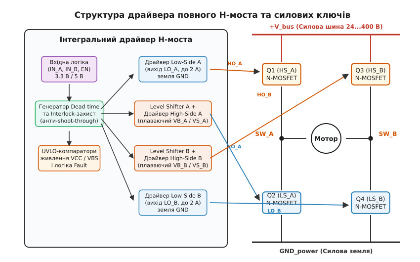
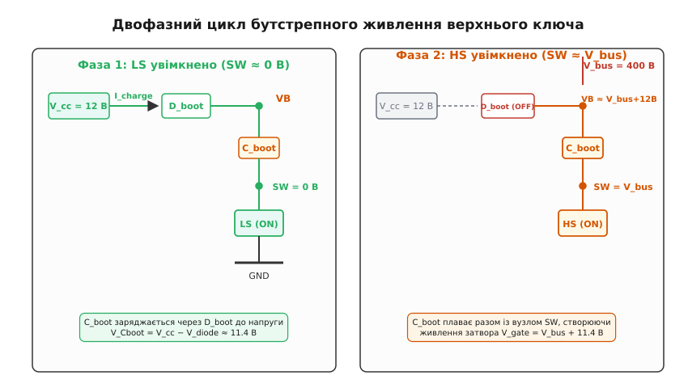
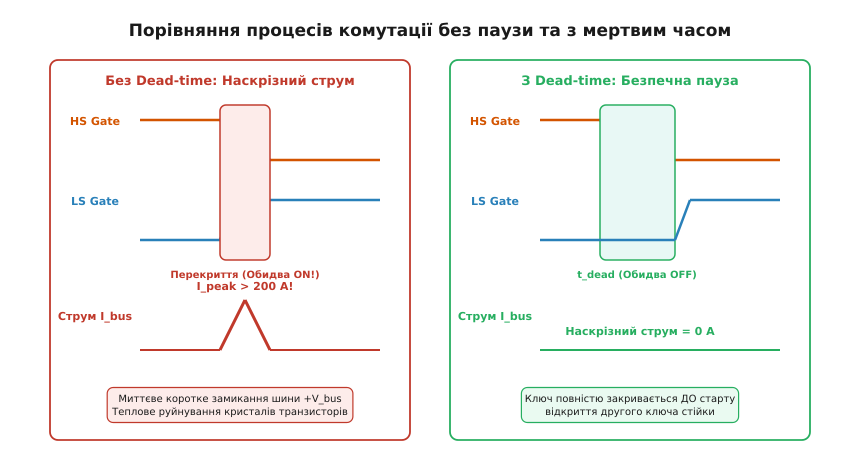
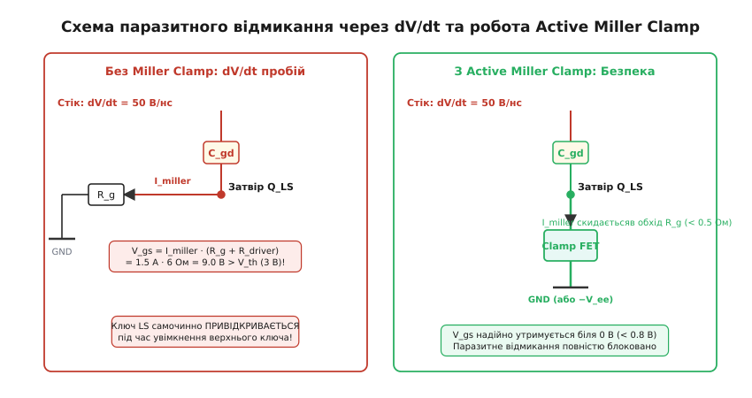

# Драйвер H-моста (клас пристрою)

<preknowlist>
- [H-міст](topic:electronics/h-bridge) — топологія чотирьох ключів для реверсивного керування струмом у навантаженні.
- [Gate driver](topic:electronics/gate-driver) — підсилювач струму для швидкого перезаряду ємності затвора силового транзистора.
- [Верхній ключ](topic:electronics/high-side-switch) — плаваючий потенціал витоку N-MOSFET над землею і потреба у напрузі, вищій за шину живлення.
- [Dead-time у напівмості](topic:electronics/dead-time) — захисна часова пауза між закриттям одного ключа стійки та відкриттям іншого.
- [Захист по десатурації](topic:electronics/desaturation-detection) — виявлення короткого замикання за виходом транзистора з режиму насичення.
- [Блокування за низькою напругою (UVLO)](topic:electronics/uvlo) — вимикання силового каскаду при просіданні живлення для захисту від лінійного режиму.
- [Зсув рівня у плаваючий домен](topic:electronics/high-side-level-shift) — передача логічного сигналу керування на високовольтний плаваючий потенціал.
- [Керування полем](topic:electronics/field-control) — фундаментальний принцип роботи польового транзистора за рахунок створення каналу напругою затвора.
</preknowlist>

Якщо спробувати підключити цифрові виходи мікроконтролера напряму до затворів чотирьох польових транзисторів силового моста з напругою живлення 48 В або 400 В, схема миттєво вийде з ладу з фізичним руйнуванням напівпровідникових кристалів. Причина полягає у фундаментальній невідповідності між слабкострумовою низьковольтною логікою та законами комутації силових кіл. Логічний вихід мікроконтролера з напругою 3.3 В і максимальним струмом 20 мА не здатний перезарядити затворну ємність потужного транзистора швидше ніж за кілька мікросекунд, через що транзистор зависає в лінійній зоні та згорає від надлишкового тепла. Більше того, витоки двох верхніх транзисторів моста не з'єднані з землею: під час роботи їхній потенціал безперервно стрибає від 0 В до повної напруги шини живлення, тому для утримання верхнього N-канального ключа відкритим напруга на його затворі повинна перевищувати напругу силової шини на 10–15 В. Достатньо найменшої помилки у взаємному таймінгу перемикання бодай на 30 наносекунд — і верхній та нижній ключі однієї стійки відкриються одночасно, створивши пряме коротке замикання силової шини на землю з кілоамперними струмами наскрізного пробою.

Драйвер H-моста (англ. *H-bridge driver*, від англ. *drive* — приводити в дію, керувати) — це спеціалізований клас інтегральних схем і модулів, призначений для узгодження низьковольтних керуючих сигналів контролера з потужними плаваючими затворами чотирьох транзисторів повного моста. Він поєднує в собі високовольтні зміщувачі рівня сигналу, схеми плаваючого живлення, апаратну логіку блокування одночасного ввімкнення ключів, автоматичне формування захисних пауз і комплекс активних захистів від аварійних режимів.


*Функціональна архітектура інтегрального драйвера повного H-моста: вхідна логіка блокування, генератор захисних пауз, високовольтні каскади зсуву рівня та потужні вихідні драйвери затворів для чотирьох N-канальних транзисторів.*

---

### Топологія H-моста та фізичні вимоги до керування ключами

Повний H-міст складається з чотирьох керованих силових ключів (Q1, Q2, Q3, Q4), з'єднаних у дві паралельні стійки між плюсовою силовою шиною `+V_bus` та силовою землею `GND_power`. Навантаження (обмотка колекторного двигуна постійного струму, фаза безколекторного мотора чи первинна обмотка трансформатора інвертора) увімкнене в діагональ між двома середніми точками стійок — комутаційними вузлами `SW_A` та `SW_B`.

Ключі діляться на дві функціональні групи:
1. **Верхні ключі (High-Side, HS):** Q1 у стійці A та Q3 у стійці B, стоки яких підключені до плюсової шини живлення `+V_bus`, а витоки з'єднані з вузлами `SW_A` та `SW_B`.
2. **Нижні ключі (Low-Side, LS):** Q2 у стійці A та Q4 у стійці B, стоки яких підключені до комутаційних вузлів `SW_A` та `SW_B`, а витоки сидить безпосередньо на спільній силовій землі.

```
+V_bus ───────────────┬───────────────────────────────┬───────────────
                      │                               │
                 [ Q1 (HS_A) ]                   [ Q3 (HS_B) ]
                      │                               │
                      ├─── вузол SW_A ──[Мотор]── вузол SW_B ──┤
                      │                               │
                 [ Q2 (LS_A) ]                   [ Q4 (LS_B) ]
                      │                               │
GND_power ────────────┴───────────────────────────────┴───────────────
```

У сучасній силовій електроніці всі чотири ключі реалізують на **однотипних N-канальних транзисторах** (N-MOSFET, IGBT або SiC-MOSFET). Використання P-канальних транзисторів для верхніх ключів, яке здавалося б зручним через спрощене керування відносно плюсової шини, на практиці обмежене низьковольтними схемами до 20–30 В. Причина має фундаментальне напівпровідникове походження: рухливість дірок у кремнії майже втричі менша за рухливість електронів (`μ_p ≈ 450 см²/(В·с)` проти `μ_n ≈ 1400 см²/(В·с)`). Щоб отримати однаковий опір відкритого каналу `R_ds(on)`, P-канальний транзистор повинен мати втричі більшу площу кремнієвого кристала. Це пропорційно збільшує вхідну ємність затвора, уповільнює перемикання, збільшує динамічні втрати та робить кристал значно дорожчим. Для напруг понад 60–100 В силових P-канальних MOSFET практично не виготовляють через фізичну кремнієву межу.

Оскільки всі чотири ключі є N-канальними, виникає принципова асиметрія в умовах їхнього керування:

- **Нижні ключі (Q2, Q4):** їхні витоки мають фіксований потенціал землі. Щоб відкрити нижній ключ, достатньо прикласти до його затвора напругу `V_gs = 10...15 В` відносно землі.
- **Верхні ключі (Q1, Q3):** їхні витоки підключені до вузлів `SW_A` та `SW_B`. Коли нижній ключ закривається, а верхній відкривається, потенціал вузла SW підстрибує від 0 В до напруги силової шини `V_bus` (яка може складати 48 В, 400 В або 800 В). Щоб транзистор залишався увімкненим, напруга на його затворі відносно **витоку** повинна підтримуватися на рівні `V_gs = 12...15 В`. Це означає, що абсолютний потенціал затвора верхнього ключа відносно загальної землі схеми повинен досягати:

```
V_gate(HS) = V_bus + V_drive
```

При напрузі шини `V_bus = 400 В` та напрузі відмикання `V_drive = 12 В` затвор верхнього ключа мусить перебувати під потенціалом **+412 В** відносно землі. Жодне стандартне джерело низьковольтного живлення в системі не має такого потенціалу. Головне завдання драйвера H-моста — створити плаваючий потенціал керування та транслювати логічні імпульси з домену землі у високовольтний плаваючий домен.

---

### Схемотехніка високовольтного зсуву рівня (Level Shifting)

Щоб передати цифровий сигнал увімкнення з мікроконтролера (де логічна одиниця становить 3.3 В відносно землі) на плаваючий каскад верхнього ключа (потенціал якого коливається між 0 В і 400 В), усередині монолітної мікросхеми драйвера інтегрують високовольтний зміщувач рівня (англ. *high-voltage level shifter*).

У класичних мікросхемах технології HVIC (High-Voltage Integrated Circuit) зміщувач рівня реалізують на спеціальних високовольтних польових транзисторах із поперечним дрейфовим регіоном (LDMOS — Lateral Double-diffused MOSFET), здатних витримувати напругу між стоком і витоком до 600–1200 В.

```
Низьковольтний домен (GND)          Високовольтний плаваючий домен (VS)
Логічний вхід HIN                    
      │                             Живлення VB (V_bus + 12 В) ──┐
      ├─► Генератор Set ──► [LDMOS 1] ──► Резистор R1 ──► Вхід S  │
      │                                                   [RS-тригер] ──► Вихід HO
      └─► Генератор Reset ─► [LDMOS 2] ──► Резистор R2 ──► Вхід R  │
                                    Плаваючий витік VS (0...V_bus) ┘
```

Якщо передавати сигнал у плаваючий домен постійним рівнем струму, високовольтний транзистор зсуву рівня залишався б відкритим протягом усього часу увімкненого стану верхнього ключа. При напрузі шини 400 В навіть мізерний струм зсуву `I_shift = 2 мА` спричинив би постійне розсіювання потужності на кристалі мікросхеми:

```
P_shift = V_bus · I_shift
= 400 В · 0.002 А       [підстановка напруги шини 400 В та струму 2 мА]
= 0.8 Вт                 [обчислення статичної потужності розсіювання]
```

Для мініатюрного корпусу SOIC-8 розсіювання майже одного вата лише на зміщувачі рівня призвело б до перегріву кристала понад 150 °C і теплового руйнування.

Тому в сучасних драйверах застосовують **імпульсний зсув рівня (Pulse Level Shifting)**. Вхідний логічний сигнал перетворюється парою диференційних формувачів на короткі наносекундні імпульси струму:
- Позитивний фронт вхідного сигналу (команда «Увімкнути») генерує вузький імпульс тривалістю 20–50 нс через перший високовольтний транзистор LDMOS 1. Цей імпульс перекидає плаваючий RS-тригер (RS-latch) у високовольтному каскаді в стан `1`.
- Негативний фронт (команда «Вимкнути») генерує такий самий короткий імпульс через другий транзистор LDMOS 2, який скидає RS-тригер у стан `0`.

Оскільки струм протікає лише під час перемикання протягом кількох десятків наносекунд, середня потужність розсіювання зміщувача рівня падає до одиниць міліватів навіть на частотах комутації в сотні кілогерців.

**Проблема від'ємних викидів напруги (Negative VS Transient).** Коли верхній ключ вимикається, індуктивний струм навантаження продовжує текти в тому самому напрямку і миттєво відчиняє вбудований body-діод нижнього транзистора. Через паразитну індуктивність виводів і друкованих провідників потенціал комутаційного вузла `SW` (вивід `VS` драйвера) провалюється **нижче потенціалу землі** на величину від −5 В до −15 В протягом кількох десятків наносекунд:

```
V_VS(peak) = −V_diode − L_stray · (di/dt)
```

Для внутрішньої кремнієвої структури HVIC такий від'ємний потенціал є смертельно небезпечним: p-n переходи між підкладкою чипа та плаваючими високовольтними кишенями зміщуються у прямому напрямку. Це викликає паразитний тиристорний ефект замикання підкладки (latch-up), спотворення стану RS-тригера або пробій низьковольтної логіки. Сучасні драйвери H-моста мають спеціальні вбудовані схеми захисту від від'ємної напруги (Negative Voltage Tolerance) та фільтри синфазних шумів dV/dt, що витримують короткочасне падіння напруги на виводі VS до −50 В без збою логічного стану.

---

### Плаваюче живлення: бутстрепна схема проти гальванічної ізоляції

Щоб живити вихідний каскад драйвера верхнього ключа, коли його витік перебуває під високим потенціалом, застосовують дві схемотехнічні концепції: бутстрепний конденсатор або гальванічно ізольовані джерела живлення.

**1. Бутстрепне живлення (Bootstrap Circuit).** Це найпростіший, компактний і дешевий спосіб отримання плаваючої напруги, що вимагає лише двох зовнішніх деталей на кожен напівміст: швидкого діода `D_boot` та керамічного конденсатора `C_boot`. Назва походить від англійської ідіоми *to pull oneself up by one's bootstraps* — підтягнути себе за власні шнурки.


*Два такти бутстрепного циклу: заряд конденсатора C_boot від низьковольтної шини V_cc через відкритий нижній ключ, та плавання накопиченого заряду над силовою шиною V_bus для живлення верхнього затвора.*

Робота бутстрепного кола складається з двох послідовних фаз:

- **Фаза заряду (Нижній ключ LS увімкнений):** потенціал вузла `SW` примусово стягнутий до 0 В (землі). Бутстрепний діод `D_boot` зміщується у прямому напрямку, і струм від низьковольтного джерела живлення драйвера `V_cc = 12 В` тече через діод у конденсатор `C_boot`, заряджаючи його до напруги:

```
V_Cboot = V_cc − V_diode
```

При падінні на діоді Шотткі `V_diode = 0.5 В` конденсатор заряджається до `11.5 В`.

- **Фаза утримання (Верхній ключ HS увімкнений):** нижній ключ закрито, верхній відкрито, і потенціал вузла `SW` злітає до `+V_bus` (наприклад, 400 В). Потенціал плюсового виводу конденсатора `VB` автоматично піднімається до:

```
V_VB = V_bus + V_Cboot
     = 400 В + 11.5 В = 411.5 В
```

Діод `D_boot` опиняється під зворотною напругою 400 В і надійно закривається, ізолюючи низьковольтне джерело `V_cc` від високої напруги. Увесь заряд, необхідний для утримання затвора верхнього ключа у відкритому стані та живлення плаваючої логіки драйвера, постачається виключно з енергії, накопиченої в `C_boot`.

**Розрахунок ємності бутстрепного конденсатора C_boot.** Ємність конденсатора повинна бути достатньою, щоб за час найдовшого увімкненого стану верхнього ключа `t_on(max)` напруга на ньому не просіла нижче порогу спрацьовування захисту UVLO.

Сумарний заряд `Q_total`, який витрачається за один період комутації, складається з чотирьох складових:

```
Q_total = Q_gate + Q_ls + (I_qbs + I_leak_diode + I_leak_cap) · t_on(max)
```

де:
- `Q_gate` — повний заряд затвора силового транзистора (типово 50–150 нКл);
- `Q_ls` — заряд, необхідний для роботи внутрішнього високовольтного зміщувача рівня (типово 2–5 нКл);
- `I_qbs` — власний струм спокою високовольтного плаваючого каскаду драйвера (типово 50–150 мкА);
- `I_leak_diode` — зворотний струм витоку бутстрепного діода при максимальній температурі (типово 10–50 мкА);
- `I_leak_cap` — струм саморозряду конденсатора.

Якщо максимально допустиме просідання плаваючої напруги `ΔV_bs` становить 0.5 В, мінімальна ємність бутстрепного конденсатора розраховується за формулою:

```
C_boot ≥ Q_total / ΔV_bs
```

**Числовий приклад розрахунку:**
Розглянемо мостовий перетворювач із частотою ШІМ 20 кГц (період `T = 50 мкс`), максимальною шпаруватістю 95 % (`t_on(max) = 47.5 мкс`), транзистором із зарядом затвора `Q_gate = 80 нКл`, плаваючим струмом спокою `I_qbs = 100 мкА`, струмом витоку діода `I_leak = 20 мкА` та `ΔV_bs = 0.4 В`:

```
Q_leak
= (I_qbs + I_leak) · t_on(max)              [множення струмів витоку на тривалість відкритого стану]
= (100·10⁻⁶ + 20·10⁻⁶) · 47.5·10⁻⁶          [підстановка значень струмів і тривалості імпульсу]
= 120·10⁻⁶ · 47.5·10⁻⁶                      [сумування струмів спокою та витоку діода]
≈ 5.7·10⁻⁹ Кл                               [обчислення втраченого заряду витоку: 5.7 нКл]

Q_total
= Q_gate + Q_ls + Q_leak                    [баланс необхідного сумарного заряду]
= 80 нКл + 3 нКл + 5.7 нКл                  [підстановка складових заряду]
= 88.7 нКл                                  [повний заряд на один комутаційний цикл]

C_boot(min)
= 88.7·10⁻⁹ Кл / 0.4 В                      [ділення сумарного заряду на допустиме просідання напруги ΔV_bs]
≈ 222 нФ                                    [мінімальна розрахункова ємність бутстрепного конденсатора]
```

З урахуванням температурної нестабільності діелектрика та зниження ефективної ємності керамічних конденсаторів під дією постійної напруги (DC Bias Effect) обирають номінал із запасом у 3–5 разів: **1.0 мкФ** (кераміка X7R з робочою напругою 25–50 В).

**Фундаментальне обмеження бутстрепу:** бутстрепне коло принципово **не здатне працювати при 100 % шпаруватості** (постійно відкритий верхній ключ). Якщо нижній ключ періодично не відкривається, конденсатор `C_boot` не має шляху для дозаряду. Через струми витоку напруга `VB − VS` за кілька мілісекунд впаде нижче порогу блокування, і верхній драйвер вимкнеться. Щоб обійти це обмеження в системах із постійним утриманням ключа, застосовують інтегровані мікропотужні помпи заряду (Trickle Charge Pump) або переходять на гальванічно ізольовані драйвери.

**2. Гальванічно ізольовані драйвери затворів.** У промислових електроприводах високої потужності, тягових інверторах електромобілів і сонячних станціях із напругою шини 600–1200 В застосовують повністю ізольовані драйвери. У них передача сигналів здійснюється крізь безсердечникові планарні мікротрансформатори або ємнісний бар'єр із діоксиду кремнію (SiO2), а вторинний каскад живиться від мініатюрного ізольованого DC-DC перетворювача. Детальне порівняння фізики оптичної, магнітної та ємнісної ізоляції наведено в компонентній вставці [ізольованих драйверів затворів](topic:electronics/h-bridge-driver/comp-isolated-gate-drivers.md).

---

### Захист від наскрізного струму (Shoot-Through) та генерація мертвого часу

Найнебезпечнішим аварійним режимом у будь-якій мостовій схемі є **наскрізний струм** (англ. *shoot-through* або *cross-conduction*). Він виникає тоді, коли верхній і нижній транзистори однієї стійки виявляються одночасно відкритими навіть на найкоротшу мить.


*Часові діаграми комутації стійки напівмоста: небезпека наскрізного короткого замикання через затримку вимкнення силових ключів та формування гарантованого інтервалу мертвого часу t_dead.*

Силовий транзистор не є ідеальним ключем: процес його вимикання завжди триває довше, ніж процес увімкнення. Щоб вимкнути MOSFET або IGBT, необхідно спочатку злити накопичений заряд із вхідної ємності затвора крізь опір ланцюга розряду, а в IGBT додатково повинен завершитися процес рекомбінації неосновних носіїв заряду в базовій області (так званий струмовий хвіст — *tail current*). Якщо подати команду на ввімкнення нижнього ключа в той самий момент, коли знімається сигнал з верхнього, нижній ключ відкриється за 20–30 нс, тоді як верхній ще продовжуватиме проводити струм протягом 100–300 нс.

У цей проміжок часу шина `+V_bus` замикається накоротко на землю крізь послідовно з'єднані відкриті канали обох транзисторів. Опір цього контуру складається лише з опору відкритих каналів (одиниці або десятки міліом) та паразитної індуктивності шин. Струм стрибає до сотень або тисяч ампер:

```
I_shoot = V_bus / (R_ds1 + R_ds2 + R_loop)
```

При напрузі 400 В і сумарному опорі контуру 0.2 Ом піковий струм сягає `400 / 0.2 = 2000 А`. Миттєва потужність, що виділяється на кристалах, становить `P = 400 В · 2000 А = 800 кВт`. Кілька таких імпульсів поспіль викликають локальний термічний пробій структури транзистора.

Драйвер H-моста вирішує цю проблему двома апаратними бар'єрами:

1. **Апаратне взаємне блокування (Cross-Conduction Interlock Logic):** цифрова логіка на вході драйвера фізично унеможливлює стан, коли обидва виходи однієї стійки (`HO` та `LO`) активні одночасно. Якщо через збій мікроконтролера або програмну помилку на обидва входи `HIN` та `LIN` одночасно приходить логічна одиниця, логіка блокування примусово закриває обидва вихідні каскади.

2. **Генератор мертвого часу (Dead-Time Insertion):** при зміні стану стійки драйвер вставляє обов'язкову захисну часову паузу `t_dead`, під час якої **обидва ключі гарантовано закриті**.
   - Спочатку драйвер повністю закриває активний транзистор.
   - Потім витримується пауза `t_dead`, достатня для повного розряду затвора і спаду струму в каналі.
   - Лише після завершення паузи формується імпульс відкривання протилежного транзистора.

Тривалість мертвого часу задається внутрішньою схемою затримки драйвера (фіксований dead-time 100–500 нс) або програмується зовнішнім високоточним резистором на виводі `DT` мікросхеми.

**Розрахунок мінімального мертвого часу:**

```
t_dead ≥ (t_d(off)_max − t_d(on)_min) + t_fall + t_skew + t_margin
```

де:
- `t_d(off)_max` — максимальна затримка вимкнення ключа з даташиту;
- `t_d(on)_min` — мінімальна затримка ввімкнення парного ключа;
- `t_fall` — час спаду струму колектора/стоку;
- `t_skew` — різниця затримок поширення сигналу між верхнім і нижнім каналами драйвера;
- `t_margin` — інженерний запас на температурний дрейф параметрів (типово 20–30 %).

**Ціна завеликого мертвого часу:** не можна встановлювати `t_dead` надмірно великим. Під час мертвого часу індуктивний струм мотора змушений замикатися через внутрішні паразитні body-діоди транзисторів. Пряме падіння на кремнієвому body-діоді становить 1.2–1.8 В (проти десятків мілівольтів на відкритому каналі MOSFET), що викликає додаткове нагрівання кристала. Крім того, надлишковий мертвий час спотворює форму вихідної напруги та знижує ефективний коефіцієнт передачі модуляції інвертора.

---

### Комплекс активних захистів інтегрального драйвера

Сучасний драйвер H-моста — це не просто комутатор струму, а повноцінна інтелектуальна підсистема захисту силового каскаду. Він містить чотири критичні вузли безпеки:

#### 1. Блокування за зниженої напруги (UVLO — Undervoltage Lockout)

Силовий польовий транзистор розрахований на керування напругою затвора 10–15 В. Якщо напруга живлення драйвера через просідання акумулятора або перехідні процеси впаде, наприклад, до 5–7 В, напруга на затворі виявиться лише трохи вищою за порогову напругу відкривання `V_gs(th) ≈ 3...4 В`. Транзистор відкриється не повністю, опір його каналу зросте в 5–20 разів, і під робочим струмом на ньому виділиться гігантська теплова потужність.

Компаратори UVLO безперервно відстежують напругу низьковольтного живлення `V_cc`, а також напругу кожного плаваючого бутстрепного вузла `V_BS = V_VB − V_VS`. Якщо напруга опускається нижче порогу відключення `V_UVLO_off` (зазвичай 8.5–9.5 В для стандартних MOSFET або 11.5–12.5 В для IGBT/SiC), вихідний каскад негайно блокується і примусово стягує затвор до нуля. Компаратор має вбудований гістерезис 0.5–1.5 В (`V_UVLO_on − V_UVLO_off`), що запобігає хаотичним автоколиванням схеми при відновленні напруги.

#### 2. Захист від десатурації (DESAT Protection)

При короткому замиканні в навантаженні струм через транзистор зростає до рівня, за якого напруга затвора більше не може підтримувати його в насиченні. Транзистор виходить із насичення (десатурується), і напруга на його стоку підстрибує до повної напруги шини живлення при максимальному струмі.

Схема DESAT здійснює прямий контроль напруги на відкритому силовому транзисторі через високовольтний діод під час увімкненого стану. Якщо напруга перевищує поріг 6.5–9.0 В, драйвер розпізнає аварію і здійснює **двоступеневе м'яке аварійне вимкнення (Soft Turn-Off)**. Повний математичний розрахунок ланцюга маскування та приклад програмного диспетчера аварій наведено в проектній вставці [проєктування та розрахунку кола десатурації](topic:electronics/h-bridge-driver/proj-desat-protection.md).

#### 3. Активна фіксація Міллера (Active Miller Clamp)

Під час роботи H-моста швидке вмикання верхнього ключа викликає стрибок напруги на комутаційному вузлі SW зі швидкістю `dV/dt = 20...50 В/нс` (а в перетворювачах на GaN/SiC — понад `100 В/нс`).


*Механізм паразитного відмикання закритого нижнього ключа через ємність Міллера C_gd та шунтування затвора внутрішнім ключем Active Miller Clamp.*

Цей різкий стрибок напруги на стоку закритого нижнього ключа викликає протікання струму зміщення крізь внутрішню паразитну ємність сток-затвір `C_gd` (ємність Міллера):

```
I_miller = C_gd · (dV/dt)
```

Цей струм тече крізь вивід затвора, зовнішній резистор `R_g` та внутрішній вихідний опір вимкненого драйвера `R_driver_off` на землю. Згідно з законом Ома, струм зміщення створює на затворі паразитно наведену напругу:

```
V_gs(parasitic) = I_miller · (R_g + R_driver_off)
                = C_gd · (dV/dt) · (R_g + R_driver_off)
```

**Числовий приклад загрози пробою:**
Для транзистора з ємністю Міллера `C_gd = 100 пФ`, зовнішнім резистором затвора `R_g = 10 Ом`, внутрішнім опором драйвера `R_driver_off = 2 Ом` та швидкістю комутації `dV/dt = 40 В/нс`:

```
I_miller
= 100·10⁻¹² Ф · 40·10⁹ В/с                  [добуток ємності Міллера на швидкість наростання dV/dt]
= 4.0 А                                     [піковий струм ємнісного зміщення]

V_gs(parasitic)
= 4.0 А · (10 Ом + 2 Ом)                    [падіння напруги на сумарному опорі затворного контуру]
= 48 В                                      [наведена паразитна напруга на затворі закритого ключа]
```

Наведена напруга 48 В у рази перевищує поріг відкривання транзистора `V_gs(th) ≈ 3.0 В` і навіть перевищує напругу електричного пробою підзатворного діелектрика (20 В). Транзистор самочинно привідкриється, створивши катастрофічний наскрізний струм крізь стійку.

**Робота Active Miller Clamp:** драйвер має додатковий внутрішній транзистор фіксації (Clamp FET), підключений безпосередньо до виводу затвора силового ключа окремою лінією в обхід зовнішнього резистора `R_g`. Під час вимикання ключа затвор спочатку розряджається стандартним шляхом через `R_g`. Коли напруга на затворі падає нижче безпечного порогу (типово 2.0 В відносно землі), внутрішній компаратор драйвера вмикає Clamp FET, який закорочує затвор безпосередньо на землю (або на лінію від'ємного живлення) з ультранизьким опором менше 0.3–0.5 Ом. Струм Міллера скидається в землю без утворення небезпечного потенціалу, а напруга на затворі надійно утримується біля нуля (`V_gs < 0.8 В`).

#### 4. Від'ємне зміщення затвора (Negative Gate Bias)

Для карбід-кремнієвих (SiC) транзисторів, які мають низький пороговий рівень відкривання (`V_gs(th) = 1.8...2.5 В`) та екстремальні швидкості комутації, замість нульової напруги вимкнення застосовують двополярне живлення вихідного каскаду драйвера (наприклад, `+15 В` для ввімкнення та `−4 В...−5 В` для вимкнення). У вимкненому стані затвор утримується під від'ємним потенціалом. Навіть якщо стрибок dV/dt наведе на затворі паразитний сплеск амплітудою 3 В, абсолютний потенціал затвора підніметься лише від −4 В до −1 В, що залишається безпечно нижчим за поріг відкривання транзистора.

---

### Топологія друкованої плати та правила мінімізації завад

Навіть найдосконаліший інтегральний драйвер втрачає працездатність, якщо друкована плата розведена без урахування законів високочастотної електродинаміки. Під час перемикання струми затвора амплітудою 2–6 А наростають за 5–10 наносекунд, що створює швидкість зміни струму `di/dt > 0.5 А/нс`.

На друкованій платі співіснують два контури, які повинні бути суворо розділені:

1. **Силовий контур (Power Loop):** плюсова шина `V_bus` → верхній транзистор → навантаження → нижній транзистор → силова земля. Цим контуром протікають робочі струми навантаження (десятки або сотні ампер).
2. **Контур затвора (Gate Drive Loop):** вихід драйвера `HO/LO` → резистор `R_g` → затвор транзистора → витік транзистора → вивід повернення драйвера `VS/COM`.

```
                    ┌─────────────────────────┐
                    │      Драйвер моста      │
                    │                         │
                    │  [Вихід HO]   [Вивід VS]│
                    └─────┬──────────────┬────┘
                          │              │   ◄── Контур затвора (Gate Loop)
                          │   R_g        │       (Мінімальна площа петлі!)
                          └───[===]──┐   │
                                     ▼   ▼
                                  ┌─────────┐
                                  │ Затвір  │
                                  │         │
                                  │  Витік  │ ── Кельвінівський вивід
                                  └────┬────┘
                                       │
                                       ▼   ◄──── Силовий контур (Power Loop)
                                  [Силова земля / Полігон]
```

**Головні правила проектування плати H-моста:**

- **Кельвінівське підключення витоку (Kelvin Source Connection):** провідник від виводу повернення драйвера (`VS` для верхнього ключа, `COM` для нижнього) повинен підключатися окремою тонкою доріжкою безпосередньо до виводу витоку транзистора, а не до загального полігону землі. Якщо використати спільний провідник, падіння напруги `V = L_source · (di_power/dt)` на паразитній індуктивності ніжки витоку від силового струму відніматиметься від напруги затвора, сповільнюючи перемикання або викликаючи високочастотний дзвін.
- **Мінімізація площі петлі затвора:** доріжка від виходу драйвера до затвора і зворотна доріжка від витоку повинні проходити паралельно одна над одною на сусідніх шарах плати (або з мінімальним зазором на одному шарі). Це мінімізує власну індуктивність контуру затвора та зменшує електромагнітне випромінювання.
- **Розташування блокувальних конденсаторів живлення (Decoupling Caps):** керамічні конденсатори по шинах `V_cc` та бутстрепні конденсатори `C_boot` повинні розташовуватися на відстані не більше 1–2 мм від відповідних ніжок мікросхеми драйвера.
- **Роздільні резистори ввімкнення та вимкнення:** для незалежного налаштування швидкості наростання фронту `dV/dt` (яка визначає електромагнітну сумісність) та швидкості спаду (яка повинна бути максимально швидкою для запобігання ефекту Міллера), послідовно з затвором встановлюють два паралельні ланцюжки: резистор `R_g(on)` та резистор `R_g(off)` послідовно з діодом Шотткі.

---

### Класифікація та критерії вибору драйвера під задачу

Вибір конкретного класу драйвера H-моста визначається напругою силової шини, потужністю перетворювача та вимогами до безпеки:

```
+---------------------------+-----------------------------------+------------------------------------+
| Клас драйвера             | Характерні особливості            | Типові сфери застосування          |
+---------------------------+-----------------------------------+------------------------------------+
| Монолітні високовольтні   | Спільний кристал, високовольтний  | Побутова техніка, сервоприводи,    |
| драйвери (HVIC)           | зміщувач рівня LDMOS, бутстрепне  | ручний електроінструмент, перетво- |
| (наприклад, IR2110,       | живлення, напруга шини до 600 В,  | рювачі напругою 12–400 В           |
| FAN7380, L6387)           | компактні корпуси SOIC-8/14       |                                    |
+---------------------------+-----------------------------------+------------------------------------+
| Драйвери з інтегрованими  | Повний H-міст на MOSFET усередині | Прецизійні крокові двигуни,        |
| силовими ключами          | одного корпусу, струм 1–5 А,      | робототехніка, актуатори 12–48 В   |
| (наприклад, DRV8871,      | вбудований струмовий лімітер      |                                    |
| TMC2209, A4988)           |                                   |                                    |
+---------------------------+-----------------------------------+------------------------------------+
| Гальванічно ізольовані    | Окремий ізоляційний бар'єр SiO2   | Тягові інвертори електромобілів,   |
| інтелектуальні драйвери   | або мікротрансформатор, вбудовані | промислові частотні приводи, соняч-|
| (наприклад, ISO5852,      | захисти DESAT, Miller Clamp,      | ні станції, інвертори на SiC/GaN   |
| ADuM4135, UCC21710)       | робоча напруга 800–1700 В         | напругою 400–1200 В                |
+---------------------------+-----------------------------------+------------------------------------+
```

Драйвер H-моста є критичною центральною ланкою будь-якої системи керування рухом та силового перетворення. Він перетворює логічні команди мікропроцесора на наносекундні струмові імпульси з амплітудою в одиниці ампер, надійно утримує плаваючі потенціали над високовольтними шинами та апаратно бере на себе захист силових транзисторів від аварійних ситуацій задовго до того, як на них встигне відреагувати програмне забезпечення.
