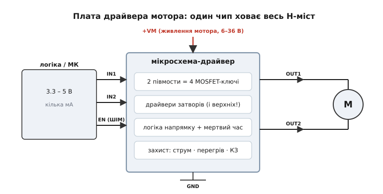
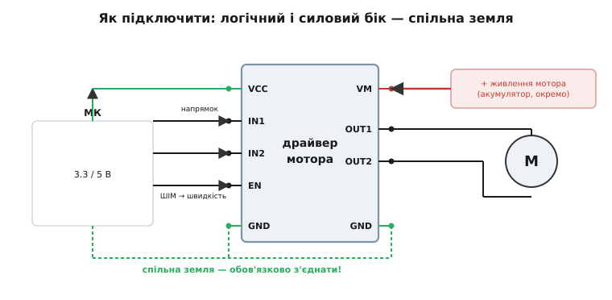

# 📋 Розпіновка й підключення плати драйвера мотора

Готовий модуль-драйвер мотора ховає весь H-міст усередині чипа, а назовні лишає жменю виводів — кілька логічних входів, окреме живлення мотора й два дроти до самого мотора. Щоб змусити його крутити, треба знати три речі: що на платі за що відповідає, як звести докупи логіку, живлення й **спільну землю**, і яку комбінацію рівнів подати, щоб дістати «вперед», «назад», «гальмо» та швидкість. Зберімо все це в одну довідку — від блок-схеми до готового `motor_drive()`.

### Що ховається на платі


*Чип ховає весь H-міст: два півмости (чотири ключі), драйвери затворів (зокрема для верхніх ключів — найхитріша частина), логіку напрямку з мертвим часом і захист від надструму, перегріву та короткого. Назовні — лише логічні входи від мікроконтролера, окреме живлення мотора +VM і два дроти OUT1/OUT2 до самого мотора.*

Усе, що в дискретному H-мості збирають по цеглинці, на платі вже зведено всередині однієї мікросхеми. Чотири силові ключі утворюють два півмости. Над кожним ключем сидить свій драйвер затвора — підсилювач, що заганяє в [ємність затвора](topic:electronics/gate-capacitance) достатній струм, щоб ключ перемикався швидко й не грівся; для **верхніх** ключів це найхитріша частина, бо їх треба відкривати напругою вищою за «плюс» живлення. Окремий блок логіки перетворює два-три зовнішні сигнали на правильні комбінації для чотирьох затворів і сам вставляє між ними мертвий час, щоб плече ніколи не замкнуло шину накоротко. І нарешті — захист: від надмірного струму, від перегріву кристала, від короткого замикання на виході; коли щось іде не так, чип просто закриває ключі, рятуючи й себе, і мотор.

Навколо самої мікросхеми на платі звично ставлять ще трохи обв'язки: маленький стабілізатор на 5 В (щоб живити логіку від того ж акумулятора, що й мотор), світлодіоди-індикатори напрямку, гвинтові клемники під товсті дроти мотора й живлення та конденсатори, що приймають на себе кидки струму при перемиканні. Усе це разом і робить «плату драйвера» — готовий вузол, до якого лишається підвести дроти.

### Розпіновка й підключення


*Два боки плати. Логічний: VCC (живлення логіки 3.3/5 В), IN1/IN2 (напрямок), EN (дозвіл і ШІМ-швидкість), GND. Силовий: VM (окреме живлення мотора), OUT1/OUT2 (до мотора), GND. Найважливіше — землі обох боків з'єднують в одну точку, інакше логічні рівні «висять у повітрі» й керування не працює.*

Логіку й мотор живлять **окремо** — і це не примха, а необхідність: мотор хоче більшого вольтажу й амперів, а ще «брудно» їх споживає, з кидками при перемиканні; логіка ж хоче тихих стабільних 3.3–5 В. Дати їм спільне живлення означало б пускати моторні просадки прямо в живлення мікроконтролера. А ось земля мусить бути **спільною**, зведеною в одну точку: логічний рівень — це завжди напруга **відносно** землі, тож якщо в чипа і в мікроконтролера землі різні, чип просто не зрозуміє, де в сигналі «нуль», а де «одиниця».

### Перший «байт»: як заговорити з платою

Керування простіше, ніж здається: на кожен мотор іде два біти напрямку плюс один канал ШІМ. На поширених модулях `IN1=1, IN2=0` — вперед; `IN1=0, IN2=1` — назад; `IN1=IN2` — гальмо (мотор закорочено всередині моста); `EN=0` — вільний вибіг. Швидкість задають **шпаруватістю ШІМ** на вході EN. По суті це та сама таблиця керування H-мостом, лише виведена на роз'єм: усю заборонену комбінацію «верхній і нижній одного плеча разом» чип не дасть створити навіть навмисне, бо логіка напрямку фізично не виставляє такого поєднання.

Від мікроконтролера тут потрібно рівно три речі, і вони є в будь-якого: два звичайні цифрові виходи під IN1/IN2 і один канал апаратного таймера в режимі ШІМ на EN. Далі різняться лише імена — `digitalWrite()` в Arduino, `gpio_set_level()` в ESP-IDF, `HAL_GPIO_WritePin()` у STM32 HAL, `.value()` в MicroPython; так само й ШІМ: `analogWrite()`, `ledc_set_duty()`, регістр порівняння таймера, `duty_u16()`. Нижче — одна й та сама `motor_drive()` у чотирьох середовищах.

:::tabs
```arduino
// Керування модулем-драйвером (IN1/IN2 — напрямок, EN — ШІМ-швидкість).
// speed: -255..+255 (знак = напрямок, модуль = шпаруватість каналу EN).
void motor_drive(int speed) {
    if (speed >  255) speed =  255;          // обрізаємо до діапазону ШІМ
    if (speed < -255) speed = -255;
    int duty = speed < 0 ? -speed : speed;   // модуль = швидкість

    digitalWrite(IN1, speed >= 0);           // напрямок: вперед при speed >= 0
    digitalWrite(IN2, speed <  0);
    analogWrite(EN, speed == 0 ? 0 : duty);  // швидкість через ШІМ на виводі EN
}
```
```esp-idf
#include "driver/gpio.h"
#include "driver/ledc.h"                     // канал ШІМ, таймер на 8 біт → duty 0..255

// speed: -255..+255 (знак = напрямок, модуль = шпаруватість каналу EN).
void motor_drive(int speed) {
    if (speed >  255) speed =  255;          // обрізаємо до діапазону ШІМ
    if (speed < -255) speed = -255;
    int duty = speed < 0 ? -speed : speed;   // модуль = швидкість

    gpio_set_level(PIN_IN1, speed >= 0);     // напрямок: вперед при speed >= 0
    gpio_set_level(PIN_IN2, speed <  0);
    ledc_set_duty(LEDC_LOW_SPEED_MODE, EN_CH, speed == 0 ? 0 : duty);
    ledc_update_duty(LEDC_LOW_SPEED_MODE, EN_CH);   // нове значення набирає чинності
}
```
```stm32
#include "stm32f4xx_hal.h"
extern TIM_HandleTypeDef htim3;              // ARR = 255 → шпаруватість теж 0..255

// speed: -255..+255 (знак = напрямок, модуль = шпаруватість каналу EN).
void motor_drive(int speed) {
    if (speed >  255) speed =  255;          // обрізаємо до діапазону ШІМ
    if (speed < -255) speed = -255;
    int duty = speed < 0 ? -speed : speed;   // модуль = швидкість

    HAL_GPIO_WritePin(IN1_GPIO_Port, IN1_Pin,        // напрямок: вперед при speed >= 0
                      speed >= 0 ? GPIO_PIN_SET : GPIO_PIN_RESET);
    HAL_GPIO_WritePin(IN2_GPIO_Port, IN2_Pin,
                      speed <  0 ? GPIO_PIN_SET : GPIO_PIN_RESET);
    __HAL_TIM_SET_COMPARE(&htim3, TIM_CHANNEL_1, speed == 0 ? 0 : duty);
}
```
```micropython
# Керування модулем-драйвером (IN1/IN2 — напрямок, EN — ШІМ-швидкість).
# speed: -255..+255 (знак = напрямок, модуль = шпаруватість каналу EN).
def motor_drive(speed):
    speed = max(-255, min(255, speed))       # обрізаємо до діапазону ШІМ
    duty = abs(speed)                         # модуль = швидкість

    in1.value(1 if speed >= 0 else 0)         # напрямок: вперед при speed >= 0
    in2.value(1 if speed <  0 else 0)
    en.duty_u16(0 if speed == 0 else duty * 257)  # швидкість через апаратний ШІМ
```
:::

### Типові граблі

Найчастіша помилка новачка — **не з'єднати землі**: усе ніби підключено, мотор смикається або мовчить, а причина в тому, що чип читає логічні рівні без спільної опори. Друга — повісити L298 без радіатора й дивуватися, чому він пече пальці: ті ватти на біполярних плечах мусять кудись піти теплом. Третя — живити логіку від високого VM через дешевий вбудований стабілізатор, який на великому перепаді напруги перегрівається й вимикається. І не лишайте вхід EN «висіти» без підтяжки — на неприєднаному вході наводяться завади, і мотор реагуватиме на них сам по собі. Окремо варто рахувати **пусковий струм**: у першу мить, поки ротор стоїть, мотор бере в рази більше за робочий струм, і дешевий модуль на цьому кидку може спрацювати в захист або просісти.

> 🔧 **Навіщо це.** Підключаючи драйвер, підведи логіку (IN1/IN2 — напрямок, EN — ШІМ-швидкість) та **окреме** живлення мотора — і **обов'язково зведи землі** логіки й мотора в одну точку, інакше чип не побачить, де в сигналі «нуль». Не лишай EN висіти без підтяжки. І пам'ятай про пусковий струм: у першу мить мотор бере в рази більше за робочий, тож дешевий модуль на цьому кидку може піти в захист.
