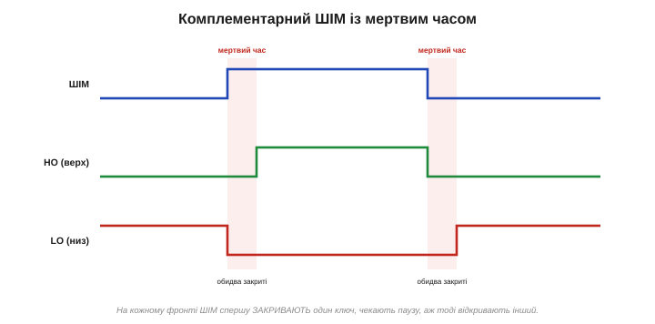
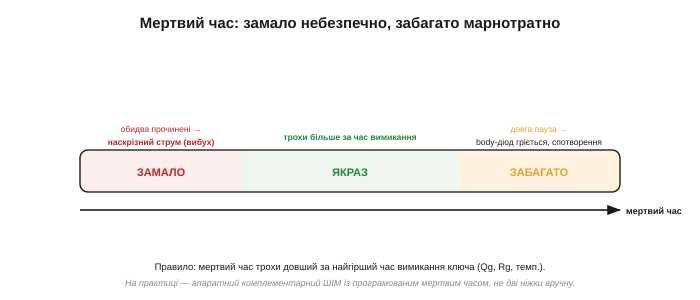

# ⚙️ Наскрізний струм і мертвий час: логіка, що не дає відкрити обидва плечі

> У [H-мості](book:electronics/h-bridge) діє смертельне правило: ніколи не відкривати верхній і нижній ключі одного плеча разом, інакше наскрізний струм спалить міст. Тут — **як саме** ця заборона втілюється в логіці: як з одного сигналу ШІМ зробити два протилежні з гарантованою паузою, скільки та пауза має тривати й чому її довіряють залізу, а не рукам.

### Задача

У півмості два ключі — верхній і нижній. Вони мають бути **протилежні** (один відкритий, інший закритий), але **ніколи не відкриті разом**, навіть на мікросекунду. Підступ у тому, що ключ закривається **не миттєво**: затвор — це [ємність](book:electronics/gate-capacitance), і поки заряд стікає, ключ ще прочинений. Тож якщо тупо зробити сигнали точно протилежними, на **кожному** фронті буде коротке перекриття — і наскрізний струм.

### Ідея: спершу закрий, тоді відкрий

Вставляємо навмисну паузу — **мертвий час** — коли закриті **обидва**, між вимкненням одного й увімкненням іншого. Це принцип «розірви, перш ніж з'єднати» (break-before-make), знайомий з реле.


*Рис. З одного ШІМ роблять два сигнали затворів. На фронті вгору: спершу LO→0, пауза, тоді HO→1. На фронті вниз: HO→0, пауза, тоді LO→1. У рожевих смугах закриті обидва ключі — саме ця пауза й рятує міст.*

### Псевдокод

```
# на КОЖНОМУ фронті ШІМ: спершу вимкнути, тоді (з паузою) увімкнути
фронт ШІМ ↑:   LO ← 0;  чекати t_dead;  HO ← 1
фронт ШІМ ↓:   HO ← 0;  чекати t_dead;  LO ← 1
```

Скільки чекати? Мертвий час має перевищувати найгірший час вимикання ключа:

```
t_dead  >  t_вимк(макс) + запас
t_вимк  ≈  Qgd / I(розряду затвора)   # поки затвор спорожниться нижче порога
```

тобто залежить від [заряду затвора Qgd](book:electronics/gate-capacitance/math-gate-charge.md), опору затвора Rg і температури.

### Як це роблять насправді

**Не** перемикайте дві ніжки програмно у циклі — програмна затримка надто груба й тремтить, і одного збою досить для «димку». Беруть **апаратний** механізм: у драйверах мостів мертвий час вбудований, а таймери мікроконтролерів мають режим **комплементарного ШІМ** із програмованим регістром мертвого часу. Ви задаєте одну шпаруватість — периферія сама видає HO і LO з паузою.

### Складність і пастки


*Рис. Мертвий час налаштовують у вузький коридор: замало — обидва на мить прочинені (наскрізний струм), забагато — довга пауза, коли струм мотора йде крізь повільний body-діод (гріється) і спотворює вихід.*

**Замало → наскрізний струм.** Катастрофічний бік. Навіть кілька наносекунд перекриття на амперах — це сплеск, що руйнує ключі. Завжди закладайте із запасом.

**Забагато → втрати й спотворення.** У паузі індуктивний струм навантаження тече крізь body-діод (повільний, падіння ~0.7 В → тепло), а вихід на цей час «некерований» — звідси спотворення сигналу (помітне в приводах і звукових підсилювачах). Тож і роздувати паузу не можна.

**t_dead не сталий.** Час вимикання гуляє з температурою, керуванням затвора й навантаженням — рахуйте на найгірший випадок.

**Хибне відмикання за Міллером.** Швидкий стрибок напруги може крізь ємність затвір-стік знову прочинити «закритий» ключ — і наскрізний струм попри паузу. Лікують сильним [стяганням затвора драйвером](book:electronics/gate-driver).

> 🔧 **Навіщо це.** Мертвий час — це маленька пауза, що відділяє робочий міст від спаленого. Запам'ятайте логіку: на кожному фронті **спершу закрий, потім — з паузою — відкрий**, а паузу бери трохи довшою за найгірший час вимикання ключа. І головне: довіряйте це **апаратному** комплементарному ШІМ чи готовому драйверу, а не ручному перемиканню двох ніжок — бо ціна одного збою тут вимірюється згорілими транзисторами.
