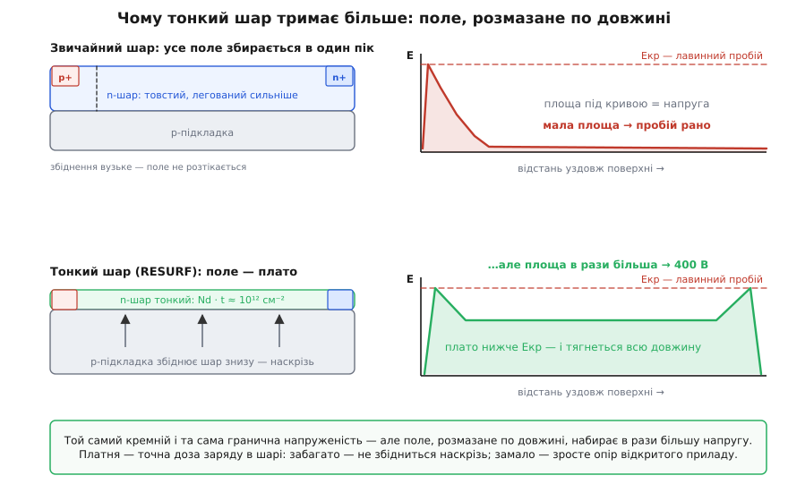

# 📜 Як 600 вольт посадили поруч із логікою

Рядок сучасного каталогу вимовляє це буденно: «600 V half-bridge driver, 8-pin SOIC». Ніби так було завжди. Насправді за цим рядком стоїть довге десятиліття, коли фраза «високовольтний прилад на одному кристалі з логікою» звучала як «гаряча крига». Кремній не хотів. Фізика не хотіла. Тож питання, з якого варто починати, таке: **чому 600 вольт і логіка не вживалися на спільній підкладці — і що саме мусили зрозуміти, щоб вони вжилися?**

Історія тут рідкісно чиста: майже все лягло в датовані доповіді, статті й патенти з іменами. Пройдімо її не як список дат, а як ланцюжок «що бентежило → хто зрушив → що з того вийшло».

## Суперечність, через яку високу напругу тримали окремо

Почнімо з того, чому кремнію взагалі важко.

Щоб прилад тримав напругу, у ньому має бути **збіднена область** — шар, з якого пішли вільні носії й на якому осідає вся прикладена різниця потенціалів. Напруга — це поле, проінтегроване по відстані: V = ∫E dx. Але в кремнію є стеля: щойно напруженість десь дійде до критичної (≈2–3·10⁵ В/см), починається [лавинний пробій](topic:electronics/diode-breakdown) — носії розганяються полем так, що вибивають нові, ті розганяються теж, і струм наростає лавиною. Отже, тримати 600 В означає розкласти їх по відстані так, щоб **ніде** поле не дійшло до критичного.

Порахуймо, скільки на це треба довжини.

**Скільки кремнію просять 600 вольт.**
Критична напруженість Eкр ≈ 2.5·10⁵ В/см; у різкому односторонньому переході поле спадає трикутником, тож середня напруженість — половина пікової.

```
W = 2 · V / Eкр
  = 2 · 600 / 2.5·10⁵
  = 4.8·10⁻³ см        = 48 мкм
```

Десятки мікронів — і то не абиякого кремнію, а **слабко** легованого: інакше збіднення просто не розповзеться так далеко.

Тепер погляньмо, чого хоче логіка. Вона живе в тонесенькому, **сильно** легованому шарі просто під поверхнею: транзистори завглибшки часток мікрона, і що сильніше легування, то кращі пороги та швидкодія. Дві вимоги протилежні буквально за кожним параметром — товщина, легування, глибина.

Силові прилади розв'язали цю суперечність просто: пішли **вглиб**. У [вертикальному приладі](topic:electronics/mosfet-structure) струм тече від поверхні крізь усю пластину до нижнього контакту, і напругу тримає товща — там її є скільки завгодно. Але мікросхема так не вміє: у неї все на поверхні, а низ пластини спільний для всіх. Отже, на кристалі високовольтний прилад мусить бути **бічним**: дрейфова область лежить уздовж поверхні.

І ось тут ховалася пастка. Бічний перехід на звичайному шарі пробивався ганебно рано — далеко не там, де обіцяв розрахунок «розклади 600 В на 48 мкм». Причина — у формі поля. Біля краю переходу, там, де він завертає до поверхні, силові лінії згущуються, і поле збирається в **гострий пік**. Уся напруга падає в одній вузькій щілині коло анода, замість розтектися по довжині. Пік упирається в критичне значення — пробій, — а решта дрейфової області стоїть майже без поля, порожня й марна.

Звідси й практика 1970-х: високу напругу тримають на своєму кристалі, логіку — на своєму. Драйвер верхнього ключа збирали з розсипу, а команду вгору пхали трансформатором чи оптроном. Це працювало, це коштувало грошей і місця, і здавалося, що інакше не буває.

## «Зробіть шар тоншим»: грудень 1979, Ейндговен

Зрушення прийшло з Philips Research Laboratories в Ейндговені — того самого NatLab. У грудні 1979-го на IEDM **Й. А. Аппелс і Г. М. Й. Ваес** (J. A. Appels, H. M. J. Vaes) доповіли роботу з назвою майже нахабно простою: «High Voltage Thin Layer Devices (RESURF Devices)» — високовольтні тонкошарові прилади (IEDM Tech. Digest, 1979, с. 238–241).

Хід, який вони запропонували, суперечить першому здоровому глузду. Здоровий глузд каже: хочеш більшої напруги — дай більше кремнію, товщий шар. Аппелс і Ваес зробили навпаки: **шар зробили тоншим**.

Логіка тут така. Тонкий n-шар лежить на слабколегованій p-підкладці — а це ж теж перехід, тільки **вертикальний**, знизу. Якщо шар достатньо тонкий і легований у міру, підкладка збіднює його знизу **наскрізь**, по всій товщині, ще перш ніж бічний перехід устигне пробитися. А коли шар збіднений повністю, поверхневому полю більше нема з чого збиратися в пік: заряд, що той пік малював, уже вибрано. Поле **розпластується** — замість шпиля на краю виходить рівне плато на всю довжину дрейфової області, з двома помірними горбами по кінцях.

Ось у чому сіль, і варто вимовити її прямо: **площа під кривою E(x) — це і є напруга**. Висота піка обмежена тим самим Eкр в обох випадках. Але пік — вузький трикутник із мізерною площею, а плато — довгий прямокутник. Стеля висоти та сама, площа — у рази більша. Звідси й назва: **RESURF** (англ. REduced SURface Field — «знижене поверхневе поле»). Не «підвищене щось», а саме **знижене** поле на поверхні. Виграш дістався не з нового матеріалу й не з хитрішої геометрії приладу, а з того, що поле перестали збирати в купу.


*Площа під кривою E(x) — це напруга. Пік і плато впираються в ту саму критичну напруженість, але вузький трикутник набирає мізер, а плато на всю довжину — у рази більше. Тонкий шар тримає більше не всупереч тонкості, а завдяки їй: тільки такий шар підкладка збіднює наскрізь.*

Уся хитрість — у дозі. Збіднити шар наскрізь вдасться лише тоді, коли заряду в ньому не забагато; а якщо заряду замало, шар стане надто високоомним і відкритий прилад погано проводитиме. Умова, яку знайшли, виявилася напрочуд конкретною — добуток концентрації на товщину.

**Умова RESURF: скільки заряду можна лишити в шарі.**
Оптимум для кремнію — близько 1·10¹² см⁻² (за підкладки ≈2–3·10¹⁴ см⁻³).

```
Nd · t ≈ 1·10¹² см⁻²

шар t = 1 мкм = 1·10⁻⁴ см
  → Nd ≈ 1·10¹² / 1·10⁻⁴ = 1·10¹⁶ см⁻³

шар t = 10 мкм = 1·10⁻³ см
  → Nd ≈ 1·10¹² / 1·10⁻³ = 1·10¹⁵ см⁻³
```

Вибір лишається один: або тонше й сильніше леговане, або товще й слабше — але добуток тримай коло 10¹². Це число й досі сидить у рецептурах високовольтних процесів.

А скільки напруги набирається з того плато? Порахуймо.

**Довжина, що купує напругу.**
Плато навмисне тримають нижче критичного — хай ≈1.6·10⁵ В/см. На плато поле стале, тож інтеграл вироджується в добуток.

```
L = V / Eплато
  = 400 / 1.6·10⁵
  = 2.5·10⁻³ см        = 25 мкм
```

Двадцять п'ять мікронів уздовж поверхні — і 400 вольт. Не в товщі пластини, а **збоку**, поруч із логікою. Саме такий порядок довжини дрейфу наводять у літературі для 400-вольтових RESURF-приладів: теорія й кремній тут зійшлися.

Через рік вийшов розгорнутий виклад — уже вп'ятьох: Аппелс, Коллет, Гарт, Ваес і Вергувен (J. A. Appels, M. G. Collet, P. A. H. Hart, H. M. J. Vaes, J. F. C. M. Verhoeven, Philips Journal of Research, т. 35, № 1, с. 1–13, 1980). Назва ефекту прилипла до перших двох, але робота була командна — звична річ, про яку варто пам'ятати щоразу, коли винахід згортають до однієї фрази.

> 🔧 **Навіщо це.** RESURF — не деталь технології, а **дозвіл на існування** цілого класу. Поки поверхневе поле збиралося в пік, «600 В поруч із логікою» було неможливим у принципі, а не просто дорогим. Щойно поле навчилися розпластувати — бічний високовольтний прилад став буденним, і лише тому напівмостовий драйвер узагалі вміщається в один кристал. Число «600 В» у каталозі — прямий нащадок тієї дози 10¹².

## Квітень 1980, Прінстон: із принципу — прилад

Принцип — ще не транзистор. Наступний крок зробили в RCA Laboratories у Прінстоні, і зробили швидко: за чотири місяці після IEDM.

**С. Чолак, Б. Сінґер і Е. Ступп** (S. Colak, B. Singer, E. Stupp) опублікували «Lateral DMOS Power Transistor Design» (IEEE Electron Device Letters, т. 1, № 4, с. 51–53, квітень 1980). Вони прорахували бічний DMOS двовимірною моделлю — і модель пообіцяла пробій **вище звичної межі**. Тоді прилад спроєктували, виготовили й виміряли: **400 вольт**, бічний, на кристалі. Конструкцію Чолак закріпив патентом US 4 300 150 «Lateral Double-diffused MOS Transistor Device» (подано 16 червня 1980, видано 10 листопада 1981).

Розрізняймо внески, бо їх легко злити в один. **Принцип** розпластаного поля — Philips, Ейндговен. **Бічний DMOS, що з того принципу виріс**, — RCA, Прінстон. І саме цей другий прилад стане згодом тим самим містком у плаваючий домен. Тобто транзистор, крізь який у сучасному драйвері лізе команда, має цілком конкретну дату народження й трьох конкретних авторів.

## Але високовольтна мікросхема — ще не плаваючий острів

Тут історію треба вберегти від зручного спрощення «з'явився RESURF — з'явився HVIC». Ні. Між ними лежить окрема ідея, і без неї нічого не працює.

Високовольтні мікросхеми пішли в серію швидко — але не ті. За власним літописом компанії, Supertex від 1980 року розгортала HVCMOS: логіка CMOS і DMOS-виходи на одному кристалі; 1982-го — набір мікросхем для електролюмінесцентних панелей, 1983-го — драйвери на 64 лінії, 1987-го — 32-канальні драйвери плазмових панелей. Сотні вольт на виходах, десятки виходів, жодних трансформаторів. Здавалося б, задачу розв'язано.

Але придивімося, **чим саме** ці мікросхеми високовольтні. Їхні виходи приперті до **власної** землі: чіп сидить у своєму нерухомому світі й штовхає вихід угору, до високої шини. Це «висока напруга **від** мене».

Напівміст просить іншого — і різниця тут категорійна. Йому потрібен не високовольтний вихід, а цілий **острів схеми, чий власний нуль їде на 600 В угору й назад**, десятки тисяч разів на секунду. Не окремий прилад, що тримає напругу, а **область** кристала, яка вміє від'їхати від підкладки й жити там своїм життям.

А це вже три винаходи одразу. Перше — сама плаваюча кишеня: закуток кристала, віддертий від спільної підкладки. Друге — кільце, що обриває поле навколо кишені: **HVJT** (англ. high-voltage junction termination — високовольтне закінчення переходу); саме воно, збудоване за RESURF-рецептом, тримає різницю між островом і рештою кристала. Третє — прилад, що крізь цю стіну проходить.

І ось найкрасивіше в усій конструкції: **стіна й місток — це одна деталь**. Прилад зсуву рівня будують **усередині** ізолювального кільця; його дрейфова область і **є** та ізоляція. Річ, що розділяє два світи, і річ, що їх з'єднує, — той самий шматок кремнію. Тому в патентній мові HVJT так і описують: перехідне кільце, яке водночас працює приладом зсуву рівня.

## Чому драйвер узагалі став задачею для кристала

Паралельно дозрівала друга нитка, без якої перша нікому не була б потрібна. Питання просте: а нащо взагалі пхати драйвер у мікросхему?

Поки силовим ключем був біполярний транзистор, драйвер лишався важкою аналоговою справою. База просить **струму** — і не разово, а весь час, поки ключ відкритий: ампери на десятки амперів колектора. Такий «драйвер» — сам собі підсилювач потужності, з трансформатором і радіатором. Пхати його в кристал поруч із логікою безглуздо: він більший за ту логіку.

Усе змінив ключ з **ізольованим затвором**. Затвор — це конденсатор: він просить не струму, а [заряду](topic:electronics/mosfet-gate-charge), і то лише в мить перемикання. Між перемиканнями — нуль. Керування з задачі «гнати ампери» перетворилося на «перекинути десятки нанокулонів за десятки наносекунд», а це вже міліватти — рівно те, що кремнієвий закуток тягне.

Хто це зробив? Тут два сюжети, і в обох є дискусія про авторство.

**Силовий MOSFET.** 1977–78: Алекс Лідов і Том Герман (Alexander Lidow, Thomas Herman) розробили HEXFET — силовий MOSFET із [комірчастою шестикутною архітектурою](topic:electronics/mosfet-cell-structure); патент US 4 376 286 «High Power MOSFET with Low On-Resistance and High Breakdown Voltage» подано від International Rectifier (дата пріоритету — жовтень 1978), серія вийшла на ринок 1979-го. Зверніть увагу: авторів **двоє**, і Лідова всюди звуть саме співвинахідником.

**IGBT.** Тут суперечка гостріша й досі не закрита. Б. Джаянт Баліґа (B. Jayant Baliga) у General Electric доповів свою роботу про MOS-керовані тиристорні структури у вересні 1979-го, сам винахід датують 1980-м, а виріб GE випустила в червні 1983-го. Але майже одночасно до тієї самої ідеї дійшли **Ганс В. Бекке й Карл Ф. Вітлі** (Hans W. Becke, Carl F. Wheatley) з RCA: їхню заявку подано 25 березня 1980-го, патент US 4 364 073 «Power MOSFET with an Anode Region» видано 14 грудня 1982-го — і його часто називають ключовим патентом [IGBT](topic:electronics/igbt). Статус доказовості назвімо чесно: **атрибуція спірна**, це паралельний винахід двох груп у межах кількох місяців, і фразою «IGBT винайшов X» історію не переказати. До речі, GE продавала свій прилад під назвою IGT (Insulated Gate Transistor) — тому в статтях кінця 1980-х ви й читаєте «MOSFET/IGT drive», а не «IGBT».

Отже, до середини 1980-х склалося двоє: ключ, яким керують зарядом, і вміння виростити високовольтний прилад збоку від логіки. Лишалося зшити.

## Дійові особи: Лідови — і чому «російський інженер» тут неправда

Оскільки International Rectifier стоїть у центрі подальшого, варто сказати, звідки взялася сама компанія — і сказати точно, бо прізвище **Лідов** мало не автоматично тягне за собою хибний ярлик.

**Ерік Лідов** (Eric Lidow) народився **22 грудня 1912 року у Вільні** — місто сьогодні зветься Вільнюс і є столицею Литви, а тоді було центром Віленської губернії **Російської імперії** (між війнами воно відійде Польщі). Родина — **єврейська**. Фах він здобув у Берліні: магістратура Технічного університету Берліна, 1937 рік, уже за Третього Райху. Був одним із засновників Берлінського сіоністського товариства й допоміг багатьом євреям виїхати з Німеччини до війни. Сам виїхав у жовтні 1937-го — прибув до Нью-Йорка з **14 доларами** й фотоапаратом Leica в кишені. 1939-го перебрався до Лос-Анджелеса й заснував першу свою компанію, Selenium Corporation of America (1946-го її купила Sperry). Того ж 1946-го через Червоний Хрест розшукав батьків: обоє пережили Голокост. А 1947-го разом із батьком **Леоном** заснував **International Rectifier**. Керував нею до 1995-го, головував у раді до 2008-го; помер 18 січня 2013-го, у сто років.

Розкладімо ідентичність по вимірах, бо їх тут щонайменше п'ять і вони не збігаються: **етнічність** — єврейська; **місто народження** — Вільня, сьогодні Вільнюс, литовське; **підданство на момент народження** — Російська імперія; **школа й фах** — німецька, берлінська; **справа життя** — американська, каліфорнійська. Назвати його «російським інженером» — неправда за всіма вимірами, крім формального підданства немовляти, яке він утратив ще дитиною разом із самою імперією. Жодного дня він не працював у російській науковій школі.

Його син **Алекс Лідов** здобув докторат із прикладної фізики в Стенфорді 1977-го, того ж року прийшов до батькової компанії інженером-дослідником — і за рік став співавтором HEXFET. Тобто компанія, якій судилося збудувати монолітний високовольтний драйвер, на той час уже мала вдома і ключ, і причину його драйвити.

> 🔧 **Навіщо це.** Розрізняти виміри ідентичності — не церемонія, а точність. Слов'янського звучання прізвища замало навіть на гіпотезу: перед нами єврей із Вільні, вихованець берлінської школи, який зробив свою справу в Каліфорнії. Та сама помилка — чіпляти ярлик «російське» українцям, полякам, литовцям чи грузинам — псує історію техніки регулярно, і єдиний захист від неї простий: питати про кожен вимір окремо.

## Дві школи одного десятиліття: 60 вольт і 600

Поки в Каліфорнії дозрівала одна відповідь, в Італії визріла інша — і порівняти їх варто, бо живі обидві.

В Аграте-Бріанці, у SGS (сьогодні STMicroelectronics), команда під проводом **Бруно Мурарі** (Bruno Murari) — Антоніо Андреіні, Клаудіо Контьєро, Паола Ґальбіаті, а також Клаудіо Діацці, Доменіко Россі, Джуліо Рікотті — від початку 1980-х шукала, як звести на одному кристалі три технології одразу: біполярну, CMOS і DMOS. 1985 року вийшов перший **BCD** (Bipolar-CMOS-DMOS) — мікросхема **L6202**, повномостовий драйвер мотора: **60 В, 1.5 А, 300 кГц**. Заслугу визнано офіційно: IEEE поставила віху «Multiple Technologies on a Chip, 1985» 18 травня 2021 року.

Філософія BCD — **усе на кристал**: і логіку, і аналог, і самі силові ключі. На шістдесяти вольтах це працює прекрасно.

Але випрямлена мережа — це 300–540 вольт на шині. На порядок більше. І там ставка «усе на кристал» ламається навіть не об фізику ізоляції, а об **тепло**: силові ключі, що комутують кіловати, розсіюють у корпусі мікросхеми більше, ніж той здатен віддати. Тож HVIC-школа зробила протилежну ставку: **м'язи лишити зовні** — дискретний MOSFET чи IGBT зі своїм радіатором, — а в кристал забрати самий **мозок**, але навчити той мозок жити при 600 В зсуву між власними закутками.

Дві відповіді одного десятиліття, і жодна не витіснила другу: BCD і сьогодні тримає низьковольтну силову інтеграцію, HVIC — високовольтну.

## 1988–1990: місток збудовано — і хто був першим

Тепер обидві нитки сходяться.


*Монолітний драйвер не був чиїмось осяянням — він був перетином двох ниток, що визріли нарізно. Одна зробила керування дешевим (затвор просить заряду, не струму), друга — можливим (600 В поруч із логікою на спільній підкладці). BCD-школа відповіла на те саме питання інакше й лишилася при своїх 60 вольтах.*

До 1988-го тема визріла настільки, що пішла в доповіді. У травні 1988-го на HFPC читають «An HVIC MOSFET/IGT Drive for Half-Bridge Topologies» (HFPC Proceedings, с. 237–245), у червні — Браян Е. Тейлор (Brian E. Taylor) із «An Integrated High-Voltage Bridge Driver Simplifies Drive Circuits In Totem-Pole Inverters» (PCCI, с. 166–171). Обидві назви кажуть те саме: інтегрований, мостовий, драйвер — уже не мрія, а доповідь із числами.

**1989-й — рік, який називають першим.** International Rectifier вивела перший монолітний HVIC-драйвер: плаваюча кишеня, обведена полікремнієвими кільцями, здатна від'їхати на 600 (згодом і на 1200) вольт від решти кристала, з приладами, чий пробій — вище 700 В (відповідно 1400 В). Приблизно 1990-го з'явився **IR2110**, який став стандартом де-факто на десятиліття; його й досі продають — тепер під маркою Infineon, що купила IR 2015 року.

Тільки з «першістю» будьмо акуратні, бо тут є що уточнити.

**По-перше, джерело претензії.** Формулювання «IR представила перший монолітний HVIC-драйвер 1989 року» походить від самої компанії (сьогодні — Infineon) і звідти розійшлося довідниками, включно з англомовною «Вікіпедією». Це **твердження виробника**, а не незалежна розвідка з історії техніки. Ніхто його поки не спростував ранішою датою — але й первинними джерелами воно не підперте. Статус: **правдоподібно, з вендорського джерела**.

**По-друге, паралельна робота.** Того ж 1989-го, 9 травня, North American Philips подала заявку на патент US 4 989 127 «Driver for High Voltage Half-Bridge Circuits» (винахідник — Армін Ф. Веґенер, Armin F. Wegener; видано 29 січня 1991-го). У ньому вже все, що ми знаємо як канон: засувка, яку **ставлять і скидають імпульсами струму** з двох струмових дзеркал — саме щоб не палити потужність постійним рівнем, — і витримка фронту **10 В/нс**. Тобто дві незалежні групи по різні боки океану дійшли тієї самої відповіді в межах одного року. Класична картина **паралельного винаходу**, а не осяяння одинака.

**По-третє, дата IR2110.** Точного дня виходу в продаж первинні джерела не фіксують; вторинні сходяться на «близько 1990». Так і скажімо — близько 1990, без удаваної точності.

А найкраще ту епоху описує, як не дивно, чужий патент. 1995 року Philips (винахідник Стівен Л. Вонґ, Stephen L. Wong) у заявці на власний мостовий драйвер описує IR2110 як **відомий рівень техніки** — і опис читається як переказ сьогоднішнього підручника: бутстреп живить верхній драйвер, зроблений у плаваючій кишені всередині кристала; часову інформацію туди передає каскад зсуву рівня, що працює від високої напруги й шле в тамтешню засувку **імпульси струму**. І тут же — межа, вимовлена як тодішня біда: цей каскад, за словами патенту, лишається головним джерелом втрат на високих частотах і на практиці стелить робочу частоту таких схем десь на 100 кГц. За п'ять років трюк устиг стати і класикою, і об'єктом критики.

## Що з цієї історії лежить у вас на столі

Найцікавіше, що жодна з тих дат не залишилася в минулому — вони всі стирчать із сучасного каталогу, просто неназвані.

**Число «600 В» — це не маркетинг, а фізика 1979-го.** Стеля стоїть там, де стоїть, бо ізоляція плаваючої кишені зроблена **переходом** на спільній підкладці, а перехід за RESURF-рецептом дає ті самі 600 (у міцніших процесах — 1200) вольт зсуву. Кругле число — не рекламний рубіж, а те, що дала доза 10¹² і довжина дрейфу.

**Рядок «dV/dt» у паспорті — квитанція за трюк.** Це ціна відмови від бар'єра між світами: два домени ділять кристал, тож рух одного неминуче наводиться на другий. Рядок з'явився не з обережності, а з польових поломок.

**Слова RESURF ви на корпусі не побачите ніколи** — а воно там є, у кожному 600-вольтовому драйвері, як прізвище будівельника на фундаменті, якого ніхто не розкопує.

І фінальний виток, майже літературний. **Ден Кінзер** (Dan Kinzer) — інженер, який в International Rectifier виріс до віцепрезидента з досліджень і головного технолога й побудував там не одну платформу HVIC та BCD (понад 180 патентів США; 2018-го — до першого складу Зали слави ISPSD). Потім він пішов технічним директором у Fairchild, а тоді став співзасновником Navitas — компанії про **нітрид галію**. Тобто той самий інженер, що доводив монолітний зсув рівня до серії, згодом узявся за прилади, чиї фронти настільки круті, що монолітному зсуву на них уже сутужно: dV/dt, колись просто рядок у паспорті, став стелею цілого підходу. Трюку сорок років, він і досі в найдешевшій восьминіжці — і водночас уже видно край, за яким він не працює. Так виглядає нормальне життя інженерної ідеї: не «застаріла», а «має межу, і ми знаємо, звідки та межа взялася».
