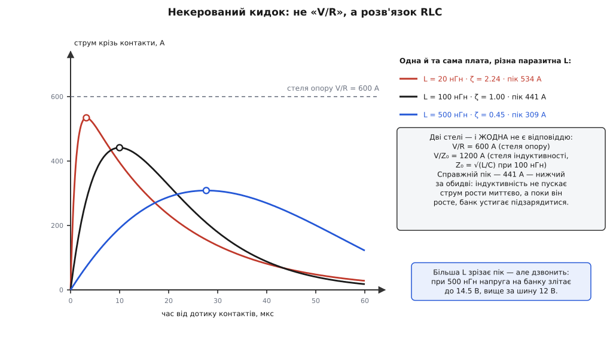
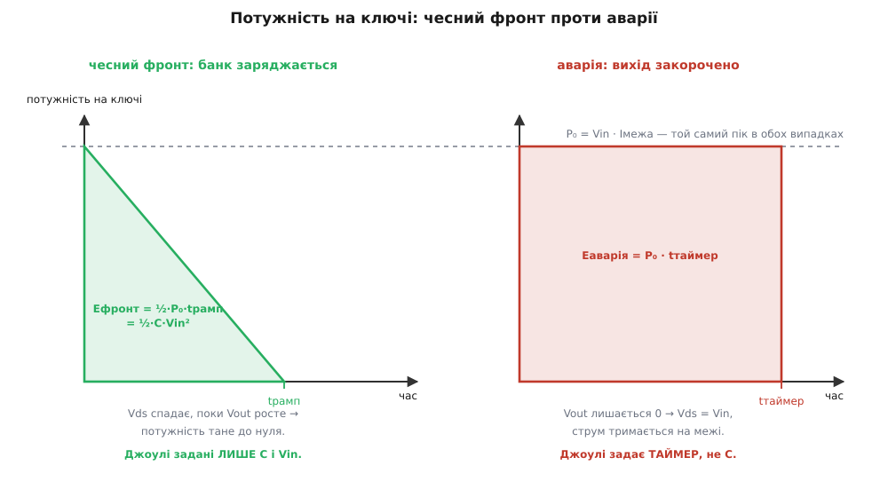
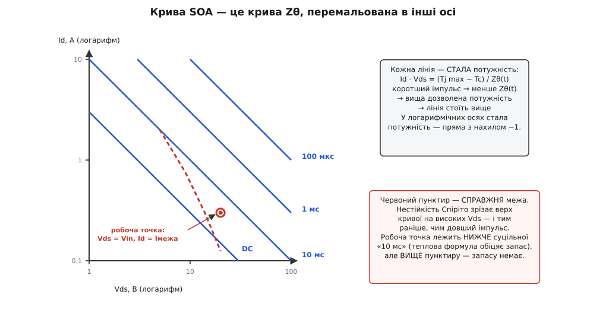
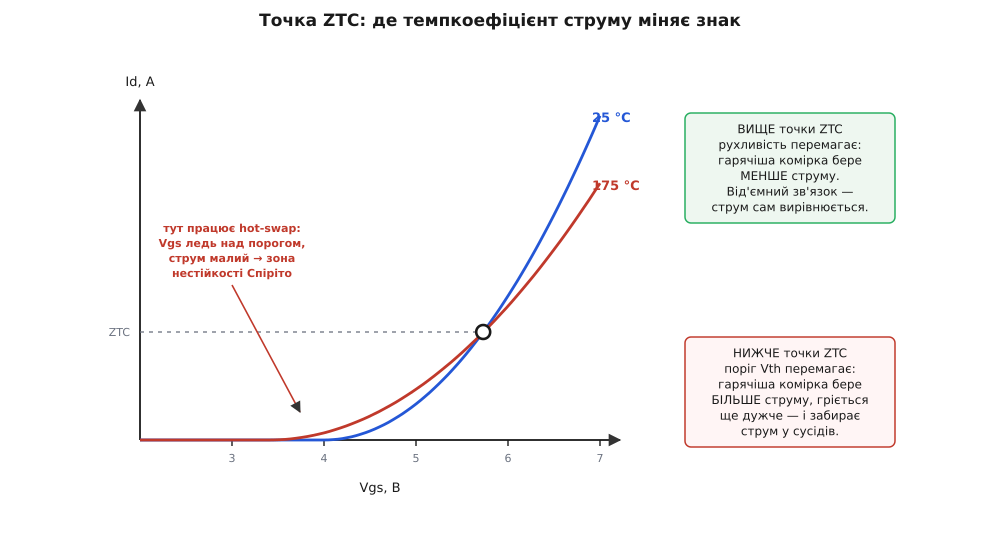

# 🧮 Кидок, енергія і SOA: від i = C·dV/dt до імпульсної кривої

Керований фронт обіцяє просту угоду: розтягни вмикання вдесятеро — і пік струму впаде вдесятеро. Угода чесна. Але вона неповна, і саме в недомовленому місці згорають ключі. Бо разом зі струмом легко повірити, ніби впала й **енергія**, що вивільняється при вмиканні. Вона не впала. Вона взагалі не зрушила з місця — це число задане ще до того, як ми вибрали хоч одну деталь. Гірше: керований фронт **зганяє всю цю енергію в один кристал**, тимчасом як брутальне вставлення розмазувало її по всій петлі — по контактах, доріжках, по власному опору конденсаторів. Ми не прибрали тепло. Ми його зібрали докупи й поклали на транзистор.

Ось чому рахунок мусить дійти до кінця, а не спинитися на приємному числі «пік упав у п'ятсот разів». Три питання, і на кожне потрібне число:

1. **Скільки бере некерований кидок насправді?** Оцінка «Vin поділити на опір контактів» — це стеля, а не відповідь, і справжній пік лежить помітно нижче. Розібратися варто не заради точності, а тому, що дорогою стає видно, звідки взагалі береться енергія й чому її не можна зменшити.
2. **Звідки береться пік потужності й куди дівається енергія?** Тут з'явиться інваріант, який керує всім дальшим: ½·C·Vin², число, на яке не впливає ні швидкість фронту, ні опір петлі, ні спосіб керування.
3. **Як звірити пару «стільки ват протягом стількох мілісекунд» із кривою SOA?** Крива в даташиті намальована для прямокутних імпульсів, а наш імпульс — трикутний; і сама крива на високих напругах бреше, якщо не знати про нестійкість, що зрізає їй верх.

Почнімо з заряду — бо все інше виросте саме з нього.

## Заряд, який мусить пройти

Найголовніше в усьому рахунку помітно ще до єдиної формули. Плата має вхідний банк ємністю C, і йому належить піднятися від 0 до Vin. Це означає, що в банк мусить зайти цілком певна порція заряду — і жодне схемне хитрування її не змінить:

```
Q = C · Vin = 1000·10⁻⁶ · 12 = 0.012 Кл = 12 мКл
```

Дванадцять мілікулонів. Вони не обговорюються: це стільки, скільки треба, щоб на цій ємності стояло дванадцять вольтів. Питання лише в тому, **як швидко** вони пройдуть, бо струм — це і є швидкість проходження заряду, `i = dQ/dt`. Розтягнути на 10 мс — матимемо в середньому 1.2 А; втиснути в 20 мкс — матимемо сотні ампер. Заряд той самий, струм різний. Уся конструкція hot-swap воює не із зарядом, а з його похідною.

І тепер — думка, з якої виросте решта. Кожен із цих кулонів мусить **перетнути** щось, на чому стоїть напруга: контакти, доріжки, ключ. А заряд, помножений на напругу, — це енергія. Тобто разом із неминучим зарядом ми успадковуємо й неминучу порцію джоулів. Скільки саме — зараз побачимо, і відповідь виявиться напрочуд упертою.

## Некерований кидок — це не «Vin/R»

Спершу розберімося з тим, що діється без жодного ключа: розряджений банк, живі контакти, і більше нічого. Звична оцінка каже: розряджений конденсатор — це коротке замикання, тож струм упреться в опір петлі, `Iпік ≈ Vin/R = 12/0.020 = 600 А`. Число правильне як **стеля**. Але воно не є відповіддю, і причина цікава.

Річ у тім, що в петлі є не лише опір. Провідники, штирі роз'єму, доріжки мають **індуктивність** — десятки-сотні наногенрі. А індуктивність не пускає струм рости миттєво: `V = L·di/dt`. Щоб струм узагалі дійшов до 600 А, йому треба час, і за цей час банк устигає підзарядитися, тобто напруга, яка гнала струм, устигає впасти. Струм ганяється за стелею, якої вже немає.

Тож насправді перед нами не «джерело на резистор», а послідовне коло R–L–C, і його треба розв'язувати як [загасний осцилятор](topic:physics/damped-oscillator) — систему другого порядку, де індуктивність грає роль маси, ємність роль пружини, а опір роль тертя. Запишімо баланс напруг у петлі після дотику контактів і продиференціюймо, щоб позбутися інтеграла:

```
Vin = L·di/dt + R·i + (1/C)·∫i dt

L·d²i/dt² + R·di/dt + i/C = 0     (після диференціювання)

s² + (R/L)·s + 1/(L·C) = 0        (характеристичне рівняння)
```

Це рівняння породжує два числа, і в них — уся фізика:

```
ω₀ = 1/√(L·C)              власна частота
α  = R/(2·L)               стала загасання
ζ  = α/ω₀ = (R/2)·√(C/L)   коефіцієнт загасання (безрозмірний)
Z₀ = √(L/C)                характеристичний опір петлі
```

Найцікавіший тут `Z₀` — [характеристичний імпеданс](topic:physics/characteristic-impedance), тобто той опір, який петля показує **власним перехідним процесам**, а не сталому струмові. Він і дає **другу**, зовсім іншу стелю: якби опору не було геть, струм усе одно не перевищив би `Vin/Z₀`, бо його стримала б сама індуктивність, перекачуючи енергію в ємність і назад. Порахуймо обидві стелі для нашої плати за `L = 100 нГн`:

```
Z₀    = √(100·10⁻⁹ / 1000·10⁻⁶) = √(10⁻⁴) = 0.010 Ом = 10 мОм
Vin/Z₀ = 12 / 0.010 = 1200 А      стеля індуктивності
Vin/R  = 12 / 0.020 =  600 А      стеля опору
ζ      = (0.020/2)·√(1000·10⁻⁶ / 100·10⁻⁹) = 0.01 · 100 = 1.0
```

Два числа, 600 і 1200, і **жодне з них не є відповіддю** — вони описують два різні механізми стримування, які діють одночасно. Відповідь дає `ζ`, а він для цих величин вийшов рівно одиницею: коло **критично загасне**. Для цього випадку розв'язок має гарний замкнений вигляд:

```
i(t) = (Vin/L) · t · e^(−α·t)

пік при t = 1/α = 2·L/R = 10 мкс:
Iпік = (Vin/L)·(1/α)·e⁻¹ = (2/e)·(Vin/R) = 0.736 · 600 = 441 А
```

Отже 441 ампер, а не 600 — індуктивність зрізала майже чверть піка, просто не давши струмові набрати обертів досить швидко. І ця пропорція не стала: вона залежить від `ζ`, тобто від того, скільки паразитної індуктивності припало на петлю.


*Одна плата, той самий банк і той самий опір — різна лише паразитна індуктивність петлі. Що менша L, то вищий і гостріший пік: коло сунеться до стелі опору 600 А. Що більша L, то пік нижчий і пізніший, зате з'являється дзвін. Справжній пік завжди нижчий за обидві стелі — і за Vin/R, і за Vin/Z₀.*

Крива за `L = 500 нГн` показує, що безкоштовного тут нема. Пік справді впав до 309 А, але коло стало слабозагасним (`ζ = 0.45`), а слабозагасне коло **дзвонить**: напруга на банку перелітає через ціль і сягає 14.5 В на шині 12 В. Заспокоювати кидок нарощуванням індуктивності — означає міняти струмову проблему на перенапружну. Саме тому кидок ловлять ключем, а не дроселем.

Але головне тут інше, і воно ховається в енергії. Хоч би яким вийшов пік — 534, 441 чи 309 ампер — усі ці кулони врешті пройшли крізь опір петлі й нагріли контакти та доріжки. Скільки саме тепла? Відповідь на це питання виявиться зовсім не такою, як підказує чуття.

## Інваріант ½·C·Vin²: джоулі не слухаються нікого

Порахуймо енергетичний баланс заряджання ємності від джерела сталої напруги. Джерело віддало заряд `Q = C·Vin`, і віддало його **весь** під своєю повною напругою `Vin` — бо джерело на те й джерело, що тримає напругу незмінною, скільки б заряду з нього не текло. Отже джерело витратило:

```
Eджерело = Q · Vin = C · Vin²
```

А скільки з цього осіло в самому банку? Тут напруга росла від 0 до Vin, тож заряд заходив під різною напругою, і треба інтегрувати — це класичний [запас енергії конденсатора](topic:electronics/capacitor):

```
Eбанк = ∫₀^Q v dq = ∫₀^Vin C·v dv = ½ · C · Vin²
```

Половина. Джерело віддало `C·Vin²`, у банку осіло `½·C·Vin²`, а різниця — ще `½·C·Vin²` — мусила десь розсіятися теплом:

```
Eтепло = Eджерело − Eбанк = C·Vin² − ½·C·Vin² = ½ · C · Vin²
      = ½ · 1000·10⁻⁶ · 12² = 0.072 Дж = 72 мДж
```

Вдивімося в цей результат, бо він дивовижний. У ньому **немає R**. Немає L. Немає часу. Немає ані натяку на те, як саме ми заряджали. Хоч крізь мідну шину, хоч крізь кілометр ніхрому, хоч ривком за двадцять мікросекунд, хоч ніжно за півсекунди — щоб посадити ½·C·Vin² джоулів у конденсатор від джерела сталої напруги, доведеться спалити рівно стільки ж. Опір визначає, **як довго** і **як гаряче**, але **не скільки**.

> 🔧 **Навіщо це.** Звідси випливає теза, що перевертає всю картину hot-swap. Плавний фронт **не зменшує тепла ні на джоуль** — 72 мДж будуть спалені хоч так, хоч так. Він робить дещо інше й значно підступніше: він **переадресовує** їх. Без ключа ці 72 мДж розходяться по всій петлі — по контактах роз'єму, доріжках, власному опору конденсаторів, по іскрі, — і ніде окремо не є катастрофою. Постав послідовний ключ, і його опір у проміжній області стане в сотні разів більшим за ті 20 мОм петлі, тобто **майже всі 72 мДж тепер виділяться в одному кристалі площею кілька квадратних міліметрів**. Керований фронт — це не спосіб позбутися енергії. Це свідоме рішення прийняти її всю на транзистор, в обмін на право розтягнути її в часі. Ось за що платить SOA.

Тепер видно, що саме дає нам фронт. Енергія — стала, `E = ½·C·Vin²`. Час фронту — наш вибір, `tрамп`. Отже те, чим ми справді керуємо, — це **потужність**, бо потужність є енергією, поділеною на час. Розтягуючи фронт, ми не викидаємо джоулі, а лише розмазуємо їх тонше.

Простежмо це докладно в режимі обмеження струму. Контролер тримає струм на `Iмежа`, і банк заряджається лінійно, тож напруга на виході росте прямою:

```
Vout(t) = (Iмежа/C) · t        →   tрамп = C·Vin / Iмежа
```

Напруга на ключі — це те, що лишилося від вхідної, тож вона дзеркально спадає, а потужність на ключі є їхнім добутком:

```
Vds(t) = Vin − Vout(t) = Vin · (1 − t/tрамп)

P(t) = Vds(t) · Iмежа = Vin·Iмежа · (1 − t/tрамп)
```

Отже потужність на ключі — **не константа, а спадна пряма**: вона починається з максимуму й тане до нуля. Пік стоїть на самому початку, коли струм уже повний, а напруга ще вся на транзисторі:

```
P₀ = Vin · Iмежа = 12 · 1.2 = 14.4 Вт      (при tрамп = 10 мс)
```

А енергія — це площа під цією прямою, тобто площа трикутника:

```
Eключ = ½ · P₀ · tрамп = ½ · Vin · Iмежа · tрамп
```

Підставмо сюди `Iмежа = C·Vin/tрамп` — і час скоротиться сам:

```
Eключ = ½ · Vin · (C·Vin/tрамп) · tрамп = ½ · C · Vin²  = 72 мДж
```

Той самий інваріант, здобутий з іншого боку. Це не збіг і не гарний випадок: `tрамп` **мусив** скоротитися, бо енергія й не могла від нього залежати. Хоч би який фронт ми вибрали, трикутник під кривою потужності має незмінну площу — довший фронт просто робить його нижчим і ширшим.


*Пік потужності P₀ = Vin·Iмежа однаковий в обох випадках — а от площі під кривими різні, як і їхня доля. На чесному фронті Vout росте, Vds тане, і трикутник має фіксовану площу ½·C·Vin², хоч би скільки той фронт тривав. В аварії Vout лишається нулем, тане нічого, і прямокутник росте, поки його не обріже таймер. Джоулі більше не задає C — їх задає таймер.*

Права панель показує, чому контролер без таймера — це не контролер. Якщо вихід закорочено, `Vout` не росте ніколи, тож `Vds` назавжди лишається рівним `Vin`, а струм — на межі. Потужність не тане: вона стоїть прямокутником на рівні `P₀`, а енергія росте лінійно й без стелі, `E = P₀·t`. Інваріант ½·C·Vin² тут просто не діє — він був наслідком того, що банк **заряджається**. Не заряджається — і єдине, що обмежує джоулі в кристалі, це та мить, коли таймер скаже досить.

## Два закони керування фронтом

Перш ніж іти до тепла, варто закріпити, звідки взагалі береться `Iмежа` чи `dV/dt` — бо це два різні закони з різною арифметикою.

**Активне обмеження струму** ставить у коло шунт `Rшунт`, а підсилювач порівнює спад на ньому з опорною напругою й тримає затвор так, щоб рівність не порушувалась. Звідси межа — просте ділення:

```
Iмежа = Vоп / Rшунт          напр. 50 мВ / 40 мОм = 1.25 А
tрамп = C · Vin / Iмежа
```

Струм тут заданий **явно**, і саме тому в аварії він нікуди не втече: петля тримає його на межі, хай на виході хоч цвях.

**Керування нахилом (dV/dt)** діє тонше — через сам транзистор. Затвор підтягують малим сталим струмом `Iзатв`, і коли ключ входить у проміжну область, напруга на затворі впирається в **плато Міллера**: вона фактично завмирає, бо вся вона зайнята тим, щоб тримати струм. Увесь струм затвора тепер не має куди подітися, окрім як перезаряджати прохідну ємність `Cgd` — це і є [ефект Міллера](topic:electronics/miller-effect), у якому ланка між затвором і стоком стає містком зворотного зв'язку. А раз так, то струм затвора **напряму** задає швидкість зміни напруги на стоку — і далі все розкручується саме:

```
Iзатв = Cgd · dVds/dt        →      dVout/dt = Iзатв / Cgd

Iкид = C · dVout/dt = C · Iзатв / Cgd
```

Погляньмо на останній вираз: кидок вийшов **відношенням двох ємностей**, помноженим на струм затвора. Ні Vin, ні опір петлі до нього не входять. Це елегантно й дешево — але тепер зрозуміло й те, чому спосіб небезпечний в аварії: у формулі просто **немає струму навантаження**. Схема не міряє струм, вона веде напругу за розкладом і закоротка їй байдужа. Величину `Cgd` беруть із [заряду затвора](topic:electronics/mosfet-gate-charge), і вона гуляє з напругою в рази, тож і `Iкид` знають лише приблизно.

Ще одне, про що формули мовчать, а плата — ні. Крізь ключ тече не лише струм заряду банку, а й усе, що споживає плата в цю мить:

```
Iключ(t) = C · dVout/dt + Iнавант(t)
```

Тут рятує звичка перетворювачів сидіти в блокуванні за низькою напругою, поки вхід не доросте: `Iнавант ≈ 0` майже весь фронт і прокидається аж під кінець, коли `Vds` уже майже нуль і гріти нічим. Але якщо на платі висить щось, що жере струм від першого вольта, — цей доданок треба класти в рахунок від початку.

## Скільки нагрівається кристал

Тепер маємо все, щоб рахувати головне. Кристал гріється, і питання лише в тому, наскільки. Зв'язок між потужністю й температурою дає [тепловий опір](topic:physics/thermal-resistance), але в сталому вигляді `Rθ` він тут не годиться: `Rθ` описує, куди прийде температура через хвилини, а наш імпульс триває десять мілісекунд. За такий час тепло не встигає дійти ні до корпусу, ні до радіатора — воно ще сидить у самому кремнії. Тому працює **перехідний тепловий імпеданс** `Zθ(t)` — та сама ідея, але як функція тривалості імпульсу:

```
ΔTj = P · Zθ(t)
```

Уся суть — у формі цієї функції, і її варто вивести, а не запам'ятати. Уяви, що потужність виділяється в тонкому шарі на поверхні кремнію й тепло розходиться вглиб. Спершу воно гріє лише ту мізерну масу, що поруч, — і температура злітає. Що далі, то товщий шар кремнію втягнуто в роботу, то більша маса поглинає ті самі ватти, то повільніше росте температура. Фронт тепла за час `t` заходить углиб на характерну відстань:

```
δ(t) ≈ √(a·t),   a = k/(ρ·c) — температуропровідність
для кремнію: a = 148/(2330·700) = 9.07·10⁻⁵ м²/с
```

Прогріта маса пропорційна `δ ∝ √t`, а отже й тепловий опір цієї ділянки росте так само — як **корінь із часу**. Строгий розв'язок одновимірної задачі про сталий потік у півнескінченне тіло дає це точно:

```
Zθ(t) = (2/A) · √( t / (π·k·ρ·c) ) = kZ · √t
```

Для кристала площею 5 мм²:

```
kZ = 2 / (5·10⁻⁶ · √(π · 148 · 2330 · 700)) = 14.5 К/(Вт·√с)
Zθ(1 мс)  = 14.5 · √0.001 = 0.46 К/Вт
Zθ(10 мс) = 14.5 · √0.010 = 1.45 К/Вт
```

Ось звідки на графіку `Zθ` в даташиті береться прямий відрізок із нахилом ½ — це не апроксимація, а фізика дифузії. І звідси ж видно, **де цей відрізок кінчається**: коли фронт тепла дійде до низу кристала, кремній скінчиться, і далі тепло піде в припій та рамку, а закон зламається:

```
δ(1 мс)  = √(9.07·10⁻⁵ · 0.001) = 0.30 мм   ≈ товщина кристала
δ(10 мс) = √(9.07·10⁻⁵ · 0.010) = 0.95 мм   — уже давно в корпусі
```

Тобто чистий «корінь із часу» тримається приблизно до мілісекунди, а далі крива згинається — саме там, де живе hot-swap. Тримаймо це в голові: наша модель оптимістична рівно настільки, наскільки корпус кращий за нескінченний кремній, і песимістична настільки, наскільки тепло розповзається вбік, а не лише вглиб. Для порядків її досить, для проєкту беруть криву з даташита.

### Трикутний імпульс проти прямокутної кривої

І тут вилазить нестиковка, повз яку легко пройти. `Zθ(t)` у даташиті — і вся крива SOA разом із ним — намальовані для **прямокутного** імпульсу: увімкнули P, потримали t, вимкнули. А наш імпульс — **трикутний**: він починається з `P₀` і спадає до нуля. Прикласти криву прямо не можна. Що підставляти — `P₀`? Це вийде вдвічі песимістично. Середню `P₀/2`? Схоже на правду, але звідки певність?

Порахуймо чесно. Температура від змінної потужності — це згортка Дюамеля з похідною теплового імпедансу:

```
ΔT(t) = ∫₀ᵗ (dZθ/du)|ᵤ₌ₜ₋τ · P(τ) dτ,     dZθ/du = kZ/(2·√u)
```

Підставмо наш спадний трикутник `P(τ) = P₀·(1 − τ/tрамп)` і замінімо змінну на `u = t − τ`:

```
ΔT(t) = (kZ·P₀/2) · ∫₀ᵗ u^(−½) · (1 − (t−u)/tрамп) du
      = (kZ·P₀/2) · [ (1 − t/tрамп)·2√t + (2/3)·t^(3/2)/tрамп ]
      = kZ · P₀ · √t · [ 1 − (2/3)·(t/tрамп) ]
```

Гарний вираз, і в ньому одразу видно змагання: множник `√t` тягне температуру вгору (тепло накопичується), а дужка тягне вниз (потужність тане). Десь вони мусять зрівноважитися — знайдімо де, взявши похідну по `x = t/tрамп`:

```
f(x) = √x · (1 − ⅔x)
f′(x) = 1/(2√x) − √x = 0    →    x = ½
```

**Кристал найгарячіший рівно посеред фронту.** Не на початку, де пік потужності, і не в кінці, де назбиралося найбільше джоулів, — а точно на половині. Підставмо назад:

```
ΔTmax = kZ · P₀ · √tрамп · √½ · (1 − ⅓) = (√2/3) · kZ · P₀ · √tрамп
                                        = 0.471 · kZ · P₀ · √tрамп
```

А тепер порівняймо це з прямокутним імпульсом потужності `Pекв`, що тривав би ті самі `tрамп` і дав таку саму температуру — тобто `ΔT = kZ·Pекв·√tрамп`:

```
Pекв = (√2/3) · P₀ = 0.471 · P₀ ≈ P₀ / 2
```

Ось і виправдання галузевому правилу «бери половину піка». Воно не з пальця: коефіцієнт точно `√2/3 ≈ 0.471`, тобто трохи менший за половину, і звичне ділення на два дає невеликий запас у наш бік. Тепер трикутний імпульс має чесний прямокутний еквівалент, і з ним можна йти до кривої SOA.

## Крива SOA — це крива Zθ в інших осях

[Безпечна робоча область](topic:electronics/soa-power-devices) виглядає як сімейство ліній у логарифмічних осях `Id`–`Vds`, по одній на кожну тривалість імпульсу. Здається, ніби це окрема, самостійна характеристика. Насправді це та сама `Zθ(t)`, тільки перемальована. Умова виживання кристала одна — не перегрітися:

```
ΔTj = P · Zθ(t) ≤ Tj max − Tc

P = Id · Vds ≤ (Tj max − Tc) / Zθ(t)
```

Права частина від струму й напруги не залежить — це просто число для даної тривалості. Отже кожна лінія SOA є геометричним місцем точок зі **сталим добутком** `Id · Vds`. У логарифмічних осях сталий добуток — це пряма з нахилом −1, бо `log Id = log P − log Vds`. Ось і все походження цих ліній.

А розсув між ними задає той самий корінь. Коротший імпульс → менший `Zθ` → більша дозволена потужність → лінія вище. Декада часу дає:

```
Zθ ∝ √t   →   P дозв ∝ 1/√t   →   декада часу = √10 ≈ 3.16 раза потужності
```

Тобто перехід від 10 мс до 1 мс піднімає дозволену потужність утричі з гаком — не вдесятеро. Це той самий закон дифузії, побачений з іншого боку.


*Кожна суцільна лінія — стала потужність (Tj max − Tc)/Zθ(t), тобто пряма з нахилом −1. Що коротший імпульс, то менший Zθ і то вище лінія. Але червоний пунктир — справжня межа: на високих Vds крива відламується від теплової прямої й падає значно стрімкіше. Робоча точка hot-swap живе саме там, праворуч унизу — велика напруга, малий струм.*

Той злам у правому нижньому куті — не примха виробника й не запас про всяк випадок. Це інша фізика, і hot-swap стоїть на ній обома ногами.

## Чому крива відламується: нестійкість Спіріто

Уся дотеперішня арифметика мовчки спиралася на припущення, що кристал гріється **рівномірно**. Для повністю відкритого ключа так і є. Для ключа в проміжній області — ні, і ось чому.

Силовий MOSFET — це не один транзистор, а десятки тисяч однакових комірок, з'єднаних паралельно й посаджених на спільний кристал. Струм між ними ділиться так, як велить фізика, і в цьому діленні змагаються два температурні ефекти:

- **Рухливість носіїв падає з нагрівом.** Гарячіша комірка проводить гірше — це від'ємний зворотний зв'язок, він вирівнює струм. Саме він рятує ключ у відкритому стані: гарячий шматок кристала сам віддає струм сусідам.
- **Поріг Vth падає з нагрівом.** Гарячіша комірка відкривається дужче — це **додатний** зворотний зв'язок: більше струму → більше тепла → ще нижчий поріг → ще більше струму.

Хто з них перемагає, залежить від того, наскільки сильно відкрито затвор. Напруга, за якої вони точно зрівноважуються, зветься **точкою ZTC** (англ. *zero temperature coefficient* — нульовий температурний коефіцієнт).


*Криві Id(Vgs) для різних температур перетинаються в одній точці. Вище ZTC нагрів зменшує струм — комірки самі вирівнюються. Нижче ZTC нагрів збільшує струм — і гарячіша комірка починає забирати струм у сусідів. Hot-swap на фронті працює саме нижче ZTC: затвор ледь над порогом, струм малий.*

Ось де пастка. На фронті hot-swap затвор ледь піднято над порогом — контролер тримає струм малим і його треба саме ледь-ледь відкрити. Тобто ключ працює **нижче ZTC**, у зоні додатного зв'язку. Достатньо мікроскопічної неоднорідності — і одна ділянка кристала починає забирати струм у сусідів, гріється дужче, забирає ще більше. Це локальний [тепловий розгін](topic:electronics/thermal-runaway): кристал гине від точкового пропалу, коли **середня** температура ще цілком пристойна. Уся наша формула `ΔT = P·Zθ` рахувала середнє — а помирає кристал від максимуму.

Це явище зветься **нестійкістю Спіріто** — за прізвищем Паоло Спіріто (Paolo Spirito) з Неаполітанського університету імені Фрідріха II, чия група (разом із Джованні Бреліо, Вінченцо д'Алессандро та Нікколо Рінальді) описала його аналітично й підтвердила експериментом; ключова праця — «Analytical model for thermal instability of low voltage power MOS and SOA in pulse operation», ISPSD 2002. Статус доказовості: явище відтворене незалежно, увійшло в даташити й у нормативні документи (зокрема NASA видала окремий технічний бюлетень про теплову нестійкість силових MOSFET), і сьогодні виробники малюють злам просто на кривій SOA.

Іронія в тому, що нестійкість **загострилася з прогресом**. Гонитва за малим `Rds(on)` штовхала робити комірки дрібнішими й густішими, піднімаючи крутість; але та сама крутість робить додатний зв'язок різкішим. Транзистор, чудовий як ключ, може виявитися нікчемним у проміжній області — і два прилади з однаковим `Rds(on)` дадуть SOA, що різняться в рази. Ось чому для hot-swap MOSFET вибирають **за кривою SOA**, а не за опором.

Звідси й наслідок, що ламає найпоширенішу «оптимізацію». Здавалося б, поставмо два транзистори паралельно — матимемо подвійну SOA. Не матимемо. У проміжній області вони **не діляться струмом**: у того, чий поріг нижчий бодай на десяток мілівольтів, струму більше; він гріється дужче; його поріг падає ще нижче — і він забирає все. Галузеве правило прямолінійне: **на паралельні MOSFET в лінійному режимі можна розраховувати як на SOA одного**. Щоб вони справді ділили струм, потрібні або баластні резистори в витоках, або окремий контур керування на кожен ключ.

## Закон масштабування: чому фронт вимірюють у мілісекундах

Тепер зберімо все й отримаймо головну проєктну залежність. Що дає нам подовження фронту?

```
потрібна потужність:   P₀ = Vin·Iмежа = C·Vin²/tрамп        ∝ 1/tрамп
дозволена потужність:  Pдозв = (Tj max − Tc)/(kZ·√tрамп)     ∝ 1/√tрамп
```

Потрібна падає **як 1/t**, дозволена росте лише **як 1/√t** — тобто повільніше. Отже запас таки росте, але кволо:

```
запас M = Pдозв/Pекв ∝ (1/√tрамп)/(1/tрамп) = √tрамп
```

**Щоб подвоїти запас, фронт треба вчетверо довший.** Це і є та відповідь, заради якої затівався весь рахунок. Підставмо в закрите формулювання й перевірмо на числах:

```
ΔTmax = (√2/3) · kZ · C · Vin² / √tрамп        ∝ 1/√tрамп
```

```
tрамп   Iмежа    P₀       Pекв     Zθ(tрамп)   ΔTmax    E
 1 мс   12.0 А   144 Вт   67.9 Вт   0.46 К/Вт   31.2 К   72 мДж
 4 мс    3.0 А    36 Вт   17.0 Вт   0.92 К/Вт   15.6 К   72 мДж
10 мс    1.2 А   14.4 Вт   6.8 Вт   1.45 К/Вт    9.9 К   72 мДж
16 мс   0.75 А     9 Вт    4.2 Вт   1.84 К/Вт    7.8 К   72 мДж
100 мс  0.12 А   1.44 Вт  0.68 Вт   4.59 К/Вт    3.1 К   72 мДж
```

Стовпчик енергії варто перечитати двічі: **72 мДж у кожному рядку**, від першого до останнього. Інваріант тримається залізно, хоч потужність упала в сотню разів. А температура пішла за коренем: учетверо довший фронт (1 → 4 мс) удвічі студеніший (31.2 → 15.6 К), ще вчетверо (4 → 16 мс) — ще вдвічі (15.6 → 7.8 К).

І ось чому фронт не роблять довільно довгим, хоч формула нібито дозволяє. Три стіни постають одна за одною. Перша: `√t` — кепський важіль, стократне подовження дає лише десятикратний виграш. Друга: на десятках мілісекунд закон `Zθ ∝ √t` уже не діє — тепло вийшло за межі кристала, крива згинається й пласкішає, тож дозволена потужність узагалі перестає рости. Третя, найжорсткіша: що довший імпульс, то більше часу гарячій комірці розігнатися, тож **зона Спіріто з'їдає криву тим глибше, чим довший фронт** — і на високих `Vds` довший фронт стає не безпечнішим, а небезпечнішим. Разом вони й лишають те вікно в одиниці-десятки мілісекунд, у якому живуть реальні фронти. Треба ще повільніше — беруть інший транзистор або ділять фронт між кількома, а не крутять далі ту саму ручку.

## Таймер: вікно між двома межами

Лишилося останнє число — уставка таймера. Її затискають дві нерівності з різних боків:

```
tтаймер > tрамп        інакше контролер вимкне ЧЕСНИЙ старт
tтаймер < tSOA(P₀)     інакше ключ згорить в АВАРІЇ раніше, ніж його врятують
```

Верхню межу дає та сама SOA, але прочитана вже для **прямокутного** імпульсу — бо в аварії потужність не тане, і ніяких `0.471` тут не буде. Порівняймо два випадки на однакових 10 мс:

```
чесний фронт:  Pекв = 0.471·14.4 = 6.8 Вт  →  ΔTj = 6.8 · 1.45 =  9.9 К
аварія:        Pекв = 1.000·14.4 = 14.4 Вт →  ΔTj = 14.4 · 1.45 = 20.9 К
```

Та сама тривалість, той самий пік — а нагрів **удвічі з гаком більший** (точно в `1/0.471 = 2.12` раза). Просто тому, що в аварії трикутник став прямокутником. І якщо таймер поставити з надміру щедрим запасом — скажімо, на 50 мс, — то в аварії кристал отримає вже 720 мДж і `ΔTj ≈ 47 К`, при тому що чесному фронтові ті 50 мс і задарма не потрібні.

Якщо ж вікно виявилося **порожнім**, тобто `tSOA(P₀) < tрамп`, — жодна уставка таймера не рятує, і крутити його немає сенсу. Це сигнал, що помилка вище: замалий кристал, завеликий банк, або транзистор вибрано за `Rds(on)` замість SOA. Лікується це не таймером, а зміною одного з трьох чисел у `½·C·Vin²` та в кривій ключа.

## Що з усього цього тримати в голові

Ланцюжок вийшов короткий, і кожна ланка в ньому тягне наступну.

Заряд `Q = C·Vin` мусить пройти — вибору немає. Енергія `½·C·Vin²` мусить розсіятися — вибору теж немає, і саме тому плавний фронт не економить ані джоуля. Єдине, чим ми справді керуємо, — це **потужність**, бо вона є тією енергією, поділеною на час, який ми обрали; а вибравши ключ, ми ще й вирішили, що всі ті джоулі впадуть в один кристал. Далі кристал перекладає ватти на градуси через `Zθ(t) ∝ √t` — і цей корінь є коренем із фізики дифузії, а не з підгонки. Трикутний імпульс фронту зводиться до прямокутного множником `√2/3 ≈ 0.471`, і аж тоді його можна чесно покласти на криву SOA. А сама крива на високих `Vds` живе не за формулою `P·Zθ`, а за нестійкістю Спіріто, яка не питає про середню температуру кристала.

І звідси — та єдина нерівність, заради якої все рахувалося:

```
0.471 · Vin · Iмежа  ≤  SOA(tрамп)  при  Vds = Vin
```

Ліворуч — те, що ми зажадали від ключа, вибравши `C`, `Vin` і `tрамп`. Праворуч — те, що ключ насправді може. Якщо нерівність не виконується, жодна уставка таймера, жоден номінал шунта й жоден добір `Cgd` її не врятують: доведеться міняти або банк, або фронт, або транзистор.
