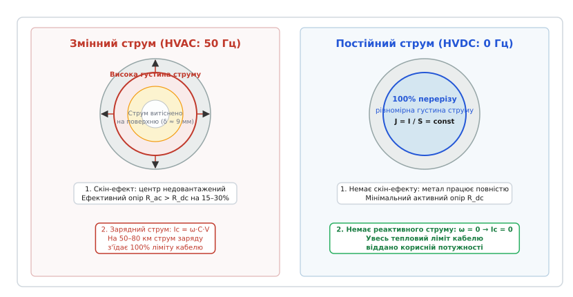
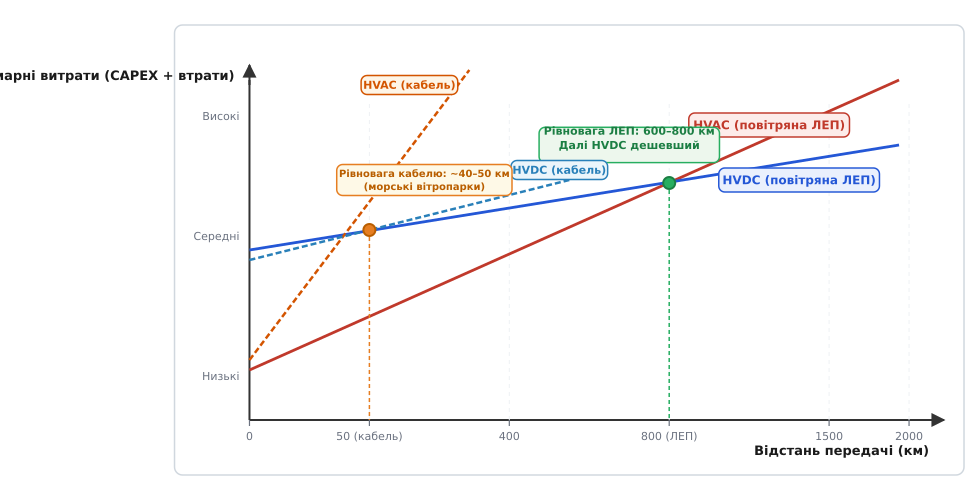
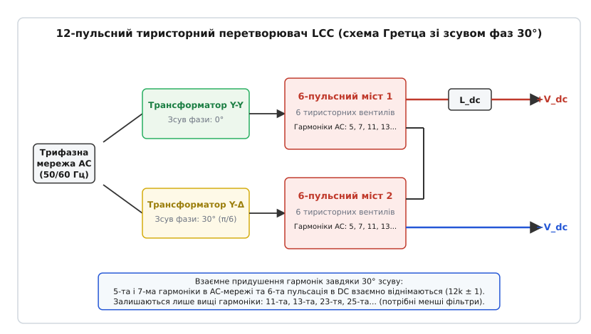
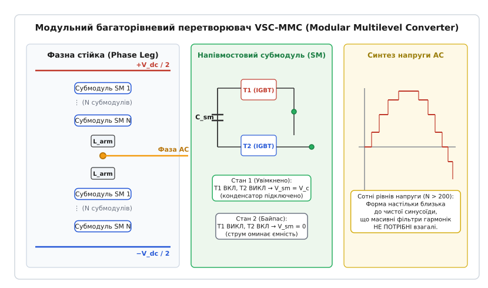
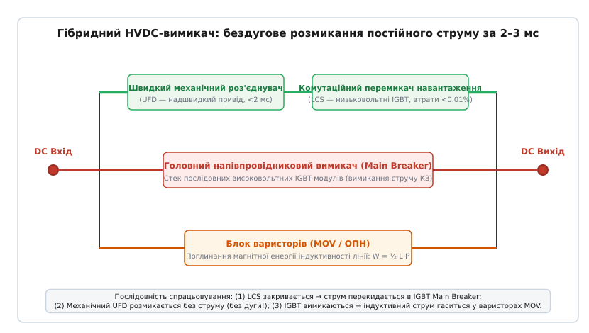

# Передача електроенергії постійним струмом (HVDC)

<preknowlist>
- [Тиристор (SCR)](topic:electronics/thyristor-scr) — керований напівпровідниковий вентиль з природною комутацією струму.
- [IGBT](topic:electronics/igbt) — повністю керований силовий транзистор для швидкісного перемикання струмів.
- [Опір конденсатора](topic:electronics/capacitive-reactance) — реактивна провідність і зарядні струми в колах змінного струму.
- [Трифазний змінний струм](topic:physics/three-phase-ac) — електродинамічні основи сучасних мереж змінного струму.
</preknowlist>

Коли довжина підводного силового кабелю напругою 400 кВ перевищує 50–70 кілометрів, трифазна лінія змінного струму перестає передавати корисну електроенергію споживачам. Металева жила кабелю, оточена шаром діелектрика та заземленим екраном у морській воді, утворює гігантський циліндричний конденсатор. Коливання напруги з промисловою частотою 50 разів на секунду безперервно ганяють крізь діелектрик паразитний ємнісний зарядний струм силою в десятки ампер на кожен кілометр траси. На дистанції 75 кілометрів цей реактивний струм досягає 1200 ампер — він повністю вичерпує граничний тепловий ліміт мідної жили, розігріваючи кабель до граничної температури ще до того, як на протилежному кінці підключать хоча б одне корисне навантаження.

Схожий фізичний бар'єр постає і на суші: коли повітряна лінія змінного струму перетинає відстань у 800–1000 кілометрів, її поздовжня індуктивність створює такий фазовий зсув напруги, що лінія втрачає динамічну синхронну стійкість, а провідники великого перерізу недовантажуються в центрі через скін-ефект. Будь-яка аварія в одній частині континенту миттєво збиває частоту в усій спільній синхронній зоні, провокуючи каскадні аварійні відключення сусідніх країн.

Розв'язанням цієї фундаментальної проблеми енергетики стала технологія **HVDC (High-Voltage Direct Current — передача електроенергії постійним струмом високої напруги)** *(від латинського directus — прямий, постійний та currere — бігти, текти)*. Випрямляючи трифазний змінний струм генераторів у постійний на рівні сотень кіловольт або понад один мегавольт, ми повністю обнуляємо частоту коливань поля (`f = 0`). Разом із частотою зникають ємнісні зарядні струми, зникає скін-ефект, а потік гігаватів потужності стає повністю керованим напівпровідниковими вентилями без необхідності синхронізувати фазові кути генераторів на протилежних кінцях континенту.

### Фізичні межі змінного струму: чому синусоїда не долає великих відстаней

Тріумф змінного струму *(HVAC)* у XX столітті тримався на простоті трансформації напруги: за допомогою електромагнітної індукції змінну напругу можна легко підвищувати на електростанціях для зменшення втрат струму в лінії (`P_loss = I² · R`) і так само просто знижувати на розподільчих трансформаторах біля споживачів. Проте на надвеликих дистанціях та в кабельних лініях змінне електромагнітне поле вступає у конфлікт із розподіленими параметрами провідників.

#### 1. Паразитна ємність і критична довжина кабелю

Будь-який високовольтний кабель має питому ємність `C_km ≈ 0.2...0.3 мкФ/км` між струмопровідною жилою та металевим заземленим екраном. Для змінного струму напруга змінюється за законом `v(t) = V_max · sin(ωt)`, де кутова частота `ω = 2πf ≈ 314.16 рад/с` для частоти 50 Гц.

Крізь діелектрик неперервно протікає ємнісний струм зміщення:

```
i_c(t) = C · (dv / dt) = ω · C · V_max · cos(ωt)   [струм зміщення крізь ємність]
```

Діюче значення цього струму на один кілометр лінії становить `I_c_km = ω · C_km · V_ph`. Для кабелю напругою 400 кВ (`V_ph = 230.9 кВ`) зарядний струм сягає `16 А` на кожен кілометр.

На початку лінії загальний струм жили дорівнює геометричній сумі активного струму навантаження `I_active` та сумарного реактивного зарядного струму `I_c_total = I_c_km · L`:

```
I_total = √(I_active² + I_c_total²)                [повний струм жили кабелю]
```

Оскільки допустимий струм жили обмежений граничним нагріванням діелектрика (`I_total ≤ I_thermal`), зі зростанням довжини кабелю зарядний струм витісняє корисний активний струм:

```
I_active = √(I_thermal² - (ω · C_km · V_ph · L)²)  [залишковий корисний струм]
```

Коли `I_c_total` зрівнюється з `I_thermal`, корисна пропускна здатність кабелю падає до нуля (`L_crit ≈ 70...80 км`).

У лінії постійного струму HVDC напруга в часі не змінюється (`dv/dt = 0`), тому в усталеному режимі зарядний струм строго дорівнює нулю: `I_c = 0`. Увесь 100% переріз провідника віддано виключно передачі корисної енергії на будь-яку відстань — хоч на 100, хоч на 1000 кілометрів під водою.

#### 2. Скін-ефект та витіснення струму на периферію жили

У провідниках змінного струму виникає ще один негативний ефект — **скін-ефект** *(skin effect, від англійського skin — шкіра, оболонка)*. Змінний струм, що тече по осі провідника, створює всередині металу змінне магнітне поле, яке індукує зустрічні вихрові струми. Ці струми послаблюють струм у центрі жили й підсилюють його на поверхні.

Глибина скін-шару `delta`, у якому протікає основна частка струму, залежить від питомого опору металу `rho` та частоти `f`:

```
δ = √(ρ / (π · f · μ₀ · μ_r))                      [товщина скін-шару]
```

Для мідного провідника на промисловій частоті 50 Гц глибина скін-шару становить `δ ≈ 9.3 мм`. Якщо для передачі гігаватів потужності застосувати масивний кабель або провід перерізом 2000 мм² (радіус суцільного циліндра `r ≈ 25.2 мм`), його внутрішня серцевина практично не бере участі в провідності.

Через нерівномірний розподіл струму ефективний активний опір провідника змінному струму `R_ac` виявляється на 20–30% вищим за опір постійному струму `R_dc`:

```
R_ac = R_dc · (1 + y_s) ≈ 1.25 · R_dc              [зростання опору жили в AC]
```

Це означає, що при однаковому передаваному струмі втрати Джоуля–Ленца `I² · R` у змінному струмі на чверть більші. Постійний струм розподіляється по всьому перерізу провідника з абсолютно однаковою густиною `J = I / S = const`, виключаючи перевитрату дорогої міді чи алюмінію.


*Ліворуч — кабель змінного струму: скін-ефект витісняє струм на поверхню жили (глибина шару близько 9 мм), а крізь ізоляцію неперервно тече радіальний зарядний струм. Праворуч — кабель постійного струму: струм рівномірно заповнює 100% перерізу, а зарядний струм крізь діелектрик дорівнює нулю.*

#### 3. Синхронна кутова стійкість та асинхронне об'єднання мереж

Передача потужності між двома вузлами мережі змінного струму жорстко обмежена поздовжнім індуктивним опором лінії `X_line = ω · L_line` та кутом зсуву фаз між напругами генераторів `delta`:

```
P = (V₁ · V₂ / X_line) · sin(δ)                    [передача потужності в AC]
```

Для запобігання випаданню генераторів із синхронізму кут `delta` на практиці не може перевищувати 30–35°. Оскільки індуктивний опір лінії прямо пропорційний її довжині, гранична потужність, яку можна стабільно передати лінією HVAC, падає обернено пропорційно відстані.

Крім того, пряме з'єднання двох сусідніх енергосистем лінією змінного струму вимагає їхньої абсолютної синхронізації: генератори в обох країнах мусять обертатися з абсолютно однаковою швидкістю і збігом фаз. Якщо в одній із систем стається аварійне відключення великої електростанції, частота починає падати, виникає неконтрольований перетік потужності через міжсистемний зв'язок, і аварія миттєво руйнує обидві мережі.

Лінія HVDC є **асинхронним мостом** *(asynchronous link)*: струм випрямляється в постійний, тому поняття фазового кута та частотної синхронізації зникають. Потік енергії через вставку постійного струму регулюється електронною автоматикою за мілісекунди і може бути зафіксований на будь-якому рівні (наприклад, рівно 1000 МВт з заходу на схід), незалежно від коливань частоти та фазових кутів у сусідніх енергосистемах.

Повний математичний вивід критичної довжини кабелю, формул скін-шару Бесселя, ефекту Ферранті та розрахунку точки беззбитковості наведено у [фізико-математичному розрахунку кабельних обмежень](topic:electronics/hvdc-transmission/math-cable-charging-losses.md).

---

### Економічна точка беззбитковості (Break-even Distance)

Попри фізичну досконалість передачі постійним струмом, HVDC не витісняє змінний струм повністю через високу початкову вартість кінцевих підстанцій.

Щоб перетворити змінний струм генераторів у постійний і навпаки, на обох кінцях лінії необхідно спорудити гігантські **перетворювальні підстанції (конвертерні станції)** *(converter stations, від латинського convertere — змінювати, перетворювати)*. Вони містять високовольтні напівпровідникові вентилі, перетворювальні трансформатори з пристроями регулювання напруги під навантаженням *(OLTC)*, згладжувальні реактори, системи замкнутого водяного деіонізованого охолодження з питомою провідністю менше 0.1 мкСм/см, екрановані зали вентилів та автоматизовані комплекси мікропроцесорного захисту. Вартість двох таких підстанцій у 3–5 разів перевищує вартість звичайних підстанцій змінного струму.

Однак сама лінійка траси HVDC значно дешевша за лінію HVAC:
- **Менше проводів:** замість трьох фазних ланцюгів (A, B, C) лінія HVDC потребує лише два полюси (+ та −) або один провід у монополярній схемі.
- **Легші опори:** вежі HVDC мають простішу Т-подібну форму, використовують на 40% менше металу і чинять менший тиск на ґрунт.
- **Вужча смуга відчуження (Right-of-Way):** через відсутність третьої фази та менші габарити опор смуга землі, що вилучається під трасу, зменшується в 2–2.5 раза.
- **Менші втрати енергії:** відсутність скін-ефекту та реактивних струмів знижує втрати `I² · R` на кожному кілометрі траси.


*Капітальні витрати на спорудження підстанцій змінного струму AC значно нижчі, але лінія та втрати зростають швидше. Після точки беззбитковості (600–800 км для повітряних ЛЕП і 40–50 км для підводних кабелів) сумарні витрати HVDC стають суттєво меншими.*

Точка перетину графіків сумарних витрат називається **дистанцією беззбитковості** *(break-even distance)*:
- **Для повітряних ліній ЛЕП:** точка беззбитковості лежить у діапазоні **600–800 км**. На менших дистанціях дешевше побудувати трифазну лінію AC; на більших дистанціях економія на опорах, проводах та втратах перекриває вартість конвертерних станцій.
- **Для підводних та підземних кабелів:** через екстремальну ціну силового кабелю та критичні втрати від зарядних струмів точка беззбитковості настає вже на дистанції **40–50 км**. Прокладання кабелю змінного струму довжиною понад 50 км вимагає спорудження проміжних компенсаційних морських платформ, що робить HVDC єдиним економічно й технічно життєздатним рішенням.

---

### Еволюція та топології перетворювачів: LCC проти VSC

Серцем будь-якої системи HVDC є перетворювальний міст. Історичний шлях технологій перетворювачів від перших ртутних вентилів до сучасних транзисторних субмодулів детально розкрито в [історичному нарисі розвитку HVDC](topic:electronics/hvdc-transmission/hist-hvdc-evolution.md).

У сучасній енергетиці співіснують два принципово різних покоління силових перетворювачів:

```
+------------------------------------+------------------------------------+
| Класичні LCC (Тиристорні)          | Сучасні VSC-MMC (IGBT-транзисторні)|
+------------------------------------+------------------------------------+
| Природна мережева комутація        | Примусова автономна комутація      |
| Тиристор відкривається затвором,   | IGBT і відкривається,              |
| але гасне лише при переході        | і закривається затвором            |
| струму мережі через нуль           | в будь-яку мікросекунду            |
|                                    |                                    |
| Споживає реактивну потужність      | Повне незалежне 4-квадрантне       |
| (50–60% від активної P)            | керування P та Q (режим STATCOM)   |
|                                    |                                    |
| Вимагає наявності потужної мережі  | Працює з мертвою мережею,          |
| AC (ризик прориву комутації)       | функція пуску з нуля (Black-Start) |
|                                    |                                    |
| Генерує сильні гармоніки           | Багаторівневий плавний синтез      |
| (величезні фільтри на 50% площі)   | (чиста синусоїда, фільтри не потрібні)|
+------------------------------------+------------------------------------+
```

---

### Класичне 1-ше покоління: LCC (Line-Commutated Converter)

Перетворювачі з природною мережевою комутацією — **LCC (Line-Commutated Converter)** — з'явилися в 1970-х роках і базуються на силових кремнієвих **тиристорах (SCR)**.

Тиристор — це напівкерований напівпровідниковий прилад: його можна відкрити імпульсом струму на керівний електрод (затвор) у будь-який момент часу (фазовий кут відмикання `alpha`). Проте закрити тиристор сигналом затвора неможливо: він залишається відкритим, поки прямий струм не спаде до нуля, а напруга зовнішньої мережі змінного струму не змінить свій знак, приклавши до тиристора зворотну напругу на час `t_q` (кут згасання `gamma`). Цей процес називається **природною (мережевою) комутацією** *(line commutation)*.

#### Схема 12-пульсного моста

Щоб мінімізувати пульсації випрямленої напруги та зменшити вміст вищих гармонік, підстанції LCC збирають за схемою **12-пульсного моста**. Він складається з двох з'єднаних послідовно по стороні постійного струму 6-пульсних трифазних мостів Гретца.


*Схема 12-пульсного перетворювача LCC: два послідовні мости Гретца живляться від трансформаторів зі зсувом фаз 30° (Y-Y та Y-Δ), що усуває 5-ту та 7-му гармоніки і згладжує пульсації напруги DC.*

Живлення мостів здійснюється від спеціальних перетворювальних трансформаторів з різними схемами з'єднання вторинних обмоток:
1. Верхній міст підключено до обмотки «зірка–зірка» *(Y–Y)* з нульовим фазовим зсувом (0°).
2. Нижній міст підключено до обмотки «зірка–трикутник» *(Y–Δ)*, яка зміщує фазу живильної трифазної напруги на 30°.

Завдяки фазовому зсуву 30° низькочастотні 5-та та 7-ма гармоніки струму обох мостів взаємно компенсуються на первинній обмотці трансформатора. Найнижчими гармоніками, що залишаються в мережі, є 11-та та 13-та (`12k ± 1`). Для утримання робочого кута відмикання `alpha` у вузькому діапазоні 13°–18° (що мінімізує споживання реактивної енергії) перетворювальні трансформатори оснащуються швидкісними перемикачами відгалужень під навантаженням *(OLTC)*.

#### Недоліки та обмеження LCC
- **Колосальне споживання реактивної потужності:** через фазову затримку відмикання тиристорів (`alpha > 0`) струм у фазах AC завжди відстає від напруги. Станція LCC постійно споживає з мережі реактивну потужність у розмірі **50–60% від передаваної активної потужності**, вимагаючи спорудження масивних батарей силових конденсаторів та синхронних компенсаторів.
- **Прорив комутації (Commutation Failure):** якщо в приймальній мережі змінного струму стається коротке замикання або раптове просідання напруги, комутуючий тиристор не встигає відновити блокувальну здатність до зміни полярності. Струм не переходить на наступну фазу, обидва тиристори плеча замикають шини DC, і потужність лінії миттєво обнуляється.
- **Вимога до міцності мережі:** підстанція LCC здатна працювати лише з потужними мережами з високим струмом короткого замикання — коефіцієнт міцності мережі `SCR = S_ac / P_dc` має перевищувати 2.5–3.0.

Попри ці недоліки, тиристори мають мінімальний спад напруги у відкритому стані, що забезпечує станціям LCC рекордний ККД (**втрати перетворення менше 0.7–0.8%**) та здатність витримувати струми до 6000 А при напругах до ±1100 кВ (потужність до 12 ГВт в одній лінії).

---

### Сучасне 2-ге покоління: VSC (Voltage Source Converter) та топологія MMC

Поява наприкінці 1990-х років високовольтних біполярних транзисторів з ізольованим затвором — **IGBT** *(Insulated-Gate Bipolar Transistor)* — зробила революцію в силовій електроніці.

IGBT є **повністю керованим вентилем**: подача позитивної напруги на затвор відкриває транзистор, а зняття напруги примусово закриває його за частки мікросекунди при будь-якому струмі. Це дозволило створити перетворювачі напруги — **VSC (Voltage Source Converter)** з **примусовою автономною комутацією** *(self-commutation)*.

Справжнім проривом стала розробка модульного багаторівневого перетворювача — **MMC (Modular Multilevel Converter)**, запропонованого професором Райнером Марквардтом.


*Архітектура фазного плеча MMC: сотні низьковольтних субмодулів із конденсаторами почергово вмикаються за алгоритмом вибору найближчого рівня (NLC), синтезуючи чисту синусоїду напруги без потреби у важких фільтрах гармонік.*

#### Будова та принцип роботи субмодуля MMC

Кожне плече перетворювача MMC містить послідовний ланцюг із сотень (від 200 до 400 і більше) однакових низьковольтних **субмодулів (SM)**.

Найпоширеніший **напівмостовий субмодуль (Half-Bridge SM)** містить:
- Власний електролітичний або плівковий конденсатор постійного струму `C_sm`, заряджений до напруги `V_c = V_dc / N` (зазвичай 1.5–2.5 кВ).
- Два зустрічно-послідовні силові IGBT-модулі `T1` (верхній) та `T2` (нижній) з антипаралельними діодами.

Субмодуль може перебувати в одному з двох робочих станів:
1. **Стан увімкнення (Inserted / State 1):** `T1` відкритий, `T2` закритий. Струм плеча протікає крізь конденсатор `C_sm`, на вихідних клемах субмодуля з'являється напруга `V_sm = +V_c`.
2. **Стан байпасу (Bypassed / State 2):** `T1` закритий, `T2` відкритий. Струм оминає конденсатор через відкритий транзистор `T2`, напруга на клемах субмодуля дорівнює нулю `V_sm = 0`.

Керуючи кількістю одночасно увімкнених субмодулів у верхньому та нижньому плечі за методом вибору найближчого рівня *(NLC — Nearest Level Control)*, мікропроцесорна система формує на виході фази плавну ступінчасту напругу з сотень рівнів. Кожен окремий IGBT перемикається з низькою частотою (близько 100–150 Гц), що знижує втрати перетворення до рекордних **0.9%**, а вихідна напруга практично не містить вищих гармонік (`THD < 1.5%`).

#### Повномостові субмодулі та гасіння коротких замикань DC

Окрім напівмостових комірок, у сучасних проєктах застосовують **повномостові субмодулі (Full-Bridge SM)**, що містять 4 транзистори за мостовою схемою `H-bridge`.

Повномостовий субмодуль здатний видавати на клеми три стани напруги: `+V_c`, `0` та **від'ємну напругу `-V_c`**. Можливість створення зустрічної від'ємної напруги дозволяє перетворювачу миттєво збити струм короткого замикання на лінії постійного струму до нуля без аварійного вимкнення підстанції з мережі змінного струму.

#### Переваги VSC-MMC над LCC

1. **Чотириквадрантне незалежне керування потужністю:** VSC може одночасно видавати активну потужність `P` і регулювати видачу/споживання реактивної потужності `Q`, працюючи як ідеальний статичний компенсатор *(STATCOM)* для стабілізації напруги прилеглих міст.
2. **Пуск знеструмленої мережі (Black-Start):** VSC використовує енергію своїх внутрішніх конденсаторів і здатен підняти «з нуля» енергосистему після тотальної аварії або запустити шельфовий вітропарк без зовнішніх генераторів.
3. **Робота з надслабкими мережами (`SCR < 1.5`):** перетворювач VSC сам створює жорстку опорну синусоїду напруги і не боїться просідань напруги в мережі, повністю виключаючи явище прориву комутації.
4. **Компактність підстанцій:** завдяки відсутності масивних пасивних фільтрів гармонік і компенсаторів площа підстанції VSC-MMC на 60–70% менша за станцію LCC, що робить її єдиним можливим рішенням для монтажу на морських платформах.
5. **Незмінна полярність напруги:** реверс потужності у VSC виконується простою зміною напрямку струму без зміни знака напруги. Це дозволяє використовувати легкі та дешеві підводні кабелі зі зшитого поліетилену **XLPE**, які руйнуються в системах LCC через накопичення просторового заряду при переполюсуванні.

Детальне інженерне порівняння параметрів, втрат, обмежень і сфер застосування LCC та VSC-MMC зведено у [порівнянні технологій LCC та VSC-MMC](topic:electronics/hvdc-transmission/comp-lcc-vs-vsc.md).

---

### Головний виклик постійного струму: комутація та гібридні HVDC-вимикачі

Головною інженерною перешкодою на шляху створення розгалужених багатовузлових мереж постійного струму довгий час залишалася відсутність надійного швидкісного **вимикача постійного струму (HVDC Circuit Breaker)**.

#### Фізика проблеми розриву постійного струму

У мережах змінного струму звичайний механічний вимикач (елегазовий SF₆ або вакуумний) розмикає металеві контакти, між якими спалахує електрична дуга. Оскільки синусоїдний струм сам по собі двічі за період проходить через нуль (кожні 10 мс при 50 Гц), у момент переходу струму через нуль дуга природно гасне, а елегаз відновлює свою діелектричну міцність.

У лінії постійного струму **природного проходження через нуль не існує**. Якщо просто розімкнути механічні контакти під напругою 500 кВ, електрична дуга не згасне ніколи — вона перетвориться на палаючий плазмовий факел, який за частки секунди розплавить вимикач.

Ба більше, при короткому замиканні в колі DC єдиним опором, що обмежує струм, є мізерний активний опір проводів та індуктивність лінії. Струм короткого замикання наростає з високою швидкістю:

```
di / dt = V_dc / L_line > 5...10 кА/мс              [швидкість наростання струму КЗ]
```

Якщо не відсікти аварійну ділянку за **2–5 мілісекунд**, струм досягне 30–50 кА і зруйнує напівпровідникові вентилі конвертерної станції.

#### Топологія гібридного вимикача HVDC

Розв'язанням цієї проблеми став винайдений компанією ABB **гібридний вимикач постійного струму (Hybrid HVDC Circuit Breaker)**. Він об'єднує швидкість напівпровідників із низькими втратами механічних контактів.


*Принцип дії тригілкового гібридного переривача постійного струму: нормальний струм тече крізь гілку низьких втрат із механічним роз'єднувачем, а під час аварії перенаправляється у напівпровідниковий стек IGBT та варистори MOV, що гасять струм КЗ за 3 мілісекунди без утворення дуги.*

Гібридний вимикач складається з трьох паралельних гілок:
1. **Головна гілка номінального струму (Low-loss branch):** містить надшвидкий механічний роз'єднувач *(UFD — Ultrafast Disconnector)* та низьковольтний комутаційний вимикач навантаження *(LCS — Load Commutation Switch)* на кількох IGBT. У нормальному режимі 100% робочого струму тече крізь цю гілку, створюючи мінімальні теплові втрати (менше 0.01%).
2. **Головна переривальна гілка (Main Breaker branch):** містить високовольтний стек із сотень послідовних силових IGBT-модулів, здатних витримувати повну напругу лінії (наприклад, 500 кВ). У нормальному режимі цей стек вимкнений і не споживає енергії.
3. **Гілка поглинання енергії (Energy Absorber):** блок варисторів на основі оксиду цинку *(MOV — Metal-Oxide Varistors)*, підключених паралельно головному переривачу.

#### Покрокова послідовність ліквідації аварії (за 2.5–3 мілісекунди)

```
Час t = 0.0 мс:
  Датчики фіксують різке наростання струму КЗ (di/dt > 5 кА/мс).

Час t = 0.2 мс:
  Драйвер закриває низьковольтний перемикач LCS.
  Опір головної гілки стрибає вгору, і струм КЗ миттєво перенаправляється
  в паралельний холодний стек IGBT Main Breaker.

Час t = 0.5...1.5 мс:
  Крізь механічний роз'єднувач UFD більше не тече струм (I = 0).
  Швидкісний привід розводить металеві контакти UFD у вакуумі чи елегазі.
  Розмикання відбувається при нульовому струмі — БЕЗ ВИНИКНЕННЯ ДУГИ!

Час t = 2.0 мс:
  Коли контакти UFD відійшли на безпечну ізоляційну відстань,
  миттєво закриваються всі високовольтні IGBT головного стека Main Breaker.

Час t = 2.1...3.0 мс:
  Індуктивність лінії L_line намагається підтримати струм, створюючи
  стрибок перенапруги L·(di/dt).
  Напруга досягає порогу відкриття варисторів MOV.
  Варистори відкриваються, обмежують напругу на безпечному рівні (1.2–1.5 V_dc)
  і перетворюють усю накопичену магнітну енергію лінії W = ½·L·I² на тепло.
  Струм лінії спадає до строгого нуля. Лінія ізольована за 3 мілісекунди!
```

---

### Топології ліній та конструкція кабелів HVDC

За способом організації провідників та заземлення лінії HVDC поділяються на три основні конфігурації:

#### 1. Монополярна схема (Monopolar)
Використовує один високовольтний провідник однієї полярності (зазвичай негативної, щоб зменшити коронний розряд).
- **З поверненням струму через землю/море:** зворотний робочий струм тече крізь ґрунт або морську воду через спеціальні заглиблені графітові чи титанові електроди, оточені шаром коксівного дрібняку для рівномірного розтікання струму. Це найдешевша схема (потрібен лише один провідник), але тривалий струм у землі може провокувати електрохімічну корозію підземних магістральних трубопроводів і металевих конструкцій, вимагаючи встановлення станцій катодного захисту.
- **З виділеним металевим поверненням (Metallic Return):** зворотний струм тече по низьковольтному ізольованому кабелю або проводу, що усуває екологічні ризики струмів у землі.

#### 2. Біполярна схема (Bipolar)
Найпоширеніша і найнадійніша схема магістральних ліній. Містить два ізольовані провідники протилежної полярності: один під напругою `+V_dc`, другий під напругою `−V_dc` відносно заземленої нейтральної точки підстанцій. Повна міжполюсна напруга подвоюється: `V_pole-to-pole = 2 · V_dc` (наприклад, ±500 кВ дає 1000 кВ між проводами).

Головна перевага біполярної схеми — принцип **резервування N-1**. За симетричного навантаження струми позитивного і негативного полюсів однакові, тому струм через нейтральне заземлення строго дорівнює нулю. Якщо на одному з полюсів стається аварія (наприклад, обрив проводу або пошкодження кабелю), аварійний полюс автоматично відсікається вимикачем, а здоровий полюс продовжує передавати **50% повної потужності лінії** в монополярному режимі з поверненням через нейтраль або резервний провідник.

#### 3. Конструктивні особливості кабелів постійного струму
Високовольтні кабелі HVDC зазнають колосальних механічних та електричних навантажень під час укладання на морське дно на глибину до 1000–2500 метрів. Сучасний кабель постійного струму містить складну багатошарову структуру:
- **Центральна струмопровідна жила:** скручена з профільованих мідних або алюмінієвих дротів перерізом до 2000–3000 мм² для мінімізації електричного опору.
- **Напівпровідникові екрани:** внутрішній та зовнішній тонкі шари електропровідного полімеру, які згладжують мікронерівності металу та виключають концентрацію електричного поля на поверхні жили.
- **Високовольтна ізоляція:** екструдований надчистий зшитий поліетилен **XLPE** (для ліній VSC) або стрічки високовольтного паперу, просочені синтетичною оливою під тиском *(MI — Mass-Impregnated)*, що витримують напруженість поля до 20–30 кВ/мм.
- **Радіальний та поздовжній вологозахист:** суцільна безшовна свинцева або алюмінієва оболонка, яка повністю герметизує діелектрик від проникнення молекул води та розчинених солей.
- **Механічна броня:** подвійний шар високоміцних сталевих оцинкованих дротів, навитих спірально, які сприймають розтягувальні зусилля під час спуску кабелю з судна-кабелеукладача та захищають лінію від ударів суднових якорів і донних рибальських тралів.
- **Оптичні модулі:** інтегровані в броню броньовані трубки з оптичними волокнами для організації високошвидкісного каналу телемеханіки та неперервного розподіленого температурного моніторингу кабелю *(DTS — Distributed Temperature Sensing)* вздовж усієї траси.

#### 4. Багатовузлові системи (MTDC) та офшорні супермережі
Більшість збудованих ліній HVDC були точковими з'єднаннями «точка–точка» *(point-to-point)*. Проте розвиток технологій VSC-MMC та гібридних вимикачів уможливив створення **багатовузлових мереж постійного струму — MTDC (Multi-Terminal DC)**.

У системі MTDC кілька перетворювальних підстанцій підключені до спільної високовольтної шини постійного струму. Це дозволяє об'єднувати десятки морських вітропарків у єдину кільцеву мережу в морі, яка може одночасно скидати енергію до енергосистем Великої Британії, Німеччини, Нідерландів та Норвегії, миттєво балансуючи надлишки та дефіцити потужності між різними країнами без ризику синхронних збоїв.

---

### Підсумковий синтез

Передача електроенергії постійним струмом високої напруги пройшла шлях від примхливих ртутних колб середини двадцятого століття до модульних напівпровідникових гігантів, що керують потоками енергії в десятки гігаватів на міжконтинентальних дистанціях.

Перемога HVDC над змінним струмом на дальніх відстанях обумовлена фундаментальною фізикою: обнулення частоти знімає обмеження ємнісних струмів у кабелях, повертає весь об'єм металу жил у роботу завдяки усуненню скін-ефекту та ізолює енергосистеми від каскадних збоїв синхронізації. Поділ на класи чітко розмежовує сфери: перевірені часом тиристорні **LCC** утримують абсолютне лідерство в ультрависоковольтних континентальних магістралях UHVDC до ±1100 кВ, а модульні транзисторні **VSC-MMC** із гібридними вимикачами стали головним будівельним блоком офшорних вітрових супермереж та гнучких асинхронних енергетичних коридорів майбутнього.
