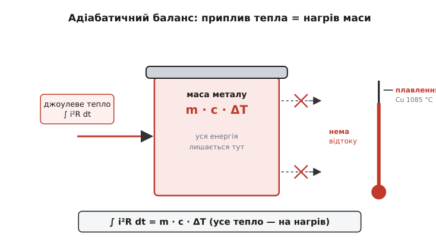
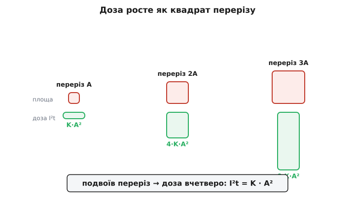
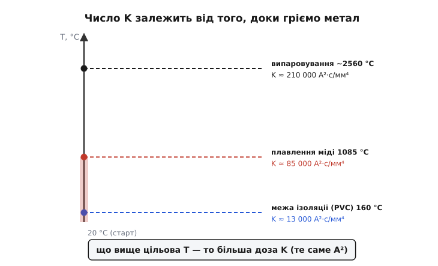

# 🧮 Адіабатичне I²t = K·A² — виведення від першопринципів

Число I²t у даташиті силового приладу виглядає як стала, яку хтось колись заміряв і записав. Насправді за ним стоїть коротке й дуже чисте виведення, після якого стає видно найдивовижніше: **струм із формули зникає взагалі**. Лишається тільки переріз провідника у квадраті та стала, що залежить рівно від того, з якого металу він зроблений. Саме тому теплова доза стає паспортом матеріалу, а не паспортом конкретної аварії. Розберімо цей крок за кроком — і заразом побачимо, звідки береться діапазон «для міді 80 000–110 000», чому ці два числа не випадкові, і що станеться з формулою, коли аварія затягнеться.

## Що ми хочемо порахувати

Питання просте на словах: **скільки теплової дози ∫i²dt треба пропустити крізь провідник, щоб він розплавився?** Якщо ми знайдемо цю дозу, ми знатимемо межу — стелю, вище за яку прилад чи елемент запобіжника гине. Це і є withstand-число.

Ключова умова, за якої задача взагалі розв'язна аналітично, — **адіабатичність** (грец. *adiábatos* — «непрохідний»): припускаємо, що за час події **жодна крихта тепла не встигла піти назовні**. Усе, що народилося в металі, лишилося в металі. Це не завжди правда — але для короткого замикання, яке минає за одиниці мілісекунд, майже правда, і наприкінці ми точно скажемо, де вона ламається.

За цієї умови баланс енергії стає майже дитячим: **скільки тепла ввійшло — стільки й пішло на нагрів металу**. Ніякого відтоку, ніяких втрат — уся ліва частина дорівнює правій. З цього одного речення й виводиться все інше.

## Крок 1: приплив тепла

Ліворуч — тепло, що народжує струм. Провідник має опір R, крізь нього тече миттєвий струм i, і за законом Джоуля — Ленца він щомиті виділяє потужність i²·R.

> Тепло від струму. Провідник з опором R, крізь який тече струм i, гріється потужністю P = i²·R (закон Джоуля — Ленца). Потужність — це енергія за секунду; повне тепло за подію — інтеграл потужності по часу. Це фундамент, на якому стоїть уся величина I²t.
>
> Докладніше — [book:physics/joule-heating].

Потужність — це тепло за секунду; щоб дістати повну енергію за всю подію, інтегруємо по часу:

```c
Q_вх = ∫ i²·R dt = R · ∫ i² dt        (Дж)
```

Опір R ми винесли за інтеграл. Тут криється перше важливе спрощення: **в адіабатичному наближенні R беруть як приблизно сталий** — не той, що росте разом із температурою, а якесь усереднене значення. (Насправді опір міді зростає більш ніж уп'ятеро, поки метал дійде від кімнатної температури до плавлення — і саме тому чесне число доведеться інтегрувати акуратніше, до цього повернемось.) Поки що маємо просту ліву частину: **повне тепло = R · (∫i²dt)**.

## Крок 2: куди це тепло дівається

Праворуч — те, на що тепло витрачається. В адіабатиці — тільки на одне: **підняти температуру самої маси металу**. Скільки саме тепла треба, щоб нагріти масу m речовини з питомою теплоємністю c на ΔT градусів, каже базова калориметрія:

```c
Q_нагр = m · c · ΔT        (Дж)
```

де m — маса провідника (кг), c — питома теплоємність металу (Дж/(кг·К)), ΔT — приріст температури від початкової до точки плавлення. Оце і вся права частина: **жодного відтоку, жодного члена «пішло в повітря» — тільки нагрів своєї ж маси**.


*Закрита «посудина» металу: ліворуч вливається джоулеве тепло ∫i²R dt, і вся ця енергія йде виключно на нагрів маси m·c·ΔT — термометр повзе до точки плавлення. Стрілки відтоку перекреслені: за короткий час тепло не встигає нікуди піти. Звідси рівність ∫i²R dt = m·c·ΔT.*

Прирівнюємо приплив до нагріву — і це наш увесь фізичний закон:

```c
R · ∫ i² dt  =  m · c · ΔT
```

Далі — чиста алгебра. Але саме в ній ховається головне диво.

## Крок 3: підставляємо геометрію — і струм зникає

Тепер найважливіший хід. І опір R, і маса m — це не абстракції: обидві виражаються через **розміри самого провідника**. Візьмімо прямий провідник завдовжки L і з площею перерізу A.

Його опір — з означення питомого опору ρ (скільки Ом дає одиничний кубик матеріалу):

```c
R = ρ · L / A
```

> Питомий опір ρ. Опір провідника = ρ · L / A: прямо пропорційний довжині, обернено — перерізу. Коефіцієнт ρ (Ом·м) — суто властивість матеріалу: у міді він малий (~1.7·10⁻⁸ Ом·м), у ніхрому — у десятки разів більший. Тонший або довший провід має більший опір.
>
> Докладніше — [book:physics/resistivity].

Його маса — з означення густини δ (маса одиниці об'єму), а об'єм прямого провідника це переріз на довжину:

```c
m = δ · V = δ · (A · L)
```

Тепер підставимо обидва вирази в наш баланс R·∫i²dt = m·c·ΔT:

```c
(ρ · L / A) · ∫ i² dt  =  δ · A · L · c · ΔT
```

Дивимось, що скорочується. **Довжина L є в обох частинах — викреслюємо.** (Це саме собою красиво: доза не залежить від того, який завдовжки провідник — коротка й довга ділянки того самого перерізу перегоряють за однакової дози. Довший провід гріється сильніше сумарно, але ж і опору в нього більше рівно в стільки ж разів — усе врівноважується.) Лишається:

```c
(ρ / A) · ∫ i² dt  =  δ · A · c · ΔT
```

Переносимо A ліворуч (множимо обидві частини на A) і виражаємо шуканий інтеграл:

```c
∫ i² dt  =  (δ · c · ΔT / ρ) · A²
```

Ось воно. Ліворуч — та сама теплова доза I²t ≡ ∫i²dt. Праворуч — переріз **у квадраті** A², помножений на комбінацію (δ·c·ΔT/ρ), у якій **немає ні струму, ні часу, ні довжини — самі лише властивості матеріалу**. Позначимо цю комбінацію однією буквою K:

```c
K ≡ δ · c · ΔT / ρ        (А²·с/мм⁴)
```

і дістаємо кінцеву формулу адіабатичного I²t:

```c
I²t = K · A²
```

## Чому струм узагалі випав — і чому це не фокус

Спинімося на секунду, бо це серце всієї ідеї захисту. Ми ж запитували «скільки струму й за який час треба, щоб розплавити провідник» — і в остаточній відповіді немає **ні струму, ні часу окремо**. Як так?

Механізм чисто причинний. Тепло, яке народжує струм, росте як **i²** (закон Джоуля). Температура металу росте від **накопиченого тепла**, тобто від інтеграла тієї ж i² по часу. Тож коли ми питаємо, за якої дози метал дійде до плавлення, обидві залежності від струму вже сидять усередині одного інтеграла ∫i²dt — і задача звучить уже не «за якого струму», а «за якої накопиченої дози». А доза для плавлення визначається лише тим, скільки енергії вміщує ця маса металу до точки плавлення — суто теплова, матеріальна величина. **Струм зробив свою справу, поки грів; яким саме він був — високим і коротким чи нижчим і довшим — уже неважливо, важлива тільки набрана сума.**

Ось чому це не математичний трюк, а фізика: адіабатична доза стала не тому, що ми вдало поскорочували букви, а тому, що за відсутності відтоку **єдине, що вирішує долю металу, — це загальна кількість вкинутого тепла**, а її й міряє I²t. Той самий джоуль, вкинутий блискавично чи трохи повільніше, однаково гріє. Тому в адіабатичній зоні криву «струм-час» можна згорнути в одне число — і саме на цьому тримається весь захист за I²t.

> 🔧 **Навіщо це.** Саме через зникнення струму withstand-число приладу в даташиті одне на всі форми короткого замикання (в межах адіабатичної зони). Інженеру не треба знати, яким саме буде аварійний струм — 2 кА за 5 мс чи 5 кА за 1 мс: якщо їхня доза ∫i²dt менша за withstand, кристал виживе в обох випадках. Одне число замість цілого сімейства сценаріїв — ось що дає адіабатична сталість.

## Що показує квадрат перерізу

Друга частина кінцевої формули — залежність від **A²**, а не просто від A, — має свій ваговий наслідок, який варто побачити наочно.

Подвоїш переріз провідника — доза, яку він витримає, зросте не вдвічі, а **вчетверо**. Потроїш — увосьмеро? Ні, **вдев'ятеро**: 3² = 9. Квадратичність тут не випадкова, вона знову-таки причинна. Товщий провід має менший опір (грітися буде слабше, множник 1/A) **і** більшу масу (тепла на нагрів треба більше, множник A). Обидва ефекти діють у той самий бік — на користь товщого проводу — і перемножуються, даючи A².


*Три провідники з перерізами A, 2A, 3A і теплова доза, яку кожен витримає. Доза масштабується не як переріз, а як його квадрат: 1, 4, 9. Товщий провід виграє двічі — і меншим опором (гріється слабше), і більшою масою (тепла на нагрів треба більше), а два виграші перемножуються.*

> 🔧 **Навіщо це.** Це прямо пояснює, чому тонка доріжка на друкованій платі поводиться як вбудований запобіжник. Її переріз — це ширина на товщину фольги (типово 35 мкм). Доріжка 0.5 мм завширшки має переріз лише 0.0175 мм², і її адіабатичне I²t мізерне — близько 30 А²·с. За короткого замикання вона випарується за частку мілісекунди, наче навмисний плавкий місток. Іноді це рятує решту плати, а іноді стає прикрим сюрпризом — і квадратичний закон каже, наскільки саме треба потовщати трасу, щоб вона пережила очікувану аварію.

## Формальний апарат: чому K — не просто число, а інтеграл

Тепер чесно про те, що ми спочатку сховали. У виразі K = δ·c·ΔT/ρ ми взяли **сталі** c і ρ. Насправді, поки метал гріється від кімнати до плавлення, обидві величини помітно змінюються: теплоємність c трохи зростає, а питомий опір ρ у міді зростає **більш ніж уп'ятеро**.

> Опір і температура. Питомий опір металу зростає з нагрівом майже лінійно: для міді коефіцієнт ~0.4 %/К, тож від 20 °C до точки плавлення 1085 °C він збільшується приблизно в 5 разів. Це означає, що той самий струм наприкінці події гріє провідник помітно сильніше, ніж на початку, — бо потужність i²R росте разом з R.
>
> Докладніше — [book:physics/resistance-temperature].

Тому строго K — не добуток чотирьох сталих, а **інтеграл по температурі**. Записавши баланс для тонкого шару нагріву dT і зібравши все матеріальне з одного боку, дістаємо чесний вираз (це і є те, що іноді звуть **інтегралом Меєра**):

```c
         T_плав
K = A⁻² · I²t = ∫  [ δ · c(T) / ρ(T) ] dT        (А²·с/мм⁴)
        T_поч
```

Читається він так само причинно, як і проста версія: у кожній вузькій смужці температур [T, T+dT] метал вбирає порцію тепла δ·c(T)·dT на одиницю об'єму, а «здатність» струму цю порцію вкинути обернено пропорційна миттєвому опору ρ(T) — тому в підінтегральному виразі ρ у знаменнику. Сумуємо ці смужки від початкової температури до плавлення — дістаємо повну дозу на одиницю A². Проста формула K = δ·c·ΔT/ρ — це той самий інтеграл, у якому c і ρ винесли як усереднені; для грубої оцінки годиться, для точного числа інтегрують.

Обчислимо цей інтеграл для міді чисельно й побачимо, звідки береться діапазон.

**Приклад-умова: адіабатичне K міді від 20 °C до плавлення.**

```c
// Властивості міді (СІ), усталені довідкові значення
float rho_m = 8960.0f;    // густина, кг/м³
float c     = 385.0f;     // питома теплоємність при 20 °C, Дж/(кг·К)
float Lf    = 205000.0f;  // прихована теплота плавлення, Дж/кг
float Tmelt = 1085.0f;    // точка плавлення, °C
float T0    = 20.0f;      // старт, °C
// Питомий опір: ρ(T) = ρ20·(1 + α·(T−20)), ρ20 = 1.68e−8 Ом·м, α = 0.00393/К
float rho20 = 1.68e-8f;
float alpha = 0.00393f;

// Інтеграл ∫ (δ·c / ρ(T)) dT  чисельно, у А²·с/м⁴
double action = 0.0;
int N = 100000;
double dT = (Tmelt - T0) / N;
for (int i = 0; i < N; i++) {
    double T   = T0 + (i + 0.5) * dT;
    double rho = rho20 * (1.0 + alpha * (T - 20.0));
    action += (rho_m * c / rho) * dT;         // ~8.50e16 А²·с/м⁴
}
// А²·с/м⁴ → А²·с/мм⁴ : поділити на 1e12 (1 м⁴ = 1e12 мм⁴)
double K_melt = action / 1e12;                // ≈ 85 000 А²·с/мм⁴

// Додатковий член: щоб не просто дійти до 1085 °C, а й РОЗПЛАВИТИ
double rho_at_melt = rho20 * (1.0 + alpha * (Tmelt - 20.0));
double K_latent = (rho_m * Lf / rho_at_melt) / 1e12;   // ≈ 21 000 А²·с/мм⁴
double K_total  = K_melt + K_latent;                    // ≈ 106 000 А²·с/мм⁴
```

Результат пояснює весь діапазон одразу:

```
до 1085 °C (лише нагрів)      : K ≈  85 000 А²·с/мм⁴
+ прихована теплота плавлення : K ≈ 106 000 А²·с/мм⁴
```

Ось чому в довідниках стоїть «для міді ≈ 80 000–110 000 А²·с/мм⁴», а не одне рівне число. **Нижня межа** — це доза, щоб лише догріти мідь до точки плавлення. **Верхня** — щоб іще й подолати приховану теплоту плавлення (енергію на сам перехід тверде→рідке, який відбувається при сталій температурі). Реальний елемент десь між: щойно найтонше місце починає плавитися, воно рветься. Діапазон — не невизначеність вимірювання, а два фізично різні пороги: «розм'якшити» й «остаточно розлити».

## Де в темі це працює: переклад у withstand приладу

Уся ця математика має практичний вихід — вона зв'язує I²t приладу з його геометрією. У силовому діоді чи тиристорі найслабша ланка — тонкі з'єднувальні дротики (бонди) або вузьке місце металізації кристала. Виробник не публікує їхніх перерізів, він одразу дає готове **withstand I²t** для одної півхвилі 50 Гц (10 мс). Але наша формула пояснює, **звідки це число фізично береться** й чому воно масштабується так, як масштабується.

**Приклад-умова: оцінити withstand мідного бонда перерізом 0.5 мм².**

:::tabs
```c
// Адіабатичне I²t перемички: I²t = K · A²
float K = 100000.0f;      // А²·с/мм⁴ для міді (середина діапазону)
float A = 0.5f;           // переріз бонда, мм²

float i2t = K * A * A;
//  i2t = 100000 · 0.5 · 0.5
//      = 100000 · 0.25
//      = 25000 А²·с
```
```python
# Адіабатичне I²t перемички: I²t = K · A²
K = 100_000.0            # А²·с/мм⁴ для міді (середина діапазону)
A = 0.5                  # переріз бонда, мм²

i2t = K * A * A
#  i2t = 100000 · 0.5 · 0.5
#      = 100000 · 0.25
#      = 25000 А²·с
```
:::

Тобто мідна перемичка перерізом пів квадратного міліметра адіабатично витримує дозу близько 25 000 А²·с — і саме такого порядку числа стоять у даташитах потужних приладів. Подвоївши переріз до 1 мм², дістанемо вже 100 000 А²·с (вчетверо — квадратичний закон у дії). Ця прикидка не замінює виміряного withstand, але дає інтуїцію: **withstand приладу — це, по суті, адіабатичне I²t його найтоншого місця**, і воно зростає як квадрат перерізу цього місця.

## Чому число падає, коли з'являється відтік

Лишилося чесно замкнути головне припущення — адіабатичність. Уся формула I²t = K·A² трималася на одному: **за час події тепло нікуди не пішло**. Що станеться, коли аварія затягнеться?

За довгих часів — секунди й більше — нагрітий провідник встигає віддавати тепло навсібіч: у виводи теплопровідністю, у корпус, у повітря. Тепер права частина балансу вже не самий нагрів маси, а нагрів **плюс** те, що витекло за час події:

```c
R · ∫ i² dt  =  m · c · ΔT  +  Q_відтік(t)
```

> Теплопровідність. Нагріта ділянка віддає тепло сусідам зі швидкістю, пропорційною різниці температур і теплопровідності матеріалу λ (Вт/(м·К)). У міді λ велика, тож тепло від гарячого місця розтікається швидко — і на довгих часах цей відтік стає співмірним із самим нагрівом, руйнуючи адіабатичне припущення.
>
> Докладніше — [book:physics/thermal-conductivity].

Член Q_відтік(t) росте з часом (що довше гріємо — то більше встигає стекти), тож щоб таки розплавити провідник, доводиться **вкинути більше повної дози**, ніж пішло б адіабатично: частину «з'їдає» відтік. Отже, потрібна для руйнування I²t **перестає бути сталою й починає рости з часом**. Проста стеля K·A² перетворюється на нижню оцінку — реальна доза за довгу подію завжди більша.

Формально це видно на час-струмовій кривій: у логарифмічних осях адіабатична зона — пряма сталого нахилу (I²t = const), а на малих струмах / довгих часах крива задирається вгору від цієї прямої — там доза росте. Історично саме цю поведінку намацали ще у ХІХ столітті: британський інженер Вільям Пріс (William Preece) у 1880-х заміряв **струм плавлення** дротів і вивів залежність від діаметра, але **без часу** — його формула працює для повільного, майже сталого нагріву. Пізніше, приблизно у 1920-х, з'явилася формула Ондердонка (Onderdonk), яка **вводить час** і охоплює ширший діапазон. Обидві — про той бік, де відтік уже помітний; адіабатичне ж I²t = K·A² — це протилежний, «швидкий» край тієї самої фізики, де відтоком нехтують.

## Наочно: чому те саме K для міді буває і 13 000, і 210 000

Найкращий спосіб остаточно відчути, що K — це доза до **конкретної цільової температури**, а не магічна константа міді, — порівняти три різні пороги для одного й того ж металу. Формула K = ∫(δ·c/ρ)dT інтегрує від старту до цілі; чим вища ціль T, тим більший інтеграл. Одна й та сама мідь дає геть різні числа залежно від того, **доки ми її гріємо**.


*Одна вісь температури, три цілі для міді. Гріємо лише до межі ізоляції кабелю (160 °C) — інтеграл малий, K ≈ 13 000. Гріємо до плавлення самої міді (1085 °C) — K ≈ 85 000. Гріємо аж до випаровування (~2560 °C) — K ≈ 210 000. Те саме A², та сама формула — різниться лише верхня межа інтеграла.*

Ці три числа не вигадані, їх дають три різні інженерні контексти, і всі три легко звірити.

**Кабельна норма (до межі ізоляції).** У стандартах на силові кабелі (МЕК/IEC) ту саму адіабатику записують як I²t = k²·S², де k — коефіцієнт матеріалу, а S — переріз. Для мідної жили k = 115 (ізоляція ПВХ, гріємо від 70 до 160 °C) або k = 143 (зшитий поліетилен, від 90 до 250 °C). Але k² — це рівно наше K:

```c
k = 115  →  K = k² = 13 225  А²·с/мм⁴   (мідь до 160 °C)
k = 143  →  K = k² = 20 449  А²·с/мм⁴   (мідь до 250 °C)
```

Число маленьке — бо кабель «згоряє» не тоді, коли плавиться мідь, а коли перегрівається **ізоляція** довкола неї, задовго до 1085 °C. Ту саму фізику зупинили на нижчій цільовій температурі — і K вийшло у кілька разів менше.

**Запобіжник (до плавлення металу).** Тут ціль — розплавити сам елемент, тому інтегруємо до точки плавлення. Виходить наше K ≈ 85 000–106 000 А²·с/мм⁴ — і саме такі значення (Меєрова стала для міді) стоять у розрахунках плавких елементів.

**Вибух дроту (до випаровування).** Якщо струм такий шалений, що метал не встигає навіть розлитися, а миттєво **випаровується** (це вивчають на експериментах із вибуховим дротом, exploding wire), інтеграл тягнеться аж до температури кипіння, і питома дія міді сягає близько 2.1·10⁹ А²·с/см⁴ — тобто **≈ 210 000 А²·с/мм⁴**. Логічно, що це приблизно вдвічі більше за плавлення: спершу треба розплавити, потім ще й випарувати.

Три контексти — одна формула. Це найкраща перевірка, що ми зрозуміли суть: **K не є властивістю «міді взагалі», це властивість пари «матеріал + цільова температура»**. Зміни ціль — і те саме мідне A² дасть інше число, рівно наскільки більший чи менший інтеграл ∫(δ·c/ρ)dT до нової межі.

## Коротко про апарат

Адіабатичне I²t виводиться з одного речення: **усе джоулеве тепло R·∫i²dt іде на нагрів маси m·c·ΔT, бо за короткий час відтоку немає**. Підставивши R = ρL/A і m = δAL, скорочуємо довжину, переносимо переріз — і дістаємо I²t = K·A², де K = δ·c·ΔT/ρ (строго — інтеграл ∫(δ·c/ρ)dT по температурі). Струм зникає, бо долю металу вирішує лише сумарна вкинута доза, а не її форма; переріз входить у квадраті, бо товщий провід виграє і меншим опором, і більшою масою. Для міді K ≈ 85 000 (до плавлення) — 106 000 (з прихованою теплотою) А²·с/мм⁴; те саме K падає до ~13 000, якщо ціль лише межа ізоляції, і росте до ~210 000 при випаровуванні — усе визначає верхня межа інтеграла. І щойно подія затягується настільки, що тепло встигає стікати, стеля K·A² перестає бути сталою й доза починає рости з часом — саме тут адіабатична магія числа I²t закінчується.
