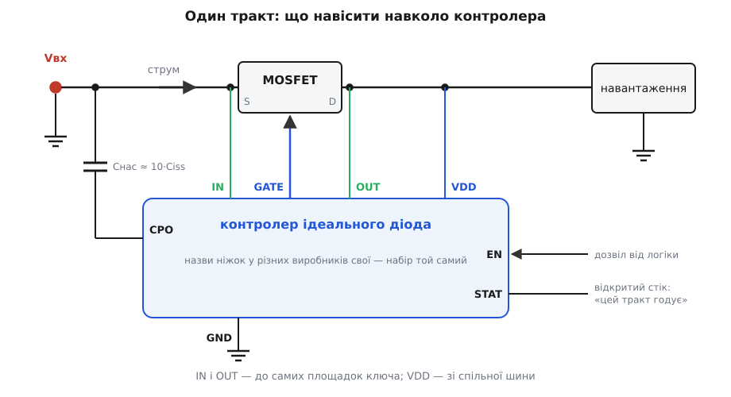
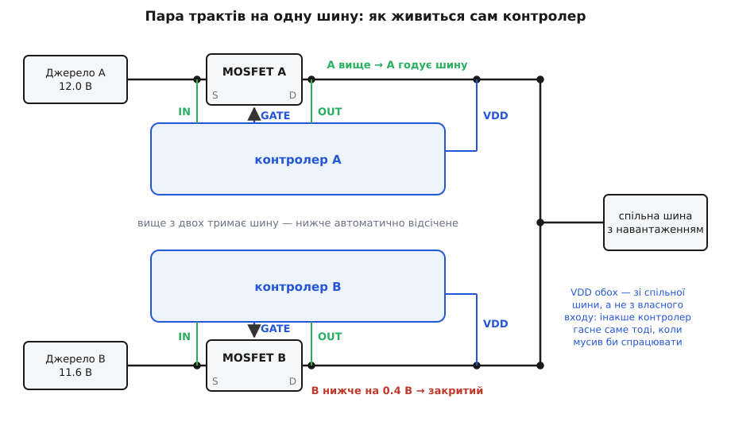

# 🔌 Клас пристрою: контролер ідеального діода

У цієї мікросхеми немає жодного силового виводу — крізь неї не тече ані міліампера навантаження, — і саме тому її варто знати цілком: уся її робота вміщується в три тонкі лінії до чужого транзистора, і хто ці три лінії читає, той читає схему.

Клас упізнається з підписів. `IN`, `OUT`, `GATE`, `VDD`, `GND` — оця п'ятірка повторюється від виробника до виробника майже слово в слово, бо вона не чиясь фірмова вигадка, а мінімальний набір, без якого річ просто не працює. Побачивши коло силового ключа дрібний корпус, від якого дві тонкі доріжки біжать до двох кінців цього ключа, а третя — до його затвора, ви вже знаєте, що там стоїть і навіщо.

### Абетка виводів

Назви розходяться, вузли — ні. В одних виробників це `IN`/`OUT`, в інших `VS`/`VD` (від source/drain), у третіх прямо `ANODE`/`CATHODE`. Але за будь-яким підписом ховаються ті самі дві точки: витік і стік [силового ключа](book:electronics/mosfet-power-switch), який ви поставите зовні. Тому клас читається навіть із незнайомої схеми — шукайте пару, що йде до двох кінців однієї деталі.

Восьмививідний корпус — канонічна форма. Нумерація в різних виробників своя, тож запам'ятовувати треба не номери, а набір:

```
             ┌────────U────────┐
    VDD   1 ─┤●                ├─ 8   GATE   затвор зовнішнього ключа
    IN    2 ─┤                 ├─ 7   OUT    стік ключа / спільна шина
    EN    3 ─┤                 ├─ 6   CPO    бак зарядного насоса
    GND   4 ─┤                 ├─ 5   STAT   «цей тракт годує» (відкритий стік)
             └─────────────────┘
```

- **`IN`** — анод майбутнього діода й водночас витік ключа. Вхід майже цілком вимірювальний: у сталому режимі крізь нього тече хіба що власне споживання чипа.
- **`OUT`** — катод, тобто стік ключа, а в схемі з кількома джерелами — ще й спільна шина. Другий кінець того самого мілівольтового вимірювання.
- **`GATE`** — єдиний вихід, що робить хоч якусь роботу. Угору його тягне слабеньке джерело струму від зарядного насоса, униз — сильний розрядник.
- **`VDD`** — живлення самого чипа. Здається дрібницею, а насправді це найважливіший вибір у всій схемі, і помиляються тут частіше, ніж деінде.
- **`GND`** — опора внутрішньої схеми.
- **`CPO`** — вивід бака [зарядного насоса](book:electronics/charge-pump): насос — це схема, що робить напругу вищу за живлення, і йому потрібен зовнішній конденсатор, куди накачувати заряд, перш ніж вилити його на затвор.
- **`EN`** — дозвіл. Заборонили — і чип замикає затвор на витік внутрішнім ключем, тобто ключ гарантовано закритий. Полярність у виробників різна, дивіться паспорт.
- **`STAT`** (або `FLT`, `PG`) — вихід із [відкритим стоком](book:electronics/open-drain), який притискається, поки цей тракт проводить уперед. Відкритий стік тут не примха: кілька таких виводів збираються монтажним І в одну лінію, і тоді процесор одним дротом бачить, чи годує шину хоч хтось.

Тепер погляньте на **геометрію** списку. `IN`, `GATE` і `OUT` — три сусіди, і всі троє йдуть до **однієї деталі**. Виробник поставив їх поруч не для краси: `IN` і `OUT` — це [Кельвінова пара](book:electronics/kelvin-connection), тобто два окремі тонкі провідники до самих площадок ключа, які нічого не несуть, крім вимірювання. Розпіновка вже містить у собі підказку про розводку: виводи, що стоять поруч, і на платі мусять іти поруч.

### Один тракт: що навісити


*Один тракт цілком. `IN` і `OUT` — тонка Кельвінова пара просто до площадок ключа; `GATE` — до затвора; `CPO` — бак насоса, конденсатор на витік; `VDD` береться зі спільної шини після ключа, а не з власного входу. `EN` і `STAT` — дозвіл і доповідь, обидва не обов'язкові для роботи.*

Зовнішніх деталей клас лишає обмаль, і кожна з них — це число, а не «поставте будь-який».

**Ключ.** N-канальний, у плюсовому проводі, витоком до входу. Обирають його за [опором відкритого каналу](book:electronics/rds-on), бо саме він задає падіння на великих струмах, і за напругою стік–витік з добрим запасом: у мить, коли контролер закриває ключ на аварії, вся різниця між шиною й мертвим джерелом лягає на цей транзистор.

**Конденсатор на `CPO`.** Паспорти цього класу радять брати його приблизно вдесятеро більшим за вхідну ємність ключа, і за цим правилом стоїть проста арифметика поділу заряду. Насос накачує бак до якоїсь напруги, а тоді сполучає його із затвором — і заряд ділиться між двома ємностями, тож напруга сідає у відношенні `Cбак / (Cбак + Ciss)`. Візьмете рівні ємності — затвор отримає половину, і ключ ледь прочиниться. Візьмете вдесятеро більший бак — затвор отримає 91 % за один такт. Ось звідки взялася десятка, і ось чому [ємність затвора](book:electronics/gate-capacitance) конкретного ключа тут доводиться дивитися, а не вгадувати.

**Живлення `VDD`.** Найтонше місце. Здається природним узяти живлення з власного входу — річ же стоїть на вході. Але подумайте, коли цей чип найпотрібніший: рівно тоді, коли його вхід просів чи закоротився. Живлення з входу означає, що чип помирає в ту саму мить, коли має спрацювати. Тому `VDD` беруть **з `OUT`**, зі спільної шини, яку тримають інші джерела: доки на шині є напруга, контролер живий і може закрити свій ключ. Високовольтні прилади цього класу так прямо в паспорті й нормуються — з `VDD`, з'єднаним з `OUT`.

**Нічого на затворі.** І це — головна порада щодо обв'язки. Спокуса причепити до `GATE` резистор «щоб не дзвеніло» або конденсатор «для м'якості» тут коштує рівно тієї властивості, заради якої клас і брали. У паспортах струм підйому затвора — одиниці–десятки мікроампер (типово близько 20 мкА), а струм розряду — від сотень міліампер до кількох ампер. Ця асиметрія в десятки тисяч разів і є суттю приладу: угору повільно, бо нікуди поспішати, униз блискавично, бо там аварія. Усе, що ви додасте на цей вузол, обидва часи подовжить пропорційно — але подовження в мікросекундному напрямку болить, а в мілісекундному ні.

**Ключ 3 нФ вхідної ємності, підйом 20 мкА, розряд 1.5 А, робоча напруга на затворі 10 В. Скільки триває вмикання й вимикання і що з ними зробить «нешкідливий» конденсатор на 10 нФ?**

```text
Підняти затвор:
  t_вмик = Ciss·Vgs / I_підйом
         = 3·10⁻⁹ · 10 / 20·10⁻⁶ = 1.5·10⁻³ с = 1.5 мс

Скинути затвор:
  t_розряд = Ciss·Vgs / I_розряд
           = 3·10⁻⁹ · 10 / 1.5 = 20·10⁻⁹ с = 20 нс
  паспортні 0.3–1 мкс — решта це затримка компаратора, а не сам розряд

Бак насоса:
  C_CPO ≈ 10·Ciss = 30 нФ → зі стандартного ряду 33 нФ
  доля затвора за один такт: 30/(30+3) = 0.91

Додаємо «для порядку» 10 нФ від затвора до витоку:
  t_вмик   = 13·10⁻⁹ · 10 / 20·10⁻⁶ = 6.5 мс   (у 4.3 раза довше)
  t_розряд = 13·10⁻⁹ · 10 / 1.5     = 87 нс    (у 4.3 раза довше)
```

Дивіться на два останні рядки уважно. Вмикання поповзло з 1.5 мс до 6.5 мс — і цього ніхто не помітить, бо там і так мілісекунди. А розряд поповз із 20 нс до 87 нс, і ось це вже з'їло помітну частку паспортної мікросекунди — тієї самої, за яку в шину не встигає перетекти зворотний струм. Рахувати, до речі, чесніше не за `Ciss`, а за повним зарядом затвора з паспорта ключа: вхідна ємність нелінійна й гуляє з напругою, тож формула вище — оцінка порядку, а не істина.

> 🔧 **Навіщо це.** Тримайте цю асиметрію в голові, читаючи будь-який паспорт класу. Кожен рядок характеристик — відповідь на питання «хто, коли й як сильно смикає затвор». Струм підйому — як довго ключ прокидається. Струм розряду — як швидко він гине. Ціль прямого падіння — де стоїть робоча точка, з якої видно розворот. Більше в тому паспорті майже нічого й немає.

### Пара на одну шину

Найчастіше цих мікросхем на платі дві або більше — по одній на кожне джерело, а їхні `OUT` зведено в один вузол. Це і є [об'єднання джерел](book:electronics/power-oring): вище з двох тримає шину, нижче стоїть закрите й чекає.


*Два однакові тракти зі зведеними докупи `OUT`. Ключове тут не сама розв'язка, а звідки живляться чипи: `VDD` обох узято зі спільної шини, тобто з того самого вузла, що після ключів. Тоді зникнення будь-якого джерела не знеструмлює свій контролер — його годують сусіди.*

Три речі в цій схемі не видно, поки не наступиш.

**Розрядний струм затвора повертається крізь `IN`.** Коли контролер рве затвор униз, ті ампери мусять кудись подітися — і паспорти цього класу прямо кажуть, що вони йдуть у вивід `IN`. Отже `IN` — не зовсім вимірювальний вивід: під час аварії він на частку мікросекунди стає силовим. Наслідок практичний: між `IN` і площадкою витоку не можна ставити ані резистора «для розв'язки», ані довгої тонкої доріжки. Поставите — і швидке закривання перестане бути швидким, бо струму нема куди текти.

**`STAT` — це готова телеметрія, і вона безкоштовна.** На парі трактів два таких виводи кажуть процесорові, хто зараз годує плату. Різниця між «плата працює» і «плата вже пів року працює від резерву, бо основне джерело здохло» — це рівно один дріт. Резервування, про яке ніхто не знає, що воно вже витрачене, — не резервування.

**Коли джерела майже рівні.** Ось де активна петля виграє в діода не швидкістю, а витримкою. Якщо різниця напруг двох джерел менша за ціль прямого падіння (а це кількадесят мілівольт), обидва ключі стоять привідкриті й обидва джерела віддають струм, а поділ між ними задають дрібні розбіжності. Голий компаратор у такій ситуації клацав би без кінця; лінійна петля просто сідає в проміжну точку й тримається. На всяк випадок у компаратора звороту є ще й гістерезис — типово 5–10 мВ, і ця цифра варта того, щоб її запам'ятати: це **весь ваш бюджет на шум** у сенсорній парі.

Зверніть увагу, чого клас **не** робить: він не вирівнює навантаження між джерелами. Вище джерело за звичайних умов забирає все, і якщо вам треба, щоб два блоки живлення несли по половині, це вже інша задача — [розподіл струму між паралельними джерелами](book:electronics/current-sharing), і всередині класу для неї є окрема гілка.

### Перше вмикання

Байта тут немає — є перші мілівольти. І перша засторога: не заводьте цю схему одразу на робочій шині з реальним навантаженням. Не тому, що небезпечно, а тому, що на робочій шині ви **нічого не побачите**: усе цікаве в цьому класі має розмах у кількадесят мілівольт на тлі десятків вольтів.

1. **Стенд, низька напруга, резистор замість плати.** Одне джерело, один тракт. Струм задирайте поступово.
2. **Зміряйте пряме падіння вольтметром**, а не осцилографом: постійні 25 мВ на тлі 12 В осцилограф просто не покаже, а дешевий мультиметр на межі мілівольтів покаже чудово. Щупи — просто на площадки ключа, не на роз'єм.
3. **Пройдіть струмом крізь коліно.** Піднімайте струм і дивіться на те саме падіння: спершу воно стоїть на місці, потім починає рости пропорційно струму. Побачили злам — петля жива, і ви щойно виміряли її ціль і опір свого ключа за одним махом.
4. **Погляньте на затвор — але тільки щупом ×10.** Це не порада зі стилю, це арифметика: щуп ×1 має вхідний опір близько 1 МОм, а затвор сидить приблизно на 22 В над землею при 12-вольтовій шині. Отже щуп потягне з нього 22 мкА — більше, ніж увесь струм підйому насоса. Ключ закриється просто від того, що ви до нього доторкнулися, а ви годину шукатимете, чому схема не працює саме тоді, коли ви на неї дивитеся.
5. **Перевірте `STAT`** — він мусить бути притиснутий, поки тракт проводить.
6. **Аж тепер зробіть аварію навмисне.** Закоротіть вхід (не вихід!) чимось, що переживе дослід, і зловіть на осцилографі струм у ключі. Оце і є те, за що ви платили: ширина зворотного імпульсу. Аварію, якої ви жодного разу не влаштували на столі, за вас влаштує замовник.
7. **Далі — два джерела.** Поміняйте, котре з них вище, і подивіться на передачу: шина не мусить провалюватися, а `STAT` мусять перемкнутися. Зведіть напруги майже впритул і переконайтеся, що нічого не деренчить.

### Типові граблі

**Транзистор поставлено задом наперед.** Найдорожча помилка класу, і найпідступніша, бо на платі її не видно: корпус той самий, площадки ті самі, монтаж бездоганний.


*Ліворуч — витік до входу: паралельний каналові [body-діод](book:electronics/body-diode) дивиться вперед, тож до відкриття каналу струм іде крізь нього, а зворотний він блокує. Праворуч ключ розвернуто — і той самий body-діод дивиться назад: зворотний струм тече повз закритий канал завжди, і жодне керування затвором цьому не зарадить.*

Симптом розпізнається одразу, якщо знати, що шукати: схема ніби працює, падіння нормальне, а зворотний струм не блокується взагалі. Перевірити можна не вмикаючи живлення: мультиметр у режимі перевірки діода, щупи просто на площадки ключа. Уперед мусить бути падіння близько 0.5 В, назад — обрив.

**`VDD` узято з власного входу.** Схема працює бездоганно рік, а тоді один-єдиний раз, коли основне джерело закорочується, контролер знеструмлюється разом із ним і не встигає нічого закрити. Захист, який гасне від тієї самої аварії, від якої мав рятувати, — це не захист.

**Довга сенсорна пара або велика петля між `IN` і `OUT`.** Тут вимірюються мілівольти, а бюджет на шум — той самий гістерезис у 5–10 мВ. Довгі доріжки додають дві біди одразу. По-перше, власний опір міді додається до опору ключа й зсуває точку, де петля вважає струм великим. По-друге, і гірше: площа між двома провідниками ловить `L·di/dt` від сусідніх імпульсних кіл, і контролер бачить сплеск, якого в струмі не було. Наслідок — хибне закривання: шина на мить провалюється «просто так», і шукати таке по журналах марно. Дві тонкі доріжки поруч, від самих площадок, без перехідних отворів — [розводка](book:electronics/pcb-layout) тут частина схеми, а не її оформлення.

**Чекати від класу обмеження кидка струму.** Найпоширеніша хибна надія. Контролер стежить лише за **напрямом**; струм уперед він вважає нормальним, хай який. Коли плату під'єднують до живої шини на розряджену ємність, спершу відкривається body-діод — миттєво й без жодного керування, — а тоді ще й канал.

```text
Гаряче під'єднання на розряджену ємність 470 мкФ, вхід 12 В.
Опір усього шляху (джерело + дроти + доріжки + body-діод) ≈ 50 мОм:

  I_пік ≈ (12 − 0.7) / 0.05 = 226 А

Заряд, який мусить пролетіти:
  Q = C·U = 470·10⁻⁶ · 12 = 5.6·10⁻³ Кл
  за 100 мкс середній струм = 56 А

Контролер не бачить у цьому нічого поганого: струм іде ВПЕРЕД.
Обмежувати його нема чим — у класі немає ані шунта, ані таймера.
```

Проти [кидка при вмиканні](book:electronics/inrush-current) працює інший клас — [контролер hot-swap](book:electronics/hot-swap) чи [електронний запобіжник](book:electronics/efuse), — і ставлять його **послідовно** з ідеальним діодом, а не замість нього. Ці двоє роблять різні роботи: один не пускає струм назад, другий не пускає його вперед надто швидко.

**Чекати захисту від переполюсування.** Один ключ блокує зворотний **струм**, але не зворотну **напругу**: подайте на вхід мінус — і body-діод, для якого ця напруга пряма, слухняно пропустить її на плату. Для блокування в обидва боки потрібна [пара спина-до-спини](book:electronics/mosfet-back-to-back), і саме тому [захист від переполюсування](book:electronics/reverse-polarity-protection) — окрема гілка класу, а не безкоштовний додаток.

**Забути про стелю на затворі.** Насос піднімає затвор на 10–15 В над витоком, і це задано в чипі, а не у вас. Ключ мусить таку різницю тримати — а [logic-level-транзистори](book:electronics/logic-level-mosfet) з паспортною стелею 12 В тут стоять на межі. Зворотний бік тієї ж монети: на низьких шинах контролер мусить із трьох вольтів зробити тринадцять, і не кожен прилад класу це вміє.

**Низька шина й [блокування за низькою напругою](book:electronics/uvlo).** Поки `VDD` не доросло до порога, чип затвор не відкриває — і струм навантаження чесно тече крізь body-діод, гріючи ключ добутком 0.5 В на весь струм плати. Симптом дивовижний: на 12 В усе холодне, на 3.3 В ключ пече пальці.

### Варіації класу

Риси комбінуються майже вільно, і кількох осей досить, щоб описати будь-який прилад класу.

**Скільки інтегровано.** Класична форма — контролер плюс зовнішній ключ: струм обмежений лише тим, що ви припаяли, а Кельвінову пару доводиться розводити самому. Друга форма — ключ усередині кристала: стеля в кілька–кільканадцять ампер, зате вимірювання зроблено на кристалі, і цілий пласт помилок розводки зникає разом із можливістю їх зробити. Є й проміжна: контролер із насосом усередині, але ключ зовні.

**Один ключ чи пара.** Один — це діод, і тільки діод. Пара спина-до-спини (стоками докупи, а вимірювальний вивід — у їхню спільну точку) — це вже повноцінний двобічний ключ: він і зворотний струм рве, і зворотну полярність тримає, і вмикається-вимикається за командою, і вміє відрубати плату від перенапруги на вході.

**Полярність шини.** У плюсовому варіанті ключ стоїть у плюсовому проводі, витік їде вгору за шиною, і без насоса не обійтися. У телекомівському варіанті на −48 В усе інакше: контролер живе відносно найвід'ємнішого вузла, ключ сидить у зворотному проводі, його витік — на тій самій опорі, що й сам чип, тож затвор треба підняти лише на звичайні дванадцять вольтів над місцевою землею. Та сама абетка виводів, та сама ціль у кількадесят мілівольт — а нутрощі різні, бо різне питання «відносно чого».

**Як визначають зворот.** Дві школи. Лінійна петля тримає пряме падіння на цілі й тим завжди має визначену робочу точку — передача між джерелами виходить гладенькою, без деренчання. Чистий компаратор просто порівнює знак і рве — виходить швидше, зате потрібен гістерезис і акуратна розводка. Деякі виробники продають обидві схеми як два виконання того самого приладу, і вибір між ними — це вибір між гладкістю й мікросекундами.

**Що ще напхали в корпус.** Найпоширеніший сусід — [hot-swap](book:electronics/hot-swap) у тому самому кристалі: одна річ і плату вставляє з обмеженим кидком, і два джерела об'єднує. Далі — відсічка за перенапругою на вході, вимірювання струму з виходом на АЦП, а в старших приладах і цифрова телеметрія по [шині I²C](book:communications/i2c-bus): скільки вольтів, скільки ампер, хто зараз годує й чому востаннє вимикався. Для полиці з десятками плат це різниця між «щось десь моргнуло» і журналом подій.

**Окрема гілка — балансування.** Прилади, що не просто розв'язують джерела, а навмисно **вирівнюють** їхні струми: контролер підтискає ключ сильнішого джерела рівно настільки, щоб воно віддавало стільки ж, скільки слабше. Діапазон, у якому це можливо, задають резистором, і він невеликий — сотні мілівольтів різниці, — але для двох блоків живлення, що мусять старіти рівномірно, цього досить.

### Де клас закінчується

**Це не вимикач** — доки ключ один. Вивід `EN` закриває канал, але body-діод лишається, і струм уперед крізь нього піде. «Вимкнути» в буквальному сенсі вміє лише варіант із парою ключів.

**Це не запобіжник.** У класі немає ані вимірювання абсолютного струму, ані таймера, ані порога аварії. Зворотний струм він рве, прямий — ніколи, хай той хоч удесятеро перевищує все, на що плата розрахована.

**Це не стабілізатор.** На шині буде напруга кращого з джерел мінус кількадесят мілівольт — і жодного вирівнювання між джерелами, доки ви не взяли гілку з балансуванням.

**І це не заміна доброму ключеві.** Контролер не додає транзисторові жодного вата витривалості: він лише вчасно каже йому відкритися й закритися. Розсіювана потужність, [безпечна робоча область](book:electronics/soa-power-devices) і стійкість до кидка — усе це лишається питаннями до самого ключа, і жодна мікросхема на них не відповість.
