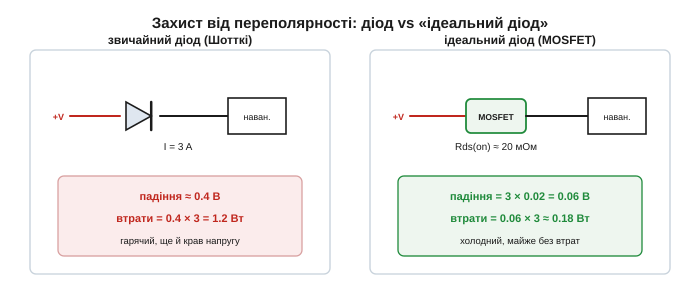
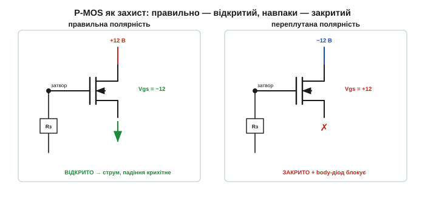

# 🔌 «Ідеальний діод»: MOSFET замість Шотткі для захисту без втрат

> Каталог «Компоненти» · сектор `active`.

### Стара проблема: переплутані полюси

Під'єднайте живлення задом наперед — і плата може згоріти. Електролітичні конденсатори стоять полярно, мікросхеми мають захисні діоди на входах живлення, і всі вони розраховані на струм лише в один бік; зворотна напруга проганяє крізь них струм, на який вони не розраховані, і щось вигорає першим. Тому майже кожен пристрій, який живиться від батареї чи зовнішнього адаптера, потребує **захисту від переполярності** (reverse-polarity protection).

Класичний захист — **послідовний діод** (series diode), увімкнений так, щоб пропускати струм лише в правильний бік. Переплутали полюси — діод зміщений у зворотному напрямку, струм не йде, плата ціла. Рішення дешеве й надійне, але має одну прикру ваду: діод завжди «з'їдає» своє падіння Vf на **повному** струмі навантаження.

Чому це падіння взагалі є? У кремнієвому PN-діоді струм тече тільки тоді, коли прикладена напруга відкриває перехід — долає дифузійний потенціал переходу, близько 0.6–0.7 В для кремнію. Діод Шотткі (метал-напівпровідник) не накопичує дірковий заряд, тому в нього немає повноцінного дифузійного потенціалу PN-переходу — лише контактна різниця у ~0.3–0.4 В, і саме тому Vf Шотткі менше. Та навіть ці 0.3–0.4 В на струмі в кілька ампер — це відчутна потужність, що йде в тепло, і просадка напруги, якої недораховує сама плата.


*Рис. На струмі 3 А діод Шотткі з падінням 0.4 В палить 1.2 Вт і краде ці 0.4 В у навантаження. MOSFET із Rds(on) ≈ 20 мОм дає падіння лише 0.06 В і втрати 0.18 Вт — усемеро менше, та ще й майже без просадки. Ось чому діод хочеться чимось замінити.*

### Заміна на MOSFET

Звідки взялася ідея замінити діод транзистором? Відкритий MOSFET — це не «вентиль» з порогом, а маленький [резистор Rds(on)](book:electronics/rds-on). А падіння на резисторі — це I·R, воно лінійне й тим менше, чим менший опір. У діода падіння Vf майже не залежить від струму (логарифмічна залежність — майже плато ~0.4 В), а в MOSFET падіння росте лінійно від нуля. На малих і середніх струмах резистор у кілька міліом завжди виграє в діода.

Пропустимо струм крізь відкритий MOSFET замість діода — і падіння стане I·Rds(on): на наших числах 3 А × 20 мОм = 0.06 В замість 0.4 В. Майже задарма. Це і є «ідеальний діод» (ideal diode): та сама поведінка на рівні схеми — пропускає струм в один бік, блокує в інший, — але втрати в рази менші. Слово «ідеальний» тут означає саме прагнення до діода з нульовим Vf.

> 🔧 **Навіщо це.** На вході живлення кожен зекономлений вольт — це і менше тепла (не треба радіатора), і вищий ККД (важливо для пристрою з акумулятора), і повна напруга на платі замість просадженої. У портативному пристрої на 3 А різниця між 0.4 В і 0.06 В — це понад ват тепла, який нікуди не доводиться відводити.

### Як воно само вмикається й вимикається

Хитрість пасивного варіанта — **самозміщений P-MOSFET** (self-biased P-MOSFET) у верхньому плечі: витік (source) на «плюс» батареї, стік (drain) на навантаження, затвор (gate) через резистор на землю.


*Рис. Правильна полярність: витік на +12 В, затвор на 0 → Vgs = −12 В → P-MOS повністю відкритий, падіння крихітне. (Спершу струм навіть біжить крізь body-діод уперед, а потім канал його шунтує — без мертвого часу.) Переплутана: батарея навпаки → Vgs стає додатним → P-MOS закривається, а його body-діод тепер дивиться так, що блокує зворотний струм. Плата ціла.*

Щоб зрозуміти, **чому** ця схема сама вмикається в правильний бік і сама вимикається в неправильний, треба згадати, чим керується P-MOSFET. P-канал відкривається, коли затвор стає **нижчим** за витік: Vgs від'ємне й за модулем перевищує поріг |Vth| (для логічного рівня — кілька вольтів). Чим від'ємніше Vgs, тим ширший канал і менший Rds(on). А ключова річ у самозміщенні: **витік прив'язаний до плюса входу, а затвор — резистором до землі**, тож Vgs формується самою вхідною напругою.

Розгорнемо обидва випадки причинно.

**Правильна полярність.** Плюс батареї заходить на витік. У перший момент канал ще закритий, але струм має куди йти: body-діод P-MOSFET орієнтований від витока до стока, тобто **вперед** — він проводить, і навантаження одразу отримує живлення (з падінням ~0.5 В на цьому body-діоді). Тим часом витік сидить на +12 В, а затвор резистор тримає коло 0 В. Отже Vgs = Vgate − Vsource ≈ 0 − 12 = −12 В. Це глибоко від'ємне Vgs, |Vgs| ≫ |Vth| — канал розкривається повністю. Як тільки канал відкрився, його малий Rds(on) **шунтує** body-діод: струм перетікає з діода в канал, бо так менший опір і менше падіння. Перехід безшовний, без «мертвого часу» — спершу веде діод, потім його перехоплює канал.

**Переплутана полярність.** Тепер на витік приходить мінус батареї (тобто витік нижче землі). Затвор так само притягнутий резистором приблизно до землі — отже тепер затвор **вищий** за витік, Vgs стає **додатним**. Для P-каналу додатне Vgs — це команда «закрийся»: канал щільно перекритий, провідного шляху крізь транзистор немає. Залишається body-діод — але при зворотній батареї він тепер зміщений у **зворотному** напрямку (його катод опинився на вищому потенціалі), тож і він струму не пропускає. Жодного шляху для зворотного струму — плата ізольована й ціла.

Так і виходить «само вмикається й вимикається»: одна й та сама прив'язка затвора резистором до землі дає глибоко від'ємне Vgs у правильній полярності (повне відкриття) і додатне Vgs у переплутаній (повне закриття). Логіки, мікросхем, окремого живлення — не треба; усе робить сама вхідна напруга. Резистор затвора лише обмежує кидок струму заряду затвора й працює в парі зі стабілітроном, що береже затвор від завеликої напруги; постійного струму крізь нього майже немає, бо затвор MOSFET — це ізольований конденсатор.

Ключова деталь — орієнтація body-діода ([вставка про нього](book:electronics/ideal-diode/comp-body-diode.md)): у цій схемі він блокує саме зворотний струм, а не пропускає його. Якби P-MOSFET увімкнули «навпаки» (стоком на плюс), body-діод дивився б у зворотний бік і пропускав би зворотний струм навіть при закритому каналі — захист би не працював. Тому орієнтація транзистора тут не косметична, а принципова.

### Скільки саме економимо: розрахунок втрат

Аналогію «MOSFET кращий за діод» варто підкріпити числами, бо виграш не безмежний — на дуже великому струмі картина змінюється. Порахуймо для типового портативного входу.

**Вхід живлення 12 В, струм навантаження 3 А. Порівняти діод Шотткі (Vf = 0.4 В) і P-MOSFET (Rds(on) = 20 мОм при робочій температурі).**

```text
Діод Шотткі:
  Падіння       Vf      = 0.40 В            (майже не залежить від I)
  Втрати        P_diode = Vf · I
                        = 0.40 · 3   = 1.20 Вт
  Просадка на платі     = 0.40 В → плата бачить 11.6 В замість 12

MOSFET «ідеальний діод»:
  Падіння       Vds     = I · Rds(on)
                        = 3 · 0.020  = 0.060 В
  Втрати        P_mos   = I² · Rds(on)
                        = 3² · 0.020 = 0.18 Вт
  Просадка на платі     = 0.060 В → плата бачить 11.94 В

Виграш:
  Менше падіння         0.40 / 0.060 ≈ 6.7×
  Менше тепла           1.20 / 0.18  ≈ 6.7×
```

Втрати на MOSFET ростуть як **I²**, а на діоді — лінійно (≈ Vf·I), тож існує струм рівноваги, де вони зрівнюються: коли I·Rds(on) = Vf, тобто I = Vf / Rds(on) = 0.40 / 0.020 = 20 А. Нижче 20 А виграє MOSFET, вище — формально вже діод (хоч на таких струмах беруть просто кілька MOSFET паралельно, ділячи опір). Для майже всіх портативних і вбудованих застосувань робочий струм на порядок менший за цю точку, тому MOSFET виграє з великим запасом.

І ще одна тонкість, що ховається в «при робочій температурі». Rds(on) кремнієвого MOSFET росте з нагрівом — приблизно вдвічі від 25 °C до 100–125 °C. Гарячий транзистор має більший опір, більше падіння й більше тепла — отже в розрахунку треба брати **гаряче** Rds(on) з даташита, а не кімнатне, інакше реальні втрати будуть удвічі вищі за очікувані. Це той самий механізм позитивного температурного коефіцієнта, що дозволяє MOSFET-и паралелити: гарячіший прилад трохи «відштовхує» від себе струм.

### «Ідеальний діод» із контролером

Пасивна самозміщена схема проста, але обмежена. Чому взагалі тягнутися до окремої мікросхеми, якщо одного P-MOSFET із резистором уже досить? Бо пасивна схема не вміє трьох речей: вона не блокує **зворотний** струм (body-діод завжди веде вперед), вона **повільно** закривається й вона не дотягує падіння до десятків мілівольт, бо |Vgs| прив'язане до вхідної напруги й на низькому Vin канал відкривається не повністю.

Тому роблять спеціальні **мікросхеми-контролери «ідеального діода»** (ideal-diode controller): вони активно керують затвором, стежать за напрямком струму (вимірюючи падіння Vds як мікровольтметр), реагують за мікросекунди й тримають Vgs у безпечному й оптимальному діапазоні. Контролер навмисно підтримує крихітне пряме падіння — порядку ~20 мВ — як ціль регулювання: щойно Vds впаде нижче, він трохи прикриває затвор, щойно зросте — підкручує, утримуючи MOSFET у потрібній точці незалежно від струму й температури. А коли струм намагається піти **назад**, контролер за мікросекунди повністю закриває затвор — те, чого пасивна схема з її body-діодом не вміє в принципі.

Саме ця здатність блокувати зворотний струм робить контролери інструментом для **об'єднання джерел** (power ORing): два входи (наприклад, батарея + USB) заводять кожен через свій «ідеальний діод» на спільну шину. Вищий з двох тримає шину, нижчий автоматично відсікається, а коли вищий зникає — другий миттю підхоплює навантаження. Звичайні діоди робили б те саме, але палили б Vf·I на кожному вході постійно; контролери роблять це майже без втрат і без ризику, що струм потече з сильнішого джерела назад у слабше.

### Типові граблі

**Body-діод усе одно проводить уперед.** Пасивна схема блокує лише зворотний бік; уперед через body-діод струм пройде завжди, навіть коли канал ще не відкрився. Зазвичай це нешкідливо (саме так і починається ввімкнення), але означає, що пасивний «ідеальний діод» **не** ізолює вхід у прямому напрямку — для справді двостороннього блокування (чи об'єднання джерел) потрібен контролер або пара MOSFET-ів спина-до-спини (back-to-back), де два body-діоди дивляться назустріч і разом перекривають обидва напрямки.

**Межа Vgs при високому Vin.** У самозміщеній схемі Vgs дорівнює (з протилежним знаком) вхідній напрузі. Затвор-витік MOSFET витримує лише ±20 В (типово), тож на вході 24 чи 36 В Vgs перевищить цю межу й проб'є тонкий підзатворний оксид — транзистор загине. Та сама пересторога, що й у [ключа живлення](book:electronics/ideal-diode/comp-pmos-load-switch.md): при високій вхідній напрузі затвор треба берегти стабілітроном (Zener) між затвором і витоком, який «зрізає» Vgs до безпечних ~10–12 В, а резистор затвора задає на ньому потрібний струм.

**Пасивний реагує повільно.** Закривання каналу — це розряд ємності затвора крізь резистор; стала часу R·Cgs може бути одиниці-десятки мікросекунд. Різкий зворотний імпульс (наприклад, при гарячому від'єднанні джерела поруч) може прослизнути крізь канал, поки затвор іще не закрився. Контролер устигає швидше, бо активно й сильно «висмикує» заряд із затвора.

**Бери низькоомний прилад.** Уся вигода — у малому падінні I·Rds(on), тож обирайте MOSFET із малим Rds(on), причому **відкритий саме вашою напругою**: на низьковольтному вході (3.3–5 В) потрібен логічний рівень ([логічний рівень](book:electronics/ideal-diode/comp-logic-level.md)), інакше |Vgs| не дотягне до повного відкриття й Rds(on) виявиться в рази більшим за паспортний.

### Варіації

На нижньому плечі захист можна зробити дешевшим N-MOSFET (за однакову ціну й розмір N-канал дає менший Rds(on), бо рухливість електронів вища за рухливість дірок). Але нижньоплечий ключ розриває «землю» — а земля зазвичай має бути спільною й недоторканою (через неї йдуть сигнали, екрани, USB-оплетка), тож розрив землі майже завжди небажаний. Тому панує верхньобічний P-MOSFET: він трохи дорожчий і має більший опір, зате лишає землю недоторканою. А де треба швидкість, об'єднання джерел чи мінімальне падіння — беруть готовий контролер ідеального діода (часто з N-MOSFET у верхньому плечі та вбудованим зарядним насосом, що піднімає напругу на затворі вище входу).

> 🔧 **Навіщо це.** Захист від переполярності потрібен майже кожному пристрою з батареєю чи зовнішнім живленням. Простий послідовний діод працює, але на чималому струмі гріється й краде напругу. «Ідеальний діод» на MOSFET робить те саме майже задарма: P-MOS у плюсовому проводі, затвор через резистор на землю — правильна полярність дає Vgs ≈ −Vin і відкриває канал, переплутана робить Vgs додатним і закриває його, а body-діод при цьому ще й блокує зворотний бік. На 3 А це 0.18 Вт замість 1.2 Вт. А де важить швидкість чи об'єднання джерел — є готові мікросхеми-контролери.
