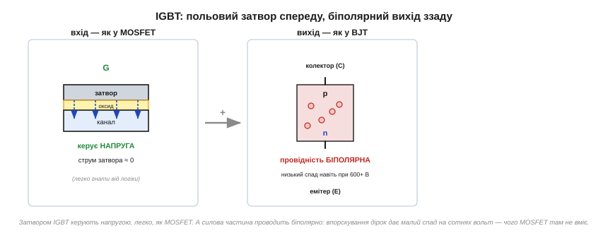

# IGBT: гібрид MOSFET і BJT для великих потужностей

У силовій техніці є два табори. [Біполярний транзистор](book:electronics/bjt-operation) — провідність чудова, спад малий навіть на великих струмах, але керується **струмом**, якого на потужному приладі треба багато. [MOSFET](book:electronics/mosfet-power-switch) — керується **напругою**, майже задарма, але на високій напрузі його [опір у відкритому стані Rds(on)](book:electronics/rds-on) стає завеликим, і прилад надто гріється. А що, як **поєднати** найкраще з обох — польове керування **і** біполярну провідність? Саме це робить **IGBT** *(insulated-gate bipolar transistor — біполярний транзистор з ізольованим затвором)*.

### Польовий вхід, біполярний вихід

Назва IGBT — це майже повний опис будови. «Insulated-gate» (ізольований затвор) — це **вхід від MOSFET**: керівний електрод відділений від кристала [шаром оксиду](book:electronics/mosfet-structure), тож керується прилад **напругою** й у статиці струму в затвор не споживає. «Bipolar transistor» — це **вихід від BJT**: силова частина проводить струм біполярно, з впорскуванням носіїв, як у звичайному біполярному транзисторі.

Сполучаються вони так: вхідний польовий «каскад» не сам комутує силовий струм, а лише **відмикає** внутрішній біполярний транзистор, який і несе все навантаження. Виходить прилад, яким керують легко, як MOSFET, а проводить він з малим спадом, як BJT.


*Рис. Вхід IGBT влаштований як у MOSFET (затвор–оксид–канал, керує напруга, струм затвора ≈ 0), а силова частина проводить біполярно — з впорскуванням дірок, що дає малий спад навіть на сотнях вольт. Виводи звуть, як у біполярного: затвор (G), колектор (C), емітер (E).*

Виводи IGBT називають за біполярною частиною: **затвор** *(gate, G)* — як у MOSFET, а силові — **колектор** *(collector, C)* і **емітер** *(emitter, E)*, як у BJT. Це гарне нагадування про подвійну природу приладу: G — від польового світу, C і E — від біполярного.

Що означає «польове керування» на практиці? Те саме, що й у [MOSFET](book:electronics/gate-capacitance): затвор IGBT — це **ємність**, і керувати ним треба не струмом, а **напругою**, заряджаючи й розряджаючи цю ємність. У статиці струм у затвор не тече — тримати IGBT відкритим задарма. Але перемикати швидко означає раз у раз перезаряджати немалу ємність затвора, а для цього потрібен окремий [**драйвер затвора**](book:electronics/gate-capacitance) — мікросхема, здатна видати короткі імпульси струму в кілька ампер. Просто з ніжки мікроконтролера потужний IGBT не «розгойдати»: вона не дасть струму, щоб швидко зарядити затвор, і прилад перемикатиметься мляво, перегріваючись на фронтах. Тому між логікою й затвором IGBT майже завжди стоїть драйвер — часто ще й ізольований, бо емітер силового IGBT «плаває» під мережевою напругою.

> 🔧 **Навіщо це.** IGBT розв'язує болючий компроміс силової техніки. Раніше доводилось вибирати: або легке керування (MOSFET), але з великими втратами на високій напрузі, або малі втрати (BJT), але з важким струмовим керуванням. IGBT дає **і те, і те**: затвором керують напругою (легко гнати навіть від драйвера логіки), а спад на відкритому приладі лишається малим попри сотні вольт. Тому IGBT — серце майже всієї великої силової електроніки.

### Чому біполярна провідність виграє на високій напрузі

Щоб зрозуміти, навіщо взагалі гібрид, варто придивитися, чому MOSFET «здає» на високій напрузі. Аби MOSFET витримував, скажімо, 600 В, його канал мусить мати **товстий, слабо легований** збіднений шар — а саме він і створює опір. Що вища робоча напруга, то товщий шар і **тим більший Rds(on)** — зростає різко, мало не як квадрат напруги. Високовольтний MOSFET виходить «опірним» і гарячим на великому струмі.

Біполярна ж провідність працює інакше: у відкритому стані область наповнюється **впорснутими носіями обох знаків** (і електронами, і дірками — це звуть **модуляцією провідності**), і завдяки цьому навіть товстий шар проводить добре. Спад напруги на IGBT майже **не залежить** від струму так сильно, як у MOSFET, — він лишається в районі ~1.5…2.5 В у широкому діапазоні струмів. Тому на високій напрузі й великому струмі IGBT віддає набагато менше тепла, ніж MOSFET тих самих габаритів.


*Рис. У MOSFET спад U = I·Rds(on) — пряма від нуля, що круто росте зі струмом (особливо у високовольтних). У IGBT спад починається з порогу ~0.8 В, але далі майже не росте. Тому на малих струмах вигідніший MOSFET (нема початкового порогу), а на великих — IGBT (спад не злітає).*

### Де проходить межа MOSFET / IGBT

З двох кривих на рисунку випливає проста картина вибору. На **малих** струмах MOSFET кращий: його спад починається з нуля, тоді як IGBT має «вступний внесок» ~0.8 В, який треба сплатити завжди. Але зі зростанням струму пряма MOSFET круто йде вгору й перетинає пологу криву IGBT — і далі IGBT вже вигідніший. Додаймо ще напругу й частоту — і межа окреслюється так:

- **MOSFET** панує там, де **нижча напруга** (приблизно до кількох сотень вольт) і **вищі частоти** перемикання (десятки кГц і вище). Він перемикається швидше й чисто, бо не має повільного «хвоста» вимикання.
- **IGBT** панує там, де **висока напруга** (сотні вольт — кіловольти) **і** великий струм одночасно, а частоти помірні (одиниці — десятки кГц). Це приводи двигунів, інвертори сонячних станцій, зварювальні апарати, індукційні плити, тягові перетворювачі електротранспорту.

Варто згадати, що ця межа останніми роками **зрушується**. З'явилися силові ключі на **широкозонних напівпровідниках** — карбіді кремнію *(SiC)* і нітриді галію *(GaN)* — замість звичайного кремнію. Їхня перевага саме там, де кремнієвий MOSFET «здавав»: вони тримають високу напругу з малим опором і перемикаються швидко й чисто. Фактично SiC-MOSFET відвойовує в IGBT частину його території — високовольтні застосування на підвищених частотах (зарядні станції електромобілів, сонячні інвертори), де він дає вищий ККД. Це нагадування, що «межа MOSFET/IGBT» — не закон природи, а інженерний компроміс **для конкретних матеріалів**: зміниться матеріал — зміститься й межа. Кремнієвий поділ, який ми описали, лишається базовим орієнтиром, але світ силових приладів не стоїть на місці.

Чому IGBT не любить дуже високих частот? Бо біполярна провідність має зворотний бік: при вимиканні впорснуті носії не зникають миттєво — лишається **«хвіст струму»** *(tail current)*, що тягнеться ще якийсь час і додає втрат на кожному перемиканні. На низьких частотах це дрібниця, на дуже високих — суттєвий нагрів. MOSFET такого хвоста не має, тому й виграє на високих частотах.

Тут варто розрізнити два роди втрат, бо саме їхній баланс і визначає межу. **Втрати провідності** *(conduction losses)* — це тепло, поки ключ відкритий (спад напруги × струм); вони залежать від навантаження, а не від частоти. **Втрати перемикання** *(switching losses)* — це енергія, що згоряє на кожному фронті вмикання й вимикання, поки напруга й струм на ключі одночасно ненульові; вони множаться на **частоту**, бо що частіше перемикаєш, то більше таких фронтів за секунду. У IGBT втрати провідності малі (біполярна перевага), зате втрати перемикання великі (хвіст струму). У MOSFET навпаки: провідність на високій напрузі дорога, зате перемикання чисте й швидке. Тому на низьких частотах перемагає той, у кого менші втрати провідності (IGBT на високій напрузі), а на високих — той, у кого менші втрати перемикання (MOSFET). Межа MOSFET/IGBT — це, по суті, точка, де ці дві статті витрат міняються місцями.

Ще одна деталь, без якої IGBT у мережі не працює, — **зворотний (антипаралельний) діод** *(freewheeling diode)*. Сам по собі IGBT, як і біполярний транзистор, проводить лише в один бік. А в інверторах і приводах навантаження майже завжди індуктивне (обмотки двигуна), і струму котушки треба десь текти в проміжках, коли ключ закритий, — інакше [викид напруги](book:electronics/inductor-kickback) (V = L·di/dt) пробив би прилад. Тому паралельно кожному IGBT ставлять швидкий діод, що дає струмові котушки замкнутий шлях. У силових модулях цей діод уже вбудований поруч із кристалом IGBT — так само, як [body-діод «вшито» в кожен MOSFET](book:electronics/mosfet-structure), тільки тут його додають навмисно й роблять швидким.

> 🔧 **Навіщо це.** Коли проєктувальник бачить «300 В, 50 А, привід двигуна» — він тягнеться до IGBT; коли «48 В, 30 А, перетворювач на 100 кГц» — до MOSFET. Це не питання «що сучасніше», а питання робочої точки: напруга, струм і частота разом вказують, чий компроміс вигідніший. Знати цю межу — означає не ставити дорогий IGBT туди, де чудово впорається MOSFET, і навпаки.

Де ми зустрічаємо IGBT у житті? Майже скрізь, де велика потужність бере свій початок із мережі або з високовольтної батареї. **Частотні перетворювачі** *(inverters)*, що керують швидкістю асинхронних двигунів на заводах, — це батареї IGBT, які «нарізають» постійну напругу на потрібну змінну. **Зварювальні апарати**, **індукційні плити**, **джерела безперебійного живлення** — теж IGBT. Найвидовищніше — **електротранспорт**: тягові перетворювачі електропоїздів, трамваїв і електромобілів живлять двигуни сотнями ампер при сотнях вольт, і саме IGBT (часто в масивних модулях із вбудованими діодами й датчиками) тягнуть цей струм. Коли потяг плавно набирає хід під ледь чутне виття — це перемикаються IGBT тягового інвертора. Малопотужна ж електроніка, навпаки, IGBT майже не використовує: там панує MOSFET.

Історія появи IGBT — окрема й повчальна: над ним майже одночасно працювали кілька груп (RCA, Stanford, General Electric, Toshiba), а батьківство приладу й досі предмет суперечок. Її варто прочитати в [📜 окремій вставці](hist-igbt-baliga.md) — там і про те, як IGBT зрештою «сів за кермо» електропоїздів і електромобілів.

**Приклад (вибір ключа за втратами).** Інвертор працює від 400 В, комутує 40 А. Порівняємо втрати провідності у високовольтному MOSFET (Rds(on) = 0.1 Ом) і в IGBT (спад 2.0 В).

```
MOSFET: Pпров = I² · Rds(on) = 40² × 0.1 = 1600 × 0.1 = 160 Вт (!)

IGBT:   Pпров = Uспад · I    = 2.0 × 40             = 80 Вт

Висновок: на 40 А високовольтний MOSFET віддає вдвічі більше тепла.
А на 400 В Rds(on) MOSFET ще й зростає з напругою —
реальна різниця ще більша на користь IGBT.
```

При таких струмі й напрузі IGBT очевидно вигідніший: 80 Вт проти 160 Вт — це вдвічі менший радіатор і вищий ККД. Якби струм був, скажімо, 3 А, картина перевернулася б: MOSFET дав би 0.9 Вт проти 6 Вт IGBT — і тоді вибрали б MOSFET.
