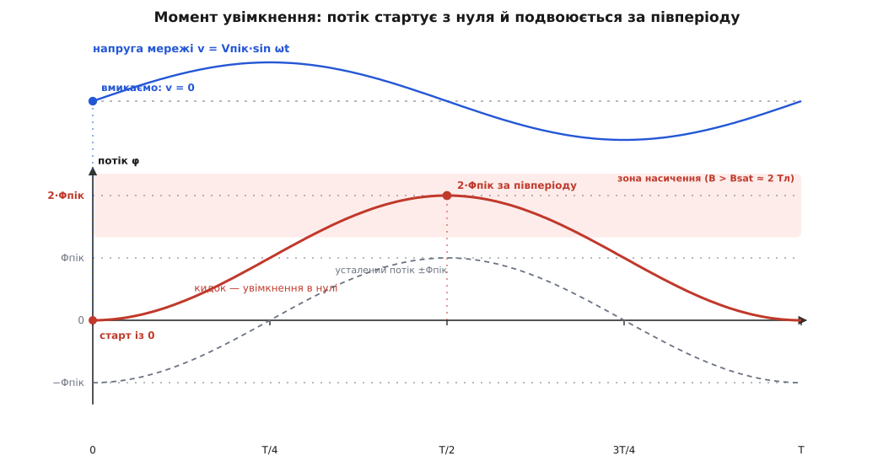
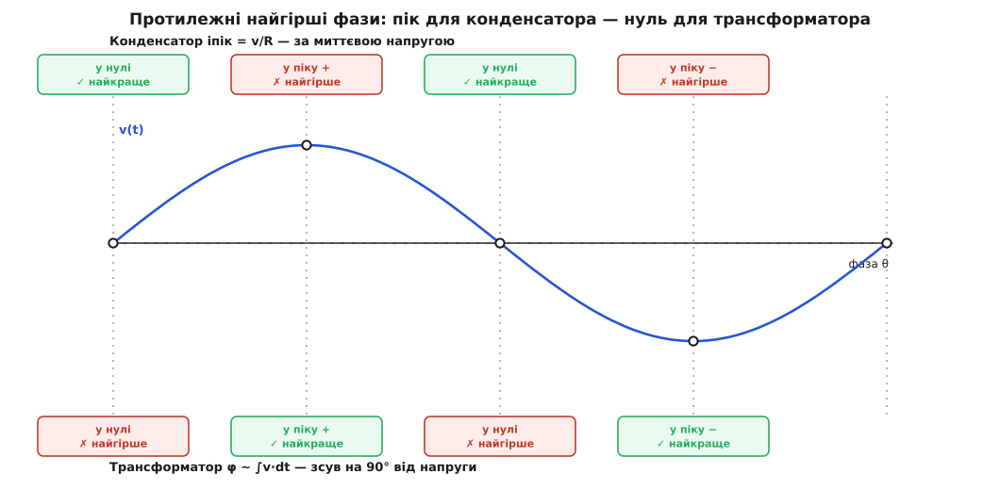

# 🧮 Момент увімкнення (point-on-wave): чому фаза мережі вирішує розмір кидка

Мережа — не стала напруга, а синусоїда, що п'ятдесят разів на секунду пробігає нуль → додатний пік → нуль → від'ємний пік і назад. Вимикач замикається не «в мережу взагалі», а в якусь конкретну мить цієї гойданки — і те, на яку фазу синуса припав дотик контактів, зветься **моментом на хвилі** (англ. *point-on-wave*). Запишімо мережу, поставивши відлік часу в мить замикання:

```
v(t) = Vпік · sin(ωt + θ),     t = 0 — мить замикання
```

Тут θ — той самий фазовий кут у мить дотику: θ = 0 означає замикання в нулі напруги (v саме проходить нуль і росте), θ = 90° — замикання в піку (v = Vпік). Здавалося б, дрібниця: увімкнули на чверть періоду раніше чи пізніше, п'ять мілісекунд туди-сюди. Але для кидка струму ця дрібниця вирішує все — і, що найдивніше, вирішує **протилежно** для двох різних навантажень. Розберімо, чому.

## Дві лінзи на ту саму синусоїду

Уся суть — в одному спостереженні. Конденсатор і трансформатор «бачать» ту саму напругу мережі, але реагують на **різні її математичні образи**.

Конденсатор реагує на **миттєве значення** напруги: саме поточна різниця напруг жене крізь опір шляху зарядний струм. Трансформатор реагує на **інтеграл** напруги в часі: магнітний потік в осерді — це накопичена сума прикладеної напруги, φ ~ ∫v·dt. А миттєве значення синуса та інтеграл синуса зсунуті один від одного рівно на чверть періоду — на 90°. Ось і вся розгадка: фаза, у якій напруга найбільша, — це фаза, у якій її інтеграл проходить нуль, і навпаки. Тому мить, найлагідніша для одного навантаження, виявляється найлютішою для іншого. Далі — просто арифметика цих двох образів.

## Конденсатор: пік струму йде за миттєвою напругою

Уся поведінка конденсатора тримається на одному зв'язку між струмом крізь нього й швидкістю зміни напруги на ньому — `i = C·dV/dt` (докладніше — [конденсатор](book:electronics/capacitor)). Складімо з ним рівняння кола: джерело v(t), послідовний опір шляху R (це власний [ESR](book:electronics/esr-capacitor), опір доріжок і внутрішній опір джерела) та конденсатор C, на якому напруга v_C. За другим законом Кірхгофа

```
v(t) = i·R + v_C,       причому   i = C·dv_C/dt

тобто   v(t) = R·C·(dv_C/dt) + v_C
```

Тепер — ключова мить. Перед вмиканням конденсатор розряджений: v_C(0) = 0. Підставмо цю умову в рівняння **в момент замикання** t = 0:

```
v(t₀) = R·C·(dv_C/dt)│₀ + 0
      ⇒  (dv_C/dt)│₀ = v(t₀) / (R·C)
      ⇒  i(0) = C·(dv_C/dt)│₀ = C · v(t₀)/(R·C) = v(t₀) / R
```

Ось результат, чистий, як закон Ома: у першу мить струм дорівнює **миттєвій напрузі джерела, поділеній на опір шляху**. Сама ємність тут скоротилася — вона лише задала, що напруга на конденсаторі стартує з нуля, а далі струм визначають напруга мережі й малий опір R. Підставмо синус, v(t₀) = Vпік·sin θ:

```
iпік(θ) = Vпік · sin θ / R
```

Пік струму прямо пропорційний sin θ — тобто миттєвій напрузі в мить замикання. Максимум — при θ = 90°, у самому піку напруги; нуль — при θ = 0, у переході через нуль. Порахуймо обидві межі на реальних числах.

**Умова.** Розряджений буферний конденсатор C = 470 мкФ вмикають на мережу 230 В (Vпік ≈ 325 В) крізь сумарний опір шляху R = 0.5 Ом.

```
Миттєвий струм у мить замикання (v_C = 0):   i = v(t₀)/R

Замикання в піку напруги (θ = 90°):
  iпік = Vпік/R       = 325 / 0.5    = 650 А
Замикання в нулі напруги (θ = 0°):
  iпік = 0/R                          = 0 А  (гострого сплеску немає)

У нулі лишається тільки плавний зарядний струм ≈ C·Vпік·ω:
  = 470·10⁻⁶ · 325 · 314            ≈ 48 А
Виграш нуля проти піку:  650 / 48   ≈ 13.5  =  1/(ω·R·C)
```

**Висновок.** Замкнути розряджений конденсатор у піку напруги — це напоротися на 650 А, обмежені самим лише опором доріжок. Замкнути його в нулі — і гострий сплеск зникає геть: миттєва напруга там нульова, штовхати струм нічому. Лишається м'який зарядний струм — і то не тому, що в нулі «нічого не відбувається», а якраз навпаки: у нулі напруга росте найшвидше (там найбільша dv/dt синуса), і саме цей нахил задає плавний струм C·Vпік·ω, у нашому прикладі більш як удесятеро менший за пік. Отже, для конденсатора правило просте: **найгірше — пік напруги, найкраще — нуль.** Запам'ятаймо це й перейдімо до трансформатора, де все виявиться дзеркальним.

## Трансформатор: подвоєння потоку з інтеграла напруги

Тепер на вході — первинна обмотка мережевого трансформатора, N витків на залізному осерді. Струм тут обмежує не опір, а індуктивність, і народжується кидок із магнетизму. Основа — закон електромагнітної індукції: прикладена до обмотки напруга майже вся йде на те, щоб гнати потік (опір міді малий проти сотень вольтів), тож наведена напруга дорівнює швидкості зміни потокозчеплення (докладніше — [закон Фарадея](book:electronics/faraday-law)):

```
v(t) = N · dφ/dt      ⇒      φ(t) = φ(0) + (1/N)·∫₀ᵗ v dτ
```

Потік — це проінтегрована напруга. Підставмо синус мережі й візьмімо інтеграл — тут уся суть:

```
φ(t) = φ(0) + (Vпік/N·ω)·∫₀ᵗ sin(ωτ + θ) dτ
     = φ(0) + (Vпік/N·ω)·[cos θ − cos(ωt + θ)]
```

Позначмо робочу амплітуду потоку Φпік = Vпік/(N·ω) — це той розмах, на який осердя розраховане в усталеній роботі, — і розкладімо вираз на дві частини:

```
φ(t) = −Φпік·cos(ωt + θ)   +   [ φ(0) + Φпік·cos θ ]
       └──── змінна частина ────┘   └─── постійний зсув ───┘
```

Перший доданок — нормальний робочий потік: симетрична синусоїда, що гойдається між −Φпік і +Φпік навколо нуля. Другий — **постійна складова**, яку насильно додає сам момент увімкнення. Вона не гойдається; вона задає, наскільки весь потік зсунуто вгору чи вниз від симетрії. І ось головне: цей зсув найбільший, коли cos θ = ±1, тобто при θ = 0 або θ = 180° — а це якраз **замикання в нулі напруги** (там sin θ = 0). Дзеркало конденсатора вже проступає: там пік струму просив пік напруги, тут пік зсуву просить нуль напруги.

Візьмімо найгірший випадок θ = 0 і чисте осердя (φ(0) = 0):

```
φ(t) = Φпік·(1 − cos ωt)
  t = 0        :  φ = 0             — потік стартує з нуля
  ωt = π (T/2) :  φ = 2·Φпік        — за півперіоду вдвічі за робочий пік
```

Ось воно, **подвоєння**. Чому саме вдвічі — видно фізично, а не лише з алгебри. У сталій роботі потік відстає від напруги на 90°: коли напруга проходить нуль, потік саме в піку. Отже, замикаючи в нулі напруги, ми вимагаємо від потоку одразу опинитися у своєму від'ємному піку −Φпік. Але знеструмлене осердя тримало нуль і миттєво стрибнути на −Φпік не може — для цього довелося б прикласти нескінченну напругу. Тож потік стартує з нуля, тобто на цілий Φпік «вище», ніж належало б, — і цей надлишок +Φпік лишається постійним зсувом, поверх якого й далі гойдається робочий розмах. За перше півперіоду нормальний підйом на +Φпік додається до зсуву +Φпік — разом 2·Φпік.

А тепер протилежна межа, θ = 90° — замикання в піку напруги. Там cos θ = 0, постійний зсув зникає, і потік із першої ж миті йде своєю симетричною синусоїдою. Причина та сама, дзеркальна: у піку напруги усталений потік мав би проходити **нуль** — а знеструмлене осердя якраз у нулі й сидить. Старт і потрібне значення збіглися, розриву немає, подвоєння немає. Для трансформатора пік напруги — **найкраща** мить, рівно та, що для конденсатора найгірша.


*Замикання в нулі напруги: усталений потік (пунктир) мав би стартувати з −Φпік, але знеструмлене осердя тримає нуль — тож кидок-потік (жирна крива) рушає з нуля й за півперіоду сягає 2·Φпік, глибоко в зоні насичення. Різниця між кривими стала — це той самий постійний зсув, що його додає момент увімкнення.*

Але потік удвічі — це не просто «багато магнетизму». Осердя на такий потік не розраховане: за проєктною індукцією 1.5 тесли подвоєння проситься до 3 тесел, тоді як сталь насичується десь на 2 теслах. За порогом насичення проникність осердя обвалюється майже до проникності повітря, залізо перестає «вбирати» потік (докладніше — [нелінійна індуктивність і насичення осердя](book:electronics/nonlinear-inductor)), а з ним обвалюється й індуктивність обмотки, що досі стримувала струм. Струм намагнічування, доти маленький, злітає — його вже ніщо не тримає, крім малого опору міді. Полічім усе разом.

**Умова.** Мережевий трансформатор 230 В, 50 Гц. Проєктна індукція Bпроєкт = 1.5 Тл, площа перерізу осердя A = 12 см² = 1.2·10⁻³ м².

```
Vпік = √2·230 = 325 В,   ω = 2π·50 = 314 рад/с
Число витків із рівняння ЕРС  Vдіюч = 4.44·f·N·B·A:
  N = 230 / (4.44 · 50 · 1.5 · 1.2·10⁻³)  ≈ 575 витків
  Φпік = B·A = 1.5 · 1.2·10⁻³             = 1.8 мВб

Замикання в нулі — потік проситься до подвоєної індукції:
  2·Bпроєкт                 = 2 · 1.5            = 3.0 Тл
Плюс залишкова індукція Br ≈ 1.0 Тл (≈ 0.7 робочого піку, що лишилась
у залізі від попереднього вимикання), якщо збіглася напрямком:
  Bмакс ≈ 2·Bпроєкт + Br    = 3.0 + 1.0          = 4.0 Тл

Поріг насичення сталі ≈ 2.0 Тл — вимога перевищує його вдвічі,
осердя йде в глибоке насичення задовго до кінця півперіоду.
```

Що з цього виходить за струмом? Потокозчеплення підкоряється інтегралу напруги невблаганно — накопичений ∫v·dt мусить десь опинитися. Поки залізо ненасичене, крихітний струм намагнічування створює потрібний потік (велика проникність, велика індуктивність). Щойно потік переростає поріг насичення, для кожного дальшого його приросту треба вже не крихітний, а величезний струм — бо проникність упала до повітряної. Тож струм стрибає рівно на стільки, скільки треба, щоб «догнати» вимогу інтеграла, обмежений лише опором обмотки та джерела. На практиці перший пік намагнічування сягає **8–15 разів** робочого струму: для нашого прикладу з номіналом, скажімо, 500 В·А (робочий струм ≈ 2.2 А) це десятки ампер уже на першому піку.

І остання відмінність, важлива на практиці. Постійний зсув потоку не зникає за один період — він розсідає повільно, у міру того як його з'їдають опір обмотки та втрати в залізі: за десятки мілісекунд, а у великих трансформаторів і за секунди. Тому кидок трансформатора не гострий одиничний сплеск, як у конденсатора (той укладається в частку мілісекунди), а **низка спадних піків** через один-два періоди, що тягнеться помітно довше. Один симптом — «великий струм на старті» — але зовсім інша форма й тривалість.

## Чому фази протилежні — і що з цього робити

Звівши обидва виведення докупи, дістаємо єдину картину, гарнішу за кожну окрему формулу.


*Ту саму синусоїду два навантаження читають по-різному. Конденсатор реагує на миттєву напругу (пік струму = v/R) — йому найгірше в піку, найкраще в нулі. Трансформатор реагує на інтеграл напруги (потік зсунуто на 90°) — і все навпаки. Ось чому єдиного «вмикай у нулі» не буває.*

Конденсатор читає миттєве значення напруги — його пік струму йде за |v|, тож максимум у піку напруги, нуль у переході через нуль. Трансформатор читає інтеграл напруги — а інтеграл синуса зсунутий на 90°, тож усе навпаки: максимум небезпеки в нулі напруги, спокій у піку. Дві криві однієї синусоїди, зсунуті на чверть періоду, — і тому єдиного правила «вмикай у нулі» бути не може: слушний момент диктує не мережа, а те, що саме до неї підключають.

> 🔧 **Навіщо це.** Керована комутація в потрібній точці хвилі — [перемикання відносно переходу через нуль](book:electronics/zero-cross-switching) — здатна вбити кидок у зародку, але лише якщо цілитися в **правильну** фазу. Наведи реле чи тиристор на нуль напруги, сподіваючись «як завжди краще», — і конденсаторному входу справді полегшає, зате трансформатор ти цим самим заженеш у найглибше насичення. І навпаки. Тому в контролерах увімкнення трансформаторів цілять у пік напруги (ще й із поправкою на виміряний залишковий потік), а не в нуль. Зрозуміти, який образ напруги «бачить» твоє навантаження — миттєве значення чи інтеграл, — і означає знати, куди наводити момент увімкнення.

Отже, момент на хвилі — не примха й не другорядна поправка, а повноцінна змінна конструкції. Розряджений конденсатор і ненамагнічене осердя обидва рвуться до великого струму на старті, але з різних причин: один — бо миттєва напруга ділиться на малий опір, другий — бо інтеграл напруги подвоює потік і зриває осердя в насичення. Різна математика — миттєве значення проти інтеграла — розводить їхні найгірші миті рівно на чверть періоду. Хто це бачить, той обирає слушну фазу свідомо; хто ні — вмикає навмання й половину разів влучає в найгірше.
