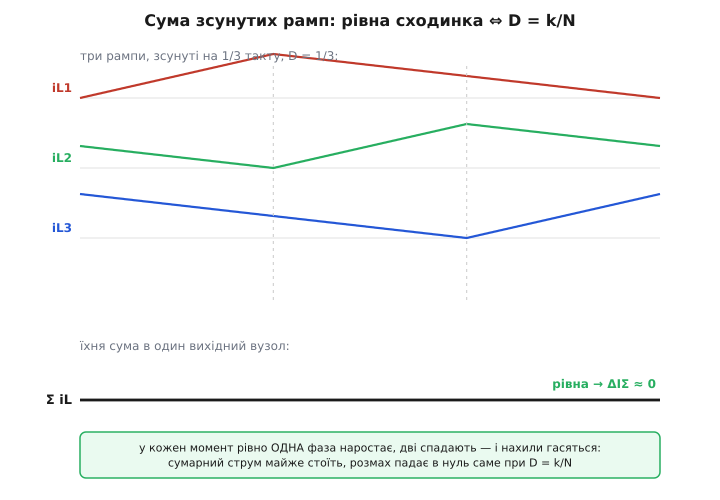
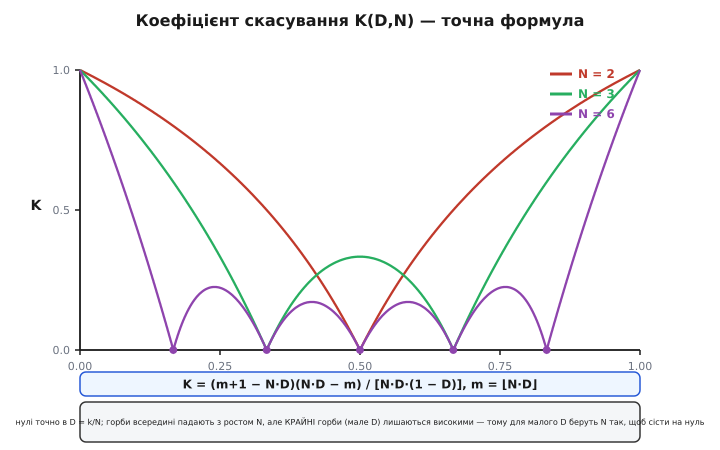

# 🧮 Коефіцієнт скасування пульсацій

Скасування пульсацій в interleaved-перетворювачі легко описати словами — «зсунуті трикутники частково гасять одне одного» — і легко намалювати. Але щойно доводиться **вибрати число фаз** під конкретне живлення чи прикинути, який конденсатор поставити, слова закінчуються, і потрібне число: у скільки саме разів упаде розмах пульсації при цьому D і цьому N. Виявляється, це число задає одна напрочуд чиста формула, а її нулі стоять рівно в точках D = k/N — не приблизно, а математично точно. Розберемо, звідки вона береться, чому нулі саме там і що ховається в «горбах» між ними.

Домовимося про позначення відразу, щоб не плутатися: **D** — коефіцієнт заповнення (частка такту, коли верхній ключ фази відкритий), **N** — число фаз, **T = 1/f** — період комутації однієї фази. Кожна фаза зсунута від сусідньої на T/N у часі, тобто на 360°/N по фазі такту. Шукаємо ми **коефіцієнт скасування** K — у скільки разів розмах сумарної пульсації менший за розмах пульсації однієї фази.

```
        ΔIΣ  (розмах суми всіх фаз)
K(D,N) = ─────────────────────────────
         ΔI₁  (розмах пульсації однієї фази)
```

K = 1 означало б «жодного виграшу» (сумарна пульсація така сама, як в однієї фази), K = 0 — «пульсація зникла повністю». Уся суть interleaved у тому, що K майже завжди помітно менший за одиницю, а в солодких точках падає точно в нуль.

> 🔧 **Навіщо це.** K — це не академічна прикраса, а прямий множник у розрахунку виходу. Розмах пульсації напруги на виході (ємнісна складова) ∝ ΔIΣ = K·ΔI₁. Знаєте K — знаєте, у скільки разів менший конденсатор дасть ту саму пульсацію, або наскільки рівніший буде вихід за наявного. Помилитися тут — це або перевитратити на конденсаторах, або недооцінити пульсацію й отримати брудне живлення.

## Звідки взагалі береться трикутник

Щоб скласти пульсації, треба спершу точно знати форму пульсації **однієї** фази. У buck-комірці струм котушки — кусково-лінійна пилка, і нахили її двох ділянок задаються тим, яка напруга прикладена до котушки.

Основне рівняння котушки — напруга на ній дорівнює індуктивності на швидкість зміни струму:

```
V_L = L · (dI/dt)   →   dI/dt = V_L / L
```

Поки верхній ключ відкритий (частку D такту), до котушки прикладено різницю вхід-вихід, і струм наростає:

```
ділянка наростання (ключ відкритий, триває D·T):
    V_L = Vвх − Vвих
    швидкість = (Vвх − Vвих) / L   (додатна — струм угору)
```

Коли верхній ключ закрився і струм пішов через нижній (синхронний) ключ (частку 1−D такту), до котушки прикладено вже саме −Vвих, і струм спадає:

```
ділянка спаду (ключ закритий, триває (1−D)·T):
    V_L = −Vвих
    швидкість = −Vвих / L   (від'ємна — струм униз)
```

Розмах трикутника ΔI₁ — це наскільки струм устигає піднятися за час наростання (він же дорівнює падінню за час спаду, бо в усталеному режимі струм повертається туди, звідки почав, — це і є **вольт-секундний баланс** котушки):

```
ΔI₁ = швидкість_угору · час_угору
    = (Vвх − Vвих)/L · D·T
    = (Vвх − Vвих) · D / (L · f)
```

Скориставшись тим, що для buck Vвих = D·Vвх (усталене співвідношення), розмах можна переписати лише через вхід і D — форма, яка нам стане в пригоді, бо в ній видно **симетрію** відносно D = 0.5:

```
Vвх − Vвих = Vвх − D·Vвх = Vвх·(1 − D)
        ⇒  ΔI₁ = Vвх · D · (1 − D) / (L · f)
```

Ось перша важлива підказка: множник **D·(1−D)** — це парабола з максимумом у D = 0.5. Пульсація однієї фази найбільша посередині діапазону й тане до країв. Цю параболу ми ще зустрінемо в знаменнику підсумкової формули — і вона поясниться сама.

> 🔧 **Навіщо це.** D·(1−D) у чисельнику ΔI₁ каже, що пульсація однієї фази — не стала, а залежить від робочої точки. Найгірша вона при D = 0.5. Тому інженерні графіки пульсації прийнято **нормувати** саме на цю найгіршу точку — щоб крива не залежала від конкретних Vвх, L, f, а показувала чисту форму скасування.

## Складаємо N трикутників: чому нахили гасяться

Тепер головний хід. Сумарний струм у вихідний вузол — це сума N однакових трикутників, кожен зсунутий на T/N. Ключове спостереження: **нас цікавить не сума самих струмів, а сума їхніх нахилів** (похідних), бо саме нахил сумарного струму каже, наростає підсумок чи спадає, і наскільки круто.

У кожен момент часу кожна фаза перебуває в одному з двох станів: **наростає** (нахил +(Vвх−Vвих)/L) або **спадає** (нахил −Vвих/L). Скільки фаз зараз наростає — стільки додатних нахилів у сумі; решта дають від'ємні. Позначимо **m** — число фаз, що в цю мить наростають (тобто в яких верхній ключ відкритий). Тоді миттєвий нахил суми:

```
нахил_Σ = m · (Vвх − Vвих)/L  +  (N − m) · (−Vвих)/L
        = [ m·Vвх − m·Vвих − (N−m)·Vвих ] / L
        = [ m·Vвх − N·Vвих ] / L
```

Підставимо Vвих = D·Vвх і винесемо:

```
нахил_Σ = Vвх·[ m − N·D ] / L
```

Ось воно — **серце всієї теми в одному виразі**. Миттєвий нахил сумарного струму пропорційний до (m − N·D), де m — скільки фаз зараз наростають. І тут ховаються дві речі одразу.

**Перша: коли N·D — ціле, нахил може бути нулем.** Якщо в кожну мить наростає рівно m = N·D фаз, то m − N·D = 0, нахил суми = 0, і сумарний струм **стоїть як укопаний** — пульсації немає взагалі. Але m — обов'язково ціле (фаза або наростає, або ні, півфази не буває). Отже, ідеальний нуль можливий лише тоді, коли N·D саме ціле, тобто **D = k/N** для цілого k. Це і є солодкі точки, тепер строго.

**Друга: між цими точками нахил гуляє між двома сусідніми цілими.** Якщо N·D = 1.4 (скажімо, N = 3, D = 0.467… близько до цього), то m стрибає між 1 і 2: то одна фаза наростає (нахил ∝ 1 − 1.4 = −0.4), то дві (нахил ∝ 2 − 1.4 = +0.6). Сумарний струм уже не стоїть — він смикається вгору-вниз малими рампами. Розмах цього смикання й дає ненульову пульсацію, «горб».

## Точки D = k/N: чому саме там ідеальний нуль

Погляньмо на солодку точку зблизька — на прикладі N = 3, D = 1/3. Тут N·D = 1, отже, в ідеалі в кожну мить наростає рівно одна фаза, дві спадають.

Перевіримо, що фази **дійсно** так узгоджені. Кожна наростає частку D = 1/3 такту, тобто рівно третину. Фази зсунуті на 1/3 такту. Викладемо їхні «вікна наростання» на осі часу:

```
такт: |0 ───────── 1/3 ───────── 2/3 ───────── 1|
фаза1: [▲ наростає ][      спадає             ]
фаза2: [   спадає  ][▲ наростає ][   спадає   ]
фаза3: [      спадає           ][▲ наростає  ]
```

Вікна наростання стикуються **край-у-край**: тільки-но фаза 1 перестала наростати (у момент 1/3), одразу почала фаза 2; коли фаза 2 закінчила (2/3) — почала фаза 3. У кожну мить наростає рівно одна фаза. m ≡ 1 весь такт, m − N·D = 1 − 1 = 0 без перерви. Сумарний нахил тотожно нульовий — сумарний струм ідеально рівний.


*Три струми котушок при D = 1/3, зсунуті на третину такту. Пунктири — межі k/N, де одна фаза передає естафету наростання наступній. Унизу — їхня сума: рівна лінія, розмах ΔIΣ падає в нуль. Провал кожної фази під час спаду точно затулений підйомом сусідньої.*

Тепер видно **геометричний зміст** солодкої точки: D = k/N — це умова, за якої відкриті вікна фаз укладаються в такт без щілин і без нахлестів, і в кожну мить наростає стало k фаз. «Естафета» наростання передається край-у-край, і сумарний струм не має ані миті, коли всі раптом спадають або всі раптом наростають, — а саме такі миті й породжують пульсацію.

Для загального k логіка та сама: при D = k/N у кожну мить наростає рівно k фаз (їхні вікна перекриваються так, що сумарне «покриття» стале й дорівнює k). Формально це прямо випливає з m − N·D = k − k = 0. Тому нулів на осі D — рівно N−1 штук: k = 1, 2, …, N−1 (при k = 0 і k = N перетворювач вироджений — або завжди вимкнений, або завжди ввімкнений).

## Формула коефіцієнта: горби між нулями

Тепер порахуємо не лише нулі, а й що між ними — саму криву K(D,N). Візьмемо будь-яке D, не обов'язково солодке. Нехай m = ⌊N·D⌋ (ціла частина N·D) — базове число фаз, що наростають. Дрібна частина f_д = N·D − m ∈ [0, 1) каже, наскільки ми зайшли за останню солодку точку.

Протягом такту m змінюється лише між двома значеннями — **m** і **m+1** — бо N·D сидить між цілими m і m+1. Отже, сумарна пилка складається всього з двох ділянок сталого нахилу за один свій період (а період її вкорочений у N разів, бо естафета вікон повторюється N разів на такт). Знайти її розмах — те саме, що знайти висоту трикутника з двома відомими нахилами й двома відомими тривалостями.

Тривалості цих двох ділянок задаються тим, наскільки N·D перебрало над m і наскільки не дотягло до m+1. Проінтегрувавши нахил суми на кожній ділянці (нахил ми вже маємо: він ∝ (m − N·D) на «нижній» ділянці й ∝ (m+1 − N·D) на «верхній»), дістаємо висоту трикутника суми. Викладка суто арифметична — множимо нахил на тривалість, — і після скорочення сумарний розмах виходить пропорційним добутку двох згаданих «недоборів»:

```
ΔIΣ ∝ (m + 1 − N·D) · (N·D − m)
```

Поділивши це на розмах однієї фази ΔI₁ = Vвх·D·(1−D)/(L·f), усі спільні множники (Vвх, L, f) скорочуються, і лишається чистий безрозмірний **коефіцієнт скасування** — відношення сумарного розмаху до розмаху однієї фази:

```
         (m + 1 − N·D) · (N·D − m)
K(D,N) = ──────────────────────────── ,   m = ⌊N·D⌋
              N · D · (1 − D)
```

Розберемо кожен шматок — у кожному є фізичний сенс.

**Чисельник (m+1−N·D)·(N·D−m)** — це добуток двох «відстаней» на осі: наскільки N·D перевищило нижнє ціле m, і наскільки не дотягнуло до верхнього m+1. Обидва множники — це, по суті, дві частки такту, у які сумарний струм наростає й спадає з невеликими нахилами. Добуток дорівнює **нулю точно в вузлах** D = m/N (тоді N·D − m = 0) і D = (m+1)/N (тоді m+1−N·D = 0), а максимальний **посередині сегмента**, коли N·D = m + ½ (обидва множники по ½, добуток ¼). Це параболічна дужка нуль→максимум→нуль у кожному відрізку між сусідніми солодкими точками — саме звідси «горби».

**Знаменник N·D·(1−D)** — упізнаваний: це та сама парабола D·(1−D), що керувала розмахом однієї фази, помножена на N. Вона в знаменнику, бо ми **нормуємо** на ΔI₁, у чисельнику якого сидить D·(1−D). Розмах однієї фази теж тане до країв діапазону — і, ділячи на нього, ми враховуємо, що біля країв «є що скорочувати» уже менше.


*Коефіцієнт K, порахований точно за формулою, для 2, 3 і 6 фаз. Кожна крива торкається нуля рівно в D = k/N (для 6 фаз точки на осі — 1/6, 2/6, …, 5/6) і піднімається до горбів між ними. Що більше N, то більше нулів, то вужчі й нижчі горби всередині — рівний вихід у ширшому діапазоні D. Але крайні горби (біля дуже малого D) лишаються високими.*

Перевіримо формулу на знайомих значеннях — вона мусить відтворити нулі й дати розумні горби.

**Крайні межі.** При D → 0 маємо m = 0, K → (1−0)·(0)/(0) — невизначеність 0/0. Розкриваючи (чисельник ≈ 1·N·D, знаменник ≈ N·D·1), дістаємо K → 1. Так і має бути: коли ключ ледь відкривається, лише одна фаза в кожну мить «жива», гасити нема чим, сумарна пульсація дорівнює одній фазі. Симетрично K → 1 при D → 1.

**Дві фази, D = 0.5** (солодка точка k = 1, N = 2): m = ⌊1.0⌋ = 1, чисельник (1+1−1)·(1−1) = 1·0 = 0. K = 0 — точний нуль. У протифазі рампи двох фаз ідеально дзеркальні.

**Дві фази, D = 0.25** (середина сегмента 0…0.5): m = 0, чисельник (0+1−0.5)·(0.5−0) = 0.5·0.5 = 0.25, знаменник 2·0.25·0.75 = 0.375. K = 0.25/0.375 = **0.667**. Тобто навіть у найгіршій для двофазника точці розмах усе одно на третину менший, ніж в однієї фази.

**Три фази, D = 0.5** (не солодка для N = 3): m = ⌊1.5⌋ = 1, чисельник (1+1−1.5)·(1.5−1) = 0.5·0.5 = 0.25, знаменник 3·0.5·0.5 = 0.75. K = **0.333** = 1/N. Приємний факт: непарне число фаз рівно в середині діапазону дає K = 1/N.

## Чому більше фаз — краще: два різні виграші

Формула пояснює, чому в живленні процесорів ставлять багато фаз, — але важливо не сплутати **дві окремі причини**, бо вони працюють по-різному.

**Причина перша: більше нулів, ширший рівний діапазон.** Нулі стоять у D = k/N, тобто з кроком 1/N по осі. Що більше N, то щільніше сітка нулів і то коротший кожен горб. Робоча точка з більшою ймовірністю опиняється поблизу якогось нуля — і пульсація там мала. Це головний виграш: не «пік нижчий взагалі», а «рівний вихід у більшому діапазоні напруг».

**Причина друга: горби всередині діапазону нижчі.** Порахуймо пік у середині сегмента (N·D = m + ½, чисельник = ¼) для різних N. Для сегмента, що містить D = 0.5:

```
N = 2, пік @ D=0.25:  K = 0.25 / (2·0.25·0.75) = 0.667
N = 4, пік @ D=0.375: K = 0.25 / (4·0.375·0.625) = 0.267
N = 6, пік @ D=0.083 (сегмент 0…1/6): K = 0.545
N = 6, пік @ D=0.417 (середній сегмент): K ≈ 0.10
```

Видно: горби **в середині** діапазону справді круто падають з ростом N (0.667 → 0.267 → 0.10). Але **крайні** горби — ті, що в першому сегменті 0…1/N, біля дуже малого D — падають кволо: для N = 6 крайній горб усе ще 0.545. Причина в знаменнику: біля D → 0 множник N·D·(1−D) малий, і хоч чисельник теж малий, відношення тримається високо.

Ось тонкість, яку легко проґавити. Живлення процесора — це мале D (12 В → 1 В дає D ≈ 0.083). Наївно: «візьму багато фаз, і крайній горб придавиться». Але крайній горб придавлюється погано. **Справжній** рецепт інший: підібрати N так, щоб робоча точка D сіла **на сам нуль** k/N, а не покладатися на низький горб. Для D ≈ 0.083 ідеальне N — таке, що 1/N ≈ 0.083, тобто N = 12: тоді D потрапляє рівно в перший нуль k=1. Не випадково у VRM процесорів фаз буває саме дюжина й більше.

> 🔧 **Навіщо це.** Число фаз обирають не «щоб горби були низькі взагалі» — крайній горб не задавити нарощуванням N. Обирають так, щоб **робоча D сіла на нуль k/N**. Спершу рахують D з відношення Vвх/Vвих, тоді дивляться, яке N дає k/N найближче до цього D. Це рішення в лоб дає ідеальне скасування саме в потрібній точці й економить конденсатори найкраще.

Ще одне спостереження з формули: **горби симетричні** відносно D = 0.5 (заміна D → 1−D залишає N·D·(1−D) незмінним і дзеркалить m). Тому криву достатньо знати на половині [0, 0.5] — друга половина віддзеркалена. Це не випадковість: buck при D і при 1−D симетричний за вольт-секундами, лише ролі ділянок наростання й спаду міняються місцями.

## Worked-приклад: пульсація виходу для N = 3, D = 0.4

Порахуймо конкретне число від початку до кінця. Візьмемо перетворювач 12 В → 4.8 В (звідси D = 4.8/12 = 0.4), три фази, частота однієї фази f = 500 кГц, котушка кожної фази L = 1 мкГ, вихідний конденсатор C = 100 мкФ (для оцінки пульсації напруги). Точка D = 0.4 навмисне **не** солодка для N = 3 (солодкі: 1/3 ≈ 0.333 і 2/3 ≈ 0.667), щоб побачити роботу горба.

**Крок 1. Розмах пульсації однієї фази.**

```
ΔI₁ = (Vвх − Vвих) · D / (L · f)
    = (12 − 4.8) · 0.4 / (1·10⁻⁶ · 500·10³)
    = 7.2 · 0.4 / 0.5
    = 2.88 / 0.5 = 5.76 А (розмах на фазу)
```

**Крок 2. Коефіцієнт скасування за формулою.** Спершу m:

```
N·D = 3 · 0.4 = 1.2
m = ⌊1.2⌋ = 1
```

Тепер K:

```
         (m + 1 − N·D) · (N·D − m)     (1 + 1 − 1.2) · (1.2 − 1)
K(0.4,3) = ──────────────────────── =  ────────────────────────
              N · D · (1 − D)              3 · 0.4 · (1 − 0.4)

         (0.8) · (0.2)      0.16
       = ────────────── =  ────── = 0.2222
         3 · 0.4 · 0.6      0.72
```

Скасування тут сильне: сумарний розмах — лише 22% від однієї фази, хоча ми в горбі, а не в нулі.

**Крок 3. Сумарний розмах струму в конденсатор.**

```
ΔIΣ = K · ΔI₁ = 0.2222 · 5.76 = 1.28 А
```

Три фази по 5.76 А розмаху кожна дають у вихідний вузол сумарну пульсацію всього 1.28 А — менше, ніж розмах **однієї** фази. Ось наочно: складали три великі трикутники, а вийшов маленький.

**Крок 4. Пульсація напруги на виході.** Сумарна пульсація має частоту N·f = 1.5 МГц (утричі вища за фазну). Ємнісна складова розмаху напруги для трикутного струму:

```
ΔVвих ≈ ΔIΣ / (8 · f_еф · C)     де f_еф = N·f = 1.5·10⁶

      = 1.28 / (8 · 1.5·10⁶ · 100·10⁻⁶)
      = 1.28 / (8 · 150)
      = 1.28 / 1200 ≈ 1.07 мВ (розмах)
```

Трохи більше мілівольта пульсації на виході 4.8 В за скромні 100 мкФ. Для порівняння, одна фаза (той самий струм, той самий конденсатор, частота 500 кГц) дала б:

```
ΔVвих(1 фаза) ≈ ΔI₁ / (8 · f · C) = 5.76 / (8 · 500·10³ · 100·10⁻⁶)
             = 5.76 / 400 = 14.4 мВ
```

Виграш — приблизно у **13 разів** (14.4 / 1.07), і це в невигідній точці-горбі. Виграш склався з двох множників: розмах струму впав у 1/K ≈ 4.5 раза, а вища частота (×3) дала ще ×3. Якби ми сиділи в солодкій точці D = 1/3, K → 0 і пульсація напруги (від цієї складової) прямувала б до нуля, обмежена лише паразитним опором конденсатора (ESR) та реальними неідеальностями.

Оцей останній рядок — важлива поправка до ідеалу. Формула K = 0 у солодких точках вірна для **ємнісної** складової пульсації напруги. У реальному конденсаторі лишається складова на його послідовному опорі (ESR): ΔV_ESR = ΔIΣ · ESR. Оскільки ΔIΣ = K·ΔI₁ теж прямує до нуля в солодкій точці, ESR-складова там теж мала, — але «точний нуль» пульсації напруги на практиці розмивається в «дуже малу пульсацію», обмежену ESR, скінченною крутизною фронтів ключів і неідеальним балансуванням фаз. Формула дає ідеальну межу, до якої реальність підходить близько, але не впритул.

## Що ця формула каже проєктанту

Згорнімо в кілька практичних тверджень, кожне з яких прямо читається з K(D,N).

**Нулі — це вибір N під задане D.** Робоча D фіксована відношенням Vвх/Vвих. Вільний параметр — N. Обирайте N так, щоб якесь k/N сіло на робочу D: тоді K → 0 і пульсація мінімальна. Для процесорних напруг (мале D) це тягне до великих N — і саме тому багатофазні VRM мають стільки фаз.

**Далеко від нуля виграш усе одно є, але скромніший у крайніх горбах.** Навіть у горбі K помітно менший за одиницю (0.22 у нашому прикладі), тож interleaved корисний і не в солодкій точці. Але не розраховуйте, що нарощування N само по собі задавить крайній горб при дуже малому чи дуже великому D — там знаменник D·(1−D) працює проти вас.

**Частота множиться на N незалежно від K.** Навіть коли розмах струму не впав до нуля, його частота — N·f, і це саме собою полегшує фільтрацію (конденсатор гасить вищу частоту краще). Тож повний виграш на виході — це завжди добуток двох ефектів: менший розмах (множник K) і вища частота (множник N у знаменнику фільтра).

**Симетрія D ↔ 1−D.** Крива дзеркальна відносно D = 0.5. Buck на 12 В → 1.2 В (D = 0.1) і на 12 В → 10.8 В (D = 0.9) мають однакову форму скасування — корисно пам'ятати, коли одна й та сама топологія працює в двох режимах.

Формула K(D,N) = (m+1−N·D)(N·D−m) / [N·D·(1−D)] — це весь interleaved, стиснутий у рядок: чисельник ловить геометрію стику вікон наростання (звідки нулі й горби), знаменник нормує на пульсацію однієї фази (звідки симетрія й крайові ефекти). Знаючи її, вибір числа фаз перестає бути ворожінням і стає арифметикою: порахував D, знайшов найближче k/N, отримав рівний вихід за найменшої ціни.
