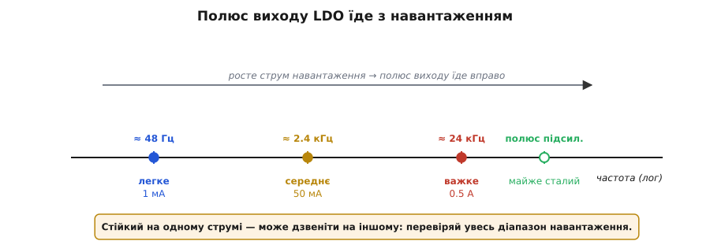
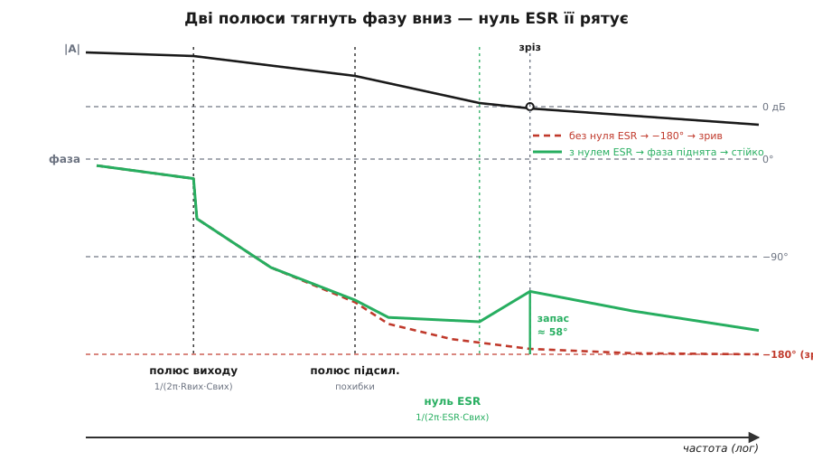
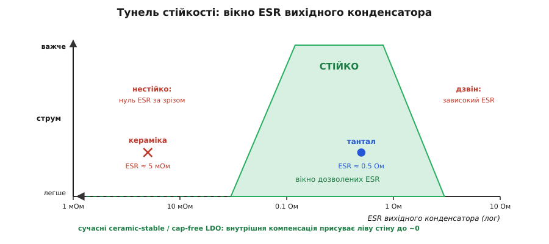

# Стійкість LDO: полюси, ESR і компенсація

<preknowlist>
- [LDO зсередини](book:electronics/ldo-internals) — стабілізатор як петля: прохідний транзистор-клапан, підсилювач похибки-наглядач, опорна напруга й дільник.
- [Від'ємний зворотний зв'язок](book:electronics/negative-feedback) — як петля гасить відхилення й за яких умов обертається на додатну (починає генерувати).
- [Діаграма Боде](book:electronics/bode-plot) — полюс завалює підсилення й відкручує до −90° фази; нуль навпаки — підіймає до +90°.
- [Запас підсилення й запас фази](book:electronics/stability-margins) — петля зривається, коли фаза добігає −180° раніше, ніж підсилення петлі впаде до одиниці.
- [Конденсатори перетворювача](book:electronics/converter-caps) — що таке ESR (еквівалентний послідовний опір) реального конденсатора.
</preknowlist>

Даташит на LDO-стабілізатор ховає одну дивну вимогу. Він каже: «на вихід обов'язково постав конденсатор» — гаразд. Тоді додає: «його ESR має бути в межах від 0.1 до 2 Ом» — тобто конденсатор мусить бути в міру **поганий**? А наостанок виявляється, що коли ви замінили старенький танталовий конденсатор на новішу, кращу в усьому кераміку, справний стабілізатор раптом почав тихо співати на сотнях кілогерц і псувати живлення. Що за примхи?

Примх тут немає. LDO — це [петля зворотного зв'язку](book:electronics/ldo-internals), а будь-яка петля вміє не лише тримати вихід рівним, а й **розгойдуватися**. Уся ця історія — про дві полюси й один нуль, і щойно ви їх побачите, і вимога до ESR, і фокус із керамікою стануть очевидними.

### Стабілізатор — це петля, а петля вміє дзвеніти

Нагадаю коротко, що коїться всередині. Підсилювач похибки дивиться на частку виходу з дільника, звіряє її з опорною напругою й підкручує прохідний транзистор так, щоб вони збіглися. Вихід просів — транзистор прочиняється дужче; підскочив — прикривається. Це [від'ємний зворотний зв'язок](book:electronics/negative-feedback): петля невпинно гасить будь-яке відхилення.

Але гасить вона його **не миттєво**. Між «вихід просів» і «підсилювач помітив, штовхнув транзистор, і струм дійшов назад до виходу» завжди минає якийсь час — запізнення. І от у чому підступ: якщо петля запізнюється рівно настільки, що її поправка приходить, коли вихід уже не просто повернувся, а **перескочив** у другий бік, то петля побачить новий перебір і смикне назад, породжуючи наступний перескок. Замість того щоб тримати напругу, вона почне її розгойдувати. Мовою частот це звучить так: якщо на якійсь частоті петля додає **свої** −180° затримки понад те обертання знаку, що вже є у від'ємному зв'язку, — від'ємний зв'язок на цій частоті стає **додатним**. А якщо на тій самій частоті сигнал по петлі ще не встиг ослабнути (підсилення петлі ≥ 1), маємо готовий генератор. Це і є [зрив стійкості](book:electronics/stability-margins), і стосується він **усієї петлі разом із виходом**, а не самої лише мікросхеми.

Отже, питання стійкості LDO зводиться до одного: **звідки в цій петлі береться запізнення** — і чи встигає воно накрутити небезпечні −180° раніше, ніж підсилення впаде до одиниці. Запізнення в петлі живе в її **полюсах**.

### Дві великі полюси

У LDO два головні джерела затримки, дві полюси, і кожне варто впізнавати в обличчя.

**Полюс виходу.** На вузлі виходу висить вихідний конденсатор Cвих, а живить (і розряджає) його струм проходить через **вихідний опір прохідного транзистора** Rвих (паралельно з опором навантаження). Заряджати ємність через опір — це класична інерційна ланка: напруга на виході не може стрибнути вмить, вона повзе зі сталою часу Rвих·Cвих. На Боде це полюс на частоті

```
f_p(вихід) = 1 / (2π · Rвих · Cвих)
```

Це зазвичай **найнижча** й найголовніша полюс усієї петлі.

**Полюс підсилювача похибки.** Сам підсилювач теж не безкінечно швидкий: його вихід — це високоомний вузол, який має перезаряджати ємність затвора (чи бази) прохідного транзистора. Знову опір, що жене струм в ємність, — знову інерційна ланка, знову полюс, тільки на вищій частоті.

Кожна полюс, доходячи до діла, відкручує фазу **вниз до −90°**. Одна полюс сама по собі не страшна: −90° лишає до фатальних −180° цілих 90° запасу. А от **дві** полюси разом здатні докрутити фазу аж до −180° — рівно до тієї межі, за якою від'ємний зв'язок обертається на додатний. Уся драма стійкості LDO — у тому, чи опиняться **обидві** полюси нижче частоти зрізу (де підсилення петлі падає до одиниці). Якщо так — на зрізі фаза вже коло −180°, запасу немає, петля дзвенить. [Звідки строго беруться ці дві частоти, як через крутість прохідного транзистора порахувати підсилення петлі й сам запас фази](book:electronics/ldo-stability/math-ldo-poles.md) — у математичній вставці; тут важлива сама картина двох полюсів.

### Полюс виходу їде з навантаженням

Тепер риса, що робить LDO по-справжньому підступним і відрізняє його від багатьох інших петель. Пригадаймо вихідний опір Rвих: це вихідний опір прохідного транзистора паралельно з опором навантаження. Обидва **залежать від струму**. На легкому навантаженні опір навантаження величезний, та й транзистор ледь прочинений (його власний вихідний опір високий), тож Rвих величезний — і полюс виходу сідає на **дуже низьку** частоту. На важкому навантаженні Rвих малий — і та сама полюс їде **високо** по частоті.

**Полюс виходу на легкому й важкому навантаженні (Cвих = 1 мкФ, Vвих = 3.3 В).**

```
полюс виходу:   f_p = 1 / (2π · Rвих · Cвих),   Rвих ≈ Rнав = Vвих / Iнав

легке (1 мА):   Rнав = 3.3 / 0.001 = 3.3 кОм
   f_p = 1 / (2π · 3300 · 1·10⁻⁶) ≈ 48 Гц

важке (0.5 А):  Rнав = 3.3 / 0.5 = 6.6 Ом
   f_p = 1 / (2π · 6.6 · 1·10⁻⁶) ≈ 24 кГц
```

Полюс виходу гуляє в **сотні разів** — від десятків герц до десятків кілогерц — залежно лише від того, скільки струму бере навантаження.


*Полюс виходу задає добуток Rвих·Cвих, а Rвих спадає зі струмом навантаження — тож на легкому навантаженні полюс сидить дуже низько (тут ≈ 48 Гц), а на важкому їде вгору (≈ 24 кГц). Полюс підсилювача похибки при цьому майже не рухається. Звідси головний наслідок: стійкість LDO залежить від струму, і перевіряти її треба на всьому діапазоні навантаження.*

Наслідок прямий і неприємний: LDO, бездоганно стійкий на повному струмі, може задзвеніти на майже холостому ході — і навпаки. Найчастіше саме **легке навантаження** — найгірший випадок: полюс виходу падає так низько, що разом із полюсом підсилювача обидві опиняються далеко під зрізом, і фаза встигає догнати −180°. Тому стійкість LDO ніколи не перевіряють в одній зручній точці — її ганяють у кутах: від мікроамперного струму спокою до повного навантаження, за гарячого й холодного кристала.

> 🔧 **Навіщо це.** Якщо ваш LDO живить вузол, що то спить (одиниці мікроампер), то прокидається на повний струм, — це найтяжчий для стійкості сценарій, бо полюс виходу стрибає через увесь діапазон. Перевіряйте [стрибком навантаження](book:electronics/feedback-stability) саме на легкому струмі, а не тільки на повному: якраз там ховається дзвін, який на повному навантаженні не видно.

### Нуль ESR рятує фазу

Дві полюси заганяють фазу до −180°. Щоб її **повернути**, потрібне щось із протилежним знаком — **нуль**: він додає до +90° фази, тобто здатен скасувати внесок однієї полюса. Питання лише, звідки взяти нуль задарма. І тут допомагає той самий вихідний конденсатор — точніше, його неідеальність.

Реальний конденсатор — це не чиста ємність, а ємність послідовно зі своїм [паразитним опором ESR](book:electronics/converter-caps) (англ. *equivalent series resistance* — еквівалентний послідовний опір). На низьких частотах його імпеданс визначає ємність (1/ωC, спадає з частотою), але з ростом частоти опір ємності падає нижче ESR, і повний імпеданс **упирається** в сталий ESR. Точка цього злому — і є нуль у петлі:

```
f_нуль(ESR) = 1 / (2π · ESR · Cвих)
```

Поставте цей нуль **нижче** частоти зрізу — і на самому зрізі фаза буде вже піднята, запас відновлено, петля спокійна. Ось чому старі LDO **вимагають** конденсатора з певним ненульовим ESR: без нього нема нуля, нема кому підперти фазу, і дві полюси доводять її до зриву. Кумедно, що ESR, який у темі про пульсацію був би [ворогом](book:electronics/converter-caps) (додавав би зайвого брижіння на виході), тут раптом **друг** — саме він рятує стійкість.


*Без нуля ESR (червона пунктирна крива фази) дві полюси доводять фазу майже до −180° ще до зрізу — запасу нема, петля зривається. Той самий контур із нулем ESR (зелена крива): нуль, поставлений трохи нижче зрізу, підіймає фазу назад, і на зрізі лишається здоровий запас (тут ≈ 58°). Уся стійкість LDO — це танець «дві полюси вниз, нуль ESR вгору».*

### Тунель стійкості: вікно ESR

Якщо мало ESR — погано, то, може, чим більше, тим краще? Ні: завеликий ESR теж шкодить. Нуль тоді сідає надто низько, а сам конденсатор рано стає чисто резистивним, гірше згладжує вихід, і на стрибку навантаження дає більший миттєвий скок напруги; на високих частотах домішуються власні паразитні полюси конденсатора, і петля починає дзвеніти вже з іншого боку. Тобто стійкість живе в **вікні**: ESR має бути не менший за якийсь мінімум і не більший за якийсь максимум. А оскільки полюс виходу й зріз їдуть із навантаженням, це вікно ще й **зсувається та вужчає** зі струмом. Саме тому даташити старих LDO друкують не одне число, а цілу **область** — залежність дозволеного ESR від струму навантаження.


*Тунель стійкості. По горизонталі — ESR вихідного конденсатора (лог), по вертикалі — струм навантаження. Зелена смуга — дозволене вікно: ліворуч від нього ESR замалий (нуль поїхав за зріз — нестійко), праворуч зависокий (дзвін і кепський перехідний процес). Танталовий конденсатор (ESR ≈ 0.5 Ом) падає в вікно, а кераміка (ESR ≈ 5 мОм) — далеко ліворуч, поза ним. Вікно ще й вужчає догори, до важчого навантаження. Сучасні ceramic-stable / cap-free LDO внутрішньою компенсацією присувають ліву стіну аж до нуля.*

Порахуймо на числах, чому саме кераміка вилітає з вікна.

**Той самий LDO, той самий Cвих = 1 мкФ — тантал проти кераміки.**

```
нуль ESR:        f_нуль = 1 / (2π · ESR · Cвих)

тантал, ESR = 1 Ом:
   f_нуль = 1 / (2π · 1 · 1·10⁻⁶)      ≈ 159 кГц

кераміка, ESR = 5 мОм:
   f_нуль = 1 / (2π · 0.005 · 1·10⁻⁶)  ≈ 31.8 МГц

зріз петлі (де підсилення = 1):  ~100 кГц
   тантал:   159 кГц — поряд зі зрізом, фазу на зрізі підпирає  → стійко
   кераміка: 31.8 МГц — на 2.5 порядка вище за зріз, фаза не піднята → зрив
```

Ось і вся розгадка. У тантала нуль лягає коло 159 кГц — саме там, де він потрібен, поряд зі зрізом, і фаза на зрізі піднята. У кераміки той самий нуль злітає аж на 31.8 МГц, за три декади від того місця, де від нього була б користь: на зрізі його наче й нема, фаза без підпори доходить до −180°, і петля співає. Той-таки нуль, лише ESR інший — а доля петлі протилежна. [Щоб не рахувати кути руками, а прогнати весь діапазон ємності й ESR і побачити саме це вікно](book:electronics/ldo-stability/proj-esr-map.md) — є короткий скрипт у вставці-проєкті: він рахує полюси, нуль і запас фази й розфарбовує площину «стійко/нестійко».

### Кераміка вбиває старі LDO — і як це вирішили

Отже, «покращення» танталу до кераміки з мізерним ESR збиває нуль так високо, що петля лишається з двома голими полюсами й зривається. Це не рідкісний курйоз, а типова причина, чому робоча плата після заміни конденсатора починає гріти вухо писком і вести себе дивно. Правило звідси просте: **не міняй вихідний конденсатор наосліп** і не вір «воно ж краще» — після будь-якої заміни ємності чи типу конденсатора проганяй [тест стрибком навантаження](book:electronics/feedback-stability) знову.

Але жити вічно з вимогою «поганого» конденсатора незручно — кераміка дешева, довговічна й усюдисуща, і хочеться нею користуватись. Тому сучасні LDO роблять **ceramic-stable** («стійкий на кераміці») або й зовсім **cap-free** («без потреби в зовнішньому конденсаторі»): вони не покладаються на нуль ESR узагалі. Замість чекати підпори ззовні, у них **внутрішню компенсацію** (від лат. *compensatio* — зрівноваження) вбудовано в кремній. Найпоширеніший спосіб — зробити одну внутрішню полюс навмисне **панівною** (dominant-pole, або міллерівська компенсація з розщепленням полюсів): її садять так низько, що підсилення петлі встигає впасти до одиниці **раніше**, ніж полюс виходу почне псувати фазу. Тоді на зрізі працює лише одна полюс, до −180° далеко, і петлі байдуже, який там ESR у виході, — стійко з будь-якою низькоомною керамікою, а часом і зовсім без конденсатора. Ту саму ідею «надати петлі форму нулями й полюсами» докладно розібрано для [імпульсних перетворювачів](book:electronics/control-loop-compensation); в LDO вона просто вшита всередину під керамічний вихід. [Як узагалі виникла вимога до ESR, чому танталова ера змінилася керамічною й хто рухав перехід до внутрішньої компенсації](book:electronics/ldo-stability/hist-ldo-esr.md) — в історичній вставці.

> 🔧 **Навіщо це.** Перше, що читайте в даташиті LDO, — розділ про вихідний конденсатор. Старий чип продиктує **тип і діапазон ESR** (часто «тантал чи електроліт 0.1…2 Ом») — тоді гола кераміка його вб'є. Сучасний ceramic-stable прямо скаже «керамічний конденсатор від X мкФ», і тут навпаки — тантал зайвий. Помилка в один клас конденсатора — і бездоганна на папері плата дзвенить у полі. А ще: мінімальна **ємність** так само критична, як і ESR, бо вона задає частоту полюса виходу.

### Стійкість і чистота живлення — одна петля

Насамкінець варто помітити, що та сама петля, яку ми весь час рятуємо від дзвону, робить і другу корисну роботу — **чистить вихід від вхідних пульсацій**. Це описують параметром [PSRR](book:electronics/psrr) (придушення завад живлення): наскільки добре LDO давить брижіння входу. І залежить він від тієї ж петлі — доки в неї є підсилення й швидкодія, вона активно душить пульсацію; де підсилення петлі впало (вище зрізу), там і придушення слабшає. Тому стійкість і чистота — дві сторони однієї монети: занадто повільна, «перезадушена» заради стійкості петля гірше чистить живлення, а занадто жвава — дзвенить. Гарний LDO тримає баланс: досить швидка петля з чесним запасом фази і живлення тримає рівним, і пульсацію душить.

### Що з цього забрати

LDO стійкий чи ні — вирішує його **петля зворотного зв'язку**, а не сама мікросхема. У петлі дві головні полюси: **полюс виходу** (Cвих через вихідний опір Rвих) і **полюс підсилювача похибки**; кожна відкручує до −90°, а разом вони здатні догнати фазу до −180° і зірвати петлю в генерацію. Підступ LDO у тому, що полюс виходу **їде з навантаженням** — від десятків герц на холостому ходу до десятків кілогерц на повному струмі, — тож стійкість перевіряють у всіх кутах, і найтяжчий кут часто на легкому навантаженні. Рятує фазу **нуль від ESR** вихідного конденсатора (f = 1/(2π·ESR·Cвих)), поставлений нижче зрізу; тому класичні LDO вимагають конденсатора з ESR у певному **вікні** — не замалим (інакше нуль злітає за зріз) і не завеликим. Кераміка з мізерним ESR це вікно пробиває ліворуч і вбиває старі LDO — тому їх не міняють наосліп, а після заміни повторюють тест стрибком навантаження. Сучасні **ceramic-stable / cap-free** LDO знімають проблему внутрішньою компенсацією (панівна полюс), лишаючи вихід стійким із будь-якою керамікою. І пам'ятайте: та сама петля, крім стійкості, дає й чистоту живлення (PSRR), тож здоровий запас фази — це не формальність, а умова того, що ваш LDO і не дзвенить, і чесно фільтрує вхід.
