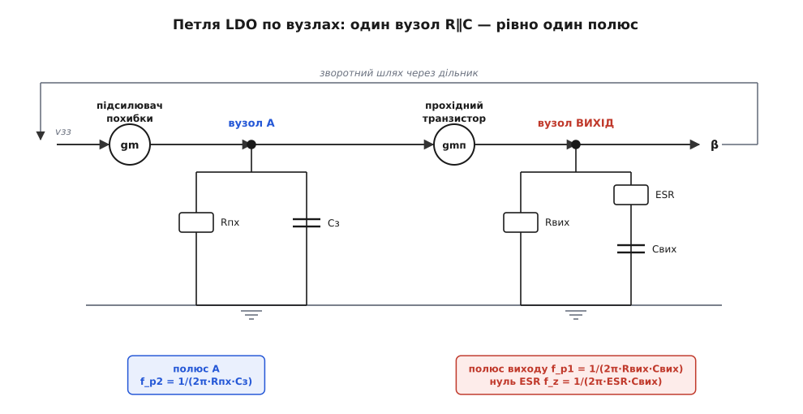
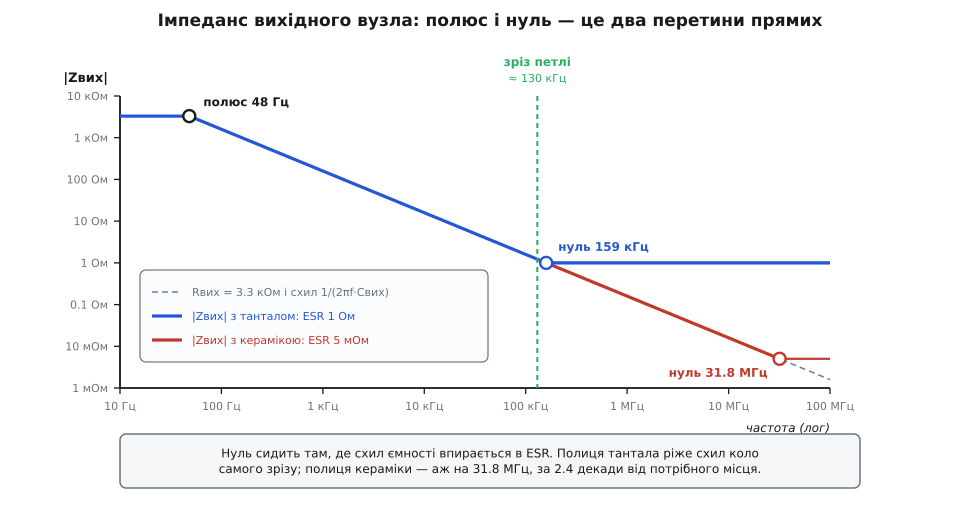
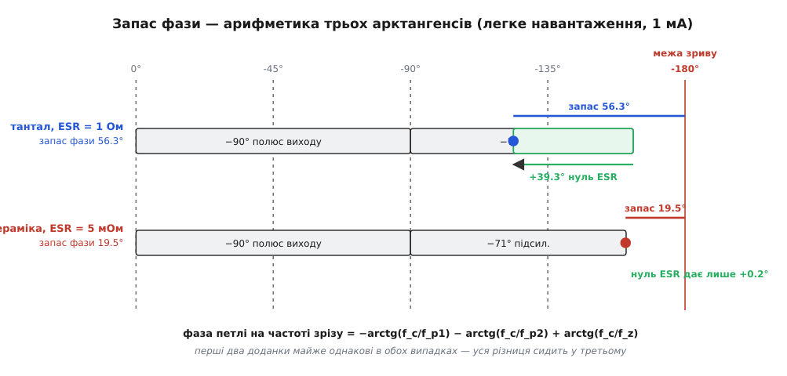

# 🧮 Полюси LDO: від вузла до числа запасу фази

Дві частоти, на яких тримається вся стійкість LDO, зазвичай подають готовими: полюс виходу на 1/(2π·Rвих·Cвих), полюс підсилювача похибки — «десь вище». Виглядає як формули, що впали з неба. Насправді їх не треба ні виводити через многочлени, ні запам'ятовувати: вони **читаються прямо зі схеми**, вузол за вузлом, а коштує це один рядок алгебри на вузол. А коли петля зібрана в один вираз, «запас фази» перестає бути якісним «є / нема» і стає числом, яке рахується за три арктангенси.

## Полюс — це не корінь многочлена, це вузол

Формальне означення коротке. Поведінку лінійного кола описує [передавальна функція](topic:electronics/transfer-function) T(s) — відношення двох многочленів від комплексної частоти s. **Полюс** (від лат. *polus* — вісь, кінець осі) — корінь знаменника: там T(s) злітає в безмежність. **Нуль** — корінь чисельника: там T(s) обертається на нуль.

Означення бездоганне — і для проєктування майже непридатне. Щоб знайти корені знаменника, треба спершу **мати** той знаменник, тобто вже розв'язати всю схему. Виходить замкнене коло: полюси потрібні, щоб зрозуміти схему, а щоб їх дістати, схему треба вже розуміти.

Розриває це коло одне спостереження — і воно ж уся практична теорія полюсів. Погляньмо на будь-який вузол, до якого підвішено опір R на землю й ємність C на землю. Його [імпеданс](topic:math/impedance) — паралельне з'єднання двох гілок:

```
Zвузла(s) = R ∥ 1/(s·C) = R · (1/(s·C)) / (R + 1/(s·C))
```

Помножмо чисельник і знаменник на s·C:

```
Zвузла(s) = R / (1 + s·R·C)
```

Ось воно. Знаменник — `1 + s·R·C`, його корінь — `s = −1/(R·C)`. Жодного многочлена розв'язувати не довелося: полюс **сам випав** із того, що ми записали паралельне з'єднання й скоротили дріб. І висновок цей загальний: **кожен вузол, який мусить заряджати ємність через опір, дає в передавальну функцію рівно один множник 1/(1 + s·R·C) — тобто рівно один полюс на частоті 1/(2π·R·C)**.

Тому полюси не шукають — їх **перелічують**. Ідеш по схемі, знаходиш вузли з ємністю на землю, і кожен такий вузол приносить свій полюс. Скільки вузлів — стільки й полюсів.

Звідки в частоті береться 2π і чому злам саме там, видно, якщо спитати, коли ємність починає перемагати опір. Опір ємності спадає з частотою як 1/(ω·C); поки він **більший** за R, струм у вузлі йде переважно крізь резистор і вузол поводиться як звичайний опір. Коли ж 1/(ω·C) стає **меншим** за R, ємність закорочує вузол і сигнал на ньому валиться. Межа — там, де вони зрівнялися:

```
1/(ω·C) = R   →   ω = 1/(R·C)   →   f = 1/(2π·R·C)
```

Отже 2π тут не прикраса, а переклад із кутової частоти ω у звичайну f, і сам злам — це буквально та точка, де опір ємності перетнув опір резистора.

А фаза? Підставмо s = j·ω у наш множник:

```
1/(1 + j·f/f_p)   →   модуль = 1/√(1 + (f/f_p)²),   фаза = −arctg(f/f_p)
```

Фаза полюса — **арктангенс**, і це важить більше, ніж здається. Арктангенс не «вмикається» на f_p, наче вимикач: він починає гнути фазу за декаду **до** зламу, дає рівно −45° **на** зламі й доповзає до −90° аж за декаду **після**. Полюс — не подія, а розтягнутий на дві декади процес; саме тому на [діаграмі Боде](topic:electronics/bode-plot) фаза «чує» злам заздалегідь.

І ще одне, глибше. Те, що −20 дБ/декаду й −90° ходять **парою** й ніколи не розлучаються, — не збіг і не домовленість. Для кіл із мінімальною фазою (а петля з резисторів, ємностей і транзисторів саме така) фаза **однозначно визначена** нахилом амплітудної характеристики: не можна взяти спад, не заплативши за нього фазою. Це співвідношення між загасанням і фазою вивів Гендрік Боде у праці «Relations Between Attenuation and Phase in Feedback Amplifier Design» (Bell System Technical Journal, липень 1940) — і саме воно робить діаграму Боде не просто зручним ескізом, а інструментом передбачення стійкості. [Запас фази](topic:electronics/stability-margins) тому й можна читати з амплітудної кривої: фаза в ній уже сидить.

> 🔧 **Навіщо це.** Правило «вузол із R та C = полюс» дає найшвидшу оцінку в голові, ще до всякої симуляції. Побачили в петлі високоомний вузол із підвішеною ємністю — знайте, що там сидить полюс, і одразу прикиньте, де саме. Звідси ж видно, чому даташит LDO нормує ємність вихідного конденсатора не менш суворо, ніж ESR: Cвих стоїть просто в знаменнику частоти полюса, тож поставити вдвічі менший конденсатор — це зсунути полюс виходу вдвічі вгору й переписати всю картину стійкості.

## Два вузли петлі LDO

Тепер пройдімо петлею й перелічимо вузли. Розірвімо її в зручному місці — перед входом підсилювача похибки — і простежмо сигнал по колу назад до розриву. Дорогою він проходить чотири речі: підсилювач похибки, вузол його виходу, прохідний транзистор, вузол виходу стабілізатора — і вертається через дільник.


*Петля, розібрана на дві однакові за будовою ланки. Кожен підсилювальний прилад — джерело струму, кероване напругою; кожен вузол — опір з ємністю, тобто рівно один полюс. Вузол A дає полюс від ємності затвора, вихідний вузол — полюс від Cвих і додатково нуль, бо його конденсатор має ESR послідовно з ємністю. Два вузли — два полюси: не більше й не менше.*

**Обидва підсилювальні прилади в цій петлі — джерела струму, керовані напругою.** Це не спрощення, а те, чим вони для малого сигналу є: підсилювач похибки обертає різницю напруг на струм зі своєю [крутістю](topic:electronics/transconductance), прохідний транзистор обертає напругу на затворі на струм стоку зі своєю крутістю gmп. А напругу з цього струму робить уже не прилад, а **опір вузла**, у який струм витікає. Звідси й уся структура петлі: двічі поспіль «крутість помножити на імпеданс вузла».

**Вузол A — вихід підсилювача похибки.** Високоомний вузол із власним опором Rпх, до якого підвішена ємність затвора прохідного транзистора Cз (разом із тим, що [Міллер](topic:electronics/miller-effect) додає від ємності затвор-стік). Опір і ємність на землю — ми вже знаємо, що з цього виходить:

```
Z_A(s) = Rпх / (1 + s·Rпх·Cз)      →   полюс   f_p2 = 1/(2π·Rпх·Cз)
```

**Вузол ВИХІД.** Тут цікавіше, бо конденсатор не голий: у нього є [ESR](topic:electronics/esr-capacitor) — опір **послідовно** з ємністю. Отже імпеданс вузла — це Rвих паралельно з ланцюжком (ESR + 1/(s·Cвих)):

```
Zвих(s) = Rвих ∥ (ESR + 1/(s·Cвих))
        = Rвих · (ESR + 1/(s·Cвих)) / (Rвих + ESR + 1/(s·Cвих))
```

Множимо чисельник і знаменник на s·Cвих — та сама одна дія, що й раніше:

```
Zвих(s) = Rвих · (1 + s·ESR·Cвих) / (1 + s·(Rвих + ESR)·Cвих)
```

І ось розгадка в чистому вигляді. Той самий один рядок алгебри видав **одразу дві** особливості:

```
нуль   (корінь чисельника):  f_z  = 1/(2π·ESR·Cвих)
полюс  (корінь знаменника):  f_p1 = 1/(2π·(Rвих + ESR)·Cвих) ≈ 1/(2π·Rвих·Cвих)
```

Нуль ESR — не риторична фігура й не подарунок долі: це буквально **корінь чисельника імпедансу вихідного вузла**. Він з'явився рівно тому, що ESR стоїть послідовно з ємністю, тобто в **чисельнику** її гілки. А наближення `f_p1 ≈ 1/(2π·Rвих·Cвих)` законне, поки ESR ≪ Rвих: на легкому навантаженні Rвих кілоомний, а ESR — одиниці омів, тож нехтуємо спокійно. На дуже важкому навантаженні, де Rвих спадає до одиниць омів, ця похибка вже помітна — і полюс виходу насправді сидить трохи нижче за паспортну формулу.

Геометрично обидва корені — просто дві точки перетину трьох прямих.


*Уся алгебра однією картинкою. Ліворуч вузол тримає Rвих; далі імпеданс веде вниз сама ємність як 1/(2πf·Cвих); а на високих частотах ємність уже нічого не важить і лишається її ESR — рівна полиця. Полюс — це точка, де полиця Rвих зустрічає схил ємності; нуль — точка, де схил ємності впирається в полицю ESR. Обидві частоти читаються з графіка лінійкою, без жодної формули.*

Варто відразу відзначити, що ховається в Rвих: це вихідний опір прохідного транзистора паралельно з опором навантаження **і паралельно з дільником зворотного зв'язку**. На робочих струмах дільник (сотні кілоомів) не важить нічого, але на справжньому холостому ході саме він задає Rвих і не дає полюсу виходу поїхати в одиниці герців.

## Підсилення петлі: два «крутість × опір» підряд

Тепер збираємо. Сигнал іде так: напруга на вході підсилювача → струм (крутість підсилювача gmпх) → напруга на вузлі A (×Z_A) → струм стоку (×gmп) → напруга на виході (×Zвих) → назад через дільник (×β). Множимо все підряд:

```
T(s) = gmпх · Z_A(s) · gmп · Zвих(s) · β
```

Підставмо знайдене й позначмо A₀ = gmпх·Rпх — власне підсилення підсилювача похибки:

```
                    1 + s/ω_z
T(s) = T₀ · ─────────────────────────── ,   T₀ = A₀ · gmп · Rвих · β
             (1 + s/ω_p1)(1 + s/ω_p2)
```

Уся петля — три множники й одне число. T₀ — підсилення петлі на постійному струмі, тобто у скільки разів петля давить помилку, коли їй нікуди поспішати. Структура T₀ читається без формул: A₀ — скільки дає підсилювач похибки; gmп·Rвих — скільки дає каскад на прохідному транзисторі (крутість зробила струм, опір вузла обернув струм на напругу — [точно так само, як у будь-якому підсилювальному каскаді](topic:electronics/transconductance)); β — яку частку виходу дільник вертає назад.

### Звідки береться gmп

Крутість прохідного транзистора — не паспортна цифра, а властивість **робочої точки**, тобто того самого струму навантаження. Форма залежності визначається тим, який це прилад і в якому він режимі:

```
біполярний:                    gm = I_C / V_T                        ∝ I
польовий, сильна інверсія:     gm = 2·I_D / Vнад = √(2·k·I_D)        ∝ √I
польовий, слабка інверсія:     gm = I_D / (n·V_T),  n ≈ 1.1…1.5      ∝ I
```

Тут Vнад = V_GS − V_th — надлишок напруги над порогом, k — параметр приладу, V_T ≈ 25.9 мВ — тепловий потенціал, n — коефіцієнт нахилу підпорогової ділянки.

Третій рядок — не екзотика, а щоденна реальність LDO, і його часто забувають. Прохідний транзистор, розрахований на ампер, при міліампері навантаження сидить **глибоко під порогом**: квадратичний закон там уже не діє, струм стоку залежить від напруги на затворі експоненційно ([підпорогова провідність](topic:electronics/subthreshold-leakage)), і крутість упирається в **стелю** gm = I_D/(n·V_T). Межа між режимами — приблизно там, де надлишок Vнад спадає до 2·n·V_T ≈ 70 мВ. Для нашого прикладу з амперним ключем на 1 мА квадратичний закон дав би 112 мС, а справжня крутість — 29.8 мС: помилка в 3.8 раза, якщо стелю не врахувати.

А тепер найкрасивіше в усій цій арифметиці. Візьмімо добуток gmп·Rвих — власне підсилення прохідного каскаду — і згадаймо, що на робочих струмах Rвих ≈ Rнав = Vвих/I:

```
слабка інверсія / біполярний:  gmп·Rвих = [I/(n·V_T)] · [Vвих/I] = Vвих/(n·V_T)   ← струм скоротився
сильна інверсія:               gmп·Rвих = [2·I/Vнад] · [Vвих/I]  = 2·Vвих/Vнад    ∝ 1/√I
```

Струм навантаження **скорочується**. Каскад на прохідному транзисторі має підсилення, яке на легких струмах узагалі не залежить від навантаження (воно дорівнює Vвих, поділеній на кілька теплових потенціалів), а на важких повільно спадає як 1/√I. Полюс виходу тим часом гуляє в сотні разів — а підсилення каскаду майже стоїть на місці. Це не випадковість: крутість росте зі струмом рівно з тією самою швидкістю, з якою опір навантаження спадає.

## Запас фази: три арктангенси

[Запас фази](topic:electronics/stability-margins) означений як відстань до −180° на частоті зрізу — тій, де модуль петлі падає до одиниці:

```
|T(j·2π·f_c)| = 1                       (означення частоти зрізу f_c)
запас фази = 180° + arg T(j·2π·f_c)
```

З нашого T(s) обидві величини випливають прямо: модуль — добуток модулів, фаза — сума фаз.

```
|T(f)| = T₀ · √(1 + (f/f_z)²) / [ √(1 + (f/f_p1)²) · √(1 + (f/f_p2)²) ]

arg T(f) = +arctg(f/f_z) − arctg(f/f_p1) − arctg(f/f_p2)
```

Три доданки, три арктангенси — і жодної магії. Два полюси тягнуть фазу вниз, нуль тягне вгору; знак у нуля протилежний, бо він сидить у чисельнику.

Тут-таки видно те, чого не каже коротке правило «нуль має бути нижчий за зріз». Арктангенс плавний, тож нуль, що стоїть **трохи вище** за зріз, усе одно платить корисною часткою: при f_z = 1.2·f_c він дає arctg(1/1.2) ≈ +40°. Правило «нижче зрізу» — це загрублена форма арктангенса: зручна для ескізу й надто сувора для розрахунку.

Частоту зрізу можна знайти чисельно, а можна асимптотично. Якщо обидва полюси вже далеко внизу (f ≫ f_p1, f_p2), а нуль ще далеко вгорі (f ≪ f_z), модуль спадає як −40 дБ/дек:

```
|T(f)| ≈ T₀ · f_p1 · f_p2 / f²  = 1   →   f_c ≈ √(T₀ · f_p1 · f_p2)
```

### Головне: Rвих скорочується

І ось звідси випадає найважливіше. Підставмо в асимптоту T₀ та f_p1 і подивімося, що станеться з Rвих:

```
f_c ≈ √(T₀ · f_p1 · f_p2)
    = √( [A₀·gmп·Rвих·β] · [1/(2π·Rвих·Cвих)] · f_p2 )
    = √( A₀ · β · gmп · f_p2 / (2π·Cвих) )
```

**Rвих зник.** Він стояв у T₀ в чисельнику, а в f_p1 у знаменнику — і скоротився начисто. Наслідок серйозніший, ніж здається: **навантаження рухає частоту зрізу тільки через крутість прохідного транзистора, і ніяк інакше**. Те, що полюс виходу їздить у сотні разів, само по собі зріз не зачіпає — бо рівно настільки ж, у протилежний бік, їде підсилення петлі, і в добутку вони гасять одне одного. Лишається сама крутість, та й та під коренем: у прикладі нижче gmп росте від 29.8 мС до 2.5 А/В (у 84 рази) на всьому діапазоні навантаження, а зріз — лише в √84 ≈ 9 разів.

Той самий скорочувальний фокус стоїть за тим, чому в операційних підсилювачів [добуток підсилення на смугу](topic:electronics/gain-bandwidth-product) — стала величина: підсилення й полюс рухаються назустріч, а їхній добуток не помічає різниці. Різниця лише в тому, що там гойдається опір при незмінній крутості, а тут із навантаженням їде ще й сама крутість — тому добуток T₀·f_p1 у LDO не стала величина, а пропорційна gmп.

## Порахуймо

**Приклад: LDO 3.3 В, той самий чип із танталом і з керамікою, легке навантаження.**

Дано: Vвих = 3.3 В, Vоп = 1.2 В, Cвих = 1 мкФ; підсилювач похибки A₀ = 200 з вихідним опором Rпх = 200 кОм; ємність затвора Cз = 20 пФ; прохідний PMOS із надлишком 0.4 В на повному струмі 0.5 А. Найтяжчий кут — легке навантаження 1 мА.

```
дільник:        β = Vоп/Vвих = 1.2/3.3 = 0.364
полюс A:        f_p2 = 1/(2π · 200·10³ · 20·10⁻¹²) = 39.8 кГц      (від струму не залежить)

на 1 мА:
  опір вузла:   Rвих ≈ Vвих/I = 3.3/0.001 = 3.3 кОм
  полюс виходу: f_p1 = 1/(2π · 3300 · 1·10⁻⁶) = 48.2 Гц
  режим ключа:  k = 2·0.5/0.4² = 6.25 А/В²;  Vнад = √(2·0.001/6.25) = 17.9 мВ
                17.9 мВ ≪ 2·n·V_T = 67 мВ   →   слабка інверсія, діє стеля
  крутість:     gmп = I/(n·V_T) = 0.001/(1.3 · 0.02585) = 29.8 мС
  каскад:       gmп·Rвих = 0.0298 · 3300 = 98.2
  петля:        T₀ = A₀ · (gmп·Rвих) · β = 200 · 98.2 · 0.364 = 7142   (77.1 дБ)

тантал, ESR = 1 Ом:
  нуль:         f_z = 1/(2π · 1 · 1·10⁻⁶) = 159.2 кГц
  зріз:         |T| = 1 при f_c = 130.1 кГц
  фаза:         −arctg(130.1 / 0.0482)  = −90.0°    ← полюс виходу
                −arctg(130.1 / 39.8)    = −73.0°    ← полюс підсилювача похибки
                +arctg(130.1 / 159.2)   = +39.3°    ← нуль ESR
                                  разом = −123.7°
  ЗАПАС ФАЗИ:   180° − 123.7° = 56.3°     ← здоровий

кераміка, ESR = 5 мОм:
  нуль:         f_z = 1/(2π · 0.005 · 1·10⁻⁶) = 31.8 МГц
  зріз:         |T| = 1 при f_c = 113.7 кГц
  фаза:         −arctg(113.7 / 0.0482)  = −90.0°    ← полюс виходу: той самий
                −arctg(113.7 / 39.8)    = −70.7°    ← полюс підсилювача: той самий
                +arctg(113.7 / 31831)   =  +0.2°    ← нуль ESR: нуля наче й нема
                                  разом = −160.5°
  ЗАПАС ФАЗИ:   180° − 160.5° = 19.5°     ← дзвін
```

Порівняйте два розклади. Перші два доданки практично однакові: −90.0° і −73.0° проти −90.0° і −70.7°. Уся різниця — у **третьому**: +39.3° проти +0.2°. Тантал і кераміка розійшлися не «якістю», не ємністю й не полюсами — рівно одним арктангенсом, і саме він коштує 37 градусів запасу.


*Фаза на зрізі — це проста сума трьох чисел, і два з трьох в обох випадках однакові. Полюс виходу забирає свої −90° (він за три декади під зрізом — арктангенс насичився), полюс підсилювача похибки забирає ще близько −71°. Різниця сидить лише в нулі ESR: тантал повертає +39.3° і лишає здорові 56.3° запасу, кераміка повертає +0.2° і лишає 19.5° — це вже дзвін. Один доданок вирішує долю петлі.*

Ті самі викладки кодом — щоб прогнати не дві точки, а весь діапазон ємності, ESR і струму:

:::tabs
```python
import math

# ── Мала-сигнальна петля LDO: два полюси + нуль ESR ─────────────────
VT     = 0.02585         # тепловий потенціал при 27 °C, В
N_SUB  = 1.3             # коефіцієнт нахилу підпорогової ділянки
V_OUT  = 3.3             # напруга виходу, В
V_REF  = 1.2             # опорна напруга, В
BETA   = V_REF / V_OUT   # частка виходу, що вертається в петлю
A_EA   = 200.0           # підсилення підсилювача похибки (його власне gm·R)
R_EA   = 200e3           # вихідний опір підсилювача похибки, Ом
C_G    = 20e-12          # ємність затвора прохідного транзистора, Ф
C_OUT  = 1e-6            # вихідний конденсатор, Ф

F_P2 = 1 / (2 * math.pi * R_EA * C_G)   # полюс вузла A — від струму не залежить


def gm_pass(i_load, v_ov_full=0.4, i_full=0.5):
    """Крутість прохідного PMOS у робочій точці i_load.
    Сильна інверсія: gm = 2·I/Vнад = √(2·k·I). Слабка: gm = I/(n·VT) — стеля."""
    k = 2 * i_full / v_ov_full ** 2              # параметр приладу, А/В²
    return min(math.sqrt(2 * k * i_load),        # квадратичний закон
               i_load / (N_SUB * VT))            # підпорогова стеля


def loop(f, i_load, esr):
    """Підсилення петлі на частоті f: (модуль, фаза в градусах)."""
    r_out = V_OUT / i_load                       # опір вузла виходу ≈ опір навантаження
    f_p1  = 1 / (2 * math.pi * r_out * C_OUT)    # полюс виходу
    f_z   = 1 / (2 * math.pi * esr * C_OUT)      # нуль ESR
    t0    = A_EA * gm_pass(i_load) * r_out * BETA
    mag = t0 * math.hypot(1, f / f_z) / (math.hypot(1, f / f_p1) * math.hypot(1, f / F_P2))
    deg = math.degrees(math.atan(f / f_z) - math.atan(f / f_p1) - math.atan(f / F_P2))
    return mag, deg


def crossover(i_load, esr):
    """Частота зрізу — де модуль петлі падає до одиниці (ділення навпіл по логарифму)."""
    lo, hi = 1.0, 1e9
    for _ in range(200):
        mid = math.sqrt(lo * hi)
        if loop(mid, i_load, esr)[0] > 1.0:
            lo = mid
        else:
            hi = mid
    return math.sqrt(lo * hi)


I = 1e-3                                          # найтяжчий кут: легке навантаження
for name, esr in [("тантал", 1.0), ("кераміка", 0.005)]:
    f_c = crossover(I, esr)
    print("%s: ESR=%5.3f Ом, нуль=%8.1f кГц, зріз=%6.1f кГц, запас фази=%4.1f°"
          % (name, esr, 1 / (2 * math.pi * esr * C_OUT) / 1e3, f_c / 1e3,
             180 + loop(f_c, I, esr)[1]))

# тантал:   ESR=1.000 Ом, нуль=   159.2 кГц, зріз= 130.1 кГц, запас фази=56.3°
# кераміка: ESR=0.005 Ом, нуль= 31831.0 кГц, зріз= 113.7 кГц, запас фази=19.5°
```
```cpp
#include <cmath>
#include <cstdio>

// ── Мала-сигнальна петля LDO: два полюси + нуль ESR ─────────────────
constexpr double PI    = 3.14159265358979323846;
constexpr double VT    = 0.02585;      // тепловий потенціал при 27 °C, В
constexpr double N_SUB = 1.3;          // коефіцієнт нахилу підпорогової ділянки
constexpr double V_OUT = 3.3;          // напруга виходу, В
constexpr double V_REF = 1.2;          // опорна напруга, В
constexpr double BETA  = V_REF / V_OUT;   // частка виходу, що вертається в петлю
constexpr double A_EA  = 200.0;        // підсилення підсилювача похибки
constexpr double R_EA  = 200e3;        // його вихідний опір, Ом
constexpr double C_G   = 20e-12;       // ємність затвора прохідного транзистора, Ф
constexpr double C_OUT = 1e-6;         // вихідний конденсатор, Ф

const double F_P2 = 1.0 / (2 * PI * R_EA * C_G);   // полюс вузла A — від струму не залежить

// Крутість прохідного PMOS: сильна інверсія ∝ √I, слабка — стеля I/(n·VT).
double gm_pass(double i_load)
{
    constexpr double V_OV_FULL = 0.4, I_FULL = 0.5;
    constexpr double k = 2 * I_FULL / (V_OV_FULL * V_OV_FULL);   // параметр приладу, А/В²
    return std::fmin(std::sqrt(2 * k * i_load), i_load / (N_SUB * VT));
}

struct Loop { double mag; double deg; };

Loop loop(double f, double i_load, double esr)
{
    const double r_out = V_OUT / i_load;                  // опір вузла виходу
    const double f_p1  = 1.0 / (2 * PI * r_out * C_OUT);  // полюс виходу
    const double f_z   = 1.0 / (2 * PI * esr * C_OUT);    // нуль ESR
    const double t0    = A_EA * gm_pass(i_load) * r_out * BETA;
    const double mag   = t0 * std::hypot(1.0, f / f_z)
                       / (std::hypot(1.0, f / f_p1) * std::hypot(1.0, f / F_P2));
    const double rad   = std::atan(f / f_z) - std::atan(f / f_p1) - std::atan(f / F_P2);
    return { mag, rad * 180.0 / PI };
}

// Частота зрізу — де модуль петлі падає до одиниці (ділення навпіл по логарифму).
double crossover(double i_load, double esr)
{
    double lo = 1.0, hi = 1e9;
    for (int i = 0; i < 200; ++i) {
        const double mid = std::sqrt(lo * hi);
        if (loop(mid, i_load, esr).mag > 1.0) lo = mid; else hi = mid;
    }
    return std::sqrt(lo * hi);
}

int main()
{
    constexpr double I = 1e-3;                    // найтяжчий кут: легке навантаження
    const struct { const char *name; double esr; } caps[] = {
        { "тантал",   1.0   },
        { "кераміка", 0.005 },
    };
    for (const auto &c : caps) {
        const double f_c = crossover(I, c.esr);
        std::printf("%s: ESR=%5.3f Ом, нуль=%8.1f кГц, зріз=%6.1f кГц, запас фази=%4.1f°\n",
                    c.name, c.esr, 1.0 / (2 * PI * c.esr * C_OUT) / 1e3,
                    f_c / 1e3, 180.0 + loop(f_c, I, c.esr).deg);
    }
}
```
:::

## Що ця арифметика вміє передбачити

З формул тепер витягується те, чого з якісної картини не видно.

**Мінімальний ESR — це формула, а не таблиця.** Умова «нуль не вище за зріз» дає `ESR ≥ 1/(2π·Cвих·f_c)`, тобто для нашого прикладу 1.36 Ом. Але точний рахунок каже, що вже 0.66 Ом дає запас 45°, а 1.12 Ом — 60°. Різниця вдвічі — та сама «знижка» від плавності арктангенса: нуль не мусить сидіти під зрізом, йому досить бути **поряд**. За грубою умовою довелося б шукати вдвічі «гірший» конденсатор, ніж насправді потрібен.

**Більший конденсатор дозволяє менший ESR.** Підставмо в ту саму умову знайдену вище частоту зрізу:

```
ESR_min = 1/(2π·Cвих·f_c) = 1 / √( 2π·Cвих · A₀·β·gmп·f_p2 )   ∝  1/√Cвих
```

Учетверо більший конденсатор удвічі послаблює вимогу до ESR: у прикладі 1.36 Ом на 1 мкФ обертаються на 0.43 Ом на 10 мкФ. Ось чому даташити нормують ємність і ESR **разом**, а не поодинці: це одна вимога, а не дві.

**Легке навантаження — найтяжчий кут, і видно чому.** Нуль ESR стоїть на 1/(2π·ESR·Cвих) і від струму **не залежить взагалі**. Зріз — залежить, як √gmп. На важкому навантаженні зріз їде вгору, нерухомий нуль опиняється відносно **нижче** й підпирає фазу дужче; на легкому зріз падає, і нуль лишається над ним, майже без користі. У нашому прикладі з танталом: 56.3° на 1 мА проти 89.2° на 0.5 А. Той самий конденсатор, та сама мікросхема — 33 градуси різниці, і винна сама лише крутість.

**Верхня стіна вікна ESR: модель сама каже, де вона скінчилась.** Порахуймо той самий тантал на 0.5 А — і модель видасть зріз 7.2 МГц. Це не «дуже швидкий LDO», це сигнал, що двополюсна модель вийшла за свою область: вище кількох мегагерц у справжній петлі вже працюють ті полюси, яких ми не записали. Механізм верхньої стіни саме такий: великий ESR робить полицю імпедансу високою, зріз тікає вгору й натикається на паразитні полюси — індуктивність виводів конденсатора, власні полюси прохідного транзистора, другий полюс підсилювача. Формула чесно попереджає про це тим, що дає безглузде число.

> 🔧 **Навіщо це.** Дві найкорисніші величини в усій цій арифметиці — не полюси, а **gmп на мінімальному струмі** й **добуток A₀·β**. Знаючи їх, ви за півхвилини оцінюєте зріз як √(A₀·β·gmп·f_p2/(2π·Cвих)) і мінімальний ESR як 1/(2π·Cвих·f_c) — і бачите вирок будь-якій заміні конденсатора ще до того, як паяльник нагрівся.

## Де ця модель бреше

Два полюси й один нуль — свідоме усічення, і корисно знати, що саме викинуто.

**Вузли не такі незалежні, як на схемі.** Ємність затвор-стік прохідного транзистора не висить на землю — вона **містком** з'єднує вузол A з виходом. Міллер частково перетворює її на ємність до землі (і саме тому вона входить у Cз), але частину пропускає **вперед**, повз транзистор, і це породжує ще й нуль у правій півплощині — той, що спускає фазу, як полюс, а модуль підіймає, як нуль. У точній моделі знаменник уже не розкладається на два незалежні множники.

**Rвих — не Vвих/I.** Це вихідний опір транзистора паралельно з навантаженням і паралельно з дільником. На мікроамперних струмах спокою перші два стають величезними й полюс задає дільник; на важких — навпаки, помітним стає ESR у сумі (Rвих + ESR).

**ESR і Cвих — не числа, а функції.** ESR танталу й алюмінію росте на морозі в рази, а керамічний конденсатор під робочою напругою втрачає більшу частину паспортної ємності. Підставляти в f_z = 1/(2π·ESR·Cвих) паспортні кімнатні цифри — окремий спосіб отримати сюрприз у полі.

**Полиця ESR не вічна.** Вище власного резонансу конденсатор — уже індуктивність, і його імпеданс повертає вгору. Це та сама стеля, об яку розбивається двополюсна модель на високих зрізах.

Що модель усе-таки схоплює правильно — це видно з паспортів справжніх приладів. Texas Instruments TPS767D301 — LDO на прохідному PMOS з виходом 3.3 В — вимагає вихідного конденсатора від 10 мкФ з ESR **між 60 мОм і 1.5 Ом** і друкує чотири графіки «TYPICAL REGION OF STABILITY: EQUIVALENT SERIES RESISTANCE (ESR) vs OUTPUT CURRENT», де підписані області «Region of Stability» та «Region of Instability» **обабіч**. Тобто вікно з двома стінами, накреслене проти струму навантаження, — не навчальна абстракція, а те, що виробник міряє й малює. Показові й дрібниці: області наведено окремо для 4.7 мкФ і для 22 мкФ (ємність і ESR таки нормують разом) та окремо для 25 °C і 125 °C (крутість і ESR обидві їдуть із температурою). А примітка під графіками уточнює, що ESR тут означає **повний послідовний опір** — самого конденсатора, будь-якого доданого зовнішнього резистора й доріжки плати до нього. У формулу f_z = 1/(2π·ESR·Cвих) підставляють саме цю суму: сантиметр тонкої доріжки — теж ESR, і на керамічному конденсаторі він може виявитися більшим за ESR самого конденсатора.

Ось, власне, і вся математика. Два вузли з ємністю дали два полюси, послідовний опір конденсатора дав нуль, дві крутості дали підсилення, а три арктангенси перетворили якісне «зірветься / не зірветься» на число в градусах. І найцінніше в цьому не самі формули, а те, що вони скорочуються: коли з асимптоти зрізу випадає Rвих, стає ясно, що вся залежність LDO від навантаження сидить в одній величині — крутості прохідного транзистора в робочій точці.
