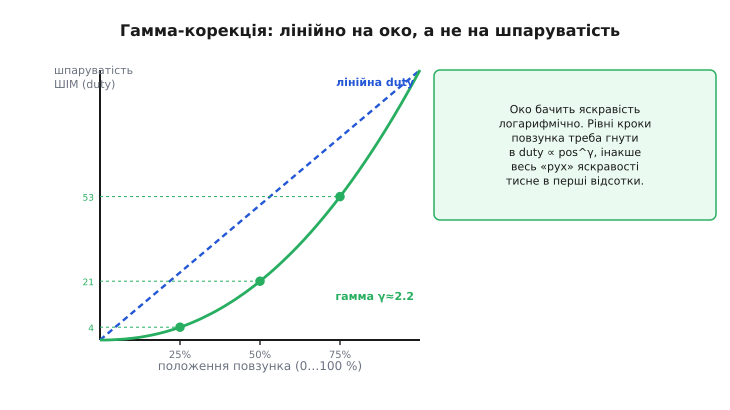
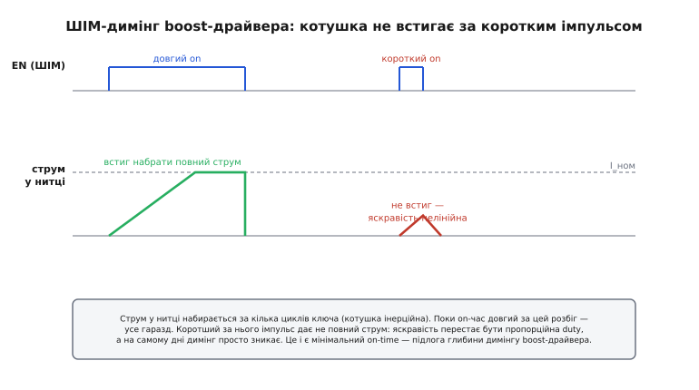

# ⚙️ ШІМ-димінг на ESP32: струм від Rset, яскравість від duty

Апаратне задання струму (`Rset`) і ШІМ-димінг яскравості — це дві половинки, що не знають одна про одну. Резистор `Rset` мовчки тримає крізь світлодіод рівно той струм, який ви заклали в залізо: коли драйвер увімкнено, крізь нитку тече повний номінал, і колір не пливе. А яскравість — це вже не про струм, а про те, **яку частку часу** драйвер увімкнено. Цією часткою керує мікроконтролер, ганяючи ніжку `EN` драйвера широтно-імпульсною модуляцією.

Звучить як два рядки коду — налаштувати ШІМ і писати в нього число. Так і є, поки димінг статичний. Але щойно ви захочете, щоб яскравість **плавно наростала**, щоб повзунок відчувався **рівномірно на око**, щоб **кілька каналів** мигали в лад, а під драйвером стоїть не резистор, а **імпульсний boost** — кожна з цих вимог має своє дно, об яке легко вдаритися. Ця стаття — про робочу прошивку під ESP32 і про те, де саме вона ламається.

## Задача

Пристрій має N світлодіодних каналів. У кожному — свій драйвер струму із заданим апаратно струмом (`Rset` під номінал нитки), а керування яскравістю заведено на ніжку `EN`/`PWM` драйвера, що приймає широтно-імпульсний сигнал. Треба:

1. **Задати яскравість** будь-якого каналу числом 0…max, не чіпаючи струм (колір мусить лишатися номінальним на всіх рівнях).
2. **Плавно переходити** між рівнями — без сходинок і ривків (наростання підсвітки, «дихання» індикатора, кросфейд).
3. Зробити шкалу **лінійною на око**, а не на шпаруватість, — бо око бачить яскравість геть не так, як росте duty.
4. **Синхронізувати** канали на спільну фазу, щоб вони вмикалися одночасно (RGB-піксель не повинен «розтікатися» кольорами в межах періоду; при вимкненні кількох каналів кидок струму по живленню не мусить накладатися).

І все це так, щоб не мерехтіло наживо, не свистіло вголос і не лягало смугами в кадр камери. Останнє — не косметика: якщо світло потрапляє в об'єктив (підсвітка сцени, індикатор у полі зору камери відеоспостереження), низька частота ШІМ дасть темні смуги на кожному кадрі.

> 🔧 **Навіщо це.** Рівно ця зв'язка — апаратний струм плюс програмний ШІМ-димінг — стоїть у переважній більшості реальних пристроїв зі світлодіодами: підсвітка екрана, що тьмяніє в темряві; кільце індикаторів, що «дихає» в режимі очікування; освітлювач камери з регулюванням; RGB-статус. Задання струму залізом знімає з процесора турботу про стабільність і колір; ШІМ на `EN` дає процесору дешеве, лінійне (у часі) керування яскравістю без жодного цифро-аналогового перетворювача. Зрозумієте пастки один раз — і вони перестануть коштувати вам днів налагодження «чому воно мерехтить/свистить/не гасне до нуля».

## Ідея

Розкладімо задачу на чотири незалежні механізми — кожен наступний надбудовується над попереднім, і кожен вирішує рівно одну з вимог.

**Струм — це залізо, яскравість — це час.** Драйвер із `Rset` тримає струм `I = V_ref/Rset` щоразу, коли він увімкнений. ШІМ на `EN` вмикає й вимикає його швидко; око інтегрує й бачить середню яскравість, пропорційну шпаруватості. Оскільки у ввімкненій фазі струм щоразу **повний**, [спектр і відтінок світла не залежать від рівня яскравості](book:electronics/led-photodiode) — на відміну від «аналогового» димінгу зменшенням струму, де білий люмінофор на малому струмі жовтіє. Це головна причина взагалі робити димінг часом, а не амплітудою.

**Плавність — це апаратний fade.** Наївне «плавно» — це крутити duty в циклі з невеликими паузами. Так можна, але процесор зайнятий, а кроки видно. ESP32 вміє краще: модуль LEDC має **апаратний fade** — ви задаєте кінцеву шпаруватість і час переходу, а залізо саме, без участі процесора, прокручує duty від поточного до цільового за заданий час рівними мікрокроками. Процесор вільний увесь перехід.

**Лінійність на око — це гамма-корекція.** Око сприймає яскравість приблизно логарифмічно: різницю між 1 % і 2 % воно бачить величезною, а між 90 % і 100 % — ледь-ледь. Якщо крутити duty лінійно, весь відчутний «рух» яскравості спресується в перші відсотки шкали, а верхня половина буде мертвою зоною. Лік — гнути шкалу: те, що приходить від повзунка як «положення», перед подачею в ШІМ підносити до степеня `duty ∝ position^γ` (γ≈2.2). Тоді рівні кроки повзунка дають рівні **на око** кроки яскравості.


*Синій пунктир — «сира» лінійна шкала: duty дорівнює положенню повзунка. Зелена крива — гамма-скоригована: положенню 25 % відповідає duty лише ~4 %, положенню 50 % — ~21 %, 75 % — ~53 %. Саме така кривина робить шкалу рівномірною на око — бо око стискає верх діапазону й розтягує низ.*

**Синхронність — це спільна фаза й timer_sync.** Кожен ШІМ-канал має свій лічильник фази — момент у періоді, коли duty перемикається. Якщо канали крутяться від різних лічильників, їхні фронти «розповзаються», і фази вмикання гуляють одна відносно одної. LEDC дає це прибрати: канали можна повісити на **спільний таймер**, а оновлення duty кількох каналів — засинхронити так, щоб нові значення набули чинності всі разом, від того самого фронту.

Зберемо це знизу вгору. Спершу — базовий канал і апаратний fade. Потім — таблиця гамма-корекції поверх fade. Потім — синхронний старт кількох каналів. Наприкінці — пастки, які накриваються тільки на реальному залізі, надто з імпульсним драйвером.

## Робочий C/C++

Код — на ESP-IDF (нативний драйвер `driver/ledc.h`), бо саме там живуть апаратний fade і гамма-fade; поверх Arduino-обгортки їх не дістати. Прошивка збирається під будь-який ESP32 із LEDC (класичний ESP32, S2, S3, C3 і далі). Один канал — одна ніжка `EN`/`PWM` драйвера струму.

### Базовий канал і апаратний fade

Спершу піднімемо таймер і канал, увімкнемо службу fade — і навчимося плавно переходити на будь-який рівень duty без участі процесора.

```c
#include "driver/ledc.h"
#include "esp_err.h"

// ── Параметри ШІМ-димінгу ───────────────────────────────────────────────
#define DIM_TIMER      LEDC_TIMER_0
#define DIM_MODE       LEDC_LOW_SPEED_MODE     // low-speed group: є на всіх ESP32
#define DIM_RES        LEDC_TIMER_12_BIT       // 12 біт → duty 0..4095
#define DIM_FREQ_HZ    20000                   // 20 кГц: вище чутного й видимого
#define DIM_DUTY_MAX   ((1 << 12) - 1)         // 4095

// Один фізичний канал димінгу: ніжка EN драйвера ↔ канал LEDC.
typedef struct {
    int              gpio;      // ніжка EN/PWM драйвера струму
    ledc_channel_t   channel;   // апаратний канал LEDC
} dim_ch_t;

// Підняти спільний таймер (робимо раз перед каналами).
static void dim_timer_init(void) {
    ledc_timer_config_t tcfg = {
        .speed_mode      = DIM_MODE,
        .timer_num       = DIM_TIMER,
        .duty_resolution = DIM_RES,
        .freq_hz         = DIM_FREQ_HZ,
        .clk_cfg         = LEDC_AUTO_CLK,
    };
    ESP_ERROR_CHECK(ledc_timer_config(&tcfg));
}

// Прив'язати канал до ніжки; старт із нуля (світлодіод погашено).
static void dim_channel_init(const dim_ch_t *ch) {
    ledc_channel_config_t ccfg = {
        .speed_mode = DIM_MODE,
        .channel    = ch->channel,
        .timer_sel  = DIM_TIMER,
        .gpio_num   = ch->gpio,
        .duty       = 0,
        .hpoint     = 0,        // фаза вмикання (див. синхронізацію нижче)
    };
    ESP_ERROR_CHECK(ledc_channel_config(&ccfg));
}

// Увімкнути апаратну службу fade (раз на весь застосунок).
static void dim_fade_service_init(void) {
    ESP_ERROR_CHECK(ledc_fade_func_install(0));   // 0 = без своїх прапорців ISR
}

// Плавний перехід каналу до цільового duty за задану кількість мілісекунд.
// Залізо саме прокручує duty; процесор вільний.  NO_WAIT = не блокуємось.
static void dim_fade_to(const dim_ch_t *ch, uint32_t target_duty, int ms) {
    if (target_duty > DIM_DUTY_MAX) target_duty = DIM_DUTY_MAX;
    ESP_ERROR_CHECK(ledc_set_fade_with_time(DIM_MODE, ch->channel, target_duty, ms));
    ESP_ERROR_CHECK(ledc_fade_start(DIM_MODE, ch->channel, LEDC_FADE_NO_WAIT));
}
```

Кілька рішень тут не випадкові. **12 біт** роздільності (`0..4095`) взято навмисно з запасом: після гамма-корекції низ шкали розтягується, і 8 біт там дали б грубі, помітні сходинки на малій яскравості (детальніше — у пастках). **`LEDC_LOW_SPEED_MODE`** — бо high-speed група є не на всіх кристалах (S2/C3 її не мають), а low-speed — всюди; для димінгу її цілком досить. **20 кГц** — вище і за поріг видимого мерехтіння, і за верх чутного діапазону (див. пастку про свист). А `ledc_set_fade_with_time` + `ledc_fade_start` — це і є той самий апаратний fade: після старту процесор ні на що не витрачається, залізо саме доведе duty до цілі за `ms` мілісекунд рівними кроками.

### Гамма-корекція поверх fade

Тепер надбудуємо шкалу «на око». Найпростіший і найшвидший спосіб — **таблиця**: наперед порахувати для кожного положення повзунка відповідний duty за законом `duty = duty_max · (pos/pos_max)^γ`, покласти в масив і на льоту брати індексом. Так у гарячому шляху немає жодного `pow()` — тільки читання з таблиці.

```c
#include <math.h>
#include <stdint.h>

// Роздільність повзунка яскравості (окремо від роздільності duty!).
#define DIM_LEVELS   256                 // положення 0..255
#define DIM_GAMMA    2.2f                // ≈ сприйняття ока

// Таблиця: положення повзунка → гамма-скоригований duty.
static uint16_t g_gamma_lut[DIM_LEVELS];

// Порахувати таблицю раз при старті.  duty = MAX · (level/(LEVELS-1))^γ
static void dim_gamma_build(void) {
    for (int i = 0; i < DIM_LEVELS; i++) {
        float x = (float)i / (float)(DIM_LEVELS - 1);        // 0.0 .. 1.0
        float d = powf(x, DIM_GAMMA) * (float)DIM_DUTY_MAX;
        // округлення до найближчого; нуль лишається нулем (повне гасіння)
        g_gamma_lut[i] = (uint16_t)(d + 0.5f);
    }
    // Гарантуємо монотонність і крайні точки навіть за похибок округлення.
    g_gamma_lut[0]             = 0;
    g_gamma_lut[DIM_LEVELS-1]  = DIM_DUTY_MAX;
}

// Задати яскравість каналу за положенням повзунка (0..255), плавно за ms.
static void dim_set_level(const dim_ch_t *ch, uint8_t level, int ms) {
    uint16_t duty = g_gamma_lut[level];          // гамма вже врахована
    dim_fade_to(ch, duty, ms);                   // і одразу плавний перехід
}
```

Розберімо, що дає ця таблиця. Візьміть `DIM_GAMMA = 2.2` і подивіться на кілька точок: положення 128 (середина повзунка) дає не 2048 (половина duty), а `4095·(128/255)^2.2 ≈ 4095·0.226 ≈ 926` — усього ~23 % шпаруватості. Око при цьому побачить рівно «половину яскравості», бо його власна крива це компенсує. Низ шкали розтягнутий: положення 1…10 дають duty 0…8 — тонкі градації на самому дні, де око найчутливіше. Ось чому 12-бітна роздільність duty критична: якби duty був 8-бітний (`0..255`), уся нижня чверть повзунка відображалась би лише в duty 0…3, і замість плавного тління ви б мали чотири грубі сходинки.

> 🔧 **Навіщо це.** Гамма-корекція — різниця між «дешевим» і «дорогим» відчуттям пристрою. Без неї повзунок яскравості «мертвий» у верхній половині й стрибає в нижній — класична ознака нашвидкуруч зробленої підсвітки. З нею той самий повзунок стелиться рівно від ледь-ледь до повного. Коштує це один масив на 256 чи 512 `uint16_t` (пів кілобайта) і один `powf` на елемент **при старті** — у робочому циклі жодної зайвої операції.

ESP-IDF, до речі, вміє гнути гамма-криву й **апаратно**: `ledc_fill_multi_fade_param_list()` розкладає перехід на кілька лінійних відрізків, що наближають задану гамма-функцію, а `ledc_set_multi_fade()` + `ledc_fade_start()` проганяють увесь цей кусково-лінійний fade залізом — до 16 відрізків поспіль без процесора. Це варте заходу, коли вам треба **плавний гамма-fade великого діапазону** (наприклад, м'яке пробудження підсвітки від нуля до максимуму за секунду з рівномірною на око швидкістю). Для звичайного «поставити рівень» таблиця простіша й переноситься на будь-який кристал; апаратний multi-fade є не скрізь.

### Синхронний старт кількох каналів

Тепер N каналів. Дві вимоги: усі висять на **спільному таймері** (щоб фази не розповзалися) і оновлення duty набувають чинності **одночасно** (щоб RGB-піксель перемкнув усі три складові від того самого фронту, а не по черзі).

Спільний таймер уже забезпечено: `dim_channel_init()` прив'язує кожен канал до `DIM_TIMER`. Лишається синхронне оновлення. Тут є тонкість: `ledc_fade_start()` запускає fade **пооканально** й асинхронно, тож для по-справжньому синхронного **миттєвого** перемикання (без fade) кількох каналів беруть пару «підготувати duty, не застосовуючи» → «застосувати все разом».

```c
// Група каналів (напр. R, G, B одного пікселя або кілька зон підсвітки).
#define DIM_GROUP_N   3
static const dim_ch_t g_group[DIM_GROUP_N] = {
    { .gpio = 25, .channel = LEDC_CHANNEL_0 },   // R
    { .gpio = 26, .channel = LEDC_CHANNEL_1 },   // G
    { .gpio = 27, .channel = LEDC_CHANNEL_2 },   // B
};

// Миттєво й СИНХРОННО виставити рівні всіх каналів групи (без fade).
// Спершу заряджаємо duty у тіньові регістри БЕЗ застосування,
// потім одним викликом даємо їм набути чинності від спільного фронту.
static void dim_group_set_sync(const uint8_t level[DIM_GROUP_N]) {
    for (int i = 0; i < DIM_GROUP_N; i++) {
        uint16_t duty = g_gamma_lut[level[i]];
        // set_duty записує в буфер; update_duty застосовує. Тут — тільки set:
        ESP_ERROR_CHECK(ledc_set_duty(DIM_MODE, g_group[i].channel, duty));
    }
    // Тепер застосовуємо всі разом — фронти збігаються.
    for (int i = 0; i < DIM_GROUP_N; i++) {
        ESP_ERROR_CHECK(ledc_update_duty(DIM_MODE, g_group[i].channel));
    }
}
```

Розділення `set_duty` (записати в тіньовий регістр) і `update_duty` (застосувати) — це і є важіль синхронності: спершу ми заряджаємо всі три нові значення, і жодне ще не діє; потім швидко застосовуємо їх поспіль. Оскільки всі канали тактуються **одним** таймером, нові значення підхоплюються від того самого перемикання лічильника, і три складові пікселя перемикаються злагоджено — без видимого «розтікання» кольору в межах періоду.

Є й друга, глибша причина синхронити канали — **живлення**. Коли кілька каналів вимикаються в один і той самий момент фази, їхні кидки струму по спільній шині складаються в один великий сплеск. Розвести фази вмикання (дати кожному каналу свій `hpoint` — момент у періоді, коли duty йде вгору) — і ці кидки розмажуться в часі, а не накладуться. `hpoint` виставляється в `ledc_channel_config_t` при ініціалізації (поле `.hpoint`) або окремо; для рівномірного розкладу N каналів беруть `hpoint_i = i · (period / N)`. Це протилежний бік тієї самої монети: іноді треба **збіг** фаз (RGB-піксель), іноді навпаки **розкид** (щоб не бити по живленню), — і `hpoint` дає й те, й те.

## Складність і пастки

Код вище працює на столі з будь-яким лінійним драйвером. Але справжні граблі вилазять на реальному залізі, і найбільше — коли під ШІМ-димінгом стоїть **імпульсний boost-драйвер**. Пройдімо їх по одній.

### Короткий імпульс проти інерції котушки

Найглибша пастка. Лінійний драйвер струму реагує на `EN` майже миттєво — увімкнув, за мікросекунди струм повний. А [boost-драйвер](book:electronics/boost) — це петля з **котушкою**, і струм у нитці не з'являється миттєво: [котушка інерційна](book:electronics/converter-inductor), її струм наростає кілька тактів ключа, поки петля виведе його на номінал. Простежте, що це означає для ШІМ-димінгу.


*Верхня доріжка — сигнал `EN` (ШІМ-димінг). Нижня — струм у нитці. При довгому імпульсі струм за кілька тактів ключа доростає до `I_ном` і тримається до кінця — усе гаразд. Але надто короткий імпульс скінчиться раніше, ніж струм устигне набратися: у нитку піде лише жалюгідний горбик, яскравість перестає бути пропорційна duty, а на самому дні димінг просто зникає.*

Поки on-час ШІМ-димінгу **набагато довший** за час розбігу струму котушки — усе чесно: більшу частину імпульсу струм повний, середнє світло пропорційне шпаруватості. Але щойно ви жадаєте дуже глибокого димінгу (1 %, 0.5 %), on-час стискається до кількох мікросекунд — і стає **коротшим** за час набору струму. Boost фізично не встигає вивести котушку на номінал; у нитку йде не повний струм, а куций горбик. Наслідок подвійний: по-перше, яскравість перестає лінійно йти за duty (2 % duty дають зовсім не 2 % світла); по-друге, на самому дні світло взагалі не гасне пропорційно — є мертва зона, нижче якої димінг не працює. Реальні числа: типовому boost-драйверу треба кілька тактів на розбіг — наприклад, у поширеного контролера це близько 12 мкс мінімального імпульсу при частоті ключа 430 кГц; коротше — і струм не встигає.

Звідси **мінімальний on-time** (`min on-time`) як фізична підлога глибини димінгу. Він жорстко зчеплений із частотою ШІМ-димінгу: підлога — це фіксований абсолютний час (напр. 12 мкс), а період димінгу — `1/f`. На 20 кГц період 50 мкс, і 12 мкс — це вже 24 % — тобто нижче ~1:4 ви димувати не можете взагалі. Хочете глибокий димінг boost-драйвера — **знижуйте частоту ШІМ-димінгу** (на 200 Гц період 5 мс, і ті ж 12 мкс — це 0.24 %, тобто діапазон ~1:400). Виробники драйверів для великих коефіцієнтів димінгу борються з цим апаратно — попередньо підкачують котушку перед фронтом, щоб струм устигав, і витягують відношення до 15000:1, — але у вашій прошивці важіль один: частота проти глибини.

І тут — **пряма суперечність** із попередньою пасткою. Свист і мерехтіння штовхають частоту **вгору** (≥20 кГц). Глибина димінгу boost-драйвера штовхає її **вниз** (сотні герц). Обидві вимоги одночасно не вдовольнити тим самим ШІМом. Виходів кілька: якщо потрібен і тихий високочастотний ШІМ, і глибокий димінг — комбінують **гібрид** (грубо — амплітудою струму, тонко — ШІМом) або беруть драйвер з апаратним pre-charge. Просто «поставити 20 кГц і крутити duty до нуля» на boost-драйвері **не спрацює** — низ шкали буде брехливий.

> 🔧 **Навіщо це.** Це та пастка, що коштує днів: на столі з лінійним макетом усе плавно до нуля, а на серійній платі з boost-драйвером підсвітки нижні 20 % повзунка «залипають» або мигтять. Причина не в коді — у фізиці котушки. Перш ніж узагалі писати димінг під імпульсний драйвер, знайдіть у його даташиті `min on-time` (або `min PWM pulse`), поділіть на бажаний період — і ви одразу знаєте максимально досяжну глибину. Якщо не влаштовує — питання вирішується вибором драйвера й частоти, а не підкручуванням прошивки.

### Свист котушки й видимі смуги в кадрі

Частота ШІМ-димінгу мусить оминути дві зони. Знизу її підпирає **чутний діапазон**: якщо частота ШІМ (або її помітні складові) лягає в 0.02…20 кГц, котушка драйвера й керамічні конденсатори починають **співати** — п'єзоефект кераміки й магнітострикція котушки перетворюють пульсації струму на чутний тон. Особливо гидко це на кількох сотнях герц — тонкий свербкий свист, який чути в тиші. Тому ШІМ-димінг силового драйвера тримають **вище 20 кГц** — за верхом чутного, щоб «спів» пішов в ультразвук. (Саме тому в базовому коді `DIM_FREQ_HZ = 20000`.)

Зверху й збоку її підпирає **камера**. Тут два різні механізми, не плутайте:

- **Мерехтіння наживо і для ока** прибирається вже на кількох сотнях герц — око не встигає за гасінням.
- **Смуги в кадрі** — інша річ. Камери з роздрібним затвором (rolling shutter, більшість CMOS-сенсорів) зчитують кадр рядок за рядком; якщо світло за час зчитування кадру встигає кілька разів згаснути й запалитися, різні рядки ловлять різну фазу ШІМ — і кадр розкреслюється темними смугами. Щоб смуг не було, період ШІМ має бути **набагато коротшим** за час зчитування кадру, тобто частота ШІМ — суттєво вища за частоту кадрів помножену на кількість рядків. Практично ті самі одиниці-десятки кілогерц знімають і це.

Отже, «золоте вікно» для силового ШІМ-димінгу — **вище 20 кГц**: і не свистить, і не мерехтить, і не смугує. Виняток — коли під драйвером boost і потрібен глибокий димінг (попередня пастка): тоді доводиться жертвувати або тишею (низька частота + екранування/заливка компаундом проти свисту), або глибиною.

### Гамма з'їдає низ роздільності — беріть duty ширше

Гамма-корекція розтягує низ шкали, і це б'є по роздільності. Якщо ваш повзунок 8-бітний і duty теж 8-бітний, то після `duty = 255·(x)^2.2` кілька перших положень повзунка **зіллються** в той самий duty (0, 0, 1, 1, 2…), а зовсім унизу з'явиться помітний стрибок від 0 одразу до першого ненульового рівня. Око, найчутливіше саме на дні, це побачить як грубі сходинки або «клац» при вмиканні з нуля.

Лік — тримати **duty ширшим за повзунок**: повзунок 8 біт (256 положень), а duty 12 біт (4096 рівнів), як у коді вище. Тоді навіть розтягнутий гамма-кривою низ має досить дискретних значень, щоб градації були непомітні. Правило грубе, але робоче: роздільність duty беріть хоча б на 3–4 біти ширшою за роздільність повзунка. І будуйте таблицю в `uint16_t`, а не `uint8_t`, — інакше ви ж і зріжете той запас, що дає 12-бітний таймер.

### Fade б'ється з циклом, що сам пише duty

Апаратний fade і ручний запис duty — **конкуренти за той самий регістр**. Класична помилка: запустили `ledc_fade_start(... NO_WAIT)` (перехід ще триває, залізо крутить duty), а наступним рядком у циклі викликали `ledc_set_duty()`/`dim_set_level()` з новим значенням. Другий виклик перебиває fade на півдорозі — виходить сіпанина або перехід «не туди». Правило: якщо канал у процесі fade, не пишіть у нього duty вручну до кінця переходу. Або дочекайтеся (`LEDC_FADE_WAIT_DONE` замість `NO_WAIT`, якщо можна блокуватися), або відстежуйте завершення через колбек `ledc_cb_register()` і лише тоді давайте нову ціль. Найпростіше — тримати за канал прапорець «fade активний» і не чіпати duty, поки він піднятий.

### Не забудьте `hpoint`, коли каналів багато

`hpoint` за замовчуванням нульовий у всіх каналів — тобто всі вмикаються від початку періоду. Для RGB-пікселя це саме те, що треба (складові збігаються). Але коли у вас десяток незалежних яскравих каналів на спільній шині живлення, **однаковий** `hpoint` означає, що всі десять вмикаються в ту саму мікросекунду — і на вході складається десятикратний кидок струму, що просаджує шину й гріє вхідний конденсатор. Рознесіть фази: `hpoint_i = i · (period_ticks / N)`. Кидки розмажуться по періоду рівномірно, пульсація на вході впаде в рази. Це не про яскравість (середнє світло те саме), а про [чистоту живлення й стійкість шини](book:electronics/feedback-stability) — надто якщо поруч чутлива аналогова частина.

### Коротко про решту

- **Ніжка `EN` — це вимикач, а не вхід струму.** ШІМ на `EN` вмикає й вимикає **весь драйвер**; струм задає `Rset`, і чіпати його duty не можна. Не плутайте цей `EN`-димінг із «аналоговим» входом деяких драйверів (`CTRL`/`ADJ`), куди подають напругу і який **міняє сам струм** (а отже і колір). Гамма й fade у цій статті — саме для `EN`/`PWM`-входу.
- **Стартова фаза — з нуля.** Ініціюйте канал з `duty = 0`, а не з довільного значення: інакше при подачі живлення світлодіод спалахне на повну ще до першого `dim_set_level()`.
- **Спільний таймер = спільна частота.** Усі канали на одному таймері мають **однакову** частоту й роздільність. Треба різні частоти (напр. силовий канал на 25 кГц, а індикаторний на 1 кГц) — розводьте по різних таймерах LEDC.

> 🔧 **Навіщо це.** Три механізми — апаратний fade, гамма-таблиця, синхронний старт — це десяток рядків кожен, і вони роблять димінг «дорогим на дотик» майже задарма по ресурсах. Але жоден із них не рятує від фізики драйвера під ними: коротший за розбіг котушки імпульс boost не витягне, свист і смуги диктують частоту знизу й зверху, а гамма з'їсть роздільність, якщо не дати duty запасу. Пишіть прошивку, тримаючи в голові, **який** драйвер вона гойдає: над лінійним — воля повна, над імпульсним — спершу порахуйте `min on-time / період`, а вже потім крутіть duty.
