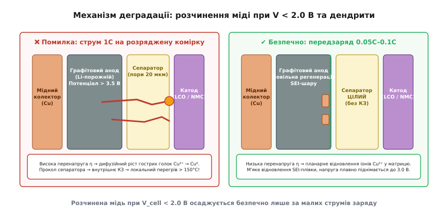
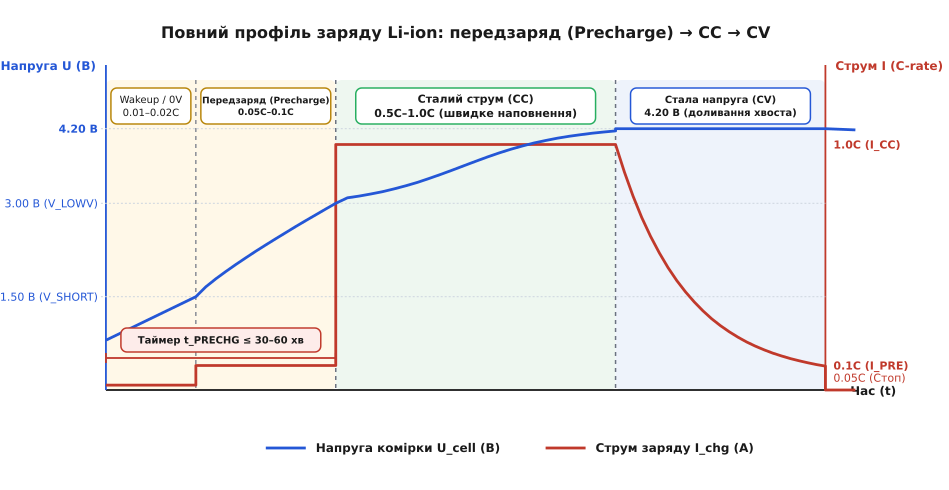
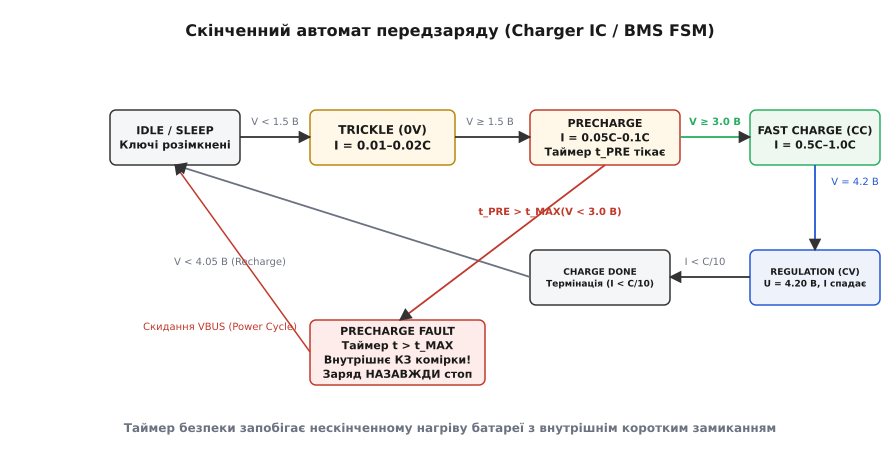
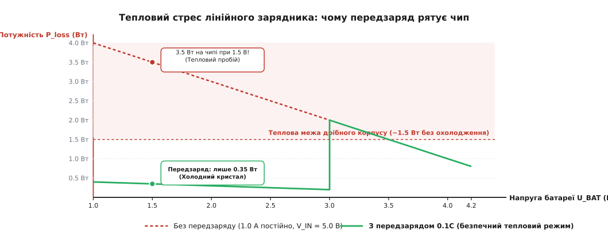

# Попередній заряд літієвої комірки

<preknowlist>
- [Зарядка Li-ion](book:electronics/li-ion-charger) — базовий алгоритм CC/CV: перехід від сталого струму до сталої напруги 4.20 В та термінація за спаданням струму.
- [Захист акумулятора](book:electronics/battery-protection) — первинні схеми захисту на базі компараторів та ключів MOSFET: відсічка за низькою напругою (UVLO) та струмове перевантаження.
- [C-rate й опір](book:electronics/c-rate) — нормалізація сили зарядного й розрядного струмів відносно номінальної ємності та природа омічних втрат.
- [Старіння батарей](book:electronics/battery-aging) — механізми хімічної деградації, утворення захисної плівки SEI на аноді та ріст внутрішнього імпедансу.
- [Система керування батареєю (BMS)](book:electronics/bms) — багаторівневий моніторинг напруг окремих комірок, вирівнювання дисбалансу та захисні алгоритми.
</preknowlist>

Якщо портативний прилад із літій-іонним (від грец. *líthos* — камінь) акумулятором ємністю 2000 мА·год пролежав у шухляді вісім місяців, його первинна схема захисту розімкнула вихідні ключі ще на позначці 2.50 В, після чого безперервний паразитарний саморозряд повільно опустив внутрішню напругу комірки до 1.60 В. Коли користувач підключає такий пристрій до зарядного адаптера, і силове коло без перевірки одразу спрямовує в розряджений акумулятор повний струм швидкого заряду силою 1C (2.0 А), батарея не просто відмовляється заряджатися швидше: уже за 5–10 хвилин усередині формуються гострі металеві голки, які проколюють мікропористий полімерний сепаратор, створюють внутрішнє коротке замикання та викликають неконтрольований тепловий розгін із виділенням токсичних газів і самозайманням.

Щоб запобігти руйнуванню хімічної структури глибоко розрядженого акумулятора, процес заряду літієвих елементів обов'язково починається з окремої контрольованої фази — **попереднього заряду** (англ. *precharge*, або краплинного відновлення — *trickle charge*). Розгляньмо, які електрохімічні фазові переходи відбуваються в комірці при напрузі нижче 2.5–3.0 В, чому металічний колектор анода починає буквально розчинятися в електроліті, як обмеження струму на рівні 0.05C–0.10C рятує сепаратор від дендритів, та як апаратні контролери й прошивки BMS реалізують алгоритми захисту за часом і напругою.

### Анатомія глибокого розряду: що змінюється всередині комірки

Будь-яка сучасна літій-іонна або літій-полімерна комірка складається з чотирьох ключових компонентів:
1. **Позитивний електрод (катод, від грец. *káthodos* — рух униз):** Оксид перехідного металу (наприклад, `LiCoO2`, `LiNiMnCoO2` або `LiFePO4`), нанесений на тонкий струмоприймач із алюмінієвої фольги.
2. **Негативний електрод (анод, від грец. *ánodos* — рух угору):** Дрібнодисперсний графіт або кремній-графітовий композит, нанесений на струмоприймач із мідної фольги завтовшки 6–10 мкм.
3. **Електроліт (від грец. *ēlektron* — бурштин + *lytós* — розчинний):** Розчин солі гексафторфосфату літію (`LiPF6`) у суміші рідких органічних карбонатів (етиленкарбонату, диметилкарбонату, етилметилкарбонату).
4. **Сепаратор (від лат. *separator* — розділювач):** Тонка мікропориста поліолефінова мембрана (поліетилен або поліпропілен) завтовшки 15–25 мкм, яка фізично ізолює катод від анода, але вільно пропускає іони літію крізь заповнені електролітом пори розміром 20–50 нм.

Під час нормальної роботи акумулятора в діапазоні напруг від 3.0 В до 4.2 В графітова матриця анода містить значну кількість інтеркальованого (від лат. *intercalare* — вставляти між) літію (`LiC6`). Присутність вільних атомів літію в кристалічній ґратці вуглецю створює надзвичайно низький власний електрохімічний потенціал анода: він становить усього `+0.05...+0.20 В` відносно стандартного електрода металічного літію (`Li/Li⁺`). 

Мідний струмоприймач негативного електрода в таких умовах перебуває в зоні абсолютної термодинамічної стабільності, оскільки стандартний потенціал окиснення металічної міді до іонів `Cu²⁺` є значно вищим: `E°(Cu²⁺/Cu) = +3.38 В відносно Li/Li⁺`.

```
U_cell = φ_cathode − φ_anode
```

Коли акумулятор розряджається нижче безпечної робочої межі 3.00 В, іони літію майже повністю залишають графітову матрицю і повертаються в кристалічну структуру катода. Щойно ступінь деінтеркаляції графіту досягає 100% (усі міжшарові порожнини вуглецю порожні), графітовий анод втрачає здатність утримувати низький електричний потенціал.

Без електрохімічного захисту інтеркальованого літію власний потенціал анода `φ_anode` стрімко злітає вгору. Якщо напруга на клемах комірки падає нижче `1.50–2.00 В`, потенціал графітового анода перевищує критичний поріг `+3.38...+3.55 В` відносно `Li/Li⁺`.

У цей момент мідний колектор струму потрапляє в зону активного анодного окиснення. Металічна мідна фольга починає спонтанно розчинятися в органічному електроліті:

```
Cu ⇄ Cu²⁺ + 2e⁻    [анодне розчинення мідного струмоприймача]
```

Іони міді `Cu²⁺` залишають металеву поверхню фольги й вільно дифундують у рідкий електроліт, проникаючи в пори полімерного сепаратора. Сама мідна фольга стає пористою, крихкою і втрачає механічний та електричний контакт із шаром графітової пасти. 

Паралельно з розчиненням міді за високого потенціалу анода починається хімічна деструкція захисної плівки твердого електролітного інтерфейсу — SEI (англ. *Solid Electrolyte Interphase*), яка вкриває частинки графіту. Карбонатні та алкілкарбонатні сполуки літію в складі SEI окиснюються з виділенням газів (`CO2`, `C2H4`), оголюючи чистий графіт і створюючи надлишковий тиск усередині корпусу комірки.

### Катастрофа ударного заряду: утворення мідних дендритів

Найнебезпечніша фаза настає тоді, коли акумулятор із розчиненою міддю та зруйнованим SEI-шаром підключають до зарядного пристрою без обмеження початкового струму.

Якщо на таку комірку одразу подати штатний струм фази CC (англ. *Constant Current*, наприклад 0.5C–1.0C):
1. Потенціал графітового анода під дією зовнішнього джерела миттєво обвалюється від `+3.50 В` до значень, нижчих за `+0.50 В` відносно `Li/Li⁺`.
2. Вільні іони `Cu²⁺`, які перебувають у розчині електроліту та всередині пор сепаратора, отримують величезну відновну перенапругу (відхилення потенціалу від рівноважного значення).
3. Оскільки потенціал відновлення міді (`+3.38 В`) набагато вищий за потенціал інтеркаляції літію (`+0.10 В`), іони `Cu²⁺` відновлюються назад у металічну форму `Cu⁰` **першими**, задовго до того, як літій почне нормально входити в графіт.

За високої густини зарядного струму швидкість відновлення іонів міді лімітується не швидкістю хімічної реакції на поверхні, а швидкістю їхнього підведення з об'єму розчину (дифузійний контроль). 

На будь-яких мікроскопічних нерівностях поверхні електрода виникає локальне концентрування електричного поля. Швидкість осадження металу на вершинах мікровиступів багаторазово перевищує швидкість осадження на плоских ділянках.


*При глибокому розряді мідний колектор анода розчиняється в електроліті. Подача великого струму 1C викликає дифузійний ріст гострих мідних дендритів, які пронизують сепаратор і спричиняють внутрішнє КЗ. М'який передзаряд 0.05C забезпечує планарне компактне осадження міді без проколу сепаратора.*

Внаслідок цього процесу метал відновлюється не у вигляді рівномірного тонкого шару, а у формі розгалужених голчастих кристалів — **мідних дендритів** (від грец. *déndron* — дерево). 

Мідні дендрити ростуть крізь заповнені електролітом пори сепаратора назустріч катоду. Швидкість їхнього лінійного подовження за струмів 1C сягає кількох мікрометрів на хвилину. Враховуючи, що загальна товщина сепаратора становить усього 15–20 мкм, вістря мідної голки досягає поверхні протилежного електрода вже за 3–8 хвилин від початку швидкого заряду.

Щойно мідний дендрит торкається катодного матеріалу, виникає локальне **внутрішнє коротке замикання (КЗ)**:
- Через металевий місток площею в кілька квадратних мікрометрів замикається вся накопичена хімічна енергія сусідніх ділянок електродів.
- Густина струму в точці контакту перевищує `100000 А/см²`, що призводить до миттєвого джоулевого нагріву точки замикання до температур `150–250 °C`.
- При температурі вище 130 °C полімерний сепаратор навколо точки замикання плавиться і стягується, перетворюючи точкове мікро-КЗ на повномасштабне міжпластинне замикання.
- При температурі вище 150–180 °C матеріал катода починає екзотермічний розпад із виділенням кисню. Кисень миттєво вступає в реакцію з киплячим органічним електролітом, викликаючи лавиноподібний тепловий розгін (англ. *thermal runaway*), розрив корпусу акумулятора та викид палаючого полум'я.

Детальний термодинамічний вивід критичних потенціалів розчинення міді за рівнянням Нернста, кінетичний розрахунок за рівнянням Батлера–Фольмера та формула часу Сенда для росту дендритів наведені у [математичній вставці електрохімічного аналізу](book:electronics/li-ion-precharge/math-copper-dissolution.md).

> 🔧 **Навіщо це.** Якщо під час ремонту чи діагностики ви виявили літієвий акумулятор із напругою нижче 1.50 В, ніколи не намагайтеся «швидко штовхнути» його лабораторним блоком живлення зі струмом 1–2 А. Навіть якщо комірка зовні не нагріється миттєво, утворені всередині мікродендрити залишаться в сепараторі назавжди, багаторазово збільшать струм саморозряду і перетворять акумулятор на міну сповільненої дії, яка може спалахнути під час будь-якого наступного штатного циклу заряду.

### Фізика передзаряду: чому малий струм рятує акумулятор

Фаза попереднього заряду змінює електрохімічну кінетику процесу з дифузійного контролю на контроль швидкості перенесення заряду.

Під час передзаряду зарядний пристрій обмежує струм на строго регламентованому рівні:

```
I_precharge = 0.05C...0.10C
```

Для акумуляторної комірки ємністю 2000 мА·год струм передзаряду становить усього `100–200 мА`. Зниження сили струму в 10–20 разів забезпечує три фундаментальні фізичні умови безпечного відновлення:

#### 1. Бездендритне планарне осадження міді
За малого струму електрохімічна перенапруга `η` на поверхні анода не перевищує 10–20 мВ. У цих умовах швидкість відновлення іонів `Cu²⁺` є набагато меншою за швидкість їхньої дифузії в електроліті. 

Іони міді встигають рівномірно розподілитися по всій площі пор графіту та відновлюються у вигляді плоских нанокристалічних острівців, міцно зв'язаних із матрицею, без утворення голчастих виступів. Сепаратор залишається неушкодженим.

#### 2. Повільна регенерація SEI-шару без газовиділення
Відновлення молекул розчинника на оголеній поверхні графіту за малих потенціалів відбувається повільно й упорядковано. 

Продукти відновлення етиленкарбонату утворюють щільну, механічно міцну та однорідну пасивуючу (від лат. *passivus* — недіяльний) плівку дилітій етилендикарбонату завтовшки 10–20 нм. Оскільки швидкість реакції мала, гази, що утворюються в мікрокількостях, встигають безпечно розчинятися в об'ємі рідкого електроліту без підвищення тиску та спучування пакета.

#### 3. Обмеження тепловиділення при високому внутрішньому імпедансі
У глибоко розрядженому стані внутрішній опір комірки `R_int` (сума омічного опору електроліту та опору переносу заряду на межі розділу фаз) у 5–10 разів вищий за номінальний і становить `200–500 мОм` (для порівняння: у зарядженому стані опір становить 20–40 мОм).

Потужність внутрішнього джоулевого нагріву всередині банки пропорційна квадрату сили струму:

```
P_int = I² · R_int
```

**Приклад (нагрів комірки з R_int = 0.4 Ом).**
- При струмі швидкого заряду `I_CC = 2.0 А`:
```
P_int(CC) = (2.0)² · 0.4 = 4.0 · 0.4 = 1.6 Вт
```
1.6 Вт внутрішнього нагріву в закритому об'ємі хімічного джерела струму з низькою теплопровідністю швидко нагріває рулон електродів до критичних температур.

- При струмі передзаряду `I_pre = 0.1 А`:
```
P_int(Precharge) = (0.1)² · 0.4 = 0.01 · 0.4 = 0.004 Вт (4 мВт)
```
Потужність нагріву падає в `20² = 400` разів. Чотири мілівати тепла миттєво розсіюються в навколишнє середовище, і температура комірки взагалі не відхиляється від температури повітря.


*Хронологія заряду від надглибокого розряду до термінації. Фаза передзаряду піднімає напругу малим струмом 0.1C до порогу V_LOWV (3.0 В), після чого вмикається повнострумовий режим CC. Таймер безпеки контролює максимальну тривалість передзаряду.*

### Порівняння різних літієвих хімій: NMC, LCO, LiFePO4 та LTO

Потреба у фазі попереднього заряду та точні пороги напруги безпосередньо диктуються хімічним складом позитивного й негативного електродів.

#### 1. Кобальтові та нікелеві катоди (LCO, NMC, NCA)
Це найпоширеніші типи акумуляторів у смартфонах, ноутбуках та електромобілях (номінальна напруга 3.6–3.7 В, повний заряд 4.20–4.35 В). Для них графітовий анод на мідній фользі є стандартним рішенням. 

Оскільки робоча напруга висока, анод зазнає повного збіднення на літій уже при 2.70 В, а розчинення міді починається при падінні напруги нижче `1.80–2.00 В`. Для LCO та NMC поріг виходу у швидкий заряд `V_LOWV = 3.00 В` зі струмом `0.05C–0.10C` є обов'язковим стандартом безпеки.

#### 2. Літій-залізо-фосфат (LFP, LiFePO4)
Акумулятори `LiFePO4` (номінальна напруга 3.20 В, заряд до 3.65 В) відрізняються винятковою термічною стабільністю та тривалим ресурсом (понад 2000–4000 циклів). 

У комірках LFP також використовується графітовий анод на мідному струмоприймачі, проте все робоче плато напруги зміщене вниз приблизно на 0.5 В. Тому поріг розчинення міді для LFP відповідає напрузі на клемах `1.20–1.50 В`, а поріг переходу з передзаряду у швидкий заряд становить:

```
V_LOWV(LFP) = 2.00...2.20 В
```

Подавати повний струм у `LiFePO4` при напрузі 2.0 В категорично заборонено, проте після перетину 2.20 В комірка вже здатна безпечно приймати швидкий заряд.

#### 3. Літій-титанат (LTO, Li4Ti5O12) — хімія без передзаряду
Найцікавішим винятком із загального правила є титанатні акумулятори (LTO). У них графітовий анод замінено шпінельною структурою титанату літію `Li4Ti5O12`.

Власний робочий потенціал титанату літію становить `+1.55 В відносно Li/Li⁺`. За такого високого потенціалу:
- На аноді взагалі не утворюється плівка SEI (розчинник електроліту не відновлюється), тому руйнуватися під час розряду просто нема чому.
- Металічний струмоприймач негативного електрода виготовляють не з міді, а з дешевого алюмінію, який не розчиняється.
- Акумулятори LTO можна без жодної шкоди розряджати в абсолютний нуль (0.00 В) і зберігати роками.

Тому акумулятори LTO взагалі **не потребують фази передзаряду**: на них можна одразу подавати струми силою 5C–10C навіть із нульового стану напруги. Проте платою за цю невразливість є низька питома енергоємність та нижча номінальна напруга (2.3–2.4 В).

### Вплив низьких температур: небезпека літієвого плакування

Окремим критичним фактором безпеки є температура акумулятора під час активації передзаряду.

При зниженні температури нижче +10 °C і особливо при переході через нульову позначку (0 °C) кінетика електрохімічних процесів у літієвих джерелах різко змінюється:
1. В'язкість органічного рідкого електроліту зростає у 3–5 разів, а швидкість іонної дифузії в порах сепаратора падає на порядок.
2. Коефіцієнт твердотільної дифузії іонів літію між шарами графіту зменшується у 20–50 разів.
3. Перенапруга процесу інтеркаляції літію `η_intercalation` різко зростає.

Якщо розряджений акумулятор підключити до зарядного пристрою при температурі нижче 0 °C:
- Потенціал анода під дією зарядного струму падає нижче `0.00 В відносно Li/Li⁺`.
- Іони літію, не встигаючи проникнути вглиб міжшарового простору графіту, починають відновлюватися прямо на зовнішній поверхні зерен анода у вигляді **металічного літію** (англ. *lithium plating*).
- Металічний літій утворює власні надзвичайно гострі та хімічно активні голки — літієві дендрити, які не лише проколюють сепаратор, але й бурхливо реагують з електролітом із саморозігрівом.

Тому сучасні інтелектуальні зарядні контролери зв'язують алгоритм передзаряду з термодатчиком NTC:
- **При T < 0 °C:** заряд заборонено за будь-якої напруги (струм 0 мА).
- **При 0 °C ≤ T < 10 °C:** струм передзаряду примусово знижують до `0.02C–0.05C`, а поріг переходу у швидкий заряд зміщують угору до `3.10 В`.

### Пороги перемикання та алгоритм переходу між фазами

У класичному зарядному профілі літій-іонного акумулятора фаза попереднього заряду інтегрована перед основними фазами CC/CV і розмежовується двома фіксованими порогами напруги:

1. **Поріг короткого замикання / пробудження `V_SHORT` (зазвичай 1.20–1.50 В):**
   Якщо напруга на акумуляторі нижча за `V_SHORT`, більшість спеціалізованих зарядних мікросхем вважають комірку підозрілою (можливе повне внутрішнє КЗ або відсічка плати захисту). У цьому діапазоні струм обмежується надмалим значенням краплинного пробудження (англ. *trickle current*) на рівні `0.01C–0.02C` (10–30 мА).

2. **Поріг виходу у фазу швидкого заряду `V_LOWV` (або `V_PRE`, зазвичай 2.80–3.00 В):**
   Діапазон від `V_SHORT` до `V_LOWV` є зоною активного передзаряду струмом `0.05C–0.10C`. 
   
   Коли напруга на комірці під дією струму передзаряду плавно піднімається і стабільно перетинає значення `V_LOWV` (з обов'язковим гістерезисом `+100 мВ` для захисту від шумів), зарядний контролер вважає SEI-шар успішно відновленим, а мідний колектор захищеним, і переводить силовий каскад у режим повного сталого струму **CC** (0.5C–1.0C).

Для хімії літій-залізо-фосфату (`LiFePO4`), де робоче плато напруги зміщене вниз (номінальна напруга 3.20 В, верхня межа 3.65 В), поріг `V_LOWV` виставляється значно нижче — на рівні `2.00–2.20 В`.

### Таймер безпеки (Fault Timeout): захист від нескінченного нагріву

Що станеться, якщо акумулятор, який намагаються зарядити, уже має фатальне внутрішнє коротке замикання через механічне пошкодження або металевий дендрит?

У такому акумуляторі струм передзаряду `I_pre = 150 мА`, що надходить від зарядного пристрою, не буде витрачатися на інтеркаляцію літію, а повністю витікатиме через внутрішній резистивний шунт короткого замикання `R_leak`:

```
U_cell = I_pre · R_leak
```

Якщо опір шунта становить, наприклад, 10 Ом, напруга на комірці зупиниться на рівні `U_cell = 0.15 А · 10 Ом = 1.50 В` і ніколи не досягне порогу виходу в режим CC `V_LOWV = 3.00 В`.

Якби зарядний пристрій орієнтувався виключно на напругу, він нескінченно подавав би струм 150 мА в замкнену банку. Постійне виділення тепла в замкненій точці протягом діб або тижнів неминуче викличе висихання електроліту, деградацію полімерів та ризик пожежі.

Для запобігання цій аварії всі апаратні зарядні контролери та інтелектуальні системи BMS оснащуються незалежним апаратним **таймером безпеки передзаряду (англ. *Precharge Safety Timer*)**.


*Діаграма станів скінченного автомата. Якщо напруга не перевищує 3.0 В протягом інтервалу t_PRECHG (30–60 хв), система фіксує стан аварії (Fault Latch) і назавжди блокує заряд.*

Логіка роботи таймера безпеки:
1. У момент переходу в режим `STATE_PRECHARGE` контролер запускає таймер зворотного відліку з типовим інтервалом `t_PRECHG_MAX = 30...60 хвилин`.
2. Якщо напруга акумулятора досягає порогу `V_LOWV` до завершення часу таймера, таймер зупиняється і скидається, а контролер успішно перемикається у фазу CC.
3. Якщо час `t_PRECHG_MAX` вичерпано, а напруга комірки залишається нижчою за `V_LOWV`, контролер негайно фіксує аварію **`PRECHARGE TIMEOUT FAULT`**.
4. Силові транзистори заряду апаратно розмикаються, виставляється статус помилки на цифровій шині або вмикається аварійний індикатор, а перехід у фази швидкого заряду блокується (англ. *fault latch*).

Скинути аварійне блокування можна лише шляхом повного зняття вхідної напруги VBUS (перепідключення штекера живлення) або через спеціальну команду програмного скидання по шині I2C після заміни дефектного акумулятора.

Повна програмна реалізація скінченного автомата з обробкою таймерів, фільтрацією перехідних процесів та структурою класів на C і C++ розібрана у [практичній проєктній вставці](book:electronics/li-ion-precharge/proj-precharge-fsm.md).

### Тепловий стрес лінійного зарядника: прихована небезпека на кристалі

У простих та масових пристроях зарядний вузол будують на базі лінійних регуляторів (наприклад, інтегрованих мікросхем класу TP4056 або MCP73831). Лінійний зарядник регулює струм заряду за рахунок зміни опору свого внутрішнього прохідного MOSFET-транзистора, розсіюючи весь надлишок напруги у вигляді тепла:

```
P_loss = (U_in − U_bat) · I_charge
```

Тут виникає парадоксальна інженерна ситуація: **максимальна напруга на регулювальному транзисторі падає саме тоді, коли акумулятор розряджений найглибше**.


*Розсіювана потужність на лінійному чипі при V_in = 5.0 В. Без передзаряду струм 1.0 А викликав би розсіювання 3.5 Вт і миттєвий перегрів кристала. Передзаряд 0.1 А утримує потужність на рівні 0.35 Вт.*

**Порівняння теплових втрат:**
- Припустимо, напруга на вході USB становить `U_in = 5.00 В`, а напруга на сильно розрядженому акумуляторі `U_bat = 1.50 В`.
- Падіння напруги на регулювальному кристалі становить `ΔU = 5.00 − 1.50 = 3.50 В`.

Якщо зарядник спробує подати в комірку повний струм `I_CC = 1.0 А`:
```
P_loss = 3.50 В · 1.0 А = 3.50 Вт
```
Для мікросхеми в мініатюрному корпусі SOP-8 або DFN-8 із тепловим опором `R_thJA ≈ 80 °C/Вт` розсіювання 3.5 Вт викликає теоретичний перегрів кристала на `ΔT = 3.5 · 80 = 280 °C`. Кристал миттєво досягне температури понад 300 °C і згорить або піде в безперервний термічний захист.

Натомість за наявності фази передзаряду зі струмом `I_pre = 0.10 А`:
```
P_loss = 3.50 В · 0.10 А = 0.35 Вт
```
Перегрів кристала становить лише `ΔT = 0.35 · 80 = 28 °C`. При температурі середовища 25 °C температура кремнієвого кристала не перевищить 53 °C, що є ідеальним тепловим режимом.

Таким чином, обмеження струму передзаряду захищає від теплового руйнування не лише хімічну структуру акумулятора, але й напівпровідниковий кристал самого зарядного пристрою.

> 🔧 **Навіщо це.** Якщо ви розробляєте компактний пристрій із герметичним пластиковим корпусом без вентиляції, завжди перевіряйте максимальне теплове розсіювання зарядного чипа саме в точці початку передзаряду (`U_bat = 1.5 В`). Якщо потужність перевищує 0.5–0.7 Вт, передбачте на платі широкі мідні полігони охолодження під тепловим падом (Thermal Pad) мікросхеми або перейдіть на імпульсний (buck) зарядний перетворювач.

### Архітектура зарядних чипів: як передзаряд реалізовано в залізі

У сучасних спеціалізованих мікросхемах керування зарядом (англ. *Charger IC*, наприклад BQ24195, BQ25895, MP2650) реалізація фази передзаряду залежить від топології силового каскаду:

#### 1. Лінійні зарядні контролери (Linear Chargers)
У лінійних чипах струм передзаряду формується через регулювання затвора основного прохідного польового транзистора за допомогою окремого підсилювача похибки струму передзаряду або перемиканням струмового дзеркала опорного струму (струмозадавального резистора на виводі `ISET`).

#### 2. Імпульсні понижувальні зарядники (Switching Buck Chargers)
В імпульсних зарядниках силовий buck-перетворювач не може стабільно працювати з надмалими шпаруватостями ШІМ (англ. *PWM duty cycle*), необхідними для прямого отримання струму 50–100 мА з напруги 5–12 В на високій частоті (1.5–3 МГц) через обмеження мінімального часу відкритого стану верхнього ключа (`t_ON_min ≈ 50 нс`).

Тому в імпульсних чипах застосовують одну з двох схемотехнічних технік:
- **Окреме лінійне джерело струму передзаряду (LDO Bypass):** Силовий перетворювач ШІМ під час передзаряду повністю вимкнений, а струм у батарею подається через допоміжне інтегроване лінійне джерело малого струму, підключене між входом VBUS та виводом BAT.
- **Робота перетворювача в релейному/пакетному режимі (PFM / Burst Mode):** Перетворювач генерує короткі поодинокі імпульси струму через дросель із наступною паузою, підтримуючи низький середньоінтегральний струм у комірці.

#### 3. Пробудження з нульового стану (0V Wakeup)
Коли батарея розряджена настільки глибоко, що спрацювала плата первинного захисту BMS (розрив обох MOSFET-ключів захисту), напруга на вихідних контактах батарейного роз'єму падає до нуля. 

Якщо зарядний пристрій відмовиться подавати струм при виявленні нульової напруги, таку батарею буде неможливо зарядити без розбирання корпусу.

Для вирішення цієї проблеми зарядні чипи оснащуються схемою **пробудження з 0 В (англ. *0V Charging / Wakeup Circuit*)**:
- Зарядний чип подає слабкий струм пробудження (10–20 мА) у вихідний роз'єм незалежно від виміряної напруги.
- Цей струм протікає крізь зворотний внутрішній паразитарний діод закритого розрядного транзистора в платі захисту.
- Напруга на виводі моніторингу струму плати захисту стає від'ємною відносно мінуса комірки, внутрішній компаратор захисту фіксує підключення зарядного адаптера і відкриває затвори силових MOSFET.
- Щойно ключі відкриваються, напруга на контактах відновлюється до реальної напруги комірки (наприклад, 2.20 В), і зарядний чип переходить у стандартний режим передзаряду.

### Особливості передзаряду в багатокоміркових батареях (2S–16S)

У послідовних акумуляторних збірках (2S, 3S, 4S і вище) зарядний струм однакової сили протікає крізь усі послідовно з'єднані комірки. Проте внаслідок технологічного розкиду ємностей, температурних градієнтів усередині корпусу або локального старіння окремі комірки можуть розряджатися з різною швидкістю.

Якщо в збірці 3S дві комірки мають безпечну напругу `3.10 В`, а третя просіла до `1.80 В`, сумарна напруга батарейного блока становить:

```
U_total = 3.10 + 3.10 + 1.80 = 8.00 В
```

Якщо зарядний пристрій контролює лише загальну напругу блока `U_total`, він розрахує середню напругу `8.00 / 3 = 2.66 В` і може помилково вважати стан допустимим для переходу в прискорений режим або занадто рано завершити передзаряд.

Тому в будь-якій професійній системі керування батареєю (BMS) фаза попереднього заряду керується за **критерієм мінімальної напруги окремої комірки**:

```
U_min = min(U_cell_1, U_cell_2, ..., U_cell_N)
```

**Правила безпеки для збірок:**
1. Повний струм швидкого заряду CC дозволяється вмикати лише тоді, коли напруга **найслабшої комірки** `U_min` надійно перетнула поріг `V_LOWV` (3.00 В).
2. Якщо хоча б одна комірка перебуває нижче 3.00 В, увесь батарейний блок повинен заряджатися струмом передзаряду, незалежно від напруги на інших банках.
3. Під час фази передзаряду системи балансування комірок (пасивні балансувальні резистори) примусово вимикаються, оскільки струми балансування (50–100 мА) співмірні зі струмом передзаряду і здатні повністю спотворити процес електрохімічного відновлення та вимірювання напруг.

### Інженерна діагностика та алгоритм вибракування

Передзаряд — це не лише етап відновлення ємності, але й головний діагностичний тест стану здоров'я (SoH, англ. *State of Health*) акумулятора.

На основі поведінки комірки у фазі передзаряду прошивка приладу або сервісний інженер можуть зробити однозначний висновок про придатність батареї до подальшої експлуатації за трьома кількісними ознаками:

```
1. Швидкість приросту напруги (dV/dt):
   - Якщо dV/dt > 1.0 мВ/хв при струмі 0.1C у діапазоні 2.0–3.0 В → нормальне відновлення.
   - Якщо dV/dt < 0.1 мВ/хв або напруга повністю зупинилася → наявність внутрішнього паразитного шунта (вибракування).

2. Температурний градієнт (dT/dt):
   - Якщо під час передзаряду струмом 0.05C температура акумулятора зростає більш ніж на 3–5 °C відносно повітря → внутрішнє мікро-КЗ (вибракування).

3. Омічний стрибок при виході в CC:
   - Якщо в момент перемикання з передзаряду (0.1C) на CC (1.0C) стрибок напруги ΔU = ΔI · R_int перевищує 300–400 мВ → критичний ріст внутрішнього опору, відшарування мідного струмоприймача або висихання електроліту (вибракування).
```

Дотримання цих правил гарантує, що жодна деградована чи потенційно небезпечна літієва комірка не отримає небезпечного зарядного навантаження, забезпечуючи максимальний ресурс роботи акумуляторів та безкомпромісну безпеку електронної апаратури.
