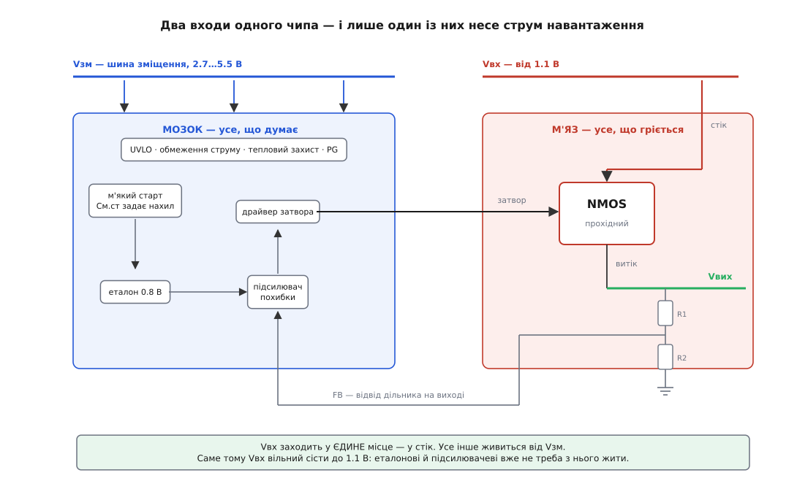
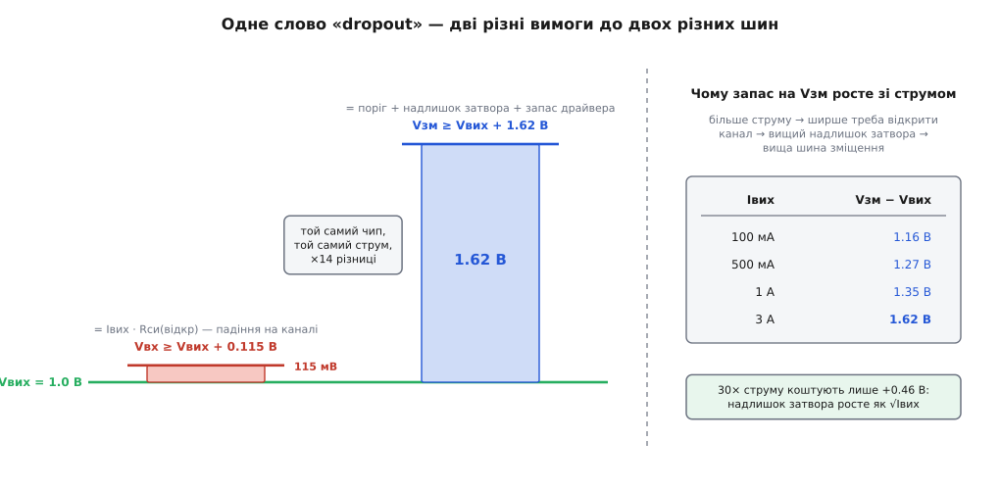
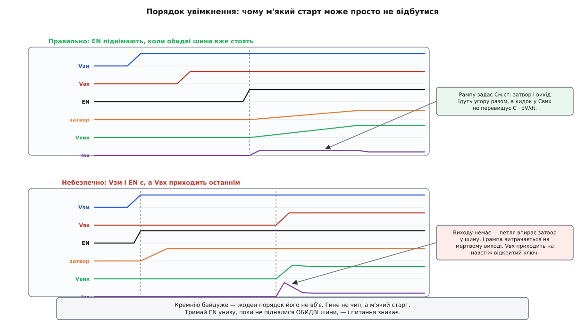

# 🔌 NMOS-стабілізатор із шиною зміщення: анатомія класу

Паспорт цього класу відкривається рядком, схожим на помилку набору: вхід — від 1.1 В, вихід — 1.0 В, dropout — 115 мВ на трьох амперах. Три ампери крізь лінійний стабілізатор, на якому висить десята частка вольта. А через два рядки нижче стоїть друге число, яке всю магію нібито псує: шина зміщення мусить бути щонайменше на 1.62 В вище за вихід. Один чип, два числа під однією назвою, і різняться вони в чотирнадцять разів.

Це не недбалість того, хто складав таблицю. Це і є весь клас, викладений у двох рядках. Бо трюк тут не в тому, що підлогу прибрали. Трюк у тому, що підлогу **пересунули на шину, якою тече два міліампери**.

### Що це за клас

Клас упізнається з одного погляду на схему: у корпуса **два входи живлення**. Не вхід і «допоміжне живлення для дрібниць» — саме два входи, і несуть вони геть різні речі. `IN` тримає стік прохідного транзистора, і крізь нього йде весь струм навантаження до останнього ампера. `BIAS` не бачить навантаження взагалі: він годує еталон, підсилювач похибки, драйвер затвора й усю сторожу.

Здається, що це дрібниця компонування — мовляв, зручніше було розвести. Насправді саме цей поділ і робить клас можливим, і зрозуміти чому варто до кінця.

Спитайте: **звідки взагалі береться нижня межа вхідної напруги у звичайного стабілізатора?** Відповідь не в прохідному транзисторі. [Опорна напруга](topic:electronics/voltage-reference) — це фізичний об'єкт, який мусить із чогось жити, і живе він десь із вольта з гаком. Підсилювачеві похибки потрібен розмах на виході, щоб було чим ворушити керуючий вивід. Складіть це — і виявиться, що **розум стабілізатора потребує більше напруги, ніж його м'яз**. Прохідному транзисторові байдуже, що на ньому 115 мВ: він шматок кремнію з опором. А еталонові на шині 1.1 В просто нема де існувати.

Звідси й розв'язок, і він майже нахабний у своїй простоті: **розчепити м'яз і мозок по різних шинах**. Хай мозок живе на 5 В, де йому просторо. Хай м'яз працює від 1.2 В, бо йому й не треба більше. І тоді нижня межа входу перестає бути питанням про еталон і стає питанням лише про канал.

Три ознаки, за якими клас видно в паспорті, і всі три — наслідки цього поділу:

- **Вивід `BIAS`** (або пара виводів під летючий конденсатор, якщо шину роблять на місці помпою).
- **Dropout у десятках мілівольт** — і одразу поруч друге число, більше на порядок.
- **«Стійкий із будь-яким конденсатором на виході, ба навіть без нього»** — рядок, якого в інверсних топологіях не буває ніколи.

І четверта ознака, побічна, але промовиста: перелік застосувань у таких паспортах складається з серверів, мережевих карт і ПЛІС. Це не випадковість — це рівно ті плати, де 5 В уже стоїть із інших причин, а комусь треба ампери на 1.0 В.

> 🔧 **Навіщо це.** Побачивши `BIAS`, не читайте його як «ще одне живлення, підключу до чого зручно». Читайте як «тут живе весь розум приладу». З цього одразу випливає все інше: струм спокою треба шукати на цьому виводі, а не на `GND`; шум із цієї шини лізе просто в затвор; а конденсатор коло неї — не оздоба, а живлення драйвера. Хто це зрозумів, той далі виводить паспорт із голови.

### Що напхано в корпус


*Два стовпці одного корпусу. Ліворуч — усе, що думає: еталон, м'який старт, підсилювач похибки, драйвер затвора, UVLO, обмеження струму, тепловий захист, PG. Усе це живиться від Vзм. Праворуч — усе, що гріється: єдиний транзистор, у стік якого заходить Vвх. Між стовпцями — одна ниточка, затвор. Vвх не годує нічого, крім каналу, і саме тому їй вільно сісти до 1.1 В.*

Розкриймо корпус. Усередині — дві частини, які майже не мають між собою спільного, крім однієї дротини.

**М'яз — це буквально один транзистор.** Стік на вході, витік на виході, і все. Ані розуму, ані захисту в ньому немає; він робить те, що йому кажуть напругою на затворі. Вибір саме N-канального тут не смаковий: рухливість електронів у кремнії десь утричі вища за рухливість дірок (близько 1350 проти 480 см²/(В·с)), тож щоб дістати той самий опір відкритого каналу, P-канальному транзисторові треба приблизно **втричі більше кристала**. На трьох амперах і сотні мілівольт це різниця між чипом, який продають, і чипом, який не продають. Чому опір каналу впирається саме в площу — окрема розмова про [питомий опір Ron·A](topic:electronics/specific-on-resistance): є фізична стеля, скільки провідності можна купити за квадратний міліметр, і матеріал у ній головний.

**Мозок — усе інше, і воно все висить на `BIAS`.** Еталон на 0.8 В. Підсилювач похибки. [UVLO](topic:electronics/uvlo), що не дає стартувати на недорослій шині. Обмеження струму. Тепловий захист. Компаратор `PG`. Схема м'якого старту. Жодне з них не має проводу до `IN`.

**Драйвер затвора — найцікавіша деталь, бо його робота незвична.** У звичайному стабілізаторі драйвер тягне керуючий вивід до однієї з наявних шин. Тут інакше: витік прохідного транзистора сидить **на виході**, тобто на вузлі, який сам по собі десь на вольті. Щоб канал відкрився, драйвер мусить поставити затвор на Vвих + поріг + надлишок — тобто **втримати задану різницю над рухомою опорою**. І стеля цієї різниці — рівно те, що є на `BIAS`, мінус власний запас драйвера.

Звідси випливає річ, яку варто засвоїти одразу: **напруга на шині зміщення — це не «живлення», це ручка керування опором каналу.** Підняли `BIAS` — затвор пішов вище — надлишок виріс — [опір каналу](topic:electronics/rds-on) впав — dropout зменшився. Опустили — усе навпаки. У жодній іншій топології такої ручки немає: там усе, що можна зробити з керуванням, задає сам вхід.

Ручка, звісно, зі стопором. Vзв = Vзм − Vвих лягає на підзатворний оксид, а в оксиду є свій паспорт, тож `BIAS` має стелю — типово 5.5 В. І ця стеля відгукується там, де її не чекаєш: **діапазон вихідних напруг класу — це просто арифметика на шині зміщення**. Візьміть верх діапазону `BIAS` (5.25 В) і відніміть потрібний затворові запас на повному струмі (1.62 В) — дістанете 3.63 В. У паспорті стеля виходу стоїть як 3.6 В. Збіг до заокруглення: вихід не обмежений транзистором, він обмежений тим, що вище затвор підняти нема звідки.

### Два dropout, одне слово


*Обидві вимоги відлічують від однієї підлоги — від виходу, — і виконати треба обидві. Але фізика під ними різна: ліворуч падіння на відкритому каналі, праворуч напруга, потрібна, щоб той канал тримати відкритим. Тому вони й різняться в чотирнадцять разів, і тому запас на Vзм ще й повзе зі струмом.*

Тепер найважливіше в класі. У паспорті стоять **два dropout**, обидва відлічені від виходу, і чип випадає з регулювання, якщо **бодай один** із них порушено:

```
на вхідній шині:      Vвх ≥ Vвих + 0.115 В   (при 3 А)
на шині зміщення:     Vзм ≥ Vвих + 1.62 В    (при 3 А)
```

Слово одне, фізика різна. Перше — падіння на каналі, чистий закон Ома: Iвих · Rси(відкр). Друге — не падіння взагалі. Це напруга, потрібна, **щоб той канал узагалі тримати відкритим**: поріг транзистора плюс надлишок затвора плюс запас драйвера.

І друге число не стала. Ось як воно йде за струмом у паспорті класу:

```
Iвих      Vзм − Vвих
100 мА      1.16 В
500 мА      1.27 В
1.0 А       1.35 В
3.0 А       1.62 В
```

Тридцятикратна зміна струму коштує **менш ніж півволта**. Чому так мало — і чому взагалі щось? Прохідний транзистор у цьому режимі мусить пропустити заданий струм, а струмом крізь канал [керує напруга на затворі](topic:electronics/transconductance), і керує квадратично: Iвих ≈ (k/2)·(Vзв − Vпор)². Отже, потрібний надлишок затвора — це корінь зі струму, і саме він, єдиний із доданків, повзе:

```
Vзм(min) = Vвих + Vпор + √(2·Iвих/k) + Vзапас(драйвера)
           └──── стала для цього чипа ────┘  └ росте як √Iвих ┘
```

**Перевірмо цей закон просто на числах паспорта.** Між рядками 100 мА і 3 А поріг не змінився, запас драйвера теж (затвор постійного струму не бере, драйверові однаково) — виріс лише надлишок:

```
різниця з паспорта:   1.62 − 1.16 = 0.46 В
корінь-закон:         √(2·3.0/k) − √(2·0.1/k) = 0.46
                      (2.449 − 0.447) · √(1/k) = 0.46
                      √(1/k) = 0.230   →   k ≈ 18.9 А/В²
надлишок при 3 А:     √(2·3.0/18.9) = √0.317 = 0.563 В
стала частина:        1.62 − 0.563 = 1.057 В = Vпор + Vзапас(драйвера)
                                             ≈ 0.7 + 0.36
```

Числа зійшлися: поріг близько 0.7 В плюс третина вольта драйверові. Тридцять разів струму коштували лише 5.5 разу надлишку — бо корінь милосердна функція.

А тепер погляньте на ту сталу частину — 1.06 В — і впізнайте її. **Це підлога.** Та сама за характером підлога, що робить біполярний повторювач непридатним для сідлої батареї: число, яке не зникає зі зменшенням струму. Її не прибрали. Її **перенесли на іншу шину** — і в цьому весь фокус класу. Підлога на шині, якою тече три ампери, коштує три вати. Та сама підлога на шині, якою тече два міліампери, коштує два міліватти. Фізику не обійшли; її поклали туди, де струму немає.

> 🔧 **Навіщо це.** Заголовок паспорта завжди називає гарніше з двох чисел, і рахувати ваш запас за ним — класична помилка. Питайте окремо: чи стоїть моя вхідна шина на 115 мВ вище за вихід — і чи стоїть моя шина зміщення на 1.62 В вище за вихід. Перше зазвичай легко. Друге вирішує, чи вийде проєкт узагалі: якщо на платі немає 5 В, вам їх доведеться звідкись узяти, і вся економія на dropout піде на будівництво другої шини.

### Типова розпіновка

Вісім виводів — канонічна форма класу; галузева абетка тут стійка так само, як і в інших родинах:

```
             ┌────────U────────┐
    IN    1 ─┤●                ├─ 8   OUT   витік / бік навантаження
    BIAS  2 ─┤                 ├─ 7   FB    відвід дільника
    EN    3 ─┤                 ├─ 6   SS    конденсатор рампи
    GND   4 ─┤                 ├─ 5   PG    «вихід у нормі» (відкритий стік)
             └─────────────────┘
                  PAD → GND (тепло)
```

Читаємо по одному:

- **`IN`** — стік прохідного транзистора, і більше нічого. Цей вивід не годує всередині корпусу **жодної** схеми; крізь нього тече рівно струм навантаження.
- **`BIAS`** — увесь розум. Типовий діапазон 2.7…5.5 В, причому знизу він затиснутий з двох боків одразу: або Vвих + запас затвора, або абсолютна межа близько 2.7 В — що більше. На низьких виходах виграє саме абсолютна межа: для виходу 1.0 В арифметика дає 2.62 В, а паспорт усе одно вимагає 2.7 В, бо нижче не живе вже сам еталон.
- **`GND`** — опора. Зверніть увагу на несподіванку: **струм спокою тут майже не тече**. Він виходить із `BIAS`, і в паспорті так і написано — окремим рядком `IBIAS`, а не `IGND`.
- **`OUT`** — витік. На відміну від деяких класів, тут це справді силовий вивід.
- **`FB`** — відвід дільника. Стоїть поруч із `OUT` не випадково: обидва йдуть в один бік плати, до навантаження.
- **`SS`** — конденсатор, що задає нахил рампи. Найдешевша деталь на платі, і — як побачимо — та, чию роботу найлегше звести нанівець.
- **`EN`** — дозвіл. У цьому класі він не декоративний, а несе окрему службову роль, про яку далі.
- **`PG`** — відкритий стік, «вихід дійшов до норми». Тонкість: підтяжку можна вести до шини **вищої за вхід** — бо вивід ні до чого всередині не прив'язаний. І друга: `PG` дивиться не лише на вихід, а й на `BIAS` — просів мозок нижче за свій поріг, і `PG` падає, навіть якщо на виході ще щось є. Логічно: чип чесно каже, що більше не відповідає за свої слова.

І **геометрія**. У цього класу є задача, якої немає в жодного однорядного стабілізатора: **дві шини живлення заходять у корпус, і кожній треба свій конденсатор упритул до свого виводу**. Тому `IN` і `BIAS` у реальних корпусах ставлять поруч — щоб обидві пари «вивід + кераміка» лягли на плату однією групою, а не розповзлися по різні боки чипа. Дрібносигнальний кінець (`FB`, `SS`) виносять якнайдалі від силового. Розпіновка вже містить у собі підказку про [розводку](topic:electronics/pcb-layout).

### Обв'язка: що навісити

Деталей зовні небагато, але жодна з них не «поставте будь-який».

**`Cвх` — від 1 мкФ.** Звичайна вимога до низького вихідного опору джерела.

**`Cзм` — від 1 мкФ, і ось тут не економте.** Спокуса поставити 0.1 мкФ — «та там же два міліампери» — ігнорує, чим `BIAS` є насправді. Це **живлення драйвера затвора**. На кидку навантаження затвор мусить швидко посунутися, а посунути його — означає перезарядити [ємність затвора](topic:electronics/gate-capacitance), і заряд на це драйвер бере не з ефіру, а з `Cзм`. Просіла шина зміщення в цю саму мить — просів затвор — виріс опір каналу — просів вихід іще глибше. Клас славиться зразковою реакцією на кидок (типово 4 % провалу на стрибку 100 мА → 3 А зі швидкістю 1 А/мкс), але ця цифра чесна лише тоді, коли драйверові було з чого черпати.

**`Cвих` — і ось де починається справжня свобода.** У паспорті класу мінімум вихідної ємності стоїть як **0 мкФ**. Не «0.1 мкФ», не «з ESR у вікні» — нуль. Це прямий наслідок того, що вихідний вузол тримає витік: опір вузла малий, полюс далеко, петлі байдуже, що ви туди почепили. Практичний висновок тонший, ніж «конденсатор не потрібен»: він у тому, що **`Cвих` перестає бути деталлю петлі й стає деталлю навантаження**. Ви більше не підбираєте його, щоб стабілізатор не завівся; ви рахуєте його з того, скільки заряду процесор просить між тактами. Це геть інша інженерна робота — і, як на мене, набагато приємніша. Застереження одне: свобода тут — рішення виробника, а не закон топології. Та сама родина в новішому кремнії вже просить від 2.2 мкФ, бо петлю перелаштували під інші цілі. Читайте свій паспорт, а не спогади про клас.

**`Cм.ст` — конденсатор рампи.** Джерело струму в кілька десятих мікроампера заряджає його, і напруга на ньому веде еталон угору. Звідси й формула, і вона проста: `tм.ст = Vеталон · Cм.ст / Iм.ст`.

**Дільник `R1`/`R2`** — задає вихід від еталонних 0.8 В. **Підтяжка `PG`** — типово 10 кОм…1 МОм.

Порахуймо, що насправді робить той дешевий конденсатор рампи.

**Умова.** Вихід 1.0 В, `Cвих` = 100 мкФ, межа струму чипа ≈ 5 А, струм рампи ≈ 0.8 мкА, еталон 0.8 В.

```
З Cм.ст = 4700 пФ:
  tм.ст = 0.8 · 4.7·10⁻⁹ / 0.8·10⁻⁶ = 4.7·10⁻³ ≈ 5 мс
  Iкид  = Cвих · Vвих / tм.ст = 100·10⁻⁶ · 1.0 / 5·10⁻³ = 0.020 А = 20 мА

Вивід SS лишили вільним (внутрішня рампа ≈ 100 мкс):
  Iкид  = 100·10⁻⁶ · 1.0 / 100·10⁻⁶ = 1.0 А          ← у 50 разів більше

Рампи не було взагалі (див. далі про порядок):
  ключ уже навстіж — тримає лише межа струму чипа ≈ 5 А
  tзаряду = Cвих · Vвих / Iмежа = 100·10⁻⁶ · 1.0 / 5 = 20 мкс
```

**Висновок.** Зверніть увагу на те, що **не змінилося**: заряд. Cвих·Vвих = 100 мкКл в усіх трьох рядках, до останньої коми. М'який старт не зменшує заряду ані на кулон — він його **розмазує**. Ті самі сто мікрокулонів можна віддати як 20 мА протягом 5 мс, а можна як 5 А протягом 20 мкс. Джерелу живлення, роз'ємові й сусідам по шині ці два варіанти здаються геть різними подіями — і ось чому наступний розділ такий важливий.

### Перше вмикання

Байта тут немає — є перша рампа. І перше правило класу: **на стіл ідуть два джерела, а не одне**. Спроба завести такий чип від однієї шини — це не спрощення досліду, це інший дослід.

Порядок, що ловить майже все:

1. **Два джерела, обидва з піднятою межею струму.** `BIAS` = 5 В, `IN` = Vвих + 0.3 В. Обмеження на лабораторному джерелі задерте: джерело, що само пішло в обмеження, починає керувати напругою, і ви дивитиметесь на бійку двох регуляторів замість роботи чипа.
2. **`EN` притиснутий до землі — і поміряйте струми окремо.** Ось дослід, який пояснює клас краще за будь-який текст: на `BIAS` ви побачите міліамперу-другу, а на `IN` — практично нуль. Розум і м'яз видно розділеними просто на амперметрі.
3. **Перевірте дільник перед першим дозволом.** `FB` порівнюється з 0.8 В; помилка в дільнику — це не «вихід трохи не той», це петля, що жене транзистор навстіж, і ловить її лише вбудована межа струму.
4. **Дозвольте — і зловіть рампу одноразовим запуском.** На виході ви мусите побачити **монотонну пряму** тієї тривалості, яку задав `Cм.ст`. Сходинка замість прямої означає, що рампи не було; шукайте причину в порядку шин, а не в конденсаторі.
5. **Зміряйте обидва dropout, і саме як два різні досліди.** Спершу тримайте `BIAS` = 5 В і повільно сідайте вхідною шиною, поки вихід не поїде: дістанете десятки-сотні мілівольт. Тоді поверніть вхід і сідайте **шиною зміщення**: дістанете півтора вольта з гаком. Два числа, дві межі, дві різні фізики — і, зробивши це руками один раз, ви більше ніколи не сплутаєте, яке з них у заголовку.
6. **Навмисне зробіть неправильний порядок — з пробником струму на вході.** Один раз, поки це дешево. Що саме ви побачите — у наступному розділі; але побачити це варто на столі, а не в полі.
7. **І аж тоді — кидок навантаження, з пробниками одразу на `OUT` і на `BIAS`.** Друга крива скаже вам про `Cзм` більше, ніж будь-яка перша.

### Типові граблі

**Порядок увімкнення — і це головна пастка класу.**


*Угорі — правильно: обидві шини вже стоять, EN піднімається останнім, затвор і вихід їдуть угору рампою, кидок обмежений нахилом. Унизу — збито: EN піднявся разом із Vзм, виходу ще немає, петля чесно робить єдине, що вміє, — упирає затвор у шину. Рампа тим часом добігає кінця на мертвому виході. Коли приходить Vвх, транзистор уже навстіж відкритий, і рампи більше не лишилося.*

Почнімо з доброї новини, бо вона неочікувана: **кремнію байдуже**. У паспорті класу так і написано — `IN`, `BIAS` і `EN` можна подавати в будь-якому порядку, чипові від цього нічого не буде. Жодних латчапів, жодного диму.

Гине не чип. Гине **м'який старт** — і ось тут механізм варто простежити до кінця, бо він гарний.

Уявіть: `BIAS` піднявся, `EN` високий (наприклад, ви за звичкою прив'язали його просто до `BIAS`), а `IN` ще нема. Що робить петля? Рівно те, чого ви від неї хочете: бачить на `FB` нуль, порівнює з еталоном, вирішує, що виходу катастрофічно бракує, і жене затвор угору. Затвор упирається в шину зміщення. Ніякого струму при цьому не тече — вхід же мертвий, тягти нема звідки. А `Cм.ст` тим часом спокійно заряджається до кінця: **рампа відпрацювала**. На мертвому виході, у порожнечу, але відпрацювала.

Тепер приходить `IN` — і застає прохідний транзистор **навстіж відкритим**. Він і є замкнений ключ. Розряджений `Cвих` смикає з шини все, що та дасть, аж поки не втрутиться межа струму, — ті самі сто мікрокулонів, але за двадцять мікросекунд замість п'яти мілісекунд. Петля, звісно, схаменеться й притисне затвор, коли вихід дійде до норми, — але схаменеться вона **після** кидка й зазвичай з перельотом.

І найгидкіше в цій пастці — її невинність. Плата працює. Вихід стоїть де треба. Нічого не гріється. Просто щоразу на старті по вхідній шині б'є кількаамперна голка, якої ніхто не бачив, бо ніхто не чіпляв пробник струму на працьовиту плату. Знайдеться це аж тоді, коли сусід по шині почне зрідка перезавантажуватися.

Ліки — один провід: **тримайте `EN` унизу, поки не піднялися ОБИДВІ шини.** Цифровим виходом супервізора, `PG`-сигналом сусіднього джерела, у найгіршому разі RC-затримкою з запасом. Саме тому в цього класу `EN` завжди є й саме тому паспорт прямо радить дозволяти чип після обох шин. А ширше про те, як узагалі будують такі черги, — [черговість увімкнення шин](topic:electronics/power-sequencing); тут же живе й [кидок струму в ємність](topic:electronics/inrush-current) як окреме явище.

**Заголовок паспорта — це лише про `IN`.** Повторю, бо це найчастіша помилка новачка в класі: «dropout 115 мВ» описує **одну** з двох вимог. Друга більша в чотирнадцять разів і вирішує долю проєкту. Чип у dropout, якщо не виконано бодай одну.

**Просіла шина зміщення — виріс dropout.** Наслідок того, що `BIAS` є ручкою керування опором каналу. Живите мозок від шини, яка сама провалюється під навантаженням десь на платі, — і ваш dropout поїде разом із нею, у найгіршу мить, коли всі споживачі смикнули одночасно. Шина зміщення мусить бути **жорсткішою**, ніж інтуїція підказує для двох міліампер.

**Дві криві PSRR, а читають одну.** У паспорті класу [придушення пульсацій](topic:electronics/psrr) стоїть **двічі**: з `IN` на вихід і окремо з `BIAS` на вихід. Типово 73 дБ проти 62 дБ на кілогерці — тобто шлях від шини зміщення **гірший**. І це не дивно, щойно згадати, куди `BIAS` фізично приходить: у драйвер, а драйвер сидить на затворі, а затвор — це **керуючий вхід**. Брижі на шині зміщення для цієї петлі не завада, а **сигнал**: вона їх сумлінно відтворює на виході, поки не скінчиться підсилення. Звідси й найдорожча помилка компонування: почепити `BIAS` просто на сирий вихід імпульсного перетворювача — «та там же два міліампери, який там шум». Два міліампери — так. Але вони заходять просто в керування.

**Злили дві шини в одну — і викинули весь клас.** З'єднати `IN` із `BIAS` можна, чип працюватиме. Тільки тепер вхід мусить стояти на 1.62 В вище за вихід — тобто **гірше за пересічний PNP**. Ви лишили собі свободу з конденсатором і чудову реакцію на кидок, а ультранизький dropout — те, заради чого клас і брали, — віддали. Іноді це свідомий і розумний вибір. Але робити його треба свідомо, а паспорт, до речі, підказує натяком: у режимі спільної шини мінімальна ємність стрибає з 1 до 4.7 мкФ — бо тепер одному конденсаторові доводиться робити дві роботи.

**Тепло рахують за `IN` — і це правда, але не вся.** Формула розсіювання в паспорті класу проста: `P = (Vвх − Vвих) · Iвих`. Вклад `BIAS` у ній не згадано взагалі, і для теплового розрахунку це чесно: на трьох амперах регулювання дає 0.6 Вт, а шина зміщення — 10 мВт, тобто півтора відсотка. Але щойно ви перенесете цю формулу в **енергетичний** бюджет, вона почне брехати — і про це варто окремо.

### Варіації класу

**Звідки береться шина зміщення** — головна вісь, за якою клас ділиться надвоє.

*Зовнішня шина.* Чиста форма: ви даєте 5 В, чип не робить нічого зайвого. Найтихіший варіант — усередині немає жодного ключа, який комутує. Ціна — на платі мусить бути друга шина.

*Внутрішня помпа.* Чип робить зміщення сам [зарядною помпою](topic:electronics/charge-pump) — летючий конденсатор на 0.1 мкФ і накопичувальний на 1 мкФ зовні, два-три зайві виводи. Такі прилади працюють від однієї шини вже від 1.7 В і дають dropout близько 45 мВ. Гарний хід у розвинених представниках: **зміщення регулюють адаптивно** — помпа піднімає затвор рівно настільки, скільки треба для поточного струму, і не витрачається на надлишок, якого ніхто не просив.

Ціна помпи — **вона комутує**. Типова частота — одиниці мегагерц (у відомих родинах близько 3.5 МГц), і на цій частоті у спектрі виходу з'являється **спура**: вузький пік там, де його не було. Для живлення процесора байдуже. Для гетеродина чи опори АЦП — це може бути рівно та частота, від якої ви й тікали в лінійний стабілізатор. Тому в тихих родинах помпі виділяють **окрему землю** й окремий вивід живлення: щоб її комутаційний струм не гуляв аналоговою опорою. Побачили в розпіновці другий `GND` із приміткою «CP» — знайте, навіщо він там.

**Скільки заліза всередині.** Прохідний транзистор буває вбудований (типово до одиниць ампер) або зовнішній — тоді чип вироджується в **контролер**, який лише тримає затвор, а ключ ви обираєте самі. За десятки ампер платять тим, що всі граблі [силового ключа](topic:electronics/mosfet-power-switch) вертаються до вас.

**Наскільки тихо.** Окрема гілка полює на шум: одиниці мікровольт середньоквадратичних у смузі 10 Гц…100 кГц. Роблять це фільтром еталона — і в багатьох родинах це **той самий конденсатор**, що задає рампу. Одна деталь, дві роботи, і тягнуть вони в один бік: більший `Cм.ст` — тихіше й повільніше. Приємний випадок, коли компроміс не треба шукати.

**Фіксований чи налаштовний.** Звична вісь: дільник усередині проти дільника у вас. У цьому класі вона має додатковий зуб — вихід ви обираєте не вільно, а в межах того, що дозволяє стеля `BIAS`.

### Де клас закінчується

**Це не чип для сну — і ось де ховається справжня ціна.** Струм зміщення в цьому класі **сталий**: у паспорті так і стоїть — 2 мА в діапазоні навантаження від нуля до трьох ампер. Це та сама чеснота, про яку йдеться скрізь: затвор постійного струму не бере, тож навантаження на струм спокою не впливає. Але сталий струм тече з **найвищої шини на платі**, і рахунок за це виставляють там, де ви його не чекаєте.

**Скільки коштує мозок, коли м'яз нічого не робить.** Вхід 1.2 В, вихід 1.0 В, зміщення 5.0 В, струм зміщення 2 мА:

```
повне навантаження, Iвих = 3 А:
  Pрег = (1.2 − 1.0) · 3        = 0.600 Вт
  Pзм  = 5.0 · 0.002            = 0.010 Вт     ← 1.6 % від усіх втрат
  η    = (1.0·3) / (1.2·3 + 0.010)
       = 3.000 / 3.610           ≈ 83 %

мале навантаження, Iвих = 10 мА:
  Pрег = (1.2 − 1.0) · 0.010    = 0.002 Вт
  Pзм  = 5.0 · 0.002            = 0.010 Вт     ← у 5 разів БІЛЬШЕ за регулювання
  η    = (1.0·0.010) / (1.2·0.010 + 0.010)
       = 0.0100 / 0.0220         ≈ 45 %
```

**Висновок.** Той самий чип: 83 % на трьох амперах і 45 % на десяти міліамперах — причому вниз його тягне не прохідний транзистор, а мозок, який просто не вміє економити. Тут варто побачити симетрію: інверсна біполярна топологія марнує струм, **пропорційний навантаженню, на низькій шині**; цей клас марнує струм **сталий, на високій шині**. Різні механізми, дзеркальні наслідки — і обидва найдорожчі саме там, де чип мав би сяяти. Для датчика, що спить роками, це вирок: клас не для нього, і жодне налаштування цього не змінить.

**Шина зміщення мусить УЖЕ бути.** Найчесніша межа класу. Уся його економія — це 0.6 Вт замість 2 Вт на прохідному елементі. Якщо заради `BIAS` вам доведеться поставити на плату окремий підвищувальний перетворювач, ви щойно збудували [імпульсне джерело](topic:electronics/switching-converter), щоб допомогти лінійному, — і всі його брижі тепер стоять коло вашого тихого чипа. Клас окупається рівно там, де 5 В стоїть із інших причин. Саме тому його домівка — сервери, мережеві карти й плати з ПЛІС, а не автономні пристрої.

**Він не рятує від зворотного струму — принаймні не за замовчуванням.** Спокуслива думка «повторювач же, як NPN, отже, і діода назад нема» тут не працює. У дискретного польового транзистора підкладку заведено на витік, і паразитний діод дивиться анодом на вихід — тобто варіант із зовнішнім ключем має зворотний шлях напевно. У монолітного все залежить від того, куди виробник завів підкладку на кристалі, а цього з топології не видно **ніяк**, і паспорти цього класу про зворотний струм часто просто мовчать. Правило звідси практичне: не виводьте поведінку назад із того, як намальоване вмикання. Треба, щоб вихід не живив вхід, — питайте паспорт, а не схему, і за мовчання ставте [ідеальний діод](topic:electronics/ideal-diode).

**І він лишається лінійним.** 0.2 В на трьох амперах — це 0.6 Вт, які треба кудись подіти, хоч би яким гарним був транзистор. Клас робить лінійне регулювання **дешевшим**, а не безкоштовним.

### Коротко про суть

NMOS-стабілізатор із шиною зміщення — це чип із двома входами, і весь клас читається з того, що вони несуть. `IN` тримає лише стік прохідного транзистора; `BIAS` годує еталон, підсилювач похибки, драйвер затвора й усю сторожу. Розчепивши мозок і м'яз, виробник зняв межу, яку ставив не транзистор, а еталон, — і вхід дістав свободу сісти до 1.1 В. Платня за це чесна й записана прямо в паспорті: **два dropout під одним словом** — 115 мВ на `IN` і 1.62 В на `BIAS`, обидва від виходу, обидва обов'язкові. Друге число — це поріг плюс надлишок затвора плюс запас драйвера; надлишок росте як √Iвих (тому 30× струму коштують лише +0.46 В), а решта — стала. Ця стала і є та сама підлога, яку клас не прибрав, а **переніс на шину, де тече два міліампери замість трьох ампер**. Вихідний конденсатор перестає бути деталлю петлі й стає деталлю навантаження — мінімум у паспорті стоїть як нуль. Заводять із двох джерел, міряють струми на `IN` і `BIAS` окремо (це видно на амперметрі), ловлять монотонну рампу й міряють обидва dropout як два різні досліди. Убиває цей клас найчастіше **порядок увімкнення**: кремнію байдуже, а от рампа встигає відпрацювати на мертвому виході, поки `EN` високий без `IN`, — і вхід приходить на навстіж відкритий ключ; ліки — тримати `EN` унизу, поки не стануть обидві шини. Далі за списком: читання лише «гарного» dropout, м'яка шина зміщення, друга крива PSRR, якої ніхто не дивиться, і злиття двох шин в одну, що вбиває весь сенс покупки. А варіації — зовнішня шина проти внутрішньої помпи зі спурою на мегагерцях, вбудований ключ проти контролера із зовнішнім, тихі родини з фільтром еталона — це вже вибір під конкретну плату. Головне пам'ятати межу: клас окупається лише там, де шина зміщення вже стоїть з інших причин.
