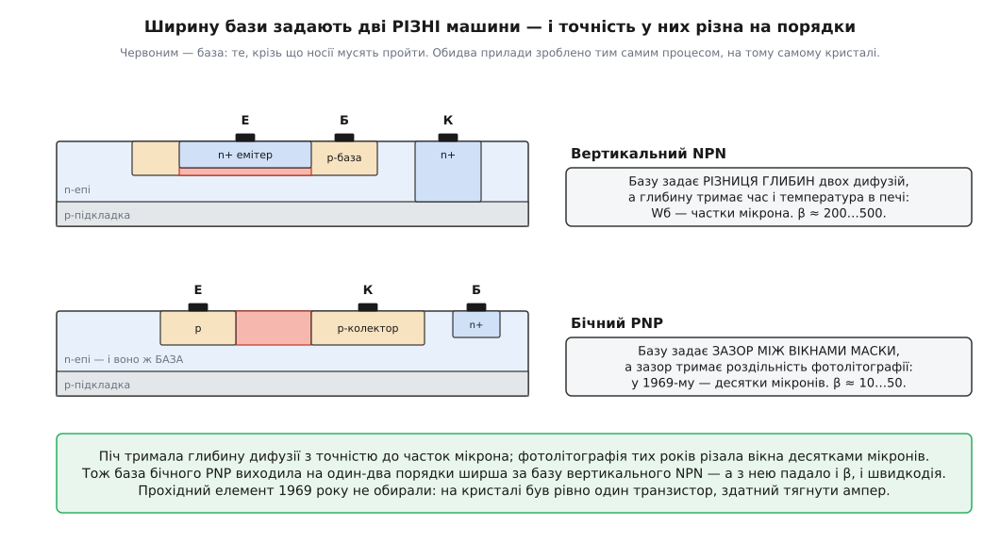
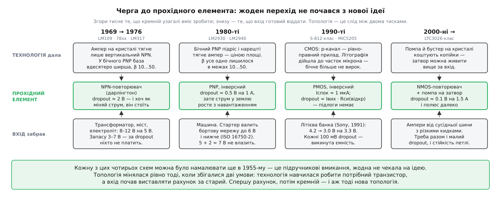

# 📜 Прохідний елемент, якого не обирали

Класичний 7805 просить два вольти запасу. Про це кажуть поблажливо — мовляв, стара технологія, тоді не вміли краще. Фраза звучить розумно рівно доти, доки не спробуєш її розкласти.

Бо що саме «не вміли»? Інверсне вмикання — PNP емітером на вхід, базу тягнути вниз — це не винахід і не хитрощі. Це підручникова схема, яку можна було спаяти на макетці в 1955 році з покупних деталей і дістати падіння в кілька десятих вольта. Людина, що зробила перший триногий стабілізатор, була найгострішим аналоговим схемотехніком свого покоління й точно знала про це вмикання все. І все одно поставила туди топологію з найгіршим можливим dropout.

Отже, питання не в тому, чого не вміли, а в тому, **чому найкраща доступна схема виявилася недоступною**. Відповідь лежить не в схемі. Вона лежить у пластині.

## У 1969-му на кристалі був один-єдиний транзистор, здатний тягнути ампер

Щоб це відчути, треба на хвилину злізти зі схеми в кремній і подивитися, як узагалі роблять транзистор на монолітному кристалі.

Біполярний процес тих років вирощував на пластині тонкий шар n-кремнію — епітаксію — і різав його на ізольовані острівці. Далі крізь вікна в оксиді в цей острівець заганяли домішку: спершу глибшу p-дифузію (база), потім усередину неї мілкішу n⁺-дифузію (емітер). Струм у такому транзисторі тече **вертикально**: згори вниз, від емітера крізь базу в епітаксію-колектор.

І ось головне. Ширина бази тут — це не якийсь окремий розмір, який хтось нарисував. Це **різниця глибин двох дифузій**: наскільки дно бази нижче за дно емітера. А глибину дифузії тримає піч — час і температура. Піч — машина повільна, нудна й через те неймовірно точна: витримати глибину до часток мікрона їй нічого не варто. Тож база вертикального NPN виходила вужча за мікрон, а від вузької бази прямо залежить [коефіцієнт підсилення](topic:electronics/bjt-structure): що менше носіїв устигає загубитися дорогою, то більше їх долітає до колектора. Звідси β в сотні.

Тепер PNP. Біда в тому, що на цьому процесі вертикального PNP просто немає — черговість шарів не та. Тому PNP роблять [**бічним**](topic:electronics/lateral-pnp): у той самий n-острівець (він тепер працює базою) заганяють дві p-дифузії поруч — ту саму, якою робили базу NPN. Одна буде емітером, друга колектором, і струм побіжить **горизонтально**, з однієї в другу. Задарма: жодної нової операції, жодної окремої маски — бічний PNP просто випадає з процесу, зробленого під NPN.

І тут ширину бази задає вже не піч. Її задає **зазор між двома вікнами в масці** — а зазор тримає [фотолітографія](topic:electronics/photolithography): світлом крізь маску малюють на пластині рисунок вікон, і найдрібніша деталь, яку вона здатна відтворити, і є межею всьому. Наприкінці 1960-х ця межа лежала в десятках мікронів.


*Обидва прилади зроблено тим самим процесом, у той самий день, на тому самому кристалі — а бази в них різні на порядки. Не тому, що хтось так захотів: базу вертикального приладу міряє піч, базу бічного — маска, і в 1969-му ці дві машини різнилися точністю разів у сто.*

Наслідок арифметичний і невблаганний. Підручник Джеймса Робержа (James K. Roberge, MIT) 1975 року — тобто написаний свідком, а не істориком — каже про базу бічного PNP просто: вона на один-два порядки ширша, ніж у звичайного транзистора, бо «задається операцією маскування, а не глибиною дифузії». А далі все випливає само: у ранніх бічних PNP β бувало **менше за одиницю**; навіть коли їх довели до пуття, лишалися десятки проти сотень у NPN. Швидкодія падала так само — операційники, у яких бічний PNP стояв у сигнальному тракті, впиралися в смугу 1–2 МГц і не могли вище.

Ось тепер складімо. Прохідний елемент мусить пропустити крізь себе весь струм навантаження — ампер. З двох приладів, які вміє зробити процес, один має β в сотні, а другий — у десятки, і то в кращому разі. Керувати ампером через β = 20 від слабенького підсилювача похибки в 1969-му не було чим. Отже, прохідним міг бути **тільки вертикальний NPN**.

А NPN, у якого колектор сидить на вході, а емітер на виході, — це вже, за визначенням, повторювач. Ніхто не сідав і не обирав повторювач. Процес видав повторювач і сказав: тримай, іншого немає.

> 🔧 **Навіщо це.** Ті два вольти в 7805 — не рішення схемотехніка й не лінь. Це **скам'янілий слід літографії 1960-х**: підлога з двох Vбе плюс місце драйверові, яку не можна прибрати, поки прохідним лишається біполярний повторювач. Тому й безглуздо чекати «покращеного 7805 з низьким dropout»: покращувати нема чого — треба міняти прилад під ним. Коли в даташиті вас щось дратує своєю тупістю, спершу спитайте, який транзистор технологія взагалі дозволяла туди поставити.

## Спірне авторство µA723 — і чому суперечка саме про PNP

Тут історія підкидає сюжет, який на перший погляд про людей, а насправді знову про той самий бічний PNP.

Прецизійний регулятор **µA723** від Fairchild (1967–68; джерела різняться на рік) майже скрізь підписаний ім'ям Роберта Відлара (Robert J. Widlar, 1937–1991) — так пишуть і сторінки виробників, і оглядові статті з історії регуляторів. Атрибуція виглядає природно: Відлар зробив у Fairchild перші масові операційники (µA702, µA709), він же потім робив регулятори в National — кому ж іще.

Проти цієї версії є конкретне заперечення, і воно варте того, щоб його переказати.

По-перше, **дати не сходяться**. Відлар пішов із Fairchild до National Semiconductor у **листопаді 1965 року** — разом із Дейвідом Толбертом (David Talbert), технологом, що вмів утілити його схеми в кремнії. µA723 вийшов приблизно **на два роки пізніше**.

По-друге — і це саме наш сюжет — **схема µA723 спирається на помітно покращені бічні PNP, яких за часів Відлара у Fairchild не було**. Тобто чип можна датувати не за архівом, а за приладами, які він наважується вживати: якщо в схемі стоїть транзистор, якого торік не існувало, то торік цю схему не малювали.

По-третє, є свідчення сучасника. Дейв Фуллагар (Dave Fullagar) — той самий, хто спроєктував µA741, найпродаваніший аналоговий чип в історії, — приписує µA723 **Дарілу Льє** (Darryl Lieux), одному зі схемотехніків Fairchild.

Статус: **атрибуція спірна**. Поширена версія (Відлар) тримається на репутації й повторенні; заперечення тримається на датах, на технологічному аргументі й на свідченні колеги — і в такому наборі воно виглядає вагоміше. Урок тут загальний: гучне ім'я працює магнітом для чужих робіт, і «всі так пишуть» — не доказ, коли по інший бік лежить перевірна деталь.

Але для нас важливіше інше, що видно з цієї суперечки збоку. Бічний PNP **уже до 1967-го підріс настільки, щоб на нього спиратися** — і його одразу почали вживати. Тільки вживати **в сигнальному тракті**: як джерело струму, як зсув рівня, як пару підсилювача похибки. У самого µA723 внутрішній прохідний транзистор — NPN на якісь 150 мА, а на справжній струм до нього вішали зовнішній транзистор.

Ось де вододіл. **«Придатний для сигналу» і «придатний для сили» — це різниця в п'ятнадцять років.** Сигнальному PNP досить кількох міліампер і β під сотню; силовому треба ампер, а на кристалі — β десятки й площа, яку ніхто не дасть. PNP пробрався в схему регулятора у 1967-му, а в прохідний елемент — аж у 1980-х.

## П'ятнадцять років, коли пів вольта нікого не обходили

Технологія — це половина справи. Друга половина в тому, що весь цей час **на dropout ніхто не виставляв рахунку**.

Погляньмо, з чого живився типовий прилад 1972 року. Трансформатор, міст, товстий електроліт — і на виході сира постійна напруга, що гуляє від усього одразу: мережа ходить на ±10%, під навантаженням трансформатор просідає, на конденсаторі сидить пульсація, яку сам же випрямляч і намалював. Щоб у найгіршому куті цього розкиду на 5-вольтовому виході ще лишалося 5 В, сиру напругу закладали з великим запасом — вісім, десять, дванадцять вольтів.

А тепер найважливіше: **ці зайві вольти однаково доводилося спалити**. Лінійний регулятор гасить різницю на собі теплом — і йому байдуже, чи гасить він два вольти, чи сім. Ти вже заплатив за них радіатором. Тож dropout у два вольти був не витратою, а дрібкою всередині витрати, яку ти й так поніс. За нього **буквально ніхто не платив**.

Зате платили за інше — за спалені мікросхеми. І туди й пішла вся інженерія: обмеження струму, тепловий захист, стеження за [зоною безпечної роботи](topic:electronics/safe-operating-area) — бо транзистор гине не від самого струму й не від самої напруги, а від їхнього добутку за певних умов, і сторож мусить прибрати струм саме тоді, коли пара «струм × напруга» заходить у небезпечний кут. Усе це — щоб коротке замикання на виході не вбивало деталь, а лише притишувало її. Як ці сторожі разом із бандгеп-опорою дали змогу вперше стиснути регулятор до трьох ніг — окрема історія, розказана [в народженні триногого стабілізатора](topic:electronics/battery-to-controller/hist-three-terminal-regulator.md).

І ось наслідок, від якого важко відвести очі. **78xx** (лінія Fairchild µA7800 початку 1970-х, у National — LM340) — той самий NPN-дарлінгтон, ті самі два вольти, лише розтиражовані на набір напруг. **LM317**, який Боб Добкін (Bob Dobkin) зробив у National **1976 року**, — знову той самий NPN-дарлінгтон і знову близько двох вольтів. І LM317 при цьому був справжнім тріумфом — але тріумфом **регульованості**, а не запасу: він дав вибирати напругу двома резисторами, і саме за це його полюбили.

П'ятнадцять років, три покоління мікросхем, безліч розумних людей — і цифра dropout не зрушила ні на десяту. Не тому, що не могли. Тому, що нікому не боліло.

## Машина виставила перший рахунок

Заболіло в автомобілі, і заболіло різко.

Бортова мережа машини — це 12 В, поки все спокійно. Але тієї миті, коли водій крутить ключ і стартер бере свої сотні ампер, акумулятор під таким струмом провалюється. Стандарт **ISO 16750-2** описує це окремим випробуванням і розписує ступені суворості: напруга падає до 8 В, до 6 В, до 4.5 В, а в найлютішому разі й до 3 В — і що холодніше надворі, то глибша яма.

А блок керування мусить це пережити. Не «бажано» — мусить, бо саме в цю секунду він і потрібен: двигун заводиться, і хтось має ним керувати.

Порахуймо на пальцях те, що тоді порахував кожен автомобільний інженер:

```
щоб мати 5 В із NPN-повторювача:  Vвх(мін) = 5.0 + 2.0 = 7.0 В
бортова мережа під час запуску:   Vвх      ≈ 6.0 В      (ISO 16750-2, ступінь IV)
                                  6.0 < 7.0  →  вихід іде слідом за входом
```

Це не «погіршення характеристик». Це контролер, що перезавантажується рівно тоді, коли водій повернув ключ. За таке виставляють рахунок — і рахунок цей був адресований прохідному елементові.

Так у 1980-х з'явилися **LM2930**, а за ним **LM2940** від National: PNP прохідним, dropout близько **0.5 В на повному ампері**, плюс витривалість до зворотної полярності акумулятора — бо в машині й таке буває. Десь тоді ж закріпилася в каталогах і сама торгова категорія «LDO».

І тут варто зупинитися й побачити, що саме сталося, бо це головна думка всієї черги. **Ідея не була новою ані на день.** PNP зі спільним емітером — те саме вмикання, яке малювали в підручниках, коли Відлар ще ходив до школи. Новим було одне: до 1980-х бічний PNP підріс настільки, що його **взагалі стало можливо** зробити на ампер — ціною величезної площі кристала і з тим самим жалюгідним β в межах 10…50, яке нікуди не поділося. PNP-стабілізатор не був у 1985-му кращою ідеєю, ніж у 1969-му. Це була **та сама ідея, яку нарешті стало з чого зробити** — і прийшла вона з рахунком за струм бази, який відтоді платять усі, хто її бере.

## Батарея виставила другий — і біполяр не витягнув

1991 року Sony вивела на ринок першу комерційну літій-іонну банку. Наслідок для нашої черги вийшов подвійний, і обидва боки били по PNP.

**Перший удар — по запасу.** Одна банка дає 4.2 В зарядженою і сідає десь до 3.0 В. А логіка тим часом переїжджала на 3.3 В. Тобто під кінець розряду весь наявний запас — сотні мілівольтів, і dropout у пів вольта означає, що останню, чималу частину ємності ти просто викидаєш. Кожні сто мілівольтів раптом стали коштувати грошей — уперше за двадцять років.

**Другий удар — по струму.** Прилад на банці більшість свого життя спить. А PNP зливає струм бази в землю **завжди, коли він відкритий**, і зливає пропорційно навантаженню. Постійний податок там, де рахують мікроампери.

І ось тепер найцікавіше: біполярний табір **не здався без бою**, і бій цей вартий поваги.

**Відповідь біполяра — зробити PNP кращим.** Micrel вивела власний процес під торговою назвою *Super βeta PNP* саме заради того, щоб підняти β прохідного PNP. Результат був не косметичний. **MIC5205** середини-кінця 1990-х: dropout **17 мВ** на малому струмі й **165 мВ** на повних 150 мА, а струм у землю — **600 мкА при 100 мА** виходу. Прикиньте, що це за β:

```
струм у землю при 100 мА:  Iзем ≈ 600 мкА  (разом зі струмом спокою)
отже струм бази:           Iб   < 600 мкА
звідси β:                  β    > 100 / 0.6 ≈ 170
```

Це вже не той бічний PNP, що його описував Роберж, — це бічний PNP від людей, які тридцять років училися його робити. Старший брат **MIC29150** тягнув півтора ампера з dropout у 300–370 мВ. Біполяр бився чесно й дотягнувся дуже далеко.

**Відповідь CMOS — поміняти матеріал.** Клас **S-812** від Seiko Instruments: прохідним стоїть [p-канальний MOSFET](topic:electronics/nmos-pmos) — прилад, який у CMOS-процесі не випадає збоку, як бічний PNP у біполярного, а робиться навмисно й нарівні з n-канальним, бо на парі з них тримається вся цифрова логіка. Власне споживання такого регулятора — **1.0 мкА типово**. Не «краще» — краще на два порядки, і не завдяки хитрощам, а тому, що затвор постійного струму не бере взагалі. Проти цього β = 200 не грає: 200 — це все ще ділення на скінченне число, а затвор ділить на нескінченність.

І тут коло замикається — просто подивіться, **чим** саме PMOS убив PNP.

PMOS — прилад **бічний**. Довжину його каналу задає та сама фотолітографія, той самий зазор між краями маски — тобто рівно той гріх, за який бічний PNP відсидів двадцять років. Тільки за ці двадцять років літографія пройшла шлях від десятків мікронів до часток мікрона. **Ваду, за яку бічну будову засудили, полагодили — і полагодила її не силова електроніка.** Її полагодили пам'ять і процесори, крокуючи вниз за своєю кривою з причин, до dropout не дотичних узагалі. Прохідний елемент осідлав хвилю, якої сам не піднімав.

Ось чому PMOS переміг — і чому переміг саме тоді, а не раніше. Схему знали завжди. Чекали на літографію.


*Читайте кожен стовпчик знизу вгору: спершу з'являється рахунок, потім кремній, з якого можна зробити відповідь, і аж тоді — нова топологія. Коли збігається лише одне з двох, не відбувається нічого: PNP-схему знали в 1969-му, але не було з чого зробити; PMOS-схему знали в 1980-му, але банка ще не просила.*

## Повернення повторювача — і рахунок за нього

Мікроамперні дрібки, якими сьогодні живлять датчики, що сплять роками, — це кінець PMOS-гілки. Але в черзі лишався ще один, четвертий.

Сорок років галузь тікала від повторювача через Vбе. І весь цей час непомітно плуталася в підміні. Vбе — це **не суть повторювача**. Це суть **біполярного** повторювача. Постав туди польовий прилад — і підлога зникає безслідно, бо в MOSFET нема ніякого переходу, який просив би свої сім десятих: лишається чистий опір каналу й падіння I·R, що йде до нуля разом зі струмом.

Так з'явився клас на кшталт **LTC3026**: прохідним — NMOS, увімкнений витоковим повторювачем, вхід від **1.14 В**, струм **1.5 А**, dropout близько **100 мВ**. Найкраще з усіх світів — і малий dropout, і низький опір вихідного вузла, який дає повторювач задарма.

Плата стирчить назовні. Витік NMOS сидить на виході, тож затвор треба тримати **вище за вихід** — а в низькому dropout вихід майже дорівнює входу. Отже, затвор доводиться живити напругою, **вищою за вхід**, якої в схемі нема. Її роблять на місці [зарядною помпою](topic:electronics/charge-pump) — схемою, що ключами перекидає заряд між конденсаторами й так набирає напругу понад власне живлення. Тобто чип носить усередині цілий бустер, аби зробити самому собі шину для власного затвора.

А тепер згадаймо, з чим воював Відлар у червні 1969-го. Третім його аргументом проти монолітного регулятора було: **немає як це запакувати — не існує стандартних силових корпусів із достатньою кількістю ніг**. Він розбив цей аргумент найкрасивішим способом: звів усе до трьох ніг, і корпус перестав бути проблемою.

Сучасний VLDO відповідає на той самий аргумент навпаки: десять ніг, зовнішня котушка, бустер усередині — і нічого, живемо. Відлар не помилявся. Просто **змінився рахунок**. У 1970-му три ноги коштували дорожче за сто мілівольтів; сьогодні — рівно навпаки.

## Що насправді рухало чергу

Перечитаймо послідовність: NPN-повторювач у 1969-му, PNP у 1980-х, PMOS у 1990-х, NMOS із помпою у 2000-х. Чотири топології, чотири епохи, здається — чотири винаходи.

А тепер найважливіше. **Жодного винаходу тут немає.** Усі чотири вмикання — підручникові; кожне можна було намалювати ще в 1955-му, і кожне справді малювали. Ані PNP зі спільним емітером, ані витоковий повторювач не чекали на осяяння. Вони чекали на дві геть інші речі, і йшли рівно тоді, коли ці дві збігалися:

**Технологія, здатна зробити потрібний прилад.** Піч проти маски у 1969-му; підрослий бічний PNP у 1980-х; літографія в частки мікрона й дешевий CMOS у 1990-х; помпа на кристалі за копійки у 2000-х.

**Вхід, злий настільки, щоб виставити рахунок за старий прилад.** Трансформатор, якому байдуже. Стартер, що валить мережу до шести вольтів. Літієва банка, у якої останні мілівольти — це гроші. Сусідня шина, від якої треба ампери з кидками.

Самої лише однієї з двох ніколи не вистачало. У 1969-му рахунку не було — і низький dropout нікому не здався, хоч схему знали. У 1980-му рахунок від батареї ще не прийшов — і PMOS-регулятор нікому не був потрібен, хоч p-канал уже вміли робити. Черга рухалася лише тоді, коли **збігалися обидві**.

Тому прохідний елемент і читається як скам'янілість. Скажіть мені, який транзистор стоїть у регулятора прохідним, — і я назву вам дві речі про його епоху: що вміла тодішня фабрика і чим тодішній прилад живився. Топологія — це не вибір схемотехніка. Це відбиток двох тисків, між якими він працював.
