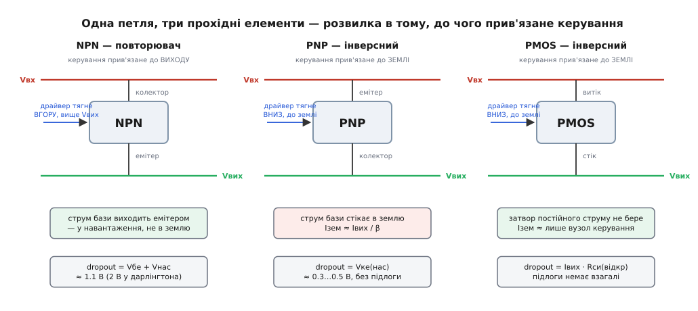
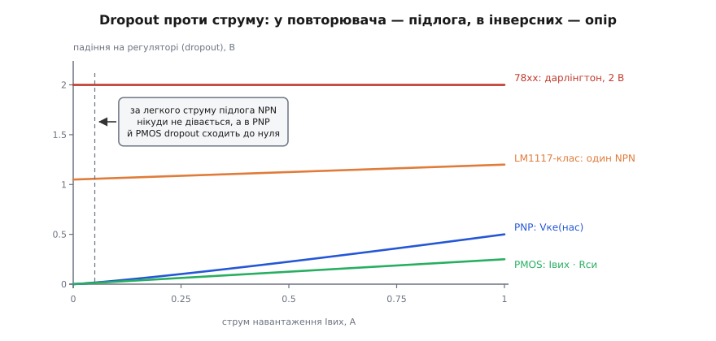
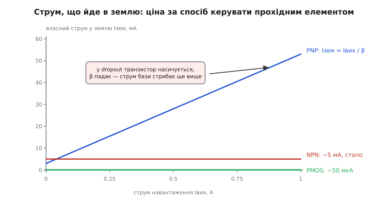
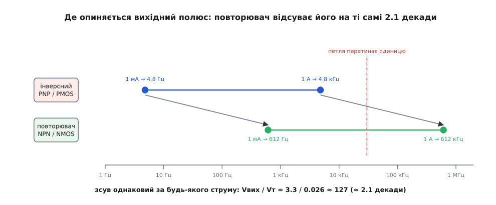

# Топології лінійних регуляторів: NPN, PNP, PMOS

<preknowlist>
- [BJT-транзистори](topic:electronics/bjt) — Vбе ≈ 0.7 В на відкритому переході, коефіцієнт підсилення β, струм бази Iк/β, режим насичення.
- [MOSFET як ключ](topic:electronics/mosfet-switch) — затвор керує напругою й постійного струму не бере; чим сильніше відкриваєш канал, тим менший його опір.
- [Опір Rds(on)](topic:electronics/rds-on) — опір відкритого каналу й падіння I·R, яке він дає.
- [LDO зсередини](topic:electronics/ldo-internals) — петля стабілізатора: еталон, підсилювач похибки й прохідний елемент, що гасить надлишок напруги на собі.
- [Від'ємний ЗЗ](topic:electronics/negative-feedback) — петля гасить власне відхилення; що таке полюс і чому запізнення фази перетворює регулятор на генератор.
</preknowlist>

Покладімо поряд даташити трьох лінійних стабілізаторів. Класичний 7805: щоб дістати з нього 5 В, подай на вхід щонайменше 7 В; сам він з'їдає 5 мА; вихідний конденсатор — «хоч 0.1 мкФ, хоч жодного». LM2940-клас: ті самі 5 В уже з 5.5 В, зате на повному ампері він тягне в землю 50 мА, а конденсатор просить із послідовним опором у чітко окресленому вікні. Сучасна дрібка завбільшки з рисове зерно: 3.3 В із 3.45 В, власне споживання — одна мікроампера, кераміка на виході бажана.

Усередині всіх трьох — [та сама петля](topic:electronics/ldo-internals): еталон, підсилювач похибки, прохідний елемент, [від'ємний зв'язок](topic:electronics/negative-feedback), що гасить будь-яке відхилення виходу. Жодної відмінності в ідеї. Різниця в одному-єдиному: який транзистор поставили прохідним і **як його увімкнули**. І ця одна відмінність тягне за собою геть усе — і потрібний запас напруги, і власне споживання, і вибагливість до конденсатора. Три несхожі рядки даташита виявляються трьома наслідками одного схемотехнічного вибору.

> 🔧 **Навіщо це.** Обираючи стабілізатор, ви щоразу торгуєте dropout проти струму в землю проти свободи з конденсатором. Ці три речі не крутяться незалежно — вони зчеплені прохідним елементом. Хто бачить зчеплення, той читає даташит навпаки: за одним рядком відновлює решту й наперед знає, де чип підведе.

### Розвилка одна: керувати вгору чи вниз

Прохідний елемент має бути керованим опором між входом і виходом — це спільне для всіх. Але керуючий вивід (базу чи затвор) можна прив'язати лише двома способами, і третього немає.

**Або керування відлічують від виходу.** Транзистор ставлять повторювачем (спільний колектор чи спільний витік): струм тече крізь нього згори вниз, а вихід «тягнеться» слідом за керуючим виводом, лишаючись на сталу величину нижче за нього. Щоб відкрити такий елемент дужче, драйвер мусить підняти базу **вище** — а база вже й так стоїть над виходом. Так вмикають NPN і NMOS.

**Або керування відлічують від входу.** Транзистор ставлять інверсно (спільний емітер чи спільний витік із витоком на вході): щоб пропустити більше струму, драйвер тягне базу чи затвор **вниз**, до землі. Так вмикають PNP і PMOS.


*Одна петля, три прохідні елементи. У повторювача керуючий вивід стоїть над виходом, і драйвер тягне його вгору; в інверсних топологіях керуючий вивід тягнуть униз, до землі. Звідси розходяться і dropout, і те, куди дівається струм керування.*

З цієї розвилки випливають три речі одразу, і саме вони й стоять у даташиті. Перше: **скільки запасу треба драйверу**, щоб дотягтися до керуючого виводу, — це dropout (англ. *dropout* — «випадання»: найменша різниця Vвх − Vвих, за якої петля ще тримає вихід). Друге: **куди подінеться струм керування** — у навантаження чи в землю. Третє: **який опір має вихідний вузол** — а від нього залежить, де сяде полюс петлі й чи вона взагалі встоїть.

Клітинок насправді чотири: біполярний або польовий помножити на повторювач або інверсний. Три з них — у назві теми; четверту доводиться діставати хитрощами.

### NPN-повторювач: підлога, за яку не переступиш

Почнімо з найстарішої топології. Колектор NPN сидить на вході, емітер — на виході, база висить над виходом. Емітер тримається на Vбе нижче за базу — отже, щоб на виході стояло 5 В, база мусить стояти на 5.7 В. А базу треба чимось живити, і цей драйвер сам сидить між входом і базою — тож і йому потрібен свій запас.

Класичний 7805 бере [дарлінгтона](topic:electronics/bjt/comp-darlington-uln.md) — два NPN каскадом, щоб мати β близько тисячі й керувати ампером від слабенького підсилювача похибки. Плата за це — другий перехід у стосі.

**Звідки в 7805 беруться саме 2 В dropout.** Складімо всі напруги, що мусять уміститися між входом і виходом:

```
напруга на базі дарлінгтона:  Vб  = Vвих + Vбе1 + Vбе2
                                  = 5.0 + 0.8 + 0.8
                                  = 6.6 В
запас драйверові над базою:   Vдр = Vке(нас) + Vрез
                                  = 0.2 + 0.2
                                  = 0.4 В
мінімальний вхід:             Vвх = Vб + Vдр
                                  = 6.6 + 0.4
                                  = 7.0 В
dropout:                      Vвх − Vвих = 7.0 − 5.0 = 2.0 В
```

Ті горезвісні 2 В — не недогляд виробника й не старість технології. Це сума двох переходів і місця для драйвера. Хоч як удосконалюй кристал, поки прохідний елемент лишається дарлінгтоном-повторювачем, менше не буде. Прибрати один перехід — і дістанеш рівно на один Vбе менше: LM1117-клас так і зробив, поставивши прохідним **один** NPN, якому базу качає PNP-драйвер, і одразу вийшло Vбе + Vке(нас) ≈ 0.9 + 0.3 ≈ 1.2 В. Той чип уже носить титул «low dropout» — хоча 1.2 В «низькими» звучать хіба на тлі двох.

Найважливіше в цій арифметиці — що вона **не залежить від струму**. Vбе тримається на переході логарифмічно: збільшиш струм удесятеро — напруга підросте десь на 60 мВ, і все. Тож dropout повторювача — це **підлога**: він майже однаковий і на повному ампері, і на десяти міліамперах.


*Криві розпадаються на дві сім'ї. У повторювачів dropout — рівна підлога з Vбе: хоч як зменшуй струм, вона нікуди не дінеться. В інверсних топологіях dropout — це падіння на відкритому транзисторі, тож зі струмом воно сходить до нуля. Саме тому «низький dropout» і «повторювач» погано вживаються разом.*

Ця підлога і є вирок NPN-топології для батарейних пристроїв: живити 3.3 В від літієвої банки, що під кінець розряду сідає до 3.4 В, повторювачем неможливо в принципі — не тому, що чип поганий, а тому, що Vбе не збирається зникати.

Натомість повторювач дає три речі задарма, і кожна з них — прямий наслідок того самого вмикання. **Струм бази виходить емітером**, тобто вливається у вихід, а не витікає в землю, — тож у землю йде лише те, що споживає сам вузол керування. **Колектор дивиться на вхід**, а колектор — вивід із високим власним опором, тож пульсації входу він майже не пропускає на емітер; звідси природно добре [придушення вхідних пульсацій](topic:electronics/psrr). І **зворотного шляху немає**: якщо вихід раптом опиниться вище за вхід, у NPN просто нема паразитного діода, що пустив би струм назад, — а от у польових прохідних елементів такий діод є завжди.

### PNP: базу можна притиснути до землі

Тепер переверньмо транзистор. Емітер PNP — на вході, колектор — на виході, а базу драйвер тягне **вниз**. І тут зникає сама причина підлоги: базі більше не треба стояти над виходом, її можна опустити хоч до землі. Транзистор увійде в насичення, і єдине, що лишиться між входом і виходом, — його власне падіння в насиченні Vке(нас). У LM2940-класі це 0.5 В на повному ампері й помітно менше на частковому. Ось вона, справжня низька межа — і ось звідки взялася перша хвиля чипів із написом LDO.

Але за це доводиться платити, і рахунок виставляють у тому самому місці, де зникла підлога.

**Плата перша: струм бази стікає в землю.** Драйвер не подає струм у базу, а **витягує** його звідти й зливає на землю. А величина цього струму — Iк/β, тобто вона пропорційна навантаженню. Біда в тому, що β монолітного [бічного PNP](topic:electronics/lateral-pnp) — жалюгідні 10–50 замість тисячі в дарлінгтона: така вже його будова на біполярному кристалі.

Тут варто розділити два поняття, які даташити люблять змішувати. **Струм спокою** — це те, що чип бере без навантаження. **Струм у землю** — це все, що виходить із виводу GND, тобто Iвх − Iвих. У повторювача вони майже збігаються. У PNP-топології — ні: струм у землю росте разом із навантаженням.

**Скільки коштує струм бази там, де LDO мав би сяяти.** Візьмімо PNP-стабілізатор 3.3 В із β = 20 і струмом спокою 3 мА, що працює на 1 А від майже розрядженої банки 3.4 В — тобто рівно в тому режимі, заради якого його й купували:

```
струм бази:            Iб   = Iвих / β
                            = 1.0 / 20
                            = 0.05 А = 50 мА
втрати на регулюванні: Pрег = (Vвх − Vвих) · Iвих
                            = (3.4 − 3.3) · 1.0
                            = 0.10 Вт
втрати на струмі бази: Pб   = Vвх · Iб
                            = 3.4 · 0.05
                            = 0.17 Вт
ККД:                   η    = (Vвих · Iвих) / (Vвх · (Iвих + Iб + Iq))
                            = 3.3 / (3.4 · 1.053)
                            ≈ 0.92  → 92 %   (стеля лінійного тут 3.3/3.4 ≈ 97 %)
```

Струм бази марнує 0.17 Вт — **більше, ніж саме регулювання** з його 0.10 Вт. Ось у чому підступ: що менший dropout, то менше втрачається на прохідному елементі, а от струм бази лишається таким самим — і з дрібної добавки він перетворюється на головну статтю втрат. PNP-топологія найдорожча саме там, де мала б бути найкращою.

**Плата друга: у dropout стає ще гірше.** Коли вхід сідає й запасу вже не вистачає, петля робить єдине, що вміє, — тисне базу вниз щосили. PNP заходить у глибоке насичення, β там обвалюється, і щоб пропустити той самий струм, бази треба качати дедалі більше. Струм у землю не просто росте — він стрибає. Виходить зловісна петля: сіла батарея → регулятор пішов у dropout → почав пити з неї ще дужче → вона сіла швидше.


*У повторювача струм бази йде у вихід, тож у землю тече стала дрібниця. У PNP струм бази зливається на землю й росте разом із навантаженням — а на межі dropout ще й стрибає, бо в насиченні β обвалюється. Затвор PMOS постійного струму не бере взагалі, тож у землю йде лише те, що п'є вузол керування.*

### PMOS: те саме вмикання, але затвор не бере струму

Замінімо PNP на PMOS: витік — на вході, стік — на виході, затвор тягнуть униз. Вмикання те саме, інверсне, тож перевага з dropout лишається. А от обидві плати зникають, бо **затвор — це обкладка конденсатора, і постійного струму він не бере**. Немає струму керування — немає ні втрат на ньому, ні стрибка в dropout. У землю йде тільки те, що споживають еталон і підсилювач похибки, а їх можна зробити хоч на сотні наноампер. Усі стабілізатори з мікроамперним споживанням, якими живлять роками сплячі датчики, — це PMOS.

Змінюється і природа самого dropout. У насиченого біполярного транзистора Vке(нас) — суміш переходу й об'ємного опору. У відкритого польового це чистий [опір каналу](topic:electronics/rds-on), тож dropout стає просто законом Ома:

```
Vdrop = Iвих · Rси(відкр)
```

**Чи витягне PMOS-LDO 3.3 В із сідлої літієвої банки.** Хай Rси(відкр) прохідного елемента — 0.25 Ом (типово для чипа на ампер), банка сіла до 3.4 В:

```
запас над виходом:     Vвх − Vвих = 3.4 − 3.3 = 0.1 В
пристрій спить, 0.2 А: Vdrop = 0.2 · 0.25 = 0.05 В
перевірка:             0.05 < 0.1  →  тримає
той самий чип, 1 А:    Vdrop = 1.0 · 0.25 = 0.25 В
перевірка:             0.25 > 0.1  →  НЕ тримає, вихід іде слідом за входом
```

Одного числа «dropout цього чипа» не існує — заголовок даташита називає падіння **на повному струмі**, а на десятій частці навантаження воно вдесятеро менше. Саме це й рятує батарейний пристрій: у сні, коли він тягне міліампери, PMOS-LDO вичавлює з банки останні мілівольти, а на піках струму чесно попереджає падінням.

Дармового тут теж немає. **Затвор треба чимось відкривати**: канал відкривається настільки, наскільки затвор нижчий за витік, а витік сидить на вході. Драйвер може опустити затвор щонайнижче до землі, тож усе доступне керування — це рівно Vвх. Падає вхід — слабшає керування — росте Rси(відкр) — росте dropout; на входах близько вольта такий чип уже потребує помпи, що зробить від'ємну напругу для затвора. Додайте до цього, що опір каналу росте з температурою: обіцяні 0.25 Ом на столі перетворяться на добру третину ома в гарячому корпусі.

**Пульсації входу проходять наскрізь легше.** Витік PMOS сидить прямо на вході, тому вхідне брижіння б'є просто по напрузі затвор-витік і модулює струм каналу; поки петля встигає, вона це гасить, а щойно її підсилення спадає — [придушення пульсацій](topic:electronics/psrr) валиться. Найгірше — у dropout: там канал уже відкритий навстіж і працює як звичайний резистор, тож вхідні пульсації просто перетікають на вихід, і жодна петля не допоможе.

І **паразитний [body-діод](topic:electronics/body-diode)** дивиться анодом на вихід: варто виходу опинитися вище за вхід — а це буває, коли вхід знеструмили, а на виході висить заряджений конденсатор чи друге джерело, — і струм піде назад крізь чип. Ця сама вада є і в PNP, який у такому разі просто вмикається зворотним боком. Хочете, щоб вихід не живив вхід, — ставте окремий [ідеальний діод](topic:electronics/ideal-diode) або беріть чип із власним захистом від зворотного струму.

### Спільна розплата інверсних топологій: вихідний полюс поїхав

Лишилася третя річ, що випливає з розвилки, — і вона однакова для PNP та PMOS, бо залежить не від матеріалу, а від вмикання.

У повторювача вихідний вузол тримає емітер, а емітер має власний малий опір — приблизно 1/gm, тобто Vт/Iвих, де Vт ≈ 26 мВ. В інверсній топології вихідний вузол живить колектор або стік — а це майже ідеальне джерело струму з величезним власним опором, тож опір вузла задає саме навантаження: Rнав = Vвих/Iвих. Разом із вихідним конденсатором цей опір утворює полюс — і від того, де полюс сяде, залежить, чи петля встоїть.

**Де опиняється вихідний полюс у кожному разі.** Вихід 3.3 В, конденсатор 10 мкФ, струм 1 А:

```
повторювач:  Zвих  = Vт / Iвих = 0.026 / 1.0 = 0.026 Ом
             fполюс = 1 / (2π · 0.026 · 10·10⁻⁶) ≈ 612 кГц
інверсний:   Zвих  = Vвих / Iвих = 3.3 / 1.0 = 3.3 Ом
             fполюс = 1 / (2π · 3.3 · 10·10⁻⁶) ≈ 4.8 кГц
відношення:  (Vвих/Iвих) / (Vт/Iвих) = Vвих / Vт
                                     = 3.3 / 0.026
                                     ≈ 127
```

У відношенні струм скоротився. Це не збіг, а суть: повторювач ділить опір вихідного вузла рівно на Vвих/Vт — і робить це **однаково за будь-якого навантаження**. Дві декади з гаком запасу, подаровані самим вмиканням.


*Полюс їздить зі струмом в обох топологіях — на три порядки від міліампера до ампера. Але ряд повторювача весь зсунутий праворуч рівно на Vвих/Vт ≈ 127, тобто на 2.1 декади, і цей зсув не залежить від струму. У повторювача полюс легко тримати поза робочою смугою петлі; в інверсній топології він падає просто в неї — та ще й переїжджає разом із навантаженням.*

Ось чому 7805 працює з будь-яким конденсатором і без нього, а PNP-чип вимагає конденсатора з послідовним опором у визначеному вікні: той опір додає нуль, який відіграє назад украдену полюсом фазу. Занизьке ESR — нуль тікає задалеко вгору й уже не рятує; звідси й класична пастка, коли заміна танталу на «кращу» кераміку перетворює стабілізатор на генератор. Сучасні PMOS-чипи компенсують інакше, всередині, і кераміку люблять — але заплатили за це вужчою смугою петлі, а отже, млявішою реакцією на кидок навантаження. Як саме розставляють ці полюси й нулі — окрема наука про [стійкість LDO](topic:electronics/ldo-stability).

### Четверта клітинка: NMOS і зарядна помпа

Складімо чотири клітинки докупи. Повторювач дає малий опір вузла й свободу з конденсатором, але біполярний повторювач тягне за собою підлогу з Vбе. Польовий прохідний елемент дає dropout-опір без підлоги й нульовий струм керування, але інверсне вмикання псує полюс. А чи не можна взяти польовий **повторювач**?

Можна — це NMOS, витоком на вихід. Тоді dropout = Iвих·Rси(відкр) без жодної підлоги, струму затвора немає, а вузол виходу тримає витік із малим опором, тож полюс далеко й кераміка не страшна. Найкраще з усіх світів — і тому саме так роблять швидкі сильнострумові стабілізатори з dropout у десятки мілівольт.

Заковика в затворі. Витік NMOS сидить **на виході**, тож відкрити канал можна лише піднявши затвор вище за вихід на добрі Vth із запасом — а вихід у низькому dropout майже дорівнює входу. Виходить, затвор треба живити напругою **вищою за вхід**, якої в схемі просто немає. Її або приносять окремою шиною зміщення (у платах, де вже є 12 В поряд із 5-вольтовою шиною живлення), або роблять на місці [зарядною помпою](topic:electronics/charge-pump) — ціною кількох мікроамперів споживання й власного тріску на частоті помпи. Влаштування цього класу чипів, їхню типову розпіновку з окремим виводом зміщення та граблі з послідовністю ввімкнення розібрано в [огляді NMOS-стабілізаторів](topic:electronics/linear-regulator-types/comp-nmos-ldo.md).

### Що з цього обирати

Вибір починається не з чипа, а з питання «який у мене вхід і чого я від нього хочу».

Запас над виходом вольта два й більше, а важать тиша й точність — беріть NPN-повторювач. Ви й так викидаєте ті вольти теплом, тож підлога з Vбе нічого не коштує, зате дістаєте байдужість до конденсатора й чудове придушення пульсацій задарма. Класичний хід — поставити такий чип **після** [імпульсного перетворювача](topic:electronics/switching-converter), щоб він зчистив його брижі перед аналоговою чи радіочастиною.

Живлення від банки, пристрій місяцями спить, і вичавити треба кожен мілівольт — тільки PMOS. Мікроамперний струм спокою й dropout, що сходить до нуля на малому струмі, — це рівно те, чого просить така задача, а вимогу щодо конденсатора сучасний чип уже втамував усередині.

Ампери від сусідньої шини, та ще й із швидкими кидками навантаження, — NMOS із помпою чи зовнішнім зміщенням: єдина клітинка, де малий dropout не б'ється зі стійкістю.

А PNP лишився там, де його поставили тридцять років тому: у машині, де 5 В треба втримати, поки бортова мережа під час запуску стартера провалюється мало не до шести. Для нового батарейного пристрою він програє PMOS за всіма статтями — та в автомобільному й промисловому залізі досі живий, бо витриваліший до бруду на вході. Як три топології змінювали одна одну — від першого триногого стабілізатора Боба Відлара до мікроамперних дрібок — розказано в [історії прохідного елемента](topic:electronics/linear-regulator-types/hist-pass-element.md). А математику, що стоїть за підлогою Vбе, обвалом β в насиченні й тим самим множником Vвих/Vт, виведено в [числах прохідного елемента](topic:electronics/linear-regulator-types/math-pass-element.md).

> 🔧 **Навіщо це.** Дивлячись у даташит, шукайте не оцінки, а топологію — решта з неї виводиться. Побачили dropout близько вольта чи двох, що не залежить від струму, — це повторювач: конденсатор ставте будь-який, пульсації він зчистить добре, але від сідлої батареї не працюватиме ніколи. Побачили dropout, що падає зі струмом, — це інверсна топологія: перевіряйте вимогу до конденсатора й рахуйте dropout **на своєму** струмі, а не на тому, що в заголовку. Побачили струм у землю, що росте з навантаженням, — це PNP, і на малому dropout його струм бази з'їсть більше, ніж саме регулювання; ще й стрибне, коли батарея сяде. Побачили одиниці мікроампер спокою — це PMOS, ваш вибір для сну. А зустріли вивід зміщення чи згадку про зарядну помпу — це NMOS, і платите ви за найкращий dropout зайвою шиною та тріском помпи.
