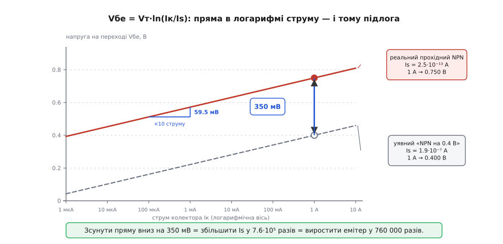
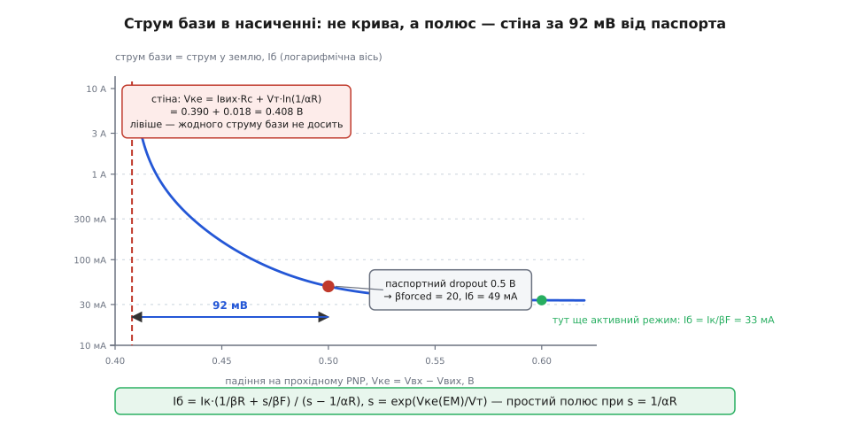
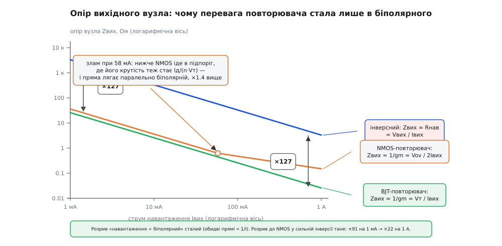

# 🧮 Числа прохідного елемента

Три числа тримають на собі весь вибір прохідного елемента. Підлога з Vбе, яку не переступити ніякою технологією. Обвал β в насиченні, що перетворює струм у землю на прірву. Множник Vвих/Vт ≈ 127, на який повторювач ділить опір вихідного вузла. Вони з різних рядків даташита й на вигляд не мають між собою нічого спільного: одне про напругу, друге про струм, третє про стійкість петлі.

Насправді це одна річ, побачена з трьох боків. Усі три виводяться з єдиної формули, у якій лише одна фізична стала — і жодного параметра кристала. Варто цю формулу видобути, і три числа випадуть із неї самі, як три наслідки однієї теореми.

## Одна стала й одна функція

Почнімо з бар'єра. У [pn-переході](topic:physics/pn-junction) є сходинка потенціалу: щоб електрон із n-області потрапив у p-область, він мусить мати достатньо теплової енергії, щоб на цю сходинку видертися. Скільки таких електронів знайдеться? Відповідь дає розподіл Больцмана: частка носіїв з енергією понад qV дорівнює exp(−qV/kT). Не «приблизно», не «за моделлю» — це і є означення теплової рівноваги.

Тепер прикладімо пряму напругу Vбе. Вона знижує бар'єр рівно на qVбе — а отже, множить кількість носіїв, що його долають, на exp(qVбе/kT). Струм іде за кількістю носіїв. Ось і вся фізика:

```
Iк = Is·(exp(Vбе/Vт) − 1) ≈ Is·exp(Vбе/Vт)    для Vбе ≫ Vт

де  Vт = kT/q   —  теплова напруга
    Is          —  масштабний струм (англ. saturation current)
```

Придивімося, як ця формула поділена. Праворуч стоять два множники, і вони належать до різних світів.

**Is — це весь прилад.** Площа емітера, легування бази, її товщина, матеріал, температура кристала — усе, що інженер може накреслити чи змінити, зібрано тут. Is — масштаб приладу, і нічого, крім масштабу.

**Vт — це не прилад узагалі.** Ані площі, ані легування, ані технології. Тільки дві світові сталі й температура:

```
Vт = kT/q

k = 1.380649·10⁻²³ Дж/К      (точна за SI-2019)
q = 1.602176634·10⁻¹⁹ Кл     (точна за SI-2019)

Vт(300 К) = 1.380649·10⁻²³ · 300 / 1.602176634·10⁻¹⁹
          = 0.025852 В ≈ 25.9 мВ
```

І ось перша річ, яку варто відчути перш ніж рахувати. Схемотехнік звик, що будь-яке число в приладі можна посунути: не влаштовує опір — зроби канал ширшим, не влаштовує β — зміни профіль бази. Vт посунути не можна нічим, крім термостата. Двадцять шість мілівольтів — це не характеристика транзистора, це характеристика **кімнати**.

> 🔧 **Навіщо це.** Коли число в даташиті виводиться з Is, воно піддається кристалу: більший емітер, тонша база — і число посунулося. Коли число виводиться з Vт, кристал безсилий, бо Vт не про кристал. Саме тому одні межі прохідного елемента виробник роками відсуває, а інші стоять непорушно з 1960-х. Уміти розрізнити ці два роди чисел — і означає читати даташит, а не вірити йому.

Далі — простий план. З експонентою можна зробити рівно три речі, і кожна дає одне з трьох чисел:

- **обернути її** — вийде логарифм, а з нього підлога Vбе;
- **завести другий її примірник** — на колекторному переході, і з нього випаде обвал β в насиченні;
- **продиференціювати її** — вийде крутість gm, а з неї множник Vвих/Vт.

Три числа — це обернена функція, друга копія й похідна однієї експоненти. Більше в цій історії нема нічого.

## Обернена функція: чому Vбе — це підлога

Розв'яжімо експоненту відносно напруги:

```
Vбе = Vт · ln(Iк / Is)
```

Логарифм — доволі млява функція, і саме в цій млявості вся річ. Спитаймо, скільки коштує помножити струм на десять:

```
ΔVбе за декаду струму = Vт · ln(10)
                      = 0.025852 · 2.302585
                      = 0.0595 В = 59.5 мВ
```

Шістдесят мілівольтів на декаду. Не «для цього транзистора» — для будь-якого біполярного транзистора, який будь-коли зробили чи зроблять, бо в цьому виразі немає нічого, крім kT/q і десятки.

Погляньмо, що це означає для прохідного елемента на ампер. Візьмімо масштабний струм Is = 2.5·10⁻¹³ А — типовий для силового NPN такого класу:

```
Iк = 1 мкА:   Vбе = 0.025852 · ln(1·10⁻⁶ / 2.5·10⁻¹³) = 0.393 В
Iк = 1 мА:    Vбе = 0.025852 · ln(1·10⁻³ / 2.5·10⁻¹³) = 0.572 В
Iк = 1 А:     Vбе = 0.025852 · ln(1     / 2.5·10⁻¹³) = 0.750 В

шість декад струму зсунули Vбе всього на 357 мВ
```

Мільйон разів по струму — і триста п'ятдесят мілівольтів. Ось чому підлога тримається однаково на повному ампері й на десяти міліамперах: логарифм просто не вміє падати швидше.

**Звідки береться «0.8 В» замість книжкових 0.7.** Зверніть увагу, що на ампері перехід дає 0.750 В, а даташит на такий транзистор покаже 0.8 і більше. Різниця не в експоненті — вона в тому, що між виводом бази й самим переходом лежить об'ємний опір емітера Rе, десятки мілі-омів:

```
Vбе(на виводах) = Vбе(перехід) + Iе·Rе
                = 0.750 + 1.0 · 0.05
                = 0.800 В
```

Тобто «0.7 В» підручника — це перехід на міліамперах, а «0.8…0.9 В» даташита — той самий перехід на ампері плюс закон Ома на дротах усередині корпусу. Експонента тут ні до чого; просто до неї щось приклеїли.

**Чому дарлінгтон дає майже рівно вдвічі.** Здавалося б, два переходи в стосі мусили б дати різні напруги: вихідний транзистор веде ампер, а той, що качає йому базу, — усього Iк/β ≈ 20 мА, тобто в п'ятдесят разів менше. Логарифм на це відповідає −Vт·ln(50) = −101 мВ. Але драйверний транзистор і сам разів у двадцять п'ять менший за площею, а менша площа — це менший Is, тобто +Vт·ln(25) = +83 мВ. Дві поправки майже гасять одна одну:

```
вихідний Q2 на 1 А:     Vбе2 = 0.750 + 0.050 (омічне) = 0.800 В
драйверний Q1 на 20 мА: Vбе1 = 0.732 + 0.010 (омічне) = 0.742 В
                        ─────────────────────────────────────────
стос:                   Vбе1 + Vбе2 = 1.542 В
```

Ось чому даташит спокійно пише «два по 0.8 В» і не бреше більш ніж на пів десятка відсотків. Збіг не випадковий: драйвер завжди роблять меншим приблизно в стільки разів, у скільки менший його струм, — бо його роблять під його струм.

**А тепер головне: чому цю підлогу не можна прибрати.** Підлога — не наслідок лінощів технолога. Спитаймо прямо: що треба зробити з кристалом, щоб дістати 0.4 В на ампері замість 0.750?

```
треба:  0.400 = Vт · ln(1 / Is')
звідси: Is' = exp(−0.400 / 0.025852) = 1.9·10⁻⁷ А

у скільки разів більший за теперішній:
        Is' / Is = 1.9·10⁻⁷ / 2.5·10⁻¹³ = 7.6·10⁵

Is пропорційний площі емітера → емітер у 760 000 разів більший
```

Сімсот шістдесят тисяч разів. Хоч би яким був вихідний емітер — а це частки квадратного міліметра — після такого множення кристал не влізе не те що в корпус, а й у долоню. Ось що насправді означає слово «підлога»: не «важко зробити краще», а «логарифм такий плаский, що плата за кожні наступні сто мілівольтів росте в чотириста разів».


*У логарифмі струму Vбе — це пряма, і нахил у неї той самий Vт·ln(10) = 59.5 мВ на декаду в будь-якого біполярного транзистора. Зсунути пряму вниз можна лише збільшивши Is, тобто площу емітера, — і за 350 мВ правлять множник 7.6·10⁵. Дві прямі паралельні, і зблизити їх нічим.*

**Куди підлога їде від нагріву.** Vт росте з температурою, причому точно: dVт/dT = k/q = 86.17 мкВ/К. Наївно з цього випливало б, що гарячий транзистор просить більшої напруги. Насправді все навпаки, бо Is росте з температурою значно швидше — приблизно як exp(−Eg/kT), тобто женеться за шириною забороненої зони. Логарифм цю гонку програє, і результат виходить від'ємний:

```
dVбе/dT = (Vбе − Eg/q − (4+m)·Vт) / T        m ≈ −1.5 (показник рухливості)

Vбе = 0.60 В:  (0.60 − 1.206 − 0.065)/300 = −2.24 мВ/К
Vбе = 0.75 В:  (0.75 − 1.206 − 0.065)/300 = −1.74 мВ/К
```

Звідси і горезвісні «мінус два мілівольти на градус»: величина залежить від Vбе, тож на малих струмах нахил крутіший, на великих — пологіший. Той самий від'ємний нахил, до речі, і є причиною, чому еталон усередині стабілізатора роблять [бандгепом](topic:electronics/voltage-reference-sources): CTAT-складову Vбе гасять PTAT-складовою, пропорційною Vт, і сума виходить рівною близько 1.2 В у широкому діапазоні температур — конспект простий, але без нього незрозуміло, звідки в еталона взагалі береться стала напруга.

Наслідок для вибору топології гарний і зовсім не очевидний: **підлога з Vбе від нагріву меншає**. Два переходи по −1.7 мВ/К дають −3.4 мВ/К, тобто за сто градусів стос дарлінгтона просідає більш як на третину вольта — гарячому повторювачу треба менше запасу, ніж холодному. А [опір відкритого каналу](topic:electronics/rds-on) від нагріву, навпаки, росте. Дві топології дрейфують у протилежні боки: у повторювача найгірший dropout — на холодному старті, у польового — на гарячому піку. Це різні кути даташита й різні режими випробувань.

## Другий примірник експоненти: обвал β в насиченні

Досі ми говорили про один перехід. Але в транзистора їх два, і в кожного своя експонента. Уся різниця між активним режимом і насиченням — у тому, чи прокинулася друга.

В активному режимі колекторний перехід зміщений зворотно: Vбк < 0, отже exp(Vбк/Vт) — це exp(від'ємного числа, поділеного на 26 мВ), тобто нуль із будь-якою потрібною точністю. Другої експоненти просто немає, і транзистор поводиться так, як його малюють у підручнику: Iк = Is·exp(Vбе/Vт), Iб = Iк/βF.

Насичення — це коли **колекторний перехід теж відкрився**. Тепер він теж інжектує носіїв, тільки назустріч. Транзистор працює обома переходами одразу, і його треба описувати чесно — обома експонентами. Це й зробили Джуелл Джеймс Еберс і Джон Луїс Молл у Bell Labs; їхня стаття «Large-signal behavior of junction transistors» вийшла в Proceedings of the IRE в 1954-му (том 42, № 12, с. 1761–1772). Обидва — американці, обидва з докторатами Університету штату Огайо, обидва тоді в Мюррей-Гілл. Модель відтоді уточнювали (Гуммель і Пун 1970-го додали ефекти сильних струмів), але для того, що нас цікавить, вистачає з надлишком і початкової:

```
Iк = Is·[exp(Vбе/Vт) − exp(Vбк/Vт)] − (Is/βR)·[exp(Vбк/Vт) − 1]
Iб = (Is/βF)·[exp(Vбе/Vт) − 1] + (Is/βR)·[exp(Vбк/Vт) − 1]

βF — пряма β (англ. forward — прямий), βR — зворотна (англ. reverse — зворотний)
```

Читається це просто. Перший доданок в Iк — прямий транзистор мінус зворотний. Другий — те, що зворотний транзистор украв у бази. У формулі Iб теж два доданки: перший — звична плата за прямий струм, другий — **чиста втрата на розбудженому колекторному переході**, поділена на βR. Ось у цьому другому доданку й ховається вся біда. [Модель Еберса–Молла](topic:electronics/ebers-moll) варта окремої розмови — тут нам треба знати лише те, що вона описує транзистор двома переходами, кожен зі своєю експонентою, і що з неї виводиться все нижченаписане.

**Чому βR паскудна.** Зворотна β — це коефіцієнт підсилення того самого транзистора, увімкненого догори дриґом: колектор працює емітером. А колектор для цієї ролі непридатний за будовою. Емітер легують сильно й навмисно — щоб [інжекція](topic:physics/minority-carrier-injection) йшла переважно в базу, а не назад. Колектор легують слабко — щоб тримав напругу. Поміняйте їх ролями, і ефективність інжекції завалиться. У вертикального NPN βF буває за сотню, а βR — одиниці. У [бічного PNP](topic:electronics/lateral-pnp) з монолітного кристала обидві скромні: опублікована оцінка для бічного PNP — βF близько 30 проти близько 300 у вертикального, і саме звідси відомі всім жалюгідні десятки. Розрізняти пряму й зворотну [β](topic:electronics/bjt-gain) конче потрібно: в активному режимі працює лише перша, у насиченні друга стає головною.

**Виведімо напругу насичення.** Позначмо x = exp(Vбе/Vт), y = exp(Vбк/Vт) і вважаймо обидві ≫ 1. Тоді Vке = Vбе − Vбк = Vт·ln(x/y) — тобто вся напруга колектор-емітер є не що інше, як **логарифм відношення двох експонент**. Лишилося виразити x і y через струми. З рівняння для Iб:

```
Is·x = βF·Iб − (βF/βR)·Is·y
```

Підставмо в рівняння для Iк і розв'яжімо. Введімо нав'язану β — те, що зовнішня схема нав'язала транзисторові: βнав = Iк/Iб. Виходить

```
Is·y = Iб·(βF − βнав) / [1 + (βF+1)/βR]

і остаточно

Vке(нас) = Vт · ln[ (1 + (1 + βнав)/βR) / (1 − βнав/βF) ]
```

Перевірмо межі, бо формула без перевірки — просто набір літер. Хай βнав → βF: знаменник іде в нуль, логарифм — у нескінченність. Правильно: транзистор, з якого тягнуть повну β, у насичення не заходить взагалі. Хай βнав → 0: логарифм сідає на ln(1 + 1/βR) — і це не нуль. Тобто навіть за нульового струму колектора між виводами лишається напруга Vт·ln(1/αR) — той самий горезвісний офсет насиченого транзистора у два-три десятки мілівольтів, через який біполярний ключ ніколи не буває справжнім замиканням.

Тепер оберніть цю формулу — і вона скаже те, заради чого все й затівалося: **скільки бази треба качати, щоб дістати задане Vке**.

```
βнав = (s − 1/αR) / (1/βR + s/βF),     s = exp(Vке/Vт),   1/αR = 1 + 1/βR

Iб = Iк · (1/βR + s/βF) / (s − 1/αR)
```

Придивіться до знаменника. Це **простий полюс**. Не «швидко росте», не «експоненційно» — Iб іде в нескінченність за скінченного Vке, а саме за

```
Vке(мін) = Vт · ln(1/αR) = Vт · ln(1 + 1/βR)
```

Ось справжня причина того, що струм у землю в dropout не росте, а стрибає. Крива не крута — вона впирається у вертикальну стіну.

**Порахуймо це на справжньому чипі.** Візьмімо LM2940 — класичний PNP-стабілізатор на ампер. Паспорт дає: dropout типово 0.5 В на 1 А, а струм у землю на 1 А за різниці Vвх − Vвих = 5 В — 30 мА, причому виробник окремо попереджає, що підвищений струм буває лише в режимі dropout. Модель беремо не припасовану: βF = 30 з опублікованої оцінки для бічного PNP, Vт = 25.9 мВ.

```
перевірка моделі в активному режимі (запасу вдосталь):
    Iб = Iк/βF = 1.0/30 = 33 мА       паспорт: 30 мА   ✓ збіг у межах 10 %
```

Модель угадала паспортне число, нічого не підганяючи, — добрий знак, що βF узято правильно. Тепер спитаймо, з чого складаються паспортні 0.5 В.

Тут доведеться зробити одне чесне зізнання: βR для конкретного чипа виробники не публікують ніколи, тож візьмімо βR = 1 як представницьке значення. Здавалося б, на цьому все й розсиплеться — але ні, і варто побачити, чому. Уся роль βR у нашій задачі — задати висоту стіни Vт·ln(1 + 1/βR), а логарифм і тут робить свою звичну справу:

```
βR = 0.3:  Vт·ln(1 + 1/0.3) = 37.9 мВ
βR = 1:    Vт·ln(1 + 1/1)   = 17.9 мВ
βR = 3:    Vт·ln(1 + 1/3)   =  7.4 мВ
```

Десятикратна невизначеність у βR совгає стіну на якісь тридцять мілівольтів. Проти паспортних 500 мВ це шум — тобто висновок нижче від вибору βR практично не залежить, і саме тому таке зізнання не страшне.

А тепер сама відповідь. Формула Vке(нас) каже: перехідна частина не може дати багато — навіть за βнав → 0 стеля становить ті самі ≈ 18 мВ. Отже левова частка тих 0.5 В — **не перехід, а звичайний опір**: об'ємний опір слабколегованого колектора. Це вже справжній вільний параметр, і припасуймо його так, щоб модель відтворила відомий підйом струму в землю біля dropout:

```
Rк ≈ 0.39 Ом  →  на 1 А це 0.39 В омічних із 0.5 В повних
                 на перехід лишається Vке(перех) = 0.11 В
```

Вісімдесят відсотків «напруги насичення» силового PNP — це закон Ома, а не фізика переходу. Саме тому dropout інверсної топології сходить до нуля разом зі струмом: головний доданок у ньому — Iвих·Rк.

А тепер пройдімося вниз по входу й подивімося, що робить струм бази:

```
Vке повне   Vке(перех)   βнав     Iб = струм у землю
─────────────────────────────────────────────────────
  5.00 В      4.61 В     30.0            33 мА     активний режим
  0.60 В      0.21 В     29.7            34 мА     ще майже активний
  0.50 В      0.11 В     20.4            49 мА     ← паспортний dropout
  0.47 В      0.08 В     11.6            86 мА
  0.45 В      0.06 В      6.1           164 мА
  0.43 В      0.04 В      2.3           429 мА
  0.42 В      0.03 В      1.1           929 мА
  0.41 В      0.02 В      0.16         6397 мА     петля цього не дасть
─────────────────────────────────────────────────────
стіна: Vке = Iвих·Rк + Vт·ln(1/αR) = 0.390 + 0.018 = 0.408 В
```

Порахуйте відстань від паспортного рядка до стіни: дев'яносто два мілівольти. У межах цих дев'яноста двох мілівольтів струм у землю росте з 49 мА до майже ампера — тобто **стабілізатор починає пити з батареї стільки ж, скільки віддає навантаженню**. А за стіною не допоможе жоден драйвер: там βнав від'ємна, тобто розв'язку не існує, і вихід просто йде слідом за входом.


*Струм бази має простий полюс за Vке = Iвих·Rк + Vт·ln(1/αR). Ліворуч від цієї вертикалі розв'язку немає взагалі. Паспортний dropout стоїть усього за 92 мВ від стіни — і саме в цьому вузькому провулку струм у землю встигає вирости в двадцять разів. Стрибок — не метафора: це полюс.*

Зверніть увагу, що фізика тут зловісно замикається сама на себе. Батарея сідає — Vке меншає — струм бази росте по гіперболі — батарея сідає швидше. Полюс, який ми щойно вивели, і є математичний портрет цієї петлі.

## Похідна експоненти: звідки береться множник Vвих/Vт

Лишилося третє число. Продиференціюймо ту саму експоненту:

```
gm ≡ dIк/dVбе = d/dVбе [ Is·exp(Vбе/Vт) ] = Is·exp(Vбе/Vт) / Vт = Iк / Vт
```

Експонента — єдина функція, що дорівнює власній похідній, і саме тому результат вийшов такий чистий. [Крутість](topic:electronics/transconductance) біполярного транзистора не залежить **ні від чого**, крім струму, який ви крізь нього пропустили: ні площі, ні легування, ні технології, ні виробника. Is скоротився — він стояв і в чисельнику, і всередині експоненти:

```
gm(1 мА) = 0.001 / 0.025852 = 38.7 мА/В  —  для будь-якого біполярного транзистора,
                                            коли-небудь зробленого
```

**Тепер — чому опір вузла виходить 1/gm.** Тут важливо не проковтнути формулу, а побачити механізм. Уявімо емітерний повторювач і смикнімо емітер угору на δV, тримаючи базу. Vбе зменшилося на δV — отже, струм крізь транзистор упав на gm·δV. Тобто вузол сам, без жодної петлі, без підсилювача похибки, без смуги пропускання, відповів струмом, що протидіє збуренню. Відношення δV до цього струму й є опір вузла:

```
Zвих(емітер) = δV / (gm·δV) = 1/gm = Vт / Iк
```

Це **місцевий від'ємний зв'язок, зашитий у сам транзистор**. Він миттєвий і безумовний: працює на будь-якій частоті, бо це не петля, а те, як влаштована експонента.

А тепер зробімо те саме з колектором. Смикнімо колектор угору на δV, тримаючи базу й емітер. Що змінилося в Vбе? **Нічого.** База там, де була, емітер там, де був. Струм колектора не поворухнувся (крім кволої поправки на [ефект Ерлі](topic:electronics/early-effect)). Вузол ніяк не відповів на власне збурення — місцевого зв'язку в нього немає взагалі, і опір вузла задає не транзистор, а те, що до нього причеплено, тобто саме навантаження:

```
Zвих(колектор) ≈ Rнав = Vвих / Iвих
```

Ось і все пояснення. Не «повторювач якийсь кращий» — а **в емітера експонента тримає власний вузол за горло, а в колектора не тримає нічого**. Порівняймо:

```
повторювач:  Zвих = Vт   / Iвих
інверсний:   Zвих = Vвих / Iвих
             ────────────────────
відношення = (Vвих/Iвих) / (Vт/Iвих) = Vвих / Vт = 3.3 / 0.0259 ≈ 127
```

Струм скоротився — і це не фокус, а суть. Обидва опори — це «якась напруга, поділена на робочий струм». Просто у повторювача та напруга дорівнює 26 мВ, які дала природа, а в інверсної топології — 3.3 В, які замовив застосунок. Множник 127 — це відношення напруги, що її задає kT/q, до напруги, що її задає технічне завдання. Тому він і не залежить від струму: обидві прямі пропорційні 1/I і на логарифмічному аркуші йдуть паралельно.

**А що з польовим повторювачем?** У MOSFET експоненти немає — принаймні у сильній інверсії, де він живе на робочих струмах. Там квадратичний закон, а надлишок Vов відлічують від [порога](topic:electronics/mosfet-threshold):

```
Iд = (k/2)·(Vзв − Vпор)² = (k/2)·Vов²        Vов — надлишок над порогом
gm = dIд/dVзв = k·Vов = 2·Iд / Vов
Zвих = 1/gm = Vов / (2·Iд)
```

Структура та сама — «напруга, поділена на струм», — але характеристична напруга тепер не Vт, а Vов/2. Для силового NMOS із Vов = 0.3 В на ампері це 0.15 В замість 26 мВ, тобто вузол виходить у шість разів гірший за біполярний. Множник до навантаження падає зі 127 до Vвих/(Vов/2) = 3.3/0.15 = 22.

І тут криється тонкість, через яку легко помилитися. Zвих у квадратичному законі спадає не як 1/I, а як 1/√I — бо Vов сам росте з коренем зі струму. Отже, перевага польового повторювача **не стала**: на малому струмі вона більша, на великому менша. Здавалося б, десь на малих струмах MOSFET мав би обійти біполярний. Не обійде — і ось чому. Опустіть струм, і Vов сяде до одиниць десятків мілівольт, тобто транзистор вийде з сильної інверсії в [підпоріг](topic:electronics/subthreshold-leakage). А в підпорозі MOSFET керується тим самим больцманівським бар'єром і теж стає експонентним, тільки з коефіцієнтом неідеальності n ≈ 1.3…1.5, що враховує ділення напруги затвора між окислом і збідненим шаром:

```
Iд ∝ exp(Vзв / (n·Vт))      →      gm = Iд / (n·Vт)      →      Zвих = n·Vт / Iд
```

Тобто в підпорозі польова пряма лягає паралельно біполярній — але рівно в n разів вище. Ніколи нижче. Це і є знаменита **межа Больцмана**: gm/I жодного приладу, що керується тепловим подоланням бар'єра, не може перевищити 1/Vт, і біполярний транзистор із n = 1 сидить точно на цій межі. Не «біполярний добрий» — біполярний **упирається в стелю, вище якої фізика не пускає нікого**.


*Три прямі в подвійному логарифмі. Навантаження й біполярний повторювач обидва йдуть як 1/I — тому проміжок між ними сталий, ті самі ×127 на будь-якому струмі. Польовий у сильній інверсії йде як 1/√I і до навантаження підповзає: ×91 на міліампері, ×22 на ампері. А нижче біполярної прямої не опускається ніхто: у підпорозі польовий теж стає експонентним і лягає паралельно, у n ≈ 1.4 разу вище.*

Числа, які з цього випливають для реального вузла з конденсатором 10 мкФ на ампері:

```
біполярний повторювач:  Zвих = 0.0259 Ом  →  fполюс ≈ 616 кГц
польовий повторювач:    Zвих = 0.150  Ом  →  fполюс ≈ 106 кГц
інверсна топологія:     Zвих = 3.30   Ом  →  fполюс ≈  4.8 кГц
```

Дві з гаком декади між крайніми рядками — і вони цілком пояснюють, чому одну топологію можна [компенсувати](topic:electronics/ldo-stability) абияк, а іншу доводиться вимірювати ESR-ом конденсатора.

## Одне число тричі

Складімо тепер докупи те, що вийшло. Vт·ln(10) = 59.5 мВ — це число з'явилося в оповіді тричі, і щоразу під іншим приводом.

**Раз** — як нахил підлоги: помножте струм на десять, і Vбе підросте на 59.5 мВ; звідси й те, що dropout повторювача практично не залежить від струму.

**Два** — як крутизна провалля в насиченні: у глибокому насиченні βнав ≈ βR·exp(Vке/Vт), тобто кожні відібрані 59.5 мВ множать струм бази на десять — аж поки полюс не обірве це остаточно.

**Три** — як стеля крутості: gm/I ≤ 1/(n·Vт), тобто щоб змінити струм приладу вдесятеро, треба щонайменше ті самі 59.5 мВ на керуючому виводі. У мікроелектроніці це число знають під іменем **больцманівської тиранії** — саме воно не дає знизити напругу живлення цифрових чипів і саме через нього десятиліттями шукають прилад із підпороговим нахилом менш ніж 60 мВ/декаду.

Одна сходинка потенціалу, один розподіл Больцмана, одне kT/q. Підлога Vбе — це його логарифм. Обвал β — це його другий примірник на колекторному переході. Множник 127 — це його похідна, поділена на напругу, яку замовив застосунок. Три рядки даташита, що на вигляд не мають нічого спільного, виявляються трьома відбитками однієї сходинки, яку електрон мусить перескочити, щоб потрапити з емітера в базу.

> 🔧 **Навіщо це.** Коли наступного разу побачите в даташиті число, спитайте, з якого боку експоненти воно прийшло. Прийшло з логарифма — воно пласке, зі струмом майже не рухається, і кристалом його не посунути (підлога Vбе). Прийшло з полюса — воно поводиться пристойно рівно до стіни, а біля стіни рветься в нескінченність, і всі «типові» значення поруч із нею брехливі (струм у землю в dropout). Прийшло з похідної — воно пропорційне струму й дає сталий множник, на який можна покластися на всьому діапазоні (Vвих/Vт). Три роди чисел поводяться по-різному на межі — а даташити пишуть їх однаковим шрифтом в одній колонці.
