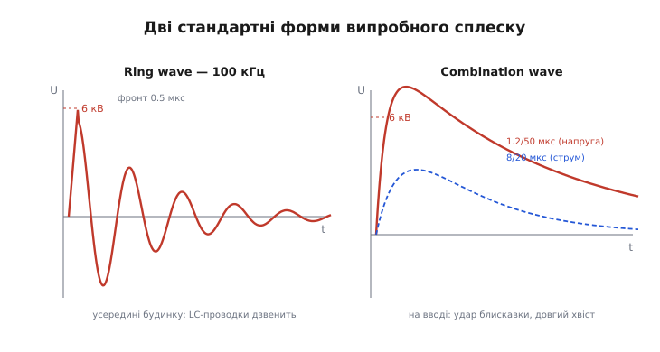
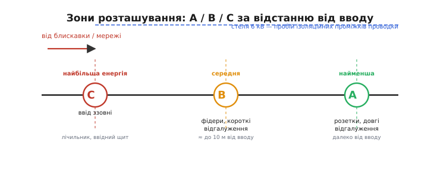

# 📜 Звідки взялися 6 кВ і 100 кГц: як виміряли невидимий сплеск

Захист від кидка починається з одного зухвалого питання: **під що саме його рахувати?** Бо сплеск, якого не видно ні оком, ні вольтметром, — це не те, під що легко проєктувати. Скажеш «хай тримає 1000 вольт» — а звідки 1000, чому не 500 і не 5000? Зробиш обмежувач заслабким — техніка згорить у полі; заміцним — переплатиш за деталь, що ніколи не спрацює на повну. Щоб «наперед» став інженерним числом, а не пальцем у небо, хтось мусив **спіймати реальні сплески в реальних розетках** і сказати світові: ось типова форма, ось типова енергія, рахуйте під це.

Ця історія — про те, як жменя інженерів за кілька десятиліть перетворила щось невидиме на два цілком конкретні профілі імпульсу, під які досі проєктують і випробовують кожен мережевий вхід. Тут немає легенд — лише виміри, суперечки й дуже впертий француз-американець, що півжиття ганявся за мікросекундними спалахами по будинках і лабораторіях.

## Проблема, якої ніхто не бачив

Спершу варто відчути, наскільки незручний був сам предмет. У п'ятдесяті-шістдесяті напівпровідники тільки-но приходили в техніку, і разом із ними прийшла нова вразливість. Стара лампова електроніка була груба: лампа спокійно терпіла сотні зайвих вольт, бо сама працювала на сотнях. А транзистор і діод — тонкі: пробивна напруга переходу — десятки вольт, і кидок, який лампі був незамітний, напівпровідник убивав. Техніка почала «саме згоряти» частіше, ніж мала б, і ніхто до пуття не розумів чому.

Причина була в тому, що **сплеск неможливо піймати буденним приладом**. Він живе мікросекунди й трапляється рідко й непередбачувано — то від блискавки за кілометр, то від сусіда, що вимкнув мотор. Щоб його записати, треба ловити швидкий одиничний імпульс саме тієї миті, коли він прилетить, — а осцилографів, здатних на це надійно, до середини сімдесятих майже не було в польових умовах. Показово, що більшість записів сплесків, які лягли в перший стандарт, зробили **до 1975 року**, коли електронних приладів для тривалого стеження за сплесками ще бракувало. Тобто перші дані добувалися майже вручну, важкою вимірювальною роботою — не з теорії, а з терпіння.

І тут з'являється головна дійова особа.

## Мартцлофф: людина, що ганялася за сплесками

**Франсуа Мартцлофф** (François D. Martzloff) — інженер-електронник, чиє ім'я стоїть за самою ідеєю стандартного кидка. Він майже три десятиліття, з кінця п'ятдесятих, пропрацював у **General Electric** — тодішньому центрі досліджень захисту від перенапруг, — а 1985 року перейшов до **NIST** (National Institute of Standards and Technology, американський національний інститут стандартів і технологій; до 1988-го — NBS, National Bureau of Standards). В обох місцях він робив одне: **вимірював, що насправді прилітає в низьковольтну мережу**, і перекладав ці виміри на мову стандарту. У комітеті IEEE він від кінця шістдесятих очолював робочу групу з перенапруг у мережах на 600 вольтів і менше — тобто саме тих побутових і промислових колах, де живе наша техніка.

> 🔧 **Навіщо це.** Варто затямити одну річ про всі ці числа: **вони не виведені з формули — вони виміряні**. Коли даташит варистора чи TVS обіцяє «витримує імпульс 8/20 мкс», за цим стоїть не фізичний закон, а домовленість, добута з реальних осцилограм у реальних розетках. Тому інженер, який розуміє походження цифр, не молиться на них як на святе, а питає: моя ситуація схожа на ту, з якої їх зняли, чи ні? Прилад на сонячній фермі під відкритим небом бачить зовсім не те, що коробочка в захищеній серверній, — і стандарт це прямо враховує зонами, до яких ми дійдемо.

Ключове в роботі Мартцлоффа — чесність перед даними. Він не раз публікував результати, які **суперечили** пропонованим стандартам: мовляв, ось прилади, що за папером мали б давно згоріти від закладених у нормі навантажень, а вони роками справно працюють у полі. Отже, норма перебирає — і її треба правити ближче до життя. Саме ця звичка звіряти папір із реальністю й зробила його виміри фундаментом, а не черговою кабінетною таблицею.

## Дві форми, бо кидок буває двох характерів

Тепер найцікавіше — як із купи розрізнених осцилограм народилися **типові форми**. Мартцлофф із колегами зробили сміливий крок: звели всю базу вимірів до **двох** представницьких сплесків. Не сотні кривих, а дві — але підібрані так, щоб між ними лягла більшість того, що трапляється насправді. І поділ на дві форми не випадковий: він відбиває **дві різні фізичні ситуації**, у яких сплеск себе поводить по-різному.

**Перша форма — «кільцева хвиля» (ring wave).** Коли сплеск влітає у проводку **всередині будівлі**, він потрапляє в коло, повне індуктивності (довгі дроти) і ємності (та сама проводка, конденсатори фільтрів). А індуктивність із ємністю разом — це коливальний контур. Тому різкий удар не проходить рівним горбком, а **розгойдує контур** і йде **загасальним дзвоном**: злітає, перестрибує нуль, вертається, і так кілька разів, дедалі слабше. Осцилограми показали, що цей дзвін у типовій побутовій проводці має частоту близько **100 кілогерців**, а сам фронт — дуже крутий, близько **0.5 мікросекунди**. Так народилася перша стандартна форма: різкий фронт 0.5 мкс і згасальні коливання на 100 кГц.

**Друга форма — «комбінований імпульс» (combination wave).** А на самому **вводі**, ближче до вулиці, картина інша: тут ще нема довгих внутрішніх дротів, що дзвенять, зате прилітає повновага енергія блискавки чи потужної комутації. Вона йде **однобоким** ударом — різко вгору, повільно вниз, без коливань, з довгим хвостом. Цю форму запозичили з класичної високовольтної випробувальної техніки, де такими імпульсами давно перевіряли ізоляцію. Про неї — окремо трохи далі, бо в ній захована красива подвійність напруги й струму.


*Дві форми відбивають два місця в мережі. Усередині будинку проводка — це LC-контур, тож удар іде загасальним дзвоном на 100 кГц із крутим фронтом 0.5 мкс (ліворуч). На вводі ззовні прилітає однобокий удар блискавки з довгим хвостом (праворуч): формою 1.2/50 мкс на розімкненому виході й 8/20 мкс струму на закороченому. Пік однаковий — 6 кВ, а характер різний, бо різне коло, у яке сплеск потрапляє.*

Тобто дві форми — це не бюрократична забаганка «щоб було більше тестів», а **два обличчя того самого явища**: усередині будинку сплеск дзвенить, бо коло коливальне; на вводі б'є навідмаш, бо коло ще «коротке» й повне енергії. Хто це розуміє, той не плутає, коли який тест доречний.

## Звідки взялися саме 6 кіловольтів

Тепер найважче й найкрасивіше питання цілої історії: чому стеля саме **6 кВ**? Чому не 3, не 10, не 20? Адже блискавка може навести в лінії й сотні кіловольтів — то чому побутову техніку рахують на скромні шість?

Відповідь чудова тим, що її дає **сама будівля**, а не примха комітету. Усередині будинку проводка має **ізоляційні проміжки** — відстані між провідниками в розетках, вимикачах, розподільних коробках, клемах. Кожен такий проміжок тримає напругу лише до певної межі: перевищив — і повітря між контактами **пробивається іскрою** (англ. *flashover* — перекриття). А для типових проміжків побутової проводки ця межа пробою лежить якраз десь коло **6 кіловольтів**.

І ось що з цього випливає — думка, заради якої варто було все це розповідати. **Проводка сама обмежує сплеск.** Хай у лінію прилетить хоч 20 кВ — щойно напруга в домашній проводці сягне ~6 кВ, найближчий ізоляційний проміжок **перекриється іскрою й зіллє надлишок**, не пустивши напругу вище. Будинок працює як власний грубий обмежувач: усе, що вище стелі пробою, зрізається перекриттям у першому-ліпшому проміжку. Тому **всередині** будівлі напруга сплеску практично не може перевищити цю стелю — і рахувати техніку на більше немає сенсу.

Мартцлофф підпер це число ще й з іншого боку — через саму блискавку. Прикинемо порядок величин на його ж логіці.

**Приклад (звідки 6 кВ від струму блискавки).** Коли розряд б'є в землю поблизу, частина струму розтікається системою заземлення й **піднімає потенціал усієї проводки будинку** над «далекою» землею. Наскільки — залежить від струму й опору заземлення.

```
Помірний струм у землю:        I ≈ 1.5 кА
Опір заземлення (типовий):     R ≈ 1.5 Ом
Підйом потенціалу проводки:    U = I · R = 1500 · 1.5 ≈ 2.2 кВ

Сильніший, але ще помірний:    I ≈ 4 кА
Підйом:                        U = 4000 · 1.5 ≈ 6 кВ  ← сходиться зі стелею пробою
```

Дві незалежні дороги — **пробій ізоляційних проміжків** зверху й **підйом потенціалу від струму блискавки** знизу — зійшлися на одному числі. Саме тому **6 кВ** стало опорним піком стандарту для того, що прилітає до техніки всередині будівлі: не тому, що хтось так захотів, а тому, що сама фізика будинку зводить два різні механізми до однієї межі.

> 🔧 **Навіщо це.** Звідси видно межу застосування цифри 6 кВ: вона про **всередині будинку**, де проводка сама рубить надлишок перекриттям. Винеси прилад **назовні** — на щоглу, на фасад, до вводу перед будь-якими проміжками — і ця стеля зникає: там сплеск може бути в рази вищий, і захист треба закладати грубіший. Тому, читаючи «6 кВ» у нормі, завжди питай: мій пристрій за цією стелею (у домі) чи перед нею (надворі)? Від відповіді залежить, чи вистачить типового варистора, чи потрібен серйозніший розрядник на вводі.

## Зони A, B, C: одна стеля напруги, різна енергія

Із цього визріла друга велика ідея стандарту — **поділ мережі на зони за близькістю до вводу**. Логіка знову ж фізична, а не канцелярська. Стеля напруги всередині будинку скрізь приблизно однакова (ті самі ~6 кВ, бо ті самі проміжки), **але енергія й струм сплеску залежать від того, як далеко точка від вводу**.

Чому струм спадає з відстанню? Бо кожен метр проводки додає послідовної індуктивності, а індуктивність опирається швидкій зміні струму (`U = L·dI/dt` — той самий закон, що й породжує кидки). Що далі від вводу, то більше дротів між сплеском і розеткою, то сильніше вони «пригальмовують» струм удару. Тому біля вводу сплеск лютий і потужний, а в дальній розетці — той самий пік напруги, але вже **кволіший струмом**. Це й дало три зони розташування (англ. *location categories*):

- **Зона C** — **ввід ззовні**: лічильник, ввідний щит, усе до перших внутрішніх проміжків. Тут найбільша енергія й найгрубші сплески — бо проводка ще не встигла нічого пригальмувати, а стеля пробою може й не діяти (проміжки ще попереду).
- **Зона B** — **фідери й короткі відгалуження** біля щита, приблизно **до 10 метрів** від вводу. Енергія вже помірна: частина шляху пройдена, індуктивність дротів трохи збила струм.
- **Зона A** — **розетки й довгі відгалуження**, далеко від вводу. Пік напруги той самий (стеля тримається), але струм найменший — довгі дроти його добряче пригальмували.


*Уздовж шляху від вводу (зона C) до дальньої розетки (зона A) стеля напруги тримається однаковою — близько 6 кВ, бо її задає пробій ізоляційних проміжків проводки. А от енергія й струм сплеску спадають: кожен метр дротів додає індуктивності, що пригальмовує удар. Тому ближче до вводу захист має ковтати більше енергії, а далі — ловити той самий пік напруги при слабшому струмі.*

Ось чому в самому стандарті ринг-хвилю приписали до «м'якших» зон **A та B** (усередині, де контур дзвенить), а важкий комбінований імпульс — до зон **B та C** (ближче до вводу, де прилітає повна енергія блискавки). Це прямий висновок з фізики: де сплеск дзвенить — там і випробовуй дзвоном; де б'є навідмаш — там і бий однобоким ударом.

> 🔧 **Навіщо це.** Зони — це готова підказка, **скільки енергії має ковтати твій захист**. Прилад стоятиме в дальній розетці (зона A)? Досить помірного TVS чи невеликого варистора — пік напруги той самий, але струм кволий. А от щось на ввідному щиті (зона C) мусить пережити повну енергію блискавкового імпульсу — там дрібний обмежувач просто випарується. Тому, обираючи варистор чи розрядник, першим ділом визнач зону: вона одразу відсіює замалі деталі й рятує від як недозахисту, так і безглуздого перезакладання.

## Від IEEE 587 до C62.41: як домовленість стала стандартом

Тепер — коли ці ідеї стали офіційними. Виміри й міркування Мартцлоффа лягли в документ, який **1980 року** вийшов як **IEEE Std 587-1980** — «Guide for Surge Voltages in Low-Voltage AC Power Circuits» (настанова щодо кидків напруги в низьковольтних мережах змінного струму). Це був перший загальновизнаний папір, що сказав інженерам світу: ось типові форми (ринг-хвиля 100 кГц і комбінований імпульс), ось опорний пік 6 кВ, ось зони A/B/C — рахуйте й випробовуйте під це.

Далі сталася звична для стандартів річ — **зміна імені без зміни суті**. Той самий документ переномерували в систему позначень IEEE C62 (родина стандартів на захист від перенапруг), тож **IEEE 587-1980** і **IEEE C62.41-1980** — це **одне й те саме**. А **1991 року** вийшла перероблена редакція **C62.41-1991**, що ввібрала свіжіші дані про мережеве середовище й досвід (зокрема й **невдалого**) застосування першої настанови. Згодом сімейство ще розгалузилося (характеристика середовища й методи випробувань роз'їхалися в окремі частини — C62.41.1 і C62.41.2), але корінь усюди той самий: осцилограми Мартцлоффа й висновки з них.

Варто звернути увагу на слово **Guide/Recommended Practice** — «настанова», «рекомендована практика», а не жорсткий обов'язковий припис. Це чесне визнання природи предмета: сплеск — явище статистичне, і стандарт не каже «буде рівно оце», а каже «ось розумна модель найгіршого правдоподібного випадку, будуйте під неї». Різниця тонка, але важлива: інженер лишається думати головою, а не сліпо підставляти цифру.

## Європейська дорога: IEC 61000-4-5 і подвійність напруги-струму

Поки Америка йшла шляхом IEEE, у Європі та світі загалом визрів свій, паралельний стандарт — **IEC 61000-4-5**, частина великого сімейства IEC 61000 з електромагнітної сумісності, присвячена саме **випробуванню стійкості до сплесків** (англ. *surge immunity test*). Він менше говорить про зони й географію мережі, зате дуже точно прописує **сам випробувальний генератор** — прилад, яким б'ють по пристрою в лабораторії.

І ось тут захована та сама красива подвійність, що я обіцяв. Генератор називають **комбінованим** (combination wave generator), і назва не випадкова: він видає **дві форми одразу, залежно від того, що до нього під'єднано**.

```
Вихід РОЗІМКНЕНО (напруга):   форма 1.2/50 мкс
   фронт 1.2 мкс до піка, спад до половини за 50 мкс

Вихід ЗАКОРОЧЕНО (струм):     форма 8/20 мкс
   фронт 8 мкс до піка, спад до половини за 20 мкс

Відношення пік напруги / пік струму = ефективний опір 2 Ом
```

Чому **одна коробка дає дві різні форми**? Бо реальне джерело сплеску — не ідеальне джерело напруги й не ідеальне джерело струму, а щось проміжне, зі своїм внутрішнім опором. Генератор моделює саме це. Ввімкни його «на порожнечу» (високоомне навантаження) — і він покаже свою **напругу** розімкненого кола, гарну форму 1.2/50. Замкни його накоротко — і потече його **струм** короткого замикання, форма 8/20. А реальний захисний елемент сидить **між** цими крайнощами: обмежувач спрацював, «просів» напругу й пропустив крізь себе струм, тож бачить водночас і напругу, наближену до зрізаної, і струм, наближений до короткого. Одна модель чесно накриває обидва режими.

Відношення двох піків дає **ефективний внутрішній опір 2 Ома** — і це саме та цифра, що зв'язує напругу й струм у пару. При опорному піку 6 кВ вона дає струм короткого 3 кА (`6000 / 2 = 3000`), і саме «6 кВ / 3 кА» ви часто побачите в даташитах як мірку суворості випробування.

Самі форми **1.2/50 і 8/20 мкс не вигадали для мережі** — їх запозичили з класичної високовольтної випробувальної техніки, зі стандарту **IEC 60060-1** (High-Voltage Test Techniques), де такими імпульсами десятиліттями били ізоляцію трансформаторів і ліній, імітуючи блискавку. Тобто європейський генератор узяв давно перевірену «блискавкову» форму й приклав її до низьковольтної техніки — розумне рішення не винаходити велосипед.

А замість зон A/B/C європейський стандарт дає **рівні (класи) випробування** — сходинку суворості під різні умови встановлення:

```
Рівень   Пік напруги   Типова ситуація
──────────────────────────────────────────────────
  1        0.5 кВ       захищене середовище, короткі лінії
  2        1   кВ       помірне, часткова фільтрація
  3        2   кВ       мережа з деякими кидками
  4        4   кВ       відкриті лінії, серйозна гроза
```

Логіка сходинки — точно та сама, що в американських зон: **що «брудніший» і відкритіший край мережі, то вищий випробний рівень**. Рівень 1 — для добре захищеного, короткого кола (аналог дальніх, спокійних точок); рівень 4 — для обладнання на відкритих довгих лініях під грозою (аналог вводу). Дві школи, американська й європейська, різними словами кажуть одну думку: суворість тесту має відповідати тому, де прилад реально стоїть.

> 🔧 **Навіщо це.** Практична вигода — знати, що **8/20 у струмі й 1.2/50 у напрузі — це один імпульс, а не два різні тести**. Коли даташит варистора обіцяє «пікова енергія за 8/20 мкс», а TVS — «клемп-напруга під 1.2/50», вони говорять про **різні кінці того самого удару**: варистор хвалиться, скільки струму (енергії) проковтне, TVS — до якого рівня зріже напругу. Розуміючи подвійність, ти правильно читаєш обидва параметри й не шукаєш неіснуючої суперечності між «мкс тут» і «мкс там».

## Що з усього цього лишилося в кожному даташиті

Зведімо нитки. Кидок — явище невидиме й статистичне, тож першим ділом його треба було **виміряти й типізувати**, і зробив це насамперед Франсуа Мартцлофф, спершу в General Electric, потім у NIST, ганяючись за мікросекундними спалахами по реальних мережах ще тоді, коли й приладів для цього до пуття не було. З купи осцилограм він із колегами звів усе до **двох форм**, бо кидок має два обличчя: усередині будинку проводка — LC-контур, тож удар іде загасальним **дзвоном 100 кГц** (ring wave); на вводі прилітає однобокий **удар блискавки** (combination wave). Опорний пік **6 кВ** дала сама будівля: вище неї ізоляційні проміжки проводки перекриваються іскрою й зрізають надлишок, а незалежно та сама межа виходить із підйому потенціалу від помірного струму блискавки. Оскільки стеля напруги всюди однакова, а енергія спадає з відстанню від вводу, мережу поділили на **зони A/B/C** — далека розетка, коротке відгалуження, ввід.

Усе це закріпив **IEEE 587-1980** (він же **C62.41-1980**, перероблений у **C62.41-1991**). Європа пішла паралельно з **IEC 61000-4-5**, який прописав **комбінований генератор**: одна коробка дає **1.2/50 мкс напруги** розімкнено й **8/20 мкс струму** закорочено, з ефективним опором **2 Ома** (звідси пара «6 кВ / 3 кА»), а самі форми успадкував від давньої високовольтної техніки IEC 60060-1. Зонам A/B/C там відповідають **рівні 0.5 / 1 / 2 / 4 кВ**.

Тому наступного разу, побачивши в даташиті варистора чи TVS рядок «8/20 µs», «6 kV / 3 kA» або «C62.41 Category B», варто почути за цими значками цілу історію: терплячі виміри невидимого сплеску, будинок, що сам рубить надлишок іскрою в розетці, і дві інженерні школи, які різними словами домовилися про те, під що рахувати захист. Ці числа не впали з неба формулою — їх **виміряли, звірили з реальністю й записали**, щоб кожен наступний інженер міг ставити обмежувач наперед, а не після першої спаленої плати.
