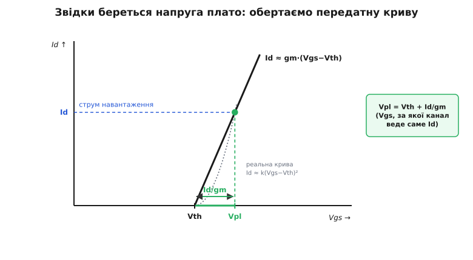
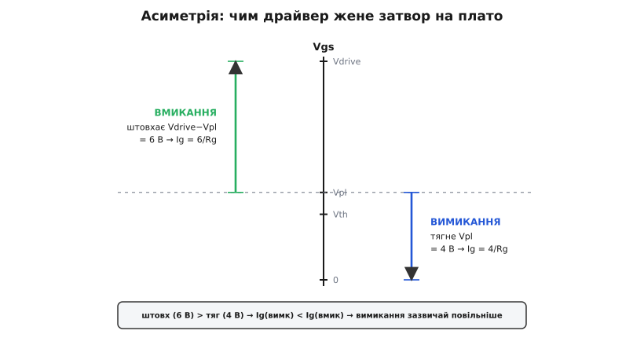

# 🧮 Час перемикання по фазах заряду затвора

> Образ простий: затвор MOSFET — це один конденсатор, який заряджають крізь один резистор. Здавалося б, і час один: τ = R·C, та й по всьому. Але «конденсатор» тут між фазами **міняє свою натуру** — то це вхідна ємність, яку драйвер напряму піднімає, то це Міллерів місток, крізь який тече ввесь струм, поки затвор стоїть на місці. Тому час перемикання — не одне число, а чотири різні: у кожної фази своя формула. Тут ми виведемо всі чотири з першого рівняння вузла, побачимо, чому наростання струму треба рахувати логарифмом, а перекидання напруги — простим діленням, і чому вимикання — не дзеркальна копія вмикання.

## Затвор як RC-ланка: одне рівняння на всі фази

Почнімо з чесної схеми. Драйвер тримає на своєму виході напругу керування V_drive (при вмиканні) або нуль V_off (при вимиканні) і сполучений із затвором крізь сумарний опір Rg — це і власний вихідний опір драйвера, і зовнішній резистор, і внутрішній опір полікремнієвого затвора. Сам затвор має дві ємності: Cgs — на витік, і Cgd — на стік (та сама Міллерова). Запишімо баланс струмів у вузлі затвора:

```
ig = (V_drive − Vgs) / Rg                     ← скільки жене драйвер
ig = Cgs · dVgs/dt  +  Cgd · d(Vgs − Vds)/dt   ← куди воно тече
```

Друге рядок — уся суть. Струм у затвор розтікається у дві ємності, і ось тут ховається розгадка чотирьох фаз: **залежно від того, що саме зараз рухається — Vgs чи Vds — цей вузол поводиться як дві геть різні схеми.**

**Коли стік стоїть, а рухається затвор** (dVds/dt ≈ 0). Тоді член із Cgd спрощується до Cgd·dVgs/dt, і обидві ємності просто складаються у **вхідну ємність** Ciss = Cgs + Cgd. Рівняння стає звичайною RC-зарядкою:

```
Rg · Ciss · dVgs/dt + Vgs = V_drive
```

Це найпростіше [диференціальне рівняння першого порядку](topic:math/exponential-ode), і його розв'язок — наростання по експоненті з постійною часу τ = Rg·Ciss:

```
Vgs(t) = V_drive · (1 − e^(−t/τ)),   τ = Rg · Ciss
```

**Коли затвор стоїть, а валиться стік** (dVgs/dt ≈ 0). Тоді член із Cgs зникає зовсім (нерухома напруга — нуль струму в ємність), і лишається:

```
ig = −Cgd · dVds/dt      →      увесь струм драйвера тече крізь Cgd
```

Один і той самий вузол — і два зовсім різні закони. У перших двох фазах працює перша картина (заряджається Ciss), у третій — друга (весь струм у Cgd). Звідси й різні формули часу. Лишилося зрозуміти, де межа між картинами — а вона стоїть рівно на напрузі плато.

## Чому плато стоїть на Vpl = Vth + Id/gm


*Звідки береться висота плато. У насиченні струм стоку залежить від напруги затвора майже лінійно: Id ≈ gm·(Vgs − Vth) — пряма, що виходить із порога Vth з нахилом [gm](topic:electronics/transconductance). Навантаження фіксує струм Id, тож питання обертається: за якої Vgs канал веде саме цей струм? Обертаємо пряму на рівні Id — і горизонтальний катет трикутника дає Vpl − Vth = Id/gm. Блідим — реальна квадратична крива, для якої лінійна пряма є наближенням.*

Поки [канал відкривається](topic:electronics/mosfet-switch), транзистор сидить у режимі насичення (активному), де струм стоку майже не залежить від напруги на стоці, зате круто залежить від напруги на затворі. Наблизьмо цю залежність прямою — лінеаризуймо її навколо робочої точки:

```
Id ≈ gm · (Vgs − Vth)
```

Тут gm — крутість (transconductance): наскільки ампер додається на кожен вольт понад поріг. А тепер головний фокус. Під час перекидання напруги струм крізь ключ **заданий ззовні** — його тримає навантаження (в індуктивному навантаженні за це відповідає сама котушка, що не дає струмові стрибати). Отже, Id — фіксований. Обернімо рівняння: якщо струм мусить бути саме Id, то напрузі на затворі нікуди дітися — вона мусить бути рівно тією, що дає цей струм:

```
Vpl = Vth + Id / gm
```

Ось і вся висота плато. Це не «десь застрягло» — це єдина Vgs, за якої канал веде саме заданий струм, ні більше ні менше. Спробувала б Vgs піднятися вище — канал захотів би вести більше струму, ніж дає навантаження; але зайвому струмові взятися нізвідки, тож замість нього починає падати напруга на стоці. А стік, що валиться, крізь Cgd висмоктує ввесь струм драйвера ([ефект Міллера](topic:electronics/miller-effect)) — і не дає Vgs зрушити. Виходить негативний зворотний зв'язок, що сам себе тримає: Vgs пришпилена до Vpl рівно доти, доки стік не докінчить падати. Це й є плато.

Звідси одразу видно, чому плато **вище** за важчого навантаження: більший Id вимагає ширше відкритого каналу, тобто вищої Vgs. І чому воно рівно **пласке**: поки Id незмінний (котушка тримає), Vpl теж незмінна; якби струм навантаження плив під час переходу, плато мало б нахил.

> 🔧 **Навіщо це.** Vpl можна не вгадувати, а зчитати з осцилографа: висота полиці на затворі — це Vth + Id/gm при вашому струмі. Знаючи Vpl, ви одразу знаєте рушійну напругу драйвера на плато (V_drive − Vpl) — а це, як побачимо, і є те, що задає швидкість. Помітили, що плато поповзло вгору? Виріс струм навантаження.

**Де лінійна модель ламається.** Насправді передатна крива в насиченні ближча не до прямої, а до параболи: Id ≈ k·(Vgs − Vth)². Тоді паспортна крутість gfs = dId/dVgs = 2k·(Vgs − Vth) — це **дотична**, місцевий нахил у робочій точці, а формула Vpl = Vth + Id/gm неявно бере **січну** з порога (нахил k·(Vpl − Vth)), удвічі меншу. Тому, підставляючи паспортний gfs, тримайте на думці: **структура** точна (плато росте зі струмом, пришпилене фіксованим Id), а **число** Vpl — це оцінка з точністю до кількох десятих вольта, не істина в останній інстанції. Для інженерної прикидки часу цього більш ніж досить.

## Фаза 1 — затримка t_d

Драйвер щойно підняв вихід до V_drive. Струму в каналі ще немає (Vgs нижча за поріг), напруга на стоці стоїть повна — тож стік нерухомий, і працює перша картина: заряджається Ciss. Затримка триває, поки Vgs дорощує від нуля до порога Vth. Беремо експоненту й розв'язуємо відносно часу:

```
Vth = V_drive · (1 − e^(−t_d/τ))
t_d = τ · ln( V_drive / (V_drive − Vth) )
```

Це «мертвий» час: заряд уже ллється, а на стоці ще нічого не діється. Він тим коротший, чим ближче V_drive до порога притиснута… ні, навпаки — чим **вища** V_drive над порогом, то стрімкіший старт експоненти й то швидше вона проскакує Vth. Ось чому сильніший драйвер скорочує навіть цю холосту паузу.

## Фаза 2 — наростання струму t_ri (струм затвора тут змінний)

Vgs перетнула поріг, канал прочинився, струм стоку рушив угору: Id = gm·(Vgs − Vth). Напруга на стоці ще тримається повна (доти, доки струм у ключі не дожене повний струм навантаження, стік лишається притиснутий згори) — отже, стік досі нерухомий, і знову працює перша картина, заряджається Ciss. Фаза триває, поки Vgs долізе від Vth до плато Vpl. Час — різниця двох моментів однієї експоненти:

```
t_ri = τ · ln( (V_drive − Vth) / (V_drive − Vpl) )
```

Ось **найважливіша тонкість усієї викладки**. Здавалося б, час фази можна знайти так само просто, як для плато: узяти заряд ділянки й поділити на струм затвора. Але на цій ділянці **струм затвора не сталий**. Він дорівнює ig = (V_drive − Vgs)/Rg, а Vgs тут якраз повзе від Vth до Vpl — тобто напруга на резисторі Rg меншає, і струм разом із нею. Ділити заряд на «той самий» струм не можна: струму, який був би сталим, тут немає. Саме тому чесна формула — логарифм, він і є акуратним підсумовуванням змінного струму по всій ділянці.

Якщо все ж хочеться прикинути через заряд — беріть **середній** струм затвора. За малий проміжок Vth…Vpl напруга на Rg майже лінійна, тож:

```
ig(сер) ≈ ( V_drive − (Vth + Vpl)/2 ) / Rg
t_ri    ≈ Q_gs2 / ig(сер)      (Q_gs2 — заряд від Vth до Vpl)
```

Це наближення сходиться з логарифмом до першого порядку — але воно **наближення**, і саме тому плато й наростання струму рахуються по-різному: там струм пришпилений і ділення точне, тут струм пливе й точний тільки логарифм.

## Фаза 3 — перекидання напруги t_fv (струм затвора сталий)

Vgs дійшла до Vpl і **завмерла**. Тепер працює друга картина: dVgs/dt = 0, член Cgs випав, увесь струм драйвера тече крізь Cgd. І оскільки Vgs стоїть, напруга на резисторі Rg теж стала — а отже, і струм затвора сталий:

```
Ig = (V_drive − Vpl) / Rg        ← ось тут струм НАРЕШТІ сталий
```

Саме тому цю фазу можна рахувати простим діленням: сталий струм за час t_fv переносить увесь Міллерів заряд Qgd (заряд, що йде на перекидання напруги стоку — [чому саме заряд, а не ємність, розібрано окремо](topic:electronics/gate-capacitance/math-gate-charge.md)):

```
t_fv = Qgd / Ig = Qgd · Rg / (V_drive − Vpl)
```

А швидкість, з якою валиться сам стік, — це той самий струм, поділений на ємність, крізь яку він тече:

```
dVds/dt = −Ig / Cgd = −(V_drive − Vpl) / (Rg · Cgd)
```

Знак мінус — бо напруга спадає; за модулем це і є горезвісне dV/dt, яким лякають розробники силової електроніки. Хочете швидше перекинути напругу — женіть більший Ig (менший Rg або дужчий драйвер); але той самий більший Ig роздмухує dV/dt, а різкий стрибок стоку крізь Cgd може перекинутися назад на затвор сусіднього ключа й ненароком його прочинити — [паразитне вмикання](topic:electronics/snubbers-dvdt). Тому Rg свідомо тримають на розумній середині.

## Фаза 4 — догвинчування

Плато скінчилося, стік уже внизу (Vds ≈ Id·Rds(on), знову майже нерухомий), і Vgs востаннє рушає вгору — від Vpl до повної V_drive. Знову перша картина, знову RC:

```
Vgs(t) = V_drive − (V_drive − Vpl) · e^(−t/τ)
```

Переходу тут, власне, вже немає: напруга й струм на ключі не міняються, тож **втрат перемикання ця фаза не дає**. Її користь інша — що вища Vgs понад плато, то глибше відкритий канал і то менший [опір Rds(on)](topic:electronics/rds-on) у ввімкненому стані. Тому паспортну криву заряду знімають аж до робочої напруги керування: догвинчування добиває ключ у стан твердого ввімкнення з найменшим опором.

## Вимикання — не дзеркало: асиметрія


*Чому вимикання зазвичай повільніше. Плато стоїть на тій самій висоті Vpl в обидва боки. Але на вмиканні драйвер штовхає затвор угору «залишком» напруги над плато, V_drive − Vpl, а на вимиканні тягне вниз усім Vpl (до нуля). Довжина стрілки — це напруга на Rg, тобто струм затвора на плато. При типовій V_drive ≈ 10…12 В штовх довший за тяг — струм на вимикання менший, а перекидання напруги довше.*

Спокуса думати, що вимикання — просто те саме навпаки. За формою заряду — так, дзеркально. Але за **швидкістю** — ні, і причина в одному числі. На вимиканні драйвер садить вихід на V_off (зазвичай нуль), і затвор розряджається крізь Rg до цього рівня. Плато стоїть на тій самій висоті Vpl = Vth + Id/gm (струм навантаження ж той самий). Але рушійна напруга на резисторі тепер інша: не «залишок» над плато, а весь Vpl донизу:

```
вмикання:  Ig = (V_drive − Vpl) / Rg          рушій — залишок над плато
вимикання: Ig = (Vpl − V_off) / Rg = Vpl/Rg   рушій — сам Vpl (до нуля)
```

Ось і вся асиметрія. Порівняймо часи перекидання напруги (Qgd той самий):

```
t_fv(вимк) / t_fv(вмик) = (V_drive − Vpl) / (Vpl − V_off)
```

Драйвер завжди беруть із запасом над плато — щоб канал відкрився повністю й Rds(on) сів у мінімум, — тож V_drive − Vpl виходить більший за Vpl. А більший рушій означає більший струм і коротший час. Тому **вимикання зазвичай повільніше за вмикання** тим самим драйвером і тим самим Rg: тяг до нуля слабший за штовх від плато. А повільне вимикання — це не просто «довше»: у напівмості ключ, що кволо закривається, ризикує ще вести струм, коли другий уже відкривається — наскрізний струм.

Звідси два стандартні прийоми. Перший — **розділити резистори**: менший Rg на вимикання, більший на вмикання (часто через діод в обхід), щоб зрівняти або й перевернути швидкості. Другий, для швидких приладів, — тягнути затвор не в нуль, а в **мінус**: узяти V_off < 0, тоді рушій вимикання стає Vpl − V_off = Vpl + |V_off| і знов доганяє вмикання. Саме тому [керування затвором карбід-кремнієвих і нітрид-галієвих ключів](topic:electronics/sic-gan-gate-drive) майже завжди має від'ємну шину вимикання: у них плато низьке, dV/dt шалене, і надійно тримати ключ закритим інакше не вийде.

## Числовий приклад — усі фази

Візьмімо той самий ключ: Qgs = 8 нКл, Qgd = 15 нКл, повний Qg = 30 нКл (при Vgs = 10 В), Vth = 3 В, gm = 10 См. Додамо два паспортні числа, потрібні для RC-фаз: вхідну ємність Ciss = 1.5 нФ і напругу шини стоку Vdd = 400 В. Комутуємо Id = 10 А драйвером V_drive = 10 В крізь Rg = 3 Ом, вимикаємо в нуль (V_off = 0).

```
τ    = Rg · Ciss          = 3 · 1.5 нФ            = 4.5 нс
Vpl  = Vth + Id/gm        = 3 + 10/10             = 4 В
```

**Вмикання, фаза за фазою:**

```
t_d  = τ · ln(V_drive/(V_drive−Vth))  = 4.5 · ln(10/7)  = 4.5 · 0.357 = 1.6 нс
t_ri = τ · ln((V_drive−Vth)/(V_drive−Vpl)) = 4.5 · ln(7/6) = 4.5 · 0.154 = 0.69 нс
Ig   = (V_drive − Vpl)/Rg = 6/3                   = 2 А
t_fv = Qgd / Ig           = 15 нКл / 2 А          = 7.5 нс     ← головна фаза
```

Швидкість падіння стоку на плато. Ефективна Cgd ≈ Qgd/Vdd = 15 нКл / 400 В = 37.5 пФ, тож:

```
dVds/dt = Ig / Cgd = 2 А / 37.5 пФ = 53 В/нс   (400 В за ~7.5 нс)
```

**Вимикання — той самий Rg, той самий Vpl, але слабший рушій:**

```
Ig(вимк)  = Vpl / Rg      = 4/3                   = 1.33 А
t_fv(вимк) = Qgd / Ig     = 15 нКл / 1.33 А       = 11.3 нс    (у 1.5 раза довше!)
```

Оцініть співвідношення: тепле вікно втрат при вмиканні — це t_ri + t_fv ≈ 0.69 + 7.5 = 8.2 нс, при вимиканні перекидання напруги саме тягне вже 11.3 нс. Ключ і драйвер ті самі — а вимикання виразно повільніше, рівно як і передбачила асиметрія (V_drive − Vpl)/Vpl = 6/4 = 1.5. Хочете зрівняти — поставте на вимикання Rg = 2 Ом (тоді Ig = 4/2 = 2 А і t_fv(вимк) = 7.5 нс), і обидва боки підуть однаково швидко.

## Де ці формули працюють

Уся ця бухгалтерія фаз збирається в кілька практичних чисел. **Вибір [драйвера затвора](topic:electronics/gate-driver):** щоб перекинути напругу за бажаний t_fv, драйвер мусить видати пік Ig = Qgd/t_fv в обидва боки — і саме цей пік, а не «потужність», вирішує. **[Втрати перемикання](topic:electronics/switching-losses):** тепло виникає там, де напруга й струм перекриваються, тобто у фазах t_ri і t_fv; енергія одного переходу ≈ ½·Vdd·Id·(t_ri + t_fv), і кожна вкорочена наносекунда цих двох фаз — це менше ват. **[Мертвий час](topic:electronics/dead-time) у напівмості:** оскільки вимикання повільніше, пауза між закриттям одного ключа й відкриттям другого мусить перекривати саме довший, вимиканнєвий час — інакше наскрізний струм. І нарешті, всі чотири формули разом кажуть, куди тиснути, щоб ключ був швидким і холодним: малий Qgd, малий Rg, сильний драйвер із запасом рушійної напруги над плато в обидва боки — а для найшвидших приладів ще й від'ємна шина на вимикання, щоб тяг до нуля не програвав штовху від плато.
