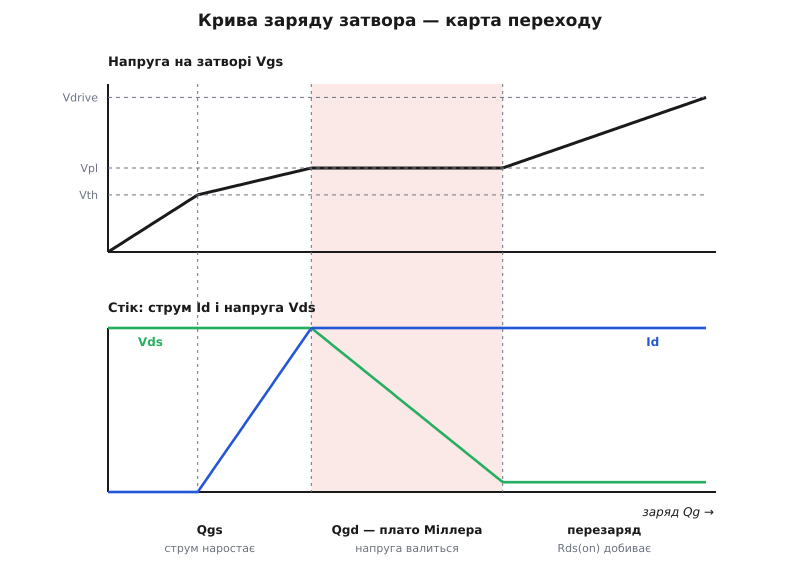
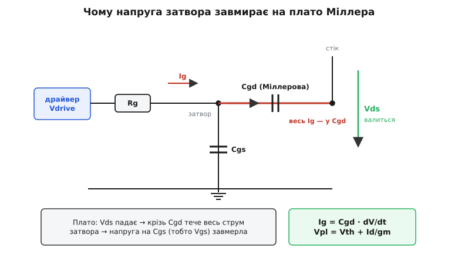
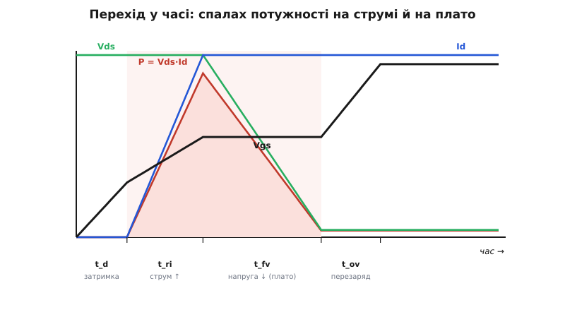

# Заряд затвора MOSFET і час перемикання

<preknowlist>
- [Ємність затвора](book:electronics/gate-capacitance) — затвор MOSFET як конденсатор і повний заряд Qg: щоб увімкнути ключ, у затвор треба «влити» певний заряд, а щоб вимкнути — забрати його назад.
- [MOSFET як ключ](book:electronics/mosfet-switch) — поріг Vth, за яким канал відкривається, і опір відкритого каналу Rds(on).
- [Крутість gm](book:electronics/transconductance) — як напруга на затворі керує струмом стоку: Id ≈ gm·(Vgs − Vth).
</preknowlist>

У паспорті будь-якого силового MOSFET є дивна крива: напруга на затворі Vgs відкладена не від часу й не від напруги живлення, а **від заряду затвора** Qg *(gate charge)*. Новачок дивиться на неї й знизує плечима — ну росте напруга з зарядом, ну має посередині рівну «полицю», і що з того? А насправді це найкорисніша сторінка паспорта для того, хто робить швидкий ключ. Бо ця крива — не графік «скільки вольтів від скількох кулонів». Це **карта самого перемикання**: кожна порція заряду, яку ти вливаєш у затвор, відповідає окремій, цілком конкретній події на стоці. Прочитаєш карту — і зможеш передбачити (а тоді й керувати) тим, як ключ вмикається: скільки це триває, де саме він гріється й скільки струму треба драйверу, щоб пройти небезпечну мить якнайшвидше.

Розберімо цю карту ділянка за ділянкою — і побачимо, як із неї прямо випадає час перемикання.

## Звідки береться крива — і чому вісь у кулонах

Криву знімають простим дослідом. У затвор женуть **сталий струм** — не напругу, а саме незмінний струм — і дивляться, як росте Vgs. І тут ховається фокус: при сталому струмі заряд і час — це те саме, бо Q = I·t. Тобто горизонтальна вісь «заряд» — це просто вісь «час», перемаркована іншими одиницями: форма Vgs(Q) точно повторює форму Vgs(t). Ось чому крива заряду розказує про час перемикання — вона **і є** перемикання, лише розтягнуте по осі заряду замість осі часу.

І форма ця геть не проста лінія. Vgs спершу росте, тоді **завмирає** на рівній полиці, тоді росте знову. Три ділянки — і кожна з них є окрема фаза переходу. Розгляньмо їх по черзі, стежачи заразом за тим, що коїться на стоці: за напругою Vds і струмом Id.

## Три ділянки заряду — три фази переходу


*Крива заряду — карта переходу. На ділянці Qgs напруга затвора доростає до плато, і струм стоку наростає до повного. На плато Міллера (Qgd) напруга затвора завмерла, а напруга стоку валиться з повної до нуля — це головна, найдорожча фаза. Далі перезаряд добиває Rds(on) до мінімуму. Кожна порція заряду — окрема подія на стоці.*

**Перша ділянка — Qgs.** Заряд ллється в затвор, Vgs повзе вгору від нуля. Спершу — нічого. Поки Vgs не дійшла до порога Vth, канал закритий: струму немає, уся напруга шини стоїть на ключі. Це «мертвий» час затримки — заряд уже витрачається, а на стоці тиша. Щойно Vgs перетинає Vth, канал прочиняється, і струм стоку Id починає **наростати**: адже Id ≈ gm·(Vgs − Vth), тож що вища напруга на затворі, то ширше відкритий канал і то більший струм. Id росте від нуля до повного струму навантаження — а напруга Vds усе ще майже повна. Отже, на ділянці Qgs **комутується струм**: навантаженнєвий струм переходить у ключ.

**Друга ділянка — Qgd, плато Міллера** *(Miller plateau)*. Ось та сама рівна полиця. Заряд і далі вливається тим самим струмом, а Vgs — стоїть на місці, ніби застрягла. І саме в цей час напруга на стоці Vds **валиться** з повної до майже нуля. Тобто поки Vgs завмерла, ключ робить головну роботу — перекидає напругу. Тут **комутується напруга**. Ця ділянка — найдовша й найдорожча: саме на ній напруга й струм найдовше перекриваються, а отже, тут ключ найгарячіший. Чому Vgs завмирає й на якій висоті — за мить.

**Третя ділянка — перезаряд.** Плато скінчилося, Vds уже внизу, і Vgs знову рушає вгору — доганяє повну напругу керування (скажімо, 10 В). Робота тут дрібна, але корисна: що вища Vgs понад плато, то глибше відкритий канал і то менший [опір Rds(on)](book:electronics/rds-on). Ця ділянка «добиває» ключ у стан твердого ввімкнення з найменшим опором. Струм і напруга вже не міняються — переходу тут, власне, немає, лише догвинчування.

Вимикання — те саме дзеркально, у зворотному порядку: спорожнюємо затвор, Vgs падає до плато, напруга на стоці злітає назад (знову плато), тоді струм обривається (Qgs), і нарешті Vgs сідає нижче порога. Заряд той самий — його лише забирають, а не додають.

## Чому плато пласке — і на якій воно висоті


*Чому напруга затвора стоїть на плато. Ємність затвор–стік Cgd з'єднує затвор з падаючою напругою стоку. Поки Vds валиться, увесь струм драйвера йде на прогодовування Cgd, а не на підняття напруги на Cgs — тому Vgs завмирає рівно на тій напрузі, якої досить для повного струму: Vpl = Vth + Id/gm.*

Найзагадковіше на карті — чому посеред заряджання Vgs завмирає, хоча струм у затвор ллється незмінно. Винна крихітна ємність **затвор–стік**, Cgd, — та сама, що дає [ефект Міллера](book:electronics/miller-effect). Ось механізм. На плато напруга на стоці стрімко падає. Це падіння крізь Cgd «висмоктує» заряд з боку затвора — і весь струм, що його жене драйвер, іде не на підняття Vgs, а на прогодовування Cgd, поки та встигає за обвалом Vds. Виходить зворотний зв'язок, що сам себе тримає: Vgs хоче піднятися → канал відкривається більше → Vds падає швидше → падіння крізь Cgd відбирає ввесь струм затвора → Vgs не піднімається. Затвор ніби «прибитий» до однієї напруги, доки стік не закінчить падати.

І прибитий він не абиде, а рівно на тій напрузі, якої досить, щоб канал вів увесь струм навантаження. Це і є **напруга плато**:

```
Vpl = Vth + Id / gm
```

Звідси одразу видно дві речі. По-перше, більший струм навантаження Id піднімає плато вище — бо каналу треба ширше відкритися, а отже, потрібна вища Vgs. По-друге, довжина плато (заряд Qgd) залежить від того, на **скільки вольтів** мусить упасти стік: висока шина живлення — довше плато, більше «дорогого» заряду. Тому Qgd у паспорті часто наводять прив'язано до конкретної напруги стоку.

> 🔧 **Навіщо це.** Плато видно на осцилографі, якщо причепитися щупом до затвора: рівна полиця посеред наростання Vgs — це і є момент, коли ключ перекидає напругу. Її висота підказує струм (Vpl = Vth + Id/gm), а її довжина в часі — наскільки кволо драйвер жене заряд Qgd. Якщо перемикання «мляве» й ключ гріється незрозуміло чому, дивись саме на плато: майже завжди воно й розтягнуте.

## Час перемикання = заряд, поділений на струм

Тепер — те, заради чого все й затівалося. Оскільки заряд = струм × час, то **час кожної фази = її заряд, поділений на струм у затворі**:

```
затримка            t_d  ≈ Q(до порога) / Ig
наростання струму   t_ri ≈ (частина Qgs понад поріг) / Ig
перекидання напруги t_fv ≈ Qgd / Ig      ← головна, «робоча» фаза
```

Найважливіша з них — **t_fv**, перекидання напруги: саме на ній стоїть плато, саме там напруга й струм найдовше перекриваються, і саме вона вирішує, «швидкий» ключ чи ні. Зручно, що на плато Vgs стоїть незмінно на Vpl, тож струм від резисторного драйвера тут теж сталий і легко рахується:

```
Ig(на плато) = (Vdrive − Vpl) / Rg
t_fv ≈ Qgd / Ig = Qgd · Rg / (Vdrive − Vpl)
```

А швидкість падіння напруги на стоці — це прямо `dV/dt = Ig / Cgd`. Ось і весь ключ до керування: хочеш швидше перекинути напругу — жени більший струм у затвор (менший Rg або сильніший драйвер).

**Порахуймо реальний ключ.** Візьмімо MOSFET із паспортними Qgs = 8 нКл, Qgd = 15 нКл, повним Qg = 30 нКл (при Vgs = 10 В), порогом Vth = 3 В і крутістю gm = 10 См. Комутуємо струм Id = 10 А від драйвера з Vdrive = 10 В крізь сумарний опір у колі затвора Rg = 3 Ом.

```
Vpl  = Vth + Id/gm       = 3 + 10/10          = 4 В
Ig   = (Vdrive − Vpl)/Rg = (10 − 4)/3         = 2 А
t_fv = Qgd / Ig          = 15 нКл / 2 А       = 7.5 нс   ← перекидання напруги
```

Сім із половиною наносекунд на головну фазу — це швидкий, «холодний» перехід. А тепер під'єднаймо той самий затвор до ніжки мікроконтролера, що дає ледь 4 мА:

```
t_fv = Qgd / Ig = 15 нКл / 4 мА = 3.75 мкс   (у 500 разів довше!)
```

Та сама крива заряду, той самий Qgd — а перехід у 500 разів повільніший, бо в 500 разів менший струм у затвор. І всі ці 3.75 мкс ключ стирчить у напіввідкритому пеклі, де на ньому водночас і напруга, і струм. Ось чому для швидких MOSFET ніжки МК не досить: не тому, що вона «слабка» взагалі, а тому, що не дає струму перекинути Qgd за наносекунди.


*Той самий перехід, але по осі часу. Затвор проходить чотири фази — затримка, наростання струму, перекидання напруги (плато), перезаряд. Спалах потужності P = Vds·Id виникає там, де напруга й струм перекриваються — на наростанні струму й на плато. Що коротші ці дві фази, то вужчий спалах і менше тепла.*

Точні формули всіх чотирьох фаз (і чому наростання струму рахується інакше, ніж плато) винесено окремо — у [математичну викладку про час перемикання по фазах](book:electronics/mosfet-gate-charge/math-switching-phases.md).

## Навіщо читати цю карту: вибір драйвера

Уся ця бухгалтерія заряду має одну практичну мету — **підібрати керування затвором**. Логіка пряма: щоб перекинути напругу за бажаний час t_fv, драйвер мусить віддати заряд Qgd за цей час, тобто дати струм Ig = Qgd / t_fv. Хочеш 10 нс на прикладі вище — треба 1.5 А у затвор; хочеш 5 нс — уже 3 А. Обираєш [драйвер затвора](book:electronics/gate-driver), здатний на такий пік струму в обидва боки (заряджати й розряджати), і резистор Rg під нього. Кволий МК тут ні до чого — потрібен спеціальний каскад, що жене ампери короткими імпульсами.

І одразу застереження: **швидше — не завжди краще**. Великий струм у затвор означає різкий обвал напруги на стоці (велике dV/dt) і різкий стрибок струму. Це, по-перше, електромагнітні завади, які потім треба глушити й екранувати. По-друге, той самий різкий стрибок Vds крізь Cgd може перекинутися назад на затвор і ненароком **прочинити** вже закритий ключ — [паразитне вмикання](book:electronics/snubbers-dvdt), пряма дорога до наскрізного струму в напівмості. Тому резистором Rg швидкість свідомо **притримують**: більший Rg — повільніше, м'якше, тихіше в ефірі, але гарячіше; менший Rg — швидше й холодніше, але «брудніше» й небезпечніше стрибками. Інженер шукає середину, і карта заряду дає йому цифри для цього пошуку.

Практичний калькулятор — підібрати Rg під бажаний час і перевірити, чи витягне драйвер потрібний пік струму, — зібрано у [вставці-проєкті](book:electronics/mosfet-gate-charge/proj-driver-sizing.md).

> 🔧 **Навіщо це.** Дивлячись паспорт MOSFET для швидкого перетворювача, не хапайся за повний Qg — швидкість і [втрати перемикання](book:electronics/switching-losses) визначає саме **Qgd**, заряд плато. Два прилади з однаковим повним Qg, але різним Qgd поводяться зовсім по-різному: менший Qgd — коротше плато, швидший перехід, менше тепла. А повний Qg знадобиться для іншого — прикинути, скільки струму (і потужності Qg·Vdrive·f) з'їсть сам драйвер на робочій частоті.

## Дві ділянки, дві турботи

Складімо карту докупи. Заряд затвора розкладає перемикання на три частини з різною вагою:

- **Qgs** — струм наростає; ключ виходить із закритого стану.
- **Qgd, плато Міллера** — напруга валиться; це найдовша, найгарячіша й найважливіша фаза, вона й задає швидкість.
- **перезаряд** — Rds(on) добивається до мінімуму; переходу тут уже немає.

Час кожної — її заряд, поділений на струм у затвор, тож увесь фокус швидкого ключа зводиться до одного: **доставити Qgd швидко**. Це прямо зшиває статику й динаміку MOSFET. Малий заряд плюс сильний драйвер = короткий перехід = мало втрат перемикання; і навпаки, який завгодно хороший прилад із кволим драйвером перетворюється на грійку. Саме тому в напівмостах пильнують, щоб один ключ не прочинявся, поки другий ще не закрився (звідси [dead-time](book:electronics/dead-time)), а нові швидкі прилади на карбіді кремнію й нітриді галію вимагають особливо чіпкого, близького драйвера — бо в них плато коротке, dV/dt шалене, і [керування їхнім затвором](book:electronics/sic-gan-gate-drive) стає окремим мистецтвом.

А для повільного світу — увімкнути реле, лампу, помпу раз на секунду — про заряд затвора можна взагалі не згадувати: перехід рідкісний, тепла з нього мізер, і ніжки МК цілком досить. Карта заряду потрібна там, де ключ перемикають десятки й сотні тисяч разів на секунду — і де кожна наносекунда плато обертається ватами тепла.
