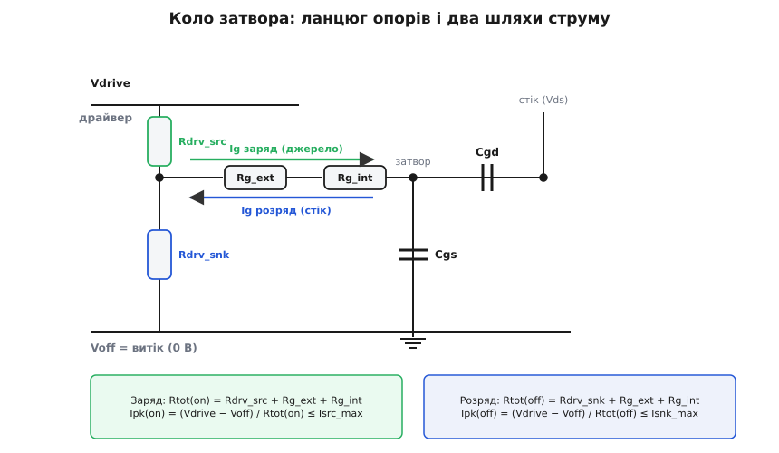
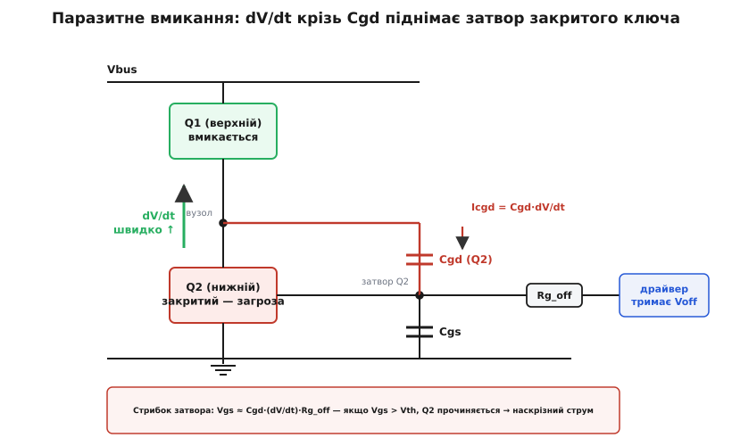

# ⚙️ Калькулятор драйвера затвора: Rg під час перемикання й перевірка пікового струму

### Задача

Перед тобою паспорт силового MOSFET і одна вимога від схеми. Вимога буває у двох виглядах: або «перемикай за стільки-то наносекунд» (щоб укластися в бюджет [втрат перемикання](book:electronics/switching-losses) на робочій частоті), або «не швидше за стільки-то вольтів на наносекунду» (щоб не наробити завад і не пробити ізоляцію крутим фронтом). І те, і те — вимога до **швидкості перекидання напруги на стоці**. З паспорта ти маєш заряд плато Qgd, повний заряд Qg, поріг Vth і крутість gm; лишається дібрати дві речі — **драйвер** (його піковий струм) і **резистор затвора Rg**, — щоб вимога виконалася.

Спокуса зробити це «на око» — прикинути Rg з одного рівняння — і на цьому спинитися. Пастка в тому, що коли ти чіпаєш Rg, разом із ним їдуть **три різні числа**, і вони не збігаються: час перемикання, піковий струм, якого драйвер мусить дати, і швидкість dV/dt, з якою потім доведеться жити. Зменшив Rg удвічі — перемкнув удвічі швидше, але й зажадав удвічі більший пік струму (а він може не влізти в драйвер), і подвоїв dV/dt (а він може прочинити сусідній ключ у напівмості). Тому підбір — це не одне рівняння, а **зв'язана перевірка**: порахувати Rg під ціль, а тоді окремо переконатися, що драйвер витягне пік і на заряд, **і на розряд**, що потужність керування прийнятна, і що отриманий dV/dt безпечний. Саме це й автоматизує калькулятор нижче.

### Ідея

Уся арифметика тримається на одному факті: на плато Міллера напруга затвора **пришпилена** на сталому рівні

```
Vpl = Vth + Id / gm
```

(рівно та Vgs, за якої канал веде саме струм навантаження — це наслідок того, що [крутість gm](book:electronics/transconductance) лінійно зв'язує струм стоку з напругою на затворі понад порогом). А раз Vgs на плато стоїть незмінно, то струм затвора від резисторного драйвера теж сталий, і час перекидання напруги рахується без інтегралів:

```
Ig(на плато) = (Vdrive − Vpl) / Rtot
t_fv         = Qgd / Ig = Qgd · Rtot / (Vdrive − Vpl)
```

Тут Rtot — увесь опір у колі затвора: вихідний опір драйвера плюс зовнішній Rg плюс внутрішній опір затвора самого приладу (той полікремнієвий опір затворної шини, що в паспорті зветься Rg,int — у кремнієвих MOSFET це частки ома, а от у SiC/GaN він вагомий і його не можна викидати). Обертаємо формулу: під заданий t_fv потрібен цілком конкретний Rtot, і зовнішній резистор — це просто те, що лишилося, коли з нього відняти опір драйвера й внутрішній опір затвора.

Далі — те, чого «одне рівняння» не бачить. По-перше, **піковий струм**. Найбільший струм тече не на плато, а на самому старті переходу, коли на Rtot стоїть увесь розмах керування (Vdrive − Voff), а не лише залишок (Vdrive − Vpl). Цей пік мусить уміститися в паспортну стелю драйвера — і **окремо на заряд, окремо на розряд**, бо шляхи різні: вгору затвор штовхає напруга (Vdrive − Vpl), а вниз тягне (Vpl − Voff), і резистори джерела та стоку в драйвера теж часто різні. По-друге, **потужність керування** Qg·(Vdrive−Voff)·f — енергія, яку драйвер щоцикла викидає в тепло, ганяючи заряд Qg туди-сюди. Ось коло, яке рахує калькулятор:


*Модель, яку рахує скрипт. Драйвер — це два опори: Rdrv_src угору до Vdrive (заряд) і Rdrv_snk униз до Voff (розряд). У ряд із ним — зовнішній Rg_ext і внутрішній опір затвора приладу Rg_int. Заряд і розряд бачать різні сумарні опори й різну рушійну напругу, тому час і піковий струм у два боки — різні. Піковий струм = (Vdrive − Voff)/Rtot має вкладатися в паспортну стелю драйвера.*

### Робочий код

Це настільний інженерний розрахунок — його природна мова Python: паспортні дані лягають у прості записи (`dataclass`), а вся логіка — десяток формул і дві перевірки-порівняння. Ніякого гарячого шляху тут немає, рахуємо раз перед тим, як паяти, тож виразність важливіша за швидкодію.

```python
from dataclasses import dataclass


@dataclass
class Mosfet:
    Qgd: float        # Кл — заряд плато Міллера (з паспорта, при робочій Vds)
    Qg: float         # Кл — повний заряд затвора при Vgs = Vdrive
    Vth: float        # В  — поріг
    gm: float         # См — крутість gfs у робочій точці
    Rg_int: float = 0.0   # Ω — внутрішній опір затвора приладу


@dataclass
class Driver:
    Vdrive: float     # В  — рівень ввімкнення
    Voff: float       # В  — рівень вимкнення (0 або від'ємний)
    Rsrc: float       # Ω  — вихідний опір, джерело (pull-up)
    Rsnk: float       # Ω  — вихідний опір, стік (pull-down)
    Isrc_max: float   # А  — паспортний піковий струм, джерело
    Isnk_max: float   # А  — паспортний піковий струм, стік


@dataclass
class Load:
    Id: float         # А  — комутований струм
    Vbus: float       # В  — напруга шини (повний розмах Vds)
    fsw: float        # Гц — частота перемикання


def size_gate_drive(m: Mosfet, drv: Driver, ld: Load,
                    *, t_fv: float = None, dvdt: float = None) -> dict:
    """Підбирає Rg_ext під цільовий час перекидання напруги t_fv (або dV/dt)
    і перевіряє, чи вкладається піковий струм у стелю драйвера — заряд І розряд."""
    Vpl = m.Vth + ld.Id / m.gm                 # напруга плато Міллера
    push = drv.Vdrive - Vpl                     # рушійна напруга на плато (заряд)
    pull = Vpl - drv.Voff                       # рушійна напруга на плато (розряд)
    swing = drv.Vdrive - drv.Voff               # повний розмах на затворі
    if push <= 0:
        raise ValueError("Vdrive нижча за плато — канал не відкриється повністю")

    # ціль → потрібний час перекидання напруги
    if dvdt is not None:
        t_fv = ld.Vbus / dvdt
    elif t_fv is None:
        raise ValueError("задай t_fv або dvdt")

    # 1. який сумарний опір кола дасть цей час на плато
    Ig_need = m.Qgd / t_fv                       # потрібний струм затвора на плато
    Rtot_need = push / Ig_need
    Rg_ext = Rtot_need - drv.Rsrc - m.Rg_int
    feasible = Rg_ext >= 0.0                      # від'ємний → драйвер сам засильний опір
    Rg_ext = max(Rg_ext, 0.0)

    # 2. фактичні часи й dV/dt з обраним (клемпленим) Rg_ext
    Rtot_on = drv.Rsrc + Rg_ext + m.Rg_int
    Rtot_off = drv.Rsnk + Rg_ext + m.Rg_int
    t_on = m.Qgd / (push / Rtot_on)
    t_off = m.Qgd / (pull / Rtot_off)
    dvdt_on = ld.Vbus / t_on
    dvdt_off = ld.Vbus / t_off

    # 3. піковий струм на СТАРТІ переходу (повний розмах на Rtot — найгірша мить)
    Ipk_on = swing / Rtot_on
    Ipk_off = swing / Rtot_off

    # 4. потужність керування (уся з драйверного живлення) і її розклад
    P_drive = m.Qg * swing * ld.fsw
    half = 0.5 * m.Qg * swing * ld.fsw
    P_Rg = half * (Rg_ext / Rtot_on + Rg_ext / Rtot_off)
    P_drv = half * (drv.Rsrc / Rtot_on + drv.Rsnk / Rtot_off)

    # 5. прикидка стрибка затвора сусіда від нашого dV/dt (Cgd ≈ Qgd/Vbus)
    Cgd = m.Qgd / ld.Vbus
    Vgs_bump = Cgd * dvdt_on * Rtot_off

    return dict(Vpl=Vpl, Rg_ext=Rg_ext, feasible=feasible,
                t_on=t_on, t_off=t_off, dvdt_on=dvdt_on, dvdt_off=dvdt_off,
                Ipk_on=Ipk_on, Ipk_off=Ipk_off,
                ok_src=Ipk_on <= drv.Isrc_max, ok_snk=Ipk_off <= drv.Isnk_max,
                P_drive=P_drive, P_Rg=P_Rg, P_drv=P_drv,
                Cgd=Cgd, Vgs_bump=Vgs_bump)


def report(m: Mosfet, drv: Driver, ld: Load, r: dict) -> None:
    verdict = "" if r["feasible"] else "  ← драйвер задорого повільний"
    print(f"Vpl (плато)        = {r['Vpl']:.2f} В")
    print(f"Rg_ext             = {r['Rg_ext']:.2f} Ω{verdict}")
    print(f"t_fv  вмик / вимк  = {r['t_on']*1e9:.1f} / {r['t_off']*1e9:.1f} нс")
    print(f"dV/dt вмик / вимк  = {r['dvdt_on']/1e9:.2f} / {r['dvdt_off']/1e9:.2f} В/нс")
    src = "ok" if r["ok_src"] else "ЗАМАЛА СТЕЛЯ"
    snk = "ok" if r["ok_snk"] else "ЗАМАЛА СТЕЛЯ"
    print(f"Iпік  джерело      = {r['Ipk_on']:.2f} А  (стеля {drv.Isrc_max:.1f} А — {src})")
    print(f"Iпік  стік         = {r['Ipk_off']:.2f} А  (стеля {drv.Isnk_max:.1f} А — {snk})")
    print(f"Потужність керув.  = {r['P_drive']*1e3:.0f} мВт "
          f"(у Rg_ext {r['P_Rg']*1e3:.0f}, у драйвері {r['P_drv']*1e3:.0f})")
    warn = "  ← ПАРАЗИТНЕ ВМИКАННЯ" if r["Vgs_bump"] > m.Vth else ""
    print(f"Стрибок Vgs сусіда = {r['Vgs_bump']:.2f} В  (проти Vth {m.Vth:.1f} В){warn}")


if __name__ == "__main__":
    fet = Mosfet(Qgd=15e-9, Qg=30e-9, Vth=3.0, gm=10.0, Rg_int=1.0)
    drv = Driver(Vdrive=10.0, Voff=0.0, Rsrc=2.0, Rsnk=2.0, Isrc_max=2.0, Isnk_max=2.0)
    ld = Load(Id=10.0, Vbus=48.0, fsw=200e3)

    print("── ціль: t_fv = 20 нс ──")
    report(fet, drv, ld, size_gate_drive(fet, drv, ld, t_fv=20e-9))
    print("\n── ціль: t_fv = 5 нс ──")
    report(fet, drv, ld, size_gate_drive(fet, drv, ld, t_fv=5e-9))
    print("\n── ціль: dV/dt = 5 В/нс ──")
    report(fet, drv, ld, size_gate_drive(fet, drv, ld, dvdt=5e9))
```

Візьмімо той самий прилад, що й на карті заряду: Qgd = 15 нКл, Qg = 30 нКл, Vth = 3 В, gm = 10 См, внутрішній опір затвора Rg,int = 1 Ом. Драйвер помірний — вихідний опір по 2 Ом у кожен бік, паспортна стеля пікового струму 2 А. Комутуємо 10 А на шині 48 В при 200 кГц. Ось що виводить скрипт на три різні цілі:

```
── ціль: t_fv = 20 нс ──
Vpl (плато)        = 4.00 В
Rg_ext             = 5.00 Ω
t_fv  вмик / вимк  = 20.0 / 30.0 нс
dV/dt вмик / вимк  = 2.40 / 1.60 В/нс
Iпік  джерело      = 1.25 А  (стеля 2.0 А — ok)
Iпік  стік         = 1.25 А  (стеля 2.0 А — ok)
Потужність керув.  = 60 мВт (у Rg_ext 38, у драйвері 15)
Стрибок Vgs сусіда = 6.00 В  (проти Vth 3.0 В)  ← ПАРАЗИТНЕ ВМИКАННЯ

── ціль: t_fv = 5 нс ──
Vpl (плато)        = 4.00 В
Rg_ext             = 0.00 Ω  ← драйвер задорого повільний
t_fv  вмик / вимк  = 7.5 / 11.2 нс
dV/dt вмик / вимк  = 6.40 / 4.27 В/нс
Iпік  джерело      = 3.33 А  (стеля 2.0 А — ЗАМАЛА СТЕЛЯ)
Iпік  стік         = 3.33 А  (стеля 2.0 А — ЗАМАЛА СТЕЛЯ)
Потужність керув.  = 60 мВт (у Rg_ext 0, у драйвері 40)
Стрибок Vgs сусіда = 6.00 В  (проти Vth 3.0 В)  ← ПАРАЗИТНЕ ВМИКАННЯ

── ціль: dV/dt = 5 В/нс ──
Vpl (плато)        = 4.00 В
Rg_ext             = 0.84 Ω
t_fv  вмик / вимк  = 9.6 / 14.4 нс
dV/dt вмик / вимк  = 5.00 / 3.33 В/нс
Iпік  джерело      = 2.60 А  (стеля 2.0 А — ЗАМАЛА СТЕЛЯ)
Iпік  стік         = 2.60 А  (стеля 2.0 А — ЗАМАЛА СТЕЛЯ)
Потужність керув.  = 60 мВт (у Rg_ext 13, у драйвері 31)
Стрибок Vgs сусіда = 6.00 В  (проти Vth 3.0 В)  ← ПАРАЗИТНЕ ВМИКАННЯ
```

Три цілі — три різні уроки, і в цьому вся цінність. **Перша ціль, 20 нс,** проходить чисто по двох перших перевірках: Rg_ext = 5 Ом, піки по 1.25 А затишно вкладаються в 2-амперну стелю. Зверни увагу на асиметрію: вимикання (30 нс) повільніше за вмикання (20 нс), хоч резистор той самий. Причина в рушійній напрузі — вгору затвор штовхає Vdrive − Vpl = 6 В, а вниз тягне лише Vpl − Voff = 4 В; менша напруга — менший струм — довший розряд. Це типово, коли вимикаєш у нуль: без від'ємного зсуву вимикання завжди кволіше.

**Друга ціль, 5 нс,** ловить дві біди одразу. Скрипт каже `feasible = False`: щоб дати такий струм, потрібен Rtot менший за власний опір драйвера з внутрішнім затвором (2 + 1 = 3 Ом), а від'ємний зовнішній резистор не буває. Драйвер фізично не може швидше — навіть із Rg_ext = 0 виходить лише 7.5 нс. І паралельно піковий струм вискакує на 3.33 А проти стелі 2 А. Висновок однозначний: 5 нс цим драйвером недосяжні, потрібен сильніший (менший вихідний опір, вища стеля).

**Третя ціль, dV/dt = 5 В/нс,** найпідступніша, бо мовчки провалює саме ту перевірку, яку «одне рівняння» пропускає. По часу все гаразд — Rg_ext = 0.84 Ом дає рівно потрібні 5 В/нс. Але піковий струм — 2.6 А, а стеля драйвера 2 А. Тобто **розрахунок Rg сходиться, а драйвер усе одно не тягне**: він упреться в свою межу струму, реальний фронт вийде повільніший за розрахунковий, і вся картинка попливе. Ось навіщо перевірка пікового струму окремим гейтом — вона ловить те, чого формула часу не показує.

### Складність і пастки

Модель вище лінійна й акуратна, і саме тому в неї є межі, за якими вона починає брехати. Три пастки — у порядку зростання підступності.

**Нелінійність Cgd при малих Vds.** Формула `dV/dt = Vbus / t_fv` дає **середнє** по всьому перекиданню напруги, ніби воно рівномірне. Насправді ні. Ємність затвор–стік (у паспорті — Crss) не стала: коли Vds високе, вона крихітна, а щойно стік валиться до одиниць вольтів, Crss розбухає в десятки, а то й сотні разів. Паспортний Qgd — це вже проінтегрований по всьому обвалу заряд при конкретній напрузі шини, тож він ховає цю нелінійність усередині. Наслідок практичний: реальне dV/dt на **початку** переходу (Vds високе, Cgd мала) помітно крутіше за середнє, а в кінці — пологіше. Для завад і для паразитного вмикання (нижче) важить саме той крутий початок, тож до розрахункового dV/dt закладай запас. І ще: Qgd прив'язаний до тестової Vds — на іншій напрузі шини він інший, тож не бери число з паспорта наосліп, якщо твоя шина далеко від тестової. Глибше про це — у [ємності затвора](book:electronics/gate-capacitance), [вихідній ємності MOSFET](book:electronics/output-capacitance) та [ефекті Міллера](book:electronics/miller-effect).

**Зсув Vth і gm з температурою.** Калькулятор бере паспортні Vth і gm при 25 °C, а ключ працює гарячим. [Поріг MOSFET](book:electronics/mosfet-threshold) має від'ємний температурний коефіцієнт — кілька мілівольтів на градус (типово −2…−7 мВ/°C); нагрівся кристал на сотню градусів — поріг просів на пів вольта й більше. Крутість gm у гарячому приладі теж падає (рухливість носіїв нижча). У напрузі плато ці два зсуви тягнуть у різні боки: Vpl = Vth + Id/gm, і поки Vth падає, доданок Id/gm росте. Але для запасу небезпечний саме **нижчий** поріг: він опускає плато, а нижче плато — легше ненароком прочинити ключ (див. далі). Тож критичні перевірки проганяй на максимальній робочій температурі кристала, а не на кімнатній.

**Паразитне вмикання від власного dV/dt.** Це та причина, чому «швидше» не дорівнює «краще», і чому в першому прикладі стоїть тривожний прапор попри бездоганні час і струм. У напівмості два ключі стоять один над одним. Коли верхній вмикається з тим dV/dt, що ми порахували, спільний вузол між ними стрімко злітає. І цей стрибок напруги крізь ємність Cgd **закритого** нижнього ключа впорскує йому в затвор струм зміщення Icgd = Cgd·dV/dt. Той струм тече крізь опір, яким затвор притиснутий до Voff, і піднімає на ньому напругу:

```
Vgs(стрибок) ≈ Cgd · (dV/dt) · Rg_off
```


*Механізм пастки. Верхній ключ Q1 вмикається швидко — на спільному вузлі велике dV/dt. Крізь Cgd закритого Q2 тече струм зміщення Icgd = Cgd·dV/dt і піднімає його Vgs. Якщо стрибок перевищить поріг Vth, Q2 на мить прочиняється — а це наскрізний струм крізь обидва ключі. Що швидше (більше dV/dt) і що більший опір розряду Rg_off, то вищий стрибок.*

Підставмо числа з «успішного» першого прикладу. Ємність Cgd ≈ Qgd/Vbus = 15 нКл / 48 В ≈ 0.31 нФ; при dV/dt = 2.4 В/нс і опорі розряду 8 Ом стрибок виходить 0.31 нФ · 2.4·10⁹ В/с · 8 Ом ≈ 6 В — удвічі вище за поріг 3 В! Тобто дизайн, що ідеально влучив у 20 нс і має вдосталь пікового струму, **сам себе підпалює**: кожне вмикання верхнього ключа на мить прочиняє нижній, і крізь напівміст б'є наскрізний струм. Ось чому калькулятор рахує цей стрибок і ставить прапор.

Застереження про саму формулу: `Cgd·(dV/dt)·Rg_off` — це **консервативна верхня оцінка**. Вона припускає, що весь струм зміщення йде крізь Rg_off, і нехтує ємністю Cgs, яка частину того струму відводить на себе. Реальний стрибок трохи менший, але для проєктування добре, коли оцінка сувора: якщо навіть верхня межа нижча за Vth із запасом — спиш спокійно.

Що з цим роблять. По-перше, **тримають Rg_off малим** — часто окремим від Rg_on (розщеплений резистор із діодом: угору повільніше, вниз швидко), щоб розряд не додавав опору до стрибка. По-друге, **від'ємний Voff** на вимиканні (−3…−5 В): тоді стрибок мусить подолати не лише поріг, а ще й цю яму, і запас великий. По-третє, **активний затиск** (Miller clamp) — транзистор, що на час небезпеки коротить затвор на витік майже без опору. І по-четверте, більший [dead-time](book:electronics/dead-time), щоб небезпечна мить не наклалася на перемикання партнера. Усе це — окреме мистецтво, надто для швидких приладів на карбіді кремнію й нітриді галію, де dV/dt природно шалене; про нього — у [керуванні затвором SiC і GaN](book:electronics/sic-gan-gate-drive), а про гасіння самих фронтів — у [снаберах і захисті від dV/dt](book:electronics/snubbers-dvdt).

Останнє, чого модель не бачить: **індуктивність кола затвора**. Доріжки й виводи корпусу разом із ємностями затвора утворюють коливальний контур, і за малого Rg він дзвенить — Vgs проскакує вище й нижче наміченого, аж до перевищення гранично допустимої напруги затвора. Тому найменший Rg, що виходить із розрахунку, — не завжди найкращий: інколи його свідомо піднімають, щоб задемпувати цей дзвін. Резистивна модель — правильний перший крок; але біля межі швидкості слово переходить до індуктивності, і тоді до розрахунку додають ще й огляд затвора на осцилографі. Підсумок простий: калькулятор дає тобі відправну точку й три прапори-застороги, а не остаточне число — останнє слово завжди за виміром на живій платі. Драйвер під це число підбираєш серед готових мікросхем — про їхній устрій дивись [драйвер затвора](book:electronics/gate-driver).
