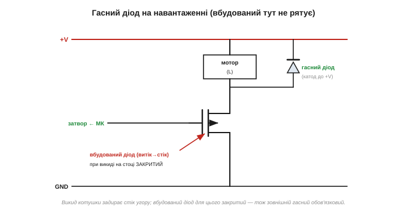
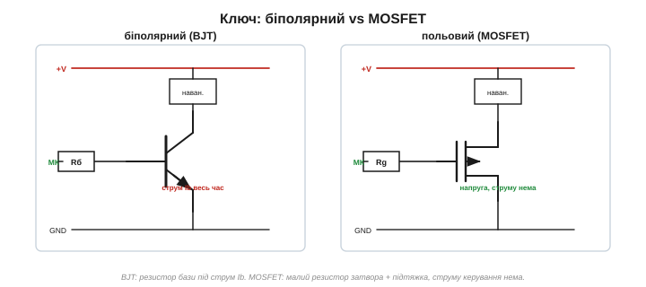

# MOSFET як силовий ключ

Маючи в руках [поріг відкривання](topic:electronics/mosfet-threshold), [типи каналу](topic:electronics/nmos-pmos) та [опір і грійку](topic:electronics/rds-on) MOSFET, з нього можна зібрати **реальний ключ** — схему, якою мікроконтролер вмикає щось потужне: моторчик, світлодіодну стрічку, електромагніт, нагрівач. Це найчастіше застосування MOSFET у саморобній електроніці.

### Класична схема: ключ нижнього плеча на N-каналі

Найпростіший і найпоширеніший варіант — **n-канальний ключ нижнього плеча** *(low-side switch)*, прямий нащадок [біполярного ключа](topic:electronics/bjt-switch):

- **Навантаження** вмикають між **+V** і **стоком**.
- **Витік** — на **землю**.
- **Затвор** — від ніжки мікроконтролера.

Подав мікроконтролер на затвор високий рівень (наприклад, 5 В) — Vgs > Vth, канал відкрився, струм потік крізь навантаження й MOSFET на землю. Подав низький (0 В) — Vgs = 0, канал зник, струм спинився. Навантаження керується «знизу», з боку землі, — звідси й назва. Причина, чому саме знизу й чому [n-канал](topic:electronics/nmos-pmos), проста: NMOS чудово «садить» вузол до землі й зручно керується з мікроконтролера.


*Канонічний low-side ключ. Навантаження між +V і стоком; витік на землю; затвор — від ніжки МК через резистор затвора, плюс підтяжний резистор донизу. Високий рівень на затворі вмикає, низький — вимикає.*

Чому нижнє плече таке зручне? Бо керівна напруга міряється [затвор–витік](topic:electronics/nmos-pmos), а в нижньому плечі витік **прибитий до землі** — він не рухається. Тож 5 В від мікроконтролера на затворі дають рівно Vgs = 5 В, просто й передбачувано. І навантаження тому ставлять між +V і **стоком**, а не під витоком: якби воно висіло під витоком, то, відкриваючись, MOSFET підіймав би витік, Vgs зменшувалася б — ключ сам себе прикривав (та сама «кволість» NMOS згори). Прибитий до землі витік дає затвору повну, незмінну Vgs.

### Дві деталі біля затвора, яких не було в біполярного

Затвор MOSFET — це [конденсатор, що в спокої струму не бере](topic:electronics/field-control). Тому, на відміну від біполярного, тут **не треба** рахувати струм керування й резистор бази під нього. Але з'являються дві інші деталі, специфічні саме для MOSFET.

**Резистор затвора** *(gate resistor)* — невеликий (десятки–сотні ом) резистор **послідовно** із затвором. Навіщо, якщо струму немає? Бо в **мить** перемикання затвор-конденсатор треба зарядити, і без обмеження ніжка МК віддала б різкий кидок струму, а на паразитних індуктивностях виникло б дзвоніння. Резистор затвора **обмежує** цей кидок і гасить дзвін. Він не для сталого струму (його нема), а для **перехідного**. Той самий резистор дає й безкоштовний **плавний пуск**: він трохи сповільнює відкривання, тож навантаження з великою початковою ємністю (довгі світлодіодні стрічки, входи з конденсаторами) вмикаються не різким кидком струму, а м'якше. Більший резистор — повільніше й м'якше; та надто великий шкодить **швидкому** перемиканню, тож тут шукають баланс.

А якщо перемикати треба **часто** — тисячі разів за секунду (керування яскравістю, обертами)? Тоді цей перехідний кидок повторюється безперервно, і для великих MOSFET кволої ніжки МК уже бракує, щоб устигати перезаряджати затвор: ставлять окремий **драйвер затвора** *(gate driver)* — підсилювач, що жене в затвор потужні короткі імпульси. Чому це так важить для [швидкості перемикання й грійки](topic:electronics/gate-capacitance) — окрема велика тема.

**Підтяжний резистор** *(pull-down)* — резистор (10–100 кОм) від затвора **до землі**. Це найважливіша й найчастіше забувана деталь. Поки мікроконтролер не налаштував свою ніжку (під час скидання, увімкнення живлення, перепрошивки), вона висить у **високоомному** стані — нічого не задає. А затвор-конденсатор тримає той заряд, що випадково на нього потрапив, і MOSFET може **сам собою прочинитися** й увімкнути навантаження не до речі. Підтяжний резистор тихо стягує затвор до нуля, тож «коли ніхто не керує — вимкнено».


*Дві деталі біля затвора. Послідовний резистор (десятки–сотні Ом) обмежує кидок струму в мить перемикання. Підтяжний резистор (десятки кОм) до землі тримає затвор у нулі, поки МК його не керує.*

> 🔧 **Навіщо це.** **Плаваючий затвор** *(floating gate)* — класична халепа новачка з MOSFET. Зібрав ключ без підтяжки — і навантаження то вмикається саме, то «залипає», бо затвор-конденсатор тримає випадковий заряд, а ніжка під час старту МК ще не керує. Завжди став підтяжний резистор: для n-канального **донизу** (до землі — щоб у спокої було закрито), для p-канального — **догори** (до +V, бо його вимикає висока напруга на затворі). Кілька десятків кОм — і проблеми як не було.


*Плаваючий затвор. Ліворуч: без підтяжки, поки МК ще не керує (старт, скидання), затвор-конденсатор тримає випадковий заряд — навантаження може ввімкнутися саме. Праворуч: підтяжний резистор стягує затвор до нуля — у спокої надійно вимкнено.*

### Логічний рівень — обов'язково

Тут найболючіше б'є те, що пов'язує [поріг відкривання](topic:electronics/mosfet-threshold) з [опором каналу](topic:electronics/rds-on): керуючи MOSFET від мікроконтролера (3.3 чи 5 В), бери [прилад **логічного рівня**](topic:electronics/logic-level-mosfet), повністю відкритий при твоїй напрузі. Інакше канал прочиниться лише трохи, Rds(on) буде великий, ключ розжариться й, можливо, згорить. Перевіряй у даташиті не сам поріг, а **Rds(on) при твоїй Vgs** — саме цей рядок і відрізняє звичайний IRF540 від [логічних IRLZ44 чи AO3400](topic:electronics/logic-level-mosfet).

> ⚙️ **А чи перегріється.** Як із Rds(on) і струму порахувати температуру кристала за «тепловим законом Ома» (Tj = Tamb + P·θ) і винести вердикт «чи треба радіатор» — в [алгоритмічній вставці «Тепловий розрахунок ключа»](topic:electronics/mosfet-power-switch/proj-thermal-calc.md).

### Індуктивне навантаження — гасний діод

Якщо навантаження індуктивне (моторчик, реле, соленоїд), при вимиканні воно [«брикається» викидом напруги](topic:electronics/inductor-kickback) — і цей викид може пробити MOSFET. Як і з [біполярним ключем](topic:electronics/bjt-switch), рятунок — [**гасний діод**](root:embedded/flyback-protection) паралельно навантаженню, катодом до +V: він замикає викид на себе.

Тут є тонкість, варта уваги. У MOSFET є [**вбудований діод** *(body diode)*](topic:electronics/mosfet-structure) між витоком і стоком. Може здатися, ніби він і захистить від викиду — але **ні**: у схемі нижнього плеча викид від навантаження задирає **стік** угору, а вбудований діод для такої полярності закритий (катод на стоці). Тож **зовнішній гасний діод на навантаженні все одно потрібен** — вбудований діод тут не рятує (він стає в пригоді в інших схемах — мостах, верхньому плечі, при зворотній полярності).


*Для індуктивного навантаження — зовнішній гасний діод паралельно навантаженню (катод до +V). Вбудований діод MOSFET (витік→стік) при викиді на стоці закритий, тож не захищає — зовнішній діод обов'язковий.*

### Верхнє плече: коли треба комутувати «плюс»

Іноді треба розривати не землю, а **+V** (наприклад, щоб геть знеструмити навантаження). Це **верхнє плече** *(high-side)*. Тут зручний [**p-канальний** MOSFET](topic:electronics/nmos-pmos): витік до +V, навантаження під стоком, а вмикають його, **притягнувши затвор до землі** (Vgs стає від'ємним) — просто й без зайвих напруг. Можна й n-канальний у верхньому плечі (він ефективніший), але йому на затвор треба напругу **вищу за +V**, а її доводиться добувати окремою схемою — **зарядовою помпою** *(charge pump)* чи драйвером. Тому для простого вимикача живлення беруть PMOS, а N-канал угорі — там, де потрібна гранична ефективність.


*Нижнє плече: NMOS, витік до землі, вмикає високий рівень на затворі. Верхнє плече: PMOS, витік до +V, вмикає притягування затвора до землі. P-канал у верхньому плечі — найпростіший шлях комутувати «плюс».*

Гарний побічний фокус: MOSFET — чудовий **захист від зворотної полярності** живлення. Звичайний діод послідовно теж захистив би, але [спадав би на собі ~0.7 В і грівся](root:embedded/flyback-protection) (на 3 А це аж 2.1 Вт проти 0.18 Вт на самозміщеному P-MOS). А MOSFET, увімкнений «назустріч» струму, за правильної полярності сам відкривається й проводить майже без втрат (лише Rds(on)!), а за зворотної — лишається закритим. Виходить [«**ідеальний діод**»](topic:electronics/ideal-diode) зі спадом у мілівольти замість вольта; саме тому його — самого чи з [мікросхемою-контролером](topic:electronics/ideal-diode) — часто й ставлять на вході живлення пристроїв.

### Порівняння з біполярним ключем

Поставмо поряд два ключі — [біполярний](topic:electronics/bjt-switch) і MOSFET, — щоб різниця вляглася.

- **Біполярний:** керується **струмом**; резистор бази рахують під потрібний Ib = Ic/β; струм керування тече весь час, поки ключ відкритий; спад на ключі — сталі ~0.2 В.
- **MOSFET:** керується **напругою**; резистор затвора малий і потрібен лише для перехідного кидка; струму керування в спокої немає; спад — Id·Rds(on), часто менший за біполярний; додають підтяжку проти плаваючого затвора.

Для більшості сучасних задач MOSFET-ключ зручніший і холодніший — тому він і став **типовим** ключем у саморобній електроніці. Біполярний лишається там, де він і так під рукою, або для зовсім дрібних навантажень.


*Біполярному в базу ллють струм (резистор бази під Ib); MOSFET керується напругою (резистор затвора + підтяжка, струму керування нема). MOSFET зазвичай холодніший і простіший у керуванні.*

Цей скромний ключ — насправді робоча конячка всієї силової електроніки. Тим самим прийомом мікроконтролер вмикає й вимикає геть усе: світло, нагрівачі, помпи, моторчики, клапани. А коли його перемикати **швидко** й керувати **часткою** часу у ввімкненому стані (широтно-імпульсна модуляція, ШІМ — *PWM*), той самий ключ плавно регулює яскравість світла, оберти мотора чи напругу перетворювача — і майже не гріється, бо у відкритому стані спад малий, а в закритому струму нема. Саме на MOSFET-ключах побудовано драйвери моторів у будь-якій рухомій техніці.

### Зберімо приклад докупи

Хай треба вмикати з 5-вольтового мікроконтролера **моторчик 12 В / 2 А**. Збираємо low-side ключ:

```
1) MOSFET: n-канальний, ЛОГІЧНОГО РІВНЯ (повністю відкритий при Vgs = 5 В)
   Id(max) ≥ 2·2 = 4 А;   Vds(max) > 12 В + запас на викиди (бери ≥ 30 В)
2) затвор: послідовний резистор ~100 Ом  +  підтяжка 10 кОм до землі
3) навантаження (мотор) між +12 В і стоком; витік на землю
4) гасний діод паралельно мотору (катод до +12 В)
5) грійка: при Rds(on) ≈ 20 мОм →  P = Id²·Rds(on) = 4 · 0.02 = 0.08 Вт (холодний)
```

П'ять кроків — і надійний ключ на копійчаних деталях, що холодно жене два ампери. Із поширених логічного рівня під таку задачу годяться, наприклад, IRLZ44N (наскрізний TO-220) чи дрібний AO3400 у корпусі SOT-23 для менших струмів. Назви запам'ятовувати не треба — досить уміти прочитати в даташиті Id(max), Vds(max) і Rds(on) при потрібній Vgs. Зверніть увагу: у цьому розрахунку **струм затвора не фігурує** (його нема) — дбають лише про логічний рівень, підтяжку й гасний діод. Якби струм був більший або MOSFET — не логічного рівня, грійка вийшла б помітна, і знадобився б радіатор (чи прилад із меншим Rds(on)). Але для мирних кількох амперів логічного рівня MOSFET у дрібному корпусі впорається без жодного радіатора — і це типова картина в саморобних схемах.

У шумних чи високовольтних колах до набору додають ще одну деталь — захисний [**стабілітрон**](root:embedded/zener-schottky) між затвором і витоком: він не дає напрузі на [тонкому оксиді затвора](topic:electronics/mosfet-structure) перевищити безпечну межу й пробити затвор статикою чи викидом. Для мирних 5 В від мікроконтролера він не потрібен, але в силових драйверах — звична осторога.

> 🔧 **Навіщо це.** Запам'ятайте «джентльменський набір» MOSFET-ключа нижнього плеча: **(1)** логічного рівня під вашу напругу; **(2)** резистор затвора (десятки–сотні Ом); **(3)** підтяжка донизу (десятки кОм); **(4)** гасний діод, якщо навантаження індуктивне; **(5)** перевірена грійка P = Id²·Rds(on). Пропустиш підтяжку — ключ «живе своїм життям»; пропустиш гасний діод на моторі — раніше чи пізніше пробитий MOSFET; візьмеш не логічного рівня — грітиметься. Усі чотири граблі добре відомі — і легко обходяться.

Цей ключ вмикають **повільно** — увімкнув і тримай. А коли MOSFET перемикають **швидко** — тисячі й мільйони разів за секунду, щоб керувати яскравістю, обертами чи будувати перетворювач живлення, — на сцену виходить затвор-конденсатор: його щоразу треба перезаряджати, і це водночас обмежує [швидкість перемикання](topic:electronics/gate-capacitance) й додає втрат. Але для простого вмикача, що працює в режимі «увімкнув і забув», зібраного «джентльменського набору» цілком достатньо.
