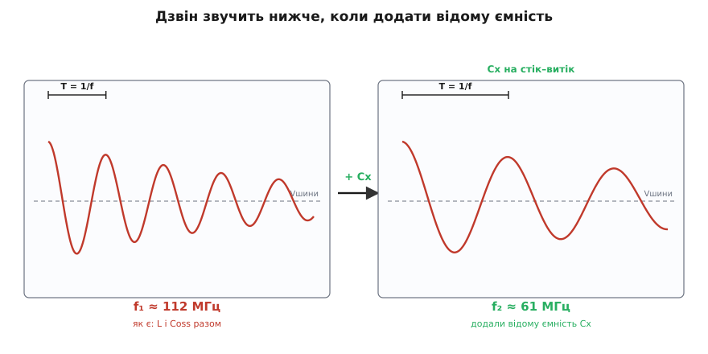

# 🧮 Дзвін на стоку як вимірювальний прилад

Паразитний дзвін на стоку зазвичай проклинають: він світить в ефір, розгойдує затвор, з'їдає запас до пробою. Але той самий дзвін несе точний звіт про плату. Його висота, частота й тривалість — це прямі показання паразитної індуктивності петлі й вихідної ємності ключа, яких на схемі немає і яких лінійкою не зміряти. Треба лише вміти прочитати осцилограму. Тут зібрано весь апарат: чому контур узагалі коливається, які чотири числа випадають із двох паразитних величин, і — головне — як з двох осцилограм витягти паразитну L петлі й Coss ключа окремими цифрами, а не здогадом.

## Чому стік дзвенить

Коли ключ обриває струм, на стоці лишаються дві причаєні деталі, яких немає на принциповій схемі: **індуктивність силової петлі** L (уся та мідь навколо гарячого контуру) і **вихідна ємність самого ключа** [Coss](topic:electronics/output-capacitance) — паразитний конденсатор стік–витік, що складається з ємностей p–n-переходів усередині транзистора й тримається на стоці завжди. Індуктивність і ємність, з'єднані в кільце, — це коливальний контур, той самий [LC-резонанс](topic:electronics/lc-resonance), що й у радіоприймачі, тільки небажаний і на сотнях мегагерц.

Чому взагалі коливання, а не тихе згасання? Бо енергії нікуди подітися, і вона переливається туди-сюди. У котушці енергія живе в магнітному полі: ½·L·I². У конденсаторі — в електричному: ½·C·V². Коли струм у петлі рветься, магнітна енергія не зникає миттєво — вона перетікає в ємність, заряджаючи її; напруга росте, струм падає до нуля. Тоді напрямок міняється: заряджений конденсатор жене струм назад у котушку, електрична енергія знову стає магнітною. Без утрат це тривало б вічно — енергія гойдалась би між L і C, як маятник між висотою й швидкістю. Дзвін контуру — це буквально дзвін: удар, потім чиста нота, що поволі стихає.

Аналогія з дзвоном точна аж до трьох незалежних характеристик звуку, і кожна прив'язана до фізичної величини:

- **як сильно вдарили** — це швидкість обриву струму di/dt; чим різкіше, тим вищий викид;
- **висота тону** — це частота коливань, задана добутком L·C; більший контур звучить нижче;
- **як довго дзвенить** — це згасання, задане втратами (опором) у контурі.

Де аналогія ламається: справжній дзвін гасне через тертя й випромінювання звуку, а контур — через **активний опір** міді, каналу ключа та еквівалентного послідовного опору конденсатора. Саме цей опір визначає, дзвенітиме контур п'ять періодів чи затихне за півперіоду. Розберімо всі три числа по черзі — а тоді обернемо їх на прилад.

## Викид: висота удару

Найпростіше число — висота першого стрибка напруги. Коли струм в індуктивності змінюється, вона відповідає напругою за законом [брикання котушки](topic:electronics/inductor-kickback):

```
V = L · di/dt
```

Це напруга, якою котушка «упирається» проти зміни струму, і вона додається до напруги шини. Порахуймо для звичайного кремнієвого ключа.

**Петля 10 нГн; струм 10 А спадає до нуля за 20 нс.**

```
di/dt = 10 А / 20·10⁻⁹ с = 5·10⁸ А/с
V_викид = L · di/dt = 10·10⁻⁹ · 5·10⁸ = 5 В
```

Ключове тут — **лінійність по L**. Індуктивність петлі приблизно пропорційна площі, яку петля охоплює: розтягнеш контур удвічі — L зросте приблизно вдвічі. А раз викид V = L·di/dt при тому самому di/dt прямо пропорційний L, то **удвічі менша площа петлі дає удвічі менший викид**. Це не гасло розводки, а рядок арифметики: єдиний важіль, за який тягне вся боротьба за компактну петлю, — це множник L у цій формулі. Стисни петлю з 20 нГн до 10 нГн — і 10 В викиду стануть 5 В, без жодної зміни в самому транзисторі.

Але є тонкість, яка колись здивує кожного, хто перейде з кремнію на карбід кремнію чи нітрид галію. Формула V = L·di/dt описує **повільний** обрив — коли фронт спаду довший за власний період контуру. Якщо ж ключ рубає струм майже миттєво, вступає інший механізм: уся магнітна енергія ½·L·I² вивалюється в ємність одним поштовхом, і напруга злітає, доки не зрівняються енергії:

```
½·L·I² = ½·C·ΔV²   →   ΔV = I · √(L/C)
```

Для тих самих 10 А і контуру 10 нГн / 200 пФ це дало б ΔV = 10·√(10·10⁻⁹ / 200·10⁻¹²) ≈ 70 В — на порядок більше за скромні 5 В повільного обриву. Що ж вирішує, який із двох механізмів працює? Порівняння часу спаду t_спад із власним масштабом часу контуру √(L·C). Прирівнявши обидва викиди, дістаємо межу:

```
L · I/t_спад = I · √(L/C)   →   t_спад = √(L·C) = 1/(2π·f_дзвону)
```

Для нашого контуру √(L·C) ≈ 1.4 нс. Кремнієвий ключ із фронтом 20 нс сидить глибоко в «повільному» боці — його викид 5 В, лінійний по L. А GaN-ключ із фронтом 1 нс перескакує межу й потрапляє в «енергетичний» режим, де викид рветься до I·√(L/C). Ось чому надшвидкі ключі дзвенять непропорційно люто на тій самій платі — і чому для них крихітна петля не розкіш, а умова виживання. Хороша ж новина одна для обох режимів: **обидва викиди спадають, коли ти зменшуєш L**. Стиснута петля лікує будь-який.

## Тон: частота дзвону

Тепер друге число — частота, з якою напруга гойдається. Її дає формула, яку 1853 року вивів **Вільям Томсон (лорд Кельвін)**, аналізуючи коливальний розряд лейденської банки через дротину: він показав математично, що розряд не монотонний, а осцилює, і знайшов частоту. Ця сама формула носить його ім'я (доказовий статус: усталений факт, той самий Кельвін, чиє [чотирипровідне підключення](topic:electronics/kelvin-connection) прибирає спільну індуктивність витоку в цій-таки розводці):

```
f_дзвону = 1 / (2π·√(L·C))
```

Підставмо наші паразити.

**Петля L = 10 нГн; вихідна ємність ключа Coss = 200 пФ.**

```
L·C   = 10·10⁻⁹ · 200·10⁻¹² = 2·10⁻¹⁸ с²
√(L·C) = 1.414·10⁻⁹ с
f     = 1 / (2π · 1.414·10⁻⁹) = 1 / (8.886·10⁻⁹) ≈ 1.13·10⁸ Гц ≈ 112 МГц
```

Сто дванадцять мегагерц — типова нота силового ключа середньої руки; практика дає діапазон приблизно 30–150 МГц для петель 20–100 нГн і ємностей 50–200 пФ. Зверни увагу на структуру формули: частота залежить від L і C **симетрично й лише через їхній добуток**. Це і благословення, і прокляття. Прокляття — бо з однієї виміряної частоти ти **не можеш** розділити L і C: контур 10 нГн/200 пФ і контур 40 нГн/50 пФ дзвенять на тій самій ноті, а плати за ними геть різні. Благословення — бо саме симетрія добутку робить можливим той трюк розділення, до якого ми зараз дійдемо: доклавши відому ємність, ми зсунемо частоту передбачувано й тим виміряємо кожну величину нарізно.

## Характеристичний опір і згасання

Третє число не так очевидне, але саме воно зв'язує все докупи — **характеристичний опір контуру**:

```
Z₀ = √(L/C)
```

```
Z₀ = √(10·10⁻⁹ / 200·10⁻¹²) = √50 ≈ 7.1 Ом
```

Що це фізично? Це «обмінний курс» між струмом і напругою в дзвоні. Коли контур коливається, амплітуда напруги й амплітуда струму зв'язані саме через Z₀: V = Z₀·I. Той самий Z₀ ми вже бачили в енергетичному викиді — ΔV = I·√(L/C) — це і є I·Z₀: різко обірваний струм I породжує стрибок напруги, що дорівнює струмові, помноженому на характеристичний опір. Z₀ — це наскільки сильно контур гойдає напругою у відповідь на струм.

І він-таки керує **згасанням**. Дзвін гасне через послідовний активний опір контуру R (мідь, канал, ESR конденсатора). У послідовному RLC огинальна коливань спадає як e^(−α·t), де α = R/(2L), а безрозмірний коефіцієнт згасання (наскільки контур близький до критичного демпфування):

```
ζ = R / (2·Z₀)
```

Ось чому Z₀ — центральна величина. Мала індуктивність і велика ємність дають малий Z₀; тоді навіть скромний опір R легко доганяє ζ до одиниці й гасить дзвін за один-два періоди. Великий Z₀ (велика L, мала C — саме гаряча петля!) робить контур високодобротним: той самий R дає крихітне ζ, і дзвін тягнеться довго. Добротність контуру Q = Z₀/R, а число видимих періодів дзвону приблизно Q/π.

**Контур 10 нГн / 200 пФ (Z₀ = 7.1 Ом); паразитний опір петлі R ≈ 0.5 Ом.**

```
ζ = R / (2·Z₀) = 0.5 / (2·7.1) = 0.035     (майже без згасання)
Q = Z₀ / R     = 7.1 / 0.5   ≈ 14
періодів ≈ Q/π ≈ 4…5
```

Слабко демпфований контур продзвенить чотири-п'ять періодів — саме те, що видно на осцилограмі як довгий «хвіст». Щоб убити його свідомо, ставлять [снабер](topic:electronics/snubbers-dvdt): додають послідовний опір, який доганяє ζ до ~0.5, і дзвін гасне за пів-періоду. Скільки саме опору? Правило випливає прямо звідси: R_снабера ≈ Z₀. Тобто, знаючи Z₀, ти не тицяєш номінали навмання, а розраховуєш демпфер під конкретний контур. Але щоб узнати Z₀, треба спершу розділити L і C — а їх ховає симетрія добутку. Розв'язання цієї загадки і є головний прийом.

## Дзвін як прилад: виміряти L і Coss

Отут апарат перестає бути теорією й стає викруткою в руках. Проблема поставлена чітко: осцилограф легко дає **частоту** дзвону f₁, але це одне рівняння з двома невідомими —

```
f₁ = 1 / (2π·√(L·C₀))
```

де L — паразитна індуктивність петлі, а C₀ — вихідна ємність ключа (плюс дрібка ємності монтажу на тому вузлі). Одне рівняння, двоє невідомих: система недовизначена, і жодною хитрістю з єдиної осцилограми L та C₀ не роз'єднати.

Вихід класичний для будь-якої недовизначеної системи: додати **друге незалежне рівняння**. І дає його елегантний фізичний хід — причепити **відому** ємність Cx прямісінько на стік–витік, паралельно до Coss, і зміряти нову, нижчу частоту:

```
f₂ = 1 / (2π·√(L·(C₀ + Cx)))
```

Індуктивність L та сама (мідь петлі не змінилася), Cx ми знаємо точно (взяли якісний плівковий конденсатор). Тепер це двоє рівнянь із тими самими двома невідомими — система розв'язується.



*Той самий контур звучить нижче, коли додати ємність — і саме величина цього зсуву видає обидва паразити нарізно.*

Розділимо квадрати рівнянь, щоб згорнути невідомі. Піднесімо обидві частоти до квадрата й поділімо:

```
(f₁ / f₂)² = (L·(C₀ + Cx)) / (L·C₀) = (C₀ + Cx) / C₀ = 1 + Cx/C₀
```

Індуктивність скоротилася сама — лишилося чисте рівняння на C₀. Розв'язуємо:

```
Cx / C₀ = (f₁/f₂)² − 1

C₀ = Cx / [ (f₁/f₂)² − 1 ]
```

А знайшовши C₀, повертаємось до першого рівняння по індуктивність:

```
L = 1 / [ (2π·f₁)² · C₀ ]
```

Двоє паразитів, яких не бачить схема й не бере лінійка, тепер виражені через дві виміряні частоти й один відомий конденсатор. Проженімо крізь числа.

**Виміряно f₁ = 112 МГц; причепили Cx = 470 пФ; виміряли f₂ = 61.5 МГц.**

```
(f₁/f₂)² = (112 / 61.5)² = 1.821² = 3.32
C₀ = Cx / [(f₁/f₂)² − 1] = 470·10⁻¹² / (3.32 − 1) = 470·10⁻¹² / 2.32 ≈ 203 пФ

2π·f₁      = 2π · 112·10⁶ = 7.04·10⁸ рад/с
(2π·f₁)²   = 4.95·10¹⁷
L = 1 / [ (2π·f₁)² · C₀ ] = 1 / (4.95·10¹⁷ · 203·10⁻¹²) ≈ 1 / (1.00·10⁸) ≈ 10 нГн
```

Осцилограф і один конденсатор видали **Coss ≈ 200 пФ** і **L петлі ≈ 10 нГн** — окремими числами. Тепер видно й характеристичний опір Z₀ = √(L/C) ≈ 7 Ом, а отже й номінал снабера, і чи петля тісна (10 нГн — добре), чи розхлябана.


*Дві точки на кривій f(C) визначають її повністю — бо форму задають рівно два параметри, L і C₀.*

Є й швидкий варіант без калькулятора — **метод половинної частоти** (його описав Руді Севернс у класичних нотатках про снабери). Додавай Cx, доки частота не впаде рівно вдвічі. Раз f ∝ 1/√C, половинна частота означає вчетверо більшу повну ємність; отже, ти долив рівно 3·C₀, і **C₀ = Cx/3**. Для нашого контуру f впаде до 56 МГц, коли Cx досягне 600 пФ, звідки C₀ = 200 пФ — і далі L за формулою. Зручно прикинути в умі просто біля стенда.

Три застороги, без яких прилад бреше:

- **Cx має бути «чистою» ємністю на цій частоті.** Плівковий чи C0G-конденсатор із власною [резонансною частотою](topic:electronics/self-resonant-frequency) сильно вище за дзвін; електроліт чи великий X7R самі перетворяться на індуктивність на сотні МГц і зіпсують f₂.
- **Cx паяй просто на виводи ключа**, туди, де сидить Coss. Довгі щупи додають свою індуктивність у ту саму петлю — тоді ти зміряєш не L контуру, а L контуру плюс своїх дротів, і L вийде завищеною.
- **Осцилограф і щуп мусять брати частоту.** Смуга приладу — щонайменше вп'ятеро вища за f₁ (для 112 МГц це смуга від ~500 МГц), а земля щупа — коротка пружина, а не довгий «крокодил», бо його індуктивність теж домалює до контуру фальшивий дзвін.

## Замкнути коло: число замість здогаду

Навіщо весь цей апарат, коли платі й так «наче працює»? Бо він перетворює розводку з мистецтва на вимір. Три речі, які раніше були відчуттям, стають цифрами.

По-перше, **оцінка петлі**. Виміряна L = 10 нГн — це присуд якості розводки: тісна петля. Побачив 40 нГн — знаєш, що є де стискати, і на скільки. По-друге, **перевірка правки наживо**. Стиснув петлю на платі, перепаяв — і зміряв дзвін знову: частота **зросла** (L упала), а викид **упав рівно в тій самій пропорції**, як обіцяла формула V = L·di/dt. Зв'язок «удвічі менша петля — удвічі менший викид» перестає бути вірою: ти бачиш його на екрані як зсув частоти вгору й падіння стрибка. По-третє, **снабер за розрахунком**. Знаючи L і C₀, береш Z₀ = √(L/C) і ставиш опір снабера R ≈ Z₀, а ємність — кілька Coss; демпфер лягає на контур точно, а не грілкою навмання.

Уся краса в тому, що вадa сама себе виказує. Дзвін, який псує EMC-звіт і загрожує затвору, — це той-таки сигнал, з якого ти витягаєш паразити, що його породжують. Досить навчитися читати ноту: її висота — це L·C, її зсув під відомою ємністю — це L і C нарізно, а її тривалість — це Z₀ і опір контуру. Осцилограф, один конденсатор і три формули перетворюють найдратівливіший артефакт силового ключа на найточніший звіт про плату, який у тебе є.
