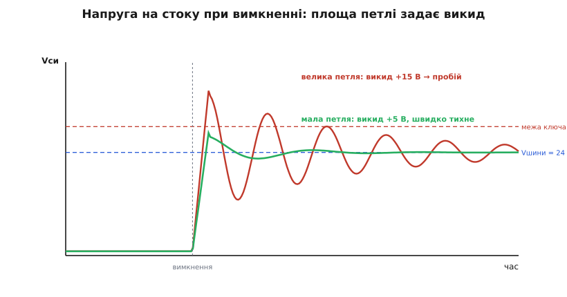
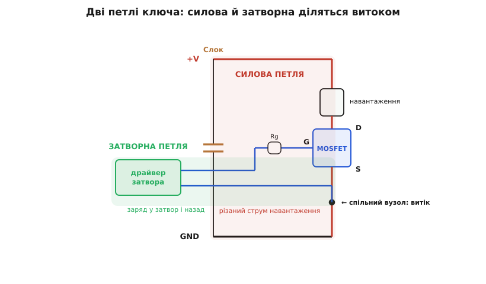
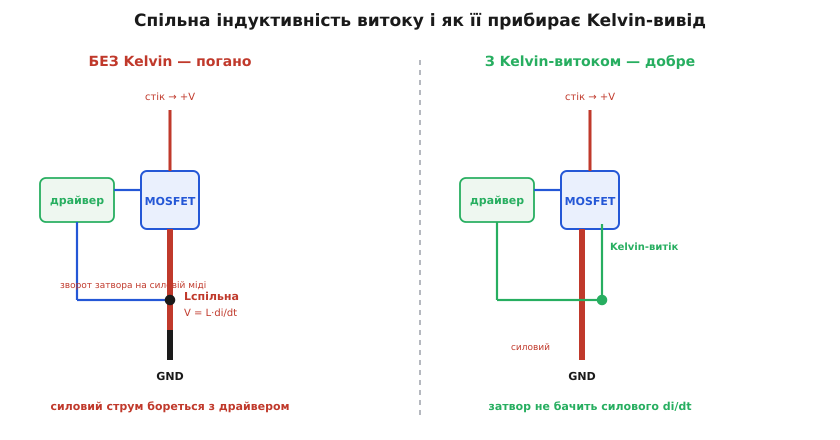
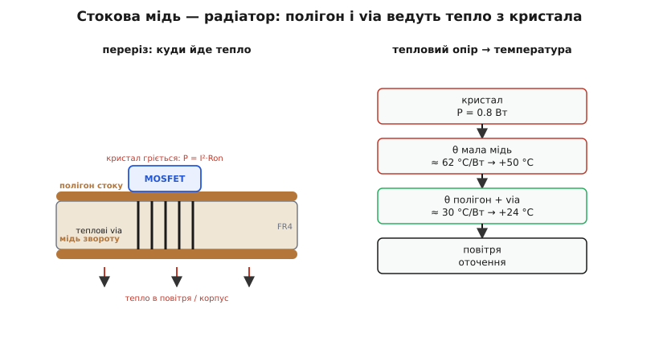

# Розводка плати для MOSFET-ключа

<preknowlist>
- [MOSFET як силовий ключ](topic:electronics/mosfet-power-switch) — транзистор проводить між стоком і витоком, коли на затворі напруга понад поріг; у відкритому стані має опір Ron.
- [Драйвер затвора](topic:electronics/gate-driver) — мікросхема, що швидко заганяє й вигрібає заряд із затвора струмом у кілька ампер.
- [Ємність затвора](topic:electronics/gate-capacitance) — затвор поводиться як конденсатор; увімкнути ключ швидко означає впхнути в нього заряд за десятки наносекунд.
- [Індуктивність](topic:electronics/inductance) — будь-який контур зі струмом має індуктивність; що більша площа контуру, то вона більша.
- [Брикання котушки](topic:electronics/inductor-kickback) — V = L·di/dt: різко обірвати струм в індуктивності означає породити викид напруги.
</preknowlist>

На принциповій схемі MOSFET-ключ — це три ідеальні дроти: стік, витік, затвор. Керуєш затвором — стік із витоком то з'єднуються, то роз'єднуються. Схема нічого не каже про те, **де** ці дроти лежать на платі. І саме тут ховається різниця між платою, що тихо працює роками, і платою, яка дзвенить, гріється й пробиває затвор на тому самому транзисторі з того самого даташита.

Причина одна, і вона фізична. Уся робота ключа — це **різко переривати струм**. Не плавно вести, як підсилювач, а рвати: щойно був десяток ампер, а за двадцять наносекунд — нуль. Кожен шматок міді на платі — це маленька котушка. А різкий струм у котушці за законом V = L·di/dt перетворюється на напругу. Розводка — це не косметика; це те, наскільки малими ти зробив ці паразитні котушки навколо найшвидших змін струму. Від неї прямо залежить, скільки вольтів викиду сяде на стік, як сильно дзвенітиме затвор і чи вивітриться тепло зі стоку.

## Чому мідь — не дріт

Візьмемо конкретне число, бо саме число тут переконує. Доріжка міді має індуктивність приблизно 1 нГн на кожен міліметр довжини — тонка залежність від ширини, але порядок такий. Контур зі струмом у пару сантиметрів довжиною легко набирає 10 нГн. Здається дрібницею. Порахуймо, що з неї виходить під час вимкнення.

**Ключ вимикає 10 А на шині 24 В; струм спадає до нуля за 20 нс; паразитна індуктивність силового контуру 10 нГн.**

```
di/dt = 10 А / 20 нс = 0.5 А/нс = 5·10⁸ А/с
V_викид = L · di/dt = 10·10⁻⁹ · 5·10⁸ = 5 В
V_пік    = 24 В + 5 В = 29 В
```

Транзистор на 30 В опиняється на самому краю. Розтягни контур утричі — до 30 нГн — і викид стане 15 В, а пік 39 В: це вже за межею, лавинний пробій, ключ мертвий. Той самий транзистор, та сама схема; змінилося тільки те, як далеко лежить конденсатор від ключа. Ба більше — цей викид не просто підскакує й гасне: паразитна котушка контуру разом із вихідною ємністю самого ключа (Coss) утворюють коливальний контур, і напруга на стоку **дзвенить** на сотні мегагерц, світячи цим дзвоном в ефір як антена.



*Різниця між живим і мертвим ключем — це площа однієї петлі на платі.*

> 🔧 **Навіщо це.** У даташиті поруч зі «зразковою схемою» дрібним шрифтом стоїть «залежить від розводки». Це не відмовка виробника. Одна й та сама специфікація ключа на акуратній і на недбалій платі дає різницю між «працює» і «димить». Розводка — частина схемотехніки, а не окреме малювання доріжок наприкінці.

## Дві петлі, що вирішують усе

У ключа є рівно дві ділянки, де струм змінюється швидко, а отже де паразитна індуктивність болить. Знайди їх — і половину роботи зроблено.

**Силова (комутаційна) петля** — це коло, яким тече той самий різаний струм навантаження. Він не береться нізвідки: у момент увімкнення ключа заряд миттєво віддає **локальний конденсатор** біля ключа, а не далеке джерело — бо дроти до джерела надто «індуктивні», щоб устигнути. Тож петля замикається так: конденсатор → стік → витік → назад до конденсатора (через землю навантаження). Саме тут di/dt найбільше, і саме площа цієї петлі задає викид, який ми щойно рахували. Правило одне: [конденсатор-накопичувач](topic:electronics/decoupling) ставимо **впритул** до стоку й витоку, щоб петля була крихітною. Ця сама логіка живить і розведення імпульсних [перетворювачів](topic:electronics/converter-layout), де «гарячу петлю» тиснуть так само.

**Затворна петля** — це коло, яким драйвер керує затвором: вихід драйвера → затворний резистор → затвор, і назад через витік до землі драйвера. Затвор — конденсатор; щоб перемкнути ключ за десятки наносекунд, драйвер жбурляє в нього кілька ампер за ці наносекунди. Отже, у затворній петлі теж своє di/dt. Якщо ця петля велика, напруга на затворі **дзвенить**: може підскочити вище порога й хибно ввімкнути ключ, який ти щойно вимкнув, або вилетіти за Vgs(max) і пробити тонкий підзатворний оксид назавжди. Правило дзеркальне: [драйвер](topic:electronics/gate-driver) — якнайближче до транзистора, а доріжки затвора й затворного звороту ведемо **поруч, вузькою парою**, щоб петля була тонка.



*Обидві петлі ділять один вузол — витік. Кожну треба зробити малою, і тут вони починають заважати одна одній.*

## Спільний витік: тиха пастка

Тепер найтонше, і саме воно валить більшість перших плат. Погляньмо на рисунок ще раз: обидві петлі — силова й затворна — замикаються через **той самий витік**. Якщо в тебе один вивід витоку (чи одна доріжка), яким тече і потужний струм навантаження, і зворотний струм затвора, то індуктивність цього спільного шматка міді породжує на ньому напругу від **силового** струму — а ця напруга сидить якраз між справжнім витоком кристала й землею драйвера.

Порахуймо, що вона робить.

**Спільна ділянка витоку 3 нГн; силовий струм змінюється з тим самим di/dt = 0.5 А/нс.**

```
V_витік = L_спільна · di/dt = 3·10⁻⁹ · 5·10⁸ = 1.5 В
```

Ці 1.5 В **віднімаються** від напруги, якою драйвер керує затвором. Драйвер хоче закрити ключ, а силовий струм через спільний витік підпихає затвор назад — класичний від'ємний зв'язок, що гальмує перемикання й розгойдує затвор. На драйві в 10 В це 15% спотворення. А на швидких ключах із карбіду кремнію чи нітриду галію, де di/dt сягає 5 А/нс, той самий 3-нГн витік дасть уже 15 В — більше за весь корисний розмах. Ключ просто не керується.

Ліки називаються **Kelvin-джерело** (на честь [чотирипровідного підключення Кельвіна](topic:electronics/kelvin-connection)): зворот затвора беремо з окремої точки на витоку, якою **не** тече силовий струм. Багато сучасних силових MOSFET мають для цього окремий четвертий вивід — «source-sense» або Kelvin-витік. На платі це означає: землю драйвера ведемо саме до цього сигнального виводу витоку, а товсту силову мідь витоку лишаємо силовому струму. Дві петлі перестають ділити індуктивність — і затвор більше не бачить силового di/dt.



*Один зайвий вивід на корпусі й одна окрема доріжка прибирають найпідступніше гальмо перемикання.*

## Земля й зворотний струм

Струм завжди повертається до джерела — питання лише, **яким шляхом**. На високих частотах він тече не найкоротшою лінією, а тією, що охоплює найменшу площу: просто **під власною доріжкою**, якщо під нею є суцільна мідь. Тому найкращий зворот для силового й затворного струмів — [суцільний полігон землі](topic:electronics/current-return-path) прямо під ключем і драйвером. Розріж цей полігон щілиною поперек шляху струму — і зворот змушений обходити її, розтягуючи петлю й повертаючи всі викиди, яких ми позбувалися. Правило просте: під гарячими петлями земляна мідь має бути цілою, а сигнальна земля (наприклад, до мікроконтролера) сходиться з силовою в одній точці — біля Kelvin-витоку, — а не блукає крізь ділянку, де тече різаний струм.

## Тепло: мідь як радіатор

Ключ гріється навіть коли просто відкритий. У відкритому стані на ньому падає I²·Ron, і ця потужність гріє кристал безперервно; перемикання додає ще. Тепло треба кудись подіти — а в поверхневому (SMD) транзисторі майже все тепло виходить **через стокову площадку** в мідь плати. Отже, мідний полігон стоку — це і є радіатор.

**Ключ веде 10 А, Ron = 8 мОм.**

```
P_провід = I² · Ron = 10² · 0.008 = 0.8 Вт
```

Менше вата — та поглянь, як розводка перетворює її на температуру. Гола SMD-площадка без полігону має тепловий опір «кристал–повітря» θ_JA близько 62 °C/Вт: 0.8 Вт дадуть +50 °C над оточенням, гаряче. Розлий під стоком полігон площею пару квадратних сантиметрів, проший його [тепловими перехідними отворами](topic:electronics/thermal-vias) до міді на звороті плати — і θ_JA впаде десь до 30 °C/Вт, тобто +24 °C. Той самий кремній, удвічі холодніший — самою лише міддю. Коли ват стає більше, під площадку садять уже зовнішній [радіатор](topic:electronics/heatsink), але й тоді дорога тепла до нього починається з тієї ж стокової міді.

Скільки саме міді треба під конкретний струм і цільову температуру — а заразом яка ширина силової доріжки й скільки викиду дасть петля — зручно прикинути [невеликим калькулятором розводки](topic:electronics/mosfet-switch-layout/proj-loop-inductance-budget.md): він оцінює індуктивність петлі з її геометрії, потрібну ширину доріжки під струм і площу полігону під заданий θ_JA.



*Стокова площадка — не просто контакт, а вхід у радіатор; трактувати її як звичайний вивід — і плата гріється дарма.*

> 🔧 **Навіщо це.** Тепловідвід і швидкодія тягнуть розводку в різні боки: тепло хоче багато міді на стоку, а мала силова петля — щоб та мідь була компактною. Хороша плата задовольняє обидва: полігон стоку широкий убік радіатора, але вузький і короткий там, де замикається гаряча петля.

## Приборкати залишковий дзвін

Навіть із крихітними петлями трохи індуктивності лишається, і разом із Coss вона дзвенить. Дві ручки гасять цей дзвін. Перша — **затворний резистор**: більший опір уповільнює фронти, зменшує di/dt, а отже й викид та дзвін; платиш за це більшими [втратами перемикання](topic:electronics/switching-losses), бо ключ довше сидить у напівпровідному стані. Друга — **[снабер](topic:electronics/snubbers-dvdt)**: RC- або RCD-ланка на стоку–витоку, що демпфує коливальний контур. Але порядок дій незмінний: спершу зроби петлі малими, і лише потім гаси залишок. Снабер на велику петлю — це грілка, що маскує погану розводку, а не лікує її. До речі, частота цього дзвону — безкоштовний вимірювач: за нею можна [оцінити паразитну індуктивність контуру](topic:electronics/mosfet-switch-layout/math-loop-ring.md) прямо з осцилограми.

Якщо ключ ще й міряє струм шунтом у витоку, підключай шунт [по-кельвінівськи](topic:electronics/kelvin-shunt): чотири виводи, дві сигнальні доріжки від самих виводів шунта, — інакше сенс потоне у силовому падінні напруги на тій самій міді. І тримай шунт поза затворним зворотом, щоб не воскресити спільну індуктивність, яку ми щойно прибрали.

Коли ключ комутує не 24 В, а мережу чи сотні вольтів, до всього додається ще одна вимога — **[зазори](topic:electronics/creepage-clearance)** між стоковою й затворно-витоковою міддю, щоб напруга не пробила проміжок по поверхні плати. Вона тягне мідь **розсунути**, тобто прямо проти правила малої петлі, — і хороша плата на високій напрузі завжди є балансом між цими двома силами.

## Складаємо докупи

Уся розводка MOSFET-ключа зводиться до однієї послідовності думки. Знайди, **де струм рветься** — це силова петля; зроби її крихітною, поставивши накопичувальний конденсатор упритул. Знайди, **де жене заряд драйвер** — це затворна петля; зроби тонкою її, підсунувши драйвер до затвора. Розв'яжи ці дві петлі там, де вони діляться витоком, окремим Kelvin-виводом. Дай стоку широкий полігон із via — це радіатор. Дай зворотним струмам суцільну землю, щоб вони текли під своїми доріжками. І тільки те, що лишилося дзвеніти, гаси затворним резистором і снабером. Той самий транзистор, що на недбалій платі гріється й пробивається, на такій — працює тихо, холодно й довго.
