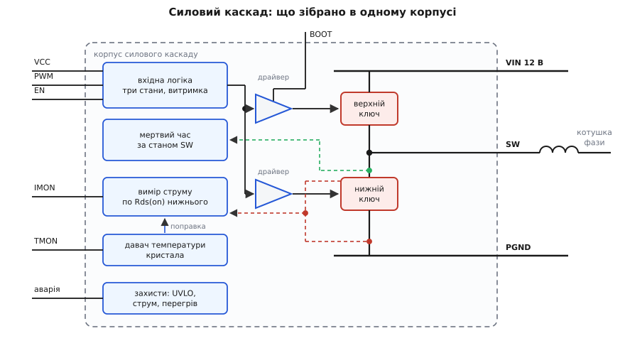
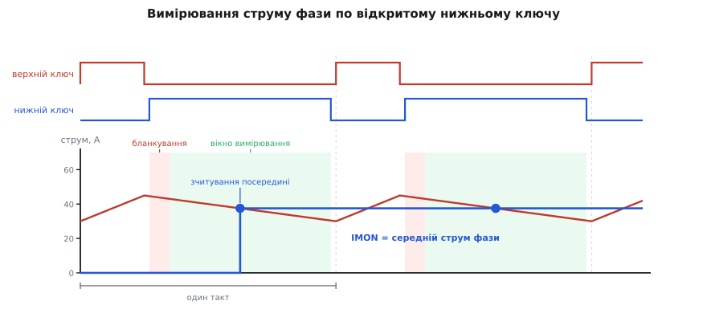

# 🔌 Силовий каскад (smart power stage)

> Силовий каскад — клас мікросхем, у корпусі яких зібрана вся силова частина однієї фази понижувального перетворювача: драйвер, верхній і нижній ключі, а в «розумному» різновиді ще й вимірювачі струму та температури з набором захистів. Далі — чому ці частини мусять жити в одному корпусі (відповідь не «щоб було компактніше»), як каскад виглядає з боку ніжок, що вішати на кожну з них, як його вперше вмикати й де він найчастіше кусає.

## Чому драйвер і ключі не можна лишити нарізно

Спокуслива відповідь — заради місця на платі. Справжня жорсткіша: на цих струмах і фронтах **дроти між драйвером і ключем коштують більше, ніж самі ключі**.

Почнімо з опору. Нижній ключ фази процесорного живлення має [Rds(on)](topic:electronics/rds-on) порядку одного міліома — це вже межа того, що дає кремній у такому корпусі. Тепер порахуймо коротку доріжку, якою ми хотіли б з'єднати два розсипні транзистори:

```
доріжка в міді 35 мкм (1 унція), ширина 5 мм, довжина 10 мм:
  R = ρ · L / (w · t)
    = 1.72·10⁻⁸ · 0.010 / (0.005 · 35·10⁻⁶)
    ≈ 0.98 мОм
```

Один сантиметр широкої доріжки дорівнює цілому ключу. А в розсипній схемі таких відрізків кілька, та ще й виводи корпусів і зварні дротики всередині них. Тобто половину виграшу від дорогого низькоомного транзистора з'їдає розводка ще до того, як схема запрацює — і це підтверджує галузева практика: коли Rds(on) наближається до міліома, сумарний опір дротиків, виводів і коротких доріжок стає величиною того самого порядку.

Далі — індуктивність, і тут набагато гірше, бо працюють дві різні петлі. Перша — **петля затвора**: вихід драйвера → затвор → витік → назад у драйвер. Драйвер хоче загнати в затвор ампери за одиниці наносекунд, а індуктивність опирається саме швидкій зміні струму:

```
петля затвора розсипом ≈ 5 нГ, драйвер жене 4 А за 5 нс:
  V = L · di/dt
    = 5·10⁻⁹ · 4 / (5·10⁻⁹)
    = 4 В
```

Із п'яти вольт живлення затвора петля забирає чотири — на власне заряджання затвора майже нічого не лишається. Фронт розтягується, ключ повзе через лінійну зону, [втрати перемикання](topic:electronics/switching-losses) стрибають, а [заряд затвора](topic:electronics/mosfet-gate-charge), за який заплачено, не встигає перекачатися. Усередині ж корпусу та сама петля — це міліметри зварного дроту, десяті частки наногенрі.

Друга петля — **комутаційна**: вхідний конденсатор → верхній ключ → спільна точка SW → нижній ключ → назад у конденсатор. Коли верхній ключ відмикається, увесь струм фази стрибком переходить із нижнього ключа у верхній, і саме на цій петлі народжується викид напруги:

```
комутація 40 А за 4 нс  →  di/dt = 10¹⁰ А/с

розсипом, петля ≈ 3 нГ:   V = 3·10⁻⁹ · 10¹⁰ = 30 В → на 12 В шині пік ≈ 42 В
у корпусі, петля ≈ 0.5 нГ: V = 0.5·10⁻⁹ · 10¹⁰ = 5 В → пік ≈ 17 В
```

Тридцять вольт викиду вбивають ключ, розрахований на 25–30 В, і водночас це та сама енергія, що дзвенить і випромінюється на всю плату. Отже петля комутації — не питання охайності [розводки](topic:electronics/mosfet-switch-layout), а те, що визначає, транзистор якого класу взагалі виживе. Загнати цю петлю всередину корпусу — єдиний спосіб зробити її по-справжньому малою.

І останнє: **пара ключів навмисно нерівна**. Верхній при вихідній напрузі близько вольта відкритий десяту частину такту — усе його життя це перемикання, тож його оптимізують на малий заряд затвора. Нижній провадить майже весь такт — його оптимізують на малий опір. Оскільки більший кристал дає менший опір, але більший заряд затвора, ці дві вимоги тягнуть у різні боки, і транзистори роблять різного розміру. Купуючи силовий каскад, ви купуєте не «два транзистори», а вже підібрану під певний струм і частоту пару разом із драйвером, який знає їхні часи.

Історія назв тут коротка й документована. У 2004 році Intel описала пристрій класу **DrMOS** (*driver + MOSFET*) — драйвер і два ключі в корпусі QFN 8×8 мм на 56 виводів; редакція 3.0 у 2007-му звузила його до 6×6 мм і 40 виводів, і закріпилася на ринку саме вона. Той ранній DrMOS був «нерозумним»: він перемикав, але майже нічого не повідомляв — [блокування за низькою напругою](topic:electronics/uvlo) та сигнал перегріву, і все. Коли в корпус додали вимірювання струму й температури фази та повний набір захистів, за класом закріпилася назва **smart power stage** — це галузева назва класу від виробників, а не окремий стандарт, тож набір «розумних» функцій у різних сімействах різниться.

## Що всередині корпусу


*Усередині корпусу — шість функційних блоків. Вхідна логіка розбирає трирівневий сигнал PWM; драйвер верхнього ключа живиться від bootstrap-конденсатора між ніжкою BOOT і спільною точкою SW; блок мертвого часу стежить за затворами й за SW, щоб ключі ніколи не були відкриті разом; вимірювач струму знімає падіння на відкритому нижньому ключі, а давач температури кристала дає поправку до цього вимірювання й заразом виводиться назовні.*

**Вхідна логіка** читає один-єдиний сигнал керування, у якому закодовано три команди, а не дві. Висока напруга — відкрити верхній ключ, низька — відкрити нижній, а середня смуга — «обидва закриті». Цей третій стан — не порожнеча між одиницею й нулем, а повноцінна команда, і саме на ньому найчастіше спотикаються.

**Драйвер верхнього ключа** мусить плавати: витік верхнього транзистора — це вузол SW, який щотакту стрибає від нуля до вхідних дванадцяти вольтів. Щоб тримати затвор на потрібні кілька вольтів **вище за витік**, драйверу потрібне живлення, прив'язане до SW, — його дає [bootstrap-конденсатор](topic:electronics/bootstrap-capacitor) між ніжкою BOOT і SW, який підзаряджається щоразу, коли SW притиснуто до землі відкритим нижнім ключем. Діод підзарядки в силових каскадах зазвичай уже вбудований у кристал драйвера, тож зовні лишається тільки конденсатор. Команду з «земляної» логіки в цей плаваючий домен переносить [зсув рівня](topic:electronics/high-side-level-shift).

**Блок мертвого часу** — найтихіший, але один із найцінніших мешканців корпусу. [Пауза між вимиканням одного ключа й вмиканням другого](topic:electronics/dead-time) обов'язкова: перекриття означає коротке замикання вхідної шини крізь обидва транзистори. Але кожна зайва наносекунда паузи — це провідність [вбудованого діода](topic:electronics/body-diode) нижнього ключа з падінням близько вольта:

```
пауза 20 нс на кожен із двох переходів, fsw = 800 кГц, I = 40 А, Vf ≈ 0.8 В:
  частка часу під діодом = 2 · 20·10⁻⁹ · 800·10³ = 0.032
  P = Vf · I · 0.032 = 0.8 · 40 · 0.032 ≈ 1.0 Вт
```

Ват на фазу — і це лише за паузу. Зовнішній контролер мусив би задавати її «з запасом» наосліп; каскад натомість бачить напругу на власних затворах і на SW із наносекундною роздільністю і скорочує паузу до фізично безпечного мінімуму. Це та вигода інтеграції, яку не купиш охайною розводкою: вимірювати треба **поруч із кристалом**.

**Захисти** живуть там само й спрацьовують швидше, ніж встиг би зовнішній контролер: блокування, поки живлення драйвера не піднялося (напівживий драйвер відкриває ключ у лінійну зону — вірна смерть), обмеження струму, вимикання за перегрівом, виявлення пробою верхнього ключа. Усе це має сенс саме тому, що поруч є власні давачі.

## Струм і температура: звідки каскад їх бере


*Поки відкрито нижній ключ, він — просто резистор, і падіння на ньому пропорційне струмові котушки. Одразу після ввімкнення сигнал дзвенить, тож перші десятки наносекунд відкидають (бланкування). Зчитування беруть посередині решти інтервалу — саме там миттєве значення трикутної пульсації дорівнює її середньому. Між тактами результат утримується, тож IMON — ступінчаста лінія, оновлювана раз на такт.*

Ідея вимірювання проста до зухвалості: **шунта немає**. Поки нижній ключ відкритий, він і є вимірювальний резистор — падіння на ньому дорівнює I·Rds(on), і жодних додаткових втрат вимірювання не додає. Але за цю дармівщину доводиться платити трьома ускладненнями, і кожне з них видно на ніжках каскаду.

Перше: сигнал крихітний і сидить на вузлі, який щойно пролетів дванадцять вольтів. Сорок ампер на міліомі дають сорок мілівольт — на тлі дзвону після комутації це ніщо. Тому перші десятки наносекунд після ввімкнення нижнього ключа вимірювач просто заплющує очі (**бланкування**), і лише потім бере значення.

Друге: опір відкритого каналу залежить від температури, причому сильно — у кремнієвого ключа він зростає приблизно на пів відсотка на градус, тож від 25 °C до 125 °C виростає в півтора раза. Вимірювання без поправки дало б ось що:

```
калібровано при 25 °C:  Rds = 1.0 мОм → 40 А дають 40 мВ → «40 А» ✔
той самий струм при 125 °C: Rds = 1.5 мОм → 40 А дають 60 мВ → «60 А» ✘
```

Півтора раза помилки — тобто контролер вирішив би, що ця фаза перевантажена, і зняв би з неї струм, віддавши його холоднішим сусідкам. Щоб цього не сталося, каскад **мусить** знати температуру власного кристала й вносити на неї поправку. Ось чому давач температури всередині — не бонус: він частина вимірювача струму. А коли давач уже є, вивести його показ назовні коштує однієї ніжки — так з'являється TMON.

Третє: нижній ключ провадить не весь час, отже й вимірювати можна лише у вікні його провідності, а між вікнами — тримати останнє значення. Але точку зчитування обрано не абияк. У режимі безперервного струму котушка дає трикутну пульсацію: поки відкрито нижній ключ, струм лінійно спадає від верхівки Iв до низу Iн. Середина цього спуску дає рівно (Iв + Iн)/2 — а це й є середній струм фази за весь такт:

```
середина інтервалу провідності нижнього ключа:
  i(середина) = (Iв + Iн)/2 = середнє за такт
```

Одне зчитування на такт — і контролер має чисте середнє, без залежності від глибини пульсації. Красиво, але має ціну: інформація про струм фази оновлюється **раз на такт**, не частіше. Тому контур балансування фаз принципово повільніший за саме перемикання, а на різкому стрибку струм фази контролер бачить із запізненням до одного періоду.

Є й межа, за якою вікно вимірювання стискається. Пригляньмося до двох режимів на частоті 1 МГц:

```
такт T = 1 мкс
12 В → 1.0 В: D = 0.083, нижній ключ відкритий 0.92 мкс
               мінус бланкування 0.1 мкс → 0.82 мкс на вимірювання
12 В → 9.0 В: D = 0.75,  нижній ключ відкритий 0.25 мкс
               мінус бланкування 0.1 мкс → лишається 0.15 мкс
```

У процесорному живленні з його D ≈ 0.08 місця вдосталь — саме тому спосіб там і закріпився. А от у каскаді, що працює з великим коефіцієнтом заповнення чи на дуже високій частоті, вікно з'їдається бланкуванням, і точність падає.

Назовні все це виходить двома аналоговими лініями. IMON віддає струм фази в масштабі одиниць мілівольт на ампер (типово близько 5 мВ/А), TMON — температуру кристала з опорною точкою близько 0.8 В при 25 °C і нахилом близько 8 мВ/°C. TMON кількох каскадів прийнято зливати на одну спільну лінію: перемагає найвища напруга, тож контролер завжди бачить **найгарячішу** фазу — а саме вона й вирішує, чи час знижувати струм.

> 🔧 **Навіщо це.** Обираючи каскад, дивіться не лише на струм і опір. Масштаб IMON у мВ/А задає, з якою похибкою контролер зможе рівняти фази між собою; ширина бланкування разом із робочим коефіцієнтом заповнення каже, чи взагалі лишиться вікно для вимірювання; а наявність внутрішньої температурної поправки вирішує, чи буде показ струму правдою на гарячій платі. Каскад без TMON цілком робочий — але це означає, що поправку доведеться робити комусь іншому або не робити зовсім.

## Цоколівка: чотири родини ніжок

Виводів у корпусі багато — кілька десятків, — але майже всі вони належать до чотирьох груп, і всередині групи їх просто дублюють заради струму й тепла.

| родина | типові позначення | що це насправді |
|---|---|---|
| силові | VIN, SW (PHASE), PGND | стік верхнього ключа, спільна точка ключів, витік нижнього. Це не «ніжки», а великі площадки з десятками паралельних виводів |
| живлення драйвера | VCC, VDRV, BOOT | живлення логіки й драйверів (часто окремо для затворів) і плаваюче живлення верхнього драйвера |
| керування | PWM, EN, SMOD | трирівнева команда перемикання, дозвіл роботи каскаду, дозвіл діодного режиму на малому струмі |
| телеметрія | IMON (CS), TMON, прапорець аварії | середній струм фази, температура кристала, сигнал спрацювання захисту |

Окремо варто знати про **тепловідвідні площадки**: їх зазвичай три — під верхнім ключем, під нижнім і під драйвером, тож усередині одного корпусу живуть три різні температури кристалів. Тепло звідси йде не в повітря, а вниз, у мідь плати: [тепловий опір](topic:physics/thermal-resistance) від кристала до плати малий, а від плати до повітря — уже ваша відповідальність.

## Що вішати навколо

**Вхідні керамічні конденсатори — впритул до площадок VIN і PGND.** Та частина комутаційної петлі, яку не вдалося сховати в корпус, лежить саме тут, і кожен зайвий міліметр повертає нам щойно пораховані вольти викиду. Це найважливіший елемент [розведення перетворювача](topic:electronics/converter-layout) навколо каскаду — важливіший за все інше разом.

**Розв'язка живлення драйвера — прямо на ніжці.** Драйвер бере струм не рівно, а сплесками по кілька ампер на кожен фронт; якщо [розв'язувальний конденсатор](topic:electronics/decoupling) стоїть за сантиметр, ці сплески перетворяться на просідання живлення затворів і на шум по всій платі.

**Bootstrap-конденсатор** рахують від заряду затвора верхнього ключа й допустимого просідання плаваючого живлення:

```
Qg верхнього ключа ≈ 15 нКл, допустиме просідання BOOT–SW: ΔV = 0.2 В
  C ≥ Qg / ΔV = 15·10⁻⁹ / 0.2 = 75 нФ  →  ставлять 0.1 мкФ
```

Ставити набагато більше немає сенсу: конденсатор має встигати перезарядитися за короткий інтервал провідності нижнього ключа. Докладний розрахунок із усіма запасами розписано окремо: [розмір bootstrap-конденсатора](topic:electronics/bootstrap-capacitor/math-bootstrap-sizing.md).

**Котушку — впритул до SW.** Мідь вузла SW — це завжди компроміс: широкої треба, щоб винести тепло й струм, вузької — щоб менша площа розмахувала дванадцятьма вольтами за наносекунди й менше [шуміла](topic:electronics/switching-noise) на сусідів.

**IMON і TMON — тонкі аналогові лінії на мілівольтах.** Вести їх треба подалі від SW і від котушки, повертати до тихої землі контролера, а не до силової. На IMON зазвичай ставлять конденсатор фільтра: більший — спокійніший показ, але й повільніший, а ця лінія лежить усередині контуру балансування фаз, тож зайва інерція там дорого коштує.

**PGND — це силовий вивід, а не опорна точка.** Крізь нього течуть десятки ампер із наносекундними фронтами, тож потенціал цієї площадки сам по собі стрибає. Землю контролера прив'язують окремо, до тихого місця, інакше [підстрибування землі](topic:electronics/ground-bounce) з'явиться прямо на вході логіки.

## Перше вмикання

Порядок нижче навмисно обережний: більшість смертей силового каскаду трапляється саме на першому вмиканні й за три-чотири мікросекунди.

1. **Спершу без силової напруги.** Подайте лише живлення драйвера (VCC), тримаючи вхід керування в третьому стані або каскад вимкненим по EN. Перевірте VCC на самій ніжці — не на роз'ємі.
2. **Перевірте плаваюче живлення.** Напруга між BOOT і SW має бути близькою до VCC мінус падіння на вбудованому діоді. Якщо її немає — bootstrap-конденсатор ще не заряджався: він набирається лише тоді, коли SW притиснуто до землі відкритим нижнім ключем, а в третьому стані обидва ключі закриті. Тому перший імпульс керування має бути «низьким» (увімкнути нижній ключ), і лише наступний — «високим».
3. **Знижена вхідна напруга.** Подайте на VIN не дванадцять вольтів, а п'ять, повісьте невелике навантаження й запустіть кілька відсотків заповнення на помірній частоті.
4. **Дивіться на SW осцилографом — і тільки коротким заземленням.** Довгий «крокодил» щупа сам стає витком у полі комутації й домалює вам десятки вольтів дзвону, яких у схемі немає; це окрема тема — [щуп осцилографа](topic:electronics/scope-probe) і [вимірювання перетворювача](topic:electronics/converter-measure). У правильній картинці ви побачите прямокутник із невеликим викидом і — головне — коротку сходинку **нижче нуля** перед вмиканням нижнього ключа: це провадить його вбудований діод, і ширина цієї сходинки і є той самий мертвий час.
5. **Звірте IMON.** Поставте стабільний струм навантаження, зміряйте його кліщами чи шунтом і порівняйте з напругою на IMON: нахил має збігтися з паспортним, а при вимкненій фазі лінія має лягати в нуль.
6. **Звірте TMON.** Кімнатна температура має дати опорне значення, легкий нагрів — рух із паспортним нахилом. Тільки після цього піднімайте VIN до повного й віддавайте керування контролерові.

## Типові граблі

**Третій стан — це стан, а не «нема сигналу».** Смуга третього стану — це реальний діапазон напруг посередині логічного розмаху, і вхід каскаду входить у неї не миттєво, а після витримки (типово близько 160 нс), щоб не спіймати шумовий викид. Наслідок парадоксальний: **повільні фронти сигналу керування небезпечні**. Якщо фронт повзе через середню смугу довше за витримку, каскад щиро вирішує, що йому наказали закрити обидва ключі, і пропускає такт. Тому лінію керування ведуть короткою, а її фронти бережуть як зіницю ока.

**Скидати фазу треба третім станом, а не логічним нулем.** Різниця фатальна. Нуль означає «відкрити нижній ключ» — і вузол SW опиняється намертво притиснутим до землі. Тоді на котушці, під'єднаній до виходу, стоїть напруга −Vвих, і струм у ній розганяється в зворотний бік без жодного обмеження: вимкнена начебто фаза перетворюється на навантаження, що качає заряд із виходу в землю. Третій стан закриває обидва ключі, і фаза справді відходить убік.

**IMON бреше на перехідному процесі — і це не дефект.** Він дискретний: одне зчитування на такт. Поки контролер розганяє всі фази разом, показ струму кожної відстає на такт, і намагатися будувати за IMON швидкий контур напруги марно — це лінія для повільних задач: балансу фаз, обмеження струму, телеметрії.

**Bootstrap-конденсатор треба поповнювати.** Якщо фазу надовго вимкнули (а на малому навантаженні їх саме так і скидають), плаваюче живлення повільно стікає через витоки й власне споживання драйвера. Повернувшись у роботу з недозарядженим BOOT, каскад відкрив би верхній ключ не до кінця — тобто в лінійну зону з великим опором і миттєвим перегрівом. Саме тому в каскаді є окреме блокування за напругою BOOT–SW, а контролер, повертаючи фазу, часто спершу дає їй «низький» імпульс — підзарядитися.

**Від'ємний дзвін на SW.** У мертвий час струм котушки йде крізь вбудований діод нижнього ключа, тож SW стоїть на пів вольта нижче за землю; індуктивність решти петлі додає до цього ще й дзвін. Якщо SW пірне занадто глибоко, разом із ним пірне й опорна точка плаваючого домену, а зсув рівня отримає напругу, на яку не розрахований. Лікують це тим самим — короткою петлею й охайною керамікою на вході, іноді ще й невеликим послідовним опором у ланцюзі BOOT, щоб пригасити коливання.

**Тепловідвідні площадки — це і є радіатор.** Порожнина в припої під нижнім ключем не «трохи погіршує тепловідведення», а вмикає замкнене коло: гарячіший ключ має більший опір, більший опір дає більше тепла. Внутрішня температурна поправка врятує показ струму, але не сам кристал — тому [теплові перехідні отвори](topic:electronics/thermal-vias) під площадками й контроль оплавлення тут не косметика.

## Різновиди класу

Найпростіший різновид — той самий «нерозумний» драйвер із ключами, без телеметрії. Він дешевший, і струм фази тоді доводиться міряти зовні — найчастіше по активному опору обмотки котушки, [DCR-методом](topic:electronics/dcr-current-sense), із власним ланцюжком RC і власною температурною поправкою. Виходить те саме, тільки роботу з корпусу перекладено на плату.

Далі каскади різняться тим, що вміють робити на малому струмі. Ніжка дозволу діодного режиму велить нижньому ключу не проводити зворотний струм — тобто вдавати діод і не давати котушці качати заряд назад, коли [струм стає переривчастим](topic:electronics/ccm-dcm-boundary). Без цього режиму фаза на малому навантаженні дарма ганяє струм туди-сюди; з ним [синхронний випрямляч](topic:electronics/sync-rectifier) на малому струмі поводиться як звичайний діод, і холостий хід дешевшає.

Ще щільніший різновид — модуль, у якому разом із каскадом запакована й котушка. Петлі стають найкоротшими з можливих, місця треба найменше, але індуктивність тепер задана виробником — свободи налаштувати фазу під свій транзієнт більше немає.

Окремим сімейством стоять каскади на [нітриді галію](topic:electronics/gallium-nitride-switch). Там інтеграція перестає бути оптимізацією й стає умовою: припустимий розмах напруги на затворі значно вужчий, ніж у кремнієвого ключа, а фронти ще коротші — тож зайві наногенрі зовнішньої петлі затвора вже не просто псують ККД, а виводять затвор за межу. Драйвер мусить сидіти на тому самому кристалі або впритул до нього.

Нарешті, каскади розрізняють за струмом — від приблизно двадцяти п'яти до дев'яноста ампер на фазу — і саме ця цифра, а не габарит корпусу, визначає, скільки їх знадобиться. Але паспортний струм каскаду завжди прив'язаний до умов тепловідведення: без тієї міді, яку виробник мав на увазі, ці ампери лишаються на папері.
